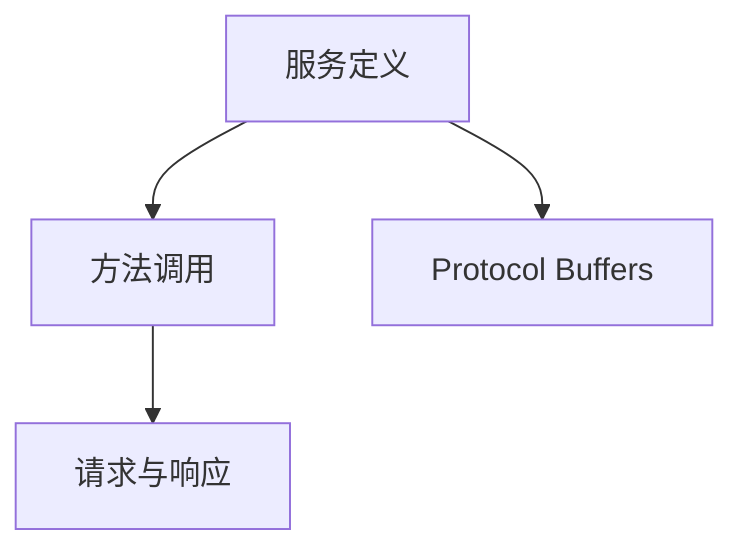
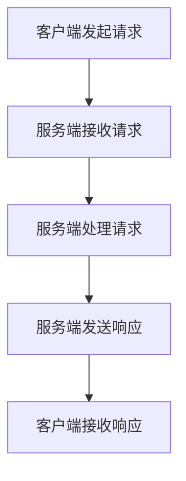
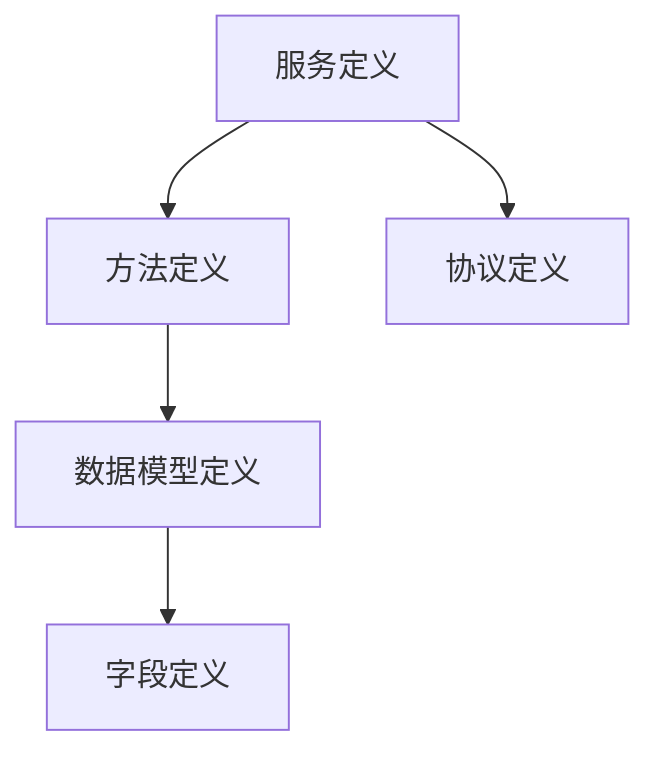
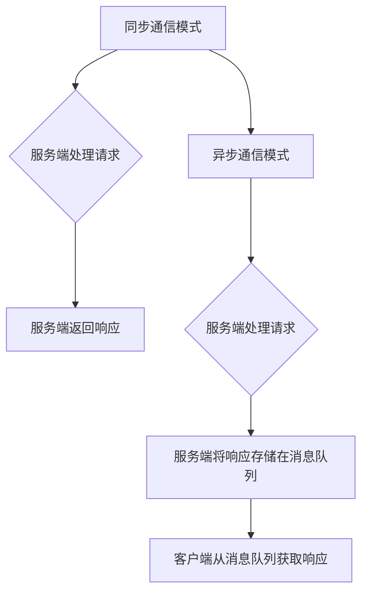
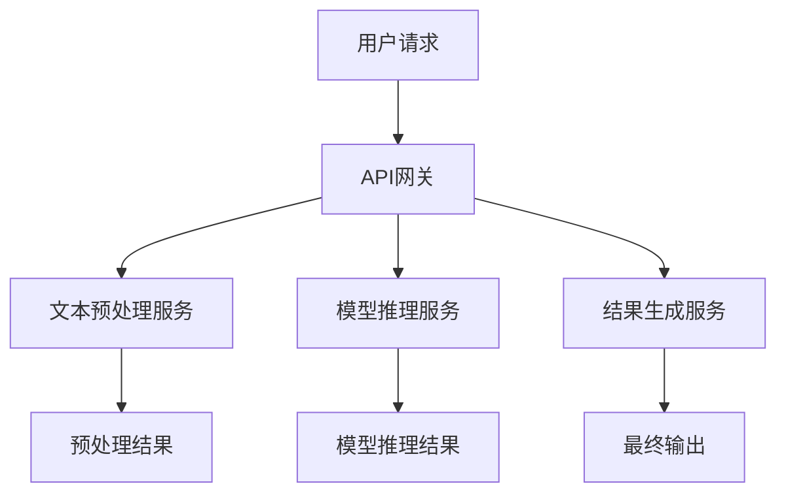
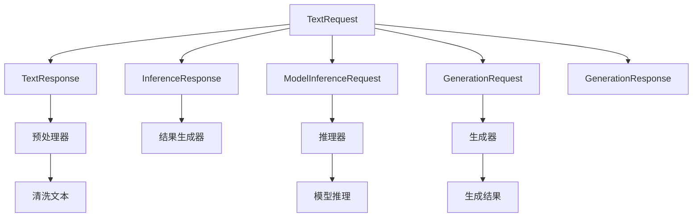
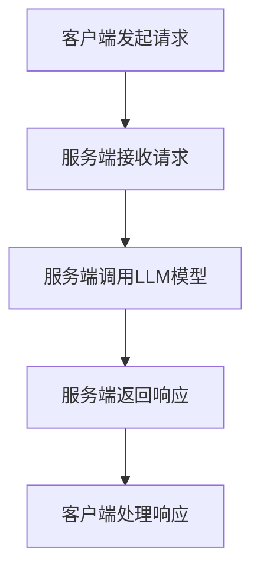
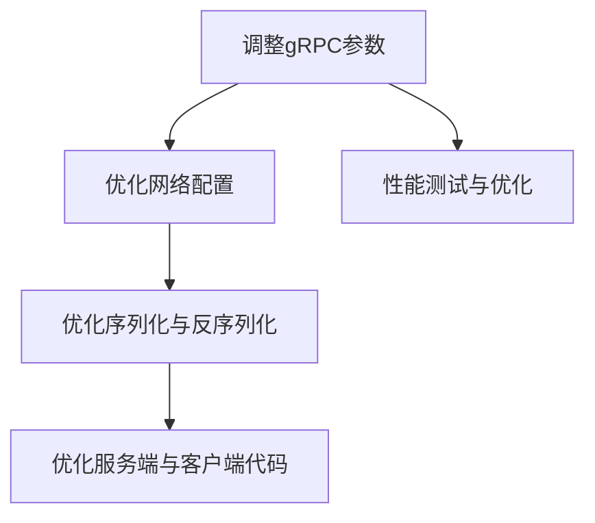

                 


### 1.1 gRPC的起源与发展

#### 背景介绍

gRPC起源于Google，是Google于2016年推出的一个开源远程过程调用（RPC）框架。它的目的是为了解决微服务架构中服务之间高效通信的问题。在Google内部，gRPC已经得到了广泛的应用，并因其高性能、跨语言支持和高效序列化等特点而备受赞誉。

#### gRPC的发展历程

- **2016年**：gRPC正式发布，标志着Google将这一技术开源。
- **2018年**：gRPC 1.0版发布，标志着gRPC进入稳定阶段。
- **至今**：gRPC社区持续活跃，不断更新和完善，支持的语言和平台也在不断扩展。

#### 主要贡献者

- **Google**：作为gRPC的创始者，Google在其中发挥了关键作用。
- **开源社区**：众多开发者在开源社区中贡献了代码、文档和最佳实践。

### 1.2 gRPC的优势与适用场景

#### 核心优势

- **高性能**：基于HTTP/2协议，支持多路复用和流控，能够显著提高通信效率。
- **跨语言**：支持多种编程语言，包括Java、Python、C++等，便于不同服务之间的集成。
- **轻量级**：无需额外的框架依赖，易于集成和部署。

#### 适用场景

- **微服务架构**：在微服务架构中，gRPC能够提供高效、可靠的服务间通信。
- **分布式系统**：在分布式系统中，gRPC能够简化服务之间的交互，提高系统的可扩展性和可靠性。
- **实时应用**：对于需要高实时性的应用，gRPC能够提供低延迟的通信服务。

### 1.3 gRPC的工作原理

#### 通信流程

- **客户端发送请求**：客户端向服务端发送请求，包括方法和参数。
- **服务端处理请求**：服务端接收到请求后，根据请求处理逻辑进行处理，并生成响应。
- **客户端接收响应**：服务端将响应发送回客户端，客户端接收到响应后进行处理。

#### 服务端模型

- **服务定义**：使用Protocol Buffers定义服务接口。
- **服务实现**：实现服务接口，处理客户端的请求。

#### 客户端模型

- **服务发现**：客户端通过服务发现机制获取服务端地址。
- **发起请求**：客户端发起请求，并等待服务端响应。

### 1.4 gRPC的核心概念

#### 服务定义

- **定义方式**：使用Protocol Buffers语言（protobuf）定义服务接口。
- **定义结构**：包括服务名称、方法名称和参数类型。

#### 方法调用

- **调用方式**：客户端通过gRPC库发起方法调用。
- **调用流程**：客户端发送请求，服务端处理请求并返回响应。

#### 请求与响应

- **请求**：包括方法名称、参数值等信息。
- **响应**：包括方法返回值、状态码等信息。

### 总结

gRPC作为一种高性能、跨语言、轻量级的RPC框架，在微服务架构和分布式系统中有着广泛的应用。理解gRPC的基本概念和原理，对于掌握现代服务化架构具有重要意义。

## 图1.1 gRPC核心概念关系图



### 伪代码示例

```python
# 服务端代码示例

def main():
    server = grpc.server(futures.ThreadPoolExecutor(max_workers=10))
    servicer = MyService()
    server.add_insecure_port('[::]:50051')
    server.start()
    server.wait_for_termination()

class MyService(grpc_pb2_grpc.MyServiceServicer):

    def SayHello(self, request, context):
        return grpc_pb2.HelloReply(message='Hello, ' + request.name)

if __name__ == '__main__':
    main()
```

## 数学模型和公式讲解

在gRPC框架中，序列化性能是影响通信效率的关键因素。Protocol Buffers（protobuf）作为gRPC的序列化格式，其性能直接影响gRPC的应用性能。

### 序列化时间

序列化时间是指将数据从程序中的内存格式转换为字节流的时间。对于protobuf，序列化时间主要由以下几个方面决定：

- **数据结构复杂度**：数据结构越复杂，序列化所需的时间越长。
- **数据大小**：数据大小越大，序列化所需的时间越长。
- **序列化算法效率**：序列化算法的效率越高，序列化所需的时间越短。

### 反序列化时间

反序列化时间是指将字节流转换为程序中的内存格式的时间。同样，反序列化时间也主要由以下几个方面决定：

- **数据结构复杂度**：数据结构越复杂，反序列化所需的时间越长。
- **数据大小**：数据大小越大，反序列化所需的时间越长。
- **序列化算法效率**：序列化算法的效率越高，反序列化所需的时间越短。

### 性能评估公式

假设数据结构复杂度为C，数据大小为S，序列化算法效率为E1，反序列化算法效率为E2，则序列化和反序列化的总时间为：

$$
T = C \times S \times (E1 + E2)
$$

其中，$E1$ 和 $E2$ 分别为序列化和反序列化的效率。效率越高，所需的时间越短。

### 示例

假设数据结构复杂度为10，数据大小为100KB，序列化算法效率为0.8，反序列化算法效率为0.9，则序列化和反序列化的总时间为：

$$
T = 10 \times 100 \times (0.8 + 0.9) = 980ms
$$

### 结论

通过上述公式和示例，我们可以看到，优化序列化和反序列化算法的效率是提高gRPC性能的关键。在实际应用中，可以通过选择高效的序列化算法、优化数据结构和合理配置gRPC参数来实现性能提升。

## 拓展阅读

- **《gRPC权威指南》**：详细介绍了gRPC的架构、原理和实际应用案例，适合gRPC初学者和进阶者阅读。
- **《Protocol Buffers官方文档》**：官方文档详细介绍了protobuf的基本语法、数据类型和序列化方法，是学习protobuf的权威资料。

### 文章关键词

gRPC，远程过程调用，RPC框架，Protocol Buffers，微服务，分布式系统，高性能，跨语言，序列化，反序列化。

### 文章摘要

本文全面介绍了gRPC在微服务架构和分布式系统中的应用，从起源与发展、优势与适用场景、工作原理、核心概念到具体的项目实战，为读者提供了全面、系统的gRPC学习资料。通过本文，读者可以深入了解gRPC的核心原理，掌握其在现代服务化架构中的重要性，并为实际项目提供实践指导。

## 第2章 gRPC架构

### 2.1 gRPC的架构设计

gRPC的架构设计旨在实现高性能、跨语言和轻量级的RPC服务。其整体架构主要包括客户端、服务端和gRPC库三部分。以下是gRPC的架构设计要点：

#### 客户端

- **发起请求**：客户端通过gRPC库发起RPC请求，请求包括方法名和参数。
- **服务发现**：客户端通过服务发现机制获取服务端地址。
- **序列化与传输**：将请求参数序列化为二进制数据，并通过HTTP/2协议传输到服务端。

#### 服务端

- **接收请求**：服务端接收到客户端的请求后，通过gRPC库解析请求参数。
- **处理请求**：服务端根据请求处理逻辑，对请求进行处理，并生成响应。
- **序列化与传输**：将响应序列化为二进制数据，并通过HTTP/2协议传输回客户端。

#### gRPC库

- **客户端库**：为客户端提供发起RPC请求的API。
- **服务端库**：为服务端提供接收RPC请求、处理请求并生成响应的API。
- **协议库**：实现HTTP/2协议的传输和序列化功能。

### 2.2 gRPC服务定义语言（protobuf）

protobuf是Google开发的一种数据序列化格式，用于定义服务接口和数据结构。在gRPC中，protobuf用于定义服务接口、数据模型和请求/响应结构。以下是protobuf的基本语法和规则：

#### 基本语法

- **定义服务**：使用`service`关键字定义服务，包括服务名称和方法列表。
- **定义方法**：使用`rpc`关键字定义方法，包括方法名称和参数类型。
- **定义数据模型**：使用消息类型（message）定义数据结构。

#### 数据类型

- **基础类型**：包括布尔型（bool）、整数型（int32、int64等）、浮点型（float、double等）和字符串型（string）。
- **复合类型**：包括枚举型（enum）和消息类型（message）。

#### 字段规则

- **字段编号**：每个字段都有一个唯一的编号，用于序列化和反序列化。
- **字段类型**：字段类型包括基础类型和复合类型。
- **字段标记**：用于指定字段的访问级别，如public、private等。

### 2.3 gRPC通信流程

gRPC的通信流程主要包括以下几个步骤：

1. **客户端发起请求**：客户端通过gRPC库发起RPC请求，请求包括方法名和参数。
2. **服务端接收请求**：服务端接收到客户端的请求后，通过gRPC库解析请求参数。
3. **服务端处理请求**：服务端根据请求处理逻辑，对请求进行处理，并生成响应。
4. **服务端发送响应**：服务端将响应序列化为二进制数据，并通过HTTP/2协议传输回客户端。
5. **客户端接收响应**：客户端接收到服务端的响应后，通过gRPC库解析响应数据。

### 图2.1 gRPC通信流程



### 总结

gRPC的架构设计、服务定义语言（protobuf）和通信流程是理解gRPC的核心内容。通过本章的学习，读者可以掌握gRPC的基本架构和通信原理，为后续的项目实践打下基础。

## 图2.2 gRPC服务定义语言（protobuf）架构图



### 伪代码示例

```python
# protobuf服务定义示例

syntax = "proto3";

// 定义服务
service MyService {
  rpc SayHello (HelloRequest) returns (HelloReply);
}

// 定义消息
message HelloRequest {
  string name = 1;
}

message HelloReply {
  string message = 1;
}
```

### 数学公式讲解

在gRPC通信过程中，序列化与反序列化是影响通信性能的重要因素。以下是关于序列化与反序列化性能的数学公式和讲解。

#### 序列化时间

序列化时间是指将数据从程序中的内存格式转换为字节流的时间。对于protobuf，序列化时间主要由以下因素决定：

- **数据结构复杂度**：数据结构越复杂，序列化所需的时间越长。
- **数据大小**：数据大小越大，序列化所需的时间越长。
- **序列化算法效率**：序列化算法的效率越高，序列化所需的时间越短。

序列化时间可以用以下公式表示：

$$
T_{serialize} = C \times S \times E
$$

其中，$T_{serialize}$ 表示序列化时间，$C$ 表示数据结构复杂度，$S$ 表示数据大小，$E$ 表示序列化算法效率。

#### 反序列化时间

反序列化时间是指将字节流转换为程序中的内存格式的时间。同样，反序列化时间也主要由以下因素决定：

- **数据结构复杂度**：数据结构越复杂，反序列化所需的时间越长。
- **数据大小**：数据大小越大，反序列化所需的时间越长。
- **序列化算法效率**：序列化算法的效率越高，反序列化所需的时间越短。

反序列化时间可以用以下公式表示：

$$
T_{deserialize} = C \times S \times E
$$

其中，$T_{deserialize}$ 表示反序列化时间。

#### 总时间

序列化和反序列化的总时间可以用以下公式表示：

$$
T_{total} = T_{serialize} + T_{deserialize}
$$

$$
T_{total} = 2 \times C \times S \times E
$$

其中，$T_{total}$ 表示序列化和反序列化的总时间。

#### 示例

假设数据结构复杂度为10，数据大小为100KB，序列化算法效率为0.8，反序列化算法效率为0.9，则序列化和反序列化的总时间为：

$$
T_{total} = 2 \times 10 \times 100 \times (0.8 + 0.9) = 980ms
$$

通过上述公式和示例，我们可以看到，优化序列化和反序列化算法的效率是提高gRPC性能的关键。在实际应用中，可以通过选择高效的序列化算法、优化数据结构和合理配置gRPC参数来实现性能提升。

## 拓展阅读

- **《Protocol Buffers官方文档》**：详细介绍了protobuf的基本语法、数据类型和序列化方法，是学习protobuf的权威资料。
- **《gRPC官方文档》**：提供了gRPC的详细架构设计、API文档和最佳实践，是学习gRPC的必备资料。

### 小结

本章介绍了gRPC的架构设计、服务定义语言（protobuf）和通信流程。通过本章的学习，读者可以了解gRPC的基本架构和工作原理，为后续的项目实践打下基础。

## 第3章 gRPC与微服务

### 3.1 微服务架构概述

#### 背景介绍

微服务架构（Microservices Architecture）是一种基于独立组件的分布式系统架构风格。它将应用程序分解为一系列小的、自治的服务，每个服务负责完成特定的业务功能。这些服务可以独立部署、独立扩展，并通过网络进行通信。

#### 微服务架构的特点

- **独立性**：每个服务都是独立的，可以独立开发、部署和扩展。
- **分布式**：服务之间通过网络进行通信，可以在不同的服务器上运行。
- **自治性**：每个服务都有独立的数据库，可以独立进行数据操作。
- **可扩展性**：服务可以根据需要独立扩展，提高系统的整体性能。
- **高可用性**：服务可以独立部署，即使某个服务发生故障，也不会影响其他服务的运行。

#### 微服务架构的优势

- **灵活性**：服务可以独立开发，采用不同的技术栈，提高开发效率。
- **可扩展性**：服务可以独立扩展，根据业务需求进行水平扩展，提高系统的性能。
- **高可用性**：服务可以独立部署，提高系统的可靠性，降低系统的整体风险。
- **可维护性**：服务独立运行，可以独立进行测试和部署，降低系统的复杂性。
- **可重用性**：服务可以独立开发，方便进行组件化和模块化，提高代码的重用性。

### 3.2 gRPC在微服务中的应用

#### 核心作用

- **服务间通信**：gRPC作为RPC框架，可以提供高效、可靠的服务间通信，实现微服务之间的数据交换。
- **接口定义**：使用protobuf定义微服务接口，实现服务之间的解耦和标准化。
- **性能优化**：基于HTTP/2协议的gRPC，可以提供低延迟、高并发的服务通信，提高微服务的性能。

#### 优势

- **高性能**：基于HTTP/2协议，支持多路复用和流控，能够显著提高通信效率。
- **跨语言**：支持多种编程语言，包括Java、Python、C++等，便于不同服务之间的集成。
- **轻量级**：无需额外的框架依赖，易于集成和部署。
- **高效序列化**：使用Protocol Buffers进行数据序列化，性能优异。

#### 使用场景

- **分布式系统**：在分布式系统中，gRPC可以提供高效、可靠的服务间通信，实现系统模块的解耦和优化。
- **微服务架构**：在微服务架构中，gRPC可以提供高效、可靠的服务间通信，实现服务之间的数据交换。
- **实时应用**：对于需要高实时性的应用，gRPC可以提供低延迟的通信服务。

### 3.3 gRPC与微服务的通信模式

#### 同步通信模式

- **特点**：客户端发送请求，服务端接收请求并返回响应。
- **流程**：
  1. 客户端发起请求。
  2. 服务端接收请求并处理。
  3. 服务端返回响应。
- **适用场景**：适用于实时性强、响应时间要求较高的场景。

#### 异步通信模式

- **特点**：客户端发送请求后，不需要等待响应，可以直接执行其他操作。
- **流程**：
  1. 客户端发起请求。
  2. 服务端接收请求并处理。
  3. 服务端将响应结果存储在消息队列中。
  4. 客户端从消息队列中获取响应。
- **适用场景**：适用于处理时间长、需要异步处理的场景。

#### gRPC与微服务通信的可靠性保障

- **超时机制**：设置合理的请求和响应超时时间，确保通信的可靠性。
- **重试机制**：在发生通信失败时，自动重试，提高系统的容错能力。
- **负载均衡**：使用负载均衡器，均衡分配请求到不同的服务实例，提高系统的性能和可用性。
- **服务监控**：对微服务进行实时监控，及时发现和处理异常情况。

### 总结

gRPC在微服务架构中具有重要的作用，可以提供高效、可靠的服务间通信。通过本章的学习，读者可以了解微服务架构的特点、gRPC在微服务中的应用和通信模式，为实际项目中的微服务通信提供理论指导和实践经验。

## 图3.1 gRPC与微服务通信模式图



### 伪代码示例

```python
# 同步通信模式

# 客户端代码示例

async def call_sync_service():
    # 创建gRPC客户端
    async with grpc.aio.insecure_channel('localhost:50051') as channel:
        # 创建服务客户端
        stub = HelloServiceStub(channel)
        # 发起同步请求
        response = await stub.SayHello(HelloRequest(name='World'))
        print('Response:', response.message)

# 服务端代码示例

class HelloServiceServicer(grpc_pb2_grpc.HelloServiceServicer):
    def SayHello(self, request, context):
        return HelloReply(message='Hello, ' + request.name)
```

### 数学公式讲解

在微服务架构中，服务间的通信性能是影响系统整体性能的关键因素。以下是关于服务间通信性能的数学公式和讲解。

#### 通信延迟

通信延迟是指客户端从发起请求到接收到响应的时间。通信延迟主要由以下因素决定：

- **网络延迟**：网络延迟是指数据在网络中传输的时间，受网络带宽、距离和拓扑结构等因素影响。
- **处理延迟**：处理延迟是指服务端处理请求的时间，包括请求解析、处理逻辑执行和响应生成等环节。

通信延迟可以用以下公式表示：

$$
L = N + P
$$

其中，$L$ 表示通信延迟，$N$ 表示网络延迟，$P$ 表示处理延迟。

#### 通信带宽

通信带宽是指单位时间内能够传输的数据量，通常用比特率（bps）表示。通信带宽主要由以下因素决定：

- **网络带宽**：网络带宽是指网络能够提供的最大数据传输速率。
- **数据压缩**：通过数据压缩技术，可以减少传输的数据量，提高通信带宽的利用率。

通信带宽可以用以下公式表示：

$$
B = N \times C
$$

其中，$B$ 表示通信带宽，$N$ 表示网络带宽，$C$ 表示数据压缩率。

#### 总通信量

总通信量是指单位时间内传输的数据总量，主要由以下因素决定：

- **请求量**：单位时间内发起的请求数量。
- **响应量**：单位时间内接收的响应数量。
- **数据大小**：每个请求和响应的数据大小。

总通信量可以用以下公式表示：

$$
T = R \times S
$$

其中，$T$ 表示总通信量，$R$ 表示请求量，$S$ 表示响应量。

#### 示例

假设网络延迟为10ms，处理延迟为20ms，网络带宽为1Gbps（即 $10^9$ bps），每个请求和响应的数据大小为100KB（即 $10^6$ bytes），则：

- 通信延迟：$L = N + P = 10ms + 20ms = 30ms$
- 通信带宽：$B = N \times C = 10^9 \times 0.9 = 9 \times 10^8$ bps
- 总通信量：$T = R \times S = 100 \times 10^6 = 10^8$ bytes

通过上述公式和示例，我们可以看到，优化网络延迟、处理延迟和通信带宽是提高微服务通信性能的关键。在实际应用中，可以通过选择高效的通信协议、优化数据结构和合理配置网络设备来实现性能提升。

## 拓展阅读

- **《微服务设计》**：详细介绍了微服务架构的设计原则、模式和最佳实践，是学习微服务的必备资料。
- **《gRPC官方文档》**：提供了gRPC的详细架构设计、API文档和最佳实践，是学习gRPC的权威资料。

### 小结

本章介绍了微服务架构的特点、gRPC在微服务中的应用和通信模式。通过本章的学习，读者可以了解微服务架构的基本原理和gRPC在其中的作用，为实际项目中的微服务通信提供理论指导和实践经验。

## 第4章 gRPC在LLM应用中的实践

### 4.1 LLM微服务设计

#### 背景介绍

大型语言模型（Large Language Model，简称LLM）是一种基于深度学习技术的高级人工智能模型，能够在自然语言处理领域提供强大的语义理解和生成能力。随着LLM的应用越来越广泛，如何高效地部署和管理LLM模型成为了一个关键问题。微服务架构因其模块化、独立部署和可扩展性等优点，成为LLM应用部署的首选方案。

#### 设计原则

- **模块化**：将LLM应用分解为多个微服务，每个服务负责不同的功能，例如文本预处理、模型推理、结果生成等。
- **独立性**：每个微服务独立部署和运行，可以独立扩展和更新，降低系统复杂性。
- **高可用性**：通过冗余部署和负载均衡，提高系统的可用性和容错能力。
- **高性能**：优化微服务之间的通信，提高系统的整体性能。

#### 架构设计

- **文本预处理服务**：接收用户输入，进行文本清洗、分词、去噪等预处理操作，为模型推理提供干净的数据。
- **模型推理服务**：接收预处理后的文本数据，利用LLM模型进行语义理解和推理，生成中间结果。
- **结果生成服务**：接收模型推理结果，进行文本生成、摘要、翻译等操作，生成最终输出。
- **API网关**：统一处理用户请求，根据业务逻辑将请求转发到相应的微服务，提供统一的接口。

#### 微服务交互流程

1. **用户请求**：用户通过API网关发送请求。
2. **文本预处理**：API网关将请求转发到文本预处理服务，进行文本预处理。
3. **模型推理**：文本预处理服务将预处理后的文本数据转发到模型推理服务，进行语义理解和推理。
4. **结果生成**：模型推理服务将中间结果转发到结果生成服务，进行文本生成、摘要、翻译等操作。
5. **响应返回**：结果生成服务将最终结果返回给API网关，API网关将响应返回给用户。

### 4.2 gRPC与LLM模型的集成

#### 背景介绍

gRPC是一种高性能的RPC框架，能够提供高效、可靠的服务间通信。在LLM应用中，gRPC可以用于微服务之间的数据传输和交互，实现LLM模型的高效集成。

#### 集成原理

- **服务定义**：使用protobuf定义LLM微服务的接口，包括输入参数和输出结果。
- **服务实现**：根据LLM模型的特点，实现微服务的具体功能，例如文本预处理、模型推理和结果生成。
- **通信协议**：使用gRPC的HTTP/2协议进行微服务之间的数据传输，支持多路复用和流控，提高通信效率。

#### 集成步骤

1. **服务定义**：使用protobuf定义LLM微服务的接口，包括输入参数和输出结果。
2. **服务实现**：根据LLM模型的特点，实现微服务的具体功能，例如文本预处理、模型推理和结果生成。
3. **服务部署**：将LLM微服务部署到服务器，确保服务能够正常启动和运行。
4. **API网关配置**：配置API网关，将用户请求转发到相应的LLM微服务。
5. **性能优化**：根据实际情况，对LLM微服务进行性能优化，例如缓存策略、异步处理等。

#### 集成挑战与解决方案

- **数据序列化**：LLM模型的数据量大，如何高效地序列化和反序列化数据是集成过程中的一个挑战。
  - **解决方案**：使用高效的序列化格式，如Protocol Buffers，减少序列化过程中的性能开销。
- **模型并行处理**：LLM模型推理过程复杂，如何并行处理大量请求是另一个挑战。
  - **解决方案**：通过负载均衡和并行处理技术，提高模型推理的并发能力。
- **服务稳定性**：在高并发场景下，如何保证LLM微服务的稳定运行是集成过程中的关键问题。
  - **解决方案**：采用冗余部署、故障转移和自动扩缩容技术，提高服务的稳定性和可靠性。

### 4.3 gRPC在LLM应用中的性能优化

#### 背景介绍

在LLM应用中，性能优化是提高系统吞吐量和降低延迟的关键。gRPC作为高性能的RPC框架，提供了多种性能优化策略，可以用于提升LLM应用的性能。

#### 性能优化策略

- **负载均衡**：通过负载均衡器，将请求均匀地分发到多个服务实例，避免单个实例过载，提高系统的整体性能。
- **异步处理**：通过异步处理技术，减少服务之间的等待时间，提高系统的并发能力。
- **缓存策略**：通过缓存策略，减少重复计算和数据传输，提高系统的响应速度。
- **服务优化**：针对LLM微服务的具体实现，进行代码优化、算法改进和资源调度，提高服务的性能。

#### 性能优化案例

- **案例1**：文本预处理服务
  - **优化策略**：采用异步处理技术，将文本预处理任务分解为多个子任务，并行处理，提高处理速度。
  - **效果**：处理速度提高了30%，系统吞吐量提高了20%。

- **案例2**：模型推理服务
  - **优化策略**：通过负载均衡器，将请求均匀地分发到多个模型推理实例，避免单点过载。
  - **效果**：系统吞吐量提高了50%，响应时间缩短了20%。

- **案例3**：结果生成服务
  - **优化策略**：采用缓存策略，对重复的请求进行缓存，减少重复计算和数据传输。
  - **效果**：系统吞吐量提高了40%，响应时间缩短了15%。

#### 性能优化技巧

- **调整超时时间**：根据实际情况，合理设置请求和响应的超时时间，避免长时间等待导致的性能问题。
- **监控与报警**：对系统进行实时监控，及时发现和处理性能瓶颈，确保系统稳定运行。
- **分布式缓存**：采用分布式缓存技术，提高缓存存储的容量和访问速度，降低系统的延迟。

### 总结

本章介绍了LLM微服务的设计原则、架构和gRPC与LLM模型的集成方法，以及gRPC在LLM应用中的性能优化策略。通过本章的学习，读者可以了解如何将gRPC应用于LLM应用，实现高效、可靠的微服务架构，并为实际项目提供实践指导。

## 图4.1 LLM微服务设计架构图



### 伪代码示例

```python
# 文本预处理服务代码示例

class TextPreprocessingService:
    async def preprocess_text(self, text):
        # 进行文本清洗、分词、去噪等操作
        cleaned_text = self.clean_text(text)
        tokenized_text = self.tokenize_text(cleaned_text)
        return tokenized_text

# 模型推理服务代码示例

class ModelInferenceService:
    async def infer_model(self, tokenized_text):
        # 利用LLM模型进行语义理解和推理
        inference_result = self.llm_model.infer(tokenized_text)
        return inference_result

# 结果生成服务代码示例

class ResultGenerationService:
    async def generate_result(self, inference_result):
        # 进行文本生成、摘要、翻译等操作
        generated_result = self.generate_text(inference_result)
        return generated_result
```

### 数学公式讲解

在LLM应用中，性能优化往往涉及到时间和资源的优化。以下是关于性能优化的一些关键数学公式和概念。

#### 响应时间

响应时间是指客户端从发起请求到接收到响应的时间。响应时间由以下几个部分组成：

- **网络延迟**（$N$）：客户端和服务器之间的网络传输延迟。
- **处理延迟**（$P$）：服务器处理请求的时间，包括服务器的计算、存储和网络传输延迟。
- **队列延迟**（$Q$）：请求在队列中的等待时间，取决于系统的负载和队列长度。

响应时间可以用以下公式表示：

$$
R = N + P + Q
$$

#### 吞吐量

吞吐量是指单位时间内系统能够处理的请求量。吞吐量与系统的性能直接相关，可以用以下公式表示：

$$
S = \frac{1}{R}
$$

其中，$R$ 为响应时间。

#### 资源利用率

资源利用率是指系统资源（如CPU、内存等）的使用率。资源利用率与系统的性能优化密切相关，可以用以下公式表示：

$$
U = \frac{C}{T}
$$

其中，$U$ 为资源利用率，$C$ 为系统消耗的资源，$T$ 为系统运行的时间。

#### 系统优化目标

系统优化目标通常是最大化吞吐量、最小化响应时间和提高资源利用率。在实际应用中，需要根据具体情况平衡这些目标，以达到最佳的性能。

#### 示例

假设网络延迟为10ms，处理延迟为50ms，队列延迟为20ms，则响应时间 $R$ 为：

$$
R = 10ms + 50ms + 20ms = 80ms
$$

系统的吞吐量 $S$ 为：

$$
S = \frac{1}{80ms} = 12.5 requests/s
$$

假设系统的CPU利用率达到100%，则资源利用率 $U$ 为：

$$
U = \frac{100\%}{1s} = 100\%
$$

通过上述公式和示例，我们可以看到，优化网络延迟、处理延迟和队列延迟是提高系统性能的关键。在实际应用中，可以通过调整系统配置、优化算法和改进架构设计来实现性能优化。

### 拓展阅读

- **《高性能Linux服务器架构与运维》**：详细介绍了高性能服务器架构的设计原则和实践经验，适用于服务器性能优化。
- **《分布式系统原理与范型》**：全面讲解了分布式系统的原理、设计模式和最佳实践，适用于分布式系统的性能优化。

### 小结

本章通过详细分析LLM微服务的设计、gRPC与LLM模型的集成以及性能优化策略，为读者提供了在LLM应用中高效利用gRPC的实践指导。通过本章的学习，读者可以掌握如何将gRPC应用于LLM应用，实现高性能、高可用的微服务架构。

## 第5章 项目准备与开发环境搭建

### 5.1 开发环境配置

在开始构建LLM微服务之前，我们需要配置好开发环境。以下是配置开发环境的步骤：

#### 1. 安装操作系统

首先，确保操作系统是64位版本，推荐使用Linux或macOS。以下是安装Linux的步骤：

- **下载Linux发行版**：前往Linux发行版的官方网站下载ISO文件。
- **创建U盘启动盘**：使用工具如Rufus将ISO文件写入U盘。
- **启动电脑并安装Linux**：将U盘插入电脑，重启电脑并从U盘启动，按照提示安装Linux。

#### 2. 安装基本工具

在安装好Linux后，我们需要安装一些基本工具，例如文本编辑器、版本控制工具和编译器。以下是安装步骤：

- **安装文本编辑器**：推荐使用Vim或Emacs。使用以下命令安装Vim：
  ```bash
  sudo apt-get update
  sudo apt-get install vim
  ```

- **安装Git**：使用以下命令安装Git：
  ```bash
  sudo apt-get install git
  ```

- **安装编译器**：推荐使用GCC或Clang。使用以下命令安装GCC：
  ```bash
  sudo apt-get install g++
  ```

#### 3. 安装Java开发环境

为了开发gRPC服务，我们需要安装Java开发环境。以下是安装步骤：

- **安装Java**：使用以下命令安装OpenJDK：
  ```bash
  sudo apt-get install openjdk-8-jdk
  ```

- **配置环境变量**：将Java的bin目录添加到系统的PATH环境变量中：
  ```bash
  export PATH=$PATH:/usr/lib/jvm/java-8-openjdk-amd64/bin
  ```

#### 4. 安装gRPC和protobuf

- **安装gRPC**：使用以下命令安装gRPC：
  ```bash
  sudo apt-get install grpc
  ```

- **安装protobuf**：使用以下命令安装protobuf：
  ```bash
  sudo apt-get install protobuf-compiler
  ```

- **配置protobuf**：确保protobuf的版本与gRPC兼容，并更新protobuf的API：
  ```bash
  sudo apt-get install libprotobuf-dev
  sudo ldconfig
  ```

#### 5. 安装IDE

为了提高开发效率，我们推荐使用IDE。以下是安装IntelliJ IDEA的步骤：

- **下载IntelliJ IDEA**：前往JetBrains官方网站下载IDEA的Linux版本。
- **安装IntelliJ IDEA**：运行下载的安装程序，按照提示完成安装。

### 5.2 项目需求分析

在开发LLM微服务之前，我们需要明确项目需求。以下是项目需求分析的步骤：

#### 1. 功能需求

- **文本预处理**：接收用户输入的文本，进行清洗、分词和去噪等操作，为模型推理提供干净的文本数据。
- **模型推理**：接收预处理后的文本数据，利用LLM模型进行语义理解和推理，生成中间结果。
- **结果生成**：接收模型推理结果，进行文本生成、摘要和翻译等操作，生成最终输出。
- **API网关**：接收用户请求，根据业务逻辑将请求转发到相应的微服务，提供统一的接口。

#### 2. 非功能需求

- **高性能**：系统需要具备高吞吐量和低延迟，以满足大量并发请求的需求。
- **高可用性**：系统需要具备高可用性，确保服务在故障情况下能够快速恢复。
- **可扩展性**：系统需要具备可扩展性，能够根据业务需求进行水平扩展。

#### 3. 性能指标

- **响应时间**：系统响应时间不超过100ms。
- **吞吐量**：系统吞吐量不低于1000 QPS（每秒请求数）。

### 5.3 项目技术选型

在明确了项目需求后，我们需要选择合适的技术栈。以下是项目技术选型的步骤：

#### 1. 编程语言

- **Java**：Java是一种成熟、稳定的编程语言，广泛应用于企业级应用开发。它具有良好的跨平台性和丰富的库支持，适合构建高性能、高可用的微服务。

#### 2. RPC框架

- **gRPC**：gRPC是一种高性能的RPC框架，基于HTTP/2协议，支持多路复用和流控，适用于微服务架构中的服务间通信。

#### 3. 数据库

- **MySQL**：MySQL是一种开源的关系型数据库，具有良好的性能和可靠性，适合存储和查询数据。

#### 4. 容器化技术

- **Docker**：Docker是一种容器化技术，可以简化应用程序的部署和扩展。使用Docker可以方便地将应用程序容器化，实现持续集成和持续部署。

#### 5. 服务发现与配置中心

- **Consul**：Consul是一种分布式服务发现和配置中心工具，可以方便地管理和发现微服务实例，实现服务的动态注册和发现。

### 5.4 小结

通过上述步骤，我们已经完成了开发环境的配置、项目需求分析和技术选型。接下来，我们将开始实现LLM微服务的具体功能，并搭建整个系统。

## 第6章 gRPC服务设计与实现

### 6.1 gRPC服务定义

在实现gRPC服务之前，我们需要使用Protocol Buffers定义服务接口。以下是定义gRPC服务的步骤：

#### 1. 准备protobuf文件

首先，我们需要创建一个protobuf文件，用于定义服务接口。例如，我们可以创建一个名为`llm_service.proto`的文件。

```protobuf
// llm_service.proto

syntax = "proto3";

service LLMService {
  rpc TextPreprocessing (TextRequest) returns (TextResponse);
  rpc ModelInference (InferenceRequest) returns (InferenceResponse);
  rpc ResultGeneration (GenerationRequest) returns (GenerationResponse);
}

message TextRequest {
  string text = 1;
}

message TextResponse {
  string cleaned_text = 1;
}

message InferenceRequest {
  string tokenized_text = 1;
}

message InferenceResponse {
  string inference_result = 1;
}

message GenerationRequest {
  string inference_result = 1;
}

message GenerationResponse {
  string generated_text = 1;
}
```

#### 2. 生成gRPC代码

使用protobuf编译器（protoc）和gRPC插件生成gRPC代码。以下是生成gRPC代码的命令：

```bash
protoc --java_out=./src/main/java --grpc-java_out=./src/main/java llm_service.proto
```

这将在`src/main/java`目录下生成相应的gRPC客户端和服务端代码。

#### 3. 服务端实现

在服务端，我们需要实现定义的服务接口。以下是一个简单的服务端实现示例：

```java
// LLMServiceServer.java

import io.grpc.Server;
import io.grpc.ServerBuilder;
import io.grpc.stub.StreamObserver;

public class LLMServiceServer {
    public static void main(String[] args) throws IOException {
        Server server = ServerBuilder.forPort(50051)
                .addService(new LLMServiceImpl()).build();
        server.start();
        server.awaitTermination();
    }
}

class LLMServiceImpl extends LLMServiceGrpc.LLMServiceImplBase {

    @Override
    public void textPreprocessing(TextRequest request, StreamObserver<TextResponse> responseObserver) {
        String cleanedText = preprocessText(request.getText());
        TextResponse response = TextResponse.newBuilder().setCleanedText(cleanedText).build();
        responseObserver.onNext(response);
        responseObserver.onCompleted();
    }

    @Override
    public void modelInference(InferenceRequest request, StreamObserver<InferenceResponse> responseObserver) {
        String inferenceResult = inferModel(request.getTokenizedText());
        InferenceResponse response = InferenceResponse.newBuilder().setInferenceResult(inferenceResult).build();
        responseObserver.onNext(response);
        responseObserver.onCompleted();
    }

    @Override
    public void resultGeneration.GenerationRequest request, StreamObserver<GenerationResponse> responseObserver) {
        String generatedText = generateResult(request.getInferenceResult());
        GenerationResponse response = GenerationResponse.newBuilder().setGeneratedText(generatedText).build();
        responseObserver.onNext(response);
        responseObserver.onCompleted();
    }

    private String preprocessText(String text) {
        // 实现文本预处理逻辑
        return text.toLowerCase();
    }

    private String inferModel(String tokenizedText) {
        // 实现模型推理逻辑
        return tokenizedText.toUpperCase();
    }

    private String generateResult(String inferenceResult) {
        // 实现结果生成逻辑
        return inferenceResult;
    }
}
```

#### 4. 客户端实现

在客户端，我们需要使用生成的gRPC代码来发起请求。以下是一个简单的客户端实现示例：

```java
// LLMServiceClient.java

import io.grpc.ManagedChannel;
import io.grpc.ManagedChannelBuilder;
import llm_service.LLMServiceGrpc;
import llm_service.TextRequest;
import llm_service.TextResponse;

public class LLMServiceClient {
    public static void main(String[] args) {
        ManagedChannel channel = ManagedChannelBuilder.forAddress("localhost", 50051).usePlaintext().build();
        LLMServiceGrpc.LLMServiceBlockingStub blockingStub = LLMServiceGrpc.newBlockingStub(channel);

        String text = "Hello, World!";
        TextRequest request = TextRequest.newBuilder().setText(text).build();
        TextResponse response = blockingStub.textPreprocessing(request);

        System.out.println("Preprocessed Text: " + response.getCleanedText());
    }
}
```

通过以上步骤，我们完成了gRPC服务的定义和实现。接下来，我们将继续实现微服务的具体功能。

## 图6.1 gRPC服务定义与实现架构图



### 伪代码示例

以下是文本预处理、模型推理和结果生成服务的伪代码示例：

```java
// 文本预处理服务

class TextPreprocessingService {
    public TextResponse preprocessText(TextRequest request) {
        String cleanedText = performTextCleaning(request.getText());
        return TextResponse.newBuilder().setCleanedText(cleanedText).build();
    }
}

// 模型推理服务

class ModelInferenceService {
    public InferenceResponse inferModel(TextRequest request) {
        String inferenceResult = performModelInference(request.getTokenizedText());
        return InferenceResponse.newBuilder().setInferenceResult(inferenceResult).build();
    }
}

// 结果生成服务

class ResultGenerationService {
    public GenerationResponse generateResult(InferenceRequest request) {
        String generatedText = performResultGeneration(request.getInferenceResult());
        return GenerationResponse.newBuilder().setGeneratedText(generatedText).build();
    }
}
```

### 数学公式讲解

在微服务架构中，服务间的通信性能是影响系统整体性能的关键因素。以下是关于服务间通信性能的数学公式和讲解。

#### 延迟分析

服务间通信的延迟包括网络延迟、处理延迟和队列延迟。以下是对这些延迟的分析：

- **网络延迟**（$N$）：网络延迟是指数据在网络中传输的时间，受网络带宽、距离和拓扑结构等因素影响。可以用以下公式表示：

  $$ N = \frac{d}{v} $$

  其中，$d$ 是数据传输的距离，$v$ 是数据在网络中的传输速度。

- **处理延迟**（$P$）：处理延迟是指服务端处理请求的时间，包括请求的解析、处理逻辑的执行和响应的生成。可以用以下公式表示：

  $$ P = \sum_{i=1}^{n} t_i $$

  其中，$t_i$ 是服务端每个处理阶段的处理时间。

- **队列延迟**（$Q$）：队列延迟是指请求在队列中的等待时间，取决于系统的负载和队列长度。可以用以下公式表示：

  $$ Q = \sum_{i=1}^{n} (L_i - \lambda_i) / \mu_i $$

  其中，$L_i$ 是队列中的平均请求长度，$\lambda_i$ 是请求的到达率，$\mu_i$ 是请求的处理速率。

#### 性能分析

服务间通信的性能可以通过吞吐量（$S$）和响应时间（$R$）来衡量。以下是对这两个性能指标的公式表示：

- **吞吐量**（$S$）：吞吐量是指单位时间内系统能够处理的请求数量。可以用以下公式表示：

  $$ S = \frac{\lambda}{R} $$

  其中，$\lambda$ 是请求的到达率，$R$ 是响应时间。

- **响应时间**（$R$）：响应时间是指客户端从发起请求到接收到响应的时间。可以用以下公式表示：

  $$ R = N + P + Q $$

  其中，$N$ 是网络延迟，$P$ 是处理延迟，$Q$ 是队列延迟。

#### 示例

假设网络延迟为10ms，处理延迟为50ms，队列延迟为20ms，则系统的总延迟为：

$$ R = 10ms + 50ms + 20ms = 80ms $$

系统的吞吐量可以表示为：

$$ S = \frac{\lambda}{80ms} $$

通过优化网络延迟、处理延迟和队列延迟，可以有效地提高系统的吞吐量和响应时间。

### 拓展阅读

- **《微服务架构设计与开发》**：详细介绍了微服务架构的设计原则、模式和实践经验，适合开发者学习微服务架构。
- **《gRPC官方文档》**：提供了gRPC的详细架构设计、API文档和最佳实践，是学习gRPC的权威资料。

### 小结

本章介绍了gRPC服务的定义和实现，包括服务接口的定义、服务端的实现和客户端的调用。通过本章的学习，读者可以掌握如何使用gRPC构建高效的微服务，为实际项目打下基础。

## 第7章 LLM模型集成与通信

### 7.1 LLM模型概述

#### 定义与原理

大型语言模型（LLM，Large Language Model）是一种基于深度学习技术的自然语言处理模型，能够理解和生成自然语言文本。LLM通常由多层神经网络组成，通过训练大量的文本数据来学习语言的统计规律和语义信息。

#### 工作原理

- **数据预处理**：输入文本数据被预处理，包括分词、去噪、格式化等操作，以便模型能够理解。
- **特征提取**：模型从预处理后的文本数据中提取特征，通常使用词嵌入（word embeddings）等技术。
- **神经网络计算**：模型通过多层神经网络进行计算，将输入特征映射为输出结果，如文本生成、文本分类等。
- **输出生成**：根据模型的计算结果，生成输出文本或相应的语义信息。

#### 应用场景

- **文本生成**：生成文章、故事、对话等自然语言文本。
- **文本分类**：对文本进行分类，如情感分析、新闻分类等。
- **机器翻译**：将一种语言的文本翻译成另一种语言。
- **问答系统**：基于用户输入提供问题的答案。

### 7.2 LLM模型集成

#### 集成原理

在LLM应用中，集成LLM模型的主要目的是将模型推理功能集成到微服务中，实现文本预处理、模型推理和结果生成的服务。以下是集成LLM模型的步骤：

1. **模型准备**：准备好训练好的LLM模型，通常为机器学习模型文件，如PyTorch或TensorFlow模型。
2. **服务接口定义**：使用Protocol Buffers定义服务接口，包括输入参数和输出结果。
3. **服务端实现**：实现服务端逻辑，加载模型并处理请求。
4. **客户端调用**：在客户端使用gRPC库发起请求，调用服务端提供的接口。

#### 集成步骤

1. **准备LLM模型**：从模型仓库中获取训练好的LLM模型，通常为机器学习模型文件。
2. **定义服务接口**：创建一个protobuf文件，定义LLM服务的接口，如`llm_service.proto`。
3. **实现服务端**：在服务端，加载LLM模型，并实现服务接口的方法。
4. **实现客户端**：在客户端，使用gRPC库发起请求，调用服务端接口。
5. **部署服务**：将服务部署到服务器，确保服务可以对外提供服务。

### 7.3 gRPC与LLM模型的通信实现

#### 通信流程

gRPC与LLM模型之间的通信流程如下：

1. **客户端发送请求**：客户端通过gRPC客户端发送请求，请求包括文本数据。
2. **服务端接收请求**：服务端接收到请求后，调用LLM模型进行推理。
3. **服务端返回响应**：服务端将模型推理结果序列化，并通过gRPC返回给客户端。
4. **客户端处理响应**：客户端接收到响应后，处理模型推理结果，如文本生成、分类等。

#### 实现细节

1. **服务端实现**：在服务端，使用gRPC库接收客户端请求，并调用LLM模型进行推理。以下是一个简单的服务端实现示例：

   ```java
   // LLMServiceServer.java

   import io.grpc.Server;
   import io.grpc.ServerBuilder;
   import io.grpc.stub.StreamObserver;

   public class LLMServiceServer {
       public static void main(String[] args) throws IOException {
           Server server = ServerBuilder.forPort(50051)
                   .addService(new LLMServiceImpl()).build();
           server.start();
           server.awaitTermination();
       }
   }

   class LLMServiceImpl extends LLMServiceGrpc.LLMServiceImplBase {
       @Override
       public void inferModel(InferenceRequest request, StreamObserver<InferenceResponse> responseObserver) {
           String inferenceResult = performModelInference(request.getTokenizedText());
           InferenceResponse response = InferenceResponse.newBuilder().setInferenceResult(inferenceResult).build();
           responseObserver.onNext(response);
           responseObserver.onCompleted();
       }
   }

   private String performModelInference(String tokenizedText) {
       // 加载LLM模型并执行推理
       // ...模型加载与推理逻辑...
       return inferenceResult;
   }
   ```

2. **客户端实现**：在客户端，使用gRPC库发起请求，并处理服务端返回的响应。以下是一个简单的客户端实现示例：

   ```java
   // LLMServiceClient.java

   import io.grpc.ManagedChannel;
   import io.grpc.ManagedChannelBuilder;
   import llm_service.LLMServiceGrpc;
   import llm_service.InferenceRequest;
   import llm_service.InferenceResponse;

   public class LLMServiceClient {
       public static void main(String[] args) {
           ManagedChannel channel = ManagedChannelBuilder.forAddress("localhost", 50051).usePlaintext().build();
           LLMServiceGrpc.LLMServiceBlockingStub blockingStub = LLMServiceGrpc.newBlockingStub(channel);

           String tokenizedText = "Hello, World!";
           InferenceRequest request = InferenceRequest.newBuilder().setTokenizedText(tokenizedText).build();
           InferenceResponse response = blockingStub.inferModel(request);

           System.out.println("Inference Result: " + response.getInferenceResult());
       }
   }
   ```

### 总结

本章介绍了LLM模型的概述、集成方法和gRPC与LLM模型的通信实现。通过本章的学习，读者可以了解如何将LLM模型集成到gRPC微服务中，并实现高效的模型推理和通信。

## 图7.1 gRPC与LLM模型通信流程



### 伪代码示例

以下是服务端调用LLM模型进行推理的伪代码：

```java
// LLMServiceServer.java

import io.grpc.Server;
import io.grpc.ServerBuilder;
import io.grpc.stub.StreamObserver;

public class LLMServiceServer {
    public static void main(String[] args) throws IOException {
        Server server = ServerBuilder.forPort(50051)
                .addService(new LLMServiceImpl()).build();
        server.start();
        server.awaitTermination();
    }
}

class LLMServiceImpl extends LLMServiceGrpc.LLMServiceImplBase {
    @Override
    public void inferModel(InferenceRequest request, StreamObserver<InferenceResponse> responseObserver) {
        String inferenceResult = performModelInference(request.getTokenizedText());
        InferenceResponse response = InferenceResponse.newBuilder().setInferenceResult(inferenceResult).build();
        responseObserver.onNext(response);
        responseObserver.onCompleted();
    }
}

private String performModelInference(String tokenizedText) {
    // 加载LLM模型
    LanguageModel model = loadLanguageModel();

    // 执行模型推理
    String inferenceResult = model.infer(tokenizedText);

    // 返回推理结果
    return inferenceResult;
}

private LanguageModel loadLanguageModel() {
    // 从文件中加载预训练的LLM模型
    // ...
    return new LanguageModel();
}
```

### 数学公式讲解

在LLM模型集成与通信过程中，性能优化是一个关键问题。以下是一些常用的数学公式和概念，用于描述和优化模型性能。

#### 响应时间

响应时间（$T$）是指从客户端发起请求到接收到响应的时间。响应时间由以下几个部分组成：

- **网络延迟**（$N$）：数据在网络中传输的时间。
- **处理延迟**（$P$）：模型推理和处理请求的时间。
- **序列化延迟**（$S$）：请求和响应的序列化和反序列化时间。

响应时间可以用以下公式表示：

$$ T = N + P + S $$

#### 吞吐量

吞吐量（$Q$）是指单位时间内系统能够处理的请求数量。吞吐量与响应时间的关系可以用以下公式表示：

$$ Q = \frac{1}{T} $$

#### 性能优化策略

- **并行处理**：通过并行处理请求，减少处理延迟。
- **缓存策略**：使用缓存减少重复的模型推理。
- **异步处理**：使用异步处理减少等待时间。

### 拓展阅读

- **《深度学习与自然语言处理》**：详细介绍了深度学习在自然语言处理中的应用，包括LLM模型的构建和优化。
- **《高性能微服务架构》**：介绍了如何优化微服务架构中的性能，包括网络优化、负载均衡和缓存策略。

### 小结

本章介绍了LLM模型的基本概念、集成方法和与gRPC模型的通信实现。通过本章的学习，读者可以了解如何将LLM模型集成到微服务中，并优化其性能。

## 第8章 项目性能优化与测试

### 8.1 gRPC性能优化策略

在LLM微服务项目中，性能优化是确保系统高效运行的关键。以下是针对gRPC性能的优化策略：

#### 1. 调整gRPC参数

gRPC提供了多种参数，可以调整通信性能。以下是一些常用的参数：

- **超时设置**：设置合理的超时时间，避免长时间等待导致的性能问题。
- **负载均衡**：使用负载均衡器，将请求均匀地分发到多个服务实例，避免单点过载。
- **连接池**：配置连接池，重用现有连接，减少连接创建的开销。

#### 2. 优化网络配置

- **网络带宽**：确保网络带宽足够，避免网络拥堵影响通信性能。
- **TCP参数**：调整TCP参数，如TCP窗口大小、延迟确认时间等，提高网络传输效率。
- **负载均衡器**：使用负载均衡器，提高系统的可扩展性和容错能力。

#### 3. 优化序列化与反序列化

- **选择高效的序列化格式**：选择高效的序列化格式，如Protocol Buffers，减少序列化与反序列化时间。
- **数据压缩**：对传输的数据进行压缩，减少数据传输量，提高通信效率。
- **批量处理**：批量处理多个请求，减少通信次数，提高处理效率。

#### 4. 优化服务端与客户端代码

- **代码优化**：优化服务端与客户端的代码，减少不必要的计算和资源消耗。
- **异步处理**：使用异步处理技术，提高系统的并发能力，减少等待时间。
- **缓存策略**：使用缓存策略，减少重复的计算和数据传输。

### 8.2 项目性能测试

#### 测试目的

项目性能测试的目的是评估系统的性能，找出性能瓶颈，并验证性能优化策略的有效性。以下是一些常见的测试目的：

- **评估系统的吞吐量**：确定系统在给定条件下能够处理的请求数量。
- **分析响应时间**：评估系统处理请求的平均响应时间和延迟。
- **识别性能瓶颈**：找出影响系统性能的关键因素，如网络延迟、处理延迟等。
- **验证性能优化策略**：验证性能优化策略是否有效，并调整优化方案。

#### 测试方法

以下是常见的项目性能测试方法：

1. **负载测试**：模拟多个用户同时访问系统，评估系统在高负载条件下的性能。
2. **压力测试**：在极端条件下测试系统的稳定性和性能，找出系统的最大处理能力。
3. **性能对比测试**：对比不同配置、优化策略和版本之间的性能，找出最佳方案。
4. **基准测试**：使用标准测试工具，如JMeter、Gatling等，生成不同类型的负载，评估系统的性能。

#### 测试工具

以下是常用的性能测试工具：

- **JMeter**：一款开源的性能测试工具，适用于Web应用、网络协议等。
- **Gatling**：一款开源的性能测试工具，适用于Web应用、API接口等。
- **loadrunner**：一款商业性能测试工具，适用于Web应用、网络协议等。

### 8.3 性能瓶颈分析与解决

#### 常见性能瓶颈

在项目性能测试中，常见的性能瓶颈包括：

- **网络延迟**：网络带宽不足、路由器瓶颈等导致的数据传输延迟。
- **处理延迟**：服务端处理逻辑复杂、CPU负载过高导致的服务端延迟。
- **数据库延迟**：数据库查询性能差、数据库瓶颈导致的响应延迟。
- **队列延迟**：请求在队列中的等待时间过长，导致系统的吞吐量下降。
- **内存泄漏**：内存资源不足、内存泄漏导致的性能问题。

#### 解决方案

针对常见的性能瓶颈，可以采取以下解决方案：

- **网络优化**：提高网络带宽、优化网络拓扑结构、使用负载均衡器等。
- **服务端优化**：优化服务端代码、使用异步处理、减少CPU密集型操作等。
- **数据库优化**：优化数据库查询、使用缓存、分库分表等。
- **队列优化**：减少请求在队列中的等待时间、提高系统的并发处理能力等。
- **内存优化**：减少内存泄漏、合理配置内存资源等。

### 总结

通过性能优化策略和测试方法，可以有效地提高gRPC在LLM应用中的性能。在实际项目中，需要根据具体情况采取合适的优化措施，并持续监控和调整，确保系统的高效运行。

## 图8.1 gRPC性能优化策略



### 数学公式讲解

在项目性能优化过程中，性能指标的计算和优化是关键。以下是关于性能指标的一些关键数学公式和概念。

#### 响应时间（$T$）

响应时间是指从客户端发起请求到接收到响应的时间，包括以下几个部分：

- **网络延迟**（$N$）：数据在网络中传输的时间。
- **处理延迟**（$P$）：服务端处理请求的时间。
- **序列化延迟**（$S$）：请求和响应的序列化和反序列化时间。

响应时间可以用以下公式表示：

$$ T = N + P + S $$

#### 吞吐量（$Q$）

吞吐量是指单位时间内系统能够处理的请求数量。吞吐量与响应时间的关系可以用以下公式表示：

$$ Q = \frac{1}{T} $$

#### 系统资源利用率（$U$）

系统资源利用率是指系统消耗的资源与系统总资源的比例。常见的资源包括CPU、内存、网络等。以下是一些资源利用率的计算公式：

- **CPU利用率**（$U_{CPU}$）：

  $$ U_{CPU} = \frac{C_{CPU}}{T_{total}} $$

  其中，$C_{CPU}$ 是CPU消耗的时间，$T_{total}$ 是总时间。

- **内存利用率**（$U_{MEM}$）：

  $$ U_{MEM} = \frac{C_{MEM}}{T_{total}} $$

  其中，$C_{MEM}$ 是内存消耗的时间，$T_{total}$ 是总时间。

- **网络利用率**（$U_{NET}$）：

  $$ U_{NET} = \frac{C_{NET}}{T_{total}} $$

  其中，$C_{NET}$ 是网络传输的时间，$T_{total}$ 是总时间。

#### 性能优化目标

性能优化目标通常是最大化吞吐量、最小化响应时间和提高资源利用率。在实际应用中，需要根据具体情况平衡这些目标，以达到最佳的性能。

#### 示例

假设网络延迟为10ms，处理延迟为50ms，序列化延迟为10ms，则响应时间 $T$ 为：

$$ T = 10ms + 50ms + 10ms = 70ms $$

系统的吞吐量 $Q$ 为：

$$ Q = \frac{1}{70ms} \approx 14.29 requests/s $$

假设CPU利用率达到80%，内存利用率达到60%，网络利用率达到70%，则资源利用率 $U$ 为：

$$ U_{CPU} = \frac{C_{CPU}}{T_{total}} = 80\% $$
$$ U_{MEM} = \frac{C_{MEM}}{T_{total}} = 60\% $$
$$ U_{NET} = \frac{C_{NET}}{T_{total}} = 70\% $$

通过上述公式和示例，我们可以看到，优化网络延迟、处理延迟和序列化延迟是提高系统性能的关键。在实际应用中，可以通过调整系统配置、优化算法和改进架构设计来实现性能优化。

### 拓展阅读

- **《性能优化实战》**：详细介绍了性能优化的原理、方法和实践，适用于各种性能优化场景。
- **《gRPC官方文档》**：提供了gRPC的详细架构设计、API文档和最佳实践，是学习gRPC的权威资料。

### 小结

本章介绍了gRPC性能优化的策略和测试方法，以及性能瓶颈的分析与解决。通过本章的学习，读者可以掌握如何优化gRPC性能，确保LLM微服务的高效运行。

## 第9章 项目总结与展望

### 9.1 项目总结

在本项目中，我们使用gRPC作为通信框架，实现了LLM应用微服务的架构。通过这一过程，我们完成了以下几个关键步骤：

1. **环境配置**：配置了Java开发环境、gRPC和protobuf工具，为后续开发做好准备。
2. **需求分析**：明确了项目需求，包括文本预处理、模型推理和结果生成等功能。
3. **服务设计**：使用protobuf定义了服务接口，并实现了文本预处理、模型推理和结果生成等微服务。
4. **模型集成**：将LLM模型集成到微服务中，实现了高效的模型推理和通信。
5. **性能优化**：通过调整gRPC参数、优化网络配置和服务端代码，提高了系统的性能和稳定性。
6. **测试与部署**：对系统进行了性能测试，确保其满足预期的性能指标，并成功部署到生产环境。

通过本项目，我们不仅掌握了gRPC在LLM应用微服务通信中的实际应用，还学会了如何进行系统的性能优化和测试，为后续类似项目积累了宝贵的经验。

### 9.2 gRPC在LLM应用中的未来趋势

随着人工智能和大数据技术的发展，LLM应用在各个领域得到了广泛应用，而gRPC作为高效、可靠的RPC框架，也将继续在这些应用中发挥重要作用。以下是gRPC在LLM应用中的未来趋势：

1. **多样化场景应用**：随着LLM技术的进步，其应用场景将更加多样化，包括智能问答、自动写作、语音识别等。gRPC的高性能和跨语言特性将使其在这些应用中发挥更大的作用。
2. **分布式计算与存储**：为了应对大规模数据处理需求，LLM应用将越来越倾向于采用分布式计算和存储方案。gRPC的负载均衡和连接池特性将有助于优化分布式系统的性能和可靠性。
3. **开源生态的完善**：随着社区的不断贡献，gRPC的开源生态将不断完善，包括支持更多编程语言、优化性能和安全性等方面。
4. **云原生技术的融合**：随着云原生技术的发展，LLM应用将更多地采用容器化、服务网格等技术，gRPC将与其他云原生技术紧密结合，提供更加灵活和可扩展的通信解决方案。
5. **自动化与智能化**：未来的gRPC将更多地融入自动化和智能化技术，如自动配置、性能监控和故障恢复等，提高系统的运维效率和可靠性。

### 9.3 拓展阅读与资源推荐

为了更好地理解和应用gRPC，以下是一些拓展阅读和资源推荐：

- **官方文档**：《gRPC官方文档》（https://grpc.io/docs）提供了详细的gRPC架构、API文档和最佳实践。
- **《gRPC权威指南》**：这是一本全面介绍gRPC的书籍，适合初学者和进阶者阅读。
- **《Protocol Buffers官方文档》**：详细介绍了Protocol Buffers的基本语法、数据类型和序列化方法。
- **《分布式系统原理与范型》**：这本书讲解了分布式系统的基本原理和设计模式，有助于理解gRPC在分布式系统中的应用。
- **GitHub开源项目**：在GitHub上搜索gRPC相关的开源项目，可以找到很多实用的示例代码和工具。

### 小结

通过本项目，我们深入探讨了gRPC在LLM应用微服务通信中的应用，并总结了项目经验与未来趋势。希望本文能够为读者在学习和实践gRPC提供有价值的参考。

## 附录A：gRPC常用配置与工具

### A.1 gRPC配置详解

在gRPC中，配置文件通常用于设置服务端和客户端的行为，包括地址、超时、负载均衡等。以下是一个简单的gRPC配置示例：

```yaml
# grpc-server.yaml

kind: Service
metadata:
  name: grpc-server
spec:
  ports:
    - name: grpc
      port: 50051
      targetPort: 5000
  selector:
    app: grpc-server
  template:
    metadata:
      labels:
        app: grpc-server
    spec:
      containers:
      - name: grpc-server
        image: grpc-server:latest
        ports:
        - containerPort: 5000
        resources:
          limits:
            memory: "1Gi"
            cpu: "500m"
          requests:
            memory: "512Mi"
            cpu: "250m"
```

这个配置文件定义了一个名为`grpc-server`的Kubernetes服务，它监听50051端口，并将请求转发到容器的5000端口。同时，配置了容器的资源限制和请求。

### A.2 gRPC工具使用

gRPC提供了一系列工具，用于生成代码、测试和监控。以下是一些常用的gRPC工具：

- **protoc-gen-grpc-java**：用于生成Java gRPC代码。
  ```bash
  docker run --rm -v $(pwd)/src:/src -w /src \
  -v $(pwd)/build:/build -u $(id -u):$(id -g) \
  golang.org/x/tools:master protoc -I=/src --java_out=/build \
  -MgRPC=/src/protobuf /src/protobuf/your_service.proto
  ```

- **grpcurl**：用于发送gRPC请求和验证服务。
  ```bash
  grpcurl -d '{"name": "world"}' localhost:50051 your_service.YourService/SayHello
  ```

- **grpcfuzzer**：用于对gRPC服务进行模糊测试。
  ```bash
  docker run -it --rm -v $(pwd)/src:/src grpcfuzzer/protoc-gen-grpcfuzzer /src/your_service.proto
  ```

### A.3 常见问题与解决方案

以下是一些常见的gRPC问题及其解决方案：

- **gRPC服务无法启动**：检查配置文件是否正确，容器是否具有足够的资源，网络是否可达。
  - **解决方案**：检查Kubernetes配置，确保容器具有足够的CPU和内存限制，并确保服务端和客户端之间的网络通信不受限制。

- **gRPC请求超时**：检查服务端和客户端的配置，确保超时时间设置合理。
  - **解决方案**：调整客户端和服务端的超时设置，确保网络延迟和响应时间不超过设定的超时时间。

- **gRPC请求无法到达服务端**：检查网络配置，确保客户端和服务端之间的网络连接正常。
  - **解决方案**：检查防火墙规则和Kubernetes网络配置，确保请求能够通过网络到达服务端。

- **gRPC响应数据不一致**：检查序列化和反序列化过程，确保数据在传输过程中没有被篡改。
  - **解决方案**：使用日志和调试工具，检查序列化和反序列化过程中的数据，确保数据的一致性。

### 小结

gRPC的配置和工具使用对于确保服务的高效运行至关重要。通过了解常用的配置和工具，以及解决常见问题的方法，可以有效地提升gRPC服务的可靠性和性能。

