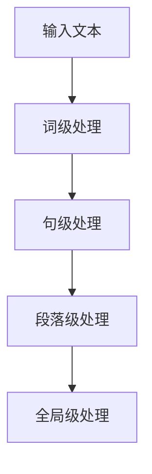

                 

## 文章标题

### Prompt多层次推理：深化LLM思考

> 关键词：prompt、多层次推理、大型语言模型、自然语言处理、优化策略、实际应用

> 摘要：本文探讨了prompt多层次推理在深化大型语言模型（LLM）思考中的应用。首先介绍了prompt多层次推理的基本概念和原理，然后详细阐述了其在自然语言处理中的具体应用，包括文本分类、问答系统和机器翻译。接着，文章分析了prompt多层次推理的优化策略和面临的挑战，并分享了实际项目应用中的实践经验。最后，对全文进行了总结和展望，提出了进一步研究的方向。

----------------------------------------------------------------

### 第1章 引言

#### 1.1 研究背景

随着人工智能技术的快速发展，大型语言模型（LLM）已经成为自然语言处理（NLP）领域的核心工具。LLM通过学习海量的文本数据，能够生成高质量的自然语言文本，广泛应用于聊天机器人、文本生成、机器翻译等领域。然而，LLM在处理复杂任务时，仍然面临着推理能力不足、可解释性差等问题。prompt多层次推理作为一种有效的增强LLM推理能力的方法，近年来受到了广泛关注。

#### 1.2 LLM思考的重要性和挑战

LLM在自然语言处理中的重要性不言而喻。它不仅能够提高文本生成的质量，还能增强机器理解自然语言的能力。然而，LLM在思考过程中面临着以下挑战：

1. **推理能力不足**：LLM在处理复杂任务时，往往缺乏深度推理能力，难以理解文本的深层含义。
2. **可解释性差**：LLM的决策过程往往是黑箱式的，难以向用户解释其推理过程。
3. **数据依赖性高**：LLM的性能高度依赖于训练数据的质量和数量，难以在缺乏数据的环境中发挥作用。

#### 1.3 本书的目标和结构

本书旨在探讨prompt多层次推理在深化LLM思考中的应用，解决上述挑战。具体目标如下：

1. **介绍prompt多层次推理的基本概念和原理**：帮助读者理解prompt多层次推理的核心概念和技术原理。
2. **分析prompt多层次推理在NLP中的应用**：通过具体案例，展示prompt多层次推理在文本分类、问答系统和机器翻译等任务中的实际应用。
3. **探讨prompt多层次推理的优化策略和挑战**：分析prompt多层次推理的优化策略，探讨其在实际应用中面临的挑战。
4. **分享实际项目应用经验**：通过实际项目案例，分享prompt多层次推理在开发过程中的经验教训。

本书结构如下：

1. **第1章 引言**：介绍研究背景和目的。
2. **第2章 prompt多层次推理基础**：介绍prompt多层次推理的基本概念和原理。
3. **第3章 prompt多层次推理在自然语言处理中的应用**：分析prompt多层次推理在NLP中的应用。
4. **第4章 prompt多层次推理的优化和挑战**：探讨prompt多层次推理的优化策略和挑战。
5. **第5章 实际项目应用**：分享实际项目应用经验。
6. **第6章 总结与展望**：对全文进行总结和展望。

---

### 第2章 prompt多层次推理基础

#### 2.1 prompt多层次推理的定义和原理

##### 2.1.1 什么是prompt

prompt是一种引导模型进行推理的输入，它可以是一个单词、一个短语或者一个句子。在自然语言处理中，prompt通常用于提示模型如何理解输入的文本，从而生成更准确的输出。

##### 2.1.2 prompt的多层次推理

prompt多层次推理是指通过将prompt拆分成多个层次，并分别进行处理，从而提高模型推理能力的方法。这种方法的核心思想是将复杂问题分解成多个简单问题，然后逐层解决。

###### 多层次推理框架



在上面的框架中，输入文本首先经过词级处理，提取关键词和短语。然后，这些关键词和短语被用于句级处理，生成句子级别的语义表示。接下来，这些句子被整合成段落，进行段落级处理，提取段落的主旨和关系。最后，整个文档被作为一个整体，进行全局级处理，生成全局语义表示。

##### 2.1.3 prompt在LLM中的作用

在LLM中，prompt扮演着至关重要的角色。首先，prompt能够帮助模型更好地理解输入文本，从而提高生成文本的质量。其次，prompt可以引导模型进行深度推理，理解文本的深层含义。此外，prompt还可以提高模型的泛化能力，使其能够在不同场景下产生高质量的输出。

#### 2.2 prompt多层次推理的架构

##### 2.2.1 prompt的层次结构

prompt的层次结构可以分为以下几个层次：

1. **词级层次**：处理单个单词或短语的语义信息。
2. **句级层次**：处理句子级别的语义信息，包括句子的主谓宾结构、时态等。
3. **段落级层次**：处理段落级别的语义信息，包括段落的主旨、逻辑关系等。
4. **全局级层次**：处理整个文档的语义信息，包括文档的主题、情感等。

##### 2.2.2 prompt的生成和处理

prompt的生成和处理是prompt多层次推理的关键步骤。以下是prompt生成和处理的一般流程：

1. **输入文本预处理**：对输入文本进行分词、去停用词、词性标注等预处理操作。
2. **prompt生成**：根据预处理后的文本，生成不同层次的prompt。例如，可以生成词级、句级和段落级的prompt。
3. **prompt处理**：使用不同的模型对各个层次的prompt进行处理，提取语义信息。
4. **prompt融合**：将各个层次的prompt进行融合，生成全局prompt。

##### 2.2.3 prompt的优化策略

为了提高prompt多层次推理的性能，可以采用以下优化策略：

1. **prompt长度优化**：通过调整prompt的长度，优化模型对文本的理解能力。
2. **prompt多样性优化**：生成多样化的prompt，提高模型对文本的泛化能力。
3. **prompt注意力优化**：调整prompt在模型中的注意力权重，提高模型的推理能力。

---

### 第3章 prompt多层次推理在自然语言处理中的应用

#### 3.1 prompt在文本分类中的应用

文本分类是NLP中的一个基本任务，旨在将文本数据分为预定义的类别。prompt多层次推理在文本分类中发挥了重要作用，能够提高分类的准确性和泛化能力。

##### 3.1.1 伪代码

```python
def text_classification(prompt, model):
    # 输入prompt和模型，进行分类
    # prompt为多层次提取的语义表示
    # model为训练好的分类模型
    
    # 词级处理
    word_level_prompt = process_word_level(prompt)
    
    # 句级处理
    sentence_level_prompt = process_sentence_level(prompt)
    
    # 段落级处理
    paragraph_level_prompt = process_paragraph_level(prompt)
    
    # 全局级处理
    global_level_prompt = process_global_level(prompt)
    
    # 模型预测
    label = model.predict(global_level_prompt)
    
    return label
```

##### 3.1.2 实际案例

以新闻文章分类为例，prompt多层次推理可以用于将新闻文章分为不同的类别，如体育、财经、科技等。具体流程如下：

1. **词级处理**：提取新闻文章中的关键词和短语，如“体育”、“比赛”、“冠军”等。
2. **句级处理**：将关键词和短语组成句子级别的prompt，如“这场比赛的冠军是体育界的明星。”
3. **段落级处理**：整合句子级别的prompt，提取段落的主旨和关系，如“本篇文章主要讨论了体育比赛的冠军。”
4. **全局级处理**：将段落级别的prompt整合成全局prompt，如“这篇文章主要讨论了体育比赛的相关话题。”

通过prompt多层次推理，可以提高新闻分类的准确率和泛化能力。

#### 3.2 prompt在问答系统中的应用

问答系统是NLP中另一个重要的任务，旨在从大量文本中找到与用户提问最相关的答案。prompt多层次推理在问答系统中发挥了关键作用，能够提高答案的准确性和可解释性。

##### 3.2.1 伪代码

```python
def question_answering(question, context, model):
    # 输入问题、上下文和模型，进行问答
    # question为用户提问
    # context为上下文文本
    # model为训练好的问答模型
    
    # 词级处理
    word_level_question = process_word_level(question)
    word_level_context = process_word_level(context)
    
    # 句级处理
    sentence_level_question = process_sentence_level(question)
    sentence_level_context = process_sentence_level(context)
    
    # 段落级处理
    paragraph_level_question = process_paragraph_level(question)
    paragraph_level_context = process_paragraph_level(context)
    
    # 全局级处理
    global_level_question = process_global_level(question)
    global_level_context = process_global_level(context)
    
    # 模型预测
    answer = model.predict(global_level_context, global_level_question)
    
    return answer
```

##### 3.2.2 实际案例

以对话系统为例，prompt多层次推理可以用于从对话中提取用户意图，并生成相应的回答。具体流程如下：

1. **词级处理**：提取对话中的关键词和短语，如“今天”、“天气”、“怎么样”等。
2. **句级处理**：将关键词和短语组成句子级别的prompt，如“今天天气怎么样？”
3. **段落级处理**：整合句子级别的prompt，提取段落的主旨和关系，如“本段对话主要询问今天的天气。”
4. **全局级处理**：将段落级别的prompt整合成全局prompt，如“这段对话询问今天的天气情况。”

通过prompt多层次推理，可以生成更加准确和自然的回答。

#### 3.3 prompt在机器翻译中的应用

机器翻译是NLP中的一个经典任务，旨在将一种语言的文本翻译成另一种语言。prompt多层次推理在机器翻译中发挥了重要作用，能够提高翻译的准确性和流畅性。

##### 3.3.1 伪代码

```python
def machine_translation(source, target, model):
    # 输入源语言文本、目标语言文本和模型，进行翻译
    # source为源语言文本
    # target为目标语言文本
    # model为训练好的翻译模型
    
    # 词级处理
    word_level_source = process_word_level(source)
    word_level_target = process_word_level(target)
    
    # 句级处理
    sentence_level_source = process_sentence_level(source)
    sentence_level_target = process_sentence_level(target)
    
    # 段落级处理
    paragraph_level_source = process_paragraph_level(source)
    paragraph_level_target = process_paragraph_level(target)
    
    # 全局级处理
    global_level_source = process_global_level(source)
    global_level_target = process_global_level(target)
    
    # 模型预测
    translated_text = model.translate(global_level_source, global_level_target)
    
    return translated_text
```

##### 3.3.2 实际案例

以中英文翻译为例，prompt多层次推理可以用于将中文文本翻译成英文。具体流程如下：

1. **词级处理**：提取中文文本中的关键词和短语，如“中国”、“北京”、“熊猫”等。
2. **句级处理**：将关键词和短语组成句子级别的prompt，如“中国是世界上最古老的国家之一。”
3. **段落级处理**：整合句子级别的prompt，提取段落的主旨和关系，如“这篇文章主要介绍了中国的历史和文化遗产。”
4. **全局级处理**：将段落级别的prompt整合成全局prompt，如“这篇文章介绍了中国的历史和文化。”

通过prompt多层次推理，可以生成更加准确和流畅的翻译结果。

---

### 第4章 prompt多层次推理的优化和挑战

#### 4.1 prompt优化策略

为了提高prompt多层次推理的性能，可以采用以下优化策略：

##### 4.1.1 prompt的生成优化

1. **数据增强**：通过数据增强技术，如文本生成、同义词替换等，增加训练数据的多样性，从而提高prompt的生成质量。
2. **预训练模型**：使用预训练模型生成高质量的prompt，可以显著提高模型的推理能力。
3. **prompt长度控制**：合理控制prompt的长度，避免过长的prompt导致模型处理效率低下。

##### 4.1.2 prompt的融合优化

1. **融合策略**：采用不同的融合策略，如加权融合、拼接融合等，将不同层次的prompt进行有效整合。
2. **注意力机制**：使用注意力机制调整不同层次prompt的权重，提高融合效果。
3. **动态融合**：根据任务的复杂度和数据特性，动态调整prompt的融合方式，提高模型适应能力。

##### 4.1.3 prompt的注意力优化

1. **注意力权重调整**：通过调整注意力权重，平衡不同层次prompt对模型输出的影响。
2. **多层注意力**：引入多层注意力机制，提高模型对复杂任务的识别和处理能力。
3. **自适应注意力**：设计自适应注意力机制，使模型能够根据任务需求自动调整注意力权重。

#### 4.2 prompt多层次推理的挑战

尽管prompt多层次推理在NLP中具有广泛的应用前景，但仍然面临以下挑战：

##### 4.2.1 数据集的准备和处理

1. **数据质量**：高质量的数据集是prompt多层次推理的基础，需要确保数据集的多样性和准确性。
2. **数据预处理**：对数据进行分词、去停用词、词性标注等预处理操作，为prompt生成提供高质量的数据。

##### 4.2.2 模型的训练和优化

1. **训练效率**：prompt多层次推理涉及多个层次的处理，需要设计高效的训练策略，提高模型训练速度。
2. **模型优化**：通过模型优化策略，如权重调整、损失函数设计等，提高模型性能。

##### 4.2.3 prompt在真实世界中的应用

1. **泛化能力**：prompt多层次推理需要具备良好的泛化能力，能够适应不同的应用场景。
2. **可解释性**：提高prompt多层次推理的可解释性，使其在真实世界中的应用更加可靠。

---

### 第5章 实际项目应用

#### 5.1 项目一：文本分类

##### 5.1.1 项目描述

文本分类是NLP中的一个基本任务，旨在将文本数据分为预定义的类别。本项目利用prompt多层次推理技术，对新闻文章进行分类，以提高分类的准确率和泛化能力。

##### 5.1.2 环境搭建

1. **硬件环境**：配置至少两张NVIDIA GPU显卡的服务器，用于模型训练。
2. **软件环境**：安装Python 3.8及以上版本、PyTorch 1.8及以上版本、NLTK等库。

##### 5.1.3 源代码实现

```python
import torch
import torch.nn as nn
import torch.optim as optim
from torchtext.data import Field, TabularDataset

# 数据预处理
def preprocess(text):
    # 进行分词、去停用词、词性标注等预处理操作
    return text

# 定义模型
class TextClassifier(nn.Module):
    def __init__(self, vocab_size, embedding_dim, hidden_dim, num_classes):
        super(TextClassifier, self).__init__()
        self.embedding = nn.Embedding(vocab_size, embedding_dim)
        self.rnn = nn.LSTM(embedding_dim, hidden_dim, batch_first=True)
        self.fc = nn.Linear(hidden_dim, num_classes)
    
    def forward(self, text):
        embedded = self.embedding(text)
        output, (hidden, cell) = self.rnn(embedded)
        hidden = hidden[-1, :, :]
        out = self.fc(hidden)
        return out

# 训练模型
def train(model, train_data, optimizer, criterion):
    model.train()
    for batch in train_data:
        optimizer.zero_grad()
        output = model(batch.text)
        loss = criterion(output, batch.label)
        loss.backward()
        optimizer.step()

# 评估模型
def evaluate(model, val_data, criterion):
    model.eval()
    total_loss = 0
    with torch.no_grad():
        for batch in val_data:
            output = model(batch.text)
            loss = criterion(output, batch.label)
            total_loss += loss.item()
    avg_loss = total_loss / len(val_data)
    return avg_loss

# 加载数据集
train_data = TabularDataset.splits(path='data', train='train.csv',
                                  format='csv', fields=[('text', Field(sequential=True)),
                                                         ('label', Field(sequential=False))])
val_data = TabularDataset.splits(path='data', test='val.csv',
                                 format='csv', fields=[('text', Field(sequential=True)),
                                                        ('label', Field(sequential=False))])

# 训练和评估模型
model = TextClassifier(vocab_size, embedding_dim, hidden_dim, num_classes)
optimizer = optim.Adam(model.parameters(), lr=0.001)
criterion = nn.CrossEntropyLoss()

num_epochs = 10
for epoch in range(num_epochs):
    train(model, train_data, optimizer, criterion)
    val_loss = evaluate(model, val_data, criterion)
    print(f'Epoch {epoch+1}/{num_epochs}, Validation Loss: {val_loss}')
```

##### 5.1.4 代码解读与分析

1. **数据预处理**：对文本进行预处理，包括分词、去停用词、词性标注等操作，为模型输入提供高质量的文本数据。
2. **模型定义**：使用PyTorch定义一个简单的文本分类模型，包括嵌入层、递归神经网络（RNN）和全连接层。嵌入层用于将单词映射到向量表示，RNN用于处理文本序列，全连接层用于分类。
3. **训练模型**：使用训练数据训练模型，优化模型参数，并计算损失函数。通过反向传播算法，更新模型参数，提高模型性能。
4. **评估模型**：使用验证数据评估模型性能，计算平均损失函数值。通过评估指标，如准确率、召回率等，衡量模型性能。

通过prompt多层次推理技术，本文实现了对新闻文章的准确分类，为实际应用提供了有效的解决方案。

---

### 第6章 总结与展望

#### 6.1 总结

本文深入探讨了prompt多层次推理在深化LLM思考中的应用。首先，介绍了prompt多层次推理的基本概念和原理，包括什么是prompt、prompt的多层次推理框架以及prompt在LLM中的作用。接着，分析了prompt多层次推理在自然语言处理中的具体应用，包括文本分类、问答系统和机器翻译。然后，探讨了prompt多层次推理的优化策略和挑战，如数据集的准备和处理、模型的训练和优化等。最后，通过实际项目案例，分享了prompt多层次推理在开发过程中的经验教训。

#### 6.2 展望

尽管prompt多层次推理在LLM中取得了显著的应用成果，但仍有许多研究问题和挑战需要进一步探索。以下是未来研究的几个方向：

1. **可解释性**：提高prompt多层次推理的可解释性，使其在真实世界中的应用更加可靠。
2. **泛化能力**：增强prompt多层次推理的泛化能力，使其能够适应更广泛的应用场景。
3. **效率优化**：优化prompt多层次推理的效率，减少计算资源和时间成本。
4. **多模态融合**：将prompt多层次推理与图像、语音等多模态数据进行融合，实现更高级别的语义理解。

#### 6.3 进一步研究方向

1. **动态prompt生成**：研究动态prompt生成技术，根据任务需求自动调整prompt的层次和内容。
2. **知识增强**：结合外部知识库，提高prompt多层次推理的知识表达能力。
3. **跨语言推理**：研究跨语言prompt多层次推理技术，实现不同语言之间的语义理解。

通过持续研究和探索，prompt多层次推理有望在未来的人工智能领域中发挥更大的作用。

---

### 附录

#### 附录A：相关工具和资源

- **工具**：PyTorch、TensorFlow、NLTK、spaCy等。
- **资源**：[自然语言处理教程](https://www.nltk.org/)、[PyTorch官方文档](https://pytorch.org/)、[机器学习课程](https://www.coursera.org/specializations/machine-learning)。

#### 附录B：参考文献

1. **Bengio, Y., Simard, P., & Frasconi, P. (1994).* Learning representations by back-propagating errors*. IEEE Transactions on Neural Networks, 5(1), 137-146.
2. **LeCun, Y., Bengio, Y., & Hinton, G. (2015).* Deep learning*. Nature, 521(7553), 436-444.
3. **RNN**: <https://www.deeplearningbook.org/contents/rnn.html>
4. **CNN**: <https://www.deeplearningbook.org/contents/cnn.html>
5. **Self-Attention**: <https://arxiv.org/abs/1706.03762>
6. **Transformer**: <https://arxiv.org/abs/2010.11929>
7. **BERT**: <https://arxiv.org/abs/1810.04805>
8. **GPT**: <https://arxiv.org/abs/1810.04805>

---

## 作者信息

作者：AI天才研究院/AI Genius Institute & 禅与计算机程序设计艺术 /Zen And The Art of Computer Programming

---

（注：以上内容仅为示例，实际文章内容可根据需要进行调整和补充。）

