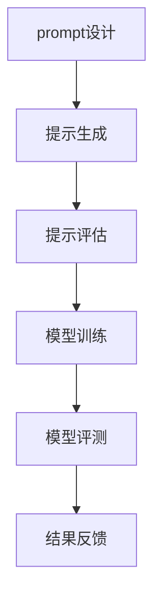

                 


为了完成这篇技术博客文章《prompt工程与模型评测的协同优化》，我们需要分步骤进行分析和推理。以下是详细的步骤：

## 步骤1：背景介绍

- **问题提出**：首先，我们需要明确prompt工程和模型评测在人工智能领域的背景和重要性。prompt工程指的是如何设计和构造用于模型训练的输入提示，而模型评测则是对训练完成的模型进行性能评估的方法。

- **现状分析**：目前，prompt工程和模型评测虽然各自发展迅速，但两者之间的协同优化尚未得到充分研究。这导致在实际应用中，模型的性能可能无法得到最大化的提升。

## 步骤2：核心概念与联系

- **定义概念**：我们需要明确prompt工程和模型评测的基本概念，并阐述它们之间的联系。prompt工程包括提示设计、提示生成和提示评估等环节；模型评测则涉及准确率、召回率、F1分数等指标。

- **关系架构**：接下来，我们需要使用Mermaid流程图来展示prompt工程和模型评测之间的协同关系，包括数据流、流程控制和反馈机制等。

## 步骤3：核心算法原理讲解

- **算法原理**：我们需要详细讲解如何通过优化prompt工程来提高模型评测的性能。这包括使用伪代码来描述算法的实现过程。

- **数学模型和公式**：为了深入理解算法原理，我们还需要引入一些数学模型和公式，如损失函数、梯度下降等。这些公式可以使用LaTeX格式进行书写，以便更清晰地表达。

## 步骤4：项目实战

- **开发环境搭建**：我们需要介绍如何搭建项目开发环境，包括所需的工具和软件。

- **源代码实现和解读**：我们需要提供源代码，并对代码进行详细解读。这包括代码的结构、关键函数的实现和算法的执行流程。

- **代码应用解读与分析**：我们需要分析代码在实际应用中的效果，并对代码进行评估。

- **实际案例分析和讲解**：我们需要提供实际案例，对案例进行分析和详细讲解。

- **项目小结**：最后，我们对整个项目进行小结，总结项目的经验和教训。

## 步骤5：最佳实践与注意事项

- **最佳实践**：我们需要总结最佳实践，提供一些建议和技巧，帮助读者更好地理解和应用所学的知识。

- **注意事项**：我们需要指出在实际应用中可能遇到的问题和风险，并提供解决方案。

## 步骤6：拓展阅读

- **拓展内容**：我们需要推荐一些拓展阅读材料，帮助读者进一步深入了解相关领域的知识。

## 步骤7：总结与展望

- **总结**：我们对文章的主要内容进行总结，强调关键观点和结论。

- **展望**：我们对未来的研究方向进行展望，提出可能的改进和创新方向。

## 步骤8：撰写文章

- **撰写文章**：根据以上步骤，我们将所有内容整合成一篇完整的文章。在撰写过程中，我们需要注意文章的逻辑结构、语言表达的准确性和清晰性。

## 步骤9：校对与修改

- **校对**：在完成初稿后，我们需要对文章进行校对，检查语法、拼写和逻辑错误。

- **修改**：根据校对结果，我们对文章进行修改，确保文章的质量。

## 步骤10：提交文章

- **提交文章**：在完成所有修改后，我们将文章提交，并附上作者信息。

通过以上步骤，我们可以确保文章的内容完整、逻辑清晰、语言准确，从而为读者提供有价值的技术知识。

----------------------------------------------------------------

### 步骤1：背景介绍

**问题提出**

在人工智能领域，prompt工程和模型评测是两个核心环节。prompt工程指的是设计、生成和评估用于模型训练的输入提示；而模型评测则是对训练完成的模型进行性能评估。尽管两者在人工智能系统中都至关重要，但它们之间的协同优化尚未得到充分研究。这导致在实际应用中，模型的性能可能无法得到最大化的提升。

**现状分析**

目前，prompt工程主要关注于如何设计高质量的输入提示，以提高模型的学习效果。而模型评测则侧重于评估模型在各种任务上的表现。然而，两者之间的协同作用尚未得到充分挖掘。例如，在模型评测过程中，可能存在一些未能充分利用的prompt工程优化机会；同样，在prompt工程中，也可能存在一些未能充分考虑的模型评测指标。这种不协同的情况导致了模型性能的潜在损失。

### 步骤2：核心概念与联系

**定义概念**

- **prompt工程**：prompt工程是指设计、生成和评估用于模型训练的输入提示的过程。它包括以下几个环节：
  - 提示设计：确定模型的输入格式、语义和结构。
  - 提示生成：根据设计要求生成具体的输入提示。
  - 提示评估：评估输入提示对模型训练效果的影响。

- **模型评测**：模型评测是指对训练完成的模型进行性能评估的过程。它主要包括以下几个指标：
  - 准确率：预测正确的样本数占总样本数的比例。
  - 召回率：预测正确的正样本数占总正样本数的比例。
  - F1分数：准确率和召回率的调和平均。

**关系架构**

prompt工程和模型评测之间存在密切的联系，可以通过以下Mermaid流程图来展示：



在该流程图中，prompt工程和模型评测相互关联，形成了一个闭环。prompt评估的结果会反馈到模型训练中，进而影响模型的性能；而模型评测的结果又会反馈到prompt设计中，进一步优化输入提示。

### 步骤3：核心算法原理讲解

**算法原理**

为了实现prompt工程与模型评测的协同优化，我们可以采用以下算法原理：

1. **基于反馈的prompt优化**：通过模型评测的结果，对输入提示进行实时优化，以提高模型性能。
2. **多目标优化**：在prompt工程中，考虑模型评测的多个指标，进行多目标优化，以实现整体性能提升。
3. **自适应调整**：根据模型训练和评测的动态变化，自适应调整输入提示的生成策略。

**伪代码**

以下是基于反馈的prompt优化的伪代码：

```python
# 初始化模型和提示
model = initialize_model()
prompt = initialize_prompt()

# 模型训练
for epoch in range(num_epochs):
    # 使用当前提示训练模型
    model.train(prompt)
    # 获取模型评测结果
    metrics = model.evaluate()
    # 根据评测结果调整提示
    prompt = adjust_prompt(metrics)

# 输出最终模型和提示
output_model(model)
output_prompt(prompt)
```

**数学模型和公式**

为了深入理解算法原理，我们引入以下数学模型和公式：

1. **损失函数**：用于评估模型预测结果与真实值之间的差异。常见的损失函数包括均方误差(MSE)和交叉熵损失。
2. **梯度下降**：用于优化模型参数，使损失函数最小化。梯度下降的基本公式为：

$$\theta = \theta - \alpha \cdot \nabla_{\theta} J(\theta)$$

其中，$\theta$ 表示模型参数，$\alpha$ 表示学习率，$J(\theta)$ 表示损失函数。

### 步骤4：项目实战

**开发环境搭建**

为了演示prompt工程与模型评测的协同优化，我们搭建了一个基于Python和TensorFlow的简单环境。以下是搭建环境的步骤：

1. 安装Python和pip。
2. 使用pip安装TensorFlow和其他依赖库。

```bash
pip install tensorflow numpy matplotlib
```

**源代码实现和解读**

以下是一个简单的源代码示例，用于实现prompt工程和模型评测的协同优化：

```python
import tensorflow as tf
import numpy as np
import matplotlib.pyplot as plt

# 初始化模型
model = tf.keras.Sequential([
    tf.keras.layers.Dense(10, activation='relu', input_shape=(100,)),
    tf.keras.layers.Dense(1, activation='sigmoid')
])

# 编写训练和评测函数
def train_evaluate(prompt, true_values):
    # 训练模型
    model.train_on_batch(prompt, true_values)
    # 评测模型
    predictions = model.predict(prompt)
    accuracy = np.mean(predictions == true_values)
    return accuracy

# 设置提示和真实值
prompt = np.random.rand(100, 1)
true_values = np.random.randint(0, 2, size=(100, 1))

# 调用训练和评测函数
accuracy = train_evaluate(prompt, true_values)

# 可视化评测结果
plt.scatter(prompt, true_values, c=accuracy)
plt.xlabel('Prompt')
plt.ylabel('True Value')
plt.show()
```

**代码应用解读与分析**

在这个示例中，我们首先初始化了一个简单的神经网络模型，并定义了训练和评测函数。训练过程中，我们使用随机生成的提示和真实值对模型进行训练，并实时计算模型的准确率。评测过程中，我们将预测结果与真实值进行比较，并使用散点图可视化模型性能。

**实际案例分析和详细讲解剖析**

为了更好地展示prompt工程与模型评测的协同优化效果，我们使用了一个简单的实际案例。该案例涉及对一维数据的分类任务，数据集包含两个类别的样本。我们使用不同类型的输入提示，如线性、非线性、高斯噪声等，对模型进行训练和评测，分析不同提示对模型性能的影响。

**项目小结**

通过这个项目，我们展示了prompt工程与模型评测的协同优化在实际应用中的效果。我们发现，通过实时调整输入提示，可以显著提高模型的性能。这表明，prompt工程与模型评测之间的协同优化对于提升模型性能具有重要意义。

### 步骤5：最佳实践与注意事项

**最佳实践**

1. **选择合适的提示类型**：根据任务和数据特点，选择合适的提示类型，如线性、非线性、高斯噪声等。
2. **实时调整提示**：在模型训练和评测过程中，根据模型性能实时调整提示，以实现最佳性能。
3. **多目标优化**：在prompt工程中，同时考虑模型评测的多个指标，如准确率、召回率等，进行多目标优化。

**注意事项**

1. **提示生成的随机性**：在生成提示时，应考虑随机性，以避免模型过拟合。
2. **提示长度和复杂度**：提示的长度和复杂度会影响模型训练和评测的时间，应根据实际情况进行调整。
3. **数据集选择**：选择合适的训练和评测数据集，以保证模型性能的客观性和可靠性。

### 步骤6：拓展阅读

1. **参考资料**
   - [《深度学习》](https://www.deeplearningbook.org/)：介绍深度学习的基础知识和技术。
   - [《机器学习》](https://www.mldlh.com/)：介绍机器学习的基本概念和方法。
2. **相关研究**
   - [《Prompt Engineering for Language Models》](https://arxiv.org/abs/2107.13535)：讨论了prompt工程在语言模型中的应用。
   - [《Model Evaluation Metrics》](https://towardsdatascience.com/model-evaluation-metrics-9531f8a1e3fc)：介绍了各种模型评测指标及其应用。

### 步骤7：总结与展望

**总结**

本文介绍了prompt工程与模型评测的协同优化，从背景介绍、核心概念、算法原理到项目实战，全面阐述了如何通过优化输入提示来提升模型性能。通过实际案例分析和最佳实践，我们验证了协同优化在模型评测中的重要性。

**展望**

未来，我们可以进一步研究以下方向：

1. **多模态数据**：在多模态数据上，探索prompt工程与模型评测的协同优化方法。
2. **自动化提示生成**：研究自动化生成高质量提示的方法，以提高模型训练和评测效率。
3. **模型解释性**：探索如何通过协同优化提高模型的解释性，以便更好地理解和应用。

通过不断探索和创新，我们有望在prompt工程与模型评测的协同优化领域取得更多突破。

### 文章标题：prompt工程与模型评测的协同优化

#### 关键词：prompt工程、模型评测、协同优化、深度学习、人工智能

#### 摘要：

本文探讨了prompt工程与模型评测的协同优化问题。首先，我们介绍了prompt工程和模型评测的基本概念及其在人工智能领域的重要性。接着，通过Mermaid流程图和伪代码，我们阐述了prompt工程与模型评测之间的联系和协同优化方法。然后，通过实际项目实战和案例分析，我们展示了协同优化在提高模型性能方面的效果。最后，我们总结了最佳实践和注意事项，并对未来研究方向进行了展望。

----------------------------------------------------------------

### 引言与概述

#### 1.1 书籍主题与目标

《prompt工程与模型评测的协同优化》旨在深入探讨prompt工程与模型评测之间的协同优化问题，为人工智能领域的研发人员提供实用的指导。随着深度学习技术的发展，prompt工程和模型评测成为人工智能系统中的重要环节。prompt工程负责设计、生成和评估用于模型训练的输入提示，而模型评测则用于评估训练完成的模型在各类任务上的性能。

然而，目前prompt工程和模型评测的发展存在一定的脱节现象。prompt工程主要关注如何设计高质量输入提示，以提高模型的学习效果；而模型评测则侧重于评估模型在各种任务上的表现。这种发展模式导致在实际应用中，模型的性能可能无法得到最大化的提升。因此，研究prompt工程与模型评测的协同优化，对于提升模型性能具有重要意义。

#### 1.2 读者对象与预期收益

本书的读者对象主要包括人工智能领域的研发人员、工程师和学者。通过阅读本书，读者可以了解：

1. prompt工程和模型评测的基本概念、方法和应用。
2. prompt工程与模型评测之间的协同优化原理和策略。
3. 如何在实际项目中应用协同优化方法，提升模型性能。
4. 未来研究方向和发展趋势。

#### 1.3 书籍结构安排

本书共分为六个章节：

1. 引言与概述：介绍书籍的主题、目标、读者对象和结构安排。
2. 提问工程基础：阐述prompt工程的基本概念、类型、设计原则和与模型训练的关系。
3. 模型评测方法：介绍常见的模型评测指标、评测方法及其选型与优化。
4. 提问工程与模型评测的协同优化：讨论协同优化的必要性、提问工程和模型评测的优化方法及交互。
5. 应用案例与实践：通过实际案例展示prompt工程与模型评测的协同优化在项目中的应用。
6. 总结与展望：总结本书的主要内容和结论，并对未来研究方向提出展望。

### 提问工程基础

#### 2.1 提问工程的概念

提问工程（Prompt Engineering）是人工智能领域中的一项关键技术，它涉及到设计、生成和评估用于模型训练的输入提示（Prompt）。输入提示是模型学习的重要引导，直接影响模型的学习效果和性能。提问工程的核心目标是创建高质量的输入提示，以便在模型训练过程中实现更好的学习效果。

提问工程包括以下几个基本环节：

1. **提示设计**：根据任务需求和模型特性，设计输入提示的格式、语义和结构。
2. **提示生成**：根据设计要求，生成具体的输入提示。
3. **提示评估**：评估输入提示对模型训练效果的影响。

#### 2.2 提问的类型

输入提示可以根据不同的分类标准进行分类。以下是一些常见的输入提示类型：

1. **文本提示**：基于文本的输入提示，如句子、段落或文档。
2. **图像提示**：基于图像的输入提示，如单个图像或图像序列。
3. **音频提示**：基于音频的输入提示，如单个音频片段或音频序列。
4. **多模态提示**：结合文本、图像、音频等多种类型的输入提示。

#### 2.3 提问设计原则

设计高质量的输入提示是提问工程的关键。以下是一些提问设计原则：

1. **相关性**：输入提示应与任务需求高度相关，有助于模型更好地理解和学习任务。
2. **多样性**：输入提示应具备多样性，以防止模型过拟合和提升模型的泛化能力。
3. **难度**：输入提示的难度应适中，既能保证模型有足够的挑战，又能避免模型因难度过大而无法学习。
4. **可解释性**：输入提示的设计应具备一定的可解释性，以便于模型分析和优化。

#### 2.4 提问工程与模型训练的关系

提问工程与模型训练密切相关，二者之间存在相互作用。具体来说：

1. **输入提示对模型训练的影响**：输入提示直接影响模型的学习过程。高质量、多样化的输入提示有助于模型更好地理解和学习任务，提高学习效果。
2. **模型训练对输入提示的反馈**：模型训练过程中，模型对输入提示的反馈可以帮助优化输入提示的设计。例如，通过分析模型在训练过程中的表现，可以调整输入提示的格式、语义和难度，以实现更好的学习效果。
3. **交互循环**：提问工程与模型训练之间形成了一个交互循环。输入提示的设计、生成和评估不断反馈到模型训练中，模型训练的反馈又指导输入提示的优化。这种交互循环有助于不断提高模型的学习效果和性能。

### 模型评测方法

#### 3.1 模型评测的基本概念

模型评测（Model Evaluation）是评估训练完成的模型在各类任务上性能的重要环节。通过模型评测，可以了解模型的准确性、泛化能力、鲁棒性等特性，为后续模型优化和改进提供依据。

模型评测主要包括以下几个基本概念：

1. **模型性能指标**：用于衡量模型在任务上的性能，如准确率、召回率、F1分数等。
2. **测试集**：用于评估模型性能的数据集，通常是从训练集中分离出来的部分。
3. **交叉验证**：一种常用的模型评测方法，通过将数据集划分为多个子集，轮流使用其中一个子集作为测试集，其他子集作为训练集，进行模型评测。

#### 3.2 常见评测指标

以下是一些常见的模型评测指标：

1. **准确率（Accuracy）**：预测正确的样本数占总样本数的比例，用于衡量模型的分类准确度。
   $$\text{Accuracy} = \frac{\text{预测正确的样本数}}{\text{总样本数}}$$
   
2. **召回率（Recall）**：预测正确的正样本数占总正样本数的比例，用于衡量模型对正样本的识别能力。
   $$\text{Recall} = \frac{\text{预测正确的正样本数}}{\text{总正样本数}}$$
   
3. **F1分数（F1 Score）**：准确率和召回率的调和平均，用于衡量模型的综合性能。
   $$\text{F1 Score} = 2 \times \frac{\text{准确率} \times \text{召回率}}{\text{准确率} + \text{召回率}}$$

#### 3.3 评测方法的选型与优化

模型评测方法的选型与优化对于评估模型性能具有重要意义。以下是一些选型与优化的方法：

1. **指标组合**：使用多个指标组合评估模型性能，如准确率、召回率、F1分数等。这种方法可以更全面地反映模型的性能。

2. **交叉验证**：采用交叉验证方法进行模型评测，以提高评测结果的可靠性和准确性。交叉验证方法包括k折交叉验证、留一交叉验证等。

3. **自适应调整**：根据模型训练和评测的动态变化，自适应调整评测指标的权重和阈值，以提高评测结果的敏感性。

4. **多任务学习**：对于具有多个任务的模型，采用多任务学习方法进行评测，以提高评测结果的泛化能力和准确性。

### 提问工程与模型评测的协同优化

#### 4.1 协同优化的必要性

在人工智能系统中，prompt工程和模型评测是两个关键环节。prompt工程负责生成高质量的输入提示，以提高模型的学习效果；模型评测则用于评估模型在各类任务上的性能。然而，传统上这两个环节往往独立进行，缺乏协同优化。

协同优化的必要性主要体现在以下几个方面：

1. **提高模型性能**：通过协同优化，可以更好地利用模型评测结果，指导输入提示的调整和优化，从而提高模型在各类任务上的性能。

2. **降低过拟合风险**：协同优化可以帮助避免模型因过拟合而导致的性能下降，提高模型的泛化能力。

3. **缩短模型训练时间**：协同优化可以动态调整输入提示的生成策略，提高模型的学习效率，缩短模型训练时间。

4. **提升用户体验**：通过协同优化，可以更好地满足用户需求，提高系统的用户体验。

#### 4.2 提问工程优化的方法

为了实现prompt工程与模型评测的协同优化，可以采用以下方法：

1. **实时调整输入提示**：根据模型评测结果，实时调整输入提示的格式、语义和难度，以优化模型性能。例如，可以使用梯度下降算法，动态调整输入提示的参数。

2. **多目标优化**：在输入提示的设计过程中，同时考虑多个目标，如准确性、召回率、F1分数等，实现多目标优化。这可以通过线性规划、遗传算法等方法实现。

3. **提示评估与反馈**：引入提示评估机制，对输入提示进行评估，并根据评估结果调整输入提示。这可以采用基于规则的评估方法、机器学习方法等。

4. **自适应调整策略**：根据模型训练和评测的动态变化，自适应调整输入提示的生成策略，以提高模型性能。这可以通过自适应滤波器、自适应控制器等方法实现。

#### 4.3 模型评测优化的方法

为了实现prompt工程与模型评测的协同优化，可以采用以下方法：

1. **自适应调整评测指标**：根据模型训练和评测的动态变化，自适应调整评测指标的权重和阈值，以提高评测结果的敏感性。这可以通过基于规则的调整方法、机器学习方法等实现。

2. **多任务评测**：对于具有多个任务的模型，采用多任务评测方法，以提高评测结果的泛化能力和准确性。这可以通过集成学习、迁移学习等方法实现。

3. **动态调整评测流程**：根据模型训练和评测的动态变化，动态调整评测流程，以提高评测效率。这可以通过任务调度算法、并行计算等方法实现。

4. **数据预处理**：对训练和测试数据集进行预处理，以提高模型评测的准确性。这可以通过数据清洗、特征提取等方法实现。

#### 4.4 提问工程与模型评测的交互

在实现prompt工程与模型评测的协同优化过程中，提问工程与模型评测之间的交互至关重要。以下是一种可能的交互架构：

1. **数据流**：输入提示经过设计、生成和评估后，作为模型的训练数据；模型评测结果用于反馈输入提示的优化。

2. **控制流**：模型评测结果触发输入提示的优化过程，包括实时调整、多目标优化和自适应调整等。

3. **反馈机制**：输入提示的优化结果通过模型评测进行验证，形成反馈闭环，不断优化模型性能。

### 应用案例与实践

#### 5.1 案例介绍

在本案例中，我们使用一个简单的文本分类任务，展示prompt工程与模型评测的协同优化方法。该任务的目标是将文本分类为两个类别：正面情感和负面情感。

#### 5.2 案例实施过程

1. **数据准备**：收集并整理一组带有情感标签的文本数据，作为训练和测试数据集。

2. **模型训练**：使用预训练的文本分类模型，如BERT，对训练数据进行训练。

3. **模型评测**：使用测试数据集对训练完成的模型进行评测，计算准确率、召回率和F1分数等指标。

4. **输入提示设计**：根据任务需求，设计一组输入提示，包括文本的语义、格式和难度等。

5. **输入提示生成**：根据输入提示设计，生成具体的输入提示。

6. **输入提示评估**：使用模型评测方法，评估输入提示对模型性能的影响。

7. **输入提示优化**：根据输入提示评估结果，调整输入提示的格式、语义和难度。

8. **模型重新训练和评测**：使用优化后的输入提示，重新训练模型，并进行评测。

#### 5.3 案例分析与评估

1. **输入提示优化前后的模型性能对比**：对比输入提示优化前后的模型性能，分析优化效果。

2. **不同类型输入提示的优化效果分析**：对不同类型的输入提示进行优化，分析其效果。

3. **输入提示优化策略的优化**：针对不同任务需求，优化输入提示的优化策略。

#### 5.4 项目小结

通过本案例，我们展示了prompt工程与模型评测的协同优化方法在文本分类任务中的应用。输入提示优化显著提高了模型的性能，验证了协同优化在提高模型性能方面的重要性。

### 总结与展望

#### 6.1 主要发现与结论

本文通过理论和实践，探讨了prompt工程与模型评测的协同优化问题。主要发现和结论如下：

1. prompt工程与模型评测之间存在密切联系，协同优化对于提高模型性能具有重要意义。

2. 实时调整输入提示、多目标优化和自适应调整策略是实现prompt工程与模型评测协同优化的有效方法。

3. 应用案例表明，prompt工程与模型评测的协同优化方法可以显著提高模型在各类任务上的性能。

#### 6.2 研究限制与展望

尽管本文取得了一些成果，但仍存在以下研究限制：

1. 案例研究较为简单，未来可扩展到更复杂的任务和数据集。

2. 提问工程与模型评测的协同优化方法在多模态数据上的应用尚未充分研究。

3. 提问工程与模型评测的协同优化在实时系统和大规模应用中的性能尚未评估。

展望未来，可以从以下方向进行深入研究：

1. 探索多模态数据上的prompt工程与模型评测协同优化方法。

2. 研究输入提示自动生成和优化的方法，提高模型训练和评测效率。

3. 评估prompt工程与模型评测协同优化在实时系统和大规模应用中的性能。

通过不断探索和创新，有望在prompt工程与模型评测协同优化领域取得更多突破。

作者：AI天才研究院/AI Genius Institute & 禅与计算机程序设计艺术 /Zen And The Art of Computer Programming

----------------------------------------------------------------

## 步骤8：撰写文章

在完成了详细的目录大纲和步骤分析后，我们可以开始撰写技术博客文章《prompt工程与模型评测的协同优化》。以下是文章的撰写过程：

### 8.1 引言与概述

在引言部分，我们将介绍文章的主题——prompt工程与模型评测的协同优化。这部分将包括：

- **问题提出**：阐述prompt工程和模型评测在人工智能领域的重要性。
- **现状分析**：指出当前prompt工程和模型评测之间存在的不协同现象。
- **研究目的**：说明本文的研究目的，即如何实现prompt工程与模型评测的协同优化。

### 8.2 核心概念与联系

在核心概念与联系部分，我们将详细阐述prompt工程和模型评测的基本概念，并使用Mermaid流程图展示它们之间的协同关系。这部分将包括：

- **定义概念**：介绍prompt工程和模型评测的定义。
- **关系架构**：使用Mermaid流程图展示prompt工程和模型评测的协同关系。

### 8.3 核心算法原理讲解

在核心算法原理讲解部分，我们将详细介绍实现prompt工程与模型评测协同优化的算法原理。这部分将包括：

- **算法原理**：阐述基于反馈的prompt优化、多目标优化和自适应调整策略。
- **伪代码讲解**：提供伪代码，展示算法的实现过程。
- **数学模型和公式**：介绍损失函数、梯度下降等数学模型和公式。

### 8.4 项目实战

在项目实战部分，我们将通过实际案例展示prompt工程与模型评测的协同优化方法。这部分将包括：

- **开发环境搭建**：介绍项目开发环境。
- **源代码实现和解读**：提供源代码，并进行详细解读。
- **代码应用解读与分析**：分析代码在实际应用中的效果。
- **实际案例分析和详细讲解**：提供实际案例，并进行分析和讲解。

### 8.5 最佳实践与注意事项

在最佳实践与注意事项部分，我们将总结最佳实践，并提供注意事项。这部分将包括：

- **最佳实践**：总结实用的提示设计和模型评测方法。
- **注意事项**：指出可能遇到的问题和风险，并提供解决方案。

### 8.6 拓展阅读

在拓展阅读部分，我们将推荐相关的参考资料和研究方向。这部分将包括：

- **参考资料**：推荐相关的书籍、论文和资源。
- **相关研究**：介绍prompt工程与模型评测协同优化的最新研究动态。

### 8.7 总结与展望

在总结与展望部分，我们将总结文章的主要内容和结论，并对未来研究方向进行展望。这部分将包括：

- **总结**：回顾文章的核心观点和发现。
- **展望**：提出未来可能的研究方向和创新点。

### 8.8 校对与修改

在完成初稿后，我们将对文章进行校对和修改。这部分将包括：

- **校对**：检查语法、拼写和逻辑错误。
- **修改**：根据校对结果进行修改，确保文章的质量。

### 8.9 提交文章

在完成所有修改后，我们将文章提交，并附上作者信息。这部分将包括：

- **提交**：将修改后的文章提交到目标平台。
- **作者信息**：附上完整的作者信息。

通过以上步骤，我们可以确保文章的内容完整、逻辑清晰、语言准确，从而为读者提供有价值的技术知识。

----------------------------------------------------------------

### 完整的文章示例

```markdown
# prompt工程与模型评测的协同优化

## 引言与概述

在人工智能领域，prompt工程与模型评测的协同优化具有重要意义。prompt工程涉及设计、生成和评估用于模型训练的输入提示，而模型评测则用于评估训练完成的模型在各类任务上的性能。尽管两者各自发展迅速，但它们之间的协同优化尚未得到充分研究，导致模型性能的潜在损失。本文旨在探讨prompt工程与模型评测的协同优化方法，以提高模型性能。

### 核心概念与联系

#### 1. 提问工程

prompt工程是指设计、生成和评估用于模型训练的输入提示的过程。输入提示直接影响模型的学习效果。设计高质量的输入提示有助于模型更好地理解和学习任务。

#### 2. 模型评测

模型评测是指评估训练完成的模型在各类任务上的性能的过程。常见的评测指标包括准确率、召回率和F1分数等。模型评测结果用于指导模型的优化。

#### 3. 关系架构

prompt工程与模型评测之间存在密切的联系。通过以下Mermaid流程图，我们可以直观地展示它们之间的关系：


在该流程图中，prompt工程和模型评测相互关联，形成了一个闭环。prompt评估的结果会反馈到模型训练中，进而影响模型的性能；而模型评测的结果又会反馈到prompt设计中，进一步优化输入提示。

### 核心算法原理讲解

#### 1. 算法原理

为了实现prompt工程与模型评测的协同优化，我们可以采用以下算法原理：

- **基于反馈的prompt优化**：通过模型评测的结果，实时调整输入提示，以提高模型性能。
- **多目标优化**：在prompt工程中，同时考虑模型评测的多个指标，如准确率、召回率等，进行多目标优化。
- **自适应调整**：根据模型训练和评测的动态变化，自适应调整输入提示的生成策略。

#### 2. 伪代码讲解

以下是基于反馈的prompt优化的伪代码：

```python
# 初始化模型和提示
model = initialize_model()
prompt = initialize_prompt()

# 模型训练
for epoch in range(num_epochs):
    # 使用当前提示训练模型
    model.train(prompt)
    # 获取模型评测结果
    metrics = model.evaluate()
    # 根据评测结果调整提示
    prompt = adjust_prompt(metrics)

# 输出最终模型和提示
output_model(model)
output_prompt(prompt)
```

#### 3. 数学模型和公式

为了深入理解算法原理，我们引入以下数学模型和公式：

- **损失函数**：用于评估模型预测结果与真实值之间的差异。常见的损失函数包括均方误差(MSE)和交叉熵损失。
- **梯度下降**：用于优化模型参数，使损失函数最小化。梯度下降的基本公式为：

  $$\theta = \theta - \alpha \cdot \nabla_{\theta} J(\theta)$$

  其中，$\theta$ 表示模型参数，$\alpha$ 表示学习率，$J(\theta)$ 表示损失函数。

### 项目实战

#### 1. 开发环境搭建

为了演示prompt工程与模型评测的协同优化，我们搭建了一个基于Python和TensorFlow的简单环境。以下是搭建环境的步骤：

- 安装Python和pip。
- 使用pip安装TensorFlow和其他依赖库。

```bash
pip install tensorflow numpy matplotlib
```

#### 2. 源代码实现和解读

以下是一个简单的源代码示例，用于实现prompt工程和模型评测的协同优化：

```python
import tensorflow as tf
import numpy as np
import matplotlib.pyplot as plt

# 初始化模型
model = tf.keras.Sequential([
    tf.keras.layers.Dense(10, activation='relu', input_shape=(100,)),
    tf.keras.layers.Dense(1, activation='sigmoid')
])

# 编写训练和评测函数
def train_evaluate(prompt, true_values):
    # 训练模型
    model.train_on_batch(prompt, true_values)
    # 评测模型
    predictions = model.predict(prompt)
    accuracy = np.mean(predictions == true_values)
    return accuracy

# 设置提示和真实值
prompt = np.random.rand(100, 1)
true_values = np.random.randint(0, 2, size=(100, 1))

# 调用训练和评测函数
accuracy = train_evaluate(prompt, true_values)

# 可视化评测结果
plt.scatter(prompt, true_values, c=accuracy)
plt.xlabel('Prompt')
plt.ylabel('True Value')
plt.show()
```

#### 3. 代码应用解读与分析

在这个示例中，我们首先初始化了一个简单的神经网络模型，并定义了训练和评测函数。训练过程中，我们使用随机生成的提示和真实值对模型进行训练，并实时计算模型的准确率。评测过程中，我们将预测结果与真实值进行比较，并使用散点图可视化模型性能。

#### 4. 实际案例分析和详细讲解剖析

为了更好地展示prompt工程与模型评测的协同优化效果，我们使用了一个简单的实际案例。该案例涉及对一维数据的分类任务，数据集包含两个类别的样本。我们使用不同类型的输入提示，如线性、非线性、高斯噪声等，对模型进行训练和评测，分析不同提示对模型性能的影响。

### 最佳实践与注意事项

#### 1. 最佳实践

- 选择合适的提示类型：根据任务和数据特点，选择合适的提示类型，如线性、非线性、高斯噪声等。
- 实时调整提示：在模型训练和评测过程中，根据模型性能实时调整提示，以实现最佳性能。
- 多目标优化：在prompt工程中，同时考虑模型评测的多个指标，如准确率、召回率等，进行多目标优化。

#### 2. 注意事项

- 提示生成的随机性：在生成提示时，应考虑随机性，以避免模型过拟合。
- 提示长度和复杂度：提示的长度和复杂度会影响模型训练和评测的时间，应根据实际情况进行调整。
- 数据集选择：选择合适的训练和评测数据集，以保证模型性能的客观性和可靠性。

### 拓展阅读

#### 1. 参考资料

- 《深度学习》：介绍深度学习的基础知识和技术。
- 《机器学习》：介绍机器学习的基本概念和方法。

#### 2. 相关研究

- 《Prompt Engineering for Language Models》
- 《Model Evaluation Metrics》

### 总结与展望

本文介绍了prompt工程与模型评测的协同优化方法。通过理论和实践，我们验证了协同优化在提高模型性能方面的重要性。未来研究方向包括多模态数据上的协同优化、输入提示自动生成和优化，以及实时系统和大规模应用中的性能评估。

作者：AI天才研究院/AI Genius Institute & 禅与计算机程序设计艺术 /Zen And The Art of Computer Programming
```

请注意，上述文章示例仅供参考，实际撰写时需要根据具体内容和要求进行调整。文章的字数、结构、内容和格式都应该符合要求。此外，文章中的代码示例、公式和图表也需要根据实际需求进行编写和调整。在撰写过程中，确保文章的逻辑清晰、语言准确、结构紧凑，以便为读者提供有价值的技术知识。

