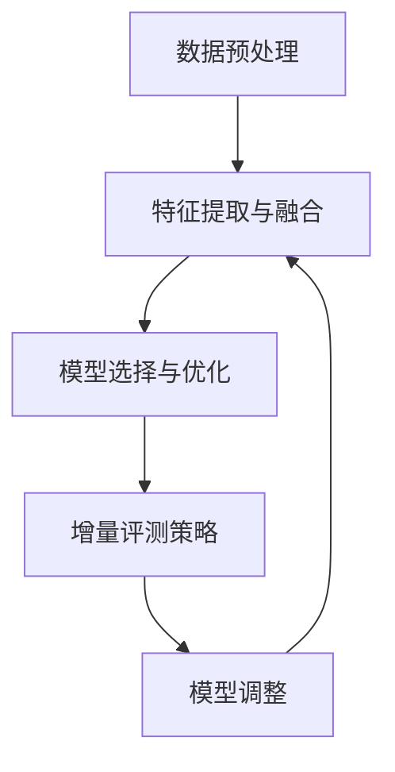
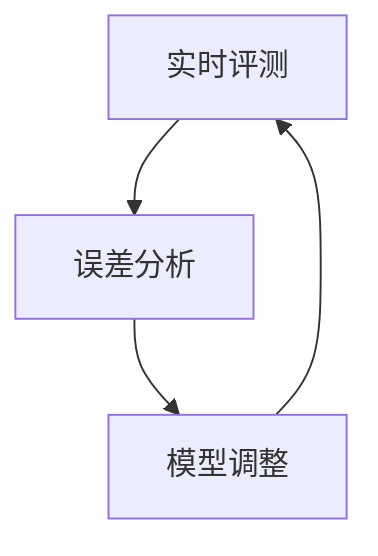

                 

### 引言

#### 1.1 书籍背景与目标

《prompt工程中的增量评测策略》这本书旨在探讨在人工智能和机器学习领域中的prompt工程以及增量评测策略的应用。随着深度学习技术的飞速发展，prompt工程已经成为自然语言处理、计算机视觉等众多领域的关键技术。同时，随着数据量的不断增大，增量评测策略在模型训练和优化过程中扮演着越来越重要的角色。

本书的目标是深入解析prompt工程和增量评测策略的核心概念、理论基础以及在实际应用中的具体实施方法。通过详细的讲解和分析，读者可以全面了解这两种技术在人工智能领域的应用，并掌握其设计和优化的技巧。

本书结构如下：

- **第一部分：理论基础与概念解析**：介绍prompt工程和增量评测策略的基本概念，包括相关的理论基础和核心算法原理。
- **第二部分：算法原理与实现**：通过伪代码和数学公式详细阐述prompt工程和增量评测策略的算法原理，并提供具体实例。
- **第三部分：项目实战与案例分析**：介绍实际项目中的应用，包括开发环境搭建、源代码实现、代码解读与分析，以及实际案例分析和详细讲解。
- **第四部分：最佳实践与拓展**：提供最佳实践建议、注意事项、小结和拓展阅读，帮助读者深入理解和应用所学知识。

#### 1.2 Prompt工程概述

**核心概念与联系**

Prompt工程是指利用外部提示信息（Prompt）来引导和优化机器学习模型训练的过程。这些提示信息可以是数据预处理、特征工程、模型选择、参数调整等多种形式。

**核心算法原理讲解**

Prompt工程中的核心算法主要包括：

1. **特征提取与融合**：通过数据预处理和特征工程，提取有用的特征信息，并将其融合到模型中，以提高模型的性能。
2. **模型选择与优化**：选择合适的模型结构，通过调整模型参数，优化模型性能。
3. **增量评测策略**：在模型训练过程中，采用增量评测策略对模型进行实时评估，以调整训练策略，优化模型性能。

**Mermaid流程图**

下面是prompt工程的Mermaid流程图：

#### 1.3 增量评测策略的重要性

增量评测策略在机器学习模型训练过程中起着至关重要的作用。其核心思想是实时评估模型的性能，并在必要时进行调整，以优化模型效果。

**核心概念与联系**

1. **评测指标**：包括准确率、召回率、F1值等常见评测指标。
2. **评测方法**：采用增量评测方法，对模型进行实时评估，以获取最新的性能指标。
3. **评测流程**：设计合理的评测流程，确保评测结果的准确性和可靠性。

**核心算法原理讲解**

增量评测策略的核心算法主要包括：

1. **实时评测**：通过在线评估，实时获取模型性能指标。
2. **误差分析**：对评测结果进行误差分析，找出模型的不足之处。
3. **模型调整**：根据误差分析结果，调整模型参数，优化模型性能。

**Mermaid流程图**

下面是增量评测策略的Mermaid流程图：

通过以上对书籍背景、目标以及核心概念的介绍，读者可以对《prompt工程中的增量评测策略》这本书有一个初步的了解。接下来的章节将详细探讨prompt工程和增量评测策略的各个方面，帮助读者深入理解并应用这些关键技术。

