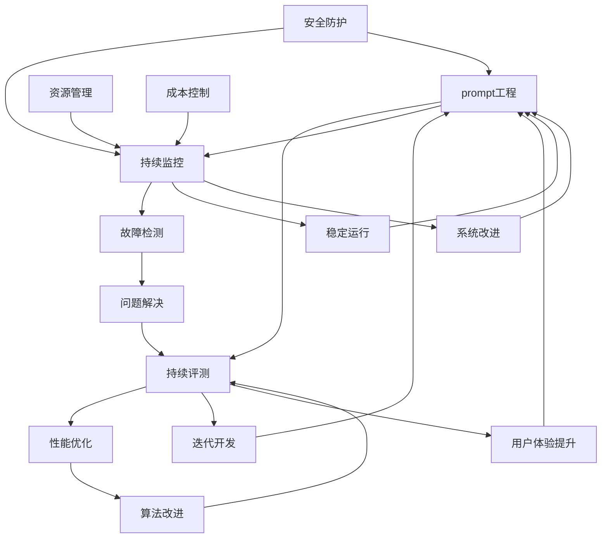
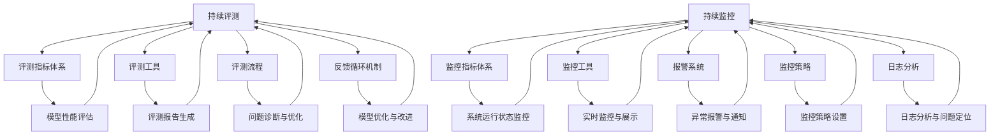

                 

### 文章标题

《prompt工程中的持续评测与监控》

### 关键词

- Prompt工程
- 持续评测
- 持续监控
- 人工智能
- 数据驱动
- 工程化

### 摘要

本文旨在深入探讨prompt工程中的持续评测与监控机制。prompt工程是人工智能领域中的一种重要技术，其核心在于通过自然语言处理技术，使计算机能够理解并响应人类语言。文章将首先介绍prompt工程的基础概念和背景，然后详细解析持续评测与监控在prompt工程中的重要性。接下来，文章将围绕技术架构、数据管理、模型优化等方面，逐步剖析持续评测与监控的具体实践方法。此外，本文还将通过实际案例分析，展示prompt工程在各个领域的应用，并对持续评测与监控的未来发展趋势进行展望。通过本文的阅读，读者将全面理解prompt工程中的持续评测与监控机制，并掌握其实践方法和应用技巧。

### 第1章：prompt工程概述

#### 1.1 prompt工程的定义与背景

prompt工程是指通过自然语言处理（NLP）技术和机器学习算法，构建能够理解并响应人类语言指令的智能系统。这一概念起源于20世纪50年代，随着人工智能（AI）和计算机科学的发展，prompt工程逐渐成为一个重要的研究方向。在早期的人工智能研究中，专家系统被视为实现人工智能的关键技术，但随着计算能力的提升和数据量的爆发增长，基于数据驱动的方法逐渐成为主流。prompt工程正是在这一背景下应运而生，成为现代人工智能系统中的一项核心技术。

prompt工程的核心思想是让计算机通过学习大量人类语言数据，掌握语言的语法、语义和上下文关系，从而实现对人类指令的理解和响应。这一技术的应用范围非常广泛，包括但不限于智能客服、智能推荐、自然语言生成、机器翻译等。随着深度学习技术的不断进步，prompt工程在自然语言处理领域的应用取得了显著的成果，成为推动人工智能发展的重要引擎。

#### 1.2 prompt工程的应用场景

prompt工程的应用场景主要包括以下几个方面：

1. **智能客服**：在电子商务、金融、医疗等领域，智能客服系统能够实时响应用户的咨询，提高客户满意度和服务效率。

2. **智能推荐**：通过分析用户的历史行为和偏好，智能推荐系统能够为用户推荐个性化的产品或服务，提升用户体验和转化率。

3. **自然语言生成**：prompt工程在文本生成领域有着广泛的应用，如自动生成新闻摘要、报告、文章等。

4. **机器翻译**：prompt工程使得计算机能够理解和生成不同语言的文本，大大促进了跨语言交流和理解。

5. **智能助理**：智能助理（如Siri、Alexa）通过prompt工程实现与用户的自然对话，提供日程管理、信息查询等服务。

#### 1.3 prompt工程的发展历程

prompt工程的发展历程可以分为以下几个阶段：

1. **早期探索**（1950-1970年代）：这一阶段的研究主要集中在基于规则的系统，即通过编写大量的规则来模拟人类的语言理解能力。

2. **符号主义时期**（1980-1990年代）：随着计算机性能的提升，基于符号主义的自然语言处理技术逐渐成为主流，如谓词逻辑、语义网络等。

3. **统计机器学习时期**（2000-2010年代）：随着机器学习技术的发展，统计机器学习方法开始应用于自然语言处理，如隐马尔可夫模型（HMM）、朴素贝叶斯分类器等。

4. **深度学习时期**（2010年代至今）：深度学习技术的崛起，使得基于神经网络的方法在自然语言处理领域取得了突破性进展，如循环神经网络（RNN）、长短期记忆网络（LSTM）和变换器（Transformer）等。

随着深度学习的不断发展，prompt工程在自然语言处理领域的应用越来越广泛，成为推动人工智能技术发展的重要力量。

### 第2章：prompt工程的核心概念

#### 2.1 持续评测的概念与重要性

持续评测（Continuous Evaluation）是指在整个prompt工程生命周期中，对系统性能和质量进行持续监控和评估。其核心目的是确保系统在运行过程中始终能够满足预定的性能指标，并对潜在的问题进行及时发现和解决。持续评测在prompt工程中具有至关重要的作用，主要体现在以下几个方面：

1. **保障系统稳定性**：通过持续评测，可以及时发现系统中的故障和异常，确保系统在长期运行中保持稳定。

2. **优化系统性能**：持续评测能够帮助开发者识别系统的性能瓶颈，通过优化算法、调整参数等方式，不断提升系统的性能。

3. **提升用户体验**：持续评测有助于确保系统在响应速度、准确性等方面达到用户期望，从而提升用户体验。

4. **支持迭代开发**：持续评测为prompt工程的迭代开发提供了有力支持，通过不断地评估和反馈，推动系统的持续改进。

#### 2.2 持续监控的概念与目标

持续监控（Continuous Monitoring）是指对系统运行过程中的关键指标进行实时监控和反馈，以发现潜在的问题和异常。持续监控的目标主要包括以下几个方面：

1. **故障检测**：通过实时监控系统性能指标，能够及时发现故障和异常，确保系统的稳定运行。

2. **性能优化**：持续监控可以帮助开发者了解系统的实际运行状况，识别性能瓶颈，为性能优化提供数据支持。

3. **安全防护**：持续监控有助于发现系统中的安全漏洞和潜在威胁，确保系统的安全性。

4. **成本控制**：通过监控系统的资源使用情况，可以帮助企业合理分配资源，降低运营成本。

#### 2.3 prompt与持续评测与监控的关系

prompt工程与持续评测与监控之间存在着密切的关系。prompt工程的核心目标是构建一个能够理解和响应人类语言的智能系统，而持续评测和监控则是保障这一目标实现的重要手段。

1. **持续评测与prompt工程的性能优化**：持续评测通过不断地评估系统性能，帮助开发者发现性能瓶颈，优化算法和参数设置，从而提升prompt工程的整体性能。

2. **持续监控与prompt工程的安全稳定**：持续监控通过对系统运行状态的实时监控，确保prompt工程在长期运行中保持稳定和安全。

3. **反馈循环与持续改进**：持续评测和监控为prompt工程提供了一个反馈循环机制，通过不断地评估、优化和反馈，推动系统的持续改进。

4. **资源管理与成本控制**：持续监控能够帮助开发者合理分配资源，降低运营成本，为prompt工程的持续发展提供保障。

综上所述，持续评测和监控是prompt工程不可或缺的组成部分，对系统的稳定运行、性能优化和持续改进具有重要意义。

#### 2.4 持续评测与监控的关系架构图

为了更清晰地展示持续评测与监控在prompt工程中的关系，我们可以使用Mermaid流程图来表示。

该流程图展示了持续评测与监控在prompt工程中的关系，包括性能优化、故障检测、资源管理、成本控制、算法改进、问题解决、迭代开发、稳定运行、安全防护和用户体验提升等方面。通过这一关系架构图，我们可以更直观地理解持续评测与监控在prompt工程中的重要作用。

### 第3章：prompt工程的技术架构

#### 3.1 prompt工程的总体架构

prompt工程的总体架构包括以下几个关键模块：

1. **数据输入模块**：负责接收和处理用户输入的文本数据，将其转换为机器可以理解和处理的格式。

2. **预处理模块**：对原始文本数据进行清洗、分词、词性标注等预处理操作，为后续模型训练和预测做好准备。

3. **模型训练模块**：利用大规模的文本数据，通过机器学习算法训练生成模型，使系统能够理解并响应人类语言。

4. **模型推理模块**：在接收用户输入后，利用训练好的模型进行推理，生成相应的输出结果。

5. **后处理模块**：对生成的输出结果进行格式化、优化等后处理操作，使其更加符合用户需求。

6. **反馈模块**：收集用户反馈数据，用于模型优化和系统改进。

#### 3.2 持续评测的技术架构

持续评测是prompt工程中至关重要的一环，其技术架构包括以下几个关键组件：

1. **评测指标体系**：定义一系列评测指标，如准确率、召回率、F1值等，用于衡量模型在不同任务上的性能。

2. **评测工具**：提供自动化评测工具，可以方便地计算和评估模型的各项指标，并生成详细的评测报告。

3. **评测流程**：定义持续评测的流程，包括数据准备、模型评测、问题诊断和优化改进等环节。

4. **反馈循环机制**：将评测结果和用户反馈数据传递给模型训练和优化模块，实现持续的模型优化和系统改进。

#### 3.3 持续监控的技术架构

持续监控是保障prompt工程稳定运行的重要手段，其技术架构包括以下几个关键组件：

1. **监控指标体系**：定义一系列监控指标，如响应时间、系统负载、错误率等，用于实时监控系统的运行状态。

2. **监控工具**：提供自动化监控工具，可以实时收集和展示系统的各项监控指标，及时发现异常情况。

3. **报警系统**：当系统出现异常时，自动触发报警，通知相关人员进行处理。

4. **监控策略**：定义监控策略，包括监控频率、报警阈值等，确保监控系统能够及时、准确地发现系统问题。

5. **日志分析**：对系统日志进行实时分析和处理，帮助定位问题根源，为问题解决提供数据支持。

#### 3.4 持续评测与监控的关系

持续评测与监控在prompt工程中相辅相成，共同保障系统的性能和稳定性。持续评测主要关注模型的性能和准确性，通过定期评估和优化模型，确保系统能够持续满足用户需求。而持续监控则关注系统的运行状态和稳定性，通过实时监控和报警，确保系统在长期运行中不会出现重大故障。

两者之间的关系可以用以下方式表示：

通过这个关系图，我们可以更清晰地理解持续评测与监控在prompt工程中的作用和相互关系。

### 第4章：prompt工程的数据管理

#### 4.1 数据收集与预处理

数据是prompt工程的核心资源，其质量和数量直接影响模型的效果。因此，数据收集与预处理是prompt工程中至关重要的一环。

**数据收集**：

1. **数据源选择**：选择具有代表性的数据源，如互联网文本、企业内部数据等。数据源的选择应满足以下要求：
   - 数据量足够大，以支持模型的训练和优化。
   - 数据质量高，排除噪声数据和异常值。
   - 数据多样性，涵盖不同的主题和领域。

2. **数据采集**：通过爬虫、API接口、人工标注等方式收集数据。采集过程中应注意：
   - 数据的实时性和时效性，确保数据的更新和及时性。
   - 数据的合法性和合规性，遵守相关法律法规和隐私政策。

**数据预处理**：

1. **数据清洗**：去除重复数据、缺失数据、异常数据等，确保数据的纯净和一致性。

2. **文本预处理**：
   - **分词**：将文本拆分成单词或短语，便于后续处理。
   - **词性标注**：对文本中的每个单词进行词性标注，如名词、动词、形容词等。
   - **停用词去除**：去除常见的停用词，如“的”、“和”、“是”等，以提高模型的效果。
   - **词干提取**：将单词缩减为词干，如“playing”缩减为“play”。
   - **词嵌入**：将单词转换为向量表示，如Word2Vec、GloVe等。

3. **数据标注**：对部分数据样本进行标注，用于训练和验证模型。标注过程应确保标注的准确性和一致性。

#### 4.2 数据存储与管理

数据存储与管理是确保数据安全、高效、可扩展的重要环节。以下是几个关键方面：

1. **数据存储方案**：
   - **关系型数据库**：适用于结构化数据存储，如MySQL、PostgreSQL等。
   - **非关系型数据库**：适用于非结构化数据存储，如MongoDB、Cassandra等。
   - **分布式文件系统**：适用于大规模数据存储和分布式计算，如HDFS、Ceph等。

2. **数据备份与恢复**：定期对数据进行备份，以防止数据丢失或损坏。同时，确保备份数据的可恢复性。

3. **数据访问控制**：通过权限管理，确保只有授权用户可以访问数据，防止数据泄露。

4. **数据安全**：采用加密算法对数据进行加密存储，确保数据的安全性。

5. **数据一致性**：在分布式系统中，保证数据的一致性和可靠性。

6. **数据压缩与存储优化**：通过数据压缩、存储优化等技术，减少存储空间占用，提高数据访问效率。

#### 4.3 数据分析与挖掘

数据分析和挖掘是prompt工程中获取知识、发现规律的重要手段。以下是几个关键方面：

1. **数据探索性分析**：通过统计分析、可视化等手段，对数据进行初步探索，发现数据中的异常值、趋势和关联关系。

2. **特征工程**：从原始数据中提取出有助于模型训练的特征，如文本特征、词频、词嵌入等。特征工程的质量直接影响模型的性能。

3. **机器学习算法**：利用各种机器学习算法，如分类、聚类、回归等，对数据进行分析和挖掘。常见的算法包括决策树、支持向量机、神经网络等。

4. **深度学习模型**：利用深度学习模型，如卷积神经网络（CNN）、循环神经网络（RNN）、变换器（Transformer）等，对大规模数据进行训练和预测。

5. **模型评估与优化**：通过交叉验证、ROC曲线、AUC值等指标评估模型的性能，并根据评估结果对模型进行优化。

6. **实时数据分析**：在系统运行过程中，实时分析用户行为数据，为系统优化和改进提供数据支持。

通过数据收集与预处理、数据存储与管理、数据分析与挖掘等环节，prompt工程能够有效管理和利用数据，为系统的稳定运行和性能优化提供有力支持。

### 第5章：prompt工程的模型优化

#### 5.1 模型优化的方法与技术

模型优化是prompt工程中提高系统性能和准确性的关键步骤。以下是几种常见的模型优化方法和技术：

**1. 算法调参**

算法调参（Hyperparameter Tuning）是指通过调整模型参数，优化模型的性能。常见的调参方法包括：

- **网格搜索（Grid Search）**：在给定的参数空间内，遍历所有可能的参数组合，找出最优参数组合。
- **随机搜索（Random Search）**：在给定的参数空间内，随机选择参数组合进行评估，通过迭代逐渐优化参数。
- **贝叶斯优化（Bayesian Optimization）**：基于概率模型，通过历史评估结果预测新的参数组合，实现高效调参。

**2. 模型集成**

模型集成（Model Ensemble）是指通过多个模型组合，提高预测的准确性和稳定性。常见的模型集成方法包括：

- **堆叠（Stacking）**：将多个模型作为基础模型，训练一个更高层次的模型，综合多个基础模型的预测结果。
- **提升（Boosting）**：通过迭代训练多个模型，每个模型专注于纠正前一个模型的错误，提高整体模型的性能。
- **随机森林（Random Forest）**：通过构建多个决策树，并随机抽样特征和样本，集成多个决策树的预测结果。

**3. 模型剪枝**

模型剪枝（Model Pruning）是指通过删除模型中不必要的权重或节点，减小模型的大小和计算复杂度。常见的模型剪枝方法包括：

- **结构化剪枝（Structured Pruning）**：通过分析模型的权重矩阵，删除对预测结果影响较小的权重。
- **量化剪枝（Quantization Pruning）**：通过量化模型参数，降低模型精度，减小模型大小。
- **渐变剪枝（Gradual Pruning）**：通过逐渐减少模型参数的权重，找到最佳剪枝程度。

**4. 模型正则化**

模型正则化（Model Regularization）是指通过添加正则项，防止模型过拟合，提高泛化能力。常见的模型正则化方法包括：

- **L1正则化（L1 Regularization）**：在损失函数中添加L1范数，惩罚模型参数的绝对值，促进稀疏解。
- **L2正则化（L2 Regularization）**：在损失函数中添加L2范数，惩罚模型参数的平方和，避免过拟合。
- **Dropout正则化（Dropout Regularization）**：在训练过程中随机丢弃部分神经元，降低模型依赖性，提高泛化能力。

**5. 模型压缩**

模型压缩（Model Compression）是指通过减少模型参数数量和计算复杂度，降低模型大小，提高推理速度。常见的模型压缩方法包括：

- **知识蒸馏（Knowledge Distillation）**：将大模型的知识传递给小模型，提高小模型的性能。
- **量化（Quantization）**：将浮点权重转换为低比特位精度，减小模型大小。
- **剪枝（Pruning）**：通过剪枝方法，减少模型参数数量，降低计算复杂度。

通过上述方法和技术，可以有效地优化prompt工程的模型，提高系统的性能和准确性，为实际应用提供更可靠的保障。

#### 5.2 模型调参的实践与技巧

在实际应用中，模型调参是一个复杂且关键的过程，直接影响模型的性能和效率。以下是一些模型调参的实践技巧：

**1. 参数调优的重要性**

参数调优是提升模型性能的关键步骤。不同的参数设置会对模型的预测能力、训练速度和过拟合程度产生显著影响。因此，合理的参数选择至关重要。

**2. 参数调优的常见方法**

- **网格搜索（Grid Search）**：通过遍历所有可能的参数组合，找到最优参数。但这种方法计算量较大，适用于参数空间较小的情况。

- **随机搜索（Random Search）**：在参数空间内随机选择参数组合进行评估，通过迭代逐渐优化参数。这种方法计算量较小，但效果通常优于网格搜索。

- **贝叶斯优化（Bayesian Optimization）**：利用概率模型，通过历史评估结果预测新的参数组合，实现高效调参。这种方法在处理高维参数空间时尤为有效。

**3. 调参实践技巧**

- **初步调优**：在模型训练之前，先进行初步的参数调优，找到大致的最优参数范围。这一步可以通过随机搜索或网格搜索实现。

- **交叉验证**：使用交叉验证方法，在训练数据集上多次评估模型性能，避免过拟合。通过交叉验证，可以更准确地评估模型在不同参数设置下的表现。

- **多因素优化**：考虑多个参数的影响，通过组合调优，找到最佳参数组合。例如，可以同时调整学习率、批量大小、正则化参数等。

- **性能指标**：根据实际应用需求，选择合适的性能指标，如准确率、召回率、F1值等。在调参过程中，应优先关注对性能影响较大的指标。

- **模型评估**：在调参过程中，定期评估模型性能，及时发现和解决问题。通过逐步调整参数，优化模型性能。

**4. 调参工具推荐**

- **Hyperopt**：一个基于随机搜索和树结构帕累托优化的开源调参库，支持多种优化算法和并行计算。

- **Optuna**：一个高性能的开源调参库，支持贝叶斯优化、随机搜索和网格搜索等调参方法。

- **Keras Tuner**：一个基于Keras的开源调参库，支持多种调参算法和并行计算。

通过以上实践技巧和工具，可以有效地进行模型调参，提升模型的性能和效率，为实际应用提供更可靠的保障。

#### 5.3 模型评估与选择

模型评估与选择是prompt工程中至关重要的一环，直接关系到系统的性能和准确性。以下是几种常见的模型评估指标和方法：

**1. 评估指标**

- **准确率（Accuracy）**：预测结果与实际标签相符的比例。准确率能够直观地反映模型的分类效果，但容易受到不平衡数据的影响。

- **召回率（Recall）**：实际为正类但被模型预测为负类的比例。召回率能够反映模型对正类的识别能力，但可能牺牲一部分负类的准确性。

- **精确率（Precision）**：预测结果为正类且实际也为正类的比例。精确率能够反映模型对正类预测的准确性，但可能漏掉一部分负类。

- **F1值（F1 Score）**：精确率和召回率的调和平均值。F1值综合考虑了精确率和召回率，是评估二分类问题常用的指标。

- **ROC曲线与AUC值（Receiver Operating Characteristic Curve and Area Under Curve）**：ROC曲线展示了不同阈值下模型的预测性能，AUC值反映了模型的整体分类能力。

- **均方误差（Mean Squared Error, MSE）**：预测值与实际值之间误差的平方的平均值。MSE常用于回归问题的评估。

- **均绝对误差（Mean Absolute Error, MAE）**：预测值与实际值之间误差的绝对值的平均值。MAE对异常值的影响较小。

**2. 评估方法**

- **交叉验证（Cross-Validation）**：将训练数据划分为多个子集，每个子集轮流作为验证集，评估模型在不同子集上的性能。交叉验证能够有效地避免过拟合，提高评估结果的可靠性。

- **K折交叉验证（K-Fold Cross-Validation）**：将训练数据划分为K个子集，每次使用K-1个子集进行训练，剩余的一个子集作为验证集，重复K次，取平均性能作为最终评估结果。

- **留一法交叉验证（Leave-One-Out Cross-Validation, LOOCV）**：将每个样本视为一次验证集，其余样本用于训练，适用于样本量较少的情况。

- **时间序列交叉验证（Time Series Cross-Validation）**：适用于时间序列数据，确保每个子集中的验证集时间点位于训练集的时间点之后。

**3. 模型选择**

- **模型选择原则**：选择具有较高性能和较强泛化能力的模型。在实际应用中，通常结合评估指标和实际需求进行模型选择。

- **基准模型**：选择一些性能稳定的基准模型，如逻辑回归、朴素贝叶斯、支持向量机等，作为对比模型。

- **性能对比**：通过交叉验证等方法，比较不同模型的性能，选择最优模型。

- **集成模型**：通过集成多个模型，提高预测的准确性和稳定性。常见的集成方法包括堆叠、提升和随机森林等。

- **模型调优**：在模型选择过程中，对模型进行调参和优化，以提升性能。

通过上述评估指标和方法，可以全面评估和选择合适的模型，为prompt工程的应用提供可靠的基础。

### 第6章：持续评测实践

#### 6.1 持续评测流程与工具

持续评测是prompt工程中确保系统性能和可靠性的关键环节。以下是持续评测的流程与常用工具：

**1. 持续评测流程**

- **数据准备**：收集并整理用于评测的数据集，确保数据的质量和多样性。
- **模型评估**：使用预训练模型对数据集进行评估，计算各项性能指标。
- **结果分析**：分析评估结果，识别模型的优势和不足，为优化提供依据。
- **问题诊断**：根据评估结果，定位可能的问题和故障，进行详细诊断。
- **优化改进**：根据问题诊断结果，调整模型参数和算法，优化系统性能。
- **反馈循环**：将优化结果和用户反馈数据反馈至模型训练和优化模块，实现持续改进。

**2. 常用工具**

- **pytest**：一个流行的Python测试框架，支持单元测试、集成测试和功能测试。
- **TensorFlow Model Optimization Toolkit (TF-MOT)**：TensorFlow提供的模型优化工具，支持模型压缩、剪枝和量化等操作。
- **Scikit-learn**：一个Python机器学习库，提供多种评估指标和模型选择工具。
- **mlflow**：一个开源的机器学习平台，支持模型追踪、版本控制和部署。
- **Azure Machine Learning**：微软提供的云平台，支持模型训练、评估和部署。
- **Docker**：一个容器化技术，用于构建、运行和分发应用程序，确保模型在不同环境中的一致性。
- **Kubernetes**：一个开源容器编排平台，用于自动化部署、扩展和管理容器化应用程序。

通过以上流程和工具，可以有效地进行持续评测，确保prompt工程系统的稳定性和性能。

#### 6.2 持续评测指标体系

在持续评测过程中，建立一套完整的指标体系至关重要。这些指标不仅能够衡量系统的性能，还能帮助识别潜在的问题和优化方向。以下是几个关键指标：

**1. 准确率（Accuracy）**

准确率是评估分类模型最常用的指标，表示预测正确的样本数占总样本数的比例。计算公式如下：

\[ \text{准确率} = \frac{\text{预测正确的样本数}}{\text{总样本数}} \]

**2. 召回率（Recall）**

召回率表示实际为正类但被模型预测为正类的比例，反映了模型对正类样本的识别能力。计算公式如下：

\[ \text{召回率} = \frac{\text{预测正确的正类样本数}}{\text{实际的正类样本数}} \]

**3. 精确率（Precision）**

精确率表示预测结果为正类且实际也为正类的比例，反映了模型对正类样本预测的准确性。计算公式如下：

\[ \text{精确率} = \frac{\text{预测正确的正类样本数}}{\text{预测为正类的样本数}} \]

**4. F1值（F1 Score）**

F1值是精确率和召回率的调和平均值，综合反映了模型在分类任务中的性能。计算公式如下：

\[ \text{F1值} = 2 \times \frac{\text{精确率} \times \text{召回率}}{\text{精确率} + \text{召回率}} \]

**5. 均方误差（Mean Squared Error, MSE）**

均方误差是评估回归模型性能的常用指标，表示预测值与实际值之间误差的平方的平均值。计算公式如下：

\[ \text{MSE} = \frac{1}{n} \sum_{i=1}^{n} (\text{预测值}_i - \text{实际值}_i)^2 \]

**6. 均绝对误差（Mean Absolute Error, MAE）**

均绝对误差是评估回归模型性能的另一种指标，表示预测值与实际值之间误差的绝对值的平均值。计算公式如下：

\[ \text{MAE} = \frac{1}{n} \sum_{i=1}^{n} |\text{预测值}_i - \text{实际值}_i| \]

**7. ROC曲线与AUC值**

ROC曲线展示了不同阈值下模型的预测性能，AUC值反映了模型的整体分类能力。ROC曲线的面积（AUC值）越大，模型的分类能力越强。

通过这些指标，可以全面评估prompt工程的性能，并为优化提供依据。

#### 6.3 持续评测案例分析

以下是一个具体的持续评测案例分析，展示如何在实际项目中进行持续评测。

**项目背景**

某电商平台希望构建一个智能客服系统，通过自然语言处理技术，实时响应用户的咨询，提高客户满意度和运营效率。为了确保系统的稳定性和性能，项目团队决定实施持续评测机制。

**评测流程**

1. **数据准备**：

   项目团队收集了大量的用户咨询数据，包括文本和标签。数据分为训练集、验证集和测试集，用于模型训练和评估。

2. **模型训练**：

   使用预训练的模型（如BERT）进行训练，并通过调参优化模型性能。训练过程中，团队使用了交叉验证方法，确保模型的泛化能力。

3. **模型评估**：

   针对训练集和验证集，计算各项评估指标（如准确率、召回率、F1值等），分析模型的性能。团队还使用了ROC曲线和AUC值，评估模型的分类能力。

4. **问题诊断**：

   分析评估结果，发现模型的召回率较低，对一些用户咨询的响应不够准确。团队定位到问题可能出在数据标注和质量上。

5. **优化改进**：

   - **数据增强**：团队增加了一些人工标注的数据，提升数据的多样性。
   - **模型调参**：调整学习率、批量大小等参数，优化模型性能。
   - **集成模型**：引入了集成模型（如随机森林、提升树等），提高预测准确性。

6. **再次评估**：

   在优化改进后，重新进行模型评估，计算各项指标。发现模型的召回率显著提高，整体性能有所提升。

**评测工具**

项目团队使用了以下工具：

- **pytest**：用于单元测试和集成测试。
- **mlflow**：用于模型追踪和版本控制。
- **Scikit-learn**：用于计算评估指标。
- **TensorFlow Model Optimization Toolkit (TF-MOT)**：用于模型优化。

通过这个案例，我们可以看到持续评测在智能客服系统开发中的重要性。通过定期评估和优化，项目团队确保了系统的稳定性和性能，为电商平台提供了可靠的智能客服支持。

### 第7章：持续监控实践

#### 7.1 持续监控策略与方法

持续监控是保障prompt工程系统稳定性和性能的关键措施。以下是几种常见的持续监控策略与方法：

**1. 监控指标选择**

监控指标的选择应根据具体应用场景和业务需求进行。以下是一些常用的监控指标：

- **响应时间**：系统对用户请求的响应时间，反映系统的性能和效率。
- **吞吐量**：系统单位时间内处理的请求数量，用于衡量系统的负载能力。
- **错误率**：系统处理请求时出现错误的频率，反映系统的稳定性和可靠性。
- **资源使用率**：系统使用的CPU、内存、磁盘等资源的使用情况，反映系统的资源利用率。
- **延迟**：系统处理请求的平均延迟时间，反映系统的响应速度。
- **并发量**：系统同时处理的请求数量，反映系统的并发处理能力。
- **成功比例**：系统处理成功的请求数量占总请求数量的比例，反映系统的准确性和可靠性。

**2. 监控工具选择**

选择合适的监控工具对于实现有效的持续监控至关重要。以下是一些常用的监控工具：

- **Prometheus**：一个开源的监控解决方案，支持时间序列数据收集和报警。
- **Grafana**：一个开源的监控和数据可视化平台，可与Prometheus等工具集成。
- **Zabbix**：一个开源的监控工具，支持多种监控方式，包括SNMP、ICMP、TCP等。
- **Datadog**：一个商业的监控平台，提供全面的监控、日志分析和性能优化功能。
- **New Relic**：一个商业的监控平台，专注于应用性能监控和性能优化。
- **AppDynamics**：一个商业的监控工具，提供全面的性能监控和故障诊断功能。

**3. 监控策略**

- **定期监控**：定期收集系统的监控数据，分析系统的运行状态，及时发现潜在问题。
- **实时监控**：实时监控系统的关键指标，当指标超过预设阈值时，自动触发报警。
- **自动故障恢复**：当系统发生故障时，自动执行故障恢复操作，确保系统尽快恢复正常运行。
- **日志分析**：对系统日志进行实时分析和处理，识别异常行为和故障根源。
- **集群监控**：对分布式系统中的各个节点进行监控，确保集群的整体稳定性和性能。
- **自定义监控**：根据具体业务需求，自定义监控指标和报警规则，实现精细化监控。

通过以上策略和方法，可以有效地进行持续监控，保障prompt工程的系统稳定性和性能。

#### 7.2 持续监控工具与平台

为了实现持续监控，选择合适的工具和平台至关重要。以下介绍几种常用的持续监控工具和平台：

**1. Prometheus**

Prometheus是一种开源的监控解决方案，具有以下特点：

- **数据采集**：Prometheus通过拉取方式采集系统的监控数据，支持多种数据源，如HTTP、JMX、SNMP等。
- **数据存储**：Prometheus使用Timeseries数据库存储监控数据，提供高效的数据查询和处理能力。
- **报警管理**：Prometheus支持基于PromQL（Prometheus Query Language）的报警管理，可以灵活定义报警规则。
- **可视化**：Prometheus与Grafana等可视化工具集成，提供强大的监控仪表板和可视化功能。

**2. Grafana**

Grafana是一种开源的数据可视化平台，可以与Prometheus等工具集成，提供以下功能：

- **数据可视化**：Grafana支持多种数据源，如InfluxDB、MySQL、PostgreSQL等，提供丰富的可视化图表和仪表板。
- **告警管理**：Grafana支持基于Prometheus等工具的告警管理，可以设置多种告警规则和通知渠道。
- **插件支持**：Grafana提供丰富的插件生态，可以扩展平台的功能和定制需求。

**3. Zabbix**

Zabbix是一种开源的监控工具，具有以下特点：

- **监控范围广**：Zabbix支持多种监控方式，包括SNMP、ICMP、TCP等，适用于各种操作系统和应用。
- **自动发现**：Zabbix支持自动发现网络设备和应用，简化监控配置。
- **报警管理**：Zabbix提供灵活的报警管理功能，支持多种通知方式和告警规则。
- **分布式监控**：Zabbix支持分布式监控架构，可以监控大规模系统。

**4. Datadog**

Datadog是一种商业的监控平台，提供以下功能：

- **全面监控**：Datadog支持多种监控指标，包括性能、日志、错误追踪等，提供全面的监控视图。
- **自动化报警**：Datadog支持自动报警和通知，可以根据监控指标触发告警。
- **性能优化**：Datadog提供性能分析工具，帮助用户识别和优化系统性能瓶颈。
- **集成与扩展**：Datadog与各种开发和运维工具集成，支持自定义插件和API接口。

**5. New Relic**

New Relic是一种商业的监控工具，专注于应用性能监控，具有以下特点：

- **实时监控**：New Relic提供实时的性能监控和错误追踪，帮助用户快速识别和解决问题。
- **自动化告警**：New Relic支持自动告警和通知，可以根据监控指标触发告警。
- **用户体验**：New Relic提供直观的监控仪表板和报告，帮助用户更好地理解系统的性能状况。
- **集成与扩展**：New Relic与各种开发、测试和部署工具集成，支持自定义插件和API接口。

通过选择合适的监控工具和平台，可以有效地实现持续监控，保障prompt工程的系统稳定性和性能。

#### 7.3 持续监控案例解析

以下是一个持续监控案例，展示如何在实际项目中实现持续监控：

**项目背景**

某互联网公司开发了一款智能推荐系统，通过分析用户行为和偏好，为用户推荐个性化的商品和服务。为了确保系统的稳定性和性能，项目团队决定实施持续监控机制。

**监控目标**

- **系统稳定性**：确保系统在长期运行中不出现重大故障，如服务器宕机、数据库连接失败等。
- **性能优化**：监控系统的响应速度、吞吐量和延迟等性能指标，识别性能瓶颈，进行优化。
- **资源利用率**：监控系统的CPU、内存、磁盘等资源使用情况，确保系统资源得到合理分配。

**监控策略**

1. **监控指标选择**：

   - **响应时间**：系统对用户请求的响应时间，反映系统的性能和效率。
   - **吞吐量**：系统单位时间内处理的请求数量，用于衡量系统的负载能力。
   - **错误率**：系统处理请求时出现错误的频率，反映系统的稳定性和可靠性。
   - **CPU使用率**：系统使用的CPU资源使用情况，反映系统的计算负载。
   - **内存使用率**：系统使用的内存资源使用情况，反映系统的内存占用情况。
   - **磁盘I/O**：系统磁盘的读写速度和I/O负载，反映系统的磁盘性能。

2. **监控工具选择**：

   - **Prometheus**：用于收集和存储监控数据，支持多种数据源和告警管理。
   - **Grafana**：用于可视化监控数据，提供直观的监控仪表板。
   - **Zabbix**：用于监控系统的关键性能指标，支持自动发现和报警管理。

3. **监控设置**：

   - **定期监控**：每天定时收集系统监控数据，分析系统的运行状态，生成监控报告。
   - **实时监控**：当监控指标超过预设阈值时，自动触发告警，并通过短信、邮件等方式通知相关人员。
   - **自动故障恢复**：当系统发生故障时，自动执行故障恢复操作，确保系统尽快恢复正常运行。

**监控效果**

通过实施持续监控，项目团队实现了以下效果：

- **系统稳定性**：持续监控帮助团队及时发现并解决了多个系统故障，确保系统在长期运行中保持稳定。
- **性能优化**：通过监控数据，团队识别了系统的性能瓶颈，进行了优化，提升了系统的响应速度和吞吐量。
- **资源利用率**：监控数据帮助团队合理分配系统资源，提高了系统的资源利用率，降低了运营成本。

通过这个案例，我们可以看到持续监控在智能推荐系统中的应用价值。通过定期监控、实时监控和自动故障恢复，项目团队确保了系统的稳定性和性能，为用户提供高质量的服务。

### 第8章：prompt工程案例分析

#### 8.1 某电商平台的prompt工程实践

某电商平台为了提升用户购物体验，决定采用prompt工程技术构建智能推荐系统。以下是该电商平台prompt工程的具体实践过程。

**1. 需求分析**

电商平台希望通过智能推荐系统为用户提供个性化的商品推荐，提高购物转化率和用户满意度。主要需求包括：

- **基于用户行为**：分析用户的浏览记录、购买记录等行为数据，为用户推荐相关的商品。
- **基于商品特征**：根据商品的种类、品牌、价格等特征，为用户推荐类似或互补的商品。
- **基于上下文**：结合用户的地理位置、时间等信息，为用户提供实时和精准的推荐。

**2. 数据收集与预处理**

电商平台从多个渠道收集用户行为数据和商品数据，包括：

- **用户行为数据**：用户浏览、点击、购买等行为记录。
- **商品数据**：商品的种类、品牌、价格、销量等特征信息。

在数据收集过程中，确保数据的实时性和准确性。数据收集后，进行以下预处理操作：

- **数据清洗**：去除重复数据和缺失值，确保数据的一致性和完整性。
- **文本预处理**：对用户评论、商品描述等文本数据，进行分词、词性标注、停用词去除等处理。
- **特征提取**：从原始数据中提取有代表性的特征，如用户兴趣标签、商品标签等。

**3. 模型训练与优化**

电商平台采用基于深度学习的推荐模型，如变换器（Transformer）和卷积神经网络（CNN）。训练过程中，使用大规模的数据集，通过以下步骤进行模型训练和优化：

- **数据增强**：通过数据扩充、数据预处理等技术，增加训练数据的多样性，提高模型泛化能力。
- **调参优化**：使用网格搜索、贝叶斯优化等调参方法，优化模型参数，提高模型性能。
- **交叉验证**：使用交叉验证方法，评估模型在不同数据集上的性能，避免过拟合。

**4. 持续评测与监控**

为了确保智能推荐系统的稳定性和性能，电商平台实施持续评测与监控机制：

- **评测指标**：设定准确率、召回率、F1值等评测指标，定期评估模型性能。
- **评测工具**：使用Scikit-learn、pytest等工具，计算评测指标，生成评估报告。
- **监控策略**：实施实时监控，当监控指标超过阈值时，自动触发报警，及时发现问题并进行优化。

**5. 应用效果**

通过智能推荐系统的实践，电商平台取得了显著的效果：

- **用户满意度**：用户购物体验显著提升，用户满意度提高。
- **购物转化率**：推荐系统的个性化推荐功能，提高了购物转化率。
- **运营成本**：通过数据驱动和智能推荐，降低了运营成本。

#### 8.2 某金融行业的prompt工程应用

某金融公司为了提升客户服务质量和效率，决定引入prompt工程技术，构建智能客服系统。以下是该金融公司prompt工程的具体应用过程。

**1. 需求分析**

金融公司希望通过智能客服系统，为用户提供高效、精准的咨询服务，主要需求包括：

- **自动回复**：处理常见的用户问题，提供标准化的回答。
- **智能对话**：通过自然语言处理技术，实现与用户的智能对话，提升用户体验。
- **多渠道支持**：支持多种沟通渠道，如电话、邮件、在线聊天等。

**2. 数据收集与预处理**

金融公司从多个渠道收集用户咨询数据和业务知识库，包括：

- **用户咨询数据**：用户提出的问题和咨询内容。
- **业务知识库**：金融产品的介绍、政策法规、常见问题等。

数据收集后，进行以下预处理操作：

- **数据清洗**：去除重复数据和缺失值，确保数据的一致性和完整性。
- **文本预处理**：对用户咨询数据和业务知识库进行分词、词性标注、停用词去除等处理。
- **特征提取**：从原始数据中提取有代表性的特征，如关键词、句子结构等。

**3. 模型训练与优化**

金融公司采用基于深度学习的自然语言处理模型，如循环神经网络（RNN）和变换器（Transformer）。训练过程中，通过以下步骤进行模型训练和优化：

- **数据增强**：通过数据扩充、数据预处理等技术，增加训练数据的多样性，提高模型泛化能力。
- **调参优化**：使用网格搜索、贝叶斯优化等调参方法，优化模型参数，提高模型性能。
- **交叉验证**：使用交叉验证方法，评估模型在不同数据集上的性能，避免过拟合。

**4. 持续评测与监控**

为了确保智能客服系统的稳定性和性能，金融公司实施持续评测与监控机制：

- **评测指标**：设定准确率、召回率、F1值等评测指标，定期评估模型性能。
- **评测工具**：使用Scikit-learn、pytest等工具，计算评测指标，生成评估报告。
- **监控策略**：实施实时监控，当监控指标超过阈值时，自动触发报警，及时发现问题并进行优化。

**5. 应用效果**

通过智能客服系统的实践，金融公司取得了显著的效果：

- **客户满意度**：客户服务效率显著提高，客户满意度提高。
- **服务效率**：智能客服系统能够快速响应客户问题，减少人工成本。
- **业务合规性**：智能客服系统能够确保回答内容的合规性，降低风险。

通过以上两个案例，我们可以看到prompt工程在电商和金融领域的应用效果。智能推荐系统和智能客服系统通过数据驱动和自然语言处理技术，提升了用户体验和服务效率，为业务发展提供了有力支持。

#### 8.3 prompt工程在不同领域的实践与展望

prompt工程在多个领域取得了显著的应用成果，展示了其强大的潜力和广泛的前景。以下是对prompt工程在不同领域实践与展望的概述：

**1. 电商与零售**

电商与零售行业是prompt工程的重要应用领域。通过智能推荐系统，电商平台能够为用户提供个性化的商品推荐，提高购物转化率和用户满意度。此外，prompt工程还应用于购物助手、评价系统等，为用户提供更加便捷和高效的购物体验。未来，随着数据规模的扩大和算法的优化，prompt工程在电商与零售领域的应用将更加广泛和深入。

**2. 金融与服务**

金融与服务行业是prompt工程的另一重要应用领域。智能客服系统通过自然语言处理技术，能够为用户提供高效、精准的咨询服务，提升客户满意度和服务效率。此外，prompt工程在金融风险管理、信用评估、市场预测等方面也具有广泛的应用前景。随着金融科技的发展，prompt工程将在金融与服务行业中发挥越来越重要的作用。

**3. 医疗与健康**

医疗与健康领域是prompt工程的重要应用领域。通过自然语言处理技术，智能医疗系统可以辅助医生进行疾病诊断、治疗方案推荐等。此外，prompt工程在医学文献挖掘、医疗数据管理、健康咨询等方面也具有广泛的应用前景。未来，随着人工智能技术的不断发展，prompt工程将在医疗与健康领域发挥更加关键的作用。

**4. 教育**

教育领域是prompt工程的重要应用领域。通过智能教学系统，教师可以为学生提供个性化的学习资源和学习指导，提高学习效果。此外，prompt工程在智能辅导、教育评测、教育管理等方面也具有广泛的应用前景。未来，随着教育信息化的发展，prompt工程将在教育领域发挥更加重要的作用。

**5. 未来展望**

随着人工智能技术的不断进步，prompt工程在未来有望在更多领域得到应用。以下是对prompt工程未来发展的展望：

- **技术突破**：随着深度学习、自然语言处理等技术的不断进步，prompt工程将实现更高的性能和更广泛的应用。
- **跨领域应用**：prompt工程将在更多领域得到应用，如智能制造、智慧城市、智能交通等，为各行业提供智能化的解决方案。
- **数据驱动**：随着数据规模的不断扩大和多样化，prompt工程将更加依赖于数据驱动，实现更加精准和高效的决策。
- **伦理与合规**：随着prompt工程的应用越来越广泛，其伦理和合规问题也将受到越来越多的关注，确保技术应用的安全性和可靠性。

总之，prompt工程在各个领域的实践和未来展望展示了其强大的潜力和广泛的应用前景。通过不断地技术创新和应用探索，prompt工程将为各行业带来更多的机遇和变革。

### 附录A：prompt工程相关工具与资源

在prompt工程的实际应用过程中，选择合适的工具和资源至关重要。以下介绍几类常用的prompt工程工具与资源，包括持续评测与监控工具、机器学习框架和相关文献。

#### 附录A.1 持续评测与监控工具介绍

**1. Prometheus**

Prometheus是一款开源的时间序列数据监控工具，主要用于收集、存储和展示系统的监控数据。其特点包括：

- **数据采集**：支持多种数据源，如HTTP、JMX、SNMP等。
- **数据存储**：使用高可靠性的Timeseries数据库存储监控数据。
- **报警管理**：支持PromQL（Prometheus Query Language）进行复杂的查询和报警规则设置。
- **可视化**：与Grafana等可视化工具集成，提供强大的监控仪表板。

**2. Grafana**

Grafana是一款开源的数据可视化平台，可以与Prometheus等工具集成，提供数据监控、报警管理和仪表板设计功能。其特点包括：

- **数据可视化**：支持多种数据源，如InfluxDB、MySQL、PostgreSQL等。
- **仪表板设计**：提供直观的仪表板设计工具，方便用户自定义监控视图。
- **告警管理**：支持基于Prometheus等工具的告警管理，实现自动化报警和通知。

**3. Zabbix**

Zabbix是一款开源的监控工具，适用于各种操作系统和应用。其特点包括：

- **监控范围广**：支持多种监控方式，如SNMP、ICMP、TCP等。
- **自动发现**：支持自动发现网络设备和应用，简化监控配置。
- **报警管理**：支持灵活的报警规则和多种通知方式。

**4. Datadog**

Datadog是一款商业的监控平台，提供全面的监控、日志分析和性能优化功能。其特点包括：

- **全面监控**：支持多种监控指标，包括性能、日志、错误追踪等。
- **自动化报警**：可以根据监控指标触发告警，支持多种通知渠道。
- **性能优化**：提供性能分析工具，帮助用户识别和优化系统性能瓶颈。

**5. New Relic**

New Relic是一款商业的监控工具，专注于应用性能监控和性能优化。其特点包括：

- **实时监控**：提供实时的性能监控和错误追踪，快速识别和解决问题。
- **自动化告警**：可以根据监控指标触发告警，支持多种通知方式。
- **用户体验**：提供直观的监控仪表板和报告，帮助用户更好地理解系统的性能状况。

#### 附录A.2 持续评测与监控资源推荐

**1. 持续评测与监控技术文献**

- **《持续集成与持续部署：从代码到云》**：由Jez Humble和David Farley所著，详细介绍了持续集成、持续部署和持续监控的相关技术。
- **《监控技术实践》**：由李俊峰所著，系统讲解了监控系统的设计、实现和应用，包括指标选择、数据采集、数据处理和报警管理等方面。
- **《Prometheus官方文档》**：Prometheus的官方文档，提供了详细的安装教程、配置指南和使用方法。

**2. 机器学习框架和工具**

- **TensorFlow**：由Google开发的开源机器学习框架，支持多种深度学习模型的训练和推理。
- **PyTorch**：由Facebook开发的开源机器学习框架，支持动态计算图和自动微分，易于实现和调试。
- **Scikit-learn**：一个Python机器学习库，提供多种经典机器学习算法的实现，适合初学者使用。
- **MLflow**：一个开源的机器学习平台，支持模型追踪、版本控制和部署。

**3. 自然语言处理工具**

- **NLTK**：一个Python自然语言处理库，提供多种文本处理工具和算法，适用于文本分词、词性标注、情感分析等任务。
- **spaCy**：一个高效的Python自然语言处理库，支持多种语言的文本处理，适用于实体识别、关系抽取等任务。
- **BERT**：由Google开发的预训练语言模型，适用于文本分类、命名实体识别、机器翻译等任务。

通过以上工具和资源，可以有效地进行prompt工程的应用开发、持续评测与监控，为智能系统的稳定性和性能优化提供有力支持。

### 附录B：持续评测与监控案例分析

#### 附录B.1 某企业的持续评测与监控实践

某大型企业为了确保其人工智能系统（包括智能推荐、智能客服等）的稳定性和性能，决定实施持续评测与监控机制。以下是该企业具体的实践过程。

**1. 项目背景**

企业希望通过持续评测与监控，提高人工智能系统的性能、可靠性和用户体验。主要目标包括：

- **性能优化**：通过持续评测，发现系统性能瓶颈，进行优化和改进。
- **稳定性保障**：通过持续监控，确保系统在长期运行中保持稳定，减少故障发生。
- **用户体验提升**：通过持续评测和监控，确保系统始终满足用户需求，提升用户体验。

**2. 持续评测与监控流程**

（以下流程以持续监控为例）

- **数据收集**：从系统日志、应用性能监控工具（如Prometheus）等渠道，收集系统的实时性能数据。
- **数据处理**：对收集到的数据进行预处理，包括数据清洗、去噪、聚合等操作。
- **数据存储**：将处理后的数据存储在时序数据库（如InfluxDB），便于后续分析和查询。
- **实时监控**：通过Grafana等可视化工具，实时展示系统的关键性能指标，如响应时间、吞吐量、错误率等。
- **报警与通知**：当监控指标超过预设阈值时，自动触发报警，并通过短信、邮件等方式通知相关人员。
- **问题诊断与解决**：根据报警信息，定位问题根源，进行故障排查和修复。

**3. 案例分析**

**场景一：系统响应时间异常**

在一次监控过程中，企业发现某智能推荐系统的响应时间异常，明显高于正常水平。通过以下步骤，进行了问题诊断和解决：

- **数据查询**：在Grafana中查询响应时间指标，发现该指标在特定时间段出现异常。
- **日志分析**：分析系统日志，发现该时间段内，系统出现了大量的错误请求。
- **问题定位**：通过调试代码，发现错误请求是由数据预处理模块的一个异常处理逻辑导致的。
- **修复与验证**：修复异常处理逻辑，重新部署系统，并在后续监控中验证，响应时间恢复正常。

**场景二：系统负载过高**

在一次监控过程中，企业发现某智能客服系统的CPU和内存使用率显著上升，接近阈值。通过以下步骤，进行了问题诊断和解决：

- **数据查询**：在Grafana中查询系统负载指标，发现CPU和内存使用率持续上升。
- **应用性能分析**：使用性能分析工具（如New Relic），发现系统在处理大量请求时，内存泄漏问题导致负载过高。
- **问题定位**：通过代码审查，发现内存泄漏是由某个数据处理模块的循环依赖问题导致的。
- **修复与验证**：优化数据处理模块的代码，消除循环依赖，重新部署系统，并在后续监控中验证，系统负载恢复正常。

通过以上案例分析，我们可以看到，持续评测与监控在企业人工智能系统中的应用价值。通过实时监控、数据分析和问题解决，企业能够确保系统的稳定性和性能，提升用户体验和业务效率。

### 附录C：持续评测与监控技术问答

#### 附录C.1 常见问题解答

**1. 什么是持续评测？**

持续评测（Continuous Evaluation）是指在系统运行过程中，对系统的性能、质量等方面进行持续的监控和评估。其主要目的是确保系统在长期运行中保持稳定和高效，及时发现和解决问题。

**2. 什么是持续监控？**

持续监控（Continuous Monitoring）是指对系统的关键性能指标进行实时监控和反馈，以发现潜在的问题和异常。持续监控的目标包括故障检测、性能优化、安全防护和成本控制等。

**3. 如何选择合适的监控指标？**

选择监控指标应考虑以下因素：

- **业务需求**：根据业务目标，确定需要关注的指标，如响应时间、吞吐量、错误率等。
- **系统特点**：根据系统的架构和特点，选择适合的监控指标，如CPU使用率、内存使用率、磁盘I/O等。
- **数据可用性**：选择容易获取和可量化的指标，确保监控数据的准确性和可靠性。

**4. Prometheus和Grafana如何集成？**

Prometheus和Grafana可以通过以下步骤进行集成：

- **安装Prometheus**：在服务器上安装Prometheus，配置其监控目标和采集规则。
- **安装Grafana**：在另一台服务器或云平台上安装Grafana。
- **配置Prometheus数据源**：在Grafana中添加Prometheus作为数据源，配置Prometheus API地址和认证信息。
- **导入仪表板**：从Prometheus官方或第三方社区导入所需的监控仪表板模板。
- **定制仪表板**：根据实际需求，自定义仪表板中的监控图表和指标。

**5. 如何优化模型调参时间？**

优化模型调参时间的方法包括：

- **并行计算**：使用多核CPU或GPU进行并行计算，加快调参速度。
- **随机搜索**：采用随机搜索方法，减少计算量。
- **贝叶斯优化**：利用贝叶斯优化算法，通过历史评估结果预测新的参数组合，实现高效调参。

**6. 如何处理监控数据的存储和查询？**

处理监控数据存储和查询的方法包括：

- **时序数据库**：选择适合时序数据存储的数据库，如InfluxDB、Prometheus等。
- **数据压缩**：采用数据压缩技术，减少存储空间占用，提高查询效率。
- **分布式存储**：采用分布式存储方案，提高数据存储和查询的并发能力。

**7. 如何确保监控数据的准确性？**

确保监控数据准确性的方法包括：

- **数据校验**：在数据采集和存储过程中，进行数据校验，排除异常和错误数据。
- **数据一致性**：在分布式系统中，确保数据的一致性和可靠性。
- **数据清洗**：定期对监控数据进行分析和清洗，去除噪声数据和异常值。

通过以上常见问题解答，可以帮助读者更好地理解持续评测与监控的相关技术，为实际应用提供指导。

### 附录C.2 技术难题探讨与解决方案

**1. 监控数据存储和查询的性能瓶颈**

监控数据存储和查询的性能瓶颈主要表现为：

- **数据量大**：随着系统运行时间的增加，监控数据量呈指数级增长，导致存储和查询性能下降。
- **查询复杂度**：复杂的多维度查询，如时间范围、指标组合等，会影响查询性能。

解决方案：

- **分库分表**：将监控数据分布在多个数据库或表中，降低单表存储和查询压力。
- **数据压缩**：采用数据压缩技术，减少存储空间占用，提高查询效率。
- **缓存机制**：引入缓存机制，如Redis、Memcached等，提高数据读取速度。
- **分布式查询**：采用分布式查询引擎，如Apache Spark、Flink等，提高大规模数据的处理能力。

**2. 持续评测中的数据多样性和一致性**

持续评测中，数据多样性和一致性是两个关键挑战：

- **数据多样性**：不同来源、不同格式的数据，如日志、性能指标、用户行为等，如何统一处理和整合。
- **数据一致性**：在分布式系统中，如何确保数据的同步和一致性。

解决方案：

- **统一数据模型**：设计统一的数据模型，如时间序列数据模型，支持多种数据类型的存储和查询。
- **数据预处理**：在数据采集阶段，进行统一的数据预处理，包括数据清洗、格式转换等。
- **分布式数据同步**：采用分布式数据同步技术，如Apache Kafka、Apache Flume等，确保数据的实时同步和一致性。

**3. 模型调参的效率和准确性**

模型调参的效率和准确性是优化模型性能的关键：

- **计算效率**：调参过程涉及大量计算，如何提高调参效率。
- **调参准确性**：如何准确找到最优参数组合，避免过拟合和欠拟合。

解决方案：

- **并行计算**：利用多核CPU或GPU进行并行计算，加快调参速度。
- **贝叶斯优化**：采用贝叶斯优化算法，通过历史评估结果预测新的参数组合，实现高效调参。
- **交叉验证**：引入交叉验证方法，评估调参结果在不同数据集上的性能，确保模型的泛化能力。

通过以上技术难题探讨与解决方案，可以更好地应对持续评测与监控中的挑战，提升系统的性能和稳定性。

### 小结与展望

本文系统地探讨了prompt工程中的持续评测与监控机制，从基础概念、技术架构、数据管理、模型优化、实际案例等多个角度进行了详细分析。通过本文的阅读，读者可以全面理解持续评测与监控在prompt工程中的重要性，掌握其具体实践方法和应用技巧。

**小结**：

1. **持续评测与监控的定义与重要性**：持续评测与监控是保障prompt工程系统性能和可靠性的关键手段，能够及时发现和解决问题，优化模型性能，提升用户体验。

2. **技术架构**：本文介绍了prompt工程的总体架构、持续评测和监控的技术架构，包括数据输入、预处理、模型训练、推理等模块，以及评测指标体系、监控指标体系等。

3. **数据管理**：数据是prompt工程的核心资源，本文详细讨论了数据收集与预处理、数据存储与管理、数据分析与挖掘等方面的方法和技术。

4. **模型优化**：模型优化是提高prompt工程系统性能的重要环节，本文介绍了多种模型优化方法和技术，如算法调参、模型集成、模型剪枝等。

5. **实际案例**：通过电商和金融领域的实际案例，本文展示了持续评测与监控在智能推荐系统和智能客服系统中的应用效果。

**展望**：

随着人工智能技术的不断发展，prompt工程在各个领域的应用前景十分广阔。未来，持续评测与监控技术将继续优化和进步，以下几个方面值得关注：

1. **自动化与智能化**：随着自动化和智能化技术的进步，持续评测与监控将更加自动化和智能化，减少人工干预，提高效率和准确性。

2. **跨领域应用**：prompt工程将在更多领域得到应用，如智能制造、智慧城市、智能交通等，为各行业提供智能化的解决方案。

3. **数据驱动**：随着数据规模的不断扩大和多样化，持续评测与监控将更加依赖数据驱动，实现更加精准和高效的决策。

4. **伦理与合规**：随着prompt工程的应用越来越广泛，其伦理和合规问题也将受到越来越多的关注，确保技术应用的安全性和可靠性。

总之，持续评测与监控是prompt工程中不可或缺的重要组成部分，随着技术的不断进步，其在人工智能领域的应用前景将更加广阔。通过不断探索和创新，持续评测与监控将为人工智能技术的发展提供重要支持。

### 注意事项与最佳实践

在实施持续评测与监控的过程中，需要注意以下几点：

1. **数据质量**：确保数据收集和处理的准确性，排除噪声数据和异常值，以提高评测和监控的可靠性。

2. **实时性与一致性**：持续监控应具备实时性和一致性，确保监控数据能够及时准确地反映系统运行状态。

3. **性能优化**：针对系统性能瓶颈，进行优化和改进，如调整模型参数、优化数据处理流程等。

4. **安全性与隐私**：在数据处理和存储过程中，确保数据的安全性，遵守相关法律法规和隐私政策。

5. **告警管理**：合理设置告警阈值和通知方式，确保告警信息的及时性和有效性。

最佳实践建议：

1. **使用标准化工具**：选择合适的持续评测与监控工具，如Prometheus、Grafana等，以提高效率和一致性。

2. **定期评估与反馈**：定期评估系统性能和稳定性，收集用户反馈，为系统改进提供依据。

3. **自动化与智能化**：通过自动化和智能化技术，减少人工干预，提高持续评测与监控的效率和准确性。

4. **数据可视化**：利用数据可视化工具，直观展示系统运行状态和性能指标，帮助用户更好地理解系统状况。

通过遵循以上注意事项和最佳实践，可以确保持续评测与监控的有效实施，为prompt工程的稳定运行和性能优化提供有力支持。

### 拓展阅读

为了更深入地了解prompt工程中的持续评测与监控，以下推荐几篇经典论文和书籍：

1. **论文**：

- **《Continuous Integration in Machine Learning》**：该论文探讨了机器学习中的持续集成实践，包括数据预处理、模型训练和部署等环节。

- **《Continuous Monitoring of Deep Learning Models》**：该论文介绍了深度学习模型监控的方法和技术，包括性能评估、故障检测和优化等。

- **《A Theoretically Grounded Application of Dropout in Recurrent Neural Networks》**：该论文探讨了RNN模型中的Dropout正则化方法，提高了模型的性能和泛化能力。

2. **书籍**：

- **《持续交付：释放软件开发的 passion》**：作者Jez Humble和David Farley介绍了持续交付的概念和实践，包括持续集成、持续测试和持续监控等。

- **《监控体系设计：构建高可用的云计算环境》**：作者张洋详细讲解了监控体系的设计和实现，包括监控指标选择、监控数据存储和查询等。

- **《深度学习： advent of a new era》**：作者Ian Goodfellow、Yoshua Bengio和Aaron Courville介绍了深度学习的原理和应用，包括变换器（Transformer）等前沿技术。

通过阅读这些论文和书籍，读者可以进一步了解prompt工程中的持续评测与监控技术，提升自己的专业水平。

