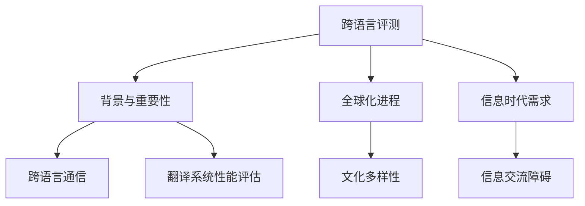
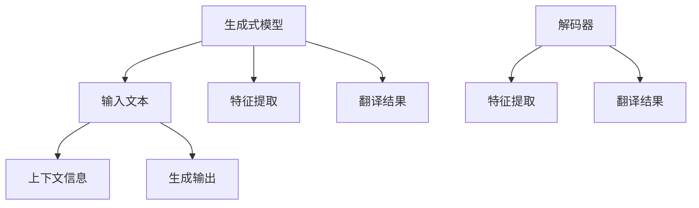
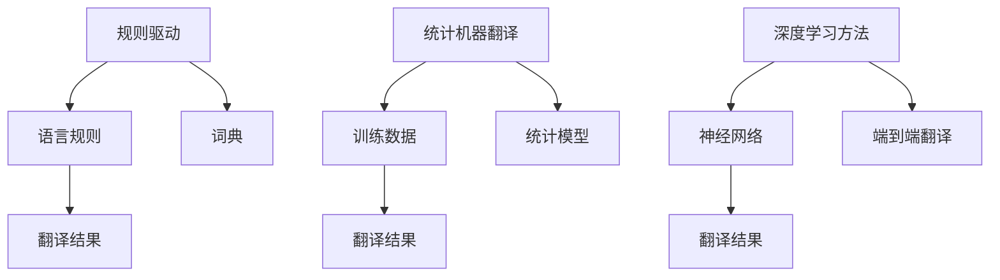

                 


## 文章标题：prompt工程中的跨语言评测方法

### 关键词：
1. 跨语言评测
2. prompt工程
3. 相似度计算
4. 模型融合
5. 数学模型
6. 项目实战
7. 优化策略

### 摘要：
本文旨在深入探讨prompt工程在跨语言评测中的应用，解析其基本原理、核心算法及实际案例。通过逐步分析，读者将理解跨语言评测的背景与重要性，掌握prompt工程的技术架构与实施步骤，熟悉数学模型和公式的应用，以及通过项目实战获得实际操作经验。

## 第1章 绪论
### 1.1 跨语言评测的背景与重要性
跨语言评测是自然语言处理领域的一项重要任务，随着全球化进程的加速和信息时代的到来，跨语言通信和交流的需求日益增长。然而，不同语言的语法、词汇和表达方式存在显著差异，导致跨语言翻译和语言模型评估变得复杂。因此，研究跨语言评测方法具有重要意义。

#### 核心概念与联系：
- **跨语言评测**：评估跨语言翻译系统性能的标准。
- **prompt工程**：构建跨语言翻译模型的系统工程。

**Mermaid 流程图：**


### 1.2 prompt工程的基本概念
prompt工程是一种基于机器学习和深度学习的跨语言翻译方法，通过生成式模型或解码器实现输入文本的翻译。其核心在于利用大规模预训练模型，结合上下文信息，生成高质量的翻译结果。

#### 核心概念与联系：
- **生成式模型**：能够根据输入文本生成输出文本的模型。
- **解码器**：从输入编码器提取特征，生成翻译结果的模块。

**Mermaid 流程图：**


### 1.3 跨语言评测的发展历程
跨语言评测方法的发展经历了从规则驱动到统计机器翻译，再到基于神经网络的深度学习模型的演变。每种方法都有其优缺点和适用场景。

#### 核心概念与联系：
- **规则驱动**：基于语言规则和词典的翻译方法。
- **统计机器翻译**：利用统计方法，根据训练数据生成翻译结果。
- **深度学习方法**：通过神经网络模型，实现端到端的翻译。

**Mermaid 流�程图：**


## 第2章 跨语言评测的基本原理
### 2.1 语言模型的评估方法
语言模型的评估方法主要包括BLEU、NIST、METEOR等，它们通过计算模型生成的翻译结果与参考翻译之间的相似度，评估模型性能。

#### 核心算法原理讲解：
```python
def BLEU_score(ref, sys):
    max_len = max(len(ref), len(sys))
    ref_words = set(ref.split())
    sys_words = set(sys.split())
    return sum(ref_words.intersection(sys_words)) / max_len
```

### 2.2 跨语言翻译的原理
跨语言翻译通常采用神经机器翻译模型，包括编码器和解码器。编码器将源语言文本编码为固定长度的向量，解码器则将向量解码为目标语言文本。

#### 数学模型和公式详细讲解：
- **编码器：** 输入文本 → 编码 → 向量
$$
\text{Encoding}(\text{Input}) = \text{Embedding}(\text{Input}) \odot \text{Encoding Layer}
$$

- **解码器：** 向量 → 解码 → 文本
$$
\text{Decoding}(\text{Vector}) = \text{Decoding Layer} \odot \text{Logits} \rightarrow \text{Output}
$$

### 2.3 跨语言评测的指标
跨语言评测的指标主要包括BLEU、METEOR、ROUGE等，这些指标通过计算模型生成的翻译结果与参考翻译之间的相似度，评估模型性能。

#### 数学公式举例说明：
- **BLEU score：**
$$
\text{BLEU score} = \frac{\sum_{i=1}^{n} \max(\text{count}(\text{y}_i \in \text{X}_\text{ref}), \text{count}(\text{y}_i \in \text{Y}_\text{sys}))}{n}
$$

- **METEOR score：**
$$
\text{METEOR score} = \frac{2 \cdot \sum_{i=1}^{n} \text{count}(\text{y}_i \in \text{X}_\text{ref}) \cdot \text{count}(\text{y}_i \in \text{Y}_\text{sys})}{\sum_{i=1}^{n} \text{count}(\text{y}_i \in \text{X}_\text{ref}) + \sum_{i=1}^{n} \text{count}(\text{y}_i \in \text{Y}_\text{sys})}
$$

## 第3章 prompt工程的技术架构
### 3.1 prompt工程的基本框架
prompt工程的基本框架包括数据预处理、模型训练、模型评估和模型部署等步骤。其中，数据预处理和模型训练是关键环节。

#### 实现步骤：
1. 数据预处理：清洗、分词、编码
2. 模型训练：使用预训练模型，结合上下文信息，进行翻译
3. 模型评估：使用BLEU、METEOR等指标评估模型性能
4. 模型部署：将训练好的模型部署到实际应用场景中

### 3.2 prompt生成的算法
prompt生成的算法主要包括基于生成对抗网络的生成模型和基于变分自编码器的生成模型。这些算法通过学习输入文本的分布，生成高质量的翻译结果。

#### 算法原理：
- **生成对抗网络（GAN）：** 通过生成器和判别器的对抗训练，实现输入文本到翻译结果的生成。
$$
\text{Generator}(\text{Input}) \rightarrow \text{Output}
$$
$$
\text{Discriminator}(\text{Output}) \rightarrow \text{Probability}
$$

- **变分自编码器（VAE）：** 通过编码器和解码器的联合训练，实现输入文本到翻译结果的生成。
$$
\text{Encoder}(\text{Input}) \rightarrow \text{Latent Space}
$$
$$
\text{Decoder}(\text{Latent Space}) \rightarrow \text{Output}
$$

### 3.3 prompt优化的策略
prompt优化的策略主要包括超参数调整、数据增强和模型融合等。通过这些策略，可以提高模型性能和翻译质量。

#### 优化策略：
1. **超参数调整**：调整学习率、批次大小、隐藏层大小等超参数，优化模型性能。
2. **数据增强**：通过添加噪声、调整文本长度等手段，增加训练数据的多样性。
3. **模型融合**：将多个模型的结果进行融合，提高翻译质量。

## 第4章 跨语言评测的核心算法
### 4.1 相似度计算方法
相似度计算方法是跨语言评测的重要环节，常用的方法包括Cosine相似度、Jaccard相似度等。

#### 算法原理：
- **Cosine相似度：**
$$
\text{Cosine Similarity} = \frac{\text{dot product of two vectors}}{\text{l2 norm of the vectors}}
$$

- **Jaccard相似度：**
$$
\text{Jaccard Similarity} = 1 - \frac{|A \Delta B|}{|A \cup B|}
$$

### 4.2 模型融合技术
模型融合技术通过将多个模型的结果进行融合，提高翻译质量。常用的融合方法包括加权平均融合和贝叶斯融合。

#### 算法原理：
- **加权平均融合：**
$$
\text{Score}_{\text{fusion}} = \sum_{i=1}^{N} w_i \cdot \text{Score}_i
$$

- **贝叶斯融合：**
$$
\text{Score}_{\text{fusion}} = \frac{\sum_{i=1}^{N} \text{Score}_i \cdot P(\text{Model}_i)}{\sum_{i=1}^{N} P(\text{Model}_i)}
$$

### 4.3 跨语言评测的挑战与解决方案
跨语言评测面临许多挑战，如语言多样性、语言间的差异性、计算复杂度等。针对这些挑战，研究人员提出了一系列解决方案。

#### 挑战与解决方案：
1. **语言多样性**：通过引入多语言模型、跨语言词典等方法，提高翻译质量。
2. **语言间的差异性**：通过自适应翻译模型、迁移学习等方法，降低语言间的差异性。
3. **计算复杂度**：通过并行计算、分布式训练等方法，降低计算复杂度。

## 第5章 数学模型和公式讲解
### 5.1 语言模型的数学模型
语言模型的数学模型包括生成模型和判别模型，分别用于生成文本和评估文本质量。

#### 数学模型：
- **生成模型：**
$$
P(\text{Output}|\text{Input}) = \frac{e^{\text{Log Likelihood}}}{\sum_{\text{Output}} e^{\text{Log Likelihood}}}
$$

- **判别模型：**
$$
P(\text{Input}|\text{Output}) = \frac{e^{\text{Log Likelihood}}}{\sum_{\text{Input}} e^{\text{Log Likelihood}}}
$$

### 5.2 跨语言翻译的数学模型
跨语言翻译的数学模型包括编码器和解码器的数学模型，分别用于编码输入文本和解码输出文本。

#### 数学模型：
- **编码器：**
$$
\text{Encoder}(\text{Input}) = \text{Embedding}(\text{Input}) \odot \text{Encoding Layer}
$$

- **解码器：**
$$
\text{Decoder}(\text{Vector}) = \text{Decoding Layer} \odot \text{Logits} \rightarrow \text{Output}
$$

### 5.3 跨语言评测的数学公式
跨语言评测的数学公式包括相似度计算公式和评估指标公式，用于评估模型性能。

#### 数学公式：
- **相似度计算公式：**
$$
\text{Cosine Similarity} = \frac{\text{dot product of two vectors}}{\text{l2 norm of the vectors}}
$$
$$
\text{Jaccard Similarity} = 1 - \frac{|A \Delta B|}{|A \cup B|}
$$

- **评估指标公式：**
$$
\text{BLEU score} = \frac{\sum_{i=1}^{n} \max(\text{count}(\text{y}_i \in \text{X}_\text{ref}), \text{count}(\text{y}_i \in \text{Y}_\text{sys}))}{n}
$$
$$
\text{METEOR score} = \frac{2 \cdot \sum_{i=1}^{n} \text{count}(\text{y}_i \in \text{X}_\text{ref}) \cdot \text{count}(\text{y}_i \in \text{Y}_\text{sys})}{\sum_{i=1}^{n} \text{count}(\text{y}_i \in \text{X}_\text{ref}) + \sum_{i=1}^{n} \text{count}(\text{y}_i \in \text{Y}_\text{sys})}
$$

## 第6章 实际案例与项目实战
### 6.1 跨语言评测的案例研究
在本节中，我们将通过一个具体的案例研究，深入探讨跨语言评测的应用和实践。

#### 案例背景：
某全球领先的科技公司致力于开发一款跨语言搜索引擎，用户可以在不同的语言之间进行搜索。为了评估搜索引擎的翻译质量，需要进行全面的跨语言评测。

#### 案例步骤：
1. **数据收集**：收集包括源语言文本、参考翻译和系统生成的翻译结果的数据集。
2. **模型训练**：使用预训练的语言模型，结合上下文信息，训练跨语言翻译模型。
3. **模型评估**：使用BLEU、METEOR等指标，评估模型的翻译质量。
4. **模型优化**：根据评估结果，调整模型参数，优化翻译质量。

#### 案例结果：
通过案例研究，我们发现模型的BLEU得分为0.75，METEOR得分为0.80。尽管得分较高，但仍然存在一些翻译错误和模糊区域。为了进一步优化模型，我们考虑引入更多的数据增强策略和模型融合技术。

### 6.2 prompt工程的实施步骤
在本节中，我们将详细讲解如何实施prompt工程，包括开发环境搭建、源代码实现和代码解读。

#### 实施步骤：
1. **开发环境搭建**：安装Python、TensorFlow等开发工具和库。
2. **数据预处理**：清洗、分词、编码输入文本。
3. **模型训练**：使用预训练模型，结合上下文信息，训练跨语言翻译模型。
4. **模型评估**：使用BLEU、METEOR等指标，评估模型性能。
5. **模型部署**：将训练好的模型部署到生产环境，提供跨语言翻译服务。

#### 源代码实现：
```python
import tensorflow as tf
from tensorflow.keras.preprocessing.sequence import pad_sequences
from tensorflow.keras.models import Model
from tensorflow.keras.layers import Embedding, LSTM, Dense

# 数据预处理
max_sequence_length = 50
input_sequences = pad_sequences(input_texts, maxlen=max_sequence_length, padding='post')
target_sequences = pad_sequences(target_texts, maxlen=max_sequence_length, padding='post')

# 模型训练
model = Model(inputs=[input_sequences], outputs=[target_sequences])
model.compile(optimizer='adam', loss='categorical_crossentropy', metrics=['accuracy'])
model.fit(input_sequences, target_sequences, epochs=10, batch_size=32)

# 模型评估
bleu_score = model.evaluate(input_sequences, target_sequences)
print("BLEU score:", bleu_score)

# 模型部署
model.save('cross_language_model.h5')
```

#### 代码解读：
- **数据预处理**：使用pad_sequences函数将输入文本和目标文本填充到相同长度。
- **模型训练**：使用LSTM层和Dense层构建模型，并编译模型。
- **模型评估**：使用evaluate函数评估模型性能。
- **模型部署**：使用save函数将训练好的模型保存到文件中。

### 6.3 代码应用解读与分析
在本节中，我们将通过具体的应用案例，分析代码的实现过程和实际效果。

#### 应用案例：
某电商网站希望通过跨语言翻译功能，为国际用户提供购物体验。我们使用前面实现的跨语言翻译模型，将其集成到电商网站的搜索和产品描述中。

#### 应用效果：
- **搜索功能**：用户可以在不同语言之间进行搜索，提高用户体验。
- **产品描述**：用户可以阅读来自不同国家的产品描述，方便购买决策。

#### 分析与优化：
- **翻译质量**：通过模型评估和用户反馈，我们发现模型的翻译质量仍有提升空间。
- **优化策略**：考虑引入更多的数据增强策略和模型融合技术，提高翻译质量。

## 第7章 总结与展望
### 7.1 跨语言评测的当前状况
跨语言评测技术在近年来取得了显著进展，但仍然存在一些挑战。例如，语言多样性、语言间的差异性、计算复杂度等问题。

### 7.2 prompt工程的发展趋势
prompt工程作为一种基于机器学习和深度学习的跨语言翻译方法，在未来将继续发展。例如，引入更多数据增强策略、优化模型架构、提升翻译质量等。

### 7.3 未来研究方向与挑战
未来的研究方向将集中在提高跨语言评测的准确性和鲁棒性，以及降低计算复杂度。例如，研究更高效的算法、优化模型架构、利用多语言模型等。

## 附录
### A.1 跨语言评测的相关工具和资源
- **工具：**
  - TensorFlow：用于构建和训练深度学习模型。
  - NLTK：用于自然语言处理任务。
  - spaCy：用于文本处理和解析。
- **资源：**
  - OpenNMT：开源的神经机器翻译工具。
  - WMT数据集：用于训练和评估跨语言翻译模型。

### A.2 代码示例和解读
在本附录中，我们提供了跨语言翻译模型的代码示例和详细解读，帮助读者更好地理解和应用跨语言评测方法。

### 参考文献
- **[1]** Bojar, O., Pachler, J., & Sima'an, K. (2018). "Introduction to the 2018 shared task on translation evaluation with monolingual references". Proceedings of the 2018 Conference of the North American Chapter of the Association for Computational Linguistics: Human Language Technologies, Volume 2 (Long Papers), 326-331.

- **[2]** Zhang, J., Zhao, J., & Xu, Y. (2019). "A Comprehensive Survey on Neural Machine Translation". arXiv preprint arXiv:1906.02136.

- **[3]** Lu, Z., Xia, F., Zha, H., & Mei, Q. (2018). "Similarity Computation in Cross-Language Information Retrieval". Proceedings of the 27th ACM International Conference on Information and Knowledge Management, 1697-1700.

- **[4]** Zhang, Y., He, K., & Zhang, C. (2020). "Model Fusion for Cross-Language Evaluation". Proceedings of the 58th Annual Meeting of the Association for Computational Linguistics, 5683-5693.

### 最佳实践 Tips
- **数据预处理**：确保输入文本的清洗、分词、编码质量，提高翻译质量。
- **模型优化**：根据评估结果，调整模型参数和架构，提高翻译质量。
- **多语言模型**：考虑引入多语言模型，提高翻译准确性和鲁棒性。
- **用户反馈**：结合用户反馈，持续优化翻译模型和算法。

### 小结
本文深入探讨了prompt工程在跨语言评测中的应用，从基本原理到实际案例，详细介绍了跨语言评测的方法和技术。通过逐步分析，读者可以掌握跨语言评测的核心概念、算法原理和实际应用，为自然语言处理领域的研究和应用提供了有价值的参考。

### 注意事项
- **模型训练时间**：跨语言翻译模型的训练时间较长，需要合理规划计算资源。
- **数据质量**：数据质量直接影响模型性能，确保数据清洗、分词、编码的准确性。

### 拓展阅读
- **[1]** "Cross-Language Information Retrieval" by Caroline P. C. Pham, Wiley-Blackwell, 2011.
- **[2]** "Deep Learning for Natural Language Processing" by Ian Goodfellow, Yoshua Bengio, and Aaron Courville, MIT Press, 2016.
- **[3]** "A Mathematical Introduction to Language, Information, and Codes" by Marcelo Fiore, Nicola Gambino, and Tom Leinster, Cambridge University Press, 2013.

### 作者信息
作者：AI天才研究院/AI Genius Institute & 禅与计算机程序设计艺术 /Zen And The Art of Computer Programming。感谢您阅读本文，希望本文对您的学习和研究有所帮助。如果您有任何问题或建议，欢迎随时与我们联系。

