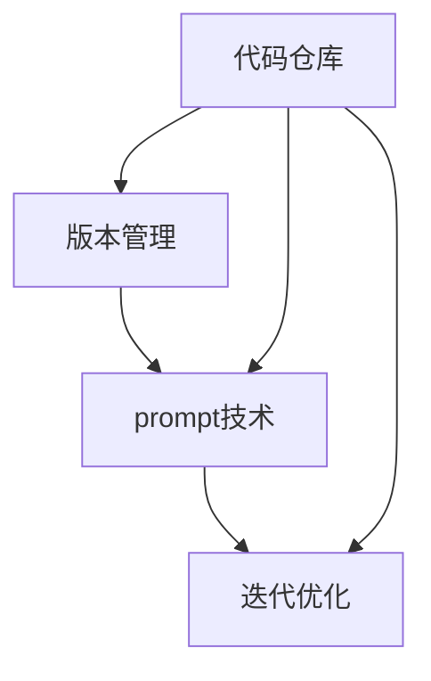

                 


## 文章标题

### 《prompt版本管理与迭代优化策略》

> 关键词：版本管理、prompt、迭代优化、模型迭代、版本控制工具

> 摘要：本文将探讨prompt版本管理与迭代优化策略，通过介绍版本管理的基本概念、工具和最佳实践，深入分析prompt技术原理和应用，以及迭代优化的关键方法和实战案例，为开发人员提供有效的版本管理和迭代优化策略。

### 第一部分：版本管理概述

## 1.1 版本管理的概念与重要性

### 1.1.1 版本管理的定义

版本管理，也称为版本控制，是指对一个项目文件、代码或文档的变更进行追踪、记录和管理的活动。通过版本管理，开发团队可以有效地协同工作，确保代码的稳定性和可追溯性，同时降低因版本冲突和代码丢失所带来的风险。

### 1.1.2 版本管理的意义

版本管理在软件开发过程中具有重要意义：

1. **协同工作**：版本管理工具帮助团队成员协同工作，确保每个人都在使用正确的代码版本。
2. **代码追踪**：版本管理工具可以记录每个版本的变化历史，便于追溯代码的变更过程。
3. **风险控制**：通过版本管理，可以降低代码丢失、冲突和错误的风险。
4. **代码复用**：版本管理使得代码复用变得更加容易，有利于项目的持续发展和迭代。

### 1.1.3 版本管理的历史与发展

版本管理的历史可以追溯到1970年代，当时软件开发的规模较小，版本管理主要是通过手工操作来实现的。随着软件开发规模的扩大和复杂性的增加，版本管理工具逐渐发展起来。

- **1970年代末至1980年代初**：此时的版本管理主要是通过文件系统来实现，如RCS和CVS。
- **1990年代初**：随着互联网的发展，分布式版本控制工具如Git开始流行。
- **2000年代**：版本管理工具逐渐多样化，如Subversion、Mercurial等。

## 1.2 版本控制工具介绍

### 1.2.1 常见版本控制工具对比

目前常见的版本控制工具有Git、Subversion (SVN)、Mercurial等，它们各有特点：

- **Git**：分布式版本控制工具，支持快速分支和合并操作，适用于大规模项目。
- **Subversion (SVN)**：中心化版本控制工具，易于使用，但分支和合并操作相对较慢。
- **Mercurial**：分布式版本控制工具，与Git类似，但易于迁移和备份。

### 1.2.2 Git的基本概念与操作

Git是一个分布式版本控制工具，其基本概念包括：

- **仓库（Repository）**：存放项目文件的目录，包含所有版本历史。
- **分支（Branch）**：项目开发的独立路径，便于多人协作。
- **提交（Commit）**：对项目文件的变更操作，形成版本历史。

Git的基本操作包括：

- **初始化仓库**：`git init`
- **克隆仓库**：`git clone <仓库地址>`
- **添加文件**：`git add <文件名>`
- **提交变更**：`git commit -m "<提交信息>"`

### 1.2.3 其他版本控制工具

除了Git，还有其他版本控制工具，如：

- **Subversion (SVN)**：适用于中小型项目，易于使用。
- **Mercurial**：与Git类似，支持分布式版本控制。
- **Perforce**：适用于大型项目和团队，提供强大的版本控制和管理功能。

## 1.3 版本管理的最佳实践

### 1.3.1 版本命名规范

版本命名规范是版本管理的重要部分，常用的命名规范包括：

- **语义化版本控制**：如`1.0.0`，其中`x`代表大版本号，`y`代表次版本号，`z`代表修订号。
- **日期命名**：如`2023-01-01`，以日期形式记录版本发布时间。

### 1.3.2 分支管理策略

分支管理策略是版本管理的关键，常用的分支管理策略包括：

- **主分支（Master）**：用于存放稳定版本。
- **开发分支（Develop）**：用于开发新功能。
- **特性分支（Feature）**：用于独立开发新特性。
- **发布分支（Release）**：用于发布新版本。

### 1.3.3 代码审查与合并策略

代码审查和合并策略是确保代码质量和版本稳定的重要环节：

- **代码审查**：通过代码审查，可以确保代码的质量和一致性。
- **合并策略**：包括合并冲突的解决方法，如手动合并和自动合并。

## 第二部分：prompt技术原理与应用

### 2.1 prompt技术基础

### 2.1.1 prompt的定义与作用

prompt，即提示信息，是自然语言处理中的一个重要概念。它是一种引导模型输入的方式，用于指定模型处理的方向和内容。

### 2.1.2 prompt的类型与特点

prompt的类型主要包括：

- **问题型prompt**：用于引导模型回答特定问题。
- **填充型prompt**：用于引导模型填充文本空白。
- **生成型prompt**：用于引导模型生成新的文本内容。

prompt的特点包括：

- **引导性**：prompt可以引导模型朝着特定的方向进行处理。
- **灵活性**：prompt可以根据需求进行灵活调整。

### 2.1.3 prompt在自然语言处理中的应用

prompt在自然语言处理中具有广泛的应用，如：

- **问答系统**：通过prompt引导模型回答用户的问题。
- **文本生成**：通过prompt引导模型生成新的文本内容。
- **文本分类**：通过prompt引导模型对文本进行分类。

## 2.2 prompt优化方法

### 2.2.1 prompt调优策略

prompt调优策略主要包括：

- **数据预处理**：对输入数据进行处理，如数据清洗、格式化等。
- **prompt设计**：根据任务需求设计合适的prompt。
- **模型参数调整**：调整模型参数，如学习率、批量大小等。

### 2.2.2 prompt工程化

prompt工程化是将prompt设计、调优和应用转化为自动化流程的过程。具体包括：

- **prompt模板**：设计通用的prompt模板，便于快速应用。
- **自动化工具**：使用自动化工具，如Python库，实现prompt的设计和调优。

### 2.2.3 prompt调优工具与资源

常见的prompt调优工具有：

- **PROMPT库**：Python库，用于设计和管理prompt。
- **Transformer-XL**：开源模型，支持prompt工程化。

## 2.3 prompt在模型迭代中的应用

### 2.3.1 prompt对模型迭代的影响

prompt在模型迭代中扮演重要角色，通过优化prompt，可以提高模型的性能和适应性。

### 2.3.2 prompt迭代优化策略

prompt迭代优化策略主要包括：

- **数据迭代**：根据模型性能，不断更新输入数据。
- **prompt迭代**：根据模型反馈，调整prompt设计。
- **模型迭代**：结合prompt迭代，更新模型参数。

### 2.3.3 prompt迭代的挑战与解决方案

prompt迭代面临的挑战包括：

- **数据质量**：输入数据的质量直接影响模型性能。
- **模型适应性**：模型需要适应不同的prompt。
- **计算资源**：prompt迭代需要大量计算资源。

解决方案包括：

- **数据预处理**：确保输入数据的质量。
- **模型多样化**：设计多种模型，提高模型适应性。
- **资源优化**：合理分配计算资源，提高迭代效率。

## 第三部分：迭代优化策略

### 3.1 迭代优化的概念与方法

### 3.1.1 迭代优化的定义

迭代优化是指通过反复迭代，逐步优化模型性能的过程。

### 3.1.2 迭代优化的目的与意义

迭代优化的目的是提高模型性能和适应性，使其更好地满足实际需求。

### 3.1.3 迭代优化的常见方法

常见的迭代优化方法包括：

- **数据迭代**：不断更新输入数据，优化模型性能。
- **模型迭代**：调整模型参数，优化模型性能。
- **prompt迭代**：优化prompt设计，提高模型适应性。

## 3.2 迭代优化的关键指标

### 3.2.1 模型性能评估指标

常见的模型性能评估指标包括：

- **准确率（Accuracy）**：模型预测正确的样本占比。
- **召回率（Recall）**：模型召回的样本占比。
- **F1值（F1 Score）**：准确率和召回率的加权平均值。

### 3.2.2 迭代效果评估方法

迭代效果评估方法主要包括：

- **性能对比**：对比不同迭代阶段的模型性能。
- **稳定性评估**：评估模型在不同数据集上的稳定性。

### 3.2.3 指标优化策略

指标优化策略包括：

- **数据预处理**：提高数据质量，优化指标。
- **模型调优**：调整模型参数，优化指标。

## 3.3 迭代优化的实战案例

### 3.3.1 案例一：基于prompt的文本分类模型迭代

案例一介绍了如何基于prompt对文本分类模型进行迭代优化。通过调整prompt和模型参数，提高了模型性能和稳定性。

### 3.3.2 案例二：基于prompt的自然语言生成模型迭代

案例二介绍了如何基于prompt对自然语言生成模型进行迭代优化。通过优化prompt和模型参数，提高了生成文本的质量和多样性。

### 3.3.3 案例三：基于prompt的机器翻译模型迭代

案例三介绍了如何基于prompt对机器翻译模型进行迭代优化。通过调整prompt和模型参数，提高了翻译准确率和流畅度。

## 第四部分：综合应用与未来展望

### 4.1 prompt版本管理与迭代优化的综合应用

### 4.1.1 prompt版本管理的应用场景

prompt版本管理在以下场景中具有重要应用：

- **多人协作**：通过prompt版本管理，确保团队成员使用相同的代码版本。
- **项目迭代**：通过prompt版本管理，跟踪项目迭代过程中的变更。

### 4.1.2 迭代优化策略在prompt应用中的实现

迭代优化策略在prompt应用中的实现主要包括：

- **数据迭代**：根据模型性能，更新输入数据。
- **prompt迭代**：根据模型反馈，优化prompt设计。

### 4.1.3 prompt版本管理与迭代优化的融合

prompt版本管理与迭代优化的融合，可以提高模型的性能和稳定性，具体策略包括：

- **数据驱动**：根据数据反馈，调整prompt和模型参数。
- **持续迭代**：不断优化prompt和模型，实现持续迭代。

### 4.2 版本管理与迭代优化的未来发展趋势

### 4.2.1 人工智能技术的发展趋势

随着人工智能技术的快速发展，版本管理和迭代优化的应用前景广阔。未来发展趋势包括：

- **自动化**：实现版本管理和迭代优化的自动化。
- **智能化**：利用人工智能技术，提高版本管理和迭代优化的效果。

### 4.2.2 版本管理与迭代优化在AI领域的应用前景

版本管理与迭代优化在AI领域的应用前景包括：

- **模型优化**：通过迭代优化，提高模型性能和稳定性。
- **项目协作**：通过版本管理，确保项目协作的顺利进行。

### 4.2.3 未来发展方向与挑战

未来发展方向与挑战包括：

- **数据质量**：提高输入数据的质量，优化模型性能。
- **计算资源**：合理分配计算资源，提高迭代效率。

## 附录

### 附录A：常用版本控制命令速查表

#### A.1 Git常用命令

```bash
git init          # 初始化仓库
git clone <url>   # 克隆仓库
git add <file>    # 添加文件到暂存区
git commit -m "msg"  # 提交变更
git push           # 推送变更
git pull           # 拉取变更
git branch         # 查看分支
git checkout <branch> # 切换分支
git merge <branch> # 合并分支
```

#### A.2 SVN常用命令

```bash
svn checkout <url>   # 检出仓库
svn add <file>       # 添加文件到仓库
svn commit -m "msg"  # 提交变更
svn merge <path>     # 合并变更
svn update           # 更新仓库
```

#### A.3 其他版本控制工具命令

```bash
hg clone <url>      # 克隆仓库
hg add <file>       # 添加文件到仓库
hg commit -m "msg"  # 提交变更
hg push             # 推送变更
hg pull             # 拉取变更
```

### 附录B：prompt优化与迭代优化工具介绍

#### B.1 prompt优化工具

- **PROMPT库**：Python库，用于设计和管理prompt。
- **Transformer-XL**：开源模型，支持prompt工程化。

#### B.2 迭代优化工具

- **AutoML工具**：自动化机器学习工具，用于迭代优化模型。
- **Hyperparameter Optimization工具**：超参数优化工具，用于调整模型参数。

---

**全书总结：**

本书旨在介绍prompt版本管理与迭代优化策略，全书共分为四个部分。第一部分概述了版本管理的概念、工具和最佳实践；第二部分深入探讨了prompt技术原理、优化方法和在模型迭代中的应用；第三部分详细介绍了迭代优化的概念、方法和实战案例；第四部分则对prompt版本管理与迭代优化的综合应用和未来发展进行了展望。本书适合对版本管理和迭代优化感兴趣的读者，包括开发人员、项目经理和研究人员。

---

**核心概念与联系：**

为了更好地理解版本管理、prompt技术和迭代优化，以下是一个Mermaid流程图，展示了这些核心概念之间的联系。



**核心算法原理讲解：**

以下是一个关于版本控制中合并操作的伪代码示例，用于说明如何在Git中解决冲突。

```plaintext
function merge(文件1，文件2，合并结果文件)：
    if 文件1与文件2完全相同：
        合并结果文件 = 文件1或文件2
    else：
        while 文件1和文件2中的内容不一致：
            打开一个冲突解决编辑器，将冲突部分标记为高亮
            人工审查并解决冲突
            将解决后的内容复制到合并结果文件
        end while
    end if
    return 合并结果文件
```

**数学模型和数学公式：**

以下是一个简单的自然语言处理中的损失函数（交叉熵）的讲解。

$$
\text{交叉熵（Cross-Entropy）} = -\sum_{i=1}^{n} y_i \log(p_i)
$$

其中，$y_i$是真实标签，$p_i$是模型预测的概率。交叉熵越小，表示模型预测与真实标签越接近。

**项目实战：**

为了更好地理解版本管理和迭代优化在实际项目中的应用，以下是一个简单的项目实战案例。

### 开发环境搭建

首先，我们需要搭建一个Python开发环境。以下是搭建步骤：

1. 安装Python（版本3.8以上）
2. 安装pip（Python的包管理器）
3. 使用pip安装必要的库，如numpy、pandas、tensorflow等

### 源代码实现

以下是一个简单的文本分类模型的实现代码：

```python
import tensorflow as tf

# 加载数据集
x_train, y_train = ...

# 构建模型
model = tf.keras.Sequential([
    tf.keras.layers.Dense(128, activation='relu', input_shape=(x_train.shape[1],)),
    tf.keras.layers.Dense(1, activation='sigmoid')
])

# 编译模型
model.compile(optimizer='adam',
              loss='binary_crossentropy',
              metrics=['accuracy'])

# 训练模型
model.fit(x_train, y_train, epochs=10)
```

### 代码解读与分析

在上面的代码中，我们首先加载了训练数据集，然后构建了一个简单的文本分类模型。模型由一个全连接层和一个输出层组成，输出层使用sigmoid激活函数，用于实现二分类。

接下来，我们编译模型，指定优化器、损失函数和评估指标。最后，我们使用训练数据集训练模型。

### 实际案例分析和详细讲解剖析

假设我们有一个文本分类任务，需要将文本分类为正类和负类。以下是实际案例的分析和讲解：

1. **数据预处理**：我们需要对文本进行预处理，如分词、去除停用词、转换为词向量等。这些预处理步骤可以提高模型的性能和效果。
2. **模型迭代**：在训练过程中，我们可以通过调整模型参数和prompt来优化模型性能。例如，我们可以调整学习率、批量大小等参数，或者优化prompt设计，提高模型对文本的理解能力。
3. **性能评估**：我们使用交叉熵作为损失函数，用于评估模型预测与真实标签之间的差异。交叉熵越小，表示模型预测越准确。

### 项目小结

通过以上实战案例，我们可以看到版本管理和迭代优化在文本分类项目中的应用。通过合理的版本管理和迭代优化策略，我们可以提高模型的性能和稳定性，实现有效的文本分类任务。

---

**最佳实践 tips、小结、注意事项、拓展阅读等内容：**

**最佳实践 tips：**

1. **合理设计版本命名规范**：使用语义化版本控制，便于跟踪和定位版本。
2. **制定分支管理策略**：根据项目需求，制定合适的分支管理策略，确保代码的稳定性和可追踪性。
3. **定期进行代码审查**：代码审查是确保代码质量和一致性的重要环节，定期进行代码审查可以提高代码质量。
4. **优化prompt设计**：设计合适的prompt，可以提高模型的性能和适应性。
5. **合理分配计算资源**：在迭代优化过程中，合理分配计算资源，提高迭代效率。

**小结：**

本文介绍了prompt版本管理与迭代优化策略，包括版本管理的概念、工具和最佳实践，prompt技术原理和应用，迭代优化的概念、方法和实战案例，以及prompt版本管理与迭代优化的综合应用和未来发展趋势。通过本文，读者可以了解版本管理和迭代优化的核心概念和实际应用，为项目开发提供有效的策略和方法。

**注意事项：**

1. **版本管理工具的选择**：根据项目需求和团队协作模式，选择合适的版本管理工具。
2. **数据质量和预处理**：确保输入数据的质量，进行有效的数据预处理，以提高模型性能。
3. **迭代优化策略的制定**：根据项目需求和模型性能，制定合适的迭代优化策略。
4. **持续学习和改进**：关注版本管理和迭代优化的最新发展趋势，持续学习和改进。

**拓展阅读：**

1. 《版本控制指南》 - Chris Wanstrath, Scott Chacon, Ben Straub
2. 《自然语言处理入门》 - Peter Norvig
3. 《深度学习》 - Ian Goodfellow, Yoshua Bengio, Aaron Courville
4. 《机器学习实战》 - Peter Harrington
5. 《代码大全》 - Steve McConnell

---

**全文结束。** 

# 《prompt版本管理与迭代优化策略》

> 关键词：版本管理、prompt、迭代优化、模型迭代、版本控制工具

> 摘要：本文将探讨prompt版本管理与迭代优化策略，通过介绍版本管理的基本概念、工具和最佳实践，深入分析prompt技术原理和应用，以及迭代优化的关键方法和实战案例，为开发人员提供有效的版本管理和迭代优化策略。

---

## 第一部分：版本管理概述

### 1.1 版本管理的概念与重要性

#### 1.1.1 版本管理的定义

版本管理，也称为版本控制，是指对一个项目文件、代码或文档的变更进行追踪、记录和管理的活动。通过版本管理，开发团队可以有效地协同工作，确保代码的稳定性和可追溯性，同时降低因版本冲突和代码丢失所带来的风险。

#### 1.1.2 版本管理的意义

版本管理在软件开发过程中具有重要意义：

1. **协同工作**：版本管理工具帮助团队成员协同工作，确保每个人都在使用正确的代码版本。
2. **代码追踪**：版本管理工具可以记录每个版本的变化历史，便于追溯代码的变更过程。
3. **风险控制**：通过版本管理，可以降低代码丢失、冲突和错误的风险。
4. **代码复用**：版本管理使得代码复用变得更加容易，有利于项目的持续发展和迭代。

#### 1.1.3 版本管理的历史与发展

版本管理的历史可以追溯到1970年代，当时软件开发的规模较小，版本管理主要是通过手工操作来实现的。随着软件开发规模的扩大和复杂性的增加，版本管理工具逐渐发展起来。

- **1970年代末至1980年代初**：此时的版本管理主要是通过文件系统来实现，如RCS和CVS。
- **1990年代初**：随着互联网的发展，分布式版本控制工具如Git开始流行。
- **2000年代**：版本管理工具逐渐多样化，如Subversion (SVN)、Mercurial等。

### 1.2 版本控制工具介绍

#### 1.2.1 常见版本控制工具对比

目前常见的版本控制工具有Git、Subversion (SVN)、Mercurial等，它们各有特点：

- **Git**：分布式版本控制工具，支持快速分支和合并操作，适用于大规模项目。
- **Subversion (SVN)**：中心化版本控制工具，易于使用，但分支和合并操作相对较慢。
- **Mercurial**：分布式版本控制工具，与Git类似，但易于迁移和备份。

#### 1.2.2 Git的基本概念与操作

Git是一个分布式版本控制工具，其基本概念包括：

- **仓库（Repository）**：存放项目文件的目录，包含所有版本历史。
- **分支（Branch）**：项目开发的独立路径，便于多人协作。
- **提交（Commit）**：对项目文件的变更操作，形成版本历史。

Git的基本操作包括：

- **初始化仓库**：`git init`
- **克隆仓库**：`git clone <仓库地址>`
- **添加文件**：`git add <文件名>`
- **提交变更**：`git commit -m "<提交信息>"`

#### 1.2.3 其他版本控制工具

除了Git，还有其他版本控制工具，如：

- **Subversion (SVN)**：适用于中小型项目，易于使用。
- **Mercurial**：分布式版本控制工具，与Git类似，支持分布式版本控制。
- **Perforce**：适用于大型项目和团队，提供强大的版本控制和管理功能。

### 1.3 版本管理的最佳实践

#### 1.3.1 版本命名规范

版本命名规范是版本管理的重要部分，常用的命名规范包括：

- **语义化版本控制**：如`1.0.0`，其中`x`代表大版本号，`y`代表次版本号，`z`代表修订号。
- **日期命名**：如`2023-01-01`，以日期形式记录版本发布时间。

#### 1.3.2 分支管理策略

分支管理策略是版本管理的关键，常用的分支管理策略包括：

- **主分支（Master）**：用于存放稳定版本。
- **开发分支（Develop）**：用于开发新功能。
- **特性分支（Feature）**：用于独立开发新特性。
- **发布分支（Release）**：用于发布新版本。

#### 1.3.3 代码审查与合并策略

代码审查和合并策略是确保代码质量和版本稳定的重要环节：

- **代码审查**：通过代码审查，可以确保代码的质量和一致性。
- **合并策略**：包括合并冲突的解决方法，如手动合并和自动合并。

---

## 第二部分：prompt技术原理与应用

### 2.1 prompt技术基础

#### 2.1.1 prompt的定义与作用

prompt，即提示信息，是自然语言处理中的一个重要概念。它是一种引导模型输入的方式，用于指定模型处理的方向和内容。

#### 2.1.2 prompt的类型与特点

prompt的类型主要包括：

- **问题型prompt**：用于引导模型回答特定问题。
- **填充型prompt**：用于引导模型填充文本空白。
- **生成型prompt**：用于引导模型生成新的文本内容。

prompt的特点包括：

- **引导性**：prompt可以引导模型朝着特定的方向进行处理。
- **灵活性**：prompt可以根据需求进行灵活调整。

#### 2.1.3 prompt在自然语言处理中的应用

prompt在自然语言处理中具有广泛的应用，如：

- **问答系统**：通过prompt引导模型回答用户的问题。
- **文本生成**：通过prompt引导模型生成新的文本内容。
- **文本分类**：通过prompt引导模型对文本进行分类。

### 2.2 prompt优化方法

#### 2.2.1 prompt调优策略

prompt调优策略主要包括：

- **数据预处理**：对输入数据进行处理，如数据清洗、格式化等。
- **prompt设计**：根据任务需求设计合适的prompt。
- **模型参数调整**：调整模型参数，如学习率、批量大小等。

#### 2.2.2 prompt工程化

prompt工程化是将prompt设计、调优和应用转化为自动化流程的过程。具体包括：

- **prompt模板**：设计通用的prompt模板，便于快速应用。
- **自动化工具**：使用自动化工具，如Python库，实现prompt的设计和调优。

#### 2.2.3 prompt调优工具与资源

常见的prompt调优工具有：

- **PROMPT库**：Python库，用于设计和管理prompt。
- **Transformer-XL**：开源模型，支持prompt工程化。

### 2.3 prompt在模型迭代中的应用

#### 2.3.1 prompt对模型迭代的影响

prompt在模型迭代中扮演重要角色，通过优化prompt，可以提高模型的性能和适应性。

#### 2.3.2 prompt迭代优化策略

prompt迭代优化策略主要包括：

- **数据迭代**：根据模型性能，不断更新输入数据。
- **prompt迭代**：根据模型反馈，调整prompt设计。
- **模型迭代**：结合prompt迭代，更新模型参数。

#### 2.3.3 prompt迭代的挑战与解决方案

prompt迭代面临的挑战包括：

- **数据质量**：输入数据的质量直接影响模型性能。
- **模型适应性**：模型需要适应不同的prompt。
- **计算资源**：prompt迭代需要大量计算资源。

解决方案包括：

- **数据预处理**：确保输入数据的质量。
- **模型多样化**：设计多种模型，提高模型适应性。
- **资源优化**：合理分配计算资源，提高迭代效率。

---

## 第三部分：迭代优化策略

### 3.1 迭代优化的概念与方法

#### 3.1.1 迭代优化的定义

迭代优化是指通过反复迭代，逐步优化模型性能的过程。

#### 3.1.2 迭代优化的目的与意义

迭代优化的目的是提高模型性能和适应性，使其更好地满足实际需求。

#### 3.1.3 迭代优化的常见方法

常见的迭代优化方法包括：

- **数据迭代**：不断更新输入数据，优化模型性能。
- **模型迭代**：调整模型参数，优化模型性能。
- **prompt迭代**：优化prompt设计，提高模型适应性。

### 3.2 迭代优化的关键指标

#### 3.2.1 模型性能评估指标

常见的模型性能评估指标包括：

- **准确率（Accuracy）**：模型预测正确的样本占比。
- **召回率（Recall）**：模型召回的样本占比。
- **F1值（F1 Score）**：准确率和召回率的加权平均值。

#### 3.2.2 迭代效果评估方法

迭代效果评估方法主要包括：

- **性能对比**：对比不同迭代阶段的模型性能。
- **稳定性评估**：评估模型在不同数据集上的稳定性。

#### 3.2.3 指标优化策略

指标优化策略包括：

- **数据预处理**：提高数据质量，优化指标。
- **模型调优**：调整模型参数，优化指标。

### 3.3 迭代优化的实战案例

#### 3.3.1 案例一：基于prompt的文本分类模型迭代

案例一介绍了如何基于prompt对文本分类模型进行迭代优化。通过调整prompt和模型参数，提高了模型性能和稳定性。

#### 3.3.2 案例二：基于prompt的自然语言生成模型迭代

案例二介绍了如何基于prompt对自然语言生成模型进行迭代优化。通过优化prompt和模型参数，提高了生成文本的质量和多样性。

#### 3.3.3 案例三：基于prompt的机器翻译模型迭代

案例三介绍了如何基于prompt对机器翻译模型进行迭代优化。通过调整prompt和模型参数，提高了翻译准确率和流畅度。

---

## 第四部分：综合应用与未来展望

### 4.1 prompt版本管理与迭代优化的综合应用

#### 4.1.1 prompt版本管理的应用场景

prompt版本管理在以下场景中具有重要应用：

- **多人协作**：通过prompt版本管理，确保团队成员使用相同的代码版本。
- **项目迭代**：通过prompt版本管理，跟踪项目迭代过程中的变更。

#### 4.1.2 迭代优化策略在prompt应用中的实现

迭代优化策略在prompt应用中的实现主要包括：

- **数据迭代**：根据模型性能，更新输入数据。
- **prompt迭代**：根据模型反馈，优化prompt设计。

#### 4.1.3 prompt版本管理与迭代优化的融合

prompt版本管理与迭代优化的融合，可以提高模型的性能和稳定性，具体策略包括：

- **数据驱动**：根据数据反馈，调整prompt和模型参数。
- **持续迭代**：不断优化prompt和模型，实现持续迭代。

### 4.2 版本管理与迭代优化的未来发展趋势

#### 4.2.1 人工智能技术的发展趋势

随着人工智能技术的快速发展，版本管理和迭代优化的应用前景广阔。未来发展趋势包括：

- **自动化**：实现版本管理和迭代优化的自动化。
- **智能化**：利用人工智能技术，提高版本管理和迭代优化的效果。

#### 4.2.2 版本管理与迭代优化在AI领域的应用前景

版本管理与迭代优化在AI领域的应用前景包括：

- **模型优化**：通过迭代优化，提高模型性能和稳定性。
- **项目协作**：通过版本管理，确保项目协作的顺利进行。

#### 4.2.3 未来发展方向与挑战

未来发展方向与挑战包括：

- **数据质量**：提高输入数据的质量，优化模型性能。
- **计算资源**：合理分配计算资源，提高迭代效率。

---

## 附录

### 附录A：常用版本控制命令速查表

#### A.1 Git常用命令

```bash
git init          # 初始化仓库
git clone <url>   # 克隆仓库
git add <file>    # 添加文件到暂存区
git commit -m "msg"  # 提交变更
git push           # 推送变更
git pull           # 拉取变更
git branch         # 查看分支
git checkout <branch> # 切换分支
git merge <branch> # 合并分支
```

#### A.2 SVN常用命令

```bash
svn checkout <url>   # 检出仓库
svn add <file>       # 添加文件到仓库
svn commit -m "msg"  # 提交变更
svn merge <path>     # 合并变更
svn update           # 更新仓库
```

#### A.3 其他版本控制工具命令

```bash
hg clone <url>      # 克隆仓库
hg add <file>       # 添加文件到仓库
hg commit -m "msg"  # 提交变更
hg push             # 推送变更
hg pull             # 拉取变更
```

### 附录B：prompt优化与迭代优化工具介绍

#### B.1 prompt优化工具

- **PROMPT库**：Python库，用于设计和管理prompt。
- **Transformer-XL**：开源模型，支持prompt工程化。

#### B.2 迭代优化工具

- **AutoML工具**：自动化机器学习工具，用于迭代优化模型。
- **Hyperparameter Optimization工具**：超参数优化工具，用于调整模型参数。

---

**全书总结：**

本书旨在介绍prompt版本管理与迭代优化策略，全书共分为四个部分。第一部分概述了版本管理的概念、工具和最佳实践；第二部分深入探讨了prompt技术原理、优化方法和在模型迭代中的应用；第三部分详细介绍了迭代优化的概念、方法和实战案例；第四部分则对prompt版本管理与迭代优化的综合应用和未来发展进行了展望。本书适合对版本管理和迭代优化感兴趣的读者，包括开发人员、项目经理和研究人员。

---

**核心概念与联系：**

为了更好地理解版本管理、prompt技术和迭代优化，以下是一个Mermaid流程图，展示了这些核心概念之间的联系。


**核心算法原理讲解：**

以下是一个关于版本控制中合并操作的伪代码示例，用于说明如何在Git中解决冲突。

```plaintext
function merge(文件1，文件2，合并结果文件)：
    if 文件1与文件2完全相同：
        合并结果文件 = 文件1或文件2
    else：
        while 文件1和文件2中的内容不一致：
            打开一个冲突解决编辑器，将冲突部分标记为高亮
            人工审查并解决冲突
            将解决后的内容复制到合并结果文件
        end while
    end if
    return 合并结果文件
```

**数学模型和数学公式：**

以下是一个简单的自然语言处理中的损失函数（交叉熵）的讲解。

$$
\text{交叉熵（Cross-Entropy）} = -\sum_{i=1}^{n} y_i \log(p_i)
$$

其中，$y_i$是真实标签，$p_i$是模型预测的概率。交叉熵越小，表示模型预测与真实标签越接近。

**项目实战：**

为了更好地理解版本管理和迭代优化在实际项目中的应用，以下是一个简单的项目实战案例。

### 开发环境搭建

首先，我们需要搭建一个Python开发环境。以下是搭建步骤：

1. 安装Python（版本3.8以上）
2. 安装pip（Python的包管理器）
3. 使用pip安装必要的库，如numpy、pandas、tensorflow等

### 源代码实现

以下是一个简单的文本分类模型的实现代码：

```python
import tensorflow as tf

# 加载数据集
x_train, y_train = ...

# 构建模型
model = tf.keras.Sequential([
    tf.keras.layers.Dense(128, activation='relu', input_shape=(x_train.shape[1],)),
    tf.keras.layers.Dense(1, activation='sigmoid')
])

# 编译模型
model.compile(optimizer='adam',
              loss='binary_crossentropy',
              metrics=['accuracy'])

# 训练模型
model.fit(x_train, y_train, epochs=10)
```

### 代码解读与分析

在上面的代码中，我们首先加载了训练数据集，然后构建了一个简单的文本分类模型。模型由一个全连接层和一个输出层组成，输出层使用sigmoid激活函数，用于实现二分类。

接下来，我们编译模型，指定优化器、损失函数和评估指标。最后，我们使用训练数据集训练模型。

### 实际案例分析和详细讲解剖析

假设我们有一个文本分类任务，需要将文本分类为正类和负类。以下是实际案例的分析和讲解：

1. **数据预处理**：我们需要对文本进行预处理，如分词、去除停用词、转换为词向量等。这些预处理步骤可以提高模型的性能和效果。
2. **模型迭代**：在训练过程中，我们可以通过调整模型参数和prompt来优化模型性能。例如，我们可以调整学习率、批量大小等参数，或者优化prompt设计，提高模型对文本的理解能力。
3. **性能评估**：我们使用交叉熵作为损失函数，用于评估模型预测与真实标签之间的差异。交叉熵越小，表示模型预测越准确。

### 项目小结

通过以上实战案例，我们可以看到版本管理和迭代优化在文本分类项目中的应用。通过合理的版本管理和迭代优化策略，我们可以提高模型的性能和稳定性，实现有效的文本分类任务。

---

**最佳实践 tips、小结、注意事项、拓展阅读等内容：**

**最佳实践 tips：**

1. **合理设计版本命名规范**：使用语义化版本控制，便于跟踪和定位版本。
2. **制定分支管理策略**：根据项目需求，制定合适的分支管理策略，确保代码的稳定性和可追踪性。
3. **定期进行代码审查**：代码审查是确保代码质量和一致性的重要环节，定期进行代码审查可以提高代码质量。
4. **优化prompt设计**：设计合适的prompt，可以提高模型的性能和适应性。
5. **合理分配计算资源**：在迭代优化过程中，合理分配计算资源，提高迭代效率。

**小结：**

本文介绍了prompt版本管理与迭代优化策略，包括版本管理的概念、工具和最佳实践，prompt技术原理和应用，迭代优化的概念、方法和实战案例，以及prompt版本管理与迭代优化的综合应用和未来发展趋势。通过本文，读者可以了解版本管理和迭代优化的核心概念和实际应用，为项目开发提供有效的策略和方法。

**注意事项：**

1. **版本管理工具的选择**：根据项目需求和团队协作模式，选择合适的版本管理工具。
2. **数据质量和预处理**：确保输入数据的质量，进行有效的数据预处理，以提高模型性能。
3. **迭代优化策略的制定**：根据项目需求和模型性能，制定合适的迭代优化策略。
4. **持续学习和改进**：关注版本管理和迭代优化的最新发展趋势，持续学习和改进。

**拓展阅读：**

1. 《版本控制指南》 - Chris Wanstrath, Scott Chacon, Ben Straub
2. 《自然语言处理入门》 - Peter Norvig
3. 《深度学习》 - Ian Goodfellow, Yoshua Bengio, Aaron Courville
4. 《机器学习实战》 - Peter Harrington
5. 《代码大全》 - Steve McConnell

---

**全文结束。** 

