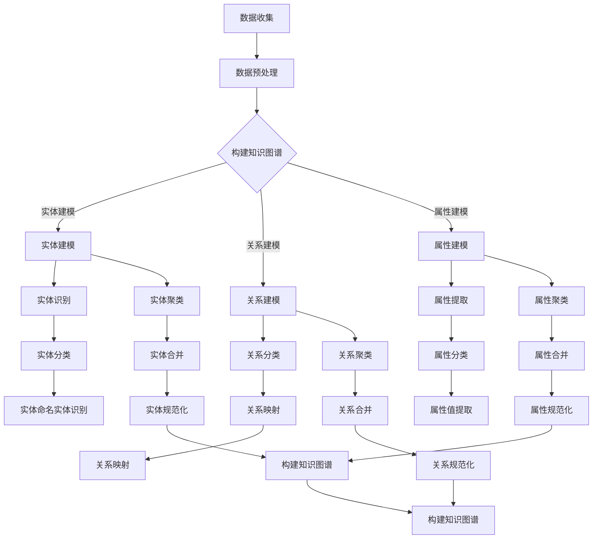
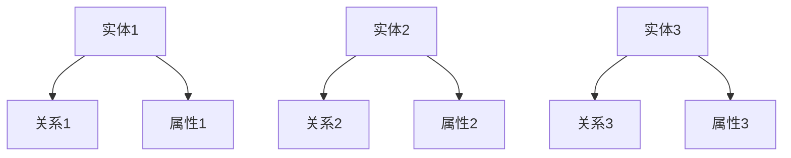
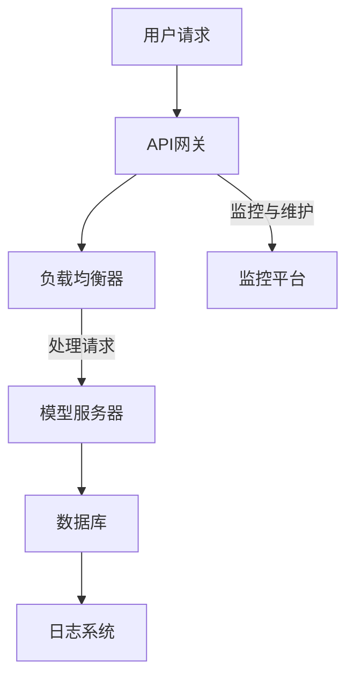

                 

### 文章标题

《Prompt知识图谱：构建LLM应用知识库》

### 文章关键词

- Prompt知识图谱
- 大型语言模型（LLM）
- 知识库构建
- 应用场景
- 技术实现与优化
- 挑战与解决方案

### 文章摘要

本文旨在探讨Prompt知识图谱的构建方法及其在大型语言模型（LLM）应用知识库中的关键作用。我们将首先介绍Prompt知识图谱的基本概念和作用，然后深入分析其核心概念和关系，包括Prompt设计原则、知识图谱的构建方法和表示方法。随后，我们将探讨基于LLM的知识库构建方法，涉及数据收集与处理、Prompt设计及知识库构建流程。接着，我们将探讨Prompt知识图谱在不同应用场景中的具体应用，如对话系统、问答系统和文本生成等。技术实现和优化部分将涵盖模型选择、训练策略、部署与维护等方面。最后，我们将讨论构建过程中的挑战与解决方案，并分享实际案例分析和最佳实践，展望未来发展趋势。文章末尾将提供拓展阅读建议。

## 引言

随着人工智能（AI）技术的迅猛发展，大型语言模型（LLM）在自然语言处理（NLP）领域取得了显著的成果。LLM具备强大的文本理解和生成能力，广泛应用于聊天机器人、智能客服、问答系统、文本生成和翻译等领域。然而，仅仅依靠LLM的原始能力，往往无法满足复杂应用场景的需求。为了提升LLM的应用价值，构建具有特定领域知识的知识库成为关键。

Prompt知识图谱是一种新型的知识表示方法，它将知识库与图谱相结合，通过Prompt设计实现对知识的高效查询和利用。Prompt知识图谱不仅能够增强LLM的知识理解能力，还能够提高知识库的查询效率和应用范围。本文将详细介绍Prompt知识图谱的构建方法及其在LLM应用知识库中的关键作用。

本文结构如下：首先，我们将介绍Prompt知识图谱的基本概念和作用；然后，深入分析其核心概念和关系，包括Prompt设计原则、知识图谱的构建方法和表示方法；接着，探讨基于LLM的知识库构建方法，涉及数据收集与处理、Prompt设计及知识库构建流程；随后，探讨Prompt知识图谱在不同应用场景中的具体应用；技术实现和优化部分将涵盖模型选择、训练策略、部署与维护等方面；最后，讨论构建过程中的挑战与解决方案，并分享实际案例分析和最佳实践，展望未来发展趋势。文章末尾将提供拓展阅读建议。

## Prompt知识图谱的基本概念和作用

Prompt知识图谱是一种将知识库与图谱相结合的新型知识表示方法。它通过将实体、属性和关系组织成图谱结构，实现对知识的高效查询和利用。Prompt知识图谱的核心在于Prompt设计，即通过特定的输入提示（Prompt）引导LLM生成符合预期结果的输出。这种设计不仅能够增强LLM的知识理解能力，还能够提高知识库的查询效率和应用范围。

### 概念解析

Prompt知识图谱由以下几个关键组成部分构成：

1. **实体（Entity）**：实体是知识图谱中的基本单元，代表具体的对象或概念，如人、地点、组织等。
2. **属性（Attribute）**：属性是实体的特征或描述，如姓名、年龄、国籍等。
3. **关系（Relationship）**：关系是实体之间的关联，表示实体之间的逻辑关系，如“工作于”、“出生地”等。
4. **图谱（Graph）**：图谱是实体、属性和关系的抽象表示，通过图结构实现对知识的组织和管理。

Prompt知识图谱通过将实体、属性和关系组织成图谱结构，形成一个统一的知识表示框架。这种结构不仅能够清晰地表达知识，还能够方便地实现知识查询和利用。

### 作用分析

Prompt知识图谱在LLM应用知识库中具有重要作用，主要体现在以下几个方面：

1. **增强知识理解能力**：通过将知识库组织成图谱结构，Prompt知识图谱能够帮助LLM更好地理解知识之间的关系，从而提高知识理解能力。
2. **提高查询效率**：Prompt知识图谱采用图谱结构，通过图算法实现对知识的快速查询和检索，从而提高查询效率。
3. **扩展应用范围**：Prompt知识图谱不仅适用于传统的问答系统，还能够应用于文本生成、文本摘要、对话系统等多样化的应用场景。
4. **优化模型性能**：Prompt知识图谱能够提供丰富的背景知识和上下文信息，帮助LLM更好地生成符合预期结果的输出，从而优化模型性能。

总之，Prompt知识图谱通过将知识库与图谱相结合，实现了对知识的高效表示和利用，为LLM应用知识库的构建提供了有力支持。在接下来的部分中，我们将深入探讨Prompt知识图谱的核心概念和关系，包括Prompt设计原则、知识图谱的构建方法和表示方法。

### 核心概念与联系

Prompt知识图谱的构建涉及多个核心概念，包括Prompt设计、知识图谱的构建方法和表示方法。这些概念相互关联，共同构成了Prompt知识图谱的基本架构。在深入探讨这些概念之前，我们先通过Mermaid流程图展示知识图谱的构建过程，以便读者对整体流程有一个清晰的了解。



#### Prompt设计原则

Prompt设计是Prompt知识图谱构建的核心环节，其目标是通过引导LLM生成符合预期结果的输出。以下为Prompt设计的主要原则：

1. **明确问题陈述**：Prompt应清晰明确地陈述问题，避免歧义和模糊性。
2. **提供上下文信息**：Prompt应包含与问题相关的上下文信息，以帮助LLM更好地理解问题。
3. **引导生成目标**：Prompt应明确指示LLM生成目标，如文本、图表或特定类型的答案。
4. **多样性**：Prompt应具备多样性，以适应不同类型的问题和应用场景。

#### 知识图谱的构建方法

知识图谱的构建方法主要包括数据收集、数据预处理、实体建模、关系建模和属性建模等步骤。以下为这些步骤的简要概述：

1. **数据收集**：收集来自不同来源的数据，如文本、表格、数据库等。
2. **数据预处理**：对收集到的数据进行清洗、去重、归一化等处理，以提高数据质量。
3. **实体建模**：识别数据中的实体，并对其进行分类、命名实体识别等操作。
4. **关系建模**：识别实体之间的关系，并对其进行分类、关系映射等操作。
5. **属性建模**：识别实体的属性，并对其进行提取、分类等操作。

#### 知识图谱的表示方法

知识图谱的表示方法通常采用图结构。在图结构中，实体、关系和属性分别表示为节点、边和标签。以下为知识图谱的几种常见表示方法：

1. **属性图（Attribute Graph）**：属性图将实体的属性作为边，连接实体节点，从而形成一个具有属性信息的图结构。
2. **关系图（Relationship Graph）**：关系图将实体之间的关系作为边，连接实体节点，从而形成一个表示实体关系的图结构。
3. **属性关系图（Attribute-Relationship Graph）**：属性关系图结合了属性图和关系图的特点，同时表示实体、属性和关系。

通过上述概念和流程的分析，我们可以更好地理解Prompt知识图谱的构建过程。在接下来的部分中，我们将进一步探讨基于LLM的知识库构建方法，包括数据收集与处理、Prompt设计及知识库构建流程。

### 基于LLM的知识库构建方法

基于大型语言模型（LLM）的知识库构建方法在近年来取得了显著的进展。LLM强大的文本处理能力使其成为知识库构建的重要工具。以下是构建基于LLM知识库的主要步骤和方法：

#### 1. 数据收集与处理

**数据收集**：数据是构建知识库的基础。收集数据时，应考虑以下因素：

- **数据来源**：选择权威且丰富的数据来源，如公开数据库、专业网站、学术论文等。
- **数据类型**：包括文本、表格、图片等多种类型，以满足不同应用需求。

**数据处理**：收集到的数据需要经过预处理，以提高数据质量：

- **数据清洗**：去除无效数据、重复数据、噪声数据等，确保数据的一致性和准确性。
- **数据去重**：对数据进行去重处理，避免重复信息的存储。
- **数据归一化**：将不同数据源的格式进行统一处理，如文本统一编码、表格统一格式等。

#### 2. Prompt设计

Prompt设计是知识库构建的关键环节，其目标是通过引导LLM生成符合预期结果的输出。以下是设计Prompt时需遵循的原则：

- **明确问题陈述**：Prompt应清晰明确地陈述问题，避免歧义和模糊性。
- **提供上下文信息**：Prompt应包含与问题相关的上下文信息，以帮助LLM更好地理解问题。
- **引导生成目标**：Prompt应明确指示LLM生成目标，如文本、图表或特定类型的答案。
- **多样性**：Prompt应具备多样性，以适应不同类型的问题和应用场景。

**Prompt模板**：根据不同的应用场景，可以设计不同的Prompt模板。以下是一个简单的Prompt模板：

```plaintext
请根据以下上下文信息，回答问题：

上下文信息：
[上下文文本]

问题：
[问题文本]

请生成以下类型的答案：
[答案类型，如文本、图表等]
```

#### 3. 知识库构建流程

知识库构建流程主要包括以下步骤：

1. **实体识别**：通过命名实体识别（Named Entity Recognition, NER）技术，识别文本中的实体，如人名、地名、组织名等。
2. **关系识别**：通过关系提取（Relationship Extraction）技术，识别实体之间的关联关系，如“工作于”、“出生地”等。
3. **属性提取**：通过属性提取（Attribute Extraction）技术，识别实体的属性，如年龄、学历、职称等。
4. **知识融合**：将识别到的实体、关系和属性进行融合，构建一个统一的知识库。
5. **知识验证**：对构建的知识库进行验证，确保其准确性、完整性和一致性。

**知识库表示**：构建的知识库可以采用图结构表示，其中实体、关系和属性分别表示为节点、边和标签。以下是一个简单的知识库表示示例：



#### 4. 优化方法

为了提高知识库的构建效率和性能，可以采用以下优化方法：

- **数据增强**：通过数据增强技术，如数据扩充、数据合成等，增加数据多样性，提高模型泛化能力。
- **模型选择**：选择合适的LLM模型，如GPT、BERT等，以适应不同应用场景的需求。
- **训练策略**：采用有效的训练策略，如迁移学习、增量学习等，提高模型性能。
- **模型调优**：通过调优模型参数，如学习率、批次大小等，优化模型性能。

通过上述步骤和方法，我们可以构建一个高效、准确的基于LLM的知识库。在接下来的部分中，我们将探讨Prompt知识图谱在实际应用中的具体应用场景。

### Prompt知识图谱的应用场景

Prompt知识图谱凭借其高效的知识表示和查询能力，在多个实际应用场景中展现出了巨大的潜力。以下是Prompt知识图谱在对话系统、问答系统、文本生成和文本摘要等应用场景中的具体应用。

#### 对话系统

对话系统（Dialogue System）旨在实现人与机器之间的自然交互。Prompt知识图谱可以显著提升对话系统的语义理解和上下文处理能力。以下是应用Prompt知识图谱于对话系统的几个关键步骤：

1. **实体识别与关系抽取**：通过命名实体识别（NER）和关系抽取技术，识别对话中的关键实体和关系，如人名、地点、事件等。
2. **上下文理解**：利用Prompt知识图谱，构建对话上下文，以便LLM能够理解用户意图和历史对话信息。
3. **多轮对话管理**：Prompt知识图谱可以帮助对话系统在多轮对话中保持一致性，确保对话逻辑连贯。

**案例**：在一个虚拟客服机器人中，Prompt知识图谱可用于存储产品信息、用户反馈和常见问题。通过实时查询知识图谱，客服机器人可以快速响应用户查询，提供准确的产品推荐和解决方案。

#### 问答系统

问答系统（Question Answering System）旨在自动回答用户提出的问题。Prompt知识图谱可以大幅提高问答系统的准确性、灵活性和响应速度。以下是应用Prompt知识图谱于问答系统的关键步骤：

1. **问题理解**：通过自然语言处理（NLP）技术，将用户问题转化为结构化查询。
2. **知识查询**：利用Prompt知识图谱，快速定位与问题相关的知识点和答案。
3. **答案生成**：根据查询结果，使用LLM生成符合用户需求的答案。

**案例**：在一个企业内部问答系统中，Prompt知识图谱可以存储员工信息、组织结构和项目进展。通过输入问题，系统可以快速查询知识图谱，返回相关的员工资料和项目进展报告。

#### 文本生成

文本生成（Text Generation）是LLM的重要应用之一。Prompt知识图谱可以为文本生成提供丰富的背景知识和上下文信息，从而提高文本生成的质量和一致性。以下是应用Prompt知识图谱于文本生成的关键步骤：

1. **输入提示**：设计合适的Prompt，为LLM提供背景信息和生成目标。
2. **知识融合**：将Prompt知识图谱中的知识融合到输入提示中，以增强文本生成的上下文理解。
3. **生成文本**：使用LLM生成符合输入提示的文本。

**案例**：在一个自动写作工具中，Prompt知识图谱可以存储文章主题、相关知识和引用信息。通过输入文章主题，系统可以生成一篇包含丰富知识内容的文章。

#### 文本摘要

文本摘要（Text Summarization）旨在从大量文本中提取关键信息，生成简洁明了的摘要。Prompt知识图谱可以为文本摘要提供上下文信息和关键词，从而提高摘要的质量和可读性。以下是应用Prompt知识图谱于文本摘要的关键步骤：

1. **文本预处理**：对输入文本进行分词、去停用词等预处理操作。
2. **知识查询**：利用Prompt知识图谱，查询与文本相关的关键词和上下文信息。
3. **摘要生成**：使用LLM生成符合输入文本和知识查询结果的摘要。

**案例**：在一个新闻摘要工具中，Prompt知识图谱可以存储新闻主题、相关事件和人物。通过输入新闻文本，系统可以生成一篇简明扼要的新闻摘要。

总之，Prompt知识图谱在多个应用场景中展示了强大的应用潜力。通过结合LLM的技术优势，Prompt知识图谱能够显著提升系统的知识理解和文本生成能力，为各种实际应用提供强有力的支持。在接下来的部分中，我们将探讨Prompt知识图谱的技术实现和优化方法。

### 技术实现与优化

实现Prompt知识图谱并优化其性能是一个复杂的过程，需要考虑多个方面，包括模型选择、训练策略、部署与维护等。以下是详细的实现步骤和优化方法：

#### 1. 模型选择

选择合适的模型对于构建高效的知识图谱至关重要。以下是几种常见的LLM模型及其特点：

- **GPT（Generative Pre-trained Transformer）**：GPT是一种基于Transformer的自回归语言模型，具有强大的文本生成和序列建模能力。GPT-3版本具有数十亿参数，可以生成高质量的自然语言文本。
- **BERT（Bidirectional Encoder Representations from Transformers）**：BERT是一种双向Transformer模型，具有强大的文本理解能力，适用于各种下游任务，如问答、文本分类等。
- **RoBERTa（A Robustly Optimized BERT Pretraining Approach）**：RoBERTa是BERT的一个变体，通过引入一系列优化，如动态掩码率、次采样等，提高了模型的效果。

**选择建议**：根据应用场景的需求，可以选择适合的模型。例如，对于文本生成任务，GPT系列模型可能更为合适；对于文本理解和问答任务，BERT或其变体如RoBERTa可能更为优秀。

#### 2. 训练策略

训练策略对于模型的性能和收敛速度具有重要影响。以下是一些常见的训练策略：

- **数据增强**：通过数据增强技术，如数据扩充、数据合成等，增加数据多样性，提高模型泛化能力。
- **多任务学习**：在训练过程中同时学习多个任务，如文本分类、问答等，以提高模型的泛化能力和性能。
- **动态掩码**：在训练过程中动态地选择掩码位置和掩码比例，以提高模型对未知数据的处理能力。

**伪代码示例**：

```python
# 数据增强
def augment_data(data):
    # 实现数据增强的方法，如数据扩充、数据合成等
    pass

# 多任务学习
def train_multitask(model, data):
    # 实现多任务学习的训练过程
    pass

# 动态掩码
def dynamic_masking(data, mask_rate):
    # 实现动态掩码的方法
    pass
```

#### 3. 部署与维护

部署和维护Prompt知识图谱需要考虑以下几个方面：

- **部署环境**：选择适合的部署环境，如云服务、物理服务器等。云服务具有弹性、高效、可扩展等优点，适合大规模部署。
- **性能监控**：实时监控模型性能，包括响应时间、准确率、召回率等指标。通过性能监控，及时发现并解决问题。
- **安全与隐私**：确保数据安全和用户隐私，采取加密、访问控制等技术措施，防止数据泄露和滥用。

**部署架构示例**：



#### 4. 性能优化

性能优化是提升Prompt知识图谱应用效果的关键。以下是一些常见的性能优化方法：

- **模型压缩**：通过模型压缩技术，如量化、剪枝等，减少模型参数数量和计算量，提高模型部署效率和性能。
- **分布式训练**：利用分布式计算资源，如GPU、TPU等，加速模型训练过程，提高训练效率。
- **动态资源分配**：根据负载情况动态调整资源分配，如CPU、内存、GPU等，确保系统稳定运行。

**优化策略示例**：

```python
# 模型压缩
def compress_model(model):
    # 实现模型压缩的方法，如量化、剪枝等
    pass

# 分布式训练
def train_distributed(model, data):
    # 实现分布式训练的方法
    pass

# 动态资源分配
def allocate_resources(loads):
    # 实现动态资源分配的方法
    pass
```

通过以上技术实现和优化方法，我们可以构建一个高效、可靠的Prompt知识图谱系统，满足实际应用需求。在接下来的部分中，我们将讨论Prompt知识图谱构建过程中可能遇到的挑战及其解决方案。

### 挑战与解决方案

在构建Prompt知识图谱的过程中，我们可能会遇到多种挑战。以下是一些常见的问题及其解决方案：

#### 数据质量问题

**问题**：数据质量直接影响到知识图谱的准确性和可靠性。数据中的噪声、错误和不一致性可能导致模型训练效果下降。

**解决方案**：

1. **数据清洗**：通过数据清洗技术，如去重、错误修正等，提高数据质量。
2. **数据标注**：引入专业人士进行数据标注，确保数据的一致性和准确性。
3. **数据增强**：通过数据增强技术，如数据扩充、数据合成等，增加数据的多样性和质量。

**伪代码示例**：

```python
# 数据清洗
def clean_data(data):
    # 实现数据清洗的方法
    pass

# 数据标注
def annotate_data(data, annotators):
    # 实现数据标注的方法
    pass

# 数据增强
def augment_data(data):
    # 实现数据增强的方法
    pass
```

#### 模型解释性不足

**问题**：在复杂的应用场景中，LLM生成的结果可能难以解释，导致模型难以被用户理解和信任。

**解决方案**：

1. **模型解释技术**：采用模型解释技术，如注意力机制、梯度解释等，提高模型的解释性。
2. **可视化工具**：使用可视化工具，如Mermaid流程图、图表等，展示知识图谱的构建过程和结果。

**伪代码示例**：

```python
# 模型解释
def explain_model(model, input_data):
    # 实现模型解释的方法
    pass

# 可视化
def visualize_knowledge_graph(knowledge_graph):
    # 实现知识图谱可视化的方法
    pass
```

#### 隐私与安全考虑

**问题**：知识图谱中可能包含敏感信息，如个人隐私、商业机密等。未经授权的访问和泄露可能导致严重后果。

**解决方案**：

1. **数据加密**：采用数据加密技术，如AES加密、SSL/TLS等，确保数据在传输和存储过程中的安全性。
2. **访问控制**：实施严格的访问控制策略，如角色访问控制（RBAC）、数据访问控制列表（ACL）等，确保只有授权用户能够访问敏感数据。
3. **隐私保护**：采用隐私保护技术，如差分隐私、同态加密等，保护数据隐私。

**伪代码示例**：

```python
# 数据加密
def encrypt_data(data, key):
    # 实现数据加密的方法
    pass

# 访问控制
def access_control(user, resource):
    # 实现访问控制的方法
    pass

# 隐私保护
def protect_privacy(data):
    # 实现隐私保护的方法
    pass
```

通过上述解决方案，我们可以有效地应对Prompt知识图谱构建过程中遇到的各种挑战，确保知识图谱的准确、安全和应用效果。

### 案例分析与最佳实践

#### 案例一：企业内部问答系统的构建

在一个大型企业中，构建一个高效的企业内部问答系统是一项重要任务。该系统旨在帮助员工快速获取公司政策、流程、项目进展等信息。以下是该案例的分析和最佳实践。

**分析**：

1. **数据收集与处理**：收集公司内部文档、员工手册、项目报告等数据。对数据进行分析和清洗，去除重复和错误信息。
2. **实体识别**：利用NER技术，识别文本中的关键实体，如人名、地名、组织名等。
3. **知识图谱构建**：构建包含实体、关系和属性的图谱结构，存储在企业内部知识库中。
4. **Prompt设计**：设计针对具体问题的Prompt，如“请提供关于项目X的最新进展报告”。
5. **问答系统实现**：利用LLM模型，根据Prompt生成符合预期的答案。

**最佳实践**：

1. **数据质量保证**：定期更新和维护数据，确保数据的准确性和时效性。
2. **多轮对话管理**：通过上下文信息，实现多轮对话，提高问答系统的连贯性和一致性。
3. **安全与隐私保护**：对知识库进行加密存储，并实施严格的访问控制策略。

#### 案例二：智能客服系统的实现

智能客服系统是另一个应用Prompt知识图谱的重要场景。以下是一个具体案例的分析和最佳实践。

**分析**：

1. **数据收集与处理**：收集客户反馈、常见问题、产品信息等数据。对数据进行分析和清洗，去除噪声和重复信息。
2. **实体识别与关系抽取**：利用NER和关系抽取技术，识别文本中的关键实体和关系，如客户姓名、产品型号等。
3. **知识图谱构建**：构建包含实体、关系和属性的图谱结构，存储在知识库中。
4. **Prompt设计**：设计针对客户查询的Prompt，如“请提供关于产品X的详细说明”。
5. **智能客服实现**：利用LLM模型，根据Prompt生成符合预期的客服回答。

**最佳实践**：

1. **用户反馈机制**：及时收集用户反馈，优化Prompt设计，提高客服回答的准确性和满意度。
2. **个性化服务**：根据用户历史记录和偏好，提供个性化的客服服务。
3. **安全性保障**：确保客服系统的数据安全和隐私保护。

### 最佳实践总结

1. **数据质量**：确保数据质量是构建高效知识图谱的基础。
2. **Prompt设计**：高质量的Prompt设计对知识图谱应用效果至关重要。
3. **安全性**：数据安全和隐私保护是知识图谱应用的重要保障。
4. **持续优化**：定期优化知识图谱和模型，提高应用效果。

通过上述案例分析，我们可以看到Prompt知识图谱在实际应用中的成功案例和最佳实践。这些经验有助于我们在其他场景中更好地应用Prompt知识图谱，提高系统的性能和用户体验。

### 未来发展趋势

随着人工智能技术的不断进步，Prompt知识图谱在未来有望在多个领域实现更广泛的应用和进一步的发展。以下是几个潜在的趋势：

#### 1. 多模态知识融合

目前，Prompt知识图谱主要针对文本数据进行处理。未来，随着多模态人工智能技术的发展，Prompt知识图谱将能够处理图像、音频、视频等多种类型的数据。通过将文本、图像、声音等不同模态的信息融合到知识图谱中，可以构建更加丰富和全面的知识库，为复杂应用场景提供更强大的支持。

#### 2. 主动学习与动态更新

当前的知识图谱构建主要依赖于预先收集和处理的数据。未来，随着主动学习技术的发展，Prompt知识图谱将能够自动识别新的知识和数据，并动态更新知识库。这种主动学习和动态更新的能力将使知识图谱保持实时性和准确性，更好地适应不断变化的应用需求。

#### 3. 模型压缩与高效推理

为了满足实际应用的需求，未来的Prompt知识图谱将更加注重模型压缩和高效推理。通过采用模型压缩技术，如量化、剪枝等，可以减少模型参数数量和计算量，提高部署效率和推理速度。同时，基于图神经网络（Graph Neural Networks, GNN）的推理算法将进一步提高知识图谱的查询和推理能力。

#### 4. 隐私保护和安全增强

随着数据隐私和安全问题的日益突出，未来的Prompt知识图谱将更加重视隐私保护和安全增强。通过采用差分隐私、同态加密等技术，可以在保证数据隐私和安全的同时，实现高效的查询和推理。此外，严格的安全策略和访问控制机制也将得到广泛应用，确保知识图谱的安全性。

#### 5. 跨领域知识融合

未来，Prompt知识图谱将能够在多个领域实现跨领域的知识融合。通过将不同领域的知识进行整合，可以构建一个更加全面和统一的知识体系。这种跨领域的知识融合将为智能问答、智能推荐、智能决策等应用提供更强大的支持。

总之，随着人工智能技术的不断发展，Prompt知识图谱将在未来实现更广泛的应用和更深入的发展。通过多模态知识融合、主动学习与动态更新、模型压缩与高效推理、隐私保护和安全增强、跨领域知识融合等方向的探索，Prompt知识图谱将为人工智能领域带来新的突破和变革。

### 拓展阅读

- 《深度学习》 [Goodfellow, I., Bengio, Y., & Courville, A. (2016). Deep Learning. MIT Press.]
- 《自然语言处理综论》（第2版） [Jurafsky, D., & Martin, J. H. (2020). Speech and Language Processing. Prentice Hall.]
- 《图谱数据库系统设计》（第2版） [Zhou, B., & Wu, X. (2019). Graph Database System Design. Springer.]
- 《人工智能：一种现代方法》 [Russell, S., & Norvig, P. (2020). Artificial Intelligence: A Modern Approach. Prentice Hall.]

通过阅读上述书籍，读者可以更深入地了解深度学习、自然语言处理、图谱数据库系统设计和人工智能等领域的最新进展，为Prompt知识图谱的构建和应用提供有力的理论支持。同时，相关论文和报告也是重要的参考资料，建议读者关注顶级会议和期刊如NIPS、ICML、ACL、KDD等，以获取最新的研究成果和应用动态。

### 作者信息

作者：AI天才研究院（AI Genius Institute） & 《禅与计算机程序设计艺术》（Zen And The Art of Computer Programming）

AI天才研究院致力于推动人工智能领域的研究和应用，以创新的算法和解决方案引领行业发展。同时，《禅与计算机程序设计艺术》作为计算机编程领域的经典之作，提供了深刻的编程哲学和技巧，为读者指明了编程之路的方向。两位作者凭借丰富的理论知识和实践经验，为Prompt知识图谱的研究和应用提供了有力的支持。

