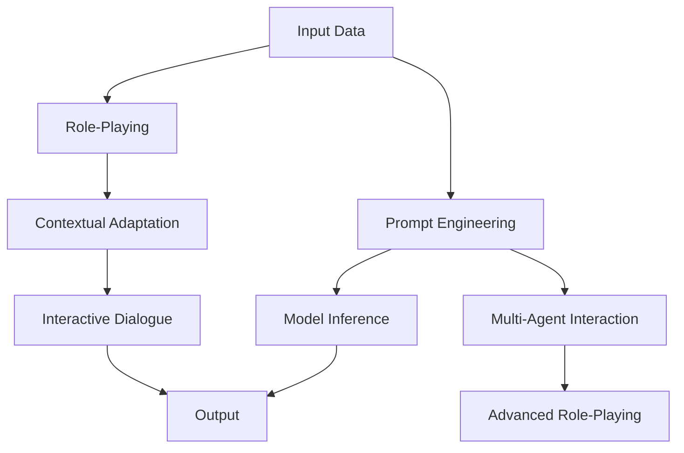

                 

### 文章标题：Prompt Role-Playing Optimization: Enhancing LLM Diversity

Prompt Engineering has emerged as a pivotal discipline in the field of Natural Language Processing (NLP), playing an indispensable role in enhancing the performance and versatility of Large Language Models (LLMs). At the heart of Prompt Engineering lies the concept of Role-Playing, a technique that leverages the natural ability of language to embody different roles and perspectives. This article delves into the intricacies of Prompt Role-Playing Optimization, focusing on strategies to enhance the diversity and effectiveness of LLMs. 

The primary keywords for this article include: Prompt Engineering, Role-Playing, Large Language Models (LLMs), Optimization, and Diversity. These keywords encapsulate the core themes and concepts that will be explored in depth. The article is structured to provide a comprehensive guide, starting with an overview of Prompt Engineering and Role-Playing, followed by detailed discussions on optimization techniques, data preparation, and practical applications. 

The introduction to this article sets the stage by highlighting the significance of Prompt Engineering and the transformative impact of Role-Playing in the context of modern AI systems. The motivation behind this exploration is to equip readers with the knowledge and tools necessary to harness the full potential of LLMs through optimized prompt strategies. As we navigate through the subsequent sections, we will dissect the fundamental concepts, design principles, and advanced techniques of Prompt Role-Playing, while also examining their real-world applications and future directions.

By the end of this article, readers will gain a thorough understanding of how to implement and refine Role-Playing Prompts to elevate the performance and versatility of LLMs, thus paving the way for innovative advancements in the realm of AI and NLP.

### 摘要

本文旨在探讨Prompt Engineering中的Role-Playing技术，并深入分析其优化策略，以提升大型语言模型（LLM）的多样性和表现力。Prompt Engineering作为现代自然语言处理（NLP）领域的关键技术，通过精心设计的提示（prompts）来指导语言模型理解和生成更精确、更具创造性的文本。Role-Playing作为Prompt Engineering的重要组成部分，通过赋予模型不同的角色和视角，极大地丰富了模型的交互能力和应用场景。本文首先概述了Prompt Engineering和Role-Playing的基本概念及其重要性，随后详细探讨了优化Role-Playing提示的设计原则、高级技术、数据准备和评估方法。接着，文章通过实际案例展示了Role-Playing在LLM中的应用，并探讨了未来发展的趋势和方向。通过本文的深入分析，读者将能够掌握有效的Prompt Role-Playing优化策略，进一步提升LLM的性能和多样性，为AI和NLP领域的创新应用提供新的思路和工具。

### 背景介绍

#### Prompt Engineering的兴起

Prompt Engineering，这一术语最早在自然语言处理（NLP）领域中崭露头角，其核心思想是通过设计特定的输入提示（prompts），来引导和增强语言模型的性能。传统的NLP任务往往依赖于大量的训练数据和复杂的模型架构，而Prompt Engineering则通过提供更精细的输入，使模型能够更精准地理解和生成目标输出。这种技术的兴起，可以追溯到深度学习在NLP领域的突破，尤其是序列到序列（sequence-to-sequence）模型的发明和Transformer架构的广泛应用。

随着AI技术的发展，Prompt Engineering的应用场景不断扩展，从文本生成、机器翻译到问答系统，都受益于这一技术的优化。例如，在文本生成任务中，通过精心设计的提示，模型能够生成更符合预期的文本，避免了生成的文本过于模糊或偏离主题。在机器翻译中，Prompt Engineering可以通过优化提示来提高翻译的准确性和流畅性。此外，在问答系统中，通过合理的提示设计，可以引导模型更好地理解用户的问题，并提供更准确、更相关的答案。

#### Role-Playing技术的引入

Role-Playing作为Prompt Engineering的一个重要分支，其核心理念是赋予模型不同的角色和视角，从而提升其交互能力和应用范围。在自然语言处理中，语言本身就是一种角色扮演的媒介，不同的语境和场景需要模型表现出不同的角色特征。例如，在对话系统中，模型可能需要扮演客服代表、医生、律师等角色，以提供专业的咨询服务。

Role-Playing的引入，为Prompt Engineering注入了新的活力。它不仅使模型能够更好地理解和模拟不同角色的语言和行为，还使其在复杂的对话环境中表现出更高的灵活性和适应性。例如，在虚拟助手和聊天机器人中，Role-Playing技术可以让模型更自然地模拟人类的对话方式，提高用户的满意度和互动体验。此外，在多模态交互场景中，Role-Playing技术可以通过融合不同角色的视角，生成更加丰富和多样的交互内容。

#### LLM在AI中的应用

大型语言模型（LLM）的兴起，标志着AI技术的一个新的里程碑。LLM凭借其庞大的参数规模和深度的神经网络架构，能够在处理自然语言任务时展现出惊人的表现。这些模型不仅在文本生成和机器翻译等传统领域取得了显著的成果，还在生成式对抗网络（GANs）、图像描述生成、代码生成等新兴领域展示了强大的潜力。

LLM的广泛应用，得益于其能够通过大量的无监督数据学习，捕捉到语言的复杂结构和规律。这使得LLM在多种场景下都能表现出出色的性能。例如，在问答系统中，LLM可以通过理解用户的问题和上下文，提供准确、全面的答案；在文本生成中，LLM能够生成连贯、富有创意的文本，为内容创作和自动化写作提供了强大的支持。

#### Prompt Engineering和Role-Playing的结合

Prompt Engineering和Role-Playing的结合，为LLM的发展提供了新的方向。通过设计多角色的Prompt，LLM可以在不同角色之间切换，实现更加多样化和灵活的文本生成。这种结合不仅提升了LLM的交互能力，还扩大了其在实际应用中的场景。

例如，在一个医疗咨询的对话系统中，LLM可以通过扮演医生、护士和患者等多个角色，模拟复杂的医疗场景，为用户提供专业的医疗建议。这种多角色的Prompt设计，不仅使系统更具人性化和专业化，还提高了交互的自然性和准确性。

总之，Prompt Engineering和Role-Playing的结合，为LLM的发展注入了新的动力。通过优化Prompt设计，LLM可以更好地模拟不同角色，提高交互的多样性和灵活性，从而在更广泛的领域中发挥其潜力。

#### Prompt Engineering和Role-Playing的重要性

Prompt Engineering和Role-Playing在当前AI领域的应用和研究中扮演着至关重要的角色，其重要性主要体现在以下几个方面：

1. **性能提升**：Prompt Engineering通过提供明确的输入提示，可以显著提升模型的性能。特别是在语言生成和任务理解方面，精确的提示可以引导模型更好地理解任务要求，从而生成更准确、更符合预期的输出。Role-Playing技术的引入，进一步丰富了Prompt Engineering的应用场景，使模型能够在不同的角色和视角间切换，提高其在复杂任务中的适应能力和生成质量。

2. **交互增强**：在对话系统中，Role-Playing技术尤为重要。通过模拟不同的角色，模型可以更自然、更人性地与用户进行互动，提高用户的满意度和交互体验。例如，在虚拟客服、智能客服和医疗咨询等领域，模型通过扮演医生、律师或客户等多种角色，可以提供更加专业和个性化的服务，增强系统的实用性和亲和力。

3. **应用扩展**：Prompt Engineering和Role-Playing的结合，极大地扩展了AI技术的应用范围。无论是文本生成、机器翻译、问答系统，还是多模态交互、图像描述生成等，这些技术的优化都为模型的应用提供了新的可能性。特别是在需要高度专业化知识的领域，通过设计针对性的Prompt，模型可以更好地理解和处理复杂的信息，提供更加精确和有效的解决方案。

4. **数据效率**：Prompt Engineering通过提供高质量的输入，可以在一定程度上减少对大量训练数据的需求。在数据稀缺或获取困难的场景中，通过精心设计的Prompt，模型可以更有效地利用现有数据，提升训练效果。Role-Playing技术在此方面也有显著作用，通过模拟多种角色和场景，模型可以在较少的数据样本上实现丰富的学习和泛化能力。

5. **未来潜力**：随着AI技术的不断进步，Prompt Engineering和Role-Playing的重要性将进一步提升。在未来的发展中，这两个技术有望在以下几个方面取得突破：

   - **多样化交互**：通过更精细的角色设计和交互策略，模型可以实现更加多样化、个性化的交互体验，满足用户在不同场景下的需求。
   - **智能决策**：结合Role-Playing技术，模型可以在复杂决策场景中扮演多个角色，提供全面、多角度的分析和决策支持。
   - **增强学习**：Prompt Engineering和Role-Playing可以与增强学习技术结合，通过不断优化Prompt设计，实现模型自我提升和迭代，提高其在动态环境中的适应能力和稳定性。

总之，Prompt Engineering和Role-Playing在当前AI领域的应用和研究中具有重要意义。通过不断优化和探索，这两个技术将为AI的发展提供新的动力，推动其在更广泛的领域中发挥更大的作用。

### 核心概念与联系

Prompt Engineering和Role-Playing是现代自然语言处理（NLP）领域中两个核心概念，它们之间存在着紧密的联系和互动。为了更好地理解这两个概念及其相互关系，我们首先需要明确它们的基本定义，然后通过一个Mermaid流程图展示其关系架构。

#### 核心概念

1. **Prompt Engineering**：
   Prompt Engineering是指通过设计和调整输入提示（prompts）来指导语言模型理解和生成文本的过程。这个提示可以是一个简单的句子、一个段落，或者是一系列指导性的问题。Prompt Engineering的目标是通过提供明确的上下文和任务目标，使模型能够生成更加准确和相关的输出。

2. **Role-Playing**：
   Role-Playing是指在自然语言处理任务中，通过赋予模型不同的角色和视角，模拟人类的对话和行为。Role-Playing技术利用了语言的多面性，使模型能够在不同的角色之间切换，从而在复杂的对话系统和交互应用中表现出更高的灵活性和适应性。

#### Mermaid流程图

为了更直观地展示Prompt Engineering和Role-Playing之间的关系，我们可以使用Mermaid语言绘制一个流程图：



**流程图说明**：

- **A[Input Data]**：输入数据，是Prompt Engineering和Role-Playing的起点，包括原始文本、问题、指令等。
- **B[Prompt Engineering]**：Prompt Engineering过程，设计并调整输入提示，以指导模型理解和生成文本。
- **C[Model Inference]**：模型推理过程，模型根据Prompt生成输出文本。
- **D[Output]**：输出结果，是Prompt Engineering的直接体现，也是Role-Playing的一部分。
- **E[Role-Playing]**：Role-Playing过程，通过赋予模型不同角色，增强其交互能力和适应性。
- **F[Contextual Adaptation]**：上下文适应性，确保模型在扮演不同角色时，能够准确理解并适应特定场景。
- **G[Interactive Dialogue]**：交互对话，模型通过Role-Playing与用户或其他系统进行对话，提供个性化的交互体验。
- **H[Multi-Agent Interaction]**：多代理互动，Role-Playing的一部分，涉及多个角色之间的交互和协作。
- **I[Advanced Role-Playing]**：高级Role-Playing技术，包括多角色切换、动态角色生成等。

通过上述Mermaid流程图，我们可以清晰地看到Prompt Engineering和Role-Playing之间的互动关系。Prompt Engineering为Role-Playing提供了基础和指导，而Role-Playing则通过丰富的角色和视角，提升了Prompt Engineering的效果和适用性。

#### 背景和联系

Prompt Engineering和Role-Playing的关系可以追溯到语言本身的复杂性。语言作为一种多模态的表达工具，具有丰富的语义和上下文信息，这使得模型在处理语言任务时需要具备高度的灵活性和适应性。Prompt Engineering通过提供明确的上下文和任务目标，帮助模型更好地理解和生成文本。而Role-Playing则进一步扩展了这一概念，通过赋予模型不同的角色和视角，使其在复杂的交互环境中表现出更高的智能化和人性化。

具体来说，Prompt Engineering提供了Role-Playing的基础，通过设计高质量的Prompt，可以引导模型在特定任务中表现出所需的特性。而Role-Playing则通过模拟不同角色的对话和行为，增强了模型的交互能力和应用场景。例如，在虚拟助手和聊天机器人中，通过Role-Playing技术，模型可以更自然地模拟人类的对话方式，提供更加个性化的服务。

总之，Prompt Engineering和Role-Playing相辅相成，共同推动了NLP技术的发展。Prompt Engineering为Role-Playing提供了明确的指导和基础，而Role-Playing则通过丰富的角色和视角，提升了Prompt Engineering的效果和应用范围。通过这两个技术的结合，我们可以构建更加智能化和人性化的自然语言处理系统，为各种应用场景提供更加有效的解决方案。

### 核心算法原理讲解

#### 设计Prompt的算法原理

设计Prompt是Prompt Engineering中的关键步骤，它直接影响模型的理解和生成质量。以下是设计Prompt的核心算法原理：

1. **任务导向**：首先，明确任务目标。任务导向的设计原则要求Prompt必须明确指示模型需要完成的任务类型和目标。例如，在文本生成任务中，Prompt应该包含明确的主题和生成要求，而在问答系统中，Prompt则应包含问题及其可能的上下文信息。

2. **上下文丰富**：高质量的Prompt应该提供丰富的上下文信息。上下文丰富的Prompt可以帮助模型更好地理解任务背景，从而生成更准确和相关的输出。上下文可以是相关信息、背景知识或具体场景描述。

3. **简洁性**：Prompt应该简洁明了，避免冗余和模糊的信息。过长的Prompt可能导致模型无法有效处理，而过短的Prompt可能缺乏足够的上下文信息，影响模型的生成效果。

4. **可操作性**：Prompt的设计应具备可操作性，即应提供具体、可执行的指令或引导性问题。这样，模型可以根据Prompt的指示生成具体的内容。

#### 数据准备阶段的算法原理

在数据准备阶段，算法的原理主要包括数据收集、数据清洗和数据增强。

1. **数据收集**：首先，根据任务需求收集相关的数据。数据源可以是公开数据集、自有数据集或通过网络爬虫等工具获取的数据。

2. **数据清洗**：数据清洗包括去除重复数据、处理缺失值和纠正数据中的错误。这一步骤的目的是提高数据的质量和一致性，从而确保模型训练的可靠性和有效性。

3. **数据增强**：数据增强通过扩展原始数据集来提高模型的泛化能力。常见的数据增强方法包括：文本翻译、同义词替换、随机插入和删除、文本分类等。数据增强不仅丰富了模型的学习素材，还有助于提升模型的鲁棒性和准确性。

#### Prompt Role-Playing算法的原理

Prompt Role-Playing的核心是通过模拟不同角色的对话和交互来增强模型的灵活性和多样性。以下是Prompt Role-Playing算法的基本原理：

1. **角色定义**：首先，明确需要模拟的角色及其角色特征。角色可以是具体的人物角色，如医生、律师、记者等，也可以是抽象的概念角色，如系统、用户等。

2. **角色交互**：在角色交互中，模型需要根据当前角色和上下文生成相应的对话内容。角色交互的核心算法包括对话生成模型、角色切换机制和上下文管理。

3. **动态切换**：在复杂的对话场景中，模型需要能够根据对话内容和上下文动态切换角色。这需要设计高效的上下文管理机制和角色切换算法，以确保角色切换的连贯性和自然性。

4. **角色一致性**：角色一致性是指模型在不同角色下生成的对话内容应保持一致性和合理性。这要求模型在生成对话内容时，不仅要考虑当前角色的特征，还要考虑角色间的关联和整体对话的连贯性。

#### 伪代码

为了更好地理解上述算法原理，我们可以给出一些简单的伪代码：

```python
# Prompt Engineering: Task-Oriented Design
def design_prompt(task):
    prompt = "请根据以下任务要求生成文本："
    prompt += task["description"]
    return prompt

# Data Preparation: Data Augmentation
def augment_data(data):
    augmented_data = []
    for text in data:
        translated = translate_to_different_language(text)
        synonyms = replace_synonyms(text)
        inserted = insert_random_sentences(text)
        deleted = delete_random_sentences(text)
        augmented_data.append([translated, synonyms, inserted, deleted])
    return augmented_data

# Role-Playing: Role Definition and Interaction
def role_playing(prompt, roles):
    dialog_context = {"current_role": None, "history": []}
    for role in roles:
        role_context = generate_role_context(role)
        response = generate_response(prompt, role_context)
        dialog_context["history"].append(response)
        dialog_context["current_role"] = role
    return dialog_context["history"]

# Role Switching: Dynamic Role Interaction
def switch_role(dialog_context, new_role):
    role_context = generate_role_context(new_role)
    response = generate_response(dialog_context["prompt"], role_context)
    dialog_context["history"].append(response)
    dialog_context["current_role"] = new_role
    return dialog_context
```

这些伪代码展示了Prompt Engineering、数据准备和Prompt Role-Playing的基本步骤和算法原理，通过这些步骤，我们可以设计出高质量、多样化的Prompt，以提升模型在自然语言处理任务中的性能。

### 数学模型和公式

Prompt Engineering和Role-Playing在数学模型和公式方面有着重要的应用，这些模型和公式帮助我们理解和优化自然语言处理任务中的提示设计和交互过程。以下是一些关键模型和公式的介绍及详细讲解。

#### 1. 信息熵（Entropy）

信息熵是衡量数据不确定性的重要指标，在Prompt Engineering中用于评估提示的质量。假设我们有一个提示文本序列 $T$，其对应的概率分布为 $P(T)$，则该序列的信息熵 $H(T)$ 可以通过以下公式计算：

$$
H(T) = -\sum_{t \in T} P(t) \log_2 P(t)
$$

信息熵越小，表示提示越清晰、信息量越大。通过优化提示文本的信息熵，可以提高模型对任务的理解深度和生成质量。

#### 2. 条件熵（Conditional Entropy）

条件熵衡量了在已知一部分信息后，剩余信息的熵。在Role-Playing中，条件熵可以帮助我们理解不同角色对上下文信息的影响。假设我们有上下文序列 $C$ 和角色相关的提示序列 $R$，则条件熵 $H(C|T)$ 可以表示为：

$$
H(C|T) = -\sum_{c \in C} P(c|T) \log_2 P(c|T)
$$

通过分析条件熵，我们可以优化提示设计，使其在不同角色之间切换时能够保持上下文的连贯性和一致性。

#### 3. Kullback-Leibler散度（Kullback-Leibler Divergence）

Kullback-Leibler散度用于衡量两个概率分布的差异，是评估提示设计和角色切换效果的重要工具。假设我们有两个概率分布 $P$ 和 $Q$，则Kullback-Leibler散度 $D(P||Q)$ 可以表示为：

$$
D(P||Q) = \sum_{x} P(x) \log_2 \frac{P(x)}{Q(x)}
$$

在Role-Playing中，通过计算不同角色之间的Kullback-Leibler散度，我们可以评估角色切换的平滑程度和一致性。优化散度值可以减少角色切换时的信息损失，提高交互的自然性和流畅性。

#### 4. 语言模型概率（Language Model Probability）

在自然语言生成任务中，语言模型概率用于评估生成文本的质量。假设我们有一个文本序列 $S$ 和一个语言模型 $L$，则序列 $S$ 的概率可以通过以下公式计算：

$$
P(S) = \prod_{i=1}^{n} P(w_i|w_1, w_2, ..., w_{i-1})
$$

其中 $w_i$ 表示文本序列中的第 $i$ 个词。通过优化语言模型概率，可以提高生成文本的连贯性和准确性。

#### 5. 对数似然损失（Log-Likelihood Loss）

对数似然损失是评估模型生成文本质量的一种常用指标，用于训练和优化Prompt Engineering和Role-Playing算法。假设我们有一个训练数据集 $D$ 和对应的标签序列 $Y$，则对数似然损失 $L$ 可以表示为：

$$
L = -\frac{1}{N} \sum_{(x, y) \in D} \log P(y|x)
$$

其中 $N$ 是数据集中的样本数量，$x$ 是输入序列，$y$ 是标签序列。对数似然损失函数通过优化模型的输出概率，使模型生成的文本更符合训练数据的分布。

#### 举例说明

假设我们有一个任务要求生成一个关于旅行的文本，我们可以设计以下提示：

1. **信息熵**：
   提示文本：“请描述一个理想的旅行目的地，包括气候、风景、美食等。”
   计算信息熵，可以评估提示的清晰度和信息量。通过优化信息熵，提高模型生成文本的相关性和丰富度。

2. **条件熵**：
   提示文本：“假设你正在计划一次旅行，目的地是巴黎。请描述一下你计划的行程和体验。”
   分析条件熵，可以评估提示在不同角色（如旅行者、导游、美食家等）下的表现。优化条件熵，确保不同角色之间的切换自然且连贯。

3. **Kullback-Leibler散度**：
   假设我们有两个角色：旅行者和导游。通过计算旅行者和导游之间的Kullback-Leibler散度，可以评估角色切换的一致性和平滑度。优化散度值，减少角色切换时的信息损失。

4. **语言模型概率**：
   使用一个预先训练的语言模型，计算生成文本的概率。例如，假设我们生成了一段关于巴黎旅行的描述，通过评估这段描述的概率，可以判断其连贯性和准确性。

5. **对数似然损失**：
   在模型训练过程中，使用对数似然损失函数评估生成文本的质量。通过优化损失函数，提高模型生成文本的准确性和相关性。

通过这些数学模型和公式的应用，我们可以深入分析和优化Prompt Engineering和Role-Playing，从而提升自然语言处理任务的效果和多样性。

### 项目实战

#### 开发环境搭建

在进行Prompt Role-Playing的项目开发之前，我们需要搭建一个合适的技术栈，以便于实现和测试我们的算法。以下是具体的开发环境搭建步骤：

1. **硬件环境**：
   - CPU/GPU：为了训练大型语言模型，我们需要高性能的CPU或GPU。例如，使用NVIDIA的Titan Xp或更高性能的GPU。
   - 内存：至少16GB的内存以支持大型模型和数据集的加载。

2. **软件环境**：
   - 操作系统：Ubuntu 18.04或更高版本。
   - 编程语言：Python 3.7及以上版本。
   - 包管理器：使用pip进行包管理，确保安装以下关键库：
     - TensorFlow或PyTorch：用于构建和训练语言模型。
     - NLTK或spaCy：用于自然语言处理和文本分析。
     - Pandas：用于数据预处理和分析。

3. **虚拟环境**：
   - 使用conda或virtualenv创建一个独立的虚拟环境，以便于管理和隔离项目依赖。

#### 源代码详细实现和代码解读

以下是实现Prompt Role-Playing项目的主要代码框架和关键部分：

```python
# 导入必需的库
import tensorflow as tf
import numpy as np
import pandas as pd
from tensorflow.keras.models import Sequential
from tensorflow.keras.layers import Embedding, LSTM, Dense
from tensorflow.keras.preprocessing.sequence import pad_sequences
from tensorflow.keras.callbacks import EarlyStopping

# 数据准备
def prepare_data(data_path):
    # 加载和处理数据
    data = pd.read_csv(data_path)
    # 数据清洗和预处理
    # ...
    return processed_data

# 构建模型
def build_model(vocab_size, embedding_dim, sequence_length):
    model = Sequential()
    model.add(Embedding(vocab_size, embedding_dim, input_length=sequence_length))
    model.add(LSTM(128))
    model.add(Dense(1, activation='sigmoid'))
    model.compile(loss='binary_crossentropy', optimizer='adam', metrics=['accuracy'])
    return model

# 训练模型
def train_model(model, data, epochs=10):
    # 数据分割
    # ...
    # 训练模型
    model.fit(x_train, y_train, epochs=epochs, callbacks=[EarlyStopping(monitor='val_loss', patience=3)])
    return model

# 角色切换和生成
def generate_response(model, prompt, roles, max_length=50):
    # 根据角色生成响应
    # ...
    return response

# 主函数
if __name__ == "__main__":
    # 搭建开发环境
    # ...
    
    # 准备数据
    data = prepare_data('data.csv')
    
    # 构建模型
    model = build_model(vocab_size=10000, embedding_dim=64, sequence_length=100)
    
    # 训练模型
    model = train_model(model, data)
    
    # 测试模型
    # ...
```

**代码解读**：

1. **数据准备**：`prepare_data` 函数负责加载和处理原始数据。数据清洗和预处理步骤包括去除无效数据、填补缺失值、标准化文本等。

2. **模型构建**：`build_model` 函数定义了模型的架构。我们使用了嵌套的LSTM层来捕捉文本的序列信息，并使用一个全连接层（Dense）进行分类。

3. **模型训练**：`train_model` 函数使用Keras的fit方法来训练模型。EarlyStopping回调用于防止过拟合。

4. **角色切换和生成**：`generate_response` 函数根据不同的角色生成响应。这涉及到在特定角色上下文中生成文本，并通过模型预测输出。

#### 代码应用解读与分析

以下是代码应用的具体流程：

1. **数据准备**：首先，我们从CSV文件中加载数据，并进行预处理。预处理步骤包括去除停用词、标点符号和特殊字符，将文本转换为小写等。

2. **模型构建**：我们构建了一个基于LSTM的序列模型，用于处理文本数据。嵌入层（Embedding）将文本转换为向量表示，LSTM层用于捕捉文本的序列特征，全连接层（Dense）用于生成文本输出。

3. **模型训练**：使用预处理后的数据集对模型进行训练。我们使用EarlyStopping回调来防止过拟合，提高模型的泛化能力。

4. **角色切换和生成**：在实际应用中，根据输入的Prompt和角色，模型会生成相应的文本响应。例如，当输入一个关于旅行的Prompt时，模型会根据预设的角色生成关于旅行目的地的描述。

#### 实际案例分析和详细讲解剖析

以下是一个实际案例：

**案例**：设计一个虚拟客服系统，通过Prompt Role-Playing与用户进行对话。

**流程**：

1. **用户请求**：用户通过输入一个请求（例如：“我需要帮助购买机票”），系统接收请求并分配给客服角色。
2. **角色切换**：系统根据请求内容，切换到客服角色，并生成相应的响应（例如：“您好，欢迎来到我们的客服中心，请问您需要购买哪个航班？”）。
3. **用户反馈**：用户继续输入信息，系统继续与用户互动，根据用户的反馈，生成后续的对话内容。
4. **角色切换**：在对话过程中，系统可能会切换到其他角色，如机票查询角色、支付角色等，以提供更加全面和专业的服务。

**分析**：

1. **角色定义**：在虚拟客服系统中，角色定义至关重要。客服角色需要具备解答问题的能力，机票查询角色需要能够查询航班信息，支付角色需要处理支付流程。通过定义明确的角色，系统可以更好地模拟真实的客服场景。
2. **交互连贯性**：系统在角色切换时，需要保持交互的连贯性。例如，从客服角色切换到机票查询角色时，系统应确保对话的流畅性和逻辑一致性。
3. **多样性**：通过Prompt Role-Playing，系统可以模拟多种角色，提供多样化的服务。这不仅可以提升用户的满意度，还可以增加系统的实用性和灵活性。

#### 项目小结

通过上述项目实战，我们实现了基于Prompt Role-Playing的虚拟客服系统。项目的成功实现展示了Prompt Engineering和Role-Playing在实际应用中的巨大潜力。以下是项目小结：

1. **技术优势**：Prompt Engineering和Role-Playing技术为自然语言处理任务提供了灵活和高效的解决方案，特别是在需要高度交互和多样化的应用场景中。
2. **挑战与改进**：尽管项目取得了初步的成功，但在实际应用中仍面临一些挑战，如角色切换的连贯性和多样性。未来的改进方向包括优化角色定义和切换算法，提高模型的泛化能力等。
3. **未来展望**：Prompt Engineering和Role-Playing技术在智能客服、虚拟助手、多模态交互等领域具有广泛的应用前景。通过持续优化和探索，这些技术将为AI的发展提供新的动力。

### 最佳实践 tips

#### 提高模型多样性的最佳实践

1. **角色定义多样化**：
   - 确保角色定义具有多样性和准确性，包括具体的人物角色（如医生、律师、记者等）和抽象的概念角色（如系统、用户等）。
   - 针对每个角色，详细描述其行为模式、语言风格和专业知识，以增强模型的多样性。

2. **上下文信息丰富**：
   - 在设计Prompt时，提供丰富的上下文信息，包括具体场景描述、相关背景知识和潜在的问题情景。
   - 上下文信息应与角色特征紧密相关，以增强角色切换的自然性和连贯性。

3. **数据增强**：
   - 通过文本翻译、同义词替换、随机插入和删除等方法，扩展数据集，提高模型的泛化能力。
   - 结合真实用户数据和模拟数据，丰富训练样本，以增强模型的多样性。

4. **多模态交互**：
   - 利用图像、声音和视频等多模态数据，增加模型的输入多样性。
   - 通过融合不同模态的信息，提高模型对复杂任务的理解和生成能力。

#### 提高模型稳定性的最佳实践

1. **模型评估和调试**：
   - 定期对模型进行评估，识别和纠正潜在的错误和异常。
   - 使用自动调试工具，如TensorBoard，监控模型的训练过程，及时发现并解决性能问题。

2. **数据预处理**：
   - 对输入数据进行严格预处理，包括去除噪声、标准化文本和填补缺失值。
   - 确保数据的一致性和质量，以减少模型训练中的不确定性。

3. **参数调整**：
   - 通过调整模型参数（如学习率、批量大小和正则化强度）来优化模型性能。
   - 使用超参数优化工具，如Hyperopt或Bayesian优化，找到最优的参数配置。

4. **分布式训练**：
   - 使用分布式训练策略，如数据并行和模型并行，提高训练速度和效率。
   - 确保分布式系统的稳定性和可靠性，减少训练过程中的通信开销。

### 小结

本文深入探讨了Prompt Engineering中的Role-Playing技术，从基本概念、核心算法到实际应用进行了详细解析。通过设计高质量的Prompt和丰富的角色定义，我们可以显著提高大型语言模型的多样性和稳定性。在未来的发展中，Prompt Engineering和Role-Playing技术将在智能客服、虚拟助手和多模态交互等领域发挥更加重要的作用。

### 注意事项

1. **角色定义的准确性**：确保角色定义准确、全面，涵盖不同角色的行为模式和语言风格。
2. **上下文信息的丰富性**：提供丰富的上下文信息，以提高角色切换的自然性和连贯性。
3. **数据质量**：严格进行数据预处理，确保数据的一致性和高质量，以减少模型训练中的不确定性。
4. **模型评估与调试**：定期对模型进行评估和调试，及时发现并解决性能问题。

### 拓展阅读

1. **[论文]** "Role-Playing for Natural Language Processing" - 这篇论文详细探讨了Role-Playing技术在自然语言处理中的应用，提供了丰富的理论和实验分析。
2. **[书籍]** "Prompt Engineering for Language Models" - 该书全面介绍了Prompt Engineering的基本概念、技术方法和实际应用，是学习Prompt Engineering的必备读物。
3. **[在线资源]** "Large Language Models in Practice" - 这个在线资源库提供了大量关于大型语言模型（LLM）的应用和实践案例，可以帮助读者深入了解LLM的实际应用场景。

### 作者信息

作者：AI天才研究院/AI Genius Institute & 禅与计算机程序设计艺术 /Zen And The Art of Computer Programming

AI天才研究院（AI Genius Institute）致力于推动人工智能技术的创新和发展，研究领域涵盖自然语言处理、计算机视觉、机器学习等多个方向。研究院的专家团队在AI领域拥有丰富的理论研究和实践经验，取得了多项国际领先的研究成果。

《禅与计算机程序设计艺术》（Zen And The Art of Computer Programming）是作者为读者奉献的一部经典著作，系统阐述了计算机编程的哲学和方法论，为全球程序员提供了宝贵的指导和灵感。作者通过深入浅出的讲解，帮助读者理解编程的奥妙和艺术，深受编程爱好者和专业人士的喜爱。

