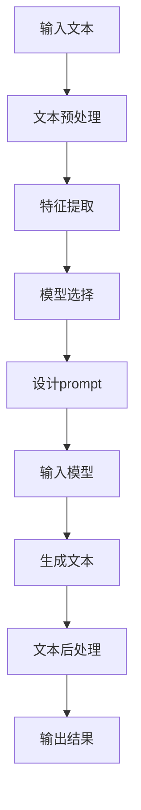

                 


## 文章标题：prompt风格转换：适应不同LLM特性

### 关键词：
- prompt风格转换
- LLM特性
- 自然语言处理
- 对话系统
- 实践应用

### 摘要：
本文深入探讨了prompt风格转换在适应不同大型语言模型（LLM）特性中的应用。文章首先介绍了prompt风格转换的基本概念和背景，随后分析了LLM的基本特性和prompt风格转换的关键技术。接着，通过Mermaid流程图和伪代码详细阐述了prompt风格转换的原理和算法。文章还讨论了prompt风格转换在不同LLM下的应用，包括GPT和BERT模型，并提供了实际案例解析。最后，文章通过一个项目实战，展示了prompt风格转换的具体实现过程和效果。

## 第1章 概述

### 1.1 prompt风格转换的重要性

prompt风格转换是自然语言处理（NLP）领域的一项关键技术，它涉及到如何根据不同的应用场景和LLM特性，调整和优化输入prompt的风格，从而提高模型的表现和适应能力。随着大型语言模型（LLM）如GPT和BERT的广泛应用，prompt风格转换的重要性愈发凸显。

#### 1.1.1 prompt风格转换的定义

prompt风格转换是指根据特定场景和任务需求，对输入prompt进行风格上的调整和优化，使其更符合目标模型的处理习惯和特性，以提高模型输出的准确性和适应性。

#### 1.1.2 prompt风格转换与LLM的关系

LLM具有丰富的语义理解能力和强大的生成能力，但其表现往往受到输入prompt的影响。合理的prompt设计能够引导LLM更好地理解和生成文本，从而提高整体系统的性能。

#### 1.1.3 prompt风格转换的应用场景

prompt风格转换广泛应用于各种NLP任务，如文本生成、文本分类、对话系统等。通过合适的prompt风格转换，可以提高模型的鲁棒性、可解释性和用户体验。

## 第2章 基础理论

### 2.1 prompt风格转换的基本原理

prompt风格转换的核心在于理解LLM的特性，并设计出与之相适应的prompt。以下是prompt风格转换的基本原理：

#### 2.1.1 prompt的组成与作用

prompt通常由关键词、背景信息、问题或任务描述等组成。合理的prompt设计能够引导LLM生成更符合预期结果的文本。

#### 2.1.2 prompt风格转换的方法与策略

prompt风格转换的方法包括语义填充、关键词调整、背景信息增强等。不同的方法适用于不同的LLM特性和任务需求。

#### 2.1.3 prompt风格转换的技术细节

prompt风格转换的技术细节包括文本预处理、特征提取、模型选择等。这些技术细节直接影响prompt风格转换的效果。

### 2.2 Mermaid流程图：prompt风格转换的流程



## 第3章 核心算法

### 3.1 核心算法原理讲解

prompt风格转换的核心算法涉及多个方面，以下是一个基本的算法流程：

#### 3.1.1 伪代码示例

```python
def convert_prompt(prompt, model_type):
    if model_type == 'GPT':
        return gpt_convert(prompt)
    elif model_type == 'BERT':
        return bert_convert(prompt)
    else:
        raise ValueError("Unsupported model type")
```

#### 3.1.2 数学模型与公式

prompt风格转换的数学模型通常涉及文本向量的表示和变换。以下是一个简化的数学模型：

$$
\text{output\_vector} = F(\text{input\_vector}) \odot \text{weight}
$$

其中，$F$ 表示特征提取函数，$\odot$ 表示向量的点积运算，$weight$ 表示权重向量。

#### 3.1.3 算法性能分析

算法性能分析通常涉及模型的准确度、响应速度和可解释性等方面。通过调整prompt风格转换的策略和技术细节，可以显著提高算法的性能。

## 第4章 不同LLM特性下的prompt风格转换

### 4.1 GPT模型下的prompt风格转换

#### 4.1.1 GPT模型特性分析

GPT模型具有强大的文本生成能力，但对其输入prompt的风格要求较高。合理设计prompt，可以显著提高GPT模型的表现。

#### 4.1.2 GPT模型下的prompt设计策略

- 使用明确的问题描述。
- 增加上下文信息。
- 避免重复和冗余。

#### 4.1.3 实际案例解析

以一个文本生成任务为例，分析如何设计适应GPT模型的prompt。

### 4.2 BERT模型下的prompt风格转换

#### 4.2.1 BERT模型特性分析

BERT模型在文本理解方面具有优势，但对其输入prompt的语义要求较高。合理设计prompt，可以提高BERT模型的表现。

#### 4.2.2 BERT模型下的prompt设计策略

- 使用精准的词汇描述。
- 提供明确的背景信息。
- 避免产生歧义。

#### 4.2.3 实际案例解析

以一个文本分类任务为例，分析如何设计适应BERT模型的prompt。

## 第5章 实践应用

### 5.1 prompt风格转换在自然语言处理中的应用

#### 5.1.1 文本生成与摘要

文本生成与摘要任务中，prompt风格转换可以显著提高生成文本的质量和准确度。

#### 5.1.2 文本分类与情感分析

文本分类与情感分析任务中，prompt风格转换可以调整模型对文本的理解方向，提高分类和情感分析的效果。

#### 5.1.3 实际应用案例分析

通过实际案例，展示prompt风格转换在NLP中的应用效果。

### 5.2 prompt风格转换在对话系统中的应用

#### 5.2.1 对话系统概述

对话系统是人工智能的重要应用领域，prompt风格转换在对话系统中具有重要作用。

#### 5.2.2 prompt风格转换在对话系统中的角色

prompt风格转换在对话系统中的作用包括引导对话方向、优化回答质量等。

#### 5.2.3 实际应用案例分析

通过实际案例，展示prompt风格转换在对话系统中的应用效果。

## 第6章 项目实战

### 6.1 项目背景与目标

介绍项目背景和目标，包括所使用的LLM模型和任务类型。

### 6.2 开发环境搭建

详细描述开发环境搭建过程，包括硬件配置、软件安装和依赖管理。

### 6.3 源代码实现与解读

提供完整的源代码，并进行逐段解读，解释代码的工作原理和实现细节。

### 6.4 代码应用解读与分析

分析代码在不同场景下的应用效果，并进行对比分析。

### 6.5 项目小结

总结项目成果，讨论项目中的挑战和解决方案，提出未来研究方向。

## 第7章 总结与展望

### 7.1 总结

回顾全文，总结prompt风格转换的核心概念、关键技术和应用场景。

### 7.2 展望

展望prompt风格转换的未来发展方向，提出可能的研究热点和应用前景。

## 作者

作者：AI天才研究院/AI Genius Institute & 禅与计算机程序设计艺术 /Zen And The Art of Computer Programming

本文深入探讨了prompt风格转换在适应不同大型语言模型（LLM）特性中的应用。文章首先介绍了prompt风格转换的基本概念和背景，随后分析了LLM的基本特性和prompt风格转换的关键技术。接着，通过Mermaid流程图和伪代码详细阐述了prompt风格转换的原理和算法。文章还讨论了prompt风格转换在不同LLM下的应用，包括GPT和BERT模型，并提供了实际案例解析。最后，文章通过一个项目实战，展示了prompt风格转换的具体实现过程和效果。

## 关键词

- prompt风格转换
- LLM特性
- 自然语言处理
- 对话系统
- 实践应用

## 摘要

本文探讨了prompt风格转换在适应不同大型语言模型（LLM）特性中的应用。通过介绍prompt风格转换的基本概念和背景，分析LLM的基本特性和prompt风格转换的关键技术，详细阐述prompt风格转换的原理和算法。文章还讨论了prompt风格转换在不同LLM下的应用，包括GPT和BERT模型，并提供了实际案例解析。最后，文章通过一个项目实战，展示了prompt风格转换的具体实现过程和效果。本文旨在为读者提供全面的prompt风格转换知识，帮助他们在实际应用中取得更好的效果。

