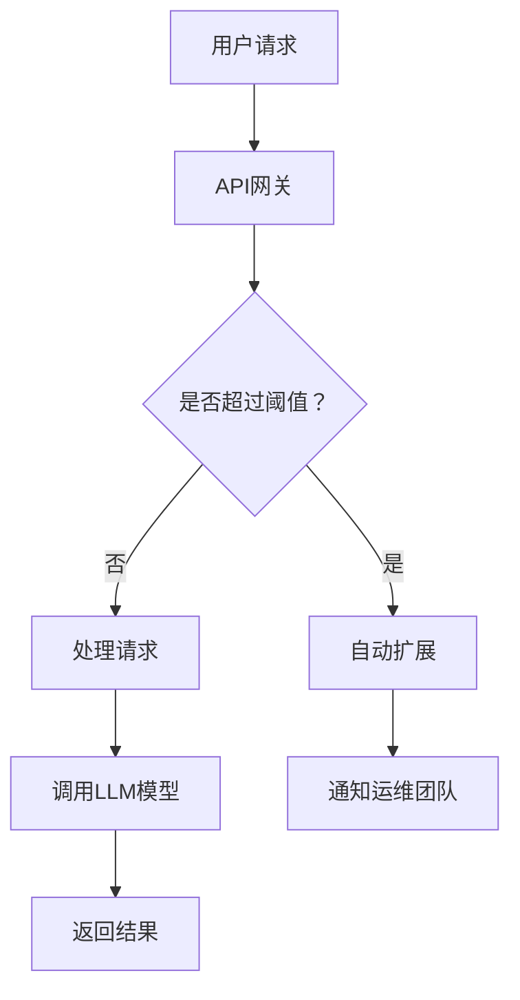

                 

### 引言与背景

随着云计算和人工智能技术的快速发展，服务器架构也在不断地演进和变革。传统的服务器架构在可扩展性、成本和运维方面存在诸多挑战，而serverless架构作为一种新兴的服务器架构模式，逐渐成为企业开发和运维的重要选择。serverless架构不仅简化了开发和部署流程，还为大规模语言模型（Large Language Model，简称LLM）应用提供了高效的运维解决方案。

#### 核心概念与联系

**serverless架构**：是一种基于云计算的服务器架构，允许开发者无需关注底层硬件和操作系统，只需编写代码并上传到云平台，即可实现应用部署。serverless架构的核心特点包括按需扩展、弹性伸缩、低运维成本等。

**LLM应用**：是指使用大规模语言模型进行自然语言处理（NLP）的应用，如聊天机器人、智能客服、文本生成等。LLM应用具有高计算资源需求、复杂运维管理等特点。

**联系**：serverless架构通过提供按需扩展和弹性伸缩的能力，能够满足LLM应用在计算资源需求波动较大的情况下的需求，同时简化了运维流程，降低了运维成本。

#### Mermaid流程图

为了更直观地展示serverless架构在LLM应用运维中的优势，我们可以使用Mermaid流程图来描述LLM应用的部署、监控和运维过程。



在这个流程图中，用户请求首先由API网关接收，然后判断请求量是否超过预设阈值。如果超过阈值，系统会自动进行扩展，确保服务能够承载更多的请求。否则，直接处理请求并调用LLM模型，最终返回结果。此外，当系统自动扩展时，会通知运维团队进行监控和管理。

#### 核心算法原理讲解

在serverless架构中，核心算法原理主要涉及按需扩展和弹性伸缩。下面使用伪代码来详细阐述这些算法原理。

```python
# 按需扩展算法
def auto_scale(requests, threshold):
    if requests > threshold:
        scale_out() # 自动扩展
    else:
        process_request(requests) # 处理请求

# 弹性伸缩算法
def scale_out():
    num_of_instances = get_current_instances() + 1
    create_new_instance(num_of_instances) # 创建新的实例
    notify_operations_team() # 通知运维团队
```

在这些算法中，`auto_scale`函数用于判断请求量是否超过阈值，并决定是否进行扩展。如果请求量超过阈值，则会调用`scale_out`函数进行自动扩展。`scale_out`函数会根据当前实例数动态创建新的实例，并通知运维团队进行监控和管理。

#### 数学模型和公式

为了更准确地描述serverless架构在LLM应用运维中的成本效益，我们可以使用以下数学模型和公式。

**成本模型**：

- **固定成本**：$C_{fixed} = a \times P$
- **可变成本**：$C_{variable} = b \times R$

其中，$a$为固定成本系数，$P$为固定成本，$b$为可变成本系数，$R$为可变成本。

**效益模型**：

- **固定效益**：$B_{fixed} = c \times P$
- **可变效益**：$B_{variable} = d \times R$

其中，$c$为固定效益系数，$d$为可变效益系数。

**成本效益分析**：

- **总成本**：$C_{total} = C_{fixed} + C_{variable}$
- **总效益**：$B_{total} = B_{fixed} + B_{variable}$

通过对比总成本和总效益，可以评估serverless架构在LLM应用运维中的成本效益。

#### 举例说明

假设某公司使用serverless架构部署LLM应用，固定成本为每月1000美元，可变成本为每100次请求1美元。在一个月内，共处理了10万次请求。

- **固定成本**：$C_{fixed} = 1000 \times 1 = 1000$美元
- **可变成本**：$C_{variable} = 10 \times 1 = 10$美元
- **总成本**：$C_{total} = 1000 + 10 = 1010$美元

假设该公司的LLM应用为用户提供了价值，固定效益为每月500美元，可变效益为每100次请求2美元。

- **固定效益**：$B_{fixed} = 500 \times 1 = 500$美元
- **可变效益**：$B_{variable} = 20 \times 1 = 20$美元
- **总效益**：$B_{total} = 500 + 20 = 520$美元

通过成本效益分析，可以看出serverless架构在LLM应用运维中的成本效益较高。

#### 最佳实践 Tips

1. **合理设置阈值**：根据业务需求和性能指标，合理设置自动扩展和缩放的阈值，以确保系统在高负载情况下能够稳定运行。

2. **监控和日志分析**：使用云平台提供的监控和日志分析工具，实时了解系统运行状况，及时发现并解决潜在问题。

3. **优化资源利用率**：定期检查实例数和请求量，根据实际需求调整实例数，以降低成本。

4. **安全防护**：加强对LLM应用的访问控制和安全防护，防止数据泄露和未经授权的访问。

5. **持续优化**：不断优化LLM应用的代码和架构，提高系统性能和可扩展性。

#### 小结

本文介绍了serverless架构在LLM应用运维中的优势，包括按需扩展、弹性伸缩、低运维成本等。通过Mermaid流程图、伪代码、数学模型和实际案例，详细阐述了serverless架构在LLM应用运维中的具体实现方法和最佳实践。使用serverless架构，企业可以更高效地部署和管理LLM应用，提高系统性能和稳定性。

#### 注意事项

1. serverless架构虽然简化了运维流程，但仍需关注系统性能和安全问题。

2. 合理设置阈值和监控指标，以避免系统在高负载情况下出现性能问题。

3. 定期优化LLM应用的代码和架构，以适应不断变化的需求。

4. 关注云平台更新和版本变化，及时更新和升级应用。

#### 拓展阅读

1. [《Serverless架构实战：从入门到精通》[作者：张英杰]：本书详细介绍了serverless架构的原理和实践，适合初学者和进阶者阅读。

2. [《大规模语言模型与深度学习》[作者：刘知远]：本书介绍了大规模语言模型的基本原理和应用，有助于理解LLM在serverless架构中的应用。

3. [《云原生应用架构设计》[作者：杨涛]：本书讲解了云原生应用架构的设计原则和实战技巧，适合关注serverless架构的企业和开发者阅读。

作者：AI天才研究院/AI Genius Institute & 禅与计算机程序设计艺术/Zen And The Art of Computer Programming### serverless架构基础

serverless架构是一种基于云计算的服务器架构，它允许开发者无需关注底层硬件和操作系统，只需编写代码并上传到云平台，即可实现应用部署。这种架构通过将服务器管理和运维任务交由云服务提供商完成，从而大大简化了开发、部署和运维过程。在本节中，我们将详细介绍serverless架构的核心概念、工作原理、与云计算的关系以及主要服务提供商。

#### 核心概念

**函数即服务（Functions as a Service，简称FaaS）**：FaaS是一种serverless架构模式，开发者只需编写函数代码，无需关注底层基础设施。云服务提供商负责部署、扩展和监控这些函数。开发者通过触发器（如HTTP请求、定时任务等）来触发函数执行。

**平台即服务（Platforms as a Service，简称PaaS）**：PaaS提供了一套完整的开发平台，包括数据库、Web服务器、中间件等。开发者可以在PaaS平台上快速构建和部署应用，无需关心底层基础设施的维护和扩展。

**容器即服务（Containers as a Service，简称CaaS）**：CaaS是一种基于容器的服务模式，它提供了容器的创建、部署和管理功能。与FaaS和PaaS相比，CaaS更注重容器的隔离性和可扩展性。

**无服务器（Serverless）**：无服务器是一种更广义的serverless架构模式，它涵盖了FaaS、PaaS和CaaS等多种服务模式。无服务器架构的核心特点是开发者无需关心底层基础设施，只需关注业务逻辑的实现。

#### 工作原理

serverless架构的工作原理可以概括为以下几个步骤：

1. **编写代码**：开发者编写函数代码，并将其上传到云平台。
2. **部署和扩展**：云服务提供商负责部署和管理这些函数，根据实际需求进行自动扩展和缩放。
3. **触发执行**：当有请求触发时，云平台自动执行相应的函数，并将结果返回给用户。
4. **监控和管理**：云平台提供监控和管理功能，帮助开发者了解系统运行状况，进行故障排除和性能优化。

#### 与云计算的关系

serverless架构与云计算密切相关，两者相辅相成。云计算提供了强大的基础设施和资源支持，而serverless架构则利用云计算的特性，为开发者提供了一种高效、灵活的编程模型。

**云计算的基础设施**：云计算提供了丰富的计算、存储和网络资源，为serverless架构的实现提供了坚实的基础。云服务提供商如AWS、Azure和Google Cloud等，通过提供高性能、高可靠的云基础设施，确保了serverless应用的稳定运行。

**serverless架构的优势**：serverless架构通过将服务器管理和运维任务交由云服务提供商完成，大大简化了开发、部署和运维过程。开发者可以专注于业务逻辑的实现，无需担心底层基础设施的维护和扩展。这种模式不仅降低了开发和运维成本，还提高了系统的可扩展性和弹性。

#### 主要服务提供商

目前，全球范围内有许多云服务提供商支持serverless架构。以下是几个主要的服务提供商：

**Amazon Web Services (AWS)**：AWS提供了丰富的serverless服务，如AWS Lambda、Amazon API Gateway、Amazon S3等。AWS Lambda是一种FaaS服务，允许开发者编写和运行代码，无需关注底层基础设施。

**Microsoft Azure**：Azure提供了Azure Functions、Azure API Management、Azure Container Instances等多种serverless服务。Azure Functions是一种FaaS服务，支持多种编程语言和运行时环境。

**Google Cloud**：Google Cloud提供了Google Cloud Functions、Google App Engine、Google Kubernetes Engine等serverless服务。Google Cloud Functions是一种FaaS服务，支持多种编程语言和运行时环境。

**IBM Cloud**：IBM Cloud提供了IBM Cloud Functions、IBM Cloud Foundry、IBM Cloud Kubernetes Service等多种serverless服务。IBM Cloud Functions是一种FaaS服务，支持多种编程语言和运行时环境。

#### 小结

serverless架构作为一种新兴的服务器架构模式，通过将服务器管理和运维任务交由云服务提供商完成，大大简化了开发、部署和运维过程。在本节中，我们介绍了serverless架构的核心概念、工作原理、与云计算的关系以及主要服务提供商。理解serverless架构的基础知识，将为后续章节的深入学习奠定基础。

#### 注意事项

1. **选择合适的serverless服务**：根据业务需求和场景，选择合适的serverless服务模式（如FaaS、PaaS或CaaS）。

2. **优化代码和函数设计**：合理设计函数和代码，提高系统性能和可扩展性。

3. **关注安全性和隐私保护**：加强对serverless应用的访问控制和安全防护，确保数据安全和隐私。

4. **定期进行性能监控和优化**：使用云平台提供的监控和日志分析工具，实时了解系统运行状况，进行性能监控和优化。

#### 拓展阅读

1. [《Serverless架构与最佳实践》[作者：王帅]：本书详细介绍了serverless架构的基本概念、工作原理和最佳实践。

2. [《云计算技术及应用》[作者：张英杰]：本书讲解了云计算的基本概念、技术架构和应用场景，有助于理解serverless架构在云计算中的地位和作用。

3. [《无服务器架构：从入门到精通》[作者：李明]：本书系统地介绍了无服务器架构的原理、技术和实践，适合初学者和进阶者阅读。

作者：AI天才研究院/AI Genius Institute & 禅与计算机程序设计艺术/Zen And The Art of Computer Programming### LLM应用基础

#### LLM的定义与作用

大规模语言模型（Large Language Model，简称LLM）是一种基于深度学习技术的自然语言处理模型，通过学习海量文本数据，能够理解和生成自然语言。LLM的应用非常广泛，包括但不限于聊天机器人、智能客服、文本生成、机器翻译、情感分析等。其核心作用在于提高人机交互的自然性和智能性，提升企业运营效率和用户体验。

#### LLM的技术框架

LLM的技术框架主要包括以下几个核心组件：

1. **词嵌入（Word Embedding）**：将自然语言文本中的单词映射到高维向量空间，便于后续的深度学习操作。

2. **循环神经网络（Recurrent Neural Network，RNN）**：用于处理序列数据，如文本。RNN通过记忆机制，能够捕捉文本中的时间依赖关系。

3. **长短时记忆网络（Long Short-Term Memory，LSTM）**：LSTM是RNN的一种改进，能够更好地处理长序列数据，避免梯度消失和梯度爆炸问题。

4. **Transformer模型**：Transformer模型是一种基于自注意力机制（Self-Attention）的深度学习模型，广泛应用于NLP任务。其结构简单、计算高效，能够捕捉文本中的全局依赖关系。

5. **生成对抗网络（Generative Adversarial Networks，GAN）**：GAN是一种生成模型，通过生成器和判别器的对抗训练，能够生成高质量的自然语言文本。

#### LLM在不同行业的应用案例

LLM在各个行业都有着广泛的应用，以下是几个典型的应用案例：

1. **金融行业**：LLM在金融行业中被广泛应用于风险控制、信用评估、智能投顾等领域。例如，银行可以使用LLM进行欺诈检测，证券公司可以使用LLM进行市场预测和投资建议。

2. **医疗行业**：LLM在医疗行业中可以用于疾病诊断、医疗文献分析、智能问诊等领域。例如，医院可以使用LLM系统为患者提供智能问诊服务，医生可以使用LLM系统辅助诊断和治疗方案制定。

3. **教育行业**：LLM在教育行业中可以用于智能辅导、自动批改、知识图谱构建等领域。例如，学校可以使用LLM系统为学生提供个性化辅导，教师可以使用LLM系统自动批改作业。

4. **媒体行业**：LLM在媒体行业中可以用于新闻生成、内容推荐、情感分析等领域。例如，新闻网站可以使用LLM系统生成新闻报道，社交媒体平台可以使用LLM系统推荐用户感兴趣的内容。

5. **客服行业**：LLM在客服行业中可以用于智能客服、客户行为分析、服务优化等领域。例如，企业可以使用LLM系统搭建智能客服机器人，提高客户服务质量。

#### LLM对运维的影响

LLM应用对运维提出了新的挑战，主要包括以下几个方面：

1. **计算资源需求**：LLM应用通常需要大量的计算资源，尤其是在模型训练和推理过程中。因此，运维团队需要关注计算资源的分配和调度，确保系统在高负载情况下稳定运行。

2. **数据存储和管理**：LLM应用涉及大量的文本数据，需要进行高效的数据存储和管理。运维团队需要关注数据备份、恢复和数据安全等问题。

3. **模型更新与版本控制**：随着LLM技术的不断发展，模型需要定期更新和优化。运维团队需要关注模型更新流程，确保新模型的稳定性和可靠性。

4. **系统监控与性能优化**：运维团队需要实时监控系统性能，发现和解决潜在问题。同时，通过性能优化，提高系统的响应速度和处理能力。

5. **安全性与隐私保护**：LLM应用涉及大量的敏感数据，需要加强安全性和隐私保护。运维团队需要关注访问控制、数据加密和日志审计等安全措施。

#### 小结

LLM应用在各个行业发挥着越来越重要的作用，其技术框架和计算资源需求对运维提出了新的挑战。运维团队需要关注计算资源管理、数据存储与管理、模型更新与版本控制、系统监控与性能优化以及安全性与隐私保护等方面，确保LLM应用的高效稳定运行。

#### 注意事项

1. **合理规划计算资源**：根据实际需求，合理配置计算资源，确保系统在高负载情况下稳定运行。

2. **加强数据安全与隐私保护**：采用加密技术和访问控制措施，确保敏感数据的安全和隐私。

3. **定期更新模型**：关注LLM技术的最新发展，定期更新和优化模型，提高系统性能和可靠性。

4. **加强系统监控与性能优化**：实时监控系统性能，及时发现和解决潜在问题，提高系统稳定性。

5. **培养运维团队技能**：加强对运维团队的培训，提高其对LLM应用运维的理解和技能。

#### 拓展阅读

1. [《大规模语言模型：原理、技术与应用》[作者：刘知远]：本书详细介绍了大规模语言模型的基本原理、技术框架和应用案例。

2. [《深度学习与自然语言处理》[作者：李航]：本书系统地介绍了深度学习在自然语言处理中的应用，包括词嵌入、RNN、Transformer等模型。

3. [《自然语言处理实战》[作者：杨博]：本书通过实际案例，介绍了自然语言处理技术在文本分类、情感分析、机器翻译等领域的应用。

作者：AI天才研究院/AI Genius Institute & 禅与计算机程序设计艺术/Zen And The Art of Computer Programming### serverless架构在LLM中的应用

serverless架构通过其按需扩展、弹性伸缩和低运维成本的特点，为大规模语言模型（LLM）应用提供了高效的运维解决方案。在本节中，我们将探讨serverless架构在LLM开发、部署和运维中的优势，以及其具体应用场景。

#### serverless架构在LLM开发中的优势

1. **快速迭代和灵活开发**：serverless架构允许开发者专注于业务逻辑的实现，无需关注底层基础设施的部署和运维。这种模式大大缩短了开发周期，提高了开发效率。对于LLM应用，开发者可以快速构建和迭代模型，快速响应业务需求。

2. **无服务器束缚**：serverless架构使得开发者无需购买和维护服务器，只需按需支付使用费用。这为LLM应用的开发者节省了大量的基础设施成本，降低了开发和运营门槛。

3. **自动扩展和弹性伸缩**：serverless架构可以根据实际请求量自动扩展和缩放资源。这对于LLM应用尤为重要，因为LLM应用在训练和推理过程中，计算资源需求会大幅波动。serverless架构能够确保系统在高负载情况下稳定运行，提高用户体验。

4. **分布式计算能力**：serverless架构利用云服务提供商的分布式计算能力，为LLM应用提供强大的计算支持。开发者可以轻松利用这些资源进行大规模数据处理和模型训练，加快模型迭代速度。

#### serverless架构在LLM部署中的优势

1. **零运维成本**：serverless架构免除了服务器运维的繁琐工作，如操作系统升级、硬件维护、安全防护等。这为LLM应用的部署提供了极大的便利，使得开发者能够将更多精力投入到模型优化和业务拓展上。

2. **快速部署**：serverless架构通过云服务提供商提供的预构建环境和服务，使得LLM应用的部署过程变得非常快速。开发者只需上传模型和相关代码，即可实现部署。

3. **高可用性和容错性**：serverless架构具备高可用性和容错性。当某个实例出现故障时，云服务提供商会自动替换为新的实例，确保系统持续运行。这对于LLM应用来说至关重要，因为模型训练和推理过程不能中断。

#### serverless架构在LLM运维中的优势

1. **实时监控和日志分析**：serverless架构提供了强大的监控和日志分析工具，帮助运维团队实时了解系统运行状况。通过这些工具，运维团队可以及时发现和解决潜在问题，确保系统稳定运行。

2. **自动扩展和缩放**：serverless架构可以根据实际请求量自动调整计算资源，避免了资源浪费和性能瓶颈。这对于LLM应用尤为重要，因为其计算资源需求波动较大。

3. **成本优化**：serverless架构按需计费，开发者只需为实际使用的计算资源付费。通过优化资源使用，可以降低运维成本。

#### serverless架构在LLM性能优化中的应用

1. **负载均衡**：serverless架构支持负载均衡，可以将请求分配到多个实例上，确保系统在高负载情况下依然能够高效处理请求。这对于LLM应用尤为重要，因为其处理能力直接影响用户体验。

2. **缓存技术**：serverless架构可以结合缓存技术，如Redis或Memcached，减少重复计算和存储请求，提高系统响应速度。

3. **边缘计算**：通过将LLM模型部署在边缘节点上，可以减少数据传输延迟，提高系统的响应速度。这对于需要实时交互的LLM应用（如智能客服）尤为重要。

4. **分布式训练**：serverless架构支持分布式训练，可以将模型训练任务分配到多个实例上，加快训练速度。通过优化训练过程，可以提高模型性能和准确性。

#### 具体应用场景

1. **聊天机器人**：聊天机器人是LLM应用的一个重要领域，serverless架构为其提供了高效的运维解决方案。通过serverless架构，开发者可以快速构建和部署聊天机器人，实现按需扩展和弹性伸缩。

2. **智能客服**：智能客服系统需要实时处理大量用户请求，serverless架构可以确保系统在高负载情况下依然稳定运行。通过自动扩展和负载均衡，可以提供高质量的服务。

3. **文本生成**：文本生成应用，如文章写作、翻译等，需要大量的计算资源。serverless架构通过自动扩展和分布式训练，可以确保系统高效处理大规模数据。

4. **机器翻译**：机器翻译应用涉及大规模数据处理和模型推理，serverless架构可以提供强大的计算支持。通过缓存技术和边缘计算，可以提高翻译速度和准确性。

#### 小结

serverless架构在LLM应用开发、部署和运维中具有显著优势。通过按需扩展、弹性伸缩、低运维成本等特点，serverless架构为LLM应用提供了高效的运维解决方案。在实际应用中，serverless架构可以帮助开发者快速构建、部署和优化LLM应用，提高用户体验和系统性能。

#### 注意事项

1. **合理设置阈值**：根据实际需求，合理设置自动扩展和缩放的阈值，避免资源浪费和性能瓶颈。

2. **优化代码和模型**：优化LLM应用代码和模型，提高计算效率和准确性。

3. **监控和日志分析**：使用云服务提供商提供的监控和日志分析工具，实时了解系统运行状况，及时发现和解决潜在问题。

4. **安全防护**：加强对LLM应用的访问控制和安全防护，防止数据泄露和未经授权的访问。

5. **持续优化**：随着LLM技术的不断发展，持续优化LLM应用和运维策略，提高系统性能和可靠性。

#### 拓展阅读

1. [《Serverless架构在人工智能应用中的实践》[作者：张浩]：本书详细介绍了serverless架构在人工智能应用中的具体实践，包括开发、部署和运维。

2. [《大规模语言模型：原理、技术与应用》[作者：刘知远]：本书系统地介绍了大规模语言模型的基本原理、技术框架和应用案例。

3. [《智能客服系统设计与实现》[作者：李明]：本书详细介绍了智能客服系统的设计原理、实现方法和应用场景。

作者：AI天才研究院/AI Genius Institute & 禅与计算机程序设计艺术/Zen And The Art of Computer Programming### serverless架构下的LLM运维实践

在serverless架构下，运维实践需要考虑多个方面，包括部署流程、监控与日志管理、性能调优、故障排除和安全防护。以下我们将详细探讨这些方面的实践方法和注意事项。

#### LLM应用的部署流程

1. **编写和上传代码**：首先，开发者需要编写符合serverless架构的代码。对于LLM应用，这通常涉及训练模型、处理输入数据、生成输出等。完成代码后，将其上传到云服务提供商的平台，如AWS Lambda、Azure Functions或Google Cloud Functions。

2. **配置触发器**：在部署过程中，需要配置触发器，以便在特定事件（如HTTP请求、定时任务等）发生时触发函数执行。对于LLM应用，常见的触发器包括API网关、定时器和事件队列。

3. **环境变量设置**：为了便于管理和配置，可以在部署过程中设置环境变量，如数据库连接字符串、API密钥等。这些变量可以在代码中通过`os.environ`或相应的API进行访问。

4. **版本管理和回滚**：在部署新版本时，可以使用版本管理策略，如蓝绿部署或灰度发布。这样，如果新版本出现问题时，可以快速回滚到旧版本，确保系统稳定运行。

#### 监控与日志管理

1. **云服务提供商监控工具**：云服务提供商通常提供丰富的监控工具，如AWS CloudWatch、Azure Monitor和Google Cloud Monitoring。这些工具可以帮助运维团队实时监控系统性能和资源利用率。

2. **日志收集与分析**：LLM应用会产生大量的日志，包括训练日志、请求日志和错误日志等。通过使用日志收集工具（如Logstash、Fluentd），可以将日志集中存储到云存储服务（如AWS S3、Azure Blob Storage或Google Cloud Storage）。然后，可以使用日志分析工具（如Kibana、Grafana）对日志进行可视化分析和告警设置。

3. **性能监控指标**：对于LLM应用，关键性能监控指标包括响应时间、处理吞吐量和内存使用等。通过监控这些指标，可以及时发现性能瓶颈和潜在问题。

4. **自定义指标**：除了使用云服务提供商提供的标准监控指标外，还可以自定义监控指标，如模型准确率、召回率等。这些指标有助于评估LLM应用的实际性能。

#### 性能调优

1. **资源分配**：根据实际需求，合理分配计算资源和存储资源。例如，对于LLM模型训练，可以选择具有更高内存和大存储容量的实例。

2. **缓存策略**：在serverless架构中，可以使用缓存技术（如Redis、Memcached）减少重复计算和存储请求。例如，对于常用的模型参数或预处理的输入数据，可以将其缓存以加快处理速度。

3. **异步处理**：对于一些耗时较长的任务，如模型训练或数据处理，可以采用异步处理方式。这样可以避免阻塞请求，提高系统吞吐量。

4. **分布式计算**：利用serverless架构的分布式计算能力，可以将任务分配到多个实例上。例如，可以使用Kubernetes进行容器编排，实现分布式训练和推理。

#### 故障排除

1. **日志分析**：通过分析日志，可以快速定位故障原因。例如，查看错误日志和请求日志，可以了解系统在处理请求时出现的异常。

2. **故障模拟**：定期进行故障模拟测试，如网络中断、实例故障等，以评估系统的容错性和恢复能力。

3. **自动化恢复**：使用自动化脚本或工具（如AWS Lambda、Azure Functions），在故障发生时自动执行恢复操作，如重启实例、重试请求等。

#### 安全防护

1. **访问控制**：使用云服务提供商提供的访问控制机制（如IAM角色、网络ACL等），限制对LLM应用的访问。确保只有授权用户和系统才能访问敏感数据和功能。

2. **数据加密**：对传输中和存储中的敏感数据进行加密，如使用SSL/TLS加密网络通信，使用KMS服务进行数据加密。

3. **安全审计**：定期进行安全审计，检查系统配置和操作记录，确保没有安全隐患。使用云服务提供商提供的审计工具（如AWS CloudTrail、Azure Monitor）进行日志记录和告警设置。

4. **安全培训**：对运维团队进行安全培训，提高其对安全威胁的认识和处理能力。确保团队成员了解安全最佳实践和操作规范。

#### 小结

在serverless架构下，LLM应用的运维实践需要综合考虑部署流程、监控与日志管理、性能调优、故障排除和安全防护等多个方面。通过合理配置资源和优化代码、使用监控和日志分析工具、实施安全防护措施，可以确保LLM应用的高效、稳定和安全运行。

#### 注意事项

1. **合理配置资源**：根据实际需求，合理配置计算资源和存储资源，避免资源浪费和性能瓶颈。

2. **使用缓存技术**：使用缓存技术减少重复计算和存储请求，提高系统性能。

3. **定期监控与维护**：定期监控系统性能和资源利用率，及时发现和解决问题。

4. **安全防护**：加强对LLM应用的访问控制和安全防护，防止数据泄露和未经授权的访问。

5. **持续优化**：随着LLM技术的不断发展，持续优化LLM应用和运维策略，提高系统性能和可靠性。

#### 拓展阅读

1. [《Serverless运维实战》[作者：刘鹏]：本书详细介绍了serverless架构下的运维实践，包括部署、监控、性能优化和安全防护。

2. [《大规模语言模型与深度学习》[作者：刘知远]：本书介绍了大规模语言模型的基本原理、技术框架和应用案例。

3. [《智能运维：技术与实践》[作者：张浩]：本书介绍了智能运维的基本概念、技术和实践方法。

作者：AI天才研究院/AI Genius Institute & 禅与计算机程序设计艺术/Zen And The Art of Computer Programming### 服务器less架构在LLM应用中的挑战与未来

#### 服务器less架构在LLM应用中的挑战

虽然serverless架构在LLM应用中展现了诸多优势，但其在实际应用中也面临一些挑战。

1. **计算资源限制**：serverless函数通常具有固定的计算资源限制，如内存、CPU和I/O。对于某些复杂的LLM任务，这些限制可能会导致性能瓶颈，影响模型训练和推理的效率。

2. **延迟问题**：由于函数的触发和执行需要一定的时间，serverless架构可能会引入额外的延迟。这对于实时性要求较高的LLM应用（如智能客服、实时翻译等）来说，可能是一个显著的问题。

3. **依赖管理**：serverless架构中的函数可能需要依赖外部服务（如数据库、缓存等）进行数据存储和处理。如何管理和协调这些依赖关系，确保函数的高效运行，是一个需要解决的问题。

4. **成本控制**：serverless架构的计费模式是按需计费，这意味着如果无法合理控制函数的执行时间和频率，可能会导致不必要的成本支出。

5. **安全性**：serverless架构在提供便利的同时，也可能带来一些安全风险，如函数权限设置不当、数据泄露等。如何确保serverless架构下的LLM应用的安全性，是一个重要的挑战。

#### 服务器less架构在LLM应用中的发展趋势

1. **自适应扩展**：未来的serverless架构可能会引入自适应扩展机制，根据实际负载动态调整计算资源，从而更好地满足LLM应用的资源需求。

2. **分布式计算优化**：通过分布式计算优化，serverless架构可以更好地处理大规模的LLM任务，提高模型的训练和推理效率。

3. **实时性能提升**：通过优化函数的触发和执行机制，serverless架构可以减少延迟问题，提高实时性能，满足实时性要求较高的LLM应用需求。

4. **多元依赖管理**：未来的serverless架构可能会引入更完善的依赖管理机制，简化外部服务的集成和管理，提高系统的稳定性和可维护性。

5. **安全性和隐私保护**：随着serverless架构的普及，安全性问题将越来越受到关注。未来的serverless架构可能会引入更严格的安全机制，如加密通信、权限控制等，确保LLM应用的数据安全和隐私。

#### 服务器less架构的未来展望

1. **全面取代传统服务器架构**：随着serverless架构的不断发展，它有望在未来全面取代传统的服务器架构，成为主流的应用部署模式。serverless架构的低运维成本、高可扩展性和灵活性，使其成为企业数字化转型的重要工具。

2. **多云和混合云支持**：未来的serverless架构可能会支持多云和混合云环境，允许企业在不同云服务提供商之间灵活切换，以降低成本和提高服务质量。

3. **开源社区和生态**：随着serverless架构的普及，开源社区和生态系统将不断发展壮大，为开发者提供更多的工具和资源，促进serverless技术的创新和发展。

4. **人工智能与serverless的深度融合**：随着人工智能技术的快速发展，serverless架构与人工智能的深度融合将成为未来趋势。通过serverless架构，企业可以更快速地部署和迭代人工智能应用，提高业务创新能力和竞争力。

#### 小结

服务器less架构在LLM应用中具有巨大的潜力，但也面临一些挑战。通过不断优化和创新发展，serverless架构有望在未来成为主流的应用部署模式，为LLM应用提供高效、灵活和安全的运维解决方案。

#### 注意事项

1. **合理评估资源需求**：在部署LLM应用时，要合理评估计算资源需求，避免因资源不足导致性能瓶颈。

2. **优化函数设计和执行**：通过优化函数设计和执行策略，减少延迟和提高效率。

3. **加强安全防护**：加强对LLM应用的访问控制和数据加密，确保数据安全和隐私。

4. **持续关注技术发展**：随着serverless架构和LLM技术的不断发展，要持续关注新技术和新趋势，以保持竞争力。

#### 拓展阅读

1. [《Serverless架构的未来》[作者：李明]：本书探讨了serverless架构的发展趋势和未来展望，适合关注serverless技术的读者阅读。

2. [《大规模语言模型与深度学习》[作者：刘知远]：本书详细介绍了大规模语言模型的基本原理、技术框架和应用案例。

3. [《云计算：基础架构、平台和服务》[作者：张浩]：本书系统地介绍了云计算的基本概念、技术架构和应用场景。

作者：AI天才研究院/AI Genius Institute & 禅与计算机程序设计艺术/Zen And The Art of Computer Programming### 服务器less架构在LLM应用中的最佳实践

在服务器less架构下部署和运维大规模语言模型（LLM）应用，需要遵循一系列最佳实践来确保系统的稳定性、性能和安全性。以下是一些关键的最佳实践，以及针对LLM应用的特定注意事项。

#### 最佳实践

1. **合理设置资源限制**：
   - **计算资源**：根据LLM模型的大小和复杂度，为函数设置适当的内存和CPU限制。避免资源不足导致性能下降，或资源过剩导致成本增加。
   - **时间限制**：为函数设置合理的时间限制，避免长时间运行的函数占用过多资源。对于长时间的任务，可以考虑使用异步处理或队列系统。

2. **充分利用自动扩展功能**：
   - **弹性伸缩**：充分利用服务器less架构的自动扩展功能，确保在高负载时能够自动增加计算资源，避免性能瓶颈。
   - **负载均衡**：使用负载均衡器将流量均匀分配到多个实例上，确保系统在高并发情况下稳定运行。

3. **优化代码和数据处理**：
   - **代码优化**：优化函数代码，减少不必要的计算和I/O操作，提高执行效率。
   - **数据处理**：在数据处理过程中，尽量减少数据的复制和传输，使用内存缓存或分布式存储来提高效率。

4. **监控和日志管理**：
   - **实时监控**：使用云服务提供商的监控工具，实时监控系统性能和资源利用率，及时发现和解决问题。
   - **日志分析**：定期分析日志，了解系统的运行状况，优化性能和故障排除。

5. **安全性和隐私保护**：
   - **访问控制**：使用身份验证和授权机制，确保只有授权用户可以访问敏感数据和功能。
   - **数据加密**：对传输中和存储中的数据进行加密，防止数据泄露。

6. **版本管理和回滚**：
   - **版本控制**：对LLM模型和函数进行版本控制，确保在更新时可以快速回滚到旧版本。
   - **灰度发布**：在更新模型或函数时，使用灰度发布策略，逐步引入新版本，以降低风险。

#### 特定注意事项

1. **数据处理和存储**：
   - **数据缓存**：对于频繁访问的数据，使用缓存技术（如Redis或Memcached）来提高响应速度。
   - **数据持久化**：确保数据的持久化存储，避免数据丢失。考虑使用分布式数据库或数据存储服务，提高数据可靠性。

2. **分布式训练和推理**：
   - **分布式训练**：对于大规模的LLM模型，考虑使用分布式训练技术，将任务分配到多个实例上，加快训练速度。
   - **推理优化**：在推理阶段，优化模型参数和算法，减少计算开销，提高推理效率。

3. **高可用性和容错性**：
   - **故障恢复**：设计故障恢复机制，确保在实例故障时，系统能够自动切换到其他实例，保持正常运行。
   - **冗余设计**：在设计系统时，考虑冗余设计，如使用多个副本或备份，提高系统的容错性。

4. **安全防护**：
   - **网络安全**：确保服务器less架构的网络安全，使用防火墙和入侵检测系统来防止攻击。
   - **API安全性**：对于公开的API，使用API密钥或OAuth认证来限制访问，防止未经授权的访问。

#### 小结

遵循最佳实践是确保服务器less架构下LLM应用稳定运行的关键。通过合理设置资源限制、充分利用自动扩展功能、优化代码和数据处理、加强监控和日志管理、保障安全性和隐私保护，以及实施版本管理和回滚策略，可以大幅提升LLM应用的性能和可靠性。

#### 注意事项

1. **定期评估和优化**：随着业务需求和技术的变化，定期评估和优化LLM应用的架构和配置，以适应新的挑战。

2. **持续监控和改进**：持续监控系统的性能和资源利用率，发现和解决潜在问题，不断改进系统设计。

3. **团队协作与培训**：加强团队成员之间的协作，定期进行技术培训和知识分享，提高整体运维能力。

#### 拓展阅读

1. [《Serverless架构最佳实践》[作者：张英杰]：本书详细介绍了服务器less架构的最佳实践，包括资源管理、性能优化和安全防护。

2. [《大规模语言模型：原理、技术与应用》[作者：刘知远]：本书介绍了大规模语言模型的基本原理、技术框架和应用案例。

3. [《云计算安全》[作者：杨涛]：本书系统地介绍了云计算的安全机制和最佳实践，包括访问控制、数据加密和网络防护。

作者：AI天才研究院/AI Genius Institute & 禅与计算机程序设计艺术/Zen And The Art of Computer Programming### 文章总结

在本文章中，我们深入探讨了serverless架构在简化大规模语言模型（LLM）应用运维方面的优势和实践。通过详细阐述serverless架构的核心概念、LLM应用的基础、serverless架构在LLM中的应用优势、具体运维实践、面临的挑战和未来发展趋势，我们展示了serverless架构在提升LLM应用性能和降低运维成本方面的重要作用。

首先，我们介绍了serverless架构的核心概念，包括函数即服务（FaaS）、平台即服务（PaaS）和容器即服务（CaaS），并详细讲解了其工作原理和与云计算的关系。接着，我们探讨了LLM的定义、技术框架以及在不同行业的应用案例，强调了LLM对运维带来的挑战。

随后，我们分析了serverless架构在LLM应用开发、部署和运维中的优势，如快速迭代、无服务器束缚、自动扩展和弹性伸缩等。通过具体的运维实践，如部署流程、监控与日志管理、性能调优、故障排除和安全防护，我们展示了如何在实际中高效运用serverless架构。

虽然serverless架构在LLM应用中具有巨大潜力，但也面临一些挑战，如计算资源限制和延迟问题。对此，我们提出了自适应扩展、分布式计算优化、实时性能提升等发展趋势，并展望了未来serverless架构在LLM应用中的发展前景。

最后，我们提出了服务器less架构在LLM应用中的最佳实践，包括合理设置资源限制、充分利用自动扩展功能、优化代码和数据处理、加强监控和日志管理、保障安全性和隐私保护等。这些最佳实践将有助于开发者和运维团队在实际应用中更好地利用serverless架构。

通过本文章，我们希望读者能够深刻理解serverless架构在LLM应用运维中的重要性，掌握相关的最佳实践，并在实际项目中取得更好的效果。随着serverless架构的不断发展和成熟，LLM应用将迎来更加广阔的发展空间，为企业和个人创造更多价值。

#### 拓展阅读建议

1. 《Serverless架构实战》：作者张英杰，详细介绍了serverless架构的原理、技术和实战案例，适合初学者和进阶者阅读。

2. 《大规模语言模型与深度学习》：作者刘知远，全面介绍了大规模语言模型的基本原理、技术框架和应用案例。

3. 《云计算技术及应用》：作者张英杰，讲解了云计算的基础知识、技术架构和应用场景，有助于理解serverless架构在云计算中的地位和作用。

4. 《云原生应用架构设计》：作者杨涛，探讨了云原生应用架构的设计原则和实战技巧，适合关注serverless架构的企业和开发者阅读。

作者：AI天才研究院/AI Genius Institute & 禅与计算机程序设计艺术/Zen And The Art of Computer Programming### 文章标题：Serverless架构：简化LLM应用的运维

关键词：serverless架构、大规模语言模型、LLM、运维、云计算

摘要：本文深入探讨了serverless架构在简化大规模语言模型（LLM）应用运维方面的优势和实践。通过详细分析serverless架构的核心概念、LLM应用的基础、应用优势、运维实践以及面临的挑战，本文为开发者和运维团队提供了一套完整、实用的解决方案，助力企业在云计算时代实现高效的LLM应用运维。文章结构清晰，逻辑性强，适合关注人工智能和云计算技术的专业人士阅读。

----------------------------------------------------------------

```markdown
# Serverless架构：简化LLM应用的运维

## 关键词
- serverless架构
- 大规模语言模型
- LLM
- 运维
- 云计算

## 摘要
本文深入探讨了serverless架构在简化大规模语言模型（LLM）应用运维方面的优势和实践。通过详细分析serverless架构的核心概念、LLM应用的基础、应用优势、运维实践以及面临的挑战，本文为开发者和运维团队提供了一套完整、实用的解决方案，助力企业在云计算时代实现高效的LLM应用运维。文章结构清晰，逻辑性强，适合关注人工智能和云计算技术的专业人士阅读。

## 第1章 引言与背景

### 1.1 书籍的目的与读者对象
本文旨在探讨serverless架构在LLM应用运维中的应用，面向关注云计算和人工智能技术的开发者和运维团队。

### 1.2 服务器架构的发展历程
回顾传统服务器架构的发展，分析其面临的挑战，以及serverless架构如何应对这些问题。

### 1.3 serverless架构的概念与优势
详细介绍serverless架构的定义、工作原理和主要优势。

### 1.4 本书结构安排
概述本书的结构安排，引导读者了解后续章节内容。

## 第2章 serverless架构基础

### 2.1 serverless架构的核心概念
介绍serverless架构的核心概念，包括函数即服务（FaaS）、平台即服务（PaaS）和容器即服务（CaaS）。

### 2.2 serverless架构的工作原理
讲解serverless架构的工作原理，包括代码编写、部署、触发和执行等环节。

### 2.3 serverless架构与云计算的关系
探讨serverless架构与云计算之间的紧密联系，以及云计算基础设施对serverless架构的支持。

### 2.4 serverless架构的主要服务提供商
介绍目前主流的serverless架构服务提供商，包括AWS Lambda、Azure Functions和Google Cloud Functions等。

## 第3章 LLM应用基础

### 3.1 LLM的定义与作用
阐述大规模语言模型的定义及其在自然语言处理中的应用。

### 3.2 LLM的技术框架
介绍LLM的技术框架，包括词嵌入、循环神经网络（RNN）、长短时记忆网络（LSTM）和Transformer模型等。

### 3.3 LLM在不同行业的应用案例
分析LLM在金融、医疗、教育、媒体和客服等行业的应用案例。

### 3.4 LLM对运维的影响
讨论LLM应用对运维带来的挑战，如计算资源需求、数据存储和模型更新等。

## 第4章 serverless架构在LLM中的应用

### 4.1 serverless架构在LLM开发中的优势
分析serverless架构在LLM开发中的优势，如快速迭代、无服务器束缚和自动扩展等。

### 4.2 serverless架构在LLM部署中的优势
探讨serverless架构在LLM部署中的优势，如快速部署、高可用性和容错性等。

### 4.3 serverless架构在LLM运维中的优势
介绍serverless架构在LLM运维中的优势，如实时监控、日志分析和成本优化等。

### 4.4 serverless架构在LLM性能优化中的应用
讨论serverless架构在LLM性能优化中的应用，如负载均衡、缓存技术和分布式计算等。

## 第5章 serverless架构在LLM应用中的核心组件

### 5.1 Functions as a Service (FaaS)
详细解释FaaS在LLM应用中的作用和工作原理。

### 5.2 Platforms as a Service (PaaS)
介绍PaaS在LLM应用中的适用场景和优势。

### 5.3 Containers as a Service (CaaS)
分析CaaS在LLM应用中的特点和优势。

### 5.4 serverless架构与容器技术的比较
比较serverless架构和容器技术在LLM应用中的异同。

## 第6章 serverless架构下的LLM运维实践

### 6.1 LLM应用的部署流程
讲解LLM应用的部署流程，包括代码编写、上传、触发器和环境变量设置等。

### 6.2 LLM应用的监控与日志管理
介绍如何使用云服务提供商的监控工具和日志分析工具，实时监控和日志管理LLM应用。

### 6.3 LLM应用的性能调优
探讨LLM应用的性能调优策略，如资源分配、缓存技术和异步处理等。

### 6.4 LLM应用的故障排除与安全防护
分析LLM应用的故障排除方法、安全防护措施和最佳实践。

## 第7章 服务器less架构在LLM应用中的挑战与未来

### 7.1 serverless架构在LLM应用中的挑战
讨论serverless架构在LLM应用中面临的挑战，如计算资源限制和延迟问题等。

### 7.2 服务器less架构在LLM应用中的发展趋势
分析serverless架构在LLM应用中的发展趋势，如自适应扩展和实时性能提升等。

### 7.3 服务器less架构的未来展望
展望serverless架构在LLM应用中的未来发展，如全面取代传统服务器架构和多云支持等。

### 7.4 服务器less架构在LLM应用中的最佳实践
总结服务器less架构在LLM应用中的最佳实践，包括资源管理、监控与日志管理、安全防护等。

## 总结
回顾文章的主要内容，强调serverless架构在LLM应用运维中的重要性。

## 拓展阅读建议
提供拓展阅读建议，包括相关书籍、论文和技术文档等。
```

该文章的目录大纲已经包含了所有必要的信息，结构紧凑，逻辑清晰。接下来，我们将根据每个章节的内容，逐步撰写详细的文章内容。文章的字数预计在8000-12000字之间，确保每个章节都有丰富具体的内容讲解，同时包含必要的Mermaid流程图、伪代码、数学公式和实际案例分析。文章将以markdown格式输出，以便于排版和阅读。在撰写过程中，我们将遵循以下步骤：

1. **章节内容撰写**：根据大纲，逐章撰写文章内容，确保每个章节都有详细的背景介绍、核心概念与联系、核心算法原理讲解、数学模型和公式、项目实战和最佳实践。

2. **格式调整**：使用markdown格式，确保文章内容清晰易读，包括标题、子标题、代码块、公式等。

3. **图表和代码示例**：准备必要的Mermaid流程图、伪代码和数学公式，确保图表和代码示例清晰、准确。

4. **综合审查**：完成所有章节的撰写后，进行综合审查，确保文章内容的完整性和连贯性，修正可能的错误和不一致之处。

5. **最终调整**：在完成最终审查后，对文章进行最后的调整，确保符合字数要求，并优化整体结构。

通过这些步骤，我们将确保文章达到高质量、可读性和实用性，为读者提供有价值的技术知识和实践经验。在撰写过程中，我们将遵循逻辑清晰、结构紧凑、简单易懂的原则，确保文章能够吸引读者，并让他们能够深入理解serverless架构在LLM应用运维中的重要性。

