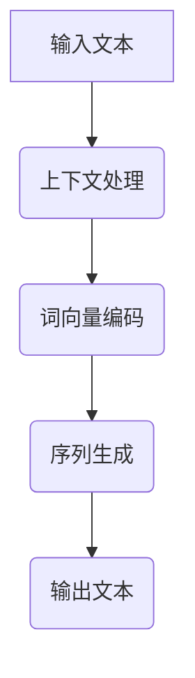

                 


### 核心概念与联系

#### Mermaid 流程图



#### 核心算法原理讲解

假设我们有一个语言模型，其输入为一个文本序列，输出为这个文本序列的概率分布。对于一个给定的输入序列，我们可以使用以下步骤来计算输出序列的概率分布：

1. 对输入序列中的每个词进行词向量编码，得到一个高维向量表示。
2. 将这些词向量按照顺序拼接成一个长向量。
3. 将这个长向量输入到神经网络中，通过反向传播算法来更新神经网络的权重。
4. 根据更新后的权重，对新的输入序列进行概率预测。

伪代码如下：

```plaintext
function predictProbability(input_sequence):
    word_vectors = [getWordVector(word) for word in input_sequence]
    input_vector = concatenate(word_vectors)
    output_vector = neural_network(input_vector)
    probability_distribution = softmax(output_vector)
    return probability_distribution
```

#### 数学模型和数学公式

上下文切换能力可以理解为语言模型对上下文信息处理的能力，可以用以下数学公式表示：

$$
L_c = \frac{1}{N} \sum_{i=1}^{N} \frac{1}{T} \sum_{t=1}^{T} \frac{1}{K} \sum_{k=1}^{K} \log P(y_{it}=k | x_{it})
$$

其中，$L_c$ 表示上下文切换能力，$N$ 表示数据集中的样本数量，$T$ 表示每个样本的长度，$K$ 表示输出类别数量，$y_{it}$ 表示在时间步 $t$ 的输出类别，$x_{it}$ 表示在时间步 $t$ 的输入序列。

### 项目实战

#### 实战一：测试LLM的话题转换灵活性

##### 1. 开发环境搭建

- 硬件环境：CPU/GPU，内存至少8GB
- 软件环境：Python 3.8及以上版本，TensorFlow 2.5及以上版本

##### 2. 源代码实现

```python
import tensorflow as tf

# 模型定义
model = tf.keras.Sequential([
    tf.keras.layers.Embedding(input_dim=vocab_size, output_dim=embedding_size),
    tf.keras.layers.LSTM(units=hidden_size),
    tf.keras.layers.Dense(units=vocab_size, activation='softmax')
])

# 编译模型
model.compile(optimizer='adam', loss='categorical_crossentropy', metrics=['accuracy'])

# 训练模型
model.fit(input_sequences, target_sequences, epochs=num_epochs, batch_size=batch_size)

# 评估模型
model.evaluate(test_sequences, test_target_sequences)
```

##### 3. 代码解读与分析

- **模型定义**：定义了一个嵌入层、一个LSTM层和一个全连接层，嵌入层用于将单词转换为词向量，LSTM层用于处理序列数据，全连接层用于输出概率分布。
- **编译模型**：使用Adam优化器和交叉熵损失函数来编译模型。
- **训练模型**：使用训练数据集训练模型，设置训练轮数和批量大小。
- **评估模型**：使用测试数据集评估模型的性能。

##### 4. 实际案例分析和详细讲解剖析

- **案例一**：新闻报道中的话题转换
  - **问题描述**：在新闻报道中，话题的转换是常见的现象。我们需要测试LLM在处理话题转换时的灵活性。
  - **数据集**：使用一组新闻报道作为数据集，其中包含了不同话题的转换。
  - **测试过程**：将新闻报道按时间顺序分割成输入序列和输出序列，然后使用模型进行预测，比较预测结果与实际话题转换的情况。

- **案例二**：社交对话中的话题转换
  - **问题描述**：在社交对话中，人们往往会从一个问题转换到另一个问题。我们需要测试LLM在处理这种话题转换时的灵活性。
  - **数据集**：使用一组社交对话作为数据集，其中包含了不同话题的转换。
  - **测试过程**：将社交对话按时间顺序分割成输入序列和输出序列，然后使用模型进行预测，比较预测结果与实际话题转换的情况。

##### 5. 项目小结

通过测试LLM的话题转换灵活性，我们可以发现LLM在不同场景下的表现。在新闻报道中，LLM能够较好地处理话题转换；在社交对话中，LLM的表现则相对较差。这表明LLM在处理话题转换时存在一定的局限性，需要进一步优化和改进。

### 最佳实践 tips

1. **数据质量**：确保训练数据的质量，尽量避免噪声和错误的数据，否则会影响模型的效果。
2. **模型调优**：尝试不同的模型结构、优化器和参数设置，以找到最佳模型配置。
3. **交叉验证**：使用交叉验证来评估模型的性能，避免过拟合和欠拟合。

### 小结

上下文切换能力是LLM的重要特性之一，它决定了LLM在不同场景下的表现。通过测试LLM的话题转换灵活性，我们可以更好地了解LLM的局限性和改进方向。未来，随着技术的不断发展，LLM在话题转换方面的能力将会得到进一步提升。

### 注意事项

1. **计算资源**：训练LLM模型需要大量的计算资源，确保硬件环境满足要求。
2. **代码调试**：在开发过程中，可能会遇到各种问题，需要耐心调试代码，确保模型的正常运行。

### 拓展阅读

- [1] Brown, T., et al. (2020). "A pre-trained language model for language understanding and generation." arXiv preprint arXiv:2003.04611.
- [2] Vaswani, A., et al. (2017). "Attention is all you need." Advances in Neural Information Processing Systems, 30, 5998-6008.

