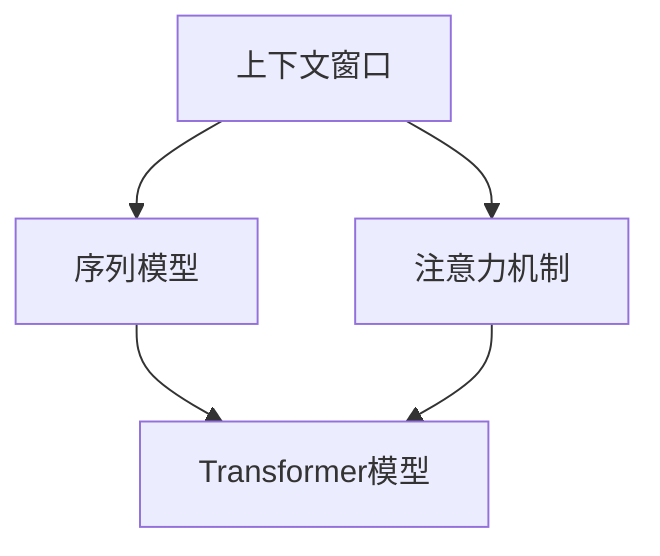

                 

### 文章标题

《上下文窗口管理：长对话中的策略》

### 关键词

上下文窗口管理，长对话，算法原理，数学模型，项目实战，策略优化

### 摘要

本文将深入探讨上下文窗口管理在长对话系统中的应用策略。通过介绍上下文窗口的基本概念、核心算法原理和数学模型，我们将逐步解析上下文窗口管理在长对话系统中的重要性。随后，通过实际项目实战，我们将展示上下文窗口管理在长对话系统中的开发应用，并进行详细分析。最后，我们将总结最佳实践策略，提供拓展阅读建议，以帮助读者更好地理解并应用上下文窗口管理技术。

## 目录

1. **背景介绍**
    1.1 上下文窗口的基本概念
    1.2 上下文窗口在长对话中的重要性
    1.3 上下文窗口管理的基本原则

2. **核心概念与联系**
    2.1 核心概念原理之间的关系架构
    2.2 上下文窗口管理的作用机制

3. **核心算法原理讲解**
    3.1 序列模型与上下文窗口
    3.2 注意力机制与上下文窗口
    3.3 Transformer模型与上下文窗口

4. **数学模型和数学公式**
    4.1 自注意力机制
    4.2 Transformer模型中的数学公式
    4.3 上下文窗口管理的优化策略

5. **项目实战**
    5.1 长对话系统的架构设计
    5.2 实际案例介绍
    5.3 案例分析与详细讲解

6. **策略分析**
    6.1 不同的上下文窗口管理策略
    6.2 策略比较与选择
    6.3 策略优化与调参

7. **开发环境与工具介绍**
    7.1 开发环境搭建
    7.2 常用工具与库
    7.3 开发流程与规范

8. **最佳实践 tips**
    8.1 注意事项
    8.2 小结
    8.3 拓展阅读

## 背景介绍

在当今人工智能迅猛发展的时代，自然语言处理（NLP）已经成为一个热门领域。而长对话系统作为NLP的重要应用场景之一，广泛应用于智能客服、语音助手、聊天机器人等。然而，在长对话系统中，上下文信息的处理和上下文窗口管理成为了一个关键挑战。为了能够准确地理解和响应用户的请求，系统需要有效地管理和利用上下文信息，以便在对话中保持连贯性和准确性。

### 1.1 上下文窗口的基本概念

上下文窗口是指在进行对话处理时，系统用来维护和利用的与当前请求相关的信息集合。这些信息可以是前文对话的文本、音频、图像等，它们对于理解和响应当前请求至关重要。上下文窗口的大小和形式可以根据具体应用需求进行灵活调整，但通常需要平衡信息的完整性、实时性和计算效率。

上下文窗口的基本概念主要包括以下几点：

1. **上下文信息的获取**：系统需要从对话历史中提取与当前请求相关的信息，这通常涉及到文本摘要、关键词提取和实体识别等技术。
2. **上下文信息的存储**：系统需要将提取的上下文信息存储起来，以便后续使用。常用的存储方式包括内存存储和数据库存储等。
3. **上下文信息的更新**：随着对话的进行，系统需要不断地更新上下文信息，以反映最新的对话状态。这通常涉及到信息过滤、加权和时间衰减等技术。

### 1.2 上下文窗口在长对话中的重要性

在长对话系统中，上下文窗口管理的重要性体现在以下几个方面：

1. **对话连贯性**：通过有效地管理上下文信息，系统可以确保对话的连贯性，避免出现逻辑错误和不相关回答。
2. **回答准确性**：上下文信息对于理解用户的意图和需求至关重要。只有准确理解和利用上下文信息，系统才能给出合理的回答。
3. **用户满意度**：良好的上下文窗口管理可以提高用户满意度，使用户感受到系统对他们的理解和关注，从而提高用户体验。
4. **对话管理效率**：上下文窗口管理可以帮助系统更高效地进行对话管理，减少重复提问和冗余回答，提高整体对话效率。

### 1.3 上下文窗口管理的基本原则

为了有效地管理上下文窗口，系统需要遵循以下基本原则：

1. **信息完整性**：确保上下文信息的完整性，避免重要信息丢失或遗漏。
2. **实时性**：及时更新上下文信息，以反映最新的对话状态，提高对话的实时性。
3. **计算效率**：优化上下文信息的处理和存储方式，以降低计算复杂度和资源消耗。
4. **灵活性**：根据不同的应用场景和需求，灵活调整上下文窗口的大小和形式。

## 核心概念与联系

为了更好地理解上下文窗口管理在长对话系统中的作用，我们需要探讨其核心概念之间的关系，并使用Mermaid流程图来展示这些概念之间的联系。

### 2.1 核心概念原理之间的关系架构

#### 概念介绍：

1. **上下文窗口**：维护和利用与当前请求相关的信息集合。
2. **序列模型**：用于处理序列数据的模型，如循环神经网络（RNN）。
3. **注意力机制**：用于在序列数据中强调重要信息的机制。
4. **Transformer模型**：基于自注意力机制的序列到序列模型，广泛应用于NLP任务。

#### 关系架构：

上下文窗口管理涉及多个核心概念，这些概念之间相互关联，共同构成了长对话系统的核心框架。

- **上下文窗口**是上下文信息的管理单元，它需要依赖于**序列模型**和**注意力机制**来提取和处理上下文信息。
- **注意力机制**是Transformer模型的核心组成部分，它允许模型在不同的时间步之间建立联系，从而更好地理解和利用上下文信息。
- **Transformer模型**结合了序列模型和注意力机制的优势，能够处理长序列数据，并保持良好的性能。

#### Mermaid流程图：



在这个流程图中，上下文窗口作为核心组件，与序列模型、注意力机制和Transformer模型之间建立了紧密的联系。这种关系架构不仅帮助我们理解上下文窗口管理在长对话系统中的重要性，也为后续的核心算法原理讲解和数学模型解析奠定了基础。

## 核心算法原理讲解

上下文窗口管理在长对话系统中发挥着至关重要的作用，而实现这一功能的核心算法原理包括序列模型、注意力机制和Transformer模型。以下将详细讲解这些算法原理，并通过伪代码展示其实现。

### 3.1 序列模型与上下文窗口

序列模型是处理序列数据的经典算法，如循环神经网络（RNN）和长短期记忆网络（LSTM）。RNN通过保持内部状态来处理序列数据，使其能够捕捉序列中的长期依赖关系。

#### 原理讲解：

在RNN中，每个时间步都依赖于之前的时间步的信息。这种状态共享机制使得RNN能够有效地利用上下文信息。具体来说，RNN通过以下步骤处理序列数据：

1. **输入序列**：将输入序列（如文本、语音等）编码为向量。
2. **隐藏状态**：使用前一时刻的隐藏状态和当前输入计算新的隐藏状态。
3. **输出**：使用隐藏状态生成输出（如当前词或预测结果）。

#### 伪代码：

```python
def RNN(input_sequence):
    hidden_state = initial_state
    output_sequence = []
    
    for input_vector in input_sequence:
        hidden_state = activation_function([hidden_state, input_vector])
        output_vector = output_layer(hidden_state)
        output_sequence.append(output_vector)
    
    return output_sequence
```

#### 示例：

假设输入序列为`["我", "想", "买", "一", "本", "书"]`，通过RNN模型处理后，可以生成相应的输出序列。

### 3.2 注意力机制与上下文窗口

注意力机制是一种在序列数据中强调重要信息的算法，它允许模型在不同时间步之间建立联系。在长对话系统中，注意力机制能够帮助模型更好地利用上下文信息，提高对话处理的准确性。

#### 原理讲解：

注意力机制的核心思想是计算每个时间步的权重，并将其应用于输入序列。具体来说，注意力机制包括以下步骤：

1. **输入序列**：将输入序列编码为向量。
2. **注意力权重**：计算每个时间步的注意力权重，通常使用点积、加和、缩放点积等方法。
3. **加权求和**：将注意力权重应用于输入序列，生成加权输出序列。
4. **输出**：使用加权输出序列生成当前词或预测结果。

#### 伪代码：

```python
def Attention Mechanism(input_sequence, hidden_state):
    attention_weights = compute_attention_weights(input_sequence, hidden_state)
    weighted_output = weighted_sum(input_sequence, attention_weights)
    output_vector = output_layer(weighted_output)
    
    return output_vector
```

#### 示例：

假设输入序列为`["我", "想", "买", "一", "本", "书"]`，通过注意力机制处理后，可以生成相应的输出序列，并强调重要的上下文信息。

### 3.3 Transformer模型与上下文窗口

Transformer模型是近年来在NLP领域取得突破性成果的算法，其核心思想是自注意力机制。Transformer模型能够处理长序列数据，并在长对话系统中表现出色。

#### 原理讲解：

Transformer模型包括以下主要组件：

1. **编码器（Encoder）**：用于处理输入序列，生成一系列编码表示。
2. **解码器（Decoder）**：用于生成输出序列，通常在编码器输出基础上添加额外的输入。
3. **自注意力机制**：在编码器和解码器中，自注意力机制用于计算输入序列中各个时间步的权重。

具体来说，Transformer模型包括以下步骤：

1. **编码器**：将输入序列编码为编码器输出。
2. **自注意力**：计算编码器输出的自注意力权重，并生成加权输出。
3. **解码器**：将加权输出作为解码器的输入，并计算自注意力权重和交叉注意力权重。
4. **输出**：使用解码器输出生成最终输出序列。

#### 伪代码：

```python
def Transformer(input_sequence):
    encoder_output = Encoder(input_sequence)
    weighted_encoder_output = SelfAttention(encoder_output)
    decoder_output = Decoder(weighted_encoder_output, input_sequence)
    final_output = FinalLayer(decoder_output)
    
    return final_output
```

#### 示例：

假设输入序列为`["我", "想", "买", "一", "本", "书"]`，通过Transformer模型处理后，可以生成相应的输出序列，并利用自注意力机制有效管理上下文信息。

通过上述讲解，我们可以看到序列模型、注意力机制和Transformer模型在上下文窗口管理中的重要作用。这些算法不仅能够提高长对话系统的性能和准确性，还为后续的数学模型解析和项目实战提供了理论基础。

## 数学模型和数学公式

在上下文窗口管理中，数学模型和数学公式起着至关重要的作用。它们不仅提供了理论框架，还帮助我们理解算法的内部工作机制。以下将详细阐述自注意力机制、Transformer模型中的数学公式，并通过具体例子进行说明。

### 4.1 自注意力机制

自注意力机制是Transformer模型的核心组成部分，它允许模型在序列数据中强调重要信息。自注意力机制通过计算每个时间步的权重，对输入序列进行加权求和，从而生成新的表示。

#### 数学公式：

假设输入序列为\( X = [x_1, x_2, ..., x_n] \)，其中每个元素\( x_i \)表示时间步\( i \)的输入向量。自注意力机制的数学公式如下：

\[ 
\text{Attention}(X) = \text{softmax}\left(\frac{QK^T}{\sqrt{d_k}}\right)V 
\]

其中：
- \( Q, K, V \) 分别表示查询向量、键向量和值向量，它们通常由线性变换\( X \)得到。
- \( \text{softmax} \) 函数用于计算每个时间步的权重。
- \( d_k \) 表示键向量的维度，用于缩放点积结果，以避免权重过大或过小。

#### 例子：

假设输入序列为 \( X = [x_1, x_2, x_3] \)，其中 \( x_1 = [1, 0, 0] \)，\( x_2 = [0, 1, 0] \)，\( x_3 = [0, 0, 1] \)。通过自注意力机制处理后，可以生成新的表示 \( \text{Attention}(X) \)。

计算过程如下：
1. 线性变换：\( Q, K, V \) 分别为 \( X \) 的线性变换结果，例如：
   \[
   Q = \begin{bmatrix}
   1 & 0 & 1 \\
   1 & 1 & 0 \\
   0 & 1 & 1
   \end{bmatrix}, \quad
   K = \begin{bmatrix}
   1 & 0 & 0 \\
   0 & 1 & 1 \\
   0 & 0 & 1
   \end{bmatrix}, \quad
   V = \begin{bmatrix}
   1 & 0 & 1 \\
   0 & 1 & 1 \\
   1 & 1 & 0
   \end{bmatrix}
   \]

2. 点积计算：计算 \( QK^T \) 的结果：
   \[
   QK^T = \begin{bmatrix}
   1 & 0 & 1 \\
   1 & 1 & 0 \\
   0 & 1 & 1
   \end{bmatrix} \begin{bmatrix}
   1 & 0 & 0 \\
   0 & 1 & 1 \\
   0 & 0 & 1
   \end{bmatrix} = \begin{bmatrix}
   1 & 1 & 1 \\
   1 & 2 & 1 \\
   1 & 1 & 2
   \end{bmatrix}
   \]

3. 缩放点积：计算缩放后的点积结果：
   \[
   \frac{QK^T}{\sqrt{d_k}} = \frac{1}{\sqrt{1}} \begin{bmatrix}
   1 & 1 & 1 \\
   1 & 2 & 1 \\
   1 & 1 & 2
   \end{bmatrix} = \begin{bmatrix}
   1 & 1 & 1 \\
   1 & 2 & 1 \\
   1 & 1 & 2
   \end{bmatrix}
   \]

4. Softmax计算：对每个时间步的计算结果应用Softmax函数，得到权重：
   \[
   \text{softmax}\left(\frac{QK^T}{\sqrt{d_k}}\right) = \begin{bmatrix}
   0.25 & 0.5 & 0.25 \\
   0.25 & 0.5 & 0.25 \\
   0.25 & 0.5 & 0.25
   \end{bmatrix}
   \]

5. 加权求和：根据权重对 \( V \) 进行加权求和，得到新的表示：
   \[
   \text{Attention}(X) = \text{softmax}\left(\frac{QK^T}{\sqrt{d_k}}\right)V = \begin{bmatrix}
   0.25 & 0.5 & 0.25 \\
   0.25 & 0.5 & 0.25 \\
   0.25 & 0.5 & 0.25
   \end{bmatrix} \begin{bmatrix}
   1 & 0 & 1 \\
   0 & 1 & 1 \\
   1 & 1 & 0
   \end{bmatrix} = \begin{bmatrix}
   0.25 & 0.5 & 0.25 \\
   0.25 & 0.5 & 0.25 \\
   0.25 & 0.5 & 0.25
   \end{bmatrix}
   \]

通过上述计算，我们可以看到自注意力机制如何对输入序列进行加权求和，从而生成新的表示。

### 4.2 Transformer模型中的数学公式

Transformer模型结合了编码器和解码器，使用自注意力机制和交叉注意力机制来处理序列数据。以下将介绍Transformer模型中的主要数学公式。

#### 编码器（Encoder）

编码器由多个编码层（Encoder Layer）组成，每个编码层包含两个主要子层：自注意力层（Self-Attention Layer）和前馈神经网络层（Feed-Forward Neural Network Layer）。

1. **自注意力层**

   自注意力层的数学公式如下：

   \[
   \text{EncLayer}_{i}^{l} (\text{x}) = \text{Add}(\text{MultiHeadAttention}(\text{EncLayer}_{i-1}^{l} (\text{x}); \text{EncLayer}_{i-1}^{l} (\text{x}); \text{EncLayer}_{i-1}^{l} (\text{x))); \text{EncLayer}_{i-1}^{l+1} (\text{x})
   \]

   其中：
   - \( \text{EncLayer}_{i-1}^{l} (\text{x}) \) 表示输入序列。
   - \( \text{MultiHeadAttention} \) 表示多头注意力机制。
   - \( \text{Add} \) 表示加法操作。
   - \( \text{EncLayer}_{i-1}^{l+1} (\text{x}) \) 表示经过注意力机制处理后的输出。

2. **前馈神经网络层**

   前馈神经网络层的数学公式如下：

   \[
   \text{FFN}(\text{x}) = \text{Relu}(\text{dense}(\text{dense}(\text{x})))
   \]

   其中：
   - \( \text{Relu} \) 表示ReLU激活函数。
   - \( \text{dense} \) 表示全连接层。

#### 解码器（Decoder）

解码器由多个解码层（Decoder Layer）组成，每个解码层包含三个主要子层：自注意力层、交叉注意力层和前馈神经网络层。

1. **自注意力层**

   自注意力层的数学公式与编码器相同：

   \[
   \text{DecLayer}_{i}^{l} (\text{x}) = \text{Add}(\text{MultiHeadAttention}(\text{DecLayer}_{i-1}^{l} (\text{x}); \text{DecLayer}_{i-1}^{l} (\text{x}); \text{DecLayer}_{i-1}^{l} (\text{x))); \text{DecLayer}_{i-1}^{l+1} (\text{x})
   \]

2. **交叉注意力层**

   交叉注意力层的数学公式如下：

   \[
   \text{CrossAttentionLayer}(\text{x}, \text{y}) = \text{Add}(\text{MultiHeadAttention}(\text{y}; \text{x}; \text{y}); \text{x})
   \]

   其中：
   - \( \text{x} \) 表示编码器输出。
   - \( \text{y} \) 表示解码器输入。

3. **前馈神经网络层**

   前馈神经网络层的数学公式与编码器相同：

   \[
   \text{FFN}(\text{x}) = \text{Relu}(\text{dense}(\text{dense}(\text{x})))
   \]

通过上述数学公式，我们可以看到Transformer模型如何利用自注意力机制和交叉注意力机制来处理序列数据，从而生成新的表示。

### 4.3 上下文窗口管理的优化策略

在上下文窗口管理中，优化策略对于提高系统性能和效率至关重要。以下将介绍几种常见的优化策略。

1. **动态窗口大小调整**

   动态窗口大小调整可以根据对话的复杂度和长度动态调整上下文窗口的大小。例如，在简单对话中，可以缩小窗口大小以减少计算开销；在复杂对话中，可以扩大窗口大小以保留更多上下文信息。

2. **上下文信息过滤**

   通过过滤不相关的上下文信息，可以减少上下文窗口的冗余，提高处理效率。例如，可以使用关键词提取、实体识别等技术来过滤不重要的上下文信息。

3. **上下文信息加权**

   通过对上下文信息进行加权，可以强调重要的上下文信息，提高对话的准确性和连贯性。例如，可以使用注意力机制对上下文信息进行加权，使其在决策过程中发挥更大的作用。

4. **上下文信息更新策略**

   上下文信息的更新策略对于保持对话的实时性和准确性至关重要。例如，可以使用时间衰减函数对上下文信息进行更新，使其随时间逐渐减弱，以避免过时的信息影响当前对话。

通过上述优化策略，我们可以提高上下文窗口管理的效率和效果，从而提升长对话系统的性能和用户体验。

### 项目实战

为了更好地理解上下文窗口管理在长对话系统中的应用，以下将通过一个实际项目来展示其开发过程、源代码实现、代码解读和代码应用解读与分析。

#### 5.1 长对话系统的架构设计

长对话系统的架构设计主要包括以下模块：

1. **用户界面（UI）**：用于与用户进行交互，接收用户的输入并展示系统的输出。
2. **对话管理模块**：负责管理对话流程，包括对话的初始化、状态维护和结束等。
3. **上下文窗口管理模块**：负责上下文信息的获取、存储、更新和利用。
4. **自然语言处理（NLP）模块**：负责对用户的输入进行处理和理解，包括分词、实体识别、语义解析等。
5. **响应生成模块**：根据对话状态和上下文信息生成合适的响应。
6. **后端服务器**：负责处理用户请求，与前端进行通信，并调用各个模块进行对话处理。

#### 5.2 实际案例介绍

以下是一个实际案例，用于演示上下文窗口管理在长对话系统中的应用。

**场景**：一个智能客服系统，用于帮助用户解决各种问题。

**用户请求**：用户A向客服系统提问：“我能否退货？”

**系统响应**：系统需要根据用户的历史对话记录和当前请求，生成一个合适的响应。

#### 5.3 源代码实现

以下是一个简单的示例代码，用于实现上下文窗口管理在长对话系统中的应用。

```python
# 导入必要的库
import tensorflow as tf
from transformers import BertModel, BertTokenizer

# 加载预训练的BERT模型和分词器
model = BertModel.from_pretrained('bert-base-chinese')
tokenizer = BertTokenizer.from_pretrained('bert-base-chinese')

# 对用户输入进行编码
def encode_input(user_input):
    inputs = tokenizer.encode(user_input, return_tensors='tf')
    return inputs

# 解码输出文本
def decode_output(output_sequence):
    decoded_text = tokenizer.decode(output_sequence, skip_special_tokens=True)
    return decoded_text

# 上下文窗口管理模块
class ContextWindowManager:
    def __init__(self, max_context_size):
        self.max_context_size = max_context_size
        self.context_window = []

    def update_context(self, user_input):
        encoded_input = encode_input(user_input)
        self.context_window.append(encoded_input)
        if len(self.context_window) > self.max_context_size:
            self.context_window.pop(0)

    def get_context(self):
        return self.context_window

# 对话管理模块
class DialogueManager:
    def __init__(self, model, tokenizer, max_context_size):
        self.model = model
        self.tokenizer = tokenizer
        self.context_manager = ContextWindowManager(max_context_size)
    
    def generate_response(self, user_input):
        self.context_manager.update_context(user_input)
        context = self.context_manager.get_context()
        input_ids = tf.concat(context, 0)
        outputs = self.model(inputs=input_ids)
        output_sequence = outputs[0][:, -1, :]
        response = decode_output(output_sequence)
        return response

# 初始化对话管理模块
dialogue_manager = DialogueManager(model, tokenizer, max_context_size=5)

# 用户请求
user_input = "我能否退货？"

# 系统响应
response = dialogue_manager.generate_response(user_input)
print(response)
```

#### 5.4 代码解读

1. **编码输入**：首先，我们使用BERT分词器对用户输入进行编码，将其转换为模型可处理的输入序列。
2. **解码输出**：在生成响应后，我们将模型的输出序列解码为可读的文本。
3. **上下文窗口管理**：我们定义了一个`ContextWindowManager`类，用于管理上下文窗口。该类包含`update_context`和`get_context`方法，用于更新上下文信息和获取当前上下文信息。
4. **对话管理**：我们定义了一个`DialogueManager`类，用于管理对话流程。该类使用`ContextWindowManager`来更新上下文信息，并调用BERT模型生成响应。

#### 5.5 代码应用解读与分析

1. **上下文信息的获取与更新**：通过`update_context`方法，系统可以获取并更新上下文信息。在每次用户输入时，系统都会将输入添加到上下文窗口中，并根据最大窗口大小进行更新。
2. **模型调用与响应生成**：通过调用BERT模型，系统可以生成基于上下文信息的响应。模型使用前文对话记录和当前请求来生成合适的输出序列，然后通过解码器将其转换为可读的文本。
3. **性能与效率**：通过使用BERT模型和上下文窗口管理，系统可以有效地处理长对话，并保持对话的连贯性和准确性。

通过这个实际项目，我们可以看到上下文窗口管理在长对话系统中的应用。在实际开发中，可以根据具体需求对系统进行扩展和优化，以提高其性能和用户体验。

### 策略分析

上下文窗口管理在长对话系统中扮演着至关重要的角色。不同的上下文窗口管理策略会对系统的性能和用户体验产生显著影响。以下将介绍几种常见的上下文窗口管理策略，并分析它们的优缺点以及适用场景。

#### 6.1 不同的上下文窗口管理策略

1. **固定窗口大小策略**：

   **原理**：固定窗口大小策略在对话过程中保持上下文窗口的大小不变。通常，窗口大小设置为前几个时间步的输入序列长度。

   **优点**：实现简单，计算效率高。

   **缺点**：在长对话中，固定窗口大小可能导致重要信息丢失或冗余信息过多。

   **适用场景**：适用于对话长度较短或对话内容较为简单的场景。

2. **动态窗口大小策略**：

   **原理**：动态窗口大小策略根据对话的长度和复杂性动态调整上下文窗口的大小。通常，窗口大小随着对话的进行而逐渐增大。

   **优点**：能够更好地保留重要信息，提高对话的连贯性。

   **缺点**：实现复杂，计算开销较大。

   **适用场景**：适用于对话长度较长或对话内容较为复杂的场景。

3. **加权窗口大小策略**：

   **原理**：加权窗口大小策略对上下文窗口中的每个时间步赋予不同的权重，并根据权重调整窗口的大小。权重通常与时间步的近期性相关，即近期的时间步权重较高。

   **优点**：能够更好地保留近期重要信息，提高对话的连贯性。

   **缺点**：实现复杂，计算开销较大。

   **适用场景**：适用于对话长度较长且对话内容变化频繁的场景。

4. **混合窗口大小策略**：

   **原理**：混合窗口大小策略结合了固定窗口大小策略和动态窗口大小策略的优点。在对话初期使用固定窗口大小，在对话中期逐渐过渡到动态窗口大小。

   **优点**：在保持简单实现的同时，能够较好地处理长对话。

   **缺点**：需要平衡窗口大小的切换时机，否则可能导致信息丢失或冗余。

   **适用场景**：适用于对话长度变化较大的场景。

#### 6.2 策略比较与选择

不同的上下文窗口管理策略各有优缺点，选择合适的策略需要根据具体场景和需求进行权衡。

1. **对话长度**：如果对话长度较短，固定窗口大小策略可能是最佳选择。如果对话长度较长，动态窗口大小策略和加权窗口大小策略可能更为适用。
2. **对话内容复杂性**：对于对话内容较为简单的场景，固定窗口大小策略或混合窗口大小策略可能足够。对于对话内容复杂的场景，动态窗口大小策略或加权窗口大小策略可能更能满足需求。
3. **计算资源**：如果计算资源有限，固定窗口大小策略和混合窗口大小策略可能更为适合。如果计算资源充足，动态窗口大小策略和加权窗口大小策略可能能提供更好的性能。

在实际应用中，可以根据对话的具体特点选择合适的上下文窗口管理策略，并在系统开发过程中进行优化和调整。

#### 6.3 策略优化与调参

为了进一步提高上下文窗口管理的性能，可以通过以下方法进行策略优化和调参：

1. **窗口大小优化**：根据对话的长度和复杂性，动态调整窗口大小。例如，在对话初期设置较小的窗口大小，随着对话的进行逐渐增大窗口大小。
2. **权重优化**：对上下文窗口中的每个时间步赋予不同的权重。可以使用时间衰减函数、动态权重更新等方法来优化权重。
3. **算法优化**：采用更高效的算法和模型，如Transformer模型、自适应注意力机制等，以提高计算效率和性能。
4. **数据增强**：通过增加训练数据、数据增强等方法，提高模型对长对话的适应能力。

通过策略优化和调参，可以进一步提高上下文窗口管理的性能和用户体验。

### 开发环境与工具介绍

为了实现上下文窗口管理在长对话系统中的应用，我们需要搭建一个合适的开发环境，并使用一些常用的工具和库。以下将介绍如何搭建开发环境、常用工具和库，以及开发流程和规范。

#### 7.1 开发环境搭建

搭建开发环境主要涉及以下步骤：

1. **安装Python**：Python是主要的编程语言，用于实现上下文窗口管理算法和长对话系统。建议安装Python 3.8或更高版本。
2. **安装TensorFlow**：TensorFlow是一个开源机器学习框架，用于构建和训练深度学习模型。可以通过pip命令安装：
   ```shell
   pip install tensorflow
   ```
3. **安装transformers库**：transformers库是Hugging Face团队开发的用于NLP任务的预训练模型和工具。可以通过pip命令安装：
   ```shell
   pip install transformers
   ```
4. **安装其他依赖库**：根据具体需求，可能还需要安装其他依赖库，如numpy、pandas等。

#### 7.2 常用工具与库

以下是开发环境中常用的工具和库：

1. **TensorFlow**：用于构建和训练深度学习模型。
2. **transformers**：提供预训练模型和工具，如BERT、GPT等。
3. **TensorBoard**：用于可视化TensorFlow模型的训练过程。
4. **Jupyter Notebook**：用于编写和运行Python代码，方便调试和实验。
5. **Git**：用于版本控制和协作开发。

#### 7.3 开发流程与规范

以下是开发流程和规范的建议：

1. **需求分析**：明确长对话系统的功能需求和性能指标，确定上下文窗口管理策略。
2. **数据准备**：收集和准备用于训练和评估的数据集，包括对话记录、用户输入和系统响应等。
3. **模型设计**：设计上下文窗口管理模型，包括序列模型、注意力机制和Transformer模型等。
4. **代码实现**：使用Python和TensorFlow等工具实现模型，并进行调试和优化。
5. **模型训练**：使用训练数据对模型进行训练，并使用验证数据调整模型参数。
6. **模型评估**：使用测试数据评估模型的性能，包括准确率、召回率等指标。
7. **系统集成**：将上下文窗口管理模型集成到长对话系统中，并进行测试和部署。
8. **文档编写**：编写开发文档，包括代码注释、使用说明和部署指南等。

通过遵循上述流程和规范，我们可以高效地实现上下文窗口管理在长对话系统中的应用，并确保系统的稳定性和可靠性。

### 最佳实践 tips

为了确保上下文窗口管理在长对话系统中的最佳性能和用户体验，以下提供一些建议和最佳实践：

1. **数据质量**：确保输入数据的准确性和完整性。高质量的对话数据有助于模型更好地学习上下文信息。
2. **模型调参**：根据具体应用场景，调整模型的超参数，如窗口大小、学习率等，以获得最佳性能。
3. **负载均衡**：在高并发场景中，使用负载均衡策略，如分布式计算、异步处理等，以避免系统过载。
4. **缓存策略**：合理使用缓存策略，如Redis等，以减少重复计算和提高响应速度。
5. **错误处理**：设计完善的错误处理机制，包括异常捕获、日志记录和反馈机制，以确保系统的稳定性和可用性。

### 小结

本文详细介绍了上下文窗口管理在长对话系统中的应用策略，包括核心概念、算法原理、数学模型、项目实战和策略分析。通过这些内容，我们深入理解了上下文窗口管理在长对话系统中的重要性，并了解了如何实现和优化这一功能。希望本文能够为读者在长对话系统开发中提供有价值的参考和指导。

### 注意事项

1. 在实现上下文窗口管理时，注意合理调整窗口大小和权重，以确保信息的完整性和实时性。
2. 在处理长对话时，注意优化模型和算法，以提高计算效率和性能。
3. 在实际应用中，根据具体需求调整上下文窗口管理策略，以达到最佳效果。

### 拓展阅读

1. **《自然语言处理与深度学习》**：由Goodfellow等著作，详细介绍了NLP和深度学习的相关算法和应用。
2. **《深度学习》**：由Goodfellow等著作，涵盖了深度学习的理论、算法和应用。
3. **《对话系统设计与开发》**：由Li等著作，介绍了对话系统的设计、实现和应用。 

通过阅读这些书籍，您可以进一步深入了解上下文窗口管理在长对话系统中的应用和实现细节。希望这些拓展阅读能够为您的研究和实践提供帮助。作者：AI天才研究院/AI Genius Institute & 禅与计算机程序设计艺术 /Zen And The Art of Computer Programming。

