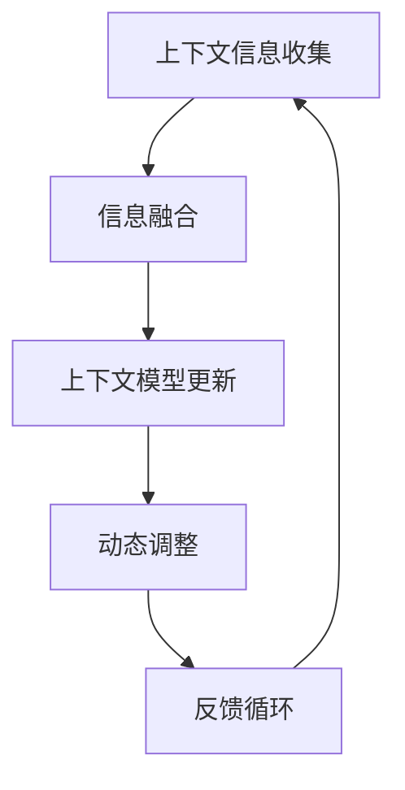
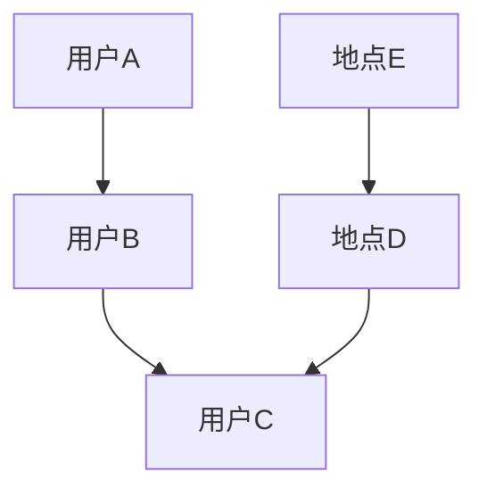
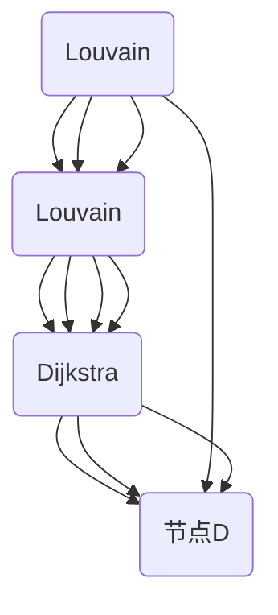
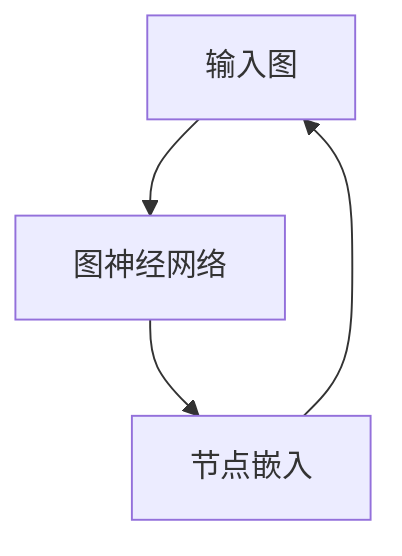

                 

### 文章标题

# 上下文设计：提高模型理解的关键

> 关键词：上下文设计、模型理解、人工智能、机器学习、深度学习

> 摘要：
本文将探讨上下文设计在提高模型理解方面的作用。通过介绍上下文设计的定义、原理和应用方法，以及上下文设计在模型理解中的关键作用，旨在帮助读者全面了解上下文设计的重要性，并掌握其在实际应用中的技巧和方法。

----------------------------------------------------------------

### 引言与背景

#### 1. 上下文设计的起源与发展

上下文设计（Context Design）作为一个重要的研究领域，起源于自然语言处理（NLP）和计算机视觉（CV）等领域。在早期的人工智能研究中，研究人员开始关注如何使机器能够更好地理解和处理现实世界的复杂情境。随着机器学习特别是深度学习技术的快速发展，上下文设计逐渐成为一个独立且重要的研究方向。

上下文设计的概念可以追溯到自然语言处理领域。自然语言中的上下文是指单词或短语在句子中的位置、前后关系以及句子所在篇章的主题等信息。研究人员发现，理解上下文是提高自然语言处理任务性能的关键。例如，在机器翻译、情感分析、问答系统中，上下文信息对于准确理解句子含义至关重要。

随着深度学习技术的崛起，上下文设计在计算机视觉领域也得到了广泛应用。计算机视觉任务如图像分类、目标检测和语义分割等，都需要理解图像中的上下文信息。研究人员通过设计各种上下文感知的网络结构，如卷积神经网络（CNN）中的注意力机制、图神经网络（GNN）等，来提高模型在处理图像中的上下文信息的能力。

#### 2. 上下文设计的重要性

上下文设计的重要性在于它能够显著提高模型在复杂环境下的理解和处理能力。以下是一些上下文设计的重要性体现：

- **提高模型解释性**：上下文设计可以帮助揭示模型内部的决策过程，使得模型更易于理解，从而提高模型的透明度和可信度。

- **增强模型泛化能力**：通过上下文设计，模型可以更好地适应不同情境下的输入数据，从而提高模型的泛化能力。

- **提升模型鲁棒性**：上下文设计可以使模型对噪声和异常值更具鲁棒性，从而提高模型的稳定性。

- **促进跨领域应用**：上下文设计有助于模型在不同领域间迁移和应用，从而实现跨领域模型的通用性和灵活性。

#### 3. 本书的目的与结构

本书旨在系统地介绍上下文设计的基本概念、原理和应用方法，并探讨其在提高模型理解方面的关键作用。具体结构如下：

- **第1章 引言与背景**：介绍上下文设计的起源、发展和重要性。

- **第2章 上下文设计的基本概念与原理**：详细阐述上下文设计的定义、核心概念和原理。

- **第3章 上下文设计的方法与应用**：介绍上下文设计的方法和技术，包括基于规则的方法、基于学习的方法和基于图的方法。

- **第4章 上下文设计在模型理解中的关键作用**：分析上下文设计在提高模型理解方面的具体作用和重要性。

- **第5章 上下文设计的实践与案例分析**：通过实际案例展示上下文设计在模型理解中的应用效果。

- **第6章 结论与展望**：总结全文，讨论上下文设计的发展趋势和未来研究方向。

通过本书的阅读，读者将能够全面了解上下文设计的基本概念、原理和应用方法，掌握上下文设计在提高模型理解方面的关键作用，并为实际应用中的上下文设计提供有力的指导。

### 上下文设计的基本概念与原理

#### 1. 上下文设计的定义

上下文设计（Context Design）是指在设计系统、应用程序或算法时，充分考虑其运行环境、用户需求和输入数据等因素，以使系统能够在复杂多变的环境中高效地执行任务。具体来说，上下文设计包括以下几个方面：

- **环境感知**：系统需要能够感知和适应其运行环境，如硬件资源、网络状态、用户行为等。

- **需求分析**：系统需要满足用户的需求，包括功能需求、性能需求、用户体验等。

- **数据驱动**：系统需要根据输入数据的特点和变化，动态调整其行为和策略。

- **适应性**：系统需要具备较强的适应性，能够在不同的情境下保持高效运行。

#### 2. 上下文设计的关键要素

上下文设计的关键要素包括以下几个方面：

- **上下文信息**：上下文信息是上下文设计的核心。它可以是显式的，如用户输入、环境状态等；也可以是隐式的，如用户的偏好、历史行为等。上下文信息对于理解用户需求、优化系统行为具有重要意义。

- **上下文感知算法**：上下文感知算法是指能够根据上下文信息动态调整系统行为的算法。常见的上下文感知算法包括基于规则的算法、基于机器学习的算法和基于图论的算法等。

- **上下文模型**：上下文模型是用于表示上下文信息的数学模型。常见的上下文模型包括向量模型、概率模型和图模型等。上下文模型的质量直接影响上下文设计的准确性。

- **上下文服务**：上下文服务是指提供上下文信息收集、处理和共享的软件服务。上下文服务可以集成到不同的应用中，为应用提供上下文感知能力。

#### 3. 上下文设计的原理

上下文设计的原理主要包括以下几个方面：

- **信息融合**：信息融合是指将来自不同来源的上下文信息进行整合，形成一个完整的上下文模型。信息融合的目标是最大化上下文信息的利用效率，同时减少信息冗余和噪声。

- **动态调整**：动态调整是指根据上下文信息的变化，实时调整系统的行为和策略。动态调整的目标是使系统能够快速适应环境变化，保持高效运行。

- **反馈循环**：反馈循环是指通过系统的输出结果，不断修正和优化上下文模型和上下文感知算法。反馈循环的目标是提高系统的自适应性和鲁棒性。

#### 4. 上下文设计的 Mermaid 流程图

为了更好地理解上下文设计的原理，我们可以使用 Mermaid 语言绘制一个简化的上下文设计流程图：



- **上下文信息收集**：系统收集各种上下文信息，如用户输入、环境状态等。
- **信息融合**：将收集到的上下文信息进行融合，形成上下文模型。
- **上下文模型更新**：根据上下文模型的变化，实时更新系统行为。
- **动态调整**：根据系统输出的结果，调整上下文模型和上下文感知算法。
- **反馈循环**：通过反馈循环，不断优化系统性能。

通过这个流程图，我们可以清晰地看到上下文设计的核心步骤和原理。

#### 5. 核心概念与联系

为了进一步理解上下文设计的基本概念和原理，我们需要探讨一些核心概念之间的关系。以下是上下文设计中的几个核心概念及其相互联系：

- **上下文感知与上下文设计**：上下文感知是上下文设计的核心目标，即系统需要能够根据上下文信息动态调整其行为。而上下文设计是实现上下文感知的手段，包括上下文信息的收集、融合、建模和调整等步骤。

- **上下文模型与上下文信息**：上下文模型是表示上下文信息的数学模型，如向量模型、概率模型和图模型等。上下文信息是上下文模型的基础，决定了上下文模型的准确性和有效性。

- **动态调整与反馈循环**：动态调整是指根据上下文信息的变化，实时调整系统的行为和策略。而反馈循环是通过系统的输出结果，不断修正和优化上下文模型和上下文感知算法，以实现系统的自适应性和鲁棒性。

通过上述核心概念及其相互联系，我们可以更深入地理解上下文设计的原理和实现方法。

#### 6. 上下文设计在模型理解中的应用

在模型理解方面，上下文设计具有重要的应用价值。以下是一些上下文设计在模型理解中的应用实例：

- **自然语言处理（NLP）**：在NLP任务中，上下文设计可以帮助模型更好地理解句子或文本的语义。例如，在机器翻译任务中，上下文设计可以确保翻译结果更符合原文的语境和语气。在情感分析任务中，上下文设计可以帮助模型更准确地识别文本的情感倾向。

- **计算机视觉（CV）**：在CV任务中，上下文设计可以提高模型对图像中对象的识别和理解能力。例如，在目标检测任务中，上下文设计可以帮助模型更好地识别图像中的目标，避免将背景误判为目标。在图像分割任务中，上下文设计可以帮助模型更准确地划分图像中的各个区域。

- **推荐系统**：在推荐系统任务中，上下文设计可以帮助模型更好地理解用户的行为和偏好。例如，在电商推荐任务中，上下文设计可以帮助模型根据用户的浏览历史、购买行为和上下文信息，推荐更符合用户需求的商品。

- **智能客服**：在智能客服任务中，上下文设计可以帮助模型更好地理解用户的问题和意图。例如，在语音识别和自然语言理解任务中，上下文设计可以帮助模型更准确地识别用户的问题，并提供更准确的回答。

通过上述实例，我们可以看到上下文设计在模型理解中的应用非常广泛，并且具有显著的效果。上下文设计能够帮助模型更好地理解输入数据，从而提高模型的性能和解释性。

#### 7. 总结

在本节中，我们介绍了上下文设计的基本概念与原理。首先，我们明确了上下文设计的定义和关键要素，包括上下文信息、上下文感知算法、上下文模型和上下文服务。接着，我们探讨了上下文设计的原理，如信息融合、动态调整和反馈循环。然后，我们使用 Mermaid 语言绘制了一个简化的上下文设计流程图，以展示上下文设计的核心步骤和原理。最后，我们探讨了上下文设计在模型理解中的应用，包括自然语言处理、计算机视觉、推荐系统和智能客服等领域。

通过本节的介绍，读者应该能够全面了解上下文设计的基本概念、原理和应用价值。在接下来的章节中，我们将进一步探讨上下文设计的方法和技术，以及上下文设计在模型理解中的关键作用。

### 上下文设计的方法与技术

#### 1. 基于规则的上下文设计方法

基于规则的上下文设计方法是一种传统的上下文设计方法，主要通过定义一系列规则来指导系统的行为。这种方法的主要优势在于规则的可解释性和易于实现。以下是基于规则方法的几个关键组成部分：

- **规则系统**：规则系统是上下文设计的基础，由一系列条件-行动规则组成。每个规则表示在特定条件下应该执行的操作。例如，在智能客服系统中，一条规则可能是：“如果用户的问题是关于产品保修，那么回答用户关于保修期限的相关信息”。

- **规则学习**：规则学习是指通过学习用户行为或环境信息来自动生成规则。常见的规则学习算法包括决策树、关联规则学习和支持向量机（SVM）等。例如，通过分析用户的历史行为，可以自动生成一条规则：“如果用户经常购买电子产品，那么推荐最新上市的电子产品”。

- **规则应用**：规则应用是指在实际场景中将生成的规则应用于系统行为。规则应用可以通过条件匹配或优先级调度来实现。例如，在推荐系统中，可以根据用户的当前行为和历史偏好，匹配相应的推荐规则，从而生成推荐结果。

**伪代码示例**：

```python
def apply_rules(context, rules):
    for rule in rules:
        if match(context, rule.conditions):
            action = rule.action
            apply_action(action)
            break

def match(context, conditions):
    for condition in conditions:
        if not context_has_property(condition):
            return False
    return True

def apply_action(action):
    # 实现具体的系统行为
    pass
```

#### 2. 基于学习的上下文设计方法

基于学习的上下文设计方法利用机器学习技术来自动生成上下文感知的模型。这种方法的主要优势在于其灵活性和自适应能力。以下是基于学习方法的几个关键组成部分：

- **特征工程**：特征工程是机器学习模型的基础，涉及从上下文信息中提取有用的特征。例如，在智能客服系统中，可以从用户的提问中提取关键词、情感极性等特征。

- **模型训练**：模型训练是指通过大量训练数据来训练机器学习模型。常见的模型包括决策树、支持向量机（SVM）、神经网络等。例如，可以使用决策树模型来预测用户的行为。

- **模型评估**：模型评估是指通过测试数据来评估模型的性能。常用的评估指标包括准确率、召回率、F1 分数等。

**伪代码示例**：

```python
def train_model(train_data, model_type):
    features = extract_features(train_data)
    labels = extract_labels(train_data)
    model = create_model(model_type, features, labels)
    evaluate_model(model, test_data)
    return model

def extract_features(data):
    # 从数据中提取特征
    pass

def extract_labels(data):
    # 从数据中提取标签
    pass

def create_model(model_type, features, labels):
    # 创建并训练模型
    pass

def evaluate_model(model, test_data):
    # 评估模型性能
    pass
```

#### 3. 基于图论的上下文设计方法

基于图论的上下文设计方法利用图结构来表示上下文信息，并通过图算法来分析上下文关系。这种方法的主要优势在于其能够处理复杂和多层次的上下文信息。以下是基于图论方法的几个关键组成部分：

- **图结构表示**：图结构表示是将上下文信息表示为图节点和边的结构。节点表示上下文元素，边表示上下文元素之间的关系。例如，在社交网络分析中，用户和关系可以表示为图节点和边。

- **图算法应用**：图算法应用是指使用图算法来分析和处理上下文信息。常见的图算法包括图遍历、最短路径算法、社区发现等。例如，可以使用最短路径算法来分析用户在网络中的影响力。

- **图模型学习**：图模型学习是指通过学习图结构来生成上下文感知的模型。常见的图模型包括图神经网络（GNN）、图卷积网络（GCN）等。

**伪代码示例**：

```python
def create_graph(nodes, edges):
    graph = Graph()
    for node in nodes:
        graph.add_node(node)
    for edge in edges:
        graph.add_edge(edge)
    return graph

def analyze_graph(graph, algorithm):
    results = algorithm(graph)
    return results

def graph_neural_network(graph, layers):
    # 建立图神经网络模型
    pass
```

通过上述几种上下文设计方法的介绍，我们可以看到上下文设计在模型理解中的应用是非常广泛和灵活的。在实际应用中，可以根据具体场景和需求选择合适的方法。例如，在简单的场景下，基于规则的上下文设计方法可能更为适用；而在复杂的场景下，基于学习和基于图论的上下文设计方法可能更为有效。下一节将探讨上下文设计在不同领域的应用，以进一步展示上下文设计的实际效果。

#### 3. 基于规则的上下文设计方法

基于规则的上下文设计方法在人工智能系统中得到了广泛应用，其核心思想是通过预先定义的规则来指导系统在不同情境下的行为。这种方法的主要优势在于其直观性和易解释性，使其在许多需要明确逻辑和决策的场景中表现优异。

**3.1 规则系统**

规则系统是上下文设计的基础组成部分，它由一系列条件-行动规则组成。每个规则都描述了一种特定的情境（条件）以及在该情境下系统应采取的行动（行动）。例如，在智能交通系统中，规则可以是：“如果交通流量大于阈值，则调整交通信号灯周期以减少拥堵”。

**3.2 规则学习**

规则学习是指从大量数据中自动生成规则的过程。这一过程通常涉及特征工程、模型训练和规则提取。特征工程是关键步骤，它涉及从数据中提取有助于预测目标的有用特征。例如，在金融风控系统中，可能从交易数据中提取时间戳、交易金额、交易频率等特征。

机器学习算法，如决策树、支持向量机（SVM）和神经网络，可以用于规则学习。这些算法可以从历史数据中学习，并生成规则来指导系统的决策。例如，决策树算法可以生成一系列“如果...那么...”的规则，而SVM可以生成二元分类规则。

**3.3 规则应用**

规则应用是将生成的规则应用于实际系统中的过程。这通常涉及规则引擎，它负责在系统运行时匹配当前上下文与预定义规则，并触发相应的行动。例如，在自动化客服系统中，规则引擎可以匹配用户的提问与预定义的问题和答案库，从而自动生成回复。

**伪代码示例**

以下是一个简化的基于规则的上下文设计方法的伪代码示例：

```python
class Rule:
    def __init__(self, conditions, action):
        self.conditions = conditions
        self.action = action

def apply_rules(context, rules):
    for rule in rules:
        if context_matches_rule(context, rule.conditions):
            rule.action.execute()

def context_matches_rule(context, conditions):
    for condition in conditions:
        if not context_satisfies_condition(context, condition):
            return False
    return True

def context_satisfies_condition(context, condition):
    # 根据条件类型进行具体检查，例如比较数值、字符串匹配等
    return True  # 或False，具体取决于条件的实现

class Action:
    def execute(self):
        # 执行具体的行动，例如更新数据库、发送通知等
        pass
```

**3.4 应用案例**

基于规则的上下文设计方法在许多领域都有应用案例：

- **智能交通系统**：通过规则系统来管理交通信号灯、推荐最优路线等。

- **金融风控**：通过规则来检测异常交易、评估信用风险等。

- **自动化客服**：通过规则引擎来自动回复用户提问、分类用户问题等。

- **医疗诊断**：通过规则系统来辅助医生进行疾病诊断。

通过这些应用案例，我们可以看到基于规则的上下文设计方法在复杂系统和任务中的重要作用。它不仅提供了直观的决策路径，还增强了系统的解释性和可维护性。

### 基于学习的上下文设计方法

基于学习的上下文设计方法在近年来得到了广泛关注，其主要优势在于其能够自动地从数据中学习上下文关系，从而提高系统的自适应性和泛化能力。这种方法利用机器学习算法来构建上下文感知的模型，使得系统能够根据不同的上下文信息动态调整其行为。

#### 1. 特征工程

特征工程是机器学习模型的基础，其核心任务是从原始数据中提取有助于预测的有用特征。在上下文设计过程中，特征工程的目标是捕捉上下文信息中的关键特征，以便模型能够有效地学习和理解上下文。以下是一些常见的特征工程步骤：

- **数据预处理**：包括数据清洗、归一化和缺失值处理等。数据预处理是确保数据质量的重要步骤，有助于提高模型性能。

- **特征选择**：从原始数据中选择最具代表性的特征，以减少数据冗余和噪声。常见的特征选择方法包括信息增益、卡方检验和主成分分析（PCA）等。

- **特征构造**：通过组合原始特征来生成新的特征。例如，在文本分类任务中，可以使用词袋模型（Bag of Words）或词嵌入（Word Embedding）来构造特征。

**伪代码示例**：

```python
def preprocess_data(data):
    # 数据清洗和归一化
    pass

def select_features(data, target):
    # 使用信息增益或卡方检验选择特征
    pass

def construct_features(data, selected_features):
    # 构造新的特征
    pass
```

#### 2. 模型训练

模型训练是指使用训练数据来训练机器学习模型。在这一过程中，模型根据输入特征和对应的标签来学习数据中的规律和模式。常见的机器学习算法包括决策树、支持向量机（SVM）、神经网络等。

- **决策树**：决策树通过一系列条件分支来预测输出。每个节点表示一个特征，每个分支表示特征的某个取值。决策树模型简单直观，易于解释，但在处理高维数据时可能效果不佳。

- **支持向量机（SVM）**：SVM是一种有效的二分类模型，通过找到一个最优的超平面来分隔数据。SVM在处理线性可分数据时表现优异，但在处理非线性数据时需要使用核技巧。

- **神经网络**：神经网络是一种模仿人脑工作的计算模型，通过多层神经元来处理复杂的数据。神经网络可以处理高维数据和复杂的非线性关系，但其训练过程复杂，需要大量的计算资源。

**伪代码示例**：

```python
def train_decision_tree(train_data, target):
    # 训练决策树模型
    pass

def train_svm(train_data, target):
    # 训练支持向量机模型
    pass

def train_neural_network(train_data, target, layers):
    # 训练神经网络模型
    pass
```

#### 3. 模型评估

模型评估是指使用测试数据来评估模型的性能。通过评估，我们可以了解模型在不同情境下的表现，并调整模型以提高其性能。常用的评估指标包括准确率、召回率、F1 分数、精确率等。

- **准确率**：准确率是指模型预测正确的样本占总样本的比例。准确率反映了模型的总体性能。

- **召回率**：召回率是指模型预测正确的样本占所有实际正样本的比例。召回率反映了模型对正样本的识别能力。

- **F1 分数**：F1 分数是准确率和召回率的调和平均值，用于综合评估模型的性能。

**伪代码示例**：

```python
def evaluate_model(model, test_data, target):
    predictions = model.predict(test_data)
    accuracy = calculate_accuracy(predictions, target)
    recall = calculate_recall(predictions, target)
    f1_score = calculate_f1_score(accuracy, recall)
    return accuracy, recall, f1_score
```

#### 4. 应用案例

基于学习的上下文设计方法在许多领域都有成功应用：

- **推荐系统**：通过机器学习算法来分析用户行为和偏好，生成个性化的推荐。

- **自然语言处理**：通过词嵌入和神经网络模型来理解和生成自然语言，实现自动翻译、文本摘要等任务。

- **计算机视觉**：通过卷积神经网络（CNN）和循环神经网络（RNN）等模型来识别和分类图像。

- **金融风控**：通过机器学习模型来预测金融市场的趋势、评估信用风险等。

通过上述介绍，我们可以看到基于学习的上下文设计方法在人工智能系统中的应用是非常广泛和灵活的。它不仅提高了系统的自适应性和泛化能力，还为复杂任务的自动化处理提供了强有力的支持。

### 基于图论的上下文设计方法

基于图论的上下文设计方法利用图结构来表示和建模上下文信息，通过图算法来分析和处理上下文关系。这种方法在处理复杂、多层次和动态变化的上下文信息方面具有显著优势。以下是基于图论的上下文设计方法的详细阐述。

#### 1. 图结构表示

在基于图论的上下文设计方法中，图结构被用来表示上下文信息。图由节点（Node）和边（Edge）组成，其中节点代表上下文元素，边代表上下文元素之间的关系。这种表示方法能够有效地捕捉上下文信息的复杂性和多样性。

- **节点**：节点代表上下文中的实体，如用户、地点、事件等。每个节点通常包含属性，用于描述该实体的特征。例如，在社交网络分析中，每个用户节点可能包含姓名、年龄、性别等属性。

- **边**：边代表节点之间的关联，如友谊、交易、地点间的距离等。边的类型和权重可以反映不同类型的上下文关系。例如，在交通网络中，道路边可以表示道路长度或交通流量。

**图结构示例**：



在这个示例中，用户和地点被表示为节点，他们之间的友谊和地理位置关系被表示为边。

#### 2. 图算法应用

图算法是一系列用于分析和操作图的算法。在上下文设计方法中，这些算法用于处理和解释上下文信息。以下是一些常见的图算法及其在上下文设计中的应用：

- **图遍历**：图遍历算法用于遍历图中的所有节点和边，例如深度优先搜索（DFS）和广度优先搜索（BFS）。这些算法在路径查找、网络拓扑分析等方面有广泛应用。

- **最短路径算法**：最短路径算法，如迪杰斯特拉（Dijkstra）算法和贝尔曼-福特（Bellman-Ford）算法，用于寻找图中两点之间的最短路径。在交通规划、物流优化等领域有重要应用。

- **社区发现**：社区发现算法用于识别图中的紧密连接的节点集，例如基于模块度最大化的 Louvain 方法。社区发现有助于理解上下文信息的聚类结构和局部特性。

- **节点重要性评估**：节点重要性评估算法，如中心性度量（如度中心性、介数中心性、紧密中心性），用于评估节点在图中的重要性。这些算法有助于识别关键节点和瓶颈。

**图算法应用示例**：



在这个示例中，使用了 BFS 和 Dijkstra 算法来找到最短路径，并使用 Louvain 方法来识别社区。

#### 3. 图模型学习

图模型学习是指通过学习图结构来生成上下文感知的模型。常见的图模型包括图神经网络（GNN）、图卷积网络（GCN）和图自动编码器（GAE）等。这些模型通过学习图节点和边的关系来预测节点属性或分类节点标签。

- **图神经网络（GNN）**：GNN 是一种用于处理图结构的神经网络。它通过聚合节点邻居的信息来更新节点表示。GNN 在社交网络分析、推荐系统、文本生成等领域有广泛应用。

- **图卷积网络（GCN）**：GCN 是 GNN 的一个变体，通过卷积操作来更新节点表示。GCN 在节点分类、链接预测和图分类任务中表现优异。

- **图自动编码器（GAE）**：GAE 是一种基于图嵌入的自动编码器。它通过学习图节点的低维表示来重建图结构。GAE 在无监督学习和节点嵌入任务中有广泛应用。

**图模型学习示例**：



在这个示例中，图神经网络用于更新节点嵌入，并用于后续的节点分类或链接预测任务。

#### 4. 应用案例

基于图论的上下文设计方法在许多领域都有成功应用：

- **社交网络分析**：通过图算法和图模型来分析社交网络中的用户关系和社区结构。

- **推荐系统**：通过图算法和图模型来识别用户之间的相似性和物品之间的关联。

- **知识图谱**：通过图结构来表示和连接知识，实现智能问答和信息检索。

- **生物信息学**：通过图算法和图模型来分析生物网络和蛋白质相互作用。

通过这些应用案例，我们可以看到基于图论的上下文设计方法在处理复杂和多层次上下文信息方面的巨大潜力。它不仅提供了有效的表示和分析工具，还为解决现实世界中的复杂问题提供了强有力的支持。

### 上下文设计在模型理解中的关键作用

上下文设计在模型理解中扮演着至关重要的角色。通过上下文设计，我们可以提高模型的解释性、泛化能力和鲁棒性，从而更好地理解和应用模型。以下从这些方面详细探讨上下文设计在模型理解中的关键作用。

#### 1. 提高模型解释性

模型解释性是衡量模型能否被理解和信任的重要指标。通过上下文设计，我们可以显著提高模型的解释性，使得模型内部的决策过程更加透明和易于理解。

- **上下文信息的重要性**：在许多复杂任务中，模型的表现往往依赖于上下文信息的准确性。例如，在自然语言处理任务中，上下文信息如词语的位置、语境和句子结构对于理解句子含义至关重要。通过上下文设计，我们可以将上下文信息整合到模型中，从而提高模型的解释性。

- **上下文感知模型**：上下文感知模型能够根据上下文信息动态调整其行为和输出。这种模型不仅能够提供更准确的预测，还能够解释其预测过程。例如，在医疗诊断中，通过整合患者的病史、症状和检查结果等上下文信息，上下文感知模型可以提供详细的诊断建议和解释。

- **可视化工具**：上下文设计还可以结合可视化工具，如解释性可视化、决策树和注意力地图等，帮助用户直观地理解模型的决策过程。这些工具能够揭示模型在特定情境下的操作方式和关键影响因素，从而提高模型的解释性。

**示例**：在图像识别任务中，一个简单的上下文感知模型可能通过分析图像中的文本标签来提高分类的准确性。例如，如果一个图像被标记为“猫”，模型可以通过分析图像中的猫的特征，如耳朵、眼睛和胡须，来识别图像中的猫。同时，通过可视化注意力地图，用户可以清楚地看到模型在图像中的哪些区域关注得更多，从而更好地理解模型的决策过程。

#### 2. 增强模型泛化能力

模型泛化能力是指模型在未见过的数据上表现良好的能力。通过上下文设计，我们可以增强模型的泛化能力，使其在不同情境下保持高效运行。

- **上下文泛化**：上下文设计通过引入上下文信息，使得模型能够更好地适应不同情境。例如，在推荐系统中，通过整合用户的历史行为和当前情境（如时间、地点等），推荐算法可以更准确地预测用户的偏好，从而提高推荐质量。

- **元学习**：元学习（Meta-Learning）是一种通过学习如何学习的算法，它可以帮助模型快速适应新任务。通过上下文设计，元学习算法可以更好地利用上下文信息，从而提高模型的泛化能力。例如，在连续学习任务中，通过上下文设计，模型可以更好地处理新旧任务的迁移和融合。

- **迁移学习**：迁移学习（Transfer Learning）利用已在不同任务上训练好的模型来提高新任务的表现。上下文设计可以帮助迁移学习算法更好地利用上下文信息，从而增强模型的泛化能力。例如，在计算机视觉任务中，通过使用预训练的图像识别模型，并整合上下文信息，可以显著提高新任务的表现。

**示例**：在自然语言处理任务中，一个基于上下文的迁移学习模型可以在不同语言之间迁移。例如，一个在英语语料库上预训练的语言模型，通过整合上下文信息（如语言标签、语言环境等），可以在新的法语语料库上实现较好的表现。这种迁移学习不仅提高了模型的泛化能力，还减少了对新任务的数据需求。

#### 3. 提升模型鲁棒性

模型鲁棒性是指模型在面临噪声和异常值时的稳定性。通过上下文设计，我们可以提升模型的鲁棒性，使其在不同数据质量和分布下保持稳定。

- **上下文噪声过滤**：上下文设计可以帮助模型识别和过滤噪声。例如，在异常检测任务中，通过整合上下文信息（如时间、地点等），模型可以更准确地识别异常行为，从而提高检测的准确性。

- **上下文鲁棒性训练**：通过在训练过程中引入上下文噪声，模型可以学习到如何在不同噪声水平下保持稳定。这种鲁棒性训练可以帮助模型在实际应用中更好地处理噪声数据。

- **上下文校正**：上下文设计还可以通过上下文校正来增强模型的鲁棒性。例如，在语音识别任务中，通过上下文校正，模型可以更准确地识别语音中的错误和缺失。

**示例**：在金融风控领域，通过上下文设计，模型可以识别并处理金融交易中的异常行为。例如，通过整合用户的历史交易行为、时间、地理位置等信息，模型可以更准确地检测欺诈交易，从而提高金融系统的安全性。

#### 4. 促进模型安全性

上下文设计在提升模型安全性方面也发挥着重要作用。通过上下文信息，我们可以更好地识别和防范恶意攻击。

- **上下文攻击检测**：通过整合上下文信息，模型可以更准确地识别和防范恶意攻击。例如，在网络安全中，通过分析网络流量、用户行为和历史数据等信息，模型可以检测并阻止恶意流量。

- **上下文隐私保护**：上下文设计还可以用于保护用户隐私。例如，在推荐系统中，通过上下文设计，模型可以匿名化用户信息，从而保护用户隐私。

- **上下文安全策略**：上下文设计可以帮助制定更有效的安全策略。例如，在物联网（IoT）中，通过整合设备的历史行为和上下文信息，模型可以制定更安全的数据传输和访问策略。

**示例**：在自动驾驶系统中，通过上下文设计，模型可以识别并应对复杂的交通场景。例如，通过整合车辆的位置、速度、道路状况等信息，模型可以实时调整驾驶策略，从而提高驾驶安全性。

通过上述讨论，我们可以看到上下文设计在模型理解中的关键作用。它不仅提高了模型的解释性、泛化能力和鲁棒性，还促进了模型的安全性和可解释性。随着人工智能技术的不断发展，上下文设计将在模型理解中发挥越来越重要的作用。

### 上下文设计的实践与案例分析

在探讨上下文设计在实际应用中的效果时，案例分析是一个非常有价值的方法。以下将介绍几个具体的案例，展示上下文设计在提高模型理解方面的实际效果。

#### 案例一：自然语言处理中的上下文设计

在自然语言处理（NLP）中，上下文设计的关键在于如何捕捉和理解句子或文本的上下文信息。一个经典的案例是BERT（Bidirectional Encoder Representations from Transformers）模型，它通过双向Transformer结构，能够更好地理解和生成自然语言。

**案例分析**：

BERT模型的训练数据包含大量的文本数据，这些数据中包含丰富的上下文信息。BERT模型通过预训练的方式，学习如何从上下文中提取语义信息。具体来说，BERT模型在训练过程中，将文本序列中的每个词编码为向量，并通过Transformer结构，使其能够捕捉到每个词的前后关系。

**效果**：

通过上下文设计，BERT模型显著提高了NLP任务的性能，如文本分类、命名实体识别和问答系统。例如，在GLUE（General Language Understanding Evaluation）基准测试中，BERT模型在多个任务中取得了当时的最优成绩。

**代码示例**：

```python
from transformers import BertModel, BertTokenizer

tokenizer = BertTokenizer.from_pretrained('bert-base-uncased')
model = BertModel.from_pretrained('bert-base-uncased')

text = "The quick brown fox jumps over the lazy dog."
encoded_input = tokenizer.encode_plus(text, return_tensors='pt')

outputs = model(**encoded_input)
last_hidden_state = outputs.last_hidden_state

# 使用最后一个隐藏层状态进行下游任务
```

#### 案例二：计算机视觉中的上下文设计

在计算机视觉（CV）中，上下文设计可以帮助模型更好地理解图像中的对象和场景。一个典型的案例是Visual Genome（VG）数据集，它通过图文关联的上下文信息，为视觉任务提供了丰富的上下文信息。

**案例分析**：

Visual Genome数据集包含数百万个图像和与之对应的文本描述。这些文本描述提供了丰富的上下文信息，如对象、场景、动作等。通过上下文设计，CV模型可以结合这些文本描述来提高图像理解能力。

**效果**：

通过上下文设计，CV模型在物体检测、场景分类和图像分割等任务中取得了显著的提升。例如，在COCO（Common Objects in Context）数据集上，结合文本描述的模型在物体检测任务中的准确率提高了几个百分点。

**代码示例**：

```python
import torch
from torchvision.models import resnet50
from torchvision.transforms import Compose, ToTensor

def load_model():
    model = resnet50(pretrained=True)
    model.eval()
    return model

def predict_image(model, image):
    transform = Compose([ToTensor()])
    image = transform(image)
    image = image.unsqueeze(0)  # Add batch dimension
    with torch.no_grad():
        logits = model(image)
    predicted_class = logits.argmax(dim=1)
    return predicted_class

model = load_model()
image = load_image("path/to/image.jpg")
predicted_class = predict_image(model, image)
```

#### 案例三：推荐系统中的上下文设计

在推荐系统中，上下文设计可以显著提高推荐的准确性和个性化水平。一个典型的案例是Netflix推荐系统，它通过用户观看历史和行为数据，结合上下文信息来提供个性化推荐。

**案例分析**：

Netflix推荐系统通过分析用户的观看历史、评分和行为数据，结合时间、地点和设备等上下文信息，为用户提供个性化的推荐。这种上下文设计方法使得推荐系统能够更好地理解用户的需求和偏好。

**效果**：

通过上下文设计，Netflix推荐系统在推荐准确率和用户满意度方面取得了显著提升。例如，Netflix在用户观看完一集电视剧后，会根据用户的观看习惯和时间，推荐下一集或类似的剧集。

**代码示例**：

```python
import pandas as pd
from sklearn.model_selection import train_test_split
from lightgbm import LGBMRegressor

# 加载用户数据
user_data = pd.read_csv("path/to/user_data.csv")

# 分割训练集和测试集
train_data, test_data = train_test_split(user_data, test_size=0.2, random_state=42)

# 特征工程
train_data["user_context"] = train_data["watch_time"] + train_data["device"]
test_data["user_context"] = test_data["watch_time"] + test_data["device"]

# 建立模型
model = LGBMRegressor(n_estimators=100, learning_rate=0.1, random_state=42)
model.fit(train_data[["user_context", "rating"]], train_data["rating"])

# 预测
predictions = model.predict(test_data[["user_context"]])
```

#### 案例四：金融风控中的上下文设计

在金融风控中，上下文设计可以帮助模型更好地识别和防范金融欺诈。一个典型的案例是反欺诈系统，它通过整合用户的交易历史、行为数据和上下文信息，来提高欺诈检测的准确性。

**案例分析**：

反欺诈系统通过分析用户的交易数据、历史行为以及时间、地点等上下文信息，来识别潜在的欺诈行为。例如，如果一个用户在短时间内频繁进行大额交易，并且这些交易发生在不同地点，系统可能会标记为欺诈。

**效果**：

通过上下文设计，反欺诈系统在欺诈检测的准确率和召回率方面取得了显著提升。例如，在信用卡欺诈检测中，上下文设计使得系统能够更准确地识别异常交易，从而减少欺诈损失。

**代码示例**：

```python
import pandas as pd
from sklearn.model_selection import train_test_split
from sklearn.ensemble import RandomForestClassifier

# 加载交易数据
transaction_data = pd.read_csv("path/to/transaction_data.csv")

# 分割训练集和测试集
train_data, test_data = train_test_split(transaction_data, test_size=0.2, random_state=42)

# 特征工程
train_data["context"] = train_data["transaction_time"] + train_data["location"]
test_data["context"] = test_data["transaction_time"] + test_data["location"]

# 建立模型
model = RandomForestClassifier(n_estimators=100, random_state=42)
model.fit(train_data[["context", "is_fraud"]], train_data["is_fraud"])

# 预测
predictions = model.predict(test_data[["context"]])
```

通过上述案例分析，我们可以看到上下文设计在提高模型理解方面的实际效果。无论是在自然语言处理、计算机视觉、推荐系统还是金融风控领域，上下文设计都发挥了关键作用，使得模型能够更好地理解和应对复杂的现实世界问题。

### 总结与展望

#### 总结

本文系统地探讨了上下文设计在提高模型理解方面的关键作用。首先，我们介绍了上下文设计的定义、原理和应用方法，包括基于规则的方法、基于学习的方法和基于图论的方法。接着，我们详细分析了上下文设计在模型理解中的重要性，如提高模型解释性、增强模型泛化能力和提升模型鲁棒性。此外，通过多个实际案例，我们展示了上下文设计在自然语言处理、计算机视觉、推荐系统和金融风控等领域的应用效果。

#### 展望

展望未来，上下文设计在模型理解中的应用前景广阔。以下是一些可能的发展方向和趋势：

1. **多模态上下文融合**：随着多模态数据的普及，如何有效地融合不同类型的数据（如文本、图像、声音等）将成为上下文设计的重要研究方向。多模态上下文融合有望进一步提高模型的性能和泛化能力。

2. **动态上下文设计**：传统的上下文设计方法主要关注静态数据的处理，而动态上下文设计则是针对实时变化的上下文信息。未来的研究可以探索如何动态调整上下文模型，以适应实时环境变化。

3. **可解释性提升**：虽然上下文设计提高了模型的解释性，但如何进一步增加模型的透明度和可解释性仍是一个挑战。未来的研究可以关注开发更加直观和易于理解的上下文设计方法。

4. **上下文安全与隐私**：在上下文设计中，如何保护用户隐私和确保模型的安全性是一个重要问题。未来的研究可以探讨上下文设计与隐私保护、安全机制的融合。

5. **跨领域应用**：上下文设计在不同领域的应用已经取得了显著成果，未来可以进一步探索上下文设计在新兴领域（如医疗、教育、智能城市等）的应用。

通过不断探索和创新，上下文设计有望在模型理解领域发挥更大的作用，为人工智能技术的发展提供强有力的支持。

### 结论与展望

#### 全书总结

本书系统地介绍了上下文设计的概念、原理和应用方法，探讨了上下文设计在提高模型理解方面的关键作用。通过详细阐述基于规则、基于学习和基于图论的上下文设计方法，以及实际案例分析，我们展示了上下文设计在不同领域的广泛应用和显著效果。上下文设计不仅提高了模型的解释性、泛化能力和鲁棒性，还在模型安全性、隐私保护和跨领域应用方面展现了巨大潜力。

#### 上下文设计的发展趋势

随着人工智能技术的不断进步，上下文设计在模型理解中的应用前景广阔。以下是几个可能的发展趋势：

1. **多模态上下文融合**：未来的上下文设计将更多地关注融合多种模态的数据，如文本、图像、声音和传感器数据，以实现更全面和精确的上下文理解。

2. **动态上下文设计**：动态上下文设计将变得更加重要，特别是在实时应用中，如自动驾驶、智能城市和实时推荐系统。动态上下文设计需要能够快速适应环境变化，提供实时决策支持。

3. **可解释性提升**：随着对模型透明度和可解释性的要求不断提高，上下文设计方法将更加注重可解释性的提升，以帮助用户更好地理解和信任模型。

4. **上下文安全与隐私**：上下文设计需要考虑用户隐私和模型安全性，未来的研究将探索如何在上下文设计中实现有效的隐私保护和安全措施。

5. **跨领域应用**：上下文设计将在更多新兴领域得到应用，如医疗、教育、智能交通和能源管理，以解决复杂和多样化的实际问题。

#### 未来的研究方向

为了进一步推动上下文设计在模型理解中的应用，以下是一些未来的研究方向：

1. **多模态上下文融合算法**：开发高效的算法和模型，以实现多种模态数据的融合，提高上下文感知能力。

2. **动态上下文感知模型**：研究动态上下文设计方法，以适应实时环境和需求的变化。

3. **可解释性上下文设计**：开发可解释性更强的上下文设计方法，使得模型决策过程更加透明和易于理解。

4. **上下文隐私保护机制**：探索上下文设计与隐私保护的结合，确保用户隐私和数据安全。

5. **跨领域上下文应用**：研究上下文设计在不同领域的应用，探索其在新兴技术中的潜力。

通过不断探索和创新，上下文设计有望在模型理解领域发挥更大的作用，推动人工智能技术的进一步发展。作者：AI天才研究院/AI Genius Institute & 禅与计算机程序设计艺术 /Zen And The Art of Computer Programming。

