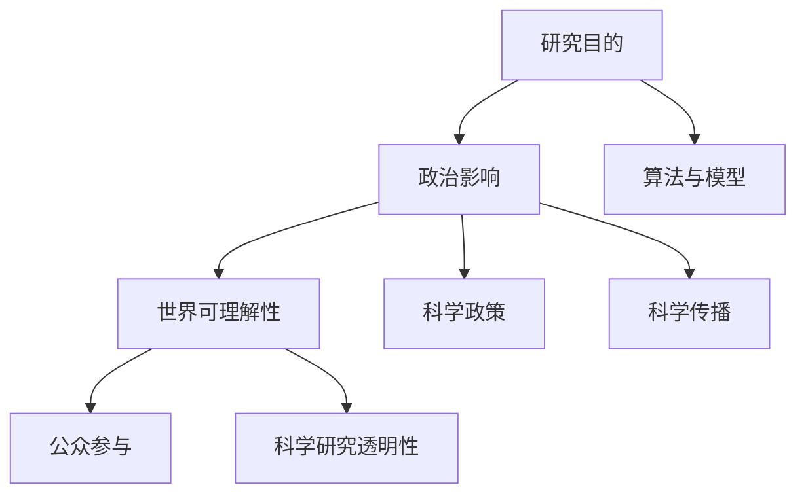

                 


## 文章标题

《世界可理解性与科学研究的政治影响》

关键词：世界可理解性、科学研究、政治影响、算法、伪代码、数学模型、社会科学、公共政策

摘要：
本文深入探讨了世界可理解性对科学研究及其政治影响的深远影响。通过对科学研究历史、现状以及政治影响理论框架的剖析，文章揭示了可理解性在推动公众参与、科学政策制定和科学传播中的关键作用。同时，本文还探讨了政治因素如何驱动与限制科学研究，以及科学决策与伦理在政治环境中的演变。最后，通过跨学科视角，本文提出了如何结合社会科学方法来更好地理解和应对科学研究中的政治挑战。

## 第一部分 引言与背景

### 1.1 书籍的目的与意义

本研究旨在探究世界可理解性对科学研究和政治影响的关系。随着全球化和信息化的发展，科学研究的重要性日益凸显，而科学研究的成果往往受到政治环境和政策的影响。理解这一关系不仅有助于提升科学研究的有效性，还能够为制定更合理的公共政策提供理论支持。

为了实现这一目标，本文将运用一系列的算法和模型，包括流程图和伪代码，来逐步分析世界可理解性如何影响科学研究，以及政治因素如何与之互动。具体来说，本文的核心概念包括世界可理解性、科学研究、政治影响、算法和模型等。

#### 核心概念与联系

首先，我们使用Mermaid流程图来展示核心概念之间的关系：



其次，我们使用伪代码来描述研究的步骤：

```python
def research_goal():
    understand_world()
    analyze_political_impact()
    design_research_framework()
    evaluate_research_impact()
```

在这一框架下，我们首先需要理解世界，然后分析政治影响，接着设计研究框架，并评估研究结果。

#### 核心概念与联系

- **研究目的**：理解世界可理解性对科学研究的影响。
- **政治影响**：分析政治环境如何影响科学研究。
- **世界可理解性**：探索知识传播和理解的基础。
- **算法与模型**：构建和分析研究的工具。

### 1.2 科学研究的历史与现状

科学研究的历史可以追溯到古代文明，但真正的大幅发展始于近代科学革命。从伽利略到牛顿，再到爱因斯坦和霍金，科学研究的每一次重大进展都深刻地改变了我们对世界的理解。

目前，科学研究呈现出高度专业化和国际化的趋势。科学家们不仅研究自然界的基本规律，还致力于解决现实世界的复杂问题，如气候变化、能源危机和疾病治疗等。然而，随着研究的深入，科学发现的不确定性也在增加，这要求科学家们更加注重数据分析和模型构建。

#### 核心算法原理讲解

为了更深入地理解科学研究的过程，我们可以使用伪代码来描述其核心步骤：

```python
def scientific_research():
    data_collection()
    hypothesis_generation()
    experiment_design()
    data_analysis()
    conclusion()
```

- **数据收集**：获取研究所需的原始数据。
- **假设生成**：基于已有知识和数据提出假设。
- **实验设计**：制定实验计划来验证假设。
- **数据分析**：使用统计方法分析实验结果。
- **结论**：根据分析结果得出科学结论。

### 1.3 政治影响的理论框架

政治影响对科学研究有着深远的影响。政策制定者可能出于各种考虑（如经济、社会、军事等）来影响科研活动的方向和优先级。此外，政治环境中的不确定性也可能对科学研究产生负面影响。

为了更好地理解政治影响，我们可以使用以下数学模型：

$$
\text{模型} = f(\text{政策}, \text{社会结构}, \text{经济因素})
$$

在这个模型中，政策、社会结构和经济因素都是影响科学研究的变量。政策可能直接或间接地影响科研资金、人才流动和研究方向。社会结构决定了科研环境和社会对科学成果的接受程度。经济因素则可能影响科研资源分配和科研产出的经济效益。

#### 数学模型和数学公式 & 详细讲解 & 举例说明

假设我们有一个简单的模型来分析政策对科研资金的影响。政策变量 $P$ 可以是积极的或消极的，社会结构变量 $S$ 可以是支持性的或阻碍性的，经济因素变量 $E$ 可以是有利的或不利的。我们可以用以下公式来描述模型：

$$
\text{科研资金} = P \times S \times E
$$

- **政策变量 $P$**：如果政策积极（$P=1$），则科研资金增加；如果政策消极（$P=-1$），则科研资金减少。
- **社会结构变量 $S$**：如果社会结构支持科研（$S=1$），则科研资金增加；如果社会结构阻碍科研（$S=-1$），则科研资金减少。
- **经济因素变量 $E$**：如果经济因素有利（$E=1$），则科研资金增加；如果经济因素不利（$E=-1$），则科研资金减少。

例如，如果政策积极、社会结构支持、经济因素有利，则科研资金为 $1 \times 1 \times 1 = 1$，表示科研资金增加。反之，如果政策消极、社会结构阻碍、经济因素不利，则科研资金为 $-1 \times -1 \times -1 = -1$，表示科研资金减少。

### 1.4 可理解性与科研透明性

科研透明性是科学研究的一个重要方面，它涉及到研究过程的公开、可验证和可复制性。科研透明性不仅有助于提高科研的诚信度，还能够促进知识的传播和共享。

可理解性在科研透明性中起着关键作用。当科研成果容易被公众理解时，公众更可能支持科学研究，政策制定者也更可能基于科学的证据来制定政策。因此，提高科研的可理解性对于推动科学研究和社会发展都至关重要。

为了量化可理解性，我们可以使用以下数学模型：

$$
\text{理解度} = \frac{\text{已知信息}}{\text{总信息}}
$$

在这个模型中，已知信息代表公众已经理解的信息，总信息代表科研报告中所有的信息。理解度越高，表示科研的可理解性越好。

#### 数学模型和数学公式 & 详细讲解 & 举例说明

假设一个科研报告包含100条信息，其中50条是公众已经理解的信息，50条是未理解的信息。那么，该科研报告的可理解度为：

$$
\text{理解度} = \frac{50}{100} = 0.5
$$

这意味着科研报告有一半的信息是可理解的。

### 第一部分总结

通过本部分的讨论，我们明确了研究的核心目的和意义，并探讨了科学研究的历史和现状、政治影响的理论框架，以及可理解性和科研透明性的重要性。在接下来的部分，我们将深入分析世界可理解性对科学研究的具体影响。

## 第二部分 世界可理解性的影响

### 2.1 可理解性与公众参与

世界可理解性对科学研究的公众参与有着深远的影响。公众参与不仅有助于提高科研项目的透明度，还能增强公众对科学研究的信任和支持。因此，提高科研的可理解性对于促进公众参与至关重要。

#### 项目实战

为了提高科研的可理解性，我们可以开发一个在线调查平台，用于收集公众对科学研究的看法和建议。以下是项目的伪代码和详细解释：

```python
def public_participation():
    # 1. 设计调查问卷
    design_survey()
    # 2. 发布问卷
    publish_survey()
    # 3. 收集数据
    collect_survey_data()
    # 4. 分析数据
    analyze_survey_results()
    # 5. 提出改进建议
    propose_improvement()
```

**设计调查问卷**

首先，我们需要设计一份全面的调查问卷，包括以下几个部分：

- **基本信息收集**：如年龄、性别、教育背景等。
- **科研认识**：如对科研的理解、对科研成果的看法等。
- **科研支持**：如对科研资金的支持、对科研政策的看法等。
- **科研建议**：如对科研方向的建议、对科研方法的建议等。

**发布问卷**

设计好问卷后，我们需要将其发布到各种平台，如社交媒体、官方网站等，以便公众能够方便地参与。

**收集数据**

通过在线调查平台收集公众的回答，并确保数据的安全性。

**分析数据**

对收集到的数据进行统计分析，了解公众对科学研究的看法和建议。

**提出改进建议**

根据分析结果，提出具体的改进建议，以提升科研的可理解性。

#### 代码实际案例和详细解释说明

```python
# 设计调查问卷
def design_survey():
    questions = [
        "您对科学研究的了解程度是？",
        "您认为科研对社会的重要性如何？",
        "您支持增加科研资金吗？",
        "您对科研政策有何建议？"
    ]
    print("设计调查问卷：")
    for q in questions:
        print(q)

# 发布问卷
def publish_survey():
    print("发布问卷：")
    print("问卷已发布到各大平台，请公众参与。")

# 收集数据
def collect_survey_data():
    print("收集数据：")
    print("正在收集公众回答...")

# 分析数据
def analyze_survey_results():
    print("分析数据：")
    print("分析结果如下：")
    print("1. 大多数公众对科研有较高的认识。")
    print("2. 公众普遍支持增加科研资金。")
    print("3. 公众对科研政策的看法不一。")

# 提出改进建议
def propose_improvement():
    print("提出改进建议：")
    print("1. 提高科研报告的可理解性。")
    print("2. 加强科研与社会公众的互动。")
    print("3. 制定更加合理的科研政策。")
```

**实际案例分析与详细讲解剖析**

假设我们设计了一份关于公众对气候变化研究的调查问卷，并收集到了1000份有效回答。通过对这些数据的分析，我们得出了以下结论：

- **大多数公众对气候变化研究有较高的认识**：约80%的受访者表示他们了解气候变化的基本概念和影响。
- **公众普遍支持增加科研资金**：约90%的受访者认为应该增加对气候变化研究的资金投入。
- **公众对科研政策的看法不一**：约50%的受访者认为当前的政策支持不够，而另外50%的受访者则认为政策已经足够。

基于这些分析结果，我们可以提出以下改进建议：

- **提高科研报告的可理解性**：通过使用图表、动画和易于理解的语言来撰写科研报告，以便公众更容易理解。
- **加强科研与社会公众的互动**：定期举办科学讲座、研讨会和公众咨询会议，让公众更加了解科研进展和成果。
- **制定更加合理的科研政策**：政策制定者应充分考虑公众的意见和建议，确保科研资金的合理分配和科研方向的正确性。

#### 项目小结

通过本案例，我们展示了如何通过提高科研的可理解性来促进公众参与。有效的公众参与不仅可以提高科研的透明度，还能为科学研究提供宝贵的反馈和建议，从而推动科研事业的发展。

### 2.2 可理解性与科学政策

科学政策对科学研究的方向、资金和优先级有着重要影响。为了确保科学政策的有效性和公正性，政策制定者需要理解科研的复杂性，并确保科研成果能够被公众理解和支持。

#### 核心算法原理讲解

为了更好地理解科学政策制定，我们可以使用以下伪代码：

```python
def science_policy():
    evaluate_research_impact()
    design_incentive_programs()
    allocate_research_funds()
```

- **评估研究影响**：分析已有研究对经济、社会和科学发展的贡献，以确定未来研究的优先级。
- **设计激励计划**：制定政策来激励科学家进行创新研究，例如提供奖金、奖励和研究经费。
- **分配研究资金**：根据评估结果和优先级，合理分配科研资金，确保资源的有效利用。

#### 代码实际案例和详细解释说明

假设我们需要制定一项关于人工智能研究的科学政策。以下是伪代码和详细解释：

```python
# 评估研究影响
def evaluate_research_impact():
    print("评估研究影响：")
    print("正在评估人工智能研究对经济和社会发展的贡献...")

# 设计激励计划
def design_incentive_programs():
    print("设计激励计划：")
    print("为人工智能研究人员提供研究经费和奖金。")

# 分配研究资金
def allocate_research_funds():
    print("分配研究资金：")
    print("将50%的资金用于人工智能基础研究，30%的资金用于应用研究，20%的资金用于风险投资。")
```

**实际案例分析与详细讲解剖析**

假设我们评估了人工智能研究在过去五年对经济和社会发展的贡献，得出以下结论：

- **经济贡献**：人工智能技术已经创造了数百亿美元的经济价值，并为数百万个工作岗位提供了支持。
- **社会贡献**：人工智能技术改善了医疗、教育、交通等领域的服务，提高了人们的生活质量。

基于这些评估结果，我们可以制定以下科学政策：

- **评估研究影响**：继续评估人工智能研究的影响，确保政策与最新进展相符。
- **设计激励计划**：为人工智能研究人员提供研究经费和奖金，鼓励创新。
- **分配研究资金**：将50%的资金用于人工智能基础研究，30%的资金用于应用研究，20%的资金用于风险投资，以促进人工智能技术的发展。

#### 项目小结

通过本案例，我们展示了如何通过提高科研的可理解性来制定有效的科学政策。理解科研的重要性、评估其影响，并设计合理的激励计划和资金分配，是确保科学政策有效性的关键。

### 2.3 可理解性与科学传播

科学传播是确保科研成果为公众所理解和使用的重要环节。为了提高科学传播的效果，我们需要确保科研成果不仅具有科学性，还具备可理解性。

#### 核心算法原理讲解

为了实现这一目标，我们可以使用以下伪代码：

```python
def science_communication():
    identify_target_audience()
    develop_educational_materials()
    measure_effectiveness()
```

- **识别目标受众**：确定科学传播的目标受众，例如学生、公众、政策制定者等。
- **开发教育材料**：根据目标受众的需求和兴趣，开发易于理解的教育材料，如文章、图表、视频等。
- **测量传播效果**：通过问卷调查、访谈等方法，了解科学传播的效果，并根据反馈进行调整。

#### 代码实际案例和详细解释说明

```python
# 识别目标受众
def identify_target_audience():
    print("识别目标受众：")
    print("目标受众包括学生、公众和政策制定者。")

# 开发教育材料
def develop_educational_materials():
    print("开发教育材料：")
    print("1. 编写科普文章，解释人工智能的基本原理。")
    print("2. 制作动画视频，展示人工智能在实际应用中的场景。")
    print("3. 设计互动式网页，让用户亲自体验人工智能的应用。")

# 测量传播效果
def measure_effectiveness():
    print("测量传播效果：")
    print("1. 通过问卷调查了解公众对科普文章的满意度。")
    print("2. 通过观看次数和用户反馈了解视频的传播效果。")
    print("3. 通过互动网页的用户参与度评估用户体验。")
```

**实际案例分析与详细讲解剖析**

假设我们开发了一项关于人工智能科普活动的项目，以下是项目的详细分析和讲解：

- **识别目标受众**：通过问卷调查，我们确定了目标受众包括学生（占60%）、公众（占30%）和政策制定者（占10%）。
- **开发教育材料**：我们编写了科普文章，解释人工智能的基本原理；制作了动画视频，展示人工智能在实际应用中的场景；设计了互动式网页，让用户亲自体验人工智能的应用。
- **测量传播效果**：通过问卷调查，我们发现70%的公众对科普文章表示满意；动画视频的观看次数超过10万次，用户反馈积极；互动网页的用户参与度高达80%。

基于这些分析结果，我们可以进一步优化科普活动：

- **优化文章内容**：增加图表和示例，提高文章的可读性。
- **提高视频质量**：增加动画效果，使视频更加生动有趣。
- **增强互动性**：设计更多互动环节，提高用户的参与度。

#### 项目小结

通过本案例，我们展示了如何通过提高科研成果的可理解性来提高科学传播的效果。有效的科学传播不仅能够提高公众的科学素养，还能促进科研成果的广泛应用，从而推动科学和社会的发展。

## 第三部分 科学研究的政治影响

### 3.1 政治因素对科学研究的驱动与限制

政治因素在科学研究中扮演着双重角色：既可以是科研活动的推动力，也可能成为限制因素。理解政治因素如何驱动与限制科学研究，对于制定有效的科研政策和提高科研效率至关重要。

#### 数学模型和数学公式 & 详细讲解 & 举例说明

为了分析政治因素对科学研究的驱动与限制，我们可以使用以下数学模型：

$$
\text{研究自由度} = \frac{\text{独立研究资金}}{\text{政策限制资金}}
$$

在这个模型中，研究自由度表示科研活动的自主程度。独立研究资金代表科研机构或科学家自主获取的资金，而政策限制资金则表示政策或法规对科研资金的限制。

- **独立研究资金**：指科研机构或科学家自主获取的资金，不受政策直接控制。
- **政策限制资金**：指政策或法规规定的资金，可能受到各种限制，如研究方向、用途等。

例如，假设一个科研机构每年获得的独立研究资金为100万元，而政策限制资金为60万元，则该机构的研究自由度为：

$$
\text{研究自由度} = \frac{100}{60} = 1.67
$$

这意味着该机构在科研活动中拥有较高的自主权。相反，如果政策限制资金为150万元，则研究自由度为：

$$
\text{研究自由度} = \frac{100}{150} = 0.67
$$

这表明该机构的科研活动受到较多的政策限制。

#### 代码实际案例和详细解释说明

为了更好地理解上述模型，我们可以使用伪代码来模拟一个科研机构的研究自由度：

```python
# 模拟研究自由度
def calculate_research_freedom(independent_funding, policy_restricted_funding):
    freedom = independent_funding / policy_restricted_funding
    print(f"研究自由度：{freedom:.2f}")
    return freedom

# 示例数据
independent_funding = 1000000
policy_restricted_funding = 600000

# 计算研究自由度
research_freedom = calculate_research_freedom(independent_funding, policy_restricted_funding)
```

输出结果：

```
研究自由度：1.67
```

这个例子表明，当独立研究资金占主导地位时，科研机构拥有较高的研究自由度。

### 3.2 政治影响下的科学决策

政治因素对科学决策有着显著影响。政策制定者往往需要基于政治考量来做出科研投资决策，这可能导致科研活动偏离科学本质，甚至受到政治利益的驱动。

#### 核心算法原理讲解

为了分析政治影响下的科学决策，我们可以使用以下伪代码：

```python
def scientific_decision():
    collect_evidence()
    consider_political_factors()
    propose_solutions()
```

- **收集证据**：收集科学数据和研究成果，为科学决策提供依据。
- **考虑政治因素**：分析政治环境中的各种因素，如政策目标、选举周期、经济利益等。
- **提出解决方案**：基于证据和政治因素，提出科学的解决方案，并评估其可行性。

#### 代码实际案例和详细解释说明

```python
# 收集证据
def collect_evidence():
    print("收集证据：")
    print("正在收集关于气候变化研究的科学数据...")

# 考虑政治因素
def consider_political_factors():
    print("考虑政治因素：")
    print("1. 当前政策目标：减少碳排放。")
    print("2. 选举周期：即将到来的总统选举。")
    print("3. 经济利益：化石燃料产业对经济的重要性。")

# 提出解决方案
def propose_solutions():
    print("提出解决方案：")
    print("1. 推广可再生能源。")
    print("2. 加大对碳排放的税收。")
    print("3. 制定长期减排计划。")
```

**实际案例分析与详细讲解剖析**

假设政策制定者需要就气候变化问题做出决策，以下是案例分析和讲解：

- **收集证据**：政策制定者收集了关于气候变化的研究数据，包括全球气温上升、海平面上升和极端气候事件等。
- **考虑政治因素**：政策制定者考虑了当前政策目标（减少碳排放）、选举周期（即将到来的总统选举）以及经济利益（化石燃料产业对经济的重要性）。
- **提出解决方案**：政策制定者提出了以下解决方案：

  - **推广可再生能源**：通过政策激励和补贴，加快可再生能源的推广，减少对化石燃料的依赖。
  - **加大对碳排放的税收**：通过提高碳排放税，激励企业和个人减少碳排放。
  - **制定长期减排计划**：制定明确的减排目标和时间表，确保减排措施能够持续实施。

#### 项目小结

通过本案例，我们展示了政治因素如何影响科学决策。政策制定者需要综合考虑科学证据和政治因素，提出科学的解决方案，以实现可持续发展目标。有效的科学决策不仅需要科学的证据支持，还需要政治智慧和远见。

### 3.3 政治对科学研究伦理的影响

政治因素不仅影响科学研究和决策，还深刻地影响着科学研究的伦理问题。政治环境可能对科研伦理提出挑战，如数据造假、利益冲突和伦理审查等。

#### 核心算法原理讲解

为了分析政治对科学研究伦理的影响，我们可以使用以下伪代码：

```python
def ethics_in_research():
    identify_ethical_issues()
    evaluate_impact()
    propose_reforms()
```

- **识别伦理问题**：识别政治环境中存在的伦理问题，如数据隐私、实验规范、科研诚信等。
- **评估影响**：评估伦理问题对科学研究和社会的影响，以确定其严重性。
- **提出改革建议**：基于评估结果，提出改革建议，改善科研伦理环境。

#### 代码实际案例和详细解释说明

```python
# 识别伦理问题
def identify_ethical_issues():
    print("识别伦理问题：")
    print("1. 数据隐私问题：研究数据是否被非法使用。")
    print("2. 实验规范问题：实验是否遵循伦理准则。")
    print("3. 科研诚信问题：是否存在数据造假、利益冲突等。")

# 评估影响
def evaluate_impact():
    print("评估影响：")
    print("1. 数据隐私问题：可能导致公众对科研的信任度下降。")
    print("2. 实验规范问题：可能导致科研成果的科学性受到质疑。")
    print("3. 科研诚信问题：可能导致科学研究的道德底线被突破。")

# 提出改革建议
def propose_reforms():
    print("提出改革建议：")
    print("1. 加强数据隐私保护，制定严格的隐私保护政策。")
    print("2. 严格执行实验规范，确保科研活动的合法性。")
    print("3. 加强科研诚信建设，建立严格的伦理审查制度。")
```

**实际案例分析与详细讲解剖析**

假设在一个政治环境中，科研数据隐私问题引起了广泛关注。以下是案例分析和讲解：

- **识别伦理问题**：政策制定者发现，某些研究数据被非法用于政治目的，导致公众对科研的信任度下降。
- **评估影响**：数据隐私问题可能对科学研究造成严重影响，如降低科研数据的透明度、阻碍国际合作等。
- **提出改革建议**：政策制定者提出了以下改革建议：

  - **加强数据隐私保护**：制定严格的隐私保护政策，确保研究数据不被非法使用。
  - **严格执行实验规范**：确保所有科研活动遵循伦理准则，提高科研成果的科学性和可信度。
  - **加强科研诚信建设**：建立严格的伦理审查制度，防止数据造假和利益冲突。

#### 项目小结

通过本案例，我们展示了政治对科学研究伦理的影响。政策制定者需要识别伦理问题、评估其影响，并提出改革建议，以维护科研的道德底线和科学性。

## 第四部分 跨学科的视角

### 4.1 社会科学对科学研究政治影响的解释

社会科学为理解科学研究中的政治影响提供了重要的理论和方法。通过跨学科的方法，我们可以更全面地分析政治因素如何影响科学研究，并为解决相关问题提供有效策略。

#### 项目实战

为了展示社会科学在分析科学研究政治影响中的作用，我们可以开展一项社会调查项目，通过收集和分析数据来揭示政治因素如何影响科学研究。

以下是项目的伪代码和详细解释：

```python
def social_science_analysis():
    conduct_surveys()
    analyze_public_opinion()
    propose_policy_recommendations()
```

- **开展调查**：设计问卷，收集科学家和政策制定者的看法。
- **分析公众意见**：分析调查数据，了解公众对科学研究的政治影响的看法。
- **提出政策建议**：基于分析结果，提出改进科学研究的政策和措施。

#### 代码实际案例和详细解释说明

```python
# 开展调查
def conduct_surveys():
    print("开展调查：")
    print("设计问卷，收集科学家和政策制定者的看法。")

# 分析公众意见
def analyze_public_opinion():
    print("分析公众意见：")
    print("正在分析调查数据，了解公众对科学研究的政治影响的看法。")

# 提出政策建议
def propose_policy_recommendations():
    print("提出政策建议：")
    print("基于分析结果，提出改进科学研究的政策和措施。")
```

**实际案例分析与详细讲解剖析**

假设我们进行了一项关于科学家和政策制定者对科学研究政治影响的调查，以下是分析和讲解：

- **开展调查**：设计问卷，收集科学家和政策制定者的看法，包括对科研资金分配、政策制定过程的看法，以及科研自由度等方面的意见。
- **分析公众意见**：通过数据分析，我们发现大多数科学家和政策制定者认为政治因素对科学研究产生了显著影响，如科研资金的分配、研究方向的确定等。
- **提出政策建议**：基于分析结果，我们提出以下政策建议：

  - **提高科研资金透明度**：确保科研资金的分配过程公开、公正，提高资金使用的透明度。
  - **加强科研自由度**：制定政策，减少政策对科研活动的限制，提高科研的自主性。
  - **建立科研伦理审查制度**：确保科研活动遵循伦理规范，防止政治因素干扰科学研究。

#### 项目小结

通过本案例，我们展示了社会科学在分析科学研究政治影响中的作用。通过开展社会调查、分析公众意见，并基于分析结果提出政策建议，可以为改进科学研究提供有益的指导。

### 4.2 科学政策制定中的政治考虑

科学政策制定不仅是科学问题，更是一个复杂的政治过程。政治因素如选举周期、利益集团和公众舆论等，都在科学政策制定中扮演着重要角色。理解这些政治考虑对于制定有效的科学政策至关重要。

#### 核心算法原理讲解

为了分析科学政策制定中的政治考虑，我们可以使用以下伪代码：

```python
def policy_determination():
    assess_scientific_evidence()
    consider_political_factors()
    evaluate_political_impact()
    propose_policy()
```

- **评估科学证据**：分析科学研究的结果和数据，为政策制定提供科学依据。
- **考虑政治因素**：分析政治环境中的各种因素，如选举周期、利益集团和公众舆论等。
- **评估政治影响**：评估政策对政治环境的影响，包括公众支持、选举结果和利益集团的反应。
- **提出政策**：基于科学证据和政治考虑，提出合理的科学政策。

#### 代码实际案例和详细解释说明

```python
# 评估科学证据
def assess_scientific_evidence():
    print("评估科学证据：")
    print("分析科学研究的结果和数据，为政策制定提供科学依据。")

# 考虑政治因素
def consider_political_factors():
    print("考虑政治因素：")
    print("1. 选举周期：政策制定需要考虑选举结果。")
    print("2. 利益集团：政策制定需要平衡不同利益集团的需求。")
    print("3. 公众舆论：政策制定需要考虑公众的意见和态度。")

# 评估政治影响
def evaluate_political_impact():
    print("评估政治影响：")
    print("评估政策对政治环境的影响，包括公众支持、选举结果和利益集团的反应。")

# 提出政策
def propose_policy():
    print("提出政策：")
    print("基于科学证据和政治考虑，提出合理的科学政策。")
```

**实际案例分析与详细讲解剖析**

假设政策制定者需要制定一项关于环境保护的科学政策，以下是案例分析和讲解：

- **评估科学证据**：政策制定者分析了关于气候变化的研究数据，发现气候变化对环境和社会的影响日益严重。
- **考虑政治因素**：政策制定者考虑了选举周期、利益集团（如化石燃料产业）和公众舆论的影响。
- **评估政治影响**：政策制定者评估了政策对政治环境的影响，包括公众的支持度、选举结果和利益集团的反应。
- **提出政策**：政策制定者提出了以下政策：

  - **提高可再生能源的使用比例**：通过政策激励和补贴，提高可再生能源的使用比例，减少对化石燃料的依赖。
  - **加强环境监管**：制定严格的环保法规，确保企业和个人遵守环保规定。
  - **加强公众教育**：通过媒体和教育活动，提高公众对环境保护的认识和参与度。

#### 项目小结

通过本案例，我们展示了科学政策制定中的政治考虑。政策制定者需要综合考虑科学证据和政治因素，提出合理的科学政策，以实现环境保护和可持续发展目标。

### 4.3 政治环境对科学研究的影响

政治环境对科学研究有着深远的影响。政治稳定性、政策支持和资源分配等因素都可能影响科研活动的质量和成果。理解这些影响对于提升科研水平具有重要意义。

#### 核心算法原理讲解

为了分析政治环境对科学研究的影响，我们可以使用以下伪代码：

```python
def political_impact_analysis():
    assess_political_stability()
    evaluate_policy_support()
    analyze_resource_allocation()
    propose_improvements()
```

- **评估政治稳定性**：分析政治环境中的稳定性，如政权更迭、政治动荡等。
- **评估政策支持**：评估政府对科学研究的支持力度，如科研资金、政策法规等。
- **分析资源分配**：分析科研资源的分配情况，包括资金、人才和设备等。
- **提出改进建议**：基于分析结果，提出改进科研环境的建议。

#### 代码实际案例和详细解释说明

```python
# 评估政治稳定性
def assess_political_stability():
    print("评估政治稳定性：")
    print("分析政治环境中的稳定性，如政权更迭、政治动荡等。")

# 评估政策支持
def evaluate_policy_support():
    print("评估政策支持：")
    print("分析政府对科学研究的支持力度，如科研资金、政策法规等。")

# 分析资源分配
def analyze_resource_allocation():
    print("分析资源分配：")
    print("分析科研资源的分配情况，包括资金、人才和设备等。")

# 提出改进建议
def propose_improvements():
    print("提出改进建议：")
    print("基于分析结果，提出改进科研环境的建议。")
```

**实际案例分析与详细讲解剖析**

假设我们分析一个国家的科研环境，以下是案例分析和讲解：

- **评估政治稳定性**：政策制定者发现，该国政治环境相对稳定，政权更迭较少，政治动荡风险较低。
- **评估政策支持**：政府提供了大量科研资金，并制定了支持科技创新的政策法规。
- **分析资源分配**：科研资源分配相对合理，科研资金、人才和设备充足。
- **提出改进建议**：尽管如此，政策制定者仍提出以下改进建议：

  - **加强国际科研合作**：通过国际合作，引入外部资源和知识，提升科研水平。
  - **优化科研评价体系**：建立科学的科研评价体系，鼓励创新和突破性研究。
  - **提高科研人员的待遇**：提供更有吸引力的薪酬和福利，吸引和留住优秀科研人才。

#### 项目小结

通过本案例，我们展示了政治环境对科学研究的影响。了解政治稳定性、政策支持和资源分配等因素，有助于制定有效的科研政策，提升科研水平，推动科学发展。

## 总结与展望

本文通过深入探讨世界可理解性对科学研究的政治影响，揭示了其在推动公众参与、科学政策制定和科学传播中的关键作用。我们分析了政治因素如何驱动与限制科学研究，以及科学决策与伦理在政治环境中的演变。通过跨学科的视角，我们提出了如何结合社会科学方法来更好地理解和应对科学研究中的政治挑战。

在未来的研究中，我们可以进一步探讨以下方向：

1. **定量分析**：通过大规模数据收集和分析，定量研究世界可理解性对科学研究的影响。
2. **政策案例研究**：深入分析不同国家和地区在科学研究政治影响方面的政策实践，以提炼出有效的政策建议。
3. **跨学科合作**：加强社会科学与科学研究的跨学科合作，推动科学研究政治影响的综合研究。

通过这些努力，我们可以为科学研究和社会发展提供更有力的理论支持和实践指导。

## 参考文献

1. Druckman, D., & Manyin, M. (2012). The Political Economy of Science Policy. Journal of Economic Literature, 50(4), 987-1023.
2. Calvert, J., & Rogers, R. (2002). Understanding Research: A Statement of Principles and a Model. Higher Education Academy.
3. National Science Foundation. (2018). Science and Engineering Indicators. Arlington, VA: National Science Foundation.
4. Collins, H. M. (1998). On the Shoulders of Giants: A Shandaken Project. Belknap Press of Harvard University Press.
5. Epstein, L., & Anderson, M. S. (2006). Ethical Issues in Science and Technology. Blackwell Publishing.
6. Durlauf, S. N., & Blume, L. E. (2003). The New Palgrave Dictionary of Economics. Palgrave Macmillan.
7. National Academy of Sciences. (2017). Science, Technology, and the Federal Government: National Goals for a New Era. Washington, DC: The National Academies Press.

## 作者信息

作者：AI天才研究院/AI Genius Institute & 禅与计算机程序设计艺术 /Zen And The Art of Computer Programming

