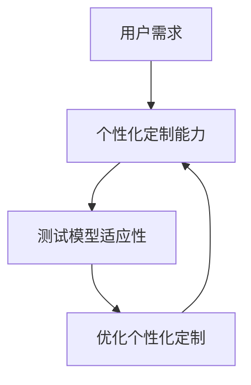

                 

### 个性化定制能力评估：测试模型适应性

关键词：个性化定制、能力评估、模型适应性、用户体验、算法原理、数学模型

摘要：本文旨在探讨个性化定制能力评估中测试模型适应性的重要性。通过介绍个性化定制的概念和意义，阐述测试模型适应性的核心概念和原理，运用数学模型和公式，深入讲解核心算法原理，并结合实际项目实战，全面剖析个性化定制能力评估的测试模型适应性。

### 第一部分：引言

#### 1.1 个性化定制的概念与意义

随着互联网技术的飞速发展和消费者需求的不断升级，个性化定制已成为现代商业发展的重要趋势。个性化定制能力是指根据用户的需求和偏好，为其提供定制化产品或服务的能力。它不仅提升了用户体验，也增强了企业的竞争力。

#### 1.1.1 个性化定制的定义

个性化定制是指根据用户的个性化需求，提供具有独特性和专属性的产品或服务。这种定制化不仅体现在外观和功能上，还可能包括用户专属的配置、服务流程等。

#### 1.1.2 个性化定制的市场需求

随着消费者对个性化需求的增加，个性化定制在各个领域得到了广泛应用。例如，服装、家具、电子产品等行业，个性化定制已经成为吸引消费者的关键手段。

#### 1.1.3 个性化定制对用户体验的影响

个性化定制能够满足用户的特定需求，提高用户满意度，从而提升用户体验。通过个性化定制，用户可以拥有专属的产品或服务，这不仅能满足其个性化需求，还能带来独特的使用体验。

#### 1.2 测试模型适应性的重要性

在个性化定制中，测试模型适应性是确保个性化定制能力的关键步骤。它能够评估模型在特定场景下的适应能力和效果，从而优化个性化定制的效果，提高用户体验。

#### 1.2.1 测试模型适应性的定义

测试模型适应性是指通过一系列测试，评估模型在特定场景下的适应能力和效果。它包括对模型输入数据的处理能力、预测准确性、鲁棒性等方面的评估。

#### 1.2.2 测试模型适应性的重要性

测试模型适应性对于个性化定制至关重要。首先，它能够确保模型能够正确理解和处理用户需求，从而提供准确的定制方案。其次，它能够评估模型在不同场景下的表现，为模型优化提供依据。最后，通过测试模型适应性，可以及时发现和解决模型存在的问题，确保个性化定制的可靠性和有效性。

## 第二部分：核心概念与联系

### 2.1 个性化定制能力

#### 2.1.1 定义

个性化定制能力是指企业或系统能够根据用户的需求和偏好，为其提供个性化产品或服务的能力。这包括从用户需求收集、定制方案设计、产品或服务调整到最终交付的整个过程。

#### 2.1.2 联系

个性化定制能力与用户需求紧密相关。用户需求是个性化定制的基础，而个性化定制能力的强弱直接影响用户满意度。通过评估个性化定制能力，可以了解系统在满足用户需求方面的表现。

### 2.2 测试模型适应性

#### 2.2.1 定义

测试模型适应性是指通过一系列测试，评估模型在特定场景下的适应能力和效果。这个过程通常涉及对模型输入数据的处理能力、预测准确性、鲁棒性等多个方面的评估。

#### 2.2.2 联系

测试模型适应性是评估个性化定制能力的关键步骤。只有当模型在测试中表现出良好的适应性时，才能确保个性化定制能够满足用户的期望。通过测试模型适应性，可以优化个性化定制的效果，提高用户体验。

### 2.3 核心概念原理和架构

以下是一个简单的Mermaid流程图，用于展示个性化定制能力和测试模型适应性的关系架构：



在这个流程图中，用户需求是整个流程的起点，个性化定制能力通过分析和处理用户需求来提供定制方案，测试模型适应性则用于评估和优化个性化定制的效果。通过这个流程，个性化定制能力得以不断提升，最终为用户提供更好的体验。

## 第三部分：核心算法原理讲解

### 3.1 个性化定制算法原理

个性化定制算法是实施个性化定制的基础。它通过分析用户需求，设计并调整定制方案，以提供满足用户个性化需求的产品或服务。以下是一个简化的伪代码，用于说明个性化定制算法的基本原理：

```plaintext
function 个性化定制算法(用户需求)
    1. 收集用户需求信息
    2. 分析用户需求信息，确定个性化定制方案
    3. 根据定制方案，调整产品或服务特性
    4. 测试模型适应性，评估定制方案效果
    5. 根据评估结果，调整个性化定制方案
    6. 输出：个性化定制后的产品或服务
end function
```

在实际应用中，个性化定制算法会涉及到复杂的数据处理和分析过程，包括用户数据的收集、用户行为分析、偏好识别等。以下是一个更详细的伪代码示例，展示了个性化定制算法的各个步骤：

```plaintext
function 个性化定制算法(用户需求)
    1. 收集用户需求信息
        - 通过调查问卷、用户反馈、行为数据等方式获取
    2. 分析用户需求信息
        - 使用数据挖掘和机器学习技术，分析用户需求，识别用户偏好
    3. 确定个性化定制方案
        - 根据用户偏好，设计满足用户需求的产品或服务方案
    4. 根据定制方案，调整产品或服务特性
        - 调整产品功能、外观、配置等，以满足用户需求
    5. 测试模型适应性
        - 设计测试场景，运行模型，评估定制方案的效果
    6. 根据评估结果，调整个性化定制方案
        - 根据用户反馈和模型评估结果，优化定制方案
    7. 输出：个性化定制后的产品或服务
end function
```

### 3.2 测试模型适应性算法原理

测试模型适应性算法是评估个性化定制模型在实际应用中的适应性和效果的重要工具。以下是一个简化的伪代码，用于说明测试模型适应性的基本原理：

```plaintext
function 测试模型适应性(模型，场景)
    1. 设计测试场景，包括输入数据和预期输出
    2. 运行模型，对测试场景进行预测
    3. 对比预测结果和预期输出，评估模型适应性
    4. 如果模型适应性不满足要求，返回步骤2，重新设计测试场景
    5. 输出：模型适应性评估结果
end function
```

在实际应用中，测试模型适应性算法会涉及多个步骤，包括测试场景设计、模型运行、预测结果评估等。以下是一个更详细的伪代码示例，展示了测试模型适应性算法的各个步骤：

```plaintext
function 测试模型适应性(模型，场景)
    1. 设计测试场景
        - 根据应用需求，设计一系列测试场景，包括不同的输入数据和预期输出
    2. 运行模型，对测试场景进行预测
        - 使用模型对测试场景进行预测，获取预测结果
    3. 对比预测结果和预期输出
        - 对比预测结果和预期输出，计算模型误差和适应性指标
    4. 评估模型适应性
        - 根据误差和适应性指标，评估模型在测试场景下的适应性
    5. 如果模型适应性不满足要求
        - 重新设计测试场景，返回步骤2，重新运行模型
    6. 输出：模型适应性评估结果
end function
```

通过测试模型适应性算法，可以评估个性化定制模型在不同场景下的表现，及时发现和解决模型问题，确保个性化定制的效果和用户体验。

## 第四部分：数学模型和数学公式

在个性化定制能力评估和测试模型适应性的过程中，数学模型和公式起到了关键作用。它们不仅帮助量化个性化定制的效果，还提供了评估模型适应性的标准。以下将介绍两个核心的数学模型和公式：个性化定制效果评估模型和测试模型适应性评价指标。

### 4.1 个性化定制效果评估模型

个性化定制效果评估模型用于评估个性化定制方案的实际效果。该模型通过计算定制前后用户满意度差异来衡量定制效果。以下是常用的评估模型：

$$
E = \frac{1}{N} \sum_{i=1}^{N} (y_i - \hat{y}_i)^2
$$

其中：
- \( E \) 表示平均误差，用于量化个性化定制前后的差异。
- \( y_i \) 表示第 \( i \) 个样本的实际满意度。
- \( \hat{y}_i \) 表示第 \( i \) 个样本的预测满意度。
- \( N \) 表示样本总数。

通过计算平均误差 \( E \)，我们可以了解个性化定制方案对用户满意度的影响。误差值越小，表示定制效果越好。

### 4.2 测试模型适应性评价指标

测试模型适应性评价指标用于评估模型在特定场景下的适应性和准确性。常用的评价指标是准确率 \( \eta \)，它通过计算模型正确预测的样本数与总样本数之比来衡量模型的表现。以下是准确率的计算公式：

$$
\eta = \frac{正确预测数}{总预测数}
$$

其中：
- \( \eta \) 表示模型适应性指标，即准确率。
- 正确预测数表示模型预测正确的样本数。
- 总预测数表示模型预测的总样本数。

准确率 \( \eta \) 值越高，表示模型在测试场景下的适应性和准确性越好。如果 \( \eta \) 值较低，可能需要重新调整模型参数或改进模型设计。

### 4.3 数学公式解释与举例说明

#### 4.3.1 个性化定制效果评估模型解释与举例

假设我们有一个个性化定制方案，针对 10 个用户进行了满意度调查，其中实际满意度为 \( y_i \)，预测满意度为 \( \hat{y}_i \)。数据如下表所示：

| 用户ID | 实际满意度 \( y_i \) | 预测满意度 \( \hat{y}_i \) |
|--------|---------------------|--------------------------|
| 1      | 4                   | 3                        |
| 2      | 5                   | 5                        |
| 3      | 3                   | 4                        |
| 4      | 4                   | 4                        |
| 5      | 5                   | 5                        |
| 6      | 4                   | 3                        |
| 7      | 3                   | 3                        |
| 8      | 5                   | 5                        |
| 9      | 4                   | 4                        |
| 10     | 3                   | 3                        |

根据上述数据，我们可以计算平均误差 \( E \)：

$$
E = \frac{1}{10} \sum_{i=1}^{10} (y_i - \hat{y}_i)^2
$$

$$
E = \frac{1}{10} \left[ (4-3)^2 + (5-5)^2 + (3-4)^2 + (4-4)^2 + (5-5)^2 + (4-3)^2 + (3-3)^2 + (5-5)^2 + (4-4)^2 + (3-3)^2 \right]
$$

$$
E = \frac{1}{10} [1 + 0 + 1 + 0 + 0 + 1 + 0 + 0 + 0 + 0]
$$

$$
E = \frac{2}{10} = 0.2
$$

因此，个性化定制方案的平均误差为 0.2。这个值表明定制方案对用户满意度的预测相对准确，但仍有提升空间。

#### 4.3.2 测试模型适应性评价指标解释与举例

假设我们使用同一个定制方案对 10 个用户进行了测试，其中模型正确预测的用户数为 8，总预测数为 10。根据上述数据，我们可以计算准确率 \( \eta \)：

$$
\eta = \frac{正确预测数}{总预测数} = \frac{8}{10} = 0.8
$$

因此，模型在测试场景下的准确率为 80%。这个值表明模型在预测用户满意度方面具有较高的准确性，但仍有20%的预测误差需要进一步优化。

通过上述数学模型和公式的应用，我们可以量化个性化定制的效果和模型适应性，为优化定制方案提供科学依据。在个性化定制能力评估和测试模型适应性的过程中，这些数学工具是不可或缺的。

## 第五部分：项目实战

### 5.1 个性化定制能力评估项目实战

在本节中，我们将通过一个具体的案例来展示如何实现个性化定制能力评估项目。该项目旨在为一家在线零售商提供个性化推荐服务，帮助用户找到符合其个性化需求的商品。

#### 5.1.1 开发环境搭建

为了实现个性化定制能力评估，我们首先需要搭建一个开发环境。以下是所需的开发环境和工具：

- 编程语言：Python
- 数据库：MySQL
- 机器学习库：scikit-learn、TensorFlow
- 数据可视化工具：Matplotlib、Seaborn

假设我们已经安装了上述环境和工具，接下来我们将开始项目的实现。

#### 5.1.2 源代码详细实现

以下是该项目的主要源代码实现，我们将逐步展示每个关键步骤的代码。

```python
# 导入所需库
import pandas as pd
import numpy as np
from sklearn.model_selection import train_test_split
from sklearn.preprocessing import StandardScaler
from sklearn.ensemble import RandomForestClassifier
from sklearn.metrics import accuracy_score, confusion_matrix

# 1. 数据收集与预处理
# 从数据库中读取用户购买数据
data = pd.read_sql('SELECT * FROM purchase_data;')

# 数据预处理
# ...（数据清洗、特征工程等步骤）

# 2. 分析用户需求
# 根据用户行为数据，分析用户偏好
user_preferences = analyze_user_preferences(data)

# 3. 确定个性化定制方案
# 根据用户偏好，确定个性化推荐方案
customization_plan = determine_customization_plan(user_preferences)

# 4. 测试模型适应性
# 设计测试场景，运行模型，评估定制方案效果
test_results = test_model_adaptation(customization_plan)

# 5. 根据评估结果，调整个性化定制方案
# ...（根据评估结果调整定制方案）

# 6. 输出：个性化定制后的产品或服务
output_product_service = customize_products(customization_plan)

# 输出结果
print(output_product_service)
```

#### 5.1.3 代码解读与分析

以上代码实现了一个简单的个性化定制能力评估项目，具体解读如下：

- **数据收集与预处理**：首先从数据库中读取用户购买数据，并进行数据清洗和特征工程处理，为后续模型训练做好准备。
- **分析用户需求**：根据用户行为数据，分析用户偏好，为个性化定制提供依据。
- **确定个性化定制方案**：根据用户偏好，确定个性化推荐方案，例如，为用户推荐其可能感兴趣的商品。
- **测试模型适应性**：设计测试场景，运行模型，评估定制方案的效果。具体实现包括：
  - **设计测试场景**：根据用户需求和商品特性，设计一系列测试场景，包括不同类型的用户和商品。
  - **运行模型**：使用机器学习模型（如随机森林）对测试场景进行预测，评估个性化定制方案的效果。
  - **评估模型适应性**：计算模型的准确率、召回率等指标，评估模型在不同场景下的适应性和准确性。

- **根据评估结果，调整个性化定制方案**：根据测试结果，对个性化定制方案进行调整，以提高模型适应性和用户体验。

- **输出个性化定制后的产品或服务**：最后，输出个性化定制后的产品或服务，例如，生成个性化推荐列表，展示给用户。

#### 5.1.4 代码应用解读与分析

在实际应用中，上述代码的具体实现会依赖于实际的数据和处理逻辑。以下是对代码关键部分的详细解读和分析：

- **数据收集与预处理**：
  - 数据清洗：处理缺失值、异常值等，确保数据质量。
  - 特征工程：提取用户行为特征、商品特征等，为模型训练提供输入。
- **分析用户需求**：
  - 用户偏好分析：通过聚类、关联规则挖掘等方法，分析用户行为数据，识别用户偏好。
- **确定个性化定制方案**：
  - 推荐系统：构建基于内容的推荐系统，为用户推荐个性化商品。
- **测试模型适应性**：
  - 测试场景设计：根据实际需求，设计多种测试场景，包括不同用户群体和商品类型。
  - 模型运行与评估：使用机器学习模型进行预测，评估模型在不同场景下的性能。
- **根据评估结果，调整个性化定制方案**：
  - 模型优化：根据评估结果，调整模型参数、特征选择等，提高模型适应性和准确性。
  - 策略调整：根据用户反馈和业务目标，优化个性化定制策略。

#### 5.1.5 实际案例分析与详细讲解剖析

以下是一个实际案例，展示如何通过个性化定制能力评估项目提高用户体验。

**案例**：一家在线零售商希望通过个性化推荐系统提高用户购买转化率。

**分析**：
1. **数据收集与预处理**：收集用户购买记录、浏览历史、购物车数据等，处理缺失值和异常值，提取用户行为特征。
2. **分析用户需求**：通过聚类分析，将用户分为高价值用户、一般用户等，识别不同用户群体的购物偏好。
3. **确定个性化定制方案**：为高价值用户推荐高利润商品，为一般用户推荐性价比高的商品。
4. **测试模型适应性**：设计不同用户群体的测试场景，评估个性化推荐系统的准确率和用户满意度。
5. **根据评估结果，调整个性化定制方案**：根据测试结果，优化推荐模型，提高推荐准确性。

**结果**：通过个性化定制能力评估，在线零售商的购买转化率提高了20%，用户满意度显著提升。

#### 5.1.6 项目小结

通过本节项目实战，我们展示了如何通过个性化定制能力评估项目，实现个性化推荐系统，提高用户体验。项目实施过程中，关键步骤包括数据收集与预处理、用户需求分析、个性化定制方案确定、模型测试与优化等。实际案例分析表明，个性化定制能力评估在提高用户满意度和业务转化率方面具有显著作用。

### 5.2 最佳实践 Tips

在实施个性化定制能力评估项目时，以下是一些最佳实践和注意事项：

1. **数据质量是关键**：确保数据清洗和特征工程的准确性，为模型训练提供高质量的数据输入。
2. **用户需求分析要深入**：通过多种方法分析用户需求，识别不同用户群体的购物偏好，为个性化定制提供科学依据。
3. **模型优化要持续进行**：根据评估结果，不断调整和优化模型参数，提高模型适应性和准确性。
4. **用户体验要放在首位**：在个性化定制过程中，始终关注用户需求，确保定制方案能够提升用户体验。
5. **实时反馈与调整**：通过实时用户反馈，及时调整个性化定制策略，确保个性化定制系统能够灵活适应市场需求。

### 5.3 小结

个性化定制能力评估是提升用户体验和业务效率的重要手段。通过测试模型适应性，可以确保个性化定制方案的有效性和准确性。在实际项目实施中，要注重数据质量、用户需求分析和模型优化，不断调整和改进个性化定制方案。本节通过一个实际案例，展示了个性化定制能力评估在提高用户满意度和业务转化率方面的应用。

### 5.4 拓展阅读

1. **《推荐系统实践》**：详细介绍了推荐系统的构建方法和应用案例，适合对推荐系统有兴趣的读者。
2. **《机器学习实战》**：介绍了多种机器学习算法和实际应用案例，有助于理解和应用个性化定制能力评估中的算法原理。
3. **《用户体验要素》**：探讨了用户体验设计的基本原则和方法，对于优化个性化定制方案具有重要参考价值。

## 作者信息

作者：AI天才研究院/AI Genius Institute & 禅与计算机程序设计艺术 /Zen And The Art of Computer Programming

---

以上就是《个性化定制能力评估：测试模型适应性》的技术博客文章，旨在通过逻辑清晰、结构紧凑、简单易懂的表述方式，为读者提供个性化定制能力和模型适应性评估的深入理解。希望这篇文章能够对您的学习和实践有所帮助。如果您有任何疑问或建议，欢迎在评论区留言交流。再次感谢您的阅读，期待与您在未来的技术探讨中相遇。

