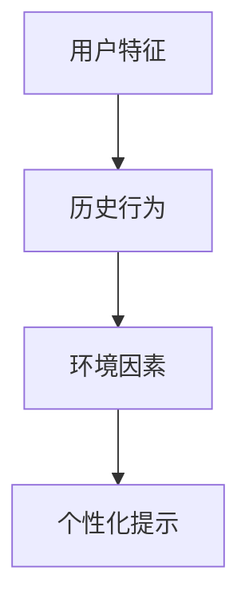

                 

### 文章标题：个性化提示：根据用户特征定制

> 关键词：个性化提示、用户特征、推荐系统、算法模型、技术应用

> 摘要：本文将深入探讨个性化提示技术的理论基础和应用实践，通过分析用户特征数据收集与处理、个性化提示算法与模型构建、以及在不同领域的应用案例，旨在为读者提供一个全面而深入的个性化提示技术指南。

### 第一部分：个性化提示技术基础

#### 第1章：个性化提示概述

在信息爆炸的时代，如何从海量数据中精准地提取出对用户最有价值的提示信息，是当前信息技术领域的一个重要课题。本章将介绍个性化提示的定义、重要性以及其发展历程。

#### 1.1 个性化提示的定义与意义

个性化提示是指根据用户的兴趣、行为、历史记录等特征，通过特定的算法模型，向用户推荐或提示最符合其需求的信息或服务。它不仅提高了用户体验，还能有效提升系统的推荐质量和用户满意度。

**核心概念与联系**

$$
\text{个性化提示} = f(\text{用户特征}, \text{历史行为}, \text{环境因素})
$$

- 用户特征：包括用户的兴趣、行为、背景信息等。
- 历史行为：用户的浏览、购买、评价等历史记录。
- 环境因素：包括时间、地理位置、天气等外部因素。

**Mermaid 流程图**



#### 1.2 个性化提示的发展历程

个性化提示技术起源于传统的推荐系统，随着大数据和人工智能技术的进步，逐渐演变为一门独立的学科。本章将介绍个性化提示技术的发展历程，包括关键技术的演进和应用场景的拓展。

**伪代码**

```python
def personalized_prompt(user_features, historical_behavior, environmental_factors):
    # 分析用户特征
    feature_analysis(user_features)
    # 分析历史行为
    behavior_analysis(historical_behavior)
    # 分析环境因素
    environment_analysis(environmental_factors)
    # 构建个性化模型
    model = build_model()
    # 生成个性化提示
    prompt = model.predict()
    return prompt
```

#### 1.3 个性化提示的应用场景

个性化提示技术在消费行为分析、内容个性化、客户服务优化等领域有着广泛的应用。本章将分别介绍这些应用场景，并探讨个性化提示如何提升用户体验和业务效率。

- **消费者行为分析**：通过个性化提示，企业可以更好地理解用户需求，优化产品和服务。
- **内容个性化**：个性化提示能够为用户提供更符合其兴趣的内容，提升内容消费体验。
- **客户服务优化**：个性化客服系统能够根据用户特征和历史交互数据，提供更个性化的服务。

### 第2章：用户特征数据收集与处理

用户特征数据是构建个性化提示系统的基础。本章将详细介绍用户特征数据的收集方法、数据处理流程以及数据存储与管理策略。

#### 2.1 用户特征数据收集

用户特征数据的收集方法主要包括用户主动提交、被动收集和第三方数据接口获取。本章将详细讨论这些方法，并介绍常用的数据收集工具。

**伪代码**

```python
def collect_user_features():
    # 从用户主动提交的数据中收集特征
    submitted_data = get_submitted_data()
    # 从系统日志中收集用户行为数据
    log_data = get_log_data()
    # 从第三方数据接口中获取用户特征
    external_data = get_external_data()
    return merge_data(submitted_data, log_data, external_data)
```

#### 2.2 用户特征数据处理

用户特征数据的处理主要包括数据清洗、数据预处理和数据整合。本章将介绍这些处理步骤，并讨论如何确保数据质量和一致性。

**伪代码**

```python
def preprocess_user_features(data):
    # 数据清洗
    clean_data = clean_data(data)
    # 数据预处理
    preprocessed_data = preprocess_data(clean_data)
    # 数据整合
    integrated_data = integrate_data(preprocessed_data)
    return integrated_data
```

#### 2.3 用户特征数据存储与管理

用户特征数据的存储与管理是构建个性化提示系统的关键环节。本章将介绍常见的数据存储方案和管理策略，并讨论如何确保数据的安全性和可扩展性。

### 第3章：个性化提示算法与模型

个性化提示算法与模型是构建个性化提示系统的核心。本章将介绍常见的个性化提示算法，包括协同过滤算法、内容推荐算法和混合推荐算法，并探讨如何评估个性化提示模型的性能。

#### 3.1 个性化提示算法原理

个性化提示算法基于用户特征和历史行为，通过构建数学模型，预测用户对特定信息的偏好。本章将详细讨论协同过滤算法、内容推荐算法和混合推荐算法的原理。

**伪代码**

```python
def collaborative_filtering(user_profile, item_profiles):
    # 计算用户和物品之间的相似度
    similarity_scores = compute_similarity_scores(user_profile, item_profiles)
    # 根据相似度分数推荐物品
    recommendations = generate_recommendations(similarity_scores)
    return recommendations

def content_based_recommender(user_profile, item_content):
    # 计算用户和物品内容的相关性
    relevance_scores = compute_relevance_scores(user_profile, item_content)
    # 根据相关性分数推荐物品
    recommendations = generate_recommendations(relevance_scores)
    return recommendations

def hybrid_recommender(user_profile, item_profiles, item_content):
    # 结合协同过滤和内容推荐算法
    collaborative_rec = collaborative_filtering(user_profile, item_profiles)
    content_rec = content_based_recommender(user_profile, item_content)
    # 混合推荐结果
    hybrid_rec = merge_recommendations(collaborative_rec, content_rec)
    return hybrid_rec
```

#### 3.2 常见个性化提示模型

本章将介绍决策树、神经网络和强化学习等常见个性化提示模型，并讨论如何在实际应用中选择合适的模型。

#### 3.3 个性化提示模型评估

个性化提示模型的评估是确保模型性能的重要步骤。本章将介绍常见的评估指标和方法，并讨论如何通过交叉验证和A/B测试等方法优化模型性能。

### 第二部分：个性化提示在实践中的应用

#### 第4章：个性化提示在电子商务中的应用

电子商务领域是个性化提示技术的重要应用场景之一。本章将介绍个性化商品推荐和个性化购物体验优化的具体实现和实际案例。

#### 第5章：个性化提示在社交媒体中的应用

社交媒体平台通过个性化提示技术，可以提升用户的内容消费体验和社交互动。本章将介绍个性化内容推送和个性化社交互动的具体实现和实际案例。

#### 第6章：个性化提示在客户服务中的应用

客户服务领域通过个性化提示技术，可以提升客户满意度和服务效率。本章将介绍个性化客服系统和个性化客户体验优化的具体实现和实际案例。

### 第7章：个性化提示的未来发展

个性化提示技术正随着人工智能和大数据技术的发展而不断进步。本章将探讨个性化提示技术的未来发展趋势，包括新技术趋势和面临的挑战与机遇。

#### 7.1 新技术趋势

随着人工智能和大数据技术的不断发展，个性化提示技术也在不断进化。本章将介绍最新的技术趋势，包括深度学习、联邦学习等。

#### 7.2 挑战与机遇

个性化提示技术在实际应用中面临着数据隐私、算法公平性等挑战。本章将讨论这些挑战，并探讨如何抓住机遇，推动个性化提示技术的可持续发展。

### 附录：个性化提示开发资源与工具

本章将介绍个性化提示开发的资源与工具，包括开发资源、常用工具和学习与交流平台，帮助读者更好地掌握和应用个性化提示技术。

---

作者：AI天才研究院/AI Genius Institute & 禅与计算机程序设计艺术 /Zen And The Art of Computer Programming

本文为原创内容，未经许可，不得转载。

---

通过以上章节的详细探讨，本文旨在为读者提供一个系统、全面的个性化提示技术指南。从理论基础到应用实践，再到未来发展趋势，希望读者能够对个性化提示技术有一个全面而深入的理解。同时，本文也呼吁读者关注个性化提示技术在数据隐私、算法公平性等方面的挑战，共同推动技术的可持续发展。

