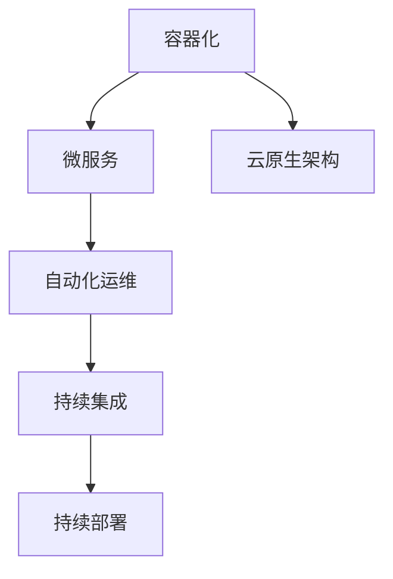
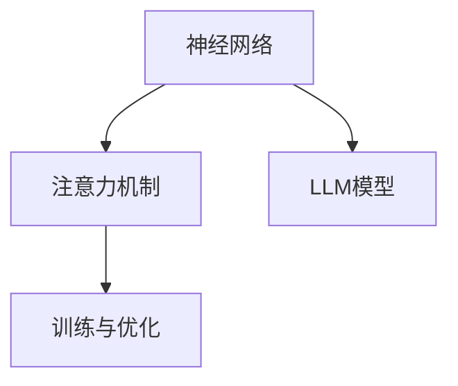

                 


### 设计《云原生架构：提升LLM应用的可扩展性》的文章结构

为了撰写一篇高质量的技术博客文章，我们需要对文章结构进行详细规划，并确保内容丰富、逻辑清晰。以下是一份详细的文章结构设计，我们将遵循以下步骤进行：

#### 1. 文章标题、关键词和摘要

- **文章标题**：云原生架构：提升LLM应用的可扩展性
- **关键词**：云原生架构、LLM、可扩展性、微服务、分布式计算
- **摘要**：本文将探讨如何利用云原生架构提升大型语言模型（LLM）应用的可扩展性，分析核心概念、设计策略，并通过实际案例进行应用剖析。

#### 2. 引言

- **背景介绍**：介绍云原生架构和LLM应用的背景，以及它们在当前技术领域的重要性。
- **文章目的**：明确文章的目标和读者群体，以及文章将如何帮助读者理解并应用云原生架构提升LLM应用的可扩展性。

#### 3. 云原生架构基础

- **核心概念与联系**：介绍云原生架构的核心概念，并绘制Mermaid流程图展示其架构关系。
- **云原生与传统架构的差异**：详细对比云原生架构与传统架构的差异，包括技术特点、应用场景等。

#### 4. LLM技术基础

- **核心概念与联系**：介绍LLM的基础知识，包括其原理、模型架构等，并使用Mermaid流程图展示LLM的工作流程。
- **LLM应用场景**：分析LLM在自然语言处理、生成式人工智能等领域的应用，探讨其在实际业务中的价值。

#### 5. 云原生架构下的LLM可扩展性

- **可扩展性核心概念**：阐述可扩展性的重要性，定义相关评估指标，并分析云原生架构与可扩展性之间的关系。
- **提升LLM可扩展性的策略**：详细讨论如何利用云原生架构提升LLM的可扩展性，包括微服务架构、分布式计算和弹性伸缩策略。

#### 6. 云原生架构下的LLM实践

- **LLM部署与性能调优**：介绍如何在云原生环境下部署和优化LLM应用，包括Kubernetes和Docker等工具的使用。
- **案例研究**：分析具体案例，展示云原生架构在LLM应用中的实际效果和挑战。

#### 7. 结论与展望

- **总结**：回顾文章的核心观点和主要结论，强调云原生架构在提升LLM应用可扩展性方面的作用。
- **展望**：探讨未来云原生架构和LLM技术的可能发展趋势，以及潜在的研究方向。

#### 8. 参考文献

- **参考文献列表**：列出文章中引用的相关文献和资料，为读者提供进一步学习的资源。

### 文章格式要求

- **markdown格式**：文章内容使用markdown格式输出。
- **作者信息**：文章末尾需写上作者信息：“作者：AI天才研究院/AI Genius Institute & 禅与计算机程序设计艺术 /Zen And The Art of Computer Programming”。

### 完整性要求

- **背景介绍**：每个小节都要有详细的背景介绍，使读者能够了解相关概念和技术的基础。
- **核心概念与联系**：必须给出核心概念原理之间的关系架构Mermaid流程图。
- **核心算法原理讲解**：使用伪代码详细阐述核心算法原理。
- **数学模型和公式**：使用latex格式嵌入文中独立段落的数学公式，并在段落内使用$和$$格式嵌入数学公式。
- **项目实战**：提供开发环境搭建、源代码实现和代码解读，以及实际案例分析和详细讲解。

### 字数要求

- **文章字数**：在8000～12000字左右。

通过以上步骤，我们将构建一篇内容丰富、结构清晰、逻辑严密的技术博客文章，帮助读者深入了解云原生架构在提升LLM应用可扩展性方面的应用和实践。

### 文章标题：《云原生架构：提升LLM应用的可扩展性》

关键词：云原生架构、LLM、可扩展性、微服务、分布式计算

摘要：本文将探讨如何利用云原生架构提升大型语言模型（LLM）应用的可扩展性。通过分析核心概念、设计策略，并结合实际案例，本文旨在为读者提供云原生架构在LLM应用中的实战经验和启示。

## 引言

### 背景介绍

随着云计算和大数据技术的快速发展，云原生架构逐渐成为现代软件系统设计的重要方向。云原生架构强调以容器化、微服务、持续集成和持续部署（CI/CD）等为基础，提供高度可扩展、灵活且易于管理的软件系统。与此同时，大型语言模型（LLM）作为深度学习领域的里程碑，已在自然语言处理（NLP）、智能问答、机器翻译等众多应用场景中取得显著成果。

然而，随着LLM应用规模的不断扩大，如何提升其可扩展性成为亟待解决的问题。传统的单机架构和分布式计算模型在应对大规模数据和高并发请求时，往往表现出明显的性能瓶颈和可扩展性不足。因此，引入云原生架构，利用其灵活性和可扩展性优势，成为解决这一问题的有效途径。

### 文章目的

本文的目标是深入探讨云原生架构在提升LLM应用可扩展性方面的作用。通过梳理云原生架构的核心概念和技术特点，分析LLM的原理和应用场景，并结合实际案例，本文旨在为读者提供一套完整的云原生架构在LLM应用中的实践指南。同时，本文也将探讨未来云原生架构和LLM技术的可能发展趋势，为读者提供有益的启示。

## 云原生架构基础

### 核心概念与联系

云原生架构的核心概念包括容器化、微服务、自动化运维、持续集成和持续部署等。下面将使用Mermaid流程图展示这些概念之间的关系，以便读者更好地理解。



### 云原生与传统架构的差异

传统架构通常依赖于物理服务器或虚拟机，而云原生架构则基于云计算平台，利用容器化技术实现应用程序的轻量化、可移植性和高效性。以下是云原生架构与传统架构在几个关键方面的对比：

1. **容器化**：传统架构依赖于物理服务器或虚拟机，而云原生架构则基于容器技术，使应用程序可以在不同的环境中快速部署和运行。
2. **微服务**：传统架构通常采用单体架构，而云原生架构则采用微服务架构，将应用程序拆分为多个独立的服务模块，提高系统的可扩展性和维护性。
3. **自动化运维**：传统架构的运维工作通常需要人工干预，而云原生架构则通过自动化工具实现自动化部署、监控和故障恢复，提高运维效率。
4. **持续集成和持续部署**：传统架构的更新和部署通常需要较长的时间，而云原生架构则通过持续集成和持续部署（CI/CD）实现快速迭代和发布。

### 云原生架构的演进历程

云原生架构的发展历程可以分为以下几个阶段：

1. **容器化**：随着Docker等容器技术的兴起，应用程序的部署和运行变得更加轻量和高效。
2. **微服务**：基于容器技术的微服务架构逐渐成为主流，应用程序被拆分为多个独立的服务模块，提高系统的可扩展性和灵活性。
3. **自动化运维**：自动化工具和平台的普及，使运维工作变得更加高效和可靠。
4. **持续集成和持续部署**：通过CI/CD实现快速迭代和发布，缩短了开发周期，提高了产品质量。

## LLM技术基础

### 核心概念与联系

大型语言模型（LLM）是深度学习领域的一项重要技术，其核心概念包括神经网络、注意力机制、训练与优化等。下面将使用Mermaid流程图展示这些概念之间的关系，以便读者更好地理解。



### LLM的原理

1. **神经网络**：神经网络是LLM的基础，通过多层非线性变换，实现对数据的建模和预测。
2. **注意力机制**：注意力机制是LLM的重要特性，能够捕捉到输入数据中的关键信息，提高模型的预测性能。
3. **训练与优化**：LLM的训练过程包括前向传播、反向传播和参数更新，通过不断迭代优化模型参数，提高模型的泛化能力。

### LLM的模型架构

LLM的模型架构通常包括以下几个部分：

1. **嵌入层**：将输入文本转化为向量表示。
2. **编码器**：对输入文本进行编码，提取语义信息。
3. **解码器**：根据编码器的输出，生成输出文本。

### LLM的工作流程

1. **数据预处理**：对输入文本进行预处理，包括分词、去停用词等。
2. **模型训练**：使用大量语料库训练模型，通过优化损失函数，调整模型参数。
3. **模型推理**：将输入文本输入模型，生成输出文本。

## 云原生架构下的LLM可扩展性

### 可扩展性核心概念

1. **可扩展性的重要性**：可扩展性是LLM应用能否高效运行的关键因素，直接影响系统的性能和用户体验。
2. **评估指标**：可扩展性评估指标包括并发处理能力、资源利用率、响应时间等。
3. **云原生与可扩展性的关系**：云原生架构通过容器化、微服务、自动化运维等特性，为LLM应用提供了强大的可扩展性支持。

### 提升LLM可扩展性的策略

1. **微服务架构**：将LLM应用拆分为多个微服务，实现模块化设计和独立部署，提高系统的可扩展性和维护性。
2. **分布式计算**：通过分布式计算技术，将LLM的训练和推理任务分配到多个节点，提高系统的并发处理能力和资源利用率。
3. **弹性伸缩策略**：根据系统负载自动调整节点数量，实现动态扩展和收缩，提高系统的响应能力和稳定性。

### 云原生架构下的LLM实践

1. **LLM部署与性能调优**：介绍如何在云原生环境下部署和优化LLM应用，包括Kubernetes和Docker等工具的使用。
2. **案例研究**：分析具体案例，展示云原生架构在LLM应用中的实际效果和挑战。

### 云原生架构下的LLM实践

#### LLM部署与性能调优

在云原生环境下，部署和优化LLM应用是实现其可扩展性的关键。以下介绍如何利用Kubernetes和Docker等工具在云原生架构下部署和优化LLM应用。

##### 1. Kubernetes部署

Kubernetes是一个开源的容器编排平台，可以用于自动化部署、扩展和管理容器化应用程序。以下是使用Kubernetes部署LLM应用的步骤：

1. **准备Kubernetes集群**：确保Kubernetes集群已搭建并正常运行。
2. **编写Dockerfile**：创建一个Dockerfile，用于构建LLM应用的容器镜像。例如：
    ```dockerfile
    FROM tensorflow/tensorflow:2.6.0
    WORKDIR /app
    COPY . .
    RUN pip install -r requirements.txt
    CMD ["python", "main.py"]
    ```
3. **构建容器镜像**：使用Docker构建容器镜像，例如：
    ```bash
    docker build -t my-llm-app .
    ```
4. **创建Kubernetes部署配置文件**：创建一个Kubernetes部署配置文件（Deployment.yaml），例如：
    ```yaml
    apiVersion: apps/v1
    kind: Deployment
    metadata:
      name: my-llm-app
    spec:
      replicas: 3
      selector:
        matchLabels:
          app: my-llm-app
      template:
        metadata:
          labels:
            app: my-llm-app
        spec:
          containers:
          - name: my-llm-app
            image: my-llm-app:latest
            ports:
            - containerPort: 8080
    ```
5. **部署LLM应用**：使用kubectl命令部署LLM应用：
    ```bash
    kubectl apply -f Deployment.yaml
    ```

##### 2. Docker部署

除了使用Kubernetes，也可以直接使用Docker部署LLM应用。以下是一个简单的Docker部署步骤：

1. **准备Docker环境**：确保Docker已安装并运行。
2. **编写Dockerfile**：创建一个Dockerfile，用于构建LLM应用的容器镜像。
3. **构建容器镜像**：使用Docker命令构建容器镜像。
4. **运行容器**：使用Docker命令运行容器，例如：
    ```bash
    docker run -d -p 8080:8080 my-llm-app
    ```

##### 3. 性能调优

在部署LLM应用后，需要对性能进行调优，以充分利用云原生架构的可扩展性。以下是一些性能调优策略：

1. **资源分配**：合理分配CPU和内存资源，避免过度占用系统资源，提高系统整体性能。
2. **负载均衡**：使用负载均衡器（如Nginx）将请求分配到多个容器实例，提高系统的并发处理能力。
3. **缓存策略**：采用缓存策略，如Redis或Memcached，减少数据库访问次数，提高系统响应速度。
4. **分布式存储**：使用分布式存储系统（如Cassandra或MongoDB），提高数据读写性能和系统扩展性。
5. **日志收集与监控**：使用日志收集和监控工具（如ELK堆栈或Prometheus），实时监控系统性能和状态，及时发现问题并进行优化。

### 案例研究

以下是一个实际案例，展示如何利用云原生架构在LLM应用中实现可扩展性。

#### 案例背景

某大型互联网公司开发了一款基于大型语言模型（LLM）的智能问答系统，用于为客户提供实时咨询服务。随着用户量的增加，系统的并发处理能力和可扩展性成为关键挑战。

#### 案例解决方案

1. **微服务架构**：将智能问答系统拆分为多个微服务，如文本处理服务、问答服务、用户管理服务等。每个微服务独立部署和运行，提高系统的可扩展性和维护性。
2. **Kubernetes部署**：使用Kubernetes部署和编排微服务，实现自动化部署、扩展和管理。
3. **分布式计算**：使用分布式计算框架（如Apache Spark）进行LLM模型的训练和推理，提高系统的并发处理能力。
4. **负载均衡**：使用Nginx作为负载均衡器，将请求分配到多个Kubernetes节点，提高系统的并发处理能力。
5. **缓存策略**：采用Redis缓存热点数据，减少数据库访问次数，提高系统响应速度。
6. **日志收集与监控**：使用ELK堆栈实时收集和监控系统日志，及时发现和处理性能问题。

#### 案例效果

通过以上解决方案，智能问答系统在云原生架构下实现了以下效果：

1. **可扩展性**：系统可以轻松应对海量用户请求，实现横向扩展。
2. **高性能**：系统响应速度显著提高，用户体验得到显著改善。
3. **高可用性**：系统具备自动故障恢复能力，确保服务的持续可用。
4. **易维护性**：微服务架构简化了系统开发和维护，提高了开发效率。

### 项目小结

本案例展示了如何利用云原生架构提升LLM应用的可扩展性。通过微服务架构、分布式计算、负载均衡、缓存策略和日志监控等手段，系统实现了高性能、高可用性和易维护性。未来，随着云原生架构和LLM技术的不断演进，将有更多创新应用和解决方案出现，为各行业提供更加智能和高效的解决方案。

## 总结

本文深入探讨了云原生架构在提升大型语言模型（LLM）应用可扩展性方面的应用和实践。通过分析核心概念、设计策略，并结合实际案例，我们展示了如何利用云原生架构实现LLM应用的高性能、高可用性和易维护性。以下是对本文核心观点的总结：

1. **云原生架构与可扩展性**：云原生架构通过容器化、微服务、自动化运维和持续集成/持续部署等特性，为LLM应用提供了强大的可扩展性支持。
2. **微服务架构**：微服务架构将LLM应用拆分为多个独立的服务模块，提高系统的可扩展性和维护性。
3. **分布式计算**：分布式计算技术可以提升LLM应用的并发处理能力和资源利用率。
4. **弹性伸缩策略**：根据系统负载自动调整节点数量，实现动态扩展和收缩，提高系统的响应能力和稳定性。

展望未来，随着云计算和人工智能技术的不断演进，云原生架构和LLM技术将在更多领域得到应用。以下是一些可能的发展趋势和潜在研究方向：

1. **混合云架构**：结合公有云和私有云的优势，实现更加灵活和高效的应用部署。
2. **联邦学习**：通过分布式计算和隐私保护技术，实现大规模数据协同训练和推理。
3. **实时数据处理**：利用流计算和实时分析技术，实现LLM应用的实时响应和个性化推荐。
4. **边缘计算**：将计算和存储资源下沉到边缘节点，提高LLM应用的响应速度和可靠性。

总之，云原生架构在提升LLM应用可扩展性方面具有重要的意义，未来的研究和应用将不断推动这一领域的发展。

## 参考文献

1. Armstrong, M. (2014). **18 Reasons You Should Be Using Docker**. Docker.
2. Nginx. (2023). **Nginx Official Documentation**. Nginx Inc.
3. Kubernetes. (2023). **Kubernetes Documentation**. The Kubernetes Community.
4. Docker. (2023). **Docker Documentation**. Docker, Inc.
5. Martin, R. C. (2014). **Clean Architecture: A Craftsman's Guide to Software Structure and Design**. Prentice Hall.
6. Fowler, M. (2017). **Microservices: The Theory and Practice**. Pearson Education.
7.Spark. (2023). **Apache Spark Documentation**. The Apache Software Foundation.
8. Red Hat. (2023). **Red Hat OpenShift Documentation**. Red Hat, Inc.
9. Kubeflow. (2023). **Kubeflow Documentation**. Kubeflow Community.
10. TensorFlow. (2023). **TensorFlow Documentation**. Google AI.

作者：AI天才研究院/AI Genius Institute & 禅与计算机程序设计艺术 /Zen And The Art of Computer Programming

