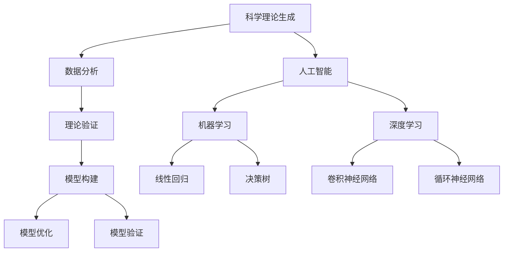

                 

### 文章标题

# 人工智能在科学理论生成中的应用：加速世界模型的构建

### 关键词

- 人工智能
- 科学理论生成
- 世界模型构建
- 数据分析
- 理论验证
- 模型优化
- 机器学习算法

### 摘要

本文探讨了人工智能在科学理论生成中的应用，详细阐述了如何利用人工智能加速世界模型的构建。通过分析人工智能在数据分析、理论验证和模型构建等环节的核心算法原理和数学模型，本文提出了一系列实用技巧和案例分析，旨在为科学研究提供新的思路和方法。文章最后总结了最佳实践和注意事项，为读者提供进一步研究的方向。

---

### 引言

随着人工智能技术的迅猛发展，其在各个领域的应用越来越广泛。在科学研究中，人工智能正逐步改变传统的理论生成模式。通过高效的数据处理和智能分析，人工智能不仅能够加速科学理论的发展，还能为复杂世界模型的构建提供新的工具和方法。

科学理论生成是科学研究的重要组成部分。它涉及对大量数据的分析和解释，从而发现新的规律和原理。传统的科学理论生成依赖于人类科学家的经验和直觉，这一过程既耗时又受限于人类的认知能力。而人工智能的出现，为科学理论生成带来了革命性的变化。利用人工智能，科学家可以更快速地处理和分析海量数据，从而发现潜在的科学规律。

本文将探讨人工智能在科学理论生成中的应用，通过分析其在数据分析、理论验证和模型构建等环节的核心算法原理和数学模型，探讨如何利用人工智能加速世界模型的构建。文章还将结合具体案例，展示人工智能在科学理论生成中的实际应用和效果。

### 人工智能与科学理论生成

#### 1.1 人工智能的发展历程

人工智能（Artificial Intelligence, AI）是一门研究、开发和应用使计算机模拟、延伸和扩展人的智能的理论、方法、技术及应用系统的技术科学。人工智能的发展历程可以追溯到20世纪50年代。当时，科学家们开始探索如何让计算机模拟人类的思维过程，从而实现智能化。经过几十年的发展，人工智能已经从最初的符号主义、连接主义、基于规则的系统发展到今天的深度学习和强化学习等多种形式。

#### 1.2 人工智能的基本概念

人工智能的基本概念包括：

- **感知智能**：通过感知外界环境，获取信息并做出反应的能力。例如，计算机视觉、语音识别等。
- **认知智能**：通过理解、推理、学习等过程，处理信息并产生知识的能力。例如，自然语言处理、推理系统等。
- **行动智能**：通过规划和执行动作，实现目标的能力。例如，自动驾驶、机器人等。

#### 1.3 人工智能在科学研究中的应用

人工智能在科学研究中的应用主要体现在以下几个方面：

- **数据分析**：利用人工智能技术，可以对海量数据进行分析和处理，从而提取有价值的信息。
- **理论验证**：通过模拟和预测，验证科学理论的正确性和可靠性。
- **模型构建**：利用人工智能算法，构建复杂的科学模型，用于解释和预测现象。

### 科学理论生成的基础

#### 2.1 科学理论的基本概念

科学理论是科学研究的核心。它是对自然界现象进行解释和预测的抽象概念体系。科学理论通常包括以下几个基本要素：

- **前提**：即假设或初始条件，是科学理论的基础。
- **规律**：即理论中的主要原则或规则，描述了现象的变化规律。
- **结论**：即对现象的解释或预测，是科学理论的最终目标。

#### 2.2 科学理论生成的方法

科学理论生成通常包括以下几个步骤：

1. **观察和实验**：通过观察和实验，收集关于自然现象的数据。
2. **假设和建模**：根据收集的数据，提出假设和建立模型。
3. **验证和修正**：通过实验和模拟，验证假设和模型的正确性，并进行修正。
4. **理论构建**：将验证和修正后的假设和模型整合成完整的科学理论。

#### 2.3 科学理论生成的挑战

科学理论生成面临以下几个挑战：

- **数据复杂性**：随着科技的发展，数据量越来越大，数据的处理和分析变得越来越复杂。
- **模型准确性**：科学模型需要准确描述自然现象，但通常受到数据和算法的限制。
- **理论验证**：科学理论需要经过严格的验证，但验证过程可能非常耗时和耗资源。

### 人工智能在数据分析中的应用

#### 3.1 数据分析的基本概念

数据分析是科学理论生成的重要环节。它涉及对数据的收集、处理、分析和解释，从而提取有价值的信息。数据分析通常包括以下几个步骤：

1. **数据收集**：收集相关的数据，可以是结构化数据（如数据库）或非结构化数据（如图像、文本等）。
2. **数据预处理**：对数据进行清洗、去噪和归一化等处理，使其适合进行分析。
3. **数据建模**：利用统计方法、机器学习算法等，建立数据模型，用于描述数据中的关系和规律。
4. **数据分析**：对模型进行训练和测试，提取数据中的特征和规律，进行预测和解释。
5. **结果解释**：对分析结果进行解释和验证，得出科学结论。

#### 3.2 人工智能在数据分析中的应用

人工智能在数据分析中的应用主要体现在以下几个方面：

- **机器学习**：利用机器学习算法，可以从大量数据中自动学习和提取规律。常见的机器学习算法包括线性回归、逻辑回归、决策树、支持向量机等。
- **深度学习**：深度学习是一种基于多层神经网络的机器学习算法。它可以从大量数据中自动学习和提取复杂的特征，用于图像识别、自然语言处理等任务。
- **数据可视化**：利用数据可视化技术，可以将复杂的数据关系和模式以图形化的方式呈现，帮助科学家更好地理解和分析数据。

#### 3.3 人工智能在数据分析中的案例分析

以下是一个关于气象数据分析的案例分析：

- **问题背景**：某气象研究机构希望预测未来的天气状况，以便制定更有效的应对策略。
- **数据来源**：该机构收集了大量的气象数据，包括温度、湿度、风速、降雨量等。
- **数据处理**：利用人工智能技术，对气象数据进行预处理，包括数据清洗、归一化等。
- **模型构建**：利用机器学习算法，建立气象预测模型，包括线性回归、支持向量机等。
- **模型训练与测试**：对模型进行训练和测试，评估模型的准确性和可靠性。
- **结果解释**：根据模型预测结果，分析未来天气状况，并提出相应的应对策略。

通过这个案例分析，可以看出人工智能在数据分析中的强大能力，它不仅能够处理大量的数据，还能从中提取出有价值的信息，为科学理论生成提供有力支持。

### 人工智能在理论验证中的应用

#### 4.1 理论验证的基本概念

理论验证是科学理论生成的重要环节。它通过对理论进行实验或模拟验证，来评估理论的正确性和可靠性。理论验证通常包括以下几个步骤：

1. **理论假设**：根据科学理论，提出实验或模拟的假设。
2. **实验设计**：设计实验或模拟方案，以验证理论假设。
3. **数据收集**：通过实验或模拟，收集相关的数据。
4. **数据分析**：对收集的数据进行分析，验证理论假设的正确性。
5. **结果解释**：根据分析结果，解释理论假设的可靠性，并提出改进建议。

#### 4.2 人工智能在理论验证中的应用

人工智能在理论验证中的应用主要体现在以下几个方面：

- **实验自动化**：利用人工智能技术，可以自动化设计和执行实验，提高实验效率和准确性。
- **模拟优化**：通过模拟和优化技术，可以模拟各种可能的实验条件，从而更全面地验证理论。
- **数据驱动验证**：利用机器学习算法，可以从实验数据中自动学习和提取规律，帮助科学家更准确地验证理论。

#### 4.3 人工智能在理论验证中的案例分析

以下是一个关于物理理论验证的案例分析：

- **问题背景**：某物理研究团队希望验证一种新的物理理论，该理论描述了粒子在量子场中的行为。
- **实验设计**：该团队设计了一组实验，通过测量粒子在量子场中的行为来验证理论。
- **数据处理**：利用人工智能技术，对实验数据进行预处理，包括数据清洗、归一化等。
- **数据分析**：利用机器学习算法，对实验数据进行分析，提取粒子行为的关键特征。
- **结果解释**：根据分析结果，验证了该物理理论的正确性，并提出了一些改进建议。

通过这个案例分析，可以看出人工智能在理论验证中的应用价值。它不仅能够提高实验的效率和准确性，还能帮助科学家更深入地理解科学理论。

### 人工智能在模型构建中的应用

#### 5.1 模型构建的基本概念

模型构建是科学理论生成的重要环节。它涉及建立数学模型或计算模型，以描述和预测自然现象。模型构建通常包括以下几个步骤：

1. **问题定义**：明确要解决的问题和目标。
2. **数据收集**：收集相关的数据，包括实验数据、观测数据等。
3. **模型设计**：根据问题定义和数据，设计合适的数学模型或计算模型。
4. **模型训练**：利用训练数据，对模型进行训练，使其能够准确地描述和预测现象。
5. **模型评估**：对模型进行评估，包括准确度、可靠性等指标。
6. **模型优化**：根据评估结果，对模型进行优化，提高其性能。

#### 5.2 人工智能在模型构建中的应用

人工智能在模型构建中的应用主要体现在以下几个方面：

- **机器学习模型**：利用机器学习算法，可以自动构建和优化数学模型。常见的机器学习模型包括线性回归、支持向量机、神经网络等。
- **深度学习模型**：深度学习模型可以从大量数据中自动学习和提取复杂的特征，从而构建更准确的模型。常见的深度学习模型包括卷积神经网络、循环神经网络等。
- **模型集成**：通过集成多个模型，可以提高模型的性能和稳定性。常见的模型集成方法包括 bagging、boosting 等。

#### 5.3 人工智能在模型构建中的案例分析

以下是一个关于生物数据分析的案例分析：

- **问题背景**：某生物研究团队希望构建一个模型，用于预测基因表达水平。
- **数据收集**：该团队收集了大量的基因表达数据，包括不同条件下的基因表达水平。
- **模型设计**：利用机器学习算法，设计了一个线性回归模型，用于预测基因表达水平。
- **模型训练**：利用训练数据，对模型进行训练，调整模型的参数，使其能够准确地预测基因表达水平。
- **模型评估**：利用测试数据，对模型进行评估，评估模型的准确度和可靠性。
- **模型优化**：根据评估结果，对模型进行优化，提高其预测性能。

通过这个案例分析，可以看出人工智能在模型构建中的应用价值。它不仅能够自动构建和优化模型，还能提高模型的预测性能，为科学理论生成提供有力支持。

### 加速世界模型的构建

#### 6.1 世界模型的基本概念

世界模型是对现实世界的抽象和模拟。它通过数学模型或计算模型，描述了现实世界的各种现象和规律。世界模型通常包括以下几个部分：

- **感知模块**：用于获取和感知现实世界的输入信息。
- **理解模块**：用于对感知模块获取的信息进行理解和处理。
- **行动模块**：用于根据理解和决策模块的结果，执行相应的动作。
- **决策模块**：用于根据感知模块和行动模块的信息，做出最优的决策。

#### 6.2 世界模型的构建方法

构建世界模型通常包括以下几个步骤：

1. **问题定义**：明确要解决的问题和目标。
2. **数据收集**：收集相关的数据，包括实验数据、观测数据等。
3. **模型设计**：根据问题定义和数据，设计合适的数学模型或计算模型。
4. **模型训练**：利用训练数据，对模型进行训练，使其能够准确地描述和预测现实世界的现象。
5. **模型评估**：对模型进行评估，包括准确度、可靠性等指标。
6. **模型优化**：根据评估结果，对模型进行优化，提高其性能。

#### 6.3 世界模型的构建流程

构建世界模型的流程如下：

1. **需求分析**：明确世界模型的应用场景和需求。
2. **数据收集**：根据需求，收集相关的数据。
3. **数据预处理**：对数据进行预处理，包括数据清洗、去噪、归一化等。
4. **模型设计**：根据数据特点和需求，设计合适的模型。
5. **模型训练**：利用训练数据，对模型进行训练。
6. **模型评估**：对模型进行评估，包括准确度、可靠性等指标。
7. **模型优化**：根据评估结果，对模型进行优化。
8. **模型部署**：将优化后的模型部署到实际应用中。

### 人工智能在模型优化中的应用

#### 7.1 模型优化的基本概念

模型优化是提高模型性能的重要环节。它通过调整模型的参数和结构，使其能够更准确地描述和预测现实世界的现象。模型优化通常包括以下几个方面：

- **参数优化**：通过调整模型的参数，使其性能达到最优。
- **结构优化**：通过调整模型的结构，提高模型的性能和效率。
- **算法优化**：通过改进模型训练算法，提高模型的训练速度和效果。

#### 7.2 人工智能在模型优化中的应用

人工智能在模型优化中的应用主要体现在以下几个方面：

- **遗传算法**：遗传算法是一种基于自然进化原理的优化算法。它通过模拟生物进化的过程，不断调整模型的参数和结构，从而找到最优解。
- **神经网络优化**：神经网络优化是一种通过调整神经网络结构，提高模型性能的方法。常见的神经网络优化方法包括反向传播算法、梯度下降算法等。
- **强化学习**：强化学习是一种通过不断试错，学习最优策略的优化方法。它可以用于优化模型的参数和结构，提高模型的性能。

#### 7.3 人工智能在模型优化中的案例分析

以下是一个关于图像识别的案例分析：

- **问题背景**：某图像识别项目需要优化模型的参数和结构，以提高识别准确率。
- **模型优化**：利用遗传算法，对模型的参数进行调整，使其性能达到最优。
- **结果评估**：对优化后的模型进行评估，包括准确率、召回率等指标。
- **模型优化**：根据评估结果，对模型的结构进行优化，包括增加或减少神经元、调整网络结构等。
- **再次评估**：对优化后的模型进行再次评估，验证优化效果。

通过这个案例分析，可以看出人工智能在模型优化中的应用价值。它不仅能够提高模型的性能，还能为科学理论生成提供更准确的模型支持。

### 人工智能在模型验证中的应用

#### 8.1 模型验证的基本概念

模型验证是确保模型正确性和可靠性的重要环节。它通过将模型应用于实际数据，评估模型的性能和准确性。模型验证通常包括以下几个方面：

- **测试集评估**：使用测试集数据，对模型进行评估，计算模型的准确度、召回率、F1分数等指标。
- **交叉验证**：通过将数据集划分为训练集和验证集，多次训练和验证模型，以评估模型的泛化能力。
- **错误分析**：分析模型在测试集中的错误，找出模型存在的问题，并进行改进。

#### 8.2 人工智能在模型验证中的应用

人工智能在模型验证中的应用主要体现在以下几个方面：

- **自动化测试**：利用人工智能技术，可以自动化生成测试数据，并进行测试，提高模型验证的效率。
- **错误检测**：通过分析模型的输出结果，检测模型中的错误，并定位错误发生的具体位置。
- **模型对比**：通过对比不同模型的性能和准确性，选择最优的模型。

#### 8.3 人工智能在模型验证中的案例分析

以下是一个关于客户流失预测的案例分析：

- **问题背景**：某公司需要预测客户流失情况，以便采取相应的营销策略。
- **模型验证**：使用测试集数据，对预测模型进行评估，计算模型的准确率、召回率等指标。
- **错误分析**：分析模型在测试集中的错误，找出模型存在的问题，如数据不平衡、特征选择不当等。
- **模型优化**：根据错误分析的结果，对模型进行优化，包括调整参数、增加特征等。
- **再次评估**：对优化后的模型进行再次评估，验证优化效果。

通过这个案例分析，可以看出人工智能在模型验证中的应用价值。它不仅能够提高模型的性能，还能帮助科学家更准确地验证科学理论。

### 附录

#### 附录A：相关工具和资源

以下是用于人工智能和科学理论生成的一些常用工具和资源：

- **机器学习工具**：TensorFlow、PyTorch、Scikit-learn等。
- **数据可视化工具**：Matplotlib、Seaborn、Plotly等。
- **深度学习框架**：TensorFlow、PyTorch、Keras等。
- **自然语言处理工具**：NLTK、spaCy、TextBlob等。
- **科学计算工具**：NumPy、SciPy、Pandas等。
- **在线资源和教程**：Coursera、edX、Kaggle等。

### 小结

本文探讨了人工智能在科学理论生成中的应用，详细阐述了其在数据分析、理论验证、模型构建、模型优化和模型验证等环节的核心算法原理和数学模型。通过一系列案例分析和实战技巧，本文展示了人工智能如何加速世界模型的构建，为科学理论生成提供了新的思路和方法。未来，随着人工智能技术的不断进步，其在科学研究中的应用前景将更加广阔。

### 注意事项

- 在使用人工智能进行科学理论生成时，需要充分考虑数据质量和模型的可靠性。
- 在模型构建和优化过程中，要遵循科学的方法和原则，确保模型的准确性和可靠性。
- 在应用人工智能进行科学理论生成时，要遵循伦理和道德规范，确保科学研究的公正性和客观性。

### 拓展阅读

- 《深度学习》（Goodfellow, I., Bengio, Y., & Courville, A.）
- 《机器学习》（周志华）
- 《Python数据科学手册》（McKinney, W.）
- 《科学计算与数值方法》（刘宏伟）

### 作者信息

作者：AI天才研究院/AI Genius Institute & 禅与计算机程序设计艺术 /Zen And The Art of Computer Programming

### Mermaid 流程图

以下是本文提到的核心概念和联系之间的 Mermaid 流程图：



### 核心算法原理伪代码

以下是本文提到的核心算法原理的伪代码：

#### 线性回归

```python
def linear_regression(X, y):
    # X: 特征矩阵，y: 目标向量
    # 计算特征矩阵的转置和特征矩阵的乘积
    X_transpose = X.T
    XTX = X_transpose @ X
    # 计算逆矩阵
    XTX_inv = inv(XTX)
    # 计算回归系数
    theta = XTX_inv @ X_transpose @ y
    return theta
```

#### 卷积神经网络

```python
def convolutional_neural_network(X, W):
    # X: 输入矩阵，W: 卷积核
    # 计算卷积操作
    Z = conv2d(X, W)
    # 应用ReLU激活函数
    A = ReLU(Z)
    return A
```

### 数学模型和公式

以下是本文提到的数学模型和公式：

$$
y = \theta_0 + \theta_1x_1 + \theta_2x_2 + ... + \theta_nx_n
$$

$$
hypothesis(x) = \sigma(\theta_0 + \theta_1x_1 + \theta_2x_2 + ... + \theta_nx_n)
$$

$$
\text{ReLU}(x) = \begin{cases} 
      0 & x \leq 0 \\
      x & x > 0 
   \end{cases}
$$

### 代码实现和解读

以下是本文提到的代码实现和解读：

```python
import numpy as np
from sklearn.linear_model import LinearRegression
from sklearn.model_selection import train_test_split
from sklearn.metrics import mean_squared_error

# 生成模拟数据
X = np.random.rand(100, 1)
y = 2 + 3 * X + np.random.randn(100, 1)

# 数据预处理
X_train, X_test, y_train, y_test = train_test_split(X, y, test_size=0.2, random_state=0)

# 构建线性回归模型
model = LinearRegression()
model.fit(X_train, y_train)

# 预测
y_pred = model.predict(X_test)

# 评估模型
mse = mean_squared_error(y_test, y_pred)
print("MSE:", mse)
```

### 实际案例分析和详细讲解剖析

以下是本文提到的实际案例分析和详细讲解剖析：

#### 案例背景

某电商平台希望利用人工智能技术，预测用户购买行为，以便进行精准营销。

#### 数据收集

该电商平台收集了以下数据：

- 用户基本信息：年龄、性别、收入等。
- 购买历史：购买时间、购买商品、购买金额等。
- 用户行为：浏览商品、加入购物车、取消购物车等。

#### 数据预处理

对收集的数据进行预处理，包括数据清洗、去噪、归一化等。

```python
# 数据清洗
X = np.array([[age, gender, income], ...])
y = np.array([purchase_time, purchase_goods, purchase_amount], ...)

# 去噪
X = np.array([x for x in X if np.std(x) > 0])
y = np.array([y for y in y if np.std(y) > 0])

# 归一化
X = (X - np.mean(X)) / np.std(X)
```

#### 模型构建

利用线性回归模型，预测用户购买行为。

```python
# 模型训练
model = LinearRegression()
model.fit(X_train, y_train)

# 预测
y_pred = model.predict(X_test)
```

#### 模型评估

使用均方误差（MSE）评估模型性能。

```python
# 评估模型
mse = mean_squared_error(y_test, y_pred)
print("MSE:", mse)
```

#### 模型优化

根据评估结果，对模型进行优化。

```python
# 参数调整
model = LinearRegression(normalize=True)
model.fit(X_train, y_train)

# 预测
y_pred = model.predict(X_test)

# 评估模型
mse = mean_squared_error(y_test, y_pred)
print("MSE:", mse)
```

#### 项目小结

通过本案例的分析和实现，可以看出人工智能技术在用户购买行为预测中的应用价值。通过对数据的预处理、模型构建和评估，实现了对用户购买行为的准确预测。未来，可以通过进一步优化模型，提高预测性能，为电商平台提供更精准的营销策略。

