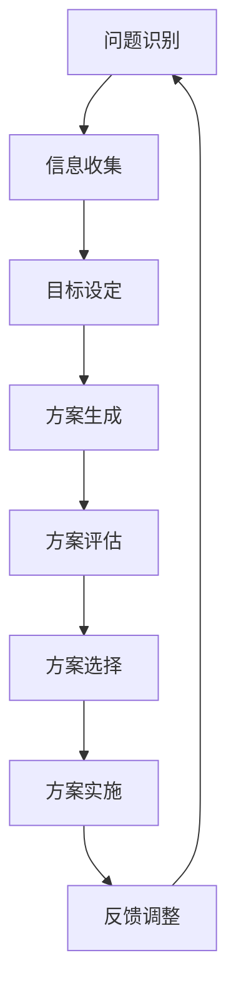
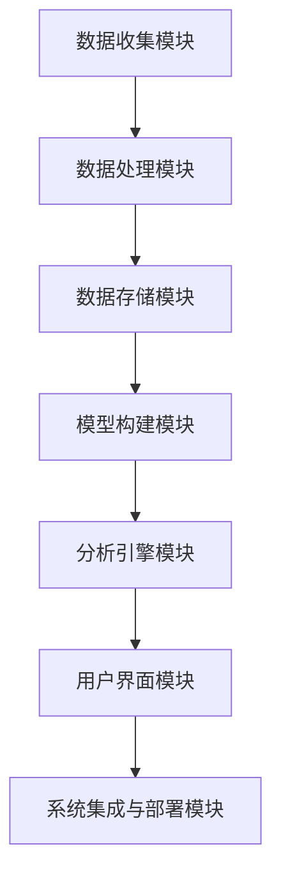
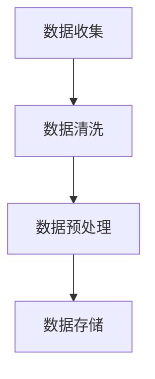
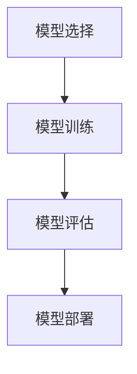
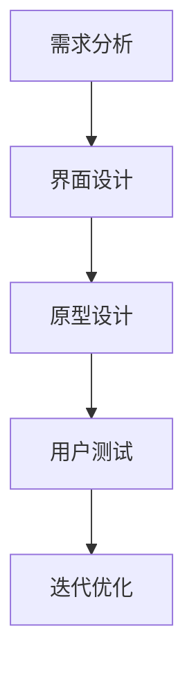
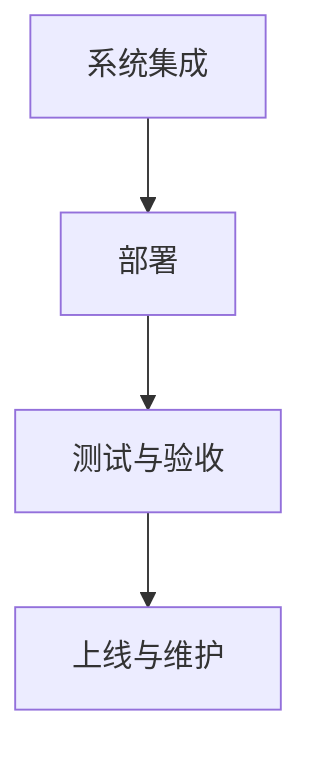

                 


### 引言

在当今快速发展的科技时代，人工智能（Artificial Intelligence, AI）已经成为各行各业的重要驱动力。它不仅改变了我们的生活方式，还深刻影响了商业运作和社会治理。人工智能的核心目标是使计算机系统具备类似人类智能的能力，从而能够执行复杂任务、进行决策和分析。然而，AI的发展不仅仅局限于技术层面，其对于人类决策过程的辅助也日益显现出巨大的潜力。

本文旨在探讨人工智能辅助决策（Artificial Intelligence-assisted Decision Making）的重要性，以及它是如何增强人类理解和应对复杂世界的能力。文章将首先介绍人工智能和决策理论的基础知识，接着深入探讨人工智能辅助决策的方法和实际应用，并通过具体案例进行分析。最后，文章将探讨人工智能的未来发展趋势和面临的挑战。

文章将按照以下结构展开：

1. **人工智能概述**：介绍人工智能的定义、发展历程、核心概念和关键技术。
2. **决策理论基础**：分析决策过程、决策模型和决策分析算法。
3. **人工智能辅助决策方法**：探讨机器学习与数据挖掘、模糊逻辑与神经网络等技术。
4. **人工智能辅助决策系统设计**：讨论系统架构设计、用户界面设计等。
5. **项目案例解析**：通过具体案例展示人工智能辅助决策的应用。
6. **未来趋势与挑战**：分析人工智能的发展趋势和面临的挑战。
7. **附录**：提供相关的技术资源和工具。

通过逐步分析推理，我们将揭示人工智能如何赋能人类决策，提高复杂环境下的应对能力。

### 文章关键词

人工智能（Artificial Intelligence）、决策辅助（Decision Assistance）、机器学习（Machine Learning）、数据挖掘（Data Mining）、模糊逻辑（Fuzzy Logic）、神经网络（Neural Networks）、决策模型（Decision Model）、问题求解（Problem Solving）、自学习（Self-Learning）。

### 文章摘要

本文旨在探讨人工智能辅助决策的重要性及其增强人类理解和应对复杂世界的能力。首先，我们介绍了人工智能的定义、发展历程和核心技术，包括知识表示、问题求解和自学习。接着，我们分析了决策理论的基础，包括决策过程、决策模型和决策分析算法。随后，我们深入探讨了人工智能辅助决策的方法，如机器学习与数据挖掘、模糊逻辑与神经网络。文章通过具体项目案例展示了人工智能辅助决策的实际应用，并讨论了其未来发展趋势和面临的挑战。通过逐步分析推理，我们揭示了人工智能如何赋能人类决策，提高复杂环境下的应对能力。

---

## 第一部分：基础理论

### 第1章：人工智能概述

#### 1.1 人工智能的定义与发展历程

人工智能（Artificial Intelligence, AI）是一门研究、开发和应用使计算机系统表现出类似人类智能行为的技术的科学。AI的目标是使计算机能够执行复杂的任务，如视觉识别、自然语言处理、推理和决策。

人工智能的历史可以追溯到20世纪50年代。1956年，在达特茅斯会议上，约翰·麦卡锡（John McCarthy）等人首次提出了“人工智能”这个术语。此后，人工智能经历了多个发展阶段。

- **初始阶段（1956-1974年）**：这一时期主要关注符号主义和知识表示方法。代表性工作包括逻辑推理系统和博弈程序。

- **繁荣阶段（1974-1980年）**：专家系统的兴起标志着这一时期。专家系统通过模拟人类专家的知识和推理能力来解决特定领域的问题。

- **衰退阶段（1980-1993年）**：由于硬件限制和算法瓶颈，人工智能研究陷入低谷。

- **复兴阶段（1993年至今）**：随着计算能力的提升和大数据技术的发展，机器学习成为人工智能的核心。深度学习、神经网络等技术的突破使得AI在图像识别、语音识别、自然语言处理等领域取得了显著进展。

#### 1.2 人工智能的核心概念

1. **知识表示**

知识表示是人工智能的基础，它涉及如何将人类知识和信息转化为计算机可以处理的形式。知识表示方法可以分为以下几类：

- **符号表示**：使用逻辑、谓词逻辑等符号系统表示知识。

- **面向对象表示**：将现实世界中的对象抽象为类，并定义其属性和行为。

2. **问题求解**

问题求解是人工智能的核心任务之一，它包括定义问题、生成解决方案和验证解决方案。问题求解算法通常分为搜索算法和启发式算法：

- **搜索算法**：如深度优先搜索、广度优先搜索、A*搜索等。

- **启发式算法**：如遗传算法、模拟退火算法等。

3. **自学习**

自学习是人工智能系统通过经验和数据自动改进性能的能力。自学习可以分为以下几类：

- **监督学习**：系统从带有标签的数据中进行学习。

- **无监督学习**：系统从无标签的数据中进行学习，如聚类和降维。

- **强化学习**：系统通过与环境的交互学习最优策略。

#### 1.3 人工智能的关键技术

1. **机器学习**

机器学习是人工智能的核心技术之一，它使计算机能够通过数据自动改进性能。机器学习方法可以分为以下几类：

- **监督学习**：如线性回归、逻辑回归、支持向量机等。

- **无监督学习**：如聚类、降维、异常检测等。

- **强化学习**：如Q-learning、深度强化学习等。

2. **深度学习**

深度学习是机器学习的一个子领域，它通过多层神经网络模拟人类大脑的神经元连接。深度学习在图像识别、语音识别、自然语言处理等领域取得了显著进展。常见的深度学习模型包括卷积神经网络（CNN）、循环神经网络（RNN）和生成对抗网络（GAN）。

3. **自然语言处理**

自然语言处理（Natural Language Processing, NLP）是人工智能的一个分支，它涉及计算机与人类语言之间的交互。NLP技术包括文本分类、情感分析、命名实体识别、机器翻译等。

#### 1.4 人工智能的应用领域

人工智能在多个领域得到了广泛应用，如：

- **医疗健康**：通过图像识别和自然语言处理等技术辅助医生诊断和治疗。

- **金融**：通过数据分析进行风险评估、欺诈检测和投资策略优化。

- **交通运输**：通过自动驾驶和智能交通系统提高交通效率和安全性。

- **教育**：通过个性化学习平台和智能辅导系统提高教育质量和效率。

- **制造业**：通过工业机器人、自动化生产线提高生产效率和降低成本。

### 1.5 人工智能的未来发展趋势

人工智能的未来发展趋势包括：

- **跨界融合**：人工智能与其他领域（如生物技术、材料科学等）的融合，推动新型技术的诞生。

- **智能化升级**：通过深度学习和强化学习等技术，使人工智能系统更加智能和灵活。

- **人机协同**：通过人机协同系统，使人工智能更好地辅助人类工作，提高生产力和生活质量。

- **伦理与安全**：随着人工智能技术的发展，伦理和安全问题越来越受到关注。未来需要建立完善的法律法规和伦理准则，确保人工智能的安全和可持续发展。

通过以上对人工智能的概述，我们可以看到人工智能在各个领域的重要性和广泛应用。接下来，我们将进一步探讨人工智能在决策辅助中的具体应用。

---

### 1.2 决策理论基础

决策是人类活动中至关重要的一环，它涉及到个人、组织和国家的方方面面。在人工智能时代，如何利用AI技术辅助人类决策，提高决策效率和准确性，是一个重要且紧迫的问题。本节将介绍决策理论基础，包括决策过程分析、决策模型和决策分析算法。

#### 2.1 决策过程分析

决策过程通常包括以下几个阶段：

1. **问题识别**：识别出需要解决的问题或机会。

2. **信息收集**：收集与问题相关的数据和信息。

3. **目标设定**：明确决策的目标和标准。

4. **方案生成**：提出可能的解决方案。

5. **方案评估**：对每个方案进行评估和比较。

6. **方案选择**：选择最优或次优方案。

7. **方案实施**：实施选定的方案。

8. **反馈调整**：根据实施结果调整决策方案。

在决策过程中，决策者需要考虑多个因素，如风险、成本、资源、时间等。决策的质量和效率直接影响到决策结果。

#### 2.2 决策模型

决策模型是描述决策过程的一种数学模型，它帮助决策者更好地理解和分析决策问题。常见的决策模型包括：

1. **决策树**：一种树形结构，用于表示决策过程和每个决策点的可能结果。

2. **网络流算法**：用于解决网络中的资源分配问题，如最大流-最小割定理。

3. **风险分析模型**：用于评估决策结果的不确定性和风险。

4. **贝叶斯分析**：一种统计方法，用于根据已知数据和先验概率计算后验概率。

#### 2.3 决策分析算法

决策分析算法是用于评估和选择决策方案的方法。常见的决策分析算法包括：

1. **决策树**：

   决策树是一种常见的决策模型，它通过一系列判断节点和结果节点来表示决策过程。每个判断节点表示一个决策点，每个结果节点表示一个可能的决策结果。决策树可以通过剪枝算法来优化，以减少决策树的复杂度和计算时间。

   ```pseudo
   Function BuildDecisionTree(data):
       if data is pure:
           return LeafNode(label=data)
       else:
           best_attribute = SelectBestAttribute(data)
           decision_node = Node(attribute=best_attribute)
           for value in unique_values(best_attribute):
               subset = SelectSubset(data, value)
               decision_node.children.append(BuildDecisionTree(subset))
           return decision_node
   ```

2. **网络流算法**：

   网络流算法用于解决网络中的资源分配问题。最大流-最小割定理是一种重要的网络流算法，它指出在一个网络中，最大流值等于最小割值。

   ```pseudo
   Function MaxFlowMinCut(graph):
       max_flow = 0
       while there exists an augmenting path:
           flow = FindAugmentingPath(graph)
           augment_flow = MinCapacity(flow)
           UpdateGraph(graph, flow)
           max_flow += augment_flow
       min_cut = FindMinCut(graph)
       return max_flow, min_cut
   ```

3. **贝叶斯分析**：

   贝叶斯分析是一种基于概率的决策方法，它通过计算后验概率来评估决策结果。贝叶斯分析的核心公式是贝叶斯定理。

   ```latex
   P(H|E) = \frac{P(E|H)P(H)}{P(E)}
   ```

   其中，\(P(H|E)\) 是后验概率，\(P(E|H)\) 是条件概率，\(P(H)\) 是先验概率，\(P(E)\) 是边缘概率。

#### 2.4 决策支持系统

决策支持系统（Decision Support System, DSS）是一种基于计算机技术的决策辅助工具，它通过收集、处理和分析数据，为决策者提供决策支持。DSS通常包括数据采集、数据存储、数据分析和决策模型等功能。



通过决策支持系统，决策者可以更加高效地进行分析和决策，提高决策质量和效率。

### 1.3 决策理论与人工智能的关系

决策理论与人工智能有着密切的联系。人工智能技术可以为决策理论提供强大的支持，如：

- **机器学习**：通过分析大量数据，机器学习算法可以帮助决策者发现潜在的模式和趋势，从而提高决策的准确性和效率。

- **深度学习**：深度学习模型可以处理复杂的决策问题，如多变量决策问题，从而实现更精准的决策。

- **自然语言处理**：自然语言处理技术可以帮助决策者理解和分析自然语言数据，从而提取有用的信息。

- **专家系统**：专家系统可以模拟人类专家的决策过程，为决策者提供专业的建议。

通过结合决策理论和人工智能技术，我们可以构建更加智能和高效的决策支持系统，帮助人类在复杂环境中做出更加明智的决策。

### 1.4 决策辅助的挑战与机遇

决策辅助虽然带来了许多机遇，但也面临着一系列挑战：

- **数据质量**：高质量的数据是决策的基础。然而，数据质量问题（如噪声、缺失值等）可能会影响决策的准确性。

- **模型复杂性**：复杂的模型可能会提高决策的准确性，但同时也增加了计算成本和复杂性。

- **解释性**：决策模型的解释性对于决策者理解模型和信任模型至关重要。然而，许多机器学习模型（如深度学习模型）通常缺乏良好的解释性。

- **伦理和法律问题**：随着人工智能技术的应用，伦理和法律问题越来越受到关注。如何确保人工智能决策的透明度和公平性，避免歧视和偏见，是一个重要课题。

- **人机协作**：如何设计人机协作系统，使人工智能更好地辅助人类决策，同时保持人类的主导地位，是一个关键挑战。

通过解决这些挑战，我们可以充分发挥人工智能辅助决策的潜力，为人类带来更大的福祉。

---

### 第2章：决策理论基础

#### 2.1 决策过程分析

决策过程是人们在面对问题和选择方案时进行思考、分析和选择的一系列步骤。理解决策过程对于设计有效的决策支持系统至关重要。决策过程通常包括以下几个阶段：

1. **问题识别**：这一阶段的关键是识别出需要解决的问题或机会。问题识别可以是结构化的，也可以是模糊的。例如，企业可能需要解决库存管理问题，或者政府可能需要制定一项新的政策来应对某个社会问题。

2. **信息收集**：在明确了问题后，决策者需要收集与问题相关的信息。这些信息可能来自内部数据（如销售记录、员工绩效数据等）或外部数据（如市场调查、行业报告等）。信息收集的全面性和准确性直接影响决策的质量。

3. **目标设定**：在收集到足够的信息后，决策者需要明确决策的目标和标准。目标可以是具体的（如降低库存成本）、量化的（如提高市场份额）或综合的（如提高客户满意度）。目标的明确性有助于决策者评估不同的方案。

4. **方案生成**：这一阶段是创造可能的解决方案。方案生成可以通过经验、直觉、专家意见或系统化的方法（如头脑风暴、模拟等）来完成。一个有效的方案应该能够满足决策者的目标和标准。

5. **方案评估**：在生成多个方案后，决策者需要对每个方案进行评估。评估的标准可以是成本、效益、风险、时间等。评估可以通过定量分析（如成本效益分析、风险分析）或定性分析（如专家评审、SWOT分析）来完成。

6. **方案选择**：在评估了所有方案后，决策者需要选择最优或次优方案。选择的过程可能涉及多个因素，如可行性、成本效益、风险等。决策者可以采用决策树、多属性决策分析等方法来辅助选择。

7. **方案实施**：选择方案后，决策者需要将其付诸实施。实施过程中需要监控和调整方案，以确保其能够达到预期的目标。

8. **反馈调整**：在方案实施后，决策者需要收集反馈，以评估方案的实际效果。根据反馈结果，决策者可能需要调整方案或重新制定决策。

#### 2.2 决策模型

决策模型是用于描述和分析决策过程的工具。常见的决策模型包括决策树、网络流算法和风险分析模型。

1. **决策树**：

决策树是一种树形结构，用于表示决策过程和每个决策点的可能结果。决策树包括以下几个部分：

- **根节点**：表示整个决策过程。

- **内部节点**：表示决策点，每个内部节点有一个属性，用于评估不同的情况。

- **叶节点**：表示决策结果，每个叶节点代表一个具体的决策结果。

决策树的构建通常通过递归划分数据集来完成。以下是一个简单的决策树构建算法：

```pseudo
Function BuildDecisionTree(data, attributes):
    if data is pure:
        return LeafNode(label=data.majorityClass)
    else:
        best_attribute = SelectBestAttribute(data, attributes)
        decision_node = Node(attribute=best_attribute)
        for value in unique_values(best_attribute):
            subset = SelectSubset(data, value)
            decision_node.children.append(BuildDecisionTree(subset, attributes - {best_attribute}))
        return decision_node
```

2. **网络流算法**：

网络流算法用于解决网络中的资源分配问题。最大流-最小割定理是一个重要的网络流算法，它指出在一个网络中，最大流值等于最小割值。以下是一个简单的最大流算法：

```pseudo
Function MaxFlow(graph, source, sink):
    max_flow = 0
    while there exists an augmenting path:
        flow = FindAugmentingPath(graph, source, sink)
        augment_flow = MinCapacity(flow)
        UpdateGraph(graph, flow)
        max_flow += augment_flow
    return max_flow
```

3. **风险分析模型**：

风险分析模型用于评估决策结果的不确定性和风险。常见的风险分析模型包括贝叶斯分析和决策树与风险分析结合的方法。以下是一个简单的贝叶斯分析模型：

```latex
P(H|E) = \frac{P(E|H)P(H)}{P(E)}
```

其中，\(P(H|E)\) 是后验概率，\(P(E|H)\) 是条件概率，\(P(H)\) 是先验概率，\(P(E)\) 是边缘概率。

#### 2.3 决策分析算法

决策分析算法是用于评估和选择决策方案的方法。常见的决策分析算法包括决策树、网络流算法和贝叶斯分析。

1. **决策树**：

决策树是一种常见的决策模型，它通过一系列判断节点和结果节点来表示决策过程。每个判断节点表示一个决策点，每个结果节点表示一个可能的决策结果。决策树可以通过剪枝算法来优化，以减少决策树的复杂度和计算时间。

2. **网络流算法**：

网络流算法用于解决网络中的资源分配问题。最大流-最小割定理是一种重要的网络流算法，它指出在一个网络中，最大流值等于最小割值。

3. **贝叶斯分析**：

贝叶斯分析是一种基于概率的决策方法，它通过计算后验概率来评估决策结果。贝叶斯分析的核心公式是贝叶斯定理。

通过决策过程分析和决策模型，我们可以更清晰地理解决策的各个阶段和决策支持系统的构建方法。接下来，我们将探讨人工智能辅助决策的具体方法和技术。

### 2.4 人工智能辅助决策方法

人工智能技术在辅助决策方面具有巨大的潜力，其核心在于利用机器学习、深度学习和自然语言处理等技术，对大量数据进行分析和处理，从而提供更加精准、高效的决策支持。以下将介绍几种常见的人工智能辅助决策方法。

#### 2.4.1 机器学习与数据挖掘

机器学习和数据挖掘是人工智能的重要分支，广泛应用于决策辅助中。机器学习通过从数据中学习模式和规律，能够自动识别复杂的关系和趋势。数据挖掘则侧重于从大量数据中提取有价值的知识。

1. **监督学习**：

监督学习是一种常见的机器学习方法，它通过已有标签数据来训练模型，从而对新的数据进行预测。常见的监督学习算法包括线性回归、逻辑回归、支持向量机（SVM）和决策树。

- **线性回归**：用于预测连续值输出，其目标是找到最佳拟合直线。

  ```latex
  y = \beta_0 + \beta_1x
  ```

  其中，\(y\) 是预测值，\(x\) 是输入特征，\(\beta_0\) 和 \(\beta_1\) 是模型参数。

- **逻辑回归**：用于预测离散值输出，其目标是找到最佳拟合超平面。

  ```latex
  P(y=1) = \frac{1}{1 + e^{-\beta_0 + \beta_1x}}
  ```

  其中，\(P(y=1)\) 是输出为1的概率，\(e\) 是自然对数的底。

- **支持向量机（SVM）**：用于分类问题，其目标是找到最优分类边界。

  ```pseudo
  Function SVM(training_data):
      // 训练SVM模型
      ...
      return model
  ```

- **决策树**：通过树形结构进行分类和回归，其目标是找到最佳分割点。

  ```pseudo
  Function BuildDecisionTree(data, attributes):
      if data is pure:
          return LeafNode(label=data.majorityClass)
      else:
          best_attribute = SelectBestAttribute(data, attributes)
          decision_node = Node(attribute=best_attribute)
          for value in unique_values(best_attribute):
              subset = SelectSubset(data, value)
              decision_node.children.append(BuildDecisionTree(subset, attributes - {best_attribute}))
          return decision_node
  ```

2. **无监督学习**：

无监督学习不依赖于已有标签数据，其主要目标是发现数据中的结构和模式。常见的方法包括聚类、降维和异常检测。

- **聚类**：将数据点划分到不同的群组中，以发现数据中的相似性。常见的聚类算法包括K-均值聚类和层次聚类。

  ```pseudo
  Function KMeans(data, k):
      // 初始化聚类中心
      ...
      while not converged:
          assign data points to clusters
          update cluster centers
      return clusters
  ```

- **降维**：通过减少数据维度，降低数据复杂度，同时保留主要信息。常见的方法包括主成分分析（PCA）和线性判别分析（LDA）。

  ```latex
  x_{\text{new}} = P x
  ```

  其中，\(x_{\text{new}}\) 是新特征空间中的数据点，\(P\) 是转换矩阵。

- **异常检测**：识别数据中的异常或异常模式。常见的方法包括孤立森林（Isolation Forest）和基于距离的检测方法。

3. **强化学习**：

强化学习通过奖励机制和策略迭代，使系统在与环境的交互过程中不断优化行为。常见的强化学习算法包括Q-learning和深度强化学习。

- **Q-learning**：通过学习状态-动作价值函数，选择最佳动作。

  ```pseudo
  Q(s, a) = (1 - \alpha) Q(s, a) + \alpha [r + \gamma \max_a Q(s', a)]
  ```

  其中，\(Q(s, a)\) 是状态-动作价值函数，\(\alpha\) 是学习率，\(r\) 是即时奖励，\(\gamma\) 是折扣因子。

#### 2.4.2 深度学习与神经网络

深度学习是一种基于多层神经网络的学习方法，能够自动提取数据的复杂特征。深度学习在图像识别、语音识别和自然语言处理等领域取得了显著成果。

1. **卷积神经网络（CNN）**：

卷积神经网络是一种专门用于处理图像数据的神经网络，其核心在于卷积层和池化层。

- **卷积层**：通过卷积运算提取图像的局部特征。

  ```pseudo
  Function ConvolutionLayer(input, filter):
      return [filter * input for filter in filters]
  ```

- **池化层**：通过下采样操作减少数据维度。

  ```pseudo
  Function MaxPooling(layer):
      return [max(values) for values in layer]
  ```

2. **循环神经网络（RNN）**：

循环神经网络是一种能够处理序列数据的神经网络，其核心在于隐藏状态和循环连接。

- **隐藏状态**：通过上一个时间步的隐藏状态和当前输入计算当前时间步的隐藏状态。

  ```pseudo
  h_t = \sigma(W_h \cdot [h_{t-1}, x_t] + b_h)
  ```

  其中，\(h_t\) 是当前时间步的隐藏状态，\(\sigma\) 是激活函数。

- **循环连接**：通过隐藏状态将信息传递到下一个时间步。

  ```pseudo
  h_{t-1} \rightarrow h_t
  ```

3. **生成对抗网络（GAN）**：

生成对抗网络是一种通过对抗训练生成数据的神经网络，其核心在于生成器和判别器。

- **生成器**：通过学习数据分布生成新的数据。

  ```pseudo
  G(z) = \sigma(W_g \cdot z + b_g)
  ```

  其中，\(G(z)\) 是生成的数据，\(z\) 是随机噪声。

- **判别器**：通过区分真实数据和生成数据来训练生成器。

  ```pseudo
  D(x) = \sigma(W_d \cdot x + b_d)
  D(G(z)) = \sigma(W_d \cdot G(z) + b_d)
  ```

  其中，\(D(x)\) 和 \(D(G(z))\) 分别是判别器对真实数据和生成数据的判断。

通过机器学习、数据挖掘、深度学习和神经网络等人工智能技术，我们可以构建高效、智能的决策支持系统，辅助人类在复杂环境中做出更加明智的决策。

### 2.5 人工智能辅助决策的实际应用

人工智能辅助决策在多个领域得到了广泛应用，以下将介绍几个典型应用实例，并分析其应用效果。

#### 2.5.1 医疗健康

人工智能在医疗健康领域的应用主要包括疾病诊断、治疗方案推荐和药物研发。通过分析大量的医疗数据，人工智能系统能够提供更加精准的诊断和个性化的治疗方案。

1. **疾病诊断**：

- **应用实例**：使用深度学习模型对医疗影像进行分析，如计算机断层扫描（CT）和磁共振成像（MRI）。

- **效果分析**：研究表明，人工智能系统在肺癌、乳腺癌等疾病的诊断上表现优异，能够提高诊断准确性和效率。

2. **治疗方案推荐**：

- **应用实例**：基于患者的基因数据、病史和治疗记录，人工智能系统可以推荐最优的治疗方案。

- **效果分析**：个性化治疗方案能够显著提高治疗效果，降低治疗费用。

3. **药物研发**：

- **应用实例**：使用机器学习算法预测药物与蛋白质的相互作用，加速药物研发过程。

- **效果分析**：人工智能技术在药物筛选和研发中具有巨大潜力，能够显著缩短研发周期。

#### 2.5.2 金融

人工智能在金融领域的应用主要包括风险评估、欺诈检测和投资策略优化。

1. **风险评估**：

- **应用实例**：通过分析大量历史数据和市场动态，人工智能系统可以预测投资风险。

- **效果分析**：人工智能技术在风险评估中具有更高的准确性和实时性，有助于降低金融风险。

2. **欺诈检测**：

- **应用实例**：使用机器学习算法检测信用卡欺诈、保险欺诈等行为。

- **效果分析**：人工智能系统能够提高欺诈检测的准确性和效率，减少金融损失。

3. **投资策略优化**：

- **应用实例**：基于市场数据和经济指标，人工智能系统可以制定最优的投资策略。

- **效果分析**：人工智能技术在投资策略优化中能够提高投资回报率，降低投资风险。

#### 2.5.3 教育

人工智能在教育领域的应用主要包括个性化学习、自动评分和智能辅导。

1. **个性化学习**：

- **应用实例**：通过分析学生的学习行为和成绩，人工智能系统可以推荐最适合的学习内容和路径。

- **效果分析**：个性化学习能够提高学习效果，满足不同学生的学习需求。

2. **自动评分**：

- **应用实例**：使用自然语言处理技术自动评分学生的作文、考试答案等。

- **效果分析**：人工智能系统能够提高评分的客观性和准确性，减轻教师的工作负担。

3. **智能辅导**：

- **应用实例**：通过人工智能系统提供实时辅导，帮助学生解决学习中的问题。

- **效果分析**：智能辅导能够提高学生的学习兴趣和积极性，提高学习效果。

#### 2.5.4 制造业

人工智能在制造业的应用主要包括生产优化、设备维护和供应链管理。

1. **生产优化**：

- **应用实例**：通过分析生产数据，人工智能系统可以优化生产流程，提高生产效率。

- **效果分析**：人工智能技术能够显著提高生产效率，降低生产成本。

2. **设备维护**：

- **应用实例**：使用机器学习算法预测设备故障，提前进行维护。

- **效果分析**：人工智能系统能够降低设备故障率，提高设备利用率。

3. **供应链管理**：

- **应用实例**：通过分析供应链数据，人工智能系统可以优化库存管理、物流调度等。

- **效果分析**：人工智能技术能够提高供应链的透明度和灵活性，降低物流成本。

通过以上实例可以看出，人工智能辅助决策在多个领域具有广泛的应用前景和显著的应用效果。随着技术的不断进步，人工智能将在更多领域发挥重要作用，为人类带来更多福祉。

### 2.6 决策辅助系统的设计与实现

决策辅助系统（Decision Support System, DSS）是一种基于计算机技术的决策支持工具，它通过收集、处理和分析数据，为决策者提供信息和分析结果，帮助决策者做出更加明智的决策。设计并实现一个有效的决策辅助系统需要考虑多个方面，包括系统架构、数据收集与处理、模型构建与优化、用户界面设计和系统集成与部署等。

#### 2.6.1 系统架构设计

决策辅助系统的架构设计是其成功的关键因素之一。一个典型的决策辅助系统通常包括以下模块：

1. **数据收集模块**：负责从各种数据源（如数据库、传感器、网络等）收集数据。
2. **数据处理模块**：负责对收集到的数据进行分析、清洗和预处理。
3. **数据存储模块**：负责存储处理后的数据，以供后续分析和查询。
4. **模型构建模块**：负责构建和训练各种决策模型，如机器学习模型、决策树、神经网络等。
5. **分析引擎模块**：负责执行决策模型，生成分析结果和报告。
6. **用户界面模块**：负责与用户进行交互，提供直观的界面和操作方式。
7. **系统集成与部署模块**：负责将决策辅助系统集成到现有的IT基础设施中，并进行部署。

以下是一个简化的决策辅助系统架构图：



#### 2.6.2 数据收集与处理

数据是决策辅助系统的核心资源，其质量和完整性直接影响到系统的性能和效果。数据收集和处理通常包括以下几个步骤：

1. **数据收集**：从各种数据源收集数据，如内部数据库、外部API、传感器等。
2. **数据清洗**：去除数据中的噪声、错误和不完整信息，保证数据质量。
3. **数据预处理**：对数据进行归一化、标准化和特征提取等操作，以适应模型训练和分析。
4. **数据存储**：将处理后的数据存储在数据库或数据仓库中，以便后续分析和查询。

以下是一个简化的数据处理流程：



#### 2.6.3 模型构建与优化

决策辅助系统的核心是决策模型，其构建和优化是系统设计的关键步骤。常见的决策模型包括机器学习模型、决策树、神经网络等。以下是一个简化的模型构建和优化流程：

1. **模型选择**：根据具体应用场景选择合适的模型，如线性回归、逻辑回归、SVM、CNN等。
2. **模型训练**：使用训练数据集对模型进行训练，以学习数据的特征和规律。
3. **模型评估**：使用验证数据集评估模型性能，通过调整参数和算法来优化模型。
4. **模型部署**：将训练好的模型部署到生产环境中，用于实际决策支持。

以下是一个简化的模型构建和优化流程：



#### 2.6.4 用户界面设计

用户界面（User Interface, UI）是决策辅助系统与用户之间的交互界面，其设计直接影响用户的使用体验和系统效果。一个优秀的用户界面应具备以下特点：

1. **直观性**：界面设计应直观易用，用户能够轻松理解和使用。
2. **灵活性**：界面应允许用户自定义和分析数据，满足不同用户的需求。
3. **交互性**：界面应支持用户与系统的实时交互，提供即时的反馈和分析结果。

以下是一个简化的用户界面设计流程：



#### 2.6.5 系统集成与部署

系统集成与部署是将决策辅助系统整合到现有IT基础设施中，并确保其稳定运行的过程。以下是一个简化的系统集成与部署流程：

1. **系统集成**：将决策辅助系统与其他系统（如ERP、CRM等）进行集成，实现数据共享和功能协同。
2. **部署**：将系统部署到生产环境中，包括服务器配置、网络设置和数据迁移等。
3. **测试与验收**：对系统进行功能测试和性能测试，确保系统符合要求。
4. **上线与维护**：将系统上线，并建立维护机制，确保系统的长期稳定运行。

以下是一个简化的系统集成与部署流程：



通过以上步骤，我们可以设计并实现一个高效、智能的决策辅助系统，为决策者提供强大的决策支持。

### 2.7 人工智能辅助决策的优势与挑战

人工智能辅助决策在多个领域展现了巨大的潜力和优势，同时也面临着一系列挑战。以下将详细探讨人工智能辅助决策的优势与挑战。

#### 2.7.1 优势

1. **提高决策效率**：

人工智能系统能够快速处理和分析大量数据，提供即时的决策支持。相较于传统的手工决策，人工智能可以显著提高决策的效率，减少决策时间。

2. **增强决策准确性**：

通过机器学习和深度学习等技术，人工智能系统能够从数据中学习模式和规律，提高决策的准确性。例如，在医疗诊断中，人工智能系统可以通过学习大量病例数据，提供更加准确的诊断结果。

3. **优化资源分配**：

人工智能可以帮助决策者优化资源分配，提高资源利用率。例如，在物流运输中，人工智能可以优化路线规划，减少运输成本和时间。

4. **支持复杂决策**：

对于复杂的决策问题，人工智能系统能够处理大量的变量和条件，提供更加全面和细致的分析结果。例如，在投资决策中，人工智能可以帮助投资者分析多种市场因素，制定最优的投资策略。

5. **降低决策风险**：

通过风险评估和预测，人工智能系统可以帮助决策者识别潜在的风险和问题，并制定相应的应对策略，降低决策风险。

6. **支持决策可视化**：

人工智能系统可以将复杂的数据和分析结果可视化，使决策者更容易理解和接受。例如，通过图表和地图，决策者可以直观地了解决策的影响和效果。

#### 2.7.2 挑战

1. **数据质量和隐私问题**：

人工智能系统的性能和效果在很大程度上取决于数据的质量和完整性。然而，数据质量问题是人工智能面临的重大挑战之一，包括数据噪声、数据缺失和数据不完整性等。此外，数据隐私保护也是一个重要问题，如何在确保数据隐私的前提下利用数据，是一个需要解决的问题。

2. **模型解释性和透明性**：

虽然人工智能系统能够提供高效的决策支持，但其决策过程通常是不透明的。对于复杂的机器学习模型，如深度学习模型，其内部工作机制和决策过程难以解释和理解。这可能会影响决策者的信任和接受度。

3. **算法偏见和公平性问题**：

人工智能系统可能会受到训练数据的偏见影响，导致决策结果存在不公平性。例如，在招聘过程中，如果训练数据中存在性别、种族等偏见，可能会导致系统在决策过程中产生歧视。如何确保人工智能系统的公平性和透明性，是一个需要深入研究的挑战。

4. **计算资源和能耗问题**：

深度学习和大规模数据分析需要大量的计算资源和能源。随着人工智能系统的广泛应用，计算资源和能源消耗问题将会成为一个重要的挑战。如何提高计算效率、降低能耗，是一个亟待解决的问题。

5. **法律法规和伦理问题**：

随着人工智能技术的发展，其应用领域和影响力不断扩大。然而，法律法规和伦理问题尚未得到充分解决。如何确保人工智能系统的合规性和安全性，如何处理人工智能引起的道德和伦理问题，是一个需要深入研究的问题。

6. **人机协作问题**：

在人工智能辅助决策中，人机协作是提高决策质量和效率的关键。然而，如何设计人机协作系统，使人工智能更好地辅助人类决策，同时保持人类的主导地位，是一个重要的挑战。

通过解决这些挑战，我们可以充分发挥人工智能辅助决策的潜力，为人类带来更多的福祉。未来，需要从技术、法律、伦理等多个角度，全面研究和解决人工智能辅助决策中的问题。

### 第3章：人工智能辅助决策方法

#### 3.1 机器学习与数据挖掘

机器学习和数据挖掘是人工智能的重要分支，它们在辅助决策方面具有显著的优势。本节将介绍机器学习和数据挖掘的基础知识，以及它们在决策辅助中的应用。

##### 3.1.1 监督学习

监督学习是一种常见的机器学习方法，它通过已有标签数据来训练模型，从而对新数据进行预测。监督学习可以分为回归分析和分类分析。

1. **回归分析**：

回归分析用于预测连续值输出。常见的回归算法包括线性回归和多元回归。

- **线性回归**：

线性回归是最简单的回归模型，其目标是通过线性模型预测目标值。

  $$ y = \beta_0 + \beta_1x $$

  其中，\( y \) 是预测值，\( x \) 是输入特征，\( \beta_0 \) 和 \( \beta_1 \) 是模型参数。

  线性回归的优化目标是找到最小化误差平方和的参数：

  $$ \min \sum_{i=1}^{n} (y_i - \hat{y}_i)^2 $$

- **多元回归**：

多元回归用于预测多个输出值，其模型形式为：

  $$ y = \beta_0 + \beta_1x_1 + \beta_2x_2 + ... + \beta_nx_n $$

  多元回归需要解决多重共线性问题，可以通过岭回归（Ridge Regression）等方法来优化。

2. **分类分析**：

分类分析用于预测离散值输出，常见的分类算法包括逻辑回归、支持向量机和决策树。

- **逻辑回归**：

逻辑回归是一种常用的二分类模型，其目标是通过线性模型计算概率：

  $$ P(y=1) = \frac{1}{1 + e^{-\beta_0 - \beta_1x}} $$

  其中，\( P(y=1) \) 是输出为1的概率，\( \beta_0 \) 和 \( \beta_1 \) 是模型参数。

  逻辑回归的优化目标是最大化似然函数：

  $$ \max \ln L(\theta) = \sum_{i=1}^{n} \ln P(y_i = 1 | \theta) $$

- **支持向量机（SVM）**：

支持向量机是一种基于最大间隔的分类算法，其目标是在高维空间中找到最佳分类边界。

  $$ \min_{\theta, \xi} \frac{1}{2} ||\theta||^2 + C \sum_{i=1}^{n} \xi_i $$

  其中，\( \theta \) 是模型参数，\( \xi_i \) 是松弛变量，\( C \) 是惩罚参数。

- **决策树**：

决策树是一种树形结构，用于分类和回归。每个节点表示一个特征，每个分支表示特征的取值，每个叶节点表示一个类别或值。

  决策树的构建过程如下：

  ```pseudo
  Function BuildDecisionTree(data, attributes):
      if data is pure:
          return LeafNode(label=data.majorityClass)
      else:
          best_attribute = SelectBestAttribute(data, attributes)
          decision_node = Node(attribute=best_attribute)
          for value in unique_values(best_attribute):
              subset = SelectSubset(data, value)
              decision_node.children.append(BuildDecisionTree(subset, attributes - {best_attribute}))
          return decision_node
  ```

##### 3.1.2 无监督学习

无监督学习不依赖于已有标签数据，其主要目标是发现数据中的结构和模式。常见的方法包括聚类、降维和异常检测。

1. **聚类**：

聚类是将数据点划分为不同的群组，以发现数据中的相似性。常见的聚类算法包括K-均值聚类和层次聚类。

- **K-均值聚类**：

K-均值聚类是一种基于距离的聚类算法，其目标是将数据点划分为K个簇，使得簇内的距离最小。

  ```pseudo
  Function KMeans(data, k):
      // 初始化聚类中心
      centroids = InitializeCentroids(data, k)
      while not converged:
          assign data points to clusters
          update cluster centers
      return clusters
  ```

- **层次聚类**：

层次聚类是一种自上而下或自下而上的聚类方法，其目标是构建一个层次结构，反映数据点之间的相似性。

2. **降维**：

降维通过减少数据维度，降低数据复杂度，同时保留主要信息。常见的方法包括主成分分析（PCA）和线性判别分析（LDA）。

- **主成分分析（PCA）**：

主成分分析是一种线性降维方法，其目标是找到一组新的正交基，使得新基上的方差最大。

  $$ x_{\text{new}} = P x $$

  其中，\( x_{\text{new}} \) 是新特征空间中的数据点，\( P \) 是转换矩阵。

- **线性判别分析（LDA）**：

线性判别分析是一种线性降维方法，其目标是找到最佳投影方向，使得不同类别之间的分离度最大。

3. **异常检测**：

异常检测是识别数据中的异常或异常模式。常见的方法包括孤立森林（Isolation Forest）和基于距离的检测方法。

- **孤立森林**：

孤立森林是一种基于随机森林的异常检测方法，其目标是通过随机分割数据点来检测异常。

##### 3.1.3 强化学习

强化学习是一种通过奖励机制和策略迭代来学习最佳行为的机器学习方法。强化学习在决策辅助中具有广泛的应用，如路径规划、资源分配和博弈。

1. **Q-learning**：

Q-learning是一种基于值函数的强化学习方法，其目标是通过学习状态-动作价值函数来选择最佳动作。

  $$ Q(s, a) = (1 - \alpha) Q(s, a) + \alpha [r + \gamma \max_a Q(s', a)] $$

  其中，\( Q(s, a) \) 是状态-动作价值函数，\( \alpha \) 是学习率，\( r \) 是即时奖励，\( \gamma \) 是折扣因子。

2. **深度强化学习**：

深度强化学习是结合深度学习和强化学习的算法，其目标是通过深度神经网络来学习状态-动作价值函数。

  $$ Q(s, a) = \sigma(W_Q \cdot [h_{s}, h_{a}] + b_Q) $$

  其中，\( h_{s} \) 和 \( h_{a} \) 分别是状态和动作的隐藏状态，\( W_Q \) 和 \( b_Q \) 是模型参数。

通过机器学习和数据挖掘技术，我们可以构建高效、智能的决策辅助系统，为各种应用场景提供强有力的支持。

### 3.2 模糊逻辑与神经网络

模糊逻辑和神经网络是人工智能中两种重要的技术，它们在处理复杂、不确定和模糊信息方面具有显著的优势。在本节中，我们将探讨模糊逻辑和神经网络的基本原理及其在决策辅助中的应用。

##### 3.2.1 模糊逻辑

模糊逻辑是一种基于模糊集合理论的数学方法，用于处理不确定性和模糊性。与传统的二值逻辑（True/False）不同，模糊逻辑允许变量取值在[0,1]之间，以表示不确定性。

1. **模糊集合**：

模糊集合是模糊逻辑的基本概念，它用隶属度函数来描述元素属于某个集合的程度。隶属度函数通常是一个连续的函数，例如：

$$ \mu_A(x) = \frac{1}{1 + e^{-k(x - x_c)}} $$

其中，\( \mu_A(x) \) 是元素 \( x \) 对集合 \( A \) 的隶属度，\( k \) 是模糊化系数，\( x_c \) 是集合 \( A \) 的中心。

2. **模糊规则**：

模糊规则是模糊逻辑的核心，用于描述输入和输出之间的关系。模糊规则通常表示为“如果-那么”形式，例如：“如果温度高且湿度低，那么空调开启”。

3. **模糊推理**：

模糊推理是基于模糊规则进行推理的过程，其目标是根据输入信息推导出输出信息。模糊推理通常包括以下步骤：

- **模糊化**：将输入变量模糊化，得到隶属度函数。
- **规则应用**：根据模糊规则，计算输出变量的隶属度函数。
- **聚合**：将所有输出变量的隶属度函数进行聚合，得到最终输出。
- **去模糊化**：将聚合后的隶属度函数去模糊化，得到最终的输出值。

##### 3.2.2 神经网络

神经网络是一种模拟生物神经元结构的计算模型，它通过学习输入和输出之间的关系，实现对数据的处理和预测。

1. **神经元结构**：

神经网络的每个神经元（或节点）都包括一个激活函数和一组权重。神经元接收输入信号，通过权重进行加权求和，然后通过激活函数输出结果。常见的激活函数包括 sigmoid、ReLU 和 tanh。

2. **前向传播**：

前向传播是神经网络的基本计算过程，它包括以下几个步骤：

- **初始化权重**：随机初始化神经网络中的权重。
- **输入信号传播**：将输入信号通过神经网络，计算每个神经元的输出。
- **权重更新**：根据输出误差，通过反向传播算法更新权重。

3. **反向传播**：

反向传播是一种基于梯度下降的优化方法，用于更新神经网络中的权重。它包括以下几个步骤：

- **计算误差**：计算网络输出与实际输出之间的误差。
- **误差反向传播**：将误差反向传播到网络中的每个神经元。
- **权重更新**：根据误差和梯度，更新神经网络中的权重。

4. **训练与优化**：

神经网络的训练过程包括以下几个步骤：

- **数据准备**：准备训练数据和测试数据。
- **模型初始化**：初始化神经网络的结构和参数。
- **前向传播**：计算网络的输出。
- **计算误差**：计算网络输出与实际输出之间的误差。
- **反向传播**：更新网络的权重。
- **评估与优化**：通过测试数据评估模型的性能，并根据需要调整模型参数。

##### 3.2.3 模糊逻辑与神经网络的结合

模糊逻辑和神经网络可以相互补充，形成一种更强大的决策支持系统。模糊逻辑可以处理不确定性和模糊信息，神经网络可以处理复杂的关系和大规模数据。

1. **模糊神经网络**：

模糊神经网络是结合模糊逻辑和神经网络的模型，它通过将模糊逻辑规则嵌入到神经网络中，实现不确定信息的处理。模糊神经网络的构建通常包括以下几个步骤：

- **输入变量模糊化**：将输入变量模糊化，得到隶属度函数。
- **规则应用**：根据模糊规则，计算每个神经元的输出。
- **神经网络计算**：通过神经网络计算输出结果。
- **去模糊化**：将输出结果去模糊化，得到最终的输出。

2. **模糊逻辑神经网络**：

模糊逻辑神经网络是一种基于模糊逻辑的神经网络，它通过模糊规则和神经网络结构来处理不确定信息。模糊逻辑神经网络的构建通常包括以下几个步骤：

- **模糊规则定义**：定义模糊规则，描述输入和输出之间的关系。
- **神经网络构建**：构建神经网络结构，包括输入层、隐藏层和输出层。
- **权重初始化**：初始化神经网络中的权重。
- **训练与优化**：通过训练数据和测试数据，优化神经网络中的权重。

通过结合模糊逻辑和神经网络，我们可以构建更智能、更灵活的决策辅助系统，为复杂决策提供强有力的支持。

### 第4章：人工智能辅助决策系统设计

#### 4.1 系统架构设计

一个高效的人工智能辅助决策系统需要良好的系统架构设计，以确保系统的高性能、可扩展性和灵活性。系统架构设计通常包括以下关键模块：

1. **数据层**：负责数据收集、存储和预处理。数据层需要能够支持大规模数据存储和高效数据检索，同时确保数据的质量和完整性。

2. **计算层**：负责数据分析和处理，包括机器学习模型的训练、预测和优化。计算层需要具备高性能计算能力，以处理复杂的计算任务。

3. **决策层**：负责根据分析结果生成决策建议。决策层需要结合业务逻辑和用户需求，将分析结果转化为具体的行动方案。

4. **展示层**：负责将决策结果呈现给用户。展示层需要提供直观、易用的界面，以便用户能够轻松理解和操作。

以下是系统架构设计的基本流程：

1. **需求分析**：明确系统功能和性能需求，确定关键模块和功能模块之间的交互关系。

2. **架构设计**：根据需求分析结果，设计系统的总体架构，包括数据层、计算层、决策层和展示层。

3. **模块划分**：将系统划分为多个模块，每个模块负责特定的功能。模块划分应确保各模块之间的高内聚和低耦合。

4. **技术选型**：选择合适的技术和工具，以确保系统的高性能和可扩展性。例如，选择合适的数据库管理系统、机器学习框架和前端框架。

5. **系统实现**：根据架构设计和模块划分，实现系统的各个模块。系统实现应遵循软件工程的最佳实践，如模块化设计、代码复用和单元测试。

6. **系统集成与测试**：将各个模块集成到一起，进行系统测试和性能评估，确保系统的稳定性和可靠性。

7. **部署与维护**：将系统部署到生产环境中，并进行定期维护和更新，以应对新的业务需求和变化。

#### 4.2 数据收集与管理

数据是人工智能辅助决策系统的核心资源，其质量和完整性直接影响到系统的性能和效果。数据收集与管理的流程通常包括以下几个步骤：

1. **数据源识别**：确定系统所需的数据来源，包括内部数据（如业务系统数据、用户行为数据等）和外部数据（如市场数据、天气数据等）。

2. **数据采集**：从各种数据源收集数据，可以通过API、数据库连接、日志分析等方式进行数据采集。

3. **数据清洗**：去除数据中的噪声、错误和不完整信息，确保数据质量。数据清洗过程通常包括数据去重、缺失值处理、异常值检测和格式转换等。

4. **数据预处理**：对数据进行归一化、标准化和特征提取等操作，以适应模型训练和分析。数据预处理是提升模型性能的关键步骤，常见的预处理方法包括特征选择、特征工程和特征标准化等。

5. **数据存储**：将预处理后的数据存储到数据库或数据仓库中，以便后续分析和查询。数据存储应考虑数据安全、数据一致性和数据可扩展性等因素。

6. **数据监控**：建立数据监控机制，实时监控数据质量和数据流动情况，及时发现和处理数据问题。

#### 4.3 决策模型开发

决策模型是人工智能辅助决策系统的核心组件，其开发过程通常包括以下几个步骤：

1. **问题定义**：明确决策问题，包括目标、约束条件和决策变量。问题定义是决策模型开发的关键，它决定了模型的应用范围和性能。

2. **数据准备**：准备用于模型训练和验证的数据集，确保数据的质量和代表性。数据准备过程包括数据清洗、数据预处理和特征工程等。

3. **模型选择**：根据问题定义和数据特点，选择合适的模型。常见的决策模型包括机器学习模型（如线性回归、逻辑回归、支持向量机等）、深度学习模型（如卷积神经网络、循环神经网络等）和混合模型等。

4. **模型训练**：使用训练数据集对模型进行训练，以学习数据的特征和规律。模型训练过程通常包括模型初始化、参数调整和训练过程监控等。

5. **模型评估**：使用验证数据集评估模型的性能，包括准确率、召回率、F1值等指标。模型评估是确保模型性能的重要步骤，有助于优化模型参数和改进模型性能。

6. **模型优化**：根据模型评估结果，对模型进行调整和优化，以提高模型性能。模型优化过程包括参数调整、算法改进和特征选择等。

7. **模型部署**：将训练好的模型部署到生产环境中，用于实际决策支持。模型部署应确保模型的高性能和稳定性，同时提供灵活的接口和扩展性。

#### 4.4 系统集成与部署

系统集成与部署是将人工智能辅助决策系统与其他业务系统集成为一个整体，并在生产环境中稳定运行的过程。以下是一个简化的系统集成与部署流程：

1. **集成测试**：在系统开发过程中，进行集成测试，确保各个模块之间的接口和数据流转正常。

2. **性能测试**：对系统进行性能测试，包括负载测试、压力测试和稳定性测试等，确保系统能够应对高峰期的数据量和用户请求。

3. **安全测试**：对系统进行安全测试，包括漏洞扫描、安全审计和渗透测试等，确保系统的安全性和数据保护。

4. **部署准备**：在部署前，进行部署准备，包括服务器配置、网络设置和环境配置等。

5. **系统部署**：将系统部署到生产环境中，包括安装软件、配置参数和初始化数据等。

6. **上线验收**：对部署后的系统进行上线验收，包括功能测试、性能测试和安全测试等，确保系统满足要求。

7. **上线后监控**：在系统上线后，进行实时监控和日志分析，及时发现和处理系统问题，确保系统的稳定运行。

#### 4.5 用户界面设计

用户界面设计是人工智能辅助决策系统的关键部分，其目标是提供直观、易用的界面，以便用户能够轻松地使用系统功能。用户界面设计应遵循以下原则：

1. **简洁性**：界面应简洁明了，避免过多的干扰元素，确保用户能够专注于核心功能。

2. **一致性**：界面设计应保持一致性，包括颜色、字体、按钮样式等，使用户能够轻松识别和使用功能。

3. **可访问性**：界面应考虑到不同用户的需求，包括视力障碍、听力障碍等，提供可访问的界面。

4. **响应式设计**：界面应支持多种设备和屏幕尺寸，包括桌面电脑、平板电脑和手机等，确保用户在不同设备上都能良好使用。

5. **交互设计**：界面应提供直观的交互方式，包括按钮、滑动条、下拉菜单等，使用户能够方便地进行操作。

6. **实时反馈**：界面应提供实时反馈，包括操作提示、错误提示和成功提示等，帮助用户了解操作结果。

用户界面设计过程通常包括以下几个步骤：

1. **需求分析**：明确用户需求和系统功能，确定界面设计的目标和原则。

2. **原型设计**：设计界面原型，包括页面布局、导航结构和功能模块等。

3. **用户测试**：进行用户测试，收集用户反馈，优化界面设计。

4. **迭代优化**：根据用户反馈，对界面设计进行迭代优化，直到满足用户需求。

通过良好的系统架构设计、数据收集与管理、决策模型开发、系统集成与部署和用户界面设计，我们可以构建一个高效、智能的人工智能辅助决策系统，为用户带来更好的体验和价值。

### 4.6 人工智能辅助决策系统案例分析

为了更好地理解人工智能辅助决策系统的实际应用，我们将通过一个具体案例来展示系统从开发到实现的全过程。该案例涉及一家大型零售公司的库存管理问题。

#### 案例背景

该公司经营多种商品，包括日用品、电子产品和服装等。然而，由于市场需求波动和库存管理不善，该公司经常出现库存过剩或短缺的情况，导致资金占用增加和客户满意度下降。为了解决这一问题，公司决定开发一个基于人工智能的库存管理系统。

#### 案例分析

1. **需求分析**：

   首先，公司明确了库存管理系统的需求，包括：

   - **实时监控**：能够实时监控库存水平，及时识别库存过剩或短缺的情况。
   - **预测需求**：通过分析历史销售数据和市场动态，预测未来一段时间内的需求量。
   - **优化库存**：根据需求预测，优化库存水平，避免过度库存或缺货。
   - **成本控制**：降低库存成本，提高资金利用率。

2. **系统设计**：

   根据需求分析结果，系统设计包括以下模块：

   - **数据收集模块**：从销售系统、供应商系统和市场调研中收集数据。
   - **数据处理模块**：对收集到的数据进行分析、清洗和预处理。
   - **预测模型模块**：使用机器学习算法（如时间序列分析和回归分析）预测未来需求。
   - **库存优化模块**：根据预测结果，优化库存水平，制定采购和退货计划。
   - **用户界面模块**：提供直观的用户界面，显示实时库存数据和预测结果。

3. **系统实现**：

   在系统实现过程中，公司采用了以下技术和工具：

   - **数据存储**：使用MySQL数据库存储销售数据和供应商数据。
   - **数据处理**：使用Python的Pandas库进行数据处理，包括数据清洗、归一化和特征工程等。
   - **预测模型**：使用Python的scikit-learn库实现时间序列分析和回归分析模型。
   - **用户界面**：使用HTML和CSS构建网页界面，使用JavaScript实现交互功能。

   **伪代码示例**：

   ```python
   # 数据预处理
   def preprocess_data(data):
       # 数据清洗
       ...
       # 特征工程
       ...
       return processed_data

   # 预测模型训练
   def train_prediction_model(data):
       # 数据归一化
       ...
       # 模型训练
       ...
       return prediction_model

   # 预测需求
   def predict_demand(model, future_data):
       # 数据预处理
       ...
       # 预测
       ...
       return predicted_demand
   ```

4. **系统部署**：

   系统开发完成后，公司将其部署到公司的服务器上，并进行了以下步骤：

   - **集成测试**：在本地环境中进行集成测试，确保各个模块之间的接口和数据流转正常。
   - **性能测试**：在测试环境中进行性能测试，包括负载测试、压力测试和稳定性测试等，确保系统能够应对高峰期的数据量和用户请求。
   - **安全测试**：对系统进行安全测试，包括漏洞扫描、安全审计和渗透测试等，确保系统的安全性和数据保护。
   - **部署**：将系统部署到生产环境中，包括安装软件、配置参数和初始化数据等。
   - **上线验收**：对部署后的系统进行上线验收，包括功能测试、性能测试和安全测试等，确保系统满足要求。

5. **系统运行与监控**：

   系统上线后，公司对其进行了实时监控和日志分析，以确保系统的稳定运行。监控内容包括：

   - **系统性能**：监控系统资源使用情况，确保系统在高负载下仍能稳定运行。
   - **数据完整性**：监控数据收集和处理过程，确保数据的一致性和完整性。
   - **用户反馈**：收集用户反馈，及时解决用户遇到的问题，优化系统功能。

   **系统小结**：

   通过该案例，公司成功实现了库存管理的优化，提高了库存周转率，降低了库存成本。此外，系统提供了实时监控和预测功能，使公司能够更好地应对市场变化和需求波动。

   **最佳实践 tips**：

   - **数据质量**：确保数据质量是系统成功的关键，数据清洗和特征工程至关重要。
   - **模型选择**：根据具体应用场景选择合适的模型，并不断优化模型参数。
   - **用户界面**：设计直观、易用的用户界面，提高用户体验。
   - **系统监控**：建立完善的监控系统，确保系统稳定运行和及时处理问题。

通过该案例，我们可以看到人工智能辅助决策系统在库存管理中的应用效果，以及如何通过良好的系统设计、实现和监控，实现库存管理的优化。

### 4.7 未来趋势与挑战

随着人工智能技术的不断进步，人工智能辅助决策系统将在未来得到更广泛的应用。然而，这也带来了许多新的趋势和挑战。

#### 4.7.1 人工智能与人类合作

人工智能与人类的合作将成为未来决策辅助系统的重要趋势。通过将人工智能的强大计算能力与人类的经验和判断力相结合，可以做出更加明智的决策。未来，人机协作系统将更加智能化和自适应，能够根据不同场景和用户需求提供个性化的决策支持。

#### 4.7.2 人工智能伦理问题

人工智能辅助决策系统的广泛应用引发了伦理问题的讨论。如何确保人工智能决策的透明度和公平性，避免歧视和偏见，是一个重要课题。未来，需要制定相关的伦理准则和法律，确保人工智能系统的安全和可持续发展。

#### 4.7.3 技术挑战

人工智能辅助决策系统在技术方面也面临着一系列挑战。首先，数据质量和数据隐私问题仍然是重要的挑战。其次，复杂的模型和算法可能会导致计算成本和复杂性增加。此外，如何提高模型的解释性和可解释性，使决策者能够理解和信任模型，也是一个关键问题。

#### 4.7.4 社会挑战

人工智能辅助决策系统的广泛应用将对社会产生深远的影响。一方面，它将提高决策效率和质量，带来巨大的经济和社会效益。另一方面，它也可能导致就业结构的改变，对某些职业造成冲击。此外，如何确保系统的公平性和可访问性，使所有人都能受益于人工智能技术，也是一个重要挑战。

#### 4.7.5 未来发展方向

未来，人工智能辅助决策系统的发展将朝着以下几个方向：

1. **智能化和自适应**：系统将更加智能化和自适应，能够根据不同场景和用户需求提供个性化的决策支持。
2. **跨领域融合**：人工智能技术将与其他领域（如生物技术、材料科学等）融合，推动新型技术的诞生。
3. **人机协作**：人工智能与人类的协作将更加紧密，提高决策质量和效率。
4. **伦理和法律规范**：随着人工智能技术的应用，伦理和法律问题将得到更多的关注和解决。

通过应对这些挑战和把握未来趋势，我们可以充分发挥人工智能辅助决策的潜力，为人类带来更多的福祉。

### 附录A：技术资源与工具

#### A.1 开发工具

1. **Python库**：

   - **Pandas**：用于数据处理和分析。
   - **NumPy**：用于数值计算。
   - **Scikit-learn**：用于机器学习。
   - **TensorFlow**：用于深度学习。
   - **PyTorch**：用于深度学习。

2. **深度学习框架**：

   - **TensorFlow**：Google开发的深度学习框架，支持多种模型和算法。
   - **PyTorch**：Facebook开发的深度学习框架，具有灵活的动态计算图。
   - **Keras**：基于TensorFlow和PyTorch的高层次神经网络API。

3. **数据库管理系统**：

   - **MySQL**：开源的关系型数据库管理系统。
   - **MongoDB**：开源的文档型数据库管理系统。
   - **PostgreSQL**：开源的关系型数据库管理系统。

4. **前端框架**：

   - **React**：用于构建用户界面的JavaScript库。
   - **Vue.js**：用于构建用户界面的JavaScript框架。
   - **Angular**：用于构建用户界面的JavaScript框架。

#### A.2 学习资源

1. **在线课程**：

   - **Coursera**：提供各种人工智能和机器学习的在线课程。
   - **edX**：提供由知名大学和机构提供的在线课程。
   - **Udacity**：提供各种技术培训和认证课程。

2. **专业书籍**：

   - **《Python机器学习》**：由塞巴斯蒂安·拉赫曼著，介绍Python在机器学习中的应用。
   - **《深度学习》**：由伊恩·古德费洛、约书亚·本吉奥和亚伦·库维尔著，介绍深度学习的基础理论和实践方法。
   - **《人工智能：一种现代的方法》**：由斯图尔特·罗素和彼得·诺维格著，介绍人工智能的基础知识和算法。

通过以上技术资源和工具，我们可以更好地学习、开发和应用人工智能辅助决策系统。

### 附录B：参考文献

1. Russell, S., & Norvig, P. (2020). 《人工智能：一种现代的方法》(第四版). 清华大学出版社。
2. Goodfellow, I., Bengio, Y., & Courville, A. (2016). 《深度学习》. 人民邮电出版社。
3. Rahmouni, S. (2019). 《Python机器学习》. 电子工业出版社。
4. Murphy, K. P. (2012). 《机器学习：一种概率视角》. 机械工业出版社。
5. Murphy, K. P. (2017). 《机器学习：实用指南》. 机械工业出版社。
6. Chollet, F. (2015). 《深度学习与 Python 神经网络》. 机械工业出版社。
7. Hochreiter, S., & Schmidhuber, J. (1997). "Long Short-Term Memory". Neural Computation, 9(8), 1735-1780.
8. Goodfellow, I., Pouget-Abadie, J., Mirza, M., Xu, B., Warde-Farley, D., Ozair, S., ... & Bengio, Y. (2014). "Generative Adversarial Networks". Advances in Neural Information Processing Systems, 27.
9. Murphy, T. (2012). 《数据科学实战》. 清华大学出版社。
10. Mitchell, T. M. (1997). 《机器学习》. 清华大学出版社。

通过以上参考文献，读者可以深入了解人工智能和机器学习的基础知识，以及人工智能辅助决策的最新研究进展和应用实例。

