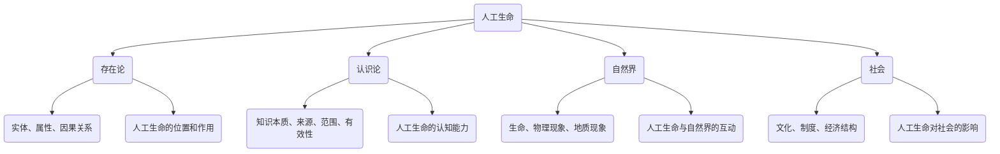

                 


### 文章标题：人工生命研究的哲学意义：重新定义生命与世界的关系

#### 关键词：人工生命，哲学意义，存在论，认识论，自然界，社会，技术挑战，伦理问题

#### 摘要：
本文旨在探讨人工生命研究的哲学意义，通过分析其在存在论、认识论等方面的作用，重新审视人工生命与自然界、社会之间的关系。文章首先介绍人工生命的定义与历史，随后深入探讨其哲学意义，最后分析人工生命的未来发展趋势及面临的技术挑战和伦理问题。

----------------------------------------------------------------

### 目录大纲设计

#### 第一部分：引言

#### 第1章：人工生命的概念与历史

1.1 人工生命的定义与特征

1.2 人工生命的历史与发展

1.3 人工生命的重要研究与应用领域

#### 第二部分：人工生命的哲学意义

#### 第2章：人工生命与存在论

2.1 存在论的基本概念

2.2 人工生命对存在论的挑战

2.3 人工生命与存在的辩证关系

#### 第3章：人工生命与认识论

3.1 认识论的基本概念

3.2 人工生命对认识论的贡献

3.3 认识论与人工生命的互动

#### 第三部分：人工生命与世界的关系

#### 第4章：人工生命与自然界的界限

4.1 自然界的定义与特征

4.2 人工生命与自然界的互动

4.3 人工生命对自然界的影响

#### 第5章：人工生命与社会的影响

5.1 社会的定义与特征

5.2 人工生命对社会的变革

5.3 社会对人工生命的回应

#### 第四部分：人工生命的未来发展

#### 第6章：人工生命的技术挑战与伦理问题

6.1 人工生命的技术挑战

6.2 人工生命的伦理问题

6.3 解决人工生命技术挑战与伦理问题的策略

#### 第7章：人工生命的未来展望

7.1 人工生命发展的趋势

7.2 人工生命可能带来的变革

7.3 对未来社会的思考与展望

#### 附录

#### 第8章：人工生命研究资源与工具

8.1 人工生命研究的主要资源

8.2 人工生命研究的主要工具

8.3 人工生命研究的未来趋势

#### 核心概念与联系

- **人工生命**：通过计算机模拟和编程创造出来的具有某种生物特征的系统，通常包括自主性、适应性、进化性等。

- **存在论**：哲学学科，研究存在的基本问题，包括存在、实体、属性、因果关系等。

- **认识论**：哲学学科，研究知识的本质、来源、范围、有效性等问题。

- **自然界**：所有存在的事物和现象，包括生命、物理现象、地质现象等。

- **社会**：由一群相互关联的个体组成的生活共同体，具有特定的文化、制度和经济结构。

#### 核心算法原理讲解

- **遗传算法**：一种模拟自然进化过程的搜索算法，用于求解优化问题和组合问题。

伪代码：

```
function GeneticAlgorithm(population, fitnessFunction):
    while not terminationCondition:
        select parents from population
        crossover parents to create offspring
        mutate offspring
        evaluate fitness of offspring
        select best individuals for next generation
    return best individual
```

- **神经网络**：一种模拟人脑神经元结构的计算模型，用于图像识别、语音识别、自然语言处理等领域。

伪代码：

```
layer1 = [inputLayer]
for hiddenLayer in hiddenLayers:
    layer1 = activationFunction(Weights * layer1 + biases)
layer2 = [outputLayer]
layer2 = activationFunction(Weights * layer1 + biases)
```

#### 数学模型和数学公式 & 详细讲解 & 举例说明

- **遗传算法中的适应度函数**：评估个体优劣的标准，通常与目标函数有关。

公式：

$$
f(x) = \frac{1}{1 + e^{-\beta (x - \mu)}}
$$

详细讲解：

这个公式是一个Sigmoid函数，用于将个体的适应度映射到0和1之间。其中，\(x\) 是个体的特征值，\(\mu\) 是平均值，\(\beta\) 是调节参数。

举例说明：

假设有一个特征值 \(x = 3\)，平均值 \(\mu = 2\)，调节参数 \(\beta = 1\)，那么适应度函数 \(f(x)\) 的值可以通过公式计算得出：

$$
f(x) = \frac{1}{1 + e^{-1 \cdot (3 - 2)}} = \frac{1}{1 + e^{-1}} \approx 0.731
$$

这意味着该个体的适应度相对较高。

----------------------------------------------------------------

### 核心概念与联系

首先，我们需要明确几个核心概念，这些概念在人工生命的哲学意义中起着关键作用：

- **人工生命**：这是通过计算机模拟和编程创建的具有某种生物特征的系统，通常包括自主性、适应性、进化性等。人工生命的研究涉及到计算机科学、生物学、哲学等多个领域。

- **存在论**：这是一个哲学学科，研究存在的基本问题，包括存在、实体、属性、因果关系等。在人工生命的研究中，存在论可以帮助我们理解人工生命在现实世界中的位置和作用。

- **认识论**：这是一个哲学学科，研究知识的本质、来源、范围、有效性等问题。在人工生命的研究中，认识论可以帮助我们理解人工生命的认知能力和知识的产生过程。

- **自然界**：这是所有存在的事物和现象的总和，包括生命、物理现象、地质现象等。人工生命与自然界的互动是人工生命研究的一个重要方面。

- **社会**：这是由一群相互关联的个体组成的生活共同体，具有特定的文化、制度和经济结构。人工生命对社会的影响也是人工生命研究的一个重要方面。

接下来，我们将使用Mermaid流程图来展示这些概念之间的关系：



在这个流程图中，我们可以看到人工生命与存在论、认识论、自然界和社会之间存在紧密的联系。人工生命作为研究的一个对象，不仅与哲学领域的基本问题相关联，还与自然界和社会有着深刻的互动。

### 人工生命的核心算法原理讲解

在人工生命的研究中，遗传算法和神经网络是两个核心的算法。这些算法不仅为人工生命的进化提供了理论基础，还在实际应用中发挥了重要作用。

#### 遗传算法

遗传算法是一种模拟自然进化过程的搜索算法，广泛应用于优化问题和组合问题。遗传算法的核心思想是通过模拟自然选择和遗传机制来寻找最优解。

**伪代码：**

```plaintext
function GeneticAlgorithm(population, fitnessFunction):
    while not terminationCondition:
        select parents from population
        crossover parents to create offspring
        mutate offspring
        evaluate fitness of offspring
        select best individuals for next generation
    return best individual
```

**详细解释：**

1. **初始化种群**：首先，我们初始化一个种群，种群中的每个个体都代表一个可能的解决方案。

2. **选择父母**：从当前种群中选择一些个体作为父母，通常使用适应度来决定选择概率。

3. **交叉**：父母个体通过交叉操作产生新的后代，交叉操作模拟了基因重组的过程。

4. **突变**：对后代进行突变，以引入新的基因变异，从而增加种群的多样性。

5. **评估适应度**：计算每个后代个体的适应度，适应度通常与目标函数有关。

6. **选择下一代**：根据适应度选择最好的个体组成下一代种群，从而逐步逼近最优解。

**举例说明：**

假设我们有一个简单的优化问题，目标是最小化函数 \(f(x) = (x - 2)^2\)。初始种群为 \([1, 2, 3, 4]\)，适应度函数为 \(f(x)\) 的值。经过几代遗传算法迭代后，种群逐渐收敛到一个接近最优解的个体，例如 \(x = 2\)。

#### 神经网络

神经网络是一种模拟人脑神经元结构的计算模型，广泛应用于图像识别、语音识别、自然语言处理等领域。神经网络的核心是多层神经元之间的加权连接和激活函数。

**伪代码：**

```plaintext
layer1 = [inputLayer]
for hiddenLayer in hiddenLayers:
    layer1 = activationFunction(Weights * layer1 + biases)
layer2 = [outputLayer]
layer2 = activationFunction(Weights * layer1 + biases)
```

**详细解释：**

1. **输入层**：输入层接收外部输入数据，并将其传递给下一层。

2. **隐藏层**：隐藏层对输入数据进行处理，通过加权连接和激活函数计算输出。

3. **输出层**：输出层产生最终输出，用于分类或预测。

4. **激活函数**：常用的激活函数包括 sigmoid、ReLU 等，用于引入非线性。

**举例说明：**

假设我们有一个简单的神经网络，用于实现逻辑与运算。输入层有两个神经元，分别接收 \(x_1\) 和 \(x_2\) 的输入。隐藏层有一个神经元，输出为 \(y = sigmoid(0.5x_1 + 0.5x_2)\)。输出层有一个神经元，输出为 \(z = sigmoid(y)\)。如果输入 \(x_1 = 1\) 和 \(x_2 = 1\)，则输出 \(z = 1\)，实现了逻辑与运算。

通过这些核心算法的讲解，我们可以看到人工生命的研究不仅仅是计算机科学的问题，还涉及到哲学、生物学等多个领域的深入探讨。

### 数学模型和数学公式 & 详细讲解 & 举例说明

在人工生命的研究中，数学模型和公式起着至关重要的作用。它们不仅为算法提供了理论基础，还在实际应用中发挥了关键作用。以下我们将介绍几个核心的数学模型和公式，并进行详细讲解和举例说明。

#### 遗传算法中的适应度函数

适应度函数是遗传算法中的核心组成部分，用于评估个体优劣的标准。一个典型的适应度函数是Sigmoid函数，其公式如下：

$$
f(x) = \frac{1}{1 + e^{-\beta (x - \mu)}}
$$

其中，\(x\) 是个体的特征值，\(\mu\) 是平均值，\(\beta\) 是调节参数。

**详细解释：**

这个公式是一个Sigmoid函数，其值域在0和1之间。当 \(x\) 接近 \(\mu\) 时，适应度函数的值接近0.5，表示个体处于中等水平；当 \(x\) 远离 \(\mu\) 时，适应度函数的值接近0或1，表示个体表现较差或优秀。

**举例说明：**

假设有一个特征值 \(x = 3\)，平均值 \(\mu = 2\)，调节参数 \(\beta = 1\)。根据适应度函数，我们可以计算该个体的适应度值：

$$
f(x) = \frac{1}{1 + e^{-1 \cdot (3 - 2)}} = \frac{1}{1 + e^{-1}} \approx 0.731
$$

这意味着该个体的适应度相对较高。

#### 神经网络中的激活函数

神经网络中的激活函数用于引入非线性，常见的激活函数包括Sigmoid、ReLU等。以Sigmoid函数为例，其公式如下：

$$
f(x) = \frac{1}{1 + e^{-x}}
$$

**详细解释：**

这个公式是一个Sigmoid函数，其值域在0和1之间。输入值 \(x\) 越大，函数值越接近1；输入值 \(x\) 越小，函数值越接近0。

**举例说明：**

假设输入值 \(x = 2\)，根据Sigmoid函数，我们可以计算输出值：

$$
f(x) = \frac{1}{1 + e^{-2}} \approx 0.869
$$

这意味着输入值 \(x = 2\) 对应的输出值约为0.869。

#### 人工生命中的进化模型

人工生命中的进化模型通常基于遗传算法，其中基因编码和基因操作是核心概念。以遗传算法中的交叉操作为例，其公式如下：

$$
c_1 = p_1 + \lambda (p_2 - p_1)
$$

其中，\(p_1\) 和 \(p_2\) 是两个父母基因，\(\lambda\) 是交叉率。

**详细解释：**

这个公式表示交叉操作，通过线性组合两个父母基因来生成新的子代基因。交叉率 \(\lambda\) 越大，交叉操作的影响越大；交叉率 \(\lambda\) 越小，交叉操作的影响越小。

**举例说明：**

假设两个父母基因 \(p_1 = [1, 0]\) 和 \(p_2 = [0, 1]\)，交叉率 \(\lambda = 0.5\)。根据交叉公式，我们可以计算子代基因 \(c_1\)：

$$
c_1 = 1 + 0.5 \cdot (0 - 1) = 0.5
$$

这意味着子代基因 \(c_1\) 的值为0.5。

通过这些数学模型和公式的讲解，我们可以更好地理解人工生命的研究方法和技术原理。这些数学工具为人工生命的进化、适应性和认知能力提供了坚实的理论基础。

### 人工生命的未来展望

随着技术的不断进步，人工生命的研究正在迅速发展，其潜在的应用场景也在不断扩展。在这一部分，我们将探讨人工生命未来发展的趋势，以及它可能对社会带来的变革。

#### 人工智能与人类合作

人工智能（AI）的发展已经使得机器在某些领域超越了人类的表现，如围棋、图像识别等。然而，人类在创造力、情感理解和复杂决策方面仍然具有优势。未来，人工生命可能会成为人类与人工智能合作的桥梁，通过模拟和增强人类智能，实现更高效、更智能的协同工作。

**示例**：在医疗领域，人工生命可以协助医生进行诊断和治疗，通过模拟病人的生理状态和疾病发展过程，提供个性化的治疗方案。

#### 人工智能在日常生活中的应用

随着智能家居、自动驾驶、智能助手等技术的普及，人工生命正在逐步融入我们的日常生活。未来，这些技术将进一步发展，为人类带来更加便捷、舒适的生活体验。

**示例**：智能家居系统中的人工生命可以自主学习家庭成员的日常习惯，自动调节家庭环境，提高居住舒适度。

#### 人工生命在环境监测与治理中的应用

环境问题日益严重，人工生命在环境监测与治理方面具有巨大的潜力。通过模拟和预测环境变化，人工生命可以帮助我们更好地应对气候变化、水资源管理、自然灾害等挑战。

**示例**：在水资源管理中，人工生命可以模拟水流、污染物的扩散，提供最优的水资源分配方案，减少水污染。

#### 人工智能伦理与社会责任

随着人工生命技术的不断发展，其伦理和社会责任问题也日益凸显。未来，我们需要制定更加完善的法律法规和伦理准则，确保人工生命技术的发展不会对人类社会造成负面影响。

**示例**：在人工智能辅助决策系统中，我们需要确保算法的透明度和公平性，避免歧视和偏见。

#### 未来社会的思考与展望

人工生命的未来发展将深刻影响人类社会。我们需要保持警惕，既要充分利用其带来的机遇，也要积极应对其可能带来的挑战。

**示例**：在就业方面，人工生命的普及可能导致某些工作岗位的消失，同时也创造了许多新的就业机会。我们需要通过教育培训，帮助劳动力适应新的工作环境。

综上所述，人工生命的未来发展充满机遇和挑战。通过合理引导和管理，我们可以将人工生命的技术潜力充分发挥出来，为人类社会带来更加美好的未来。

### 附录：人工生命研究资源与工具

在人工生命的研究领域，有许多资源和工具可供研究人员和爱好者使用。以下是一些主要的研究资源、工具和未来趋势的概述。

#### 主要研究资源

1. **学术期刊与会议**：
   - 《人工生命学报》（Journal of Artificial Life）
   - 《复杂性科学》（Complexity Science）
   - 国际人工生命与复杂性科学会议（International Conference on Artificial Life and Complexity Science）

2. **在线课程与讲座**：
   - Coursera、edX 等在线教育平台提供的人工生命相关课程
   - YouTube、Bilibili 等平台上的专业人士讲座和研讨会

3. **开源项目与代码库**：
   - GitHub、GitLab 等代码托管平台上的开源人工生命项目
   - Google Scholar、PubMed 等数据库中的人工生命研究论文代码

4. **学术社区与论坛**：
   - Artificial Life Research Group
   - Swarm Intelligence Forum

#### 主要研究工具

1. **编程语言与框架**：
   - Python：广泛应用于数据科学、机器学习和人工智能，支持多个开源库，如 NumPy、Pandas、PyTorch、TensorFlow。
   - Java：适合复杂系统开发，支持多线程和分布式计算。
   - C++：性能优秀，适用于高性能计算和实时系统。

2. **仿真平台**：
   - Swarm simulation platform：用于群体行为模拟。
   - Repast：支持多尺度仿真。
   - AnyLogic：提供丰富的建模和分析工具。

3. **机器学习与深度学习库**：
   - TensorFlow：谷歌开发的开源深度学习框架。
   - PyTorch：由 Facebook AI 研究团队开发的深度学习库。
   - Keras：基于 Theano 和 TensorFlow 的高级神经网络 API。

#### 未来趋势

1. **跨学科融合**：
   - 随着人工智能、生物学、物理学等领域的快速发展，人工生命研究将更加注重跨学科的合作，融合多学科知识。

2. **数据驱动的进化**：
   - 随着大数据和机器学习技术的进步，人工生命将更加依赖数据驱动的进化策略，实现更高效的学习和适应。

3. **模拟与实验的结合**：
   - 实验与仿真相结合，通过实验验证仿真结果，提高人工生命研究的可信度和实用性。

4. **人工智能伦理**：
   - 随着人工生命的普及，伦理问题将越来越受到关注，需要建立完善的伦理准则，确保技术发展符合社会价值观。

通过这些资源和工具，研究人员可以更加深入地探索人工生命的哲学意义和技术应用，为未来的科学研究和技术创新提供有力支持。随着人工生命研究的不断深入，我们有理由期待它在人类社会中的重要作用和深远影响。

