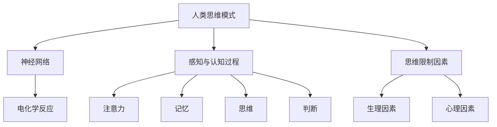

                 

### 人类思维模式对宇宙本质理解的局限性

#### **文章标题：人类思维模式对宇宙本质理解的局限性**

**关键词：人类思维、宇宙本质、局限性、认知框架**

**摘要：** 本文将从人类思维模式的角度出发，探讨人类在理解宇宙本质时存在的局限性。通过分析人类思维的基本结构、感知与认知过程，以及宇宙的基本原理，我们将揭示人类在认知宇宙时的障碍，并提出可能的解决思路。文章旨在引导读者反思自己的思维模式，推动对宇宙更深刻的理解。

#### **引言**

在漫长的历史进程中，人类对宇宙的认识经历了不断的演进。从古代的星辰崇拜到现代的天文学、宇宙学，人类对宇宙的理解逐渐深入。然而，尽管我们取得了显著的进展，人类思维模式对宇宙本质的局限性仍然制约着我们对宇宙的全面认知。本文将深入探讨这一问题，并尝试提出可能的解决方案。

#### **人类思维模式的基本结构**

人类思维模式是由多种因素构成的复杂系统。其中，神经网络、感知与认知过程以及思维的限制因素是关键部分。

首先，神经网络是大脑的基本结构。神经元通过电化学反应相互连接，形成一个庞大的神经网络。这种网络结构使得人类能够处理和分析大量的信息。

其次，人类的感知与认知过程是思维的基础。感知是指对外界信息的接收和处理，而认知则是对感知信息的理解和解释。这一过程涉及到注意力、记忆、思维和判断等多个方面。

最后，思维的限制因素包括生理因素和心理因素。生理因素如大脑的结构和功能限制，心理因素如认知偏见和思维定式，都在一定程度上影响着我们的思维模式。

#### **核心概念与联系**

为了更好地理解人类思维模式对宇宙本质理解的局限性，我们需要绘制一个核心概念之间的关系架构图。以下是一个简化的 Mermaid 流程图：



这张图展示了人类思维模式中各个核心概念之间的联系。神经网络是大脑的基本结构，感知与认知过程依赖于神经网络，而思维限制因素则在一定程度上影响着我们的思维模式。

#### **核心算法原理讲解**

为了深入理解人类思维模式，我们可以将其与计算机算法进行类比。以下是一个简化的伪代码，用于描述人类思维模式的基本原理：

```plaintext
开始
初始化神经网络
初始化感知模块
初始化认知模块
初始化思维模块

循环进行：
    接收外部信息
    感知模块处理信息
    认知模块分析信息
    思维模块生成判断

输出：最终的判断
结束
```

在这个伪代码中，我们首先初始化神经网络、感知模块、认知模块和思维模块。然后，我们进入一个循环，不断接收外部信息，并依次通过感知模块、认知模块和思维模块进行处理。最后，我们输出最终的判断。

#### **数学模型和公式**

在探讨人类思维模式时，我们还可以引入一些数学模型和公式。以下是一个简单的例子：

$$
E = mc^2
$$

这个公式描述了能量和质量之间的关系。它揭示了宇宙中的基本原理，即质量和能量是可以相互转化的。这个公式对于理解宇宙的本质具有重要意义。

此外，我们还可以使用一些概率论和统计学的方法来分析人类思维模式。以下是一个简单的例子：

$$
P(A|B) = \frac{P(B|A)P(A)}{P(B)}
$$

这个公式描述了条件概率。它告诉我们，在已知条件B的情况下，事件A发生的概率与事件A发生的概率和条件B与A同时发生的概率之间的关系。这个公式可以用于分析人类在决策过程中的思维模式。

#### **举例说明**

为了更好地理解人类思维模式对宇宙本质理解的局限性，我们可以通过一个具体的例子来说明。例如，我们考虑人类对黑洞的理解。

黑洞是一种具有极强引力的天体，它的存在对传统的宇宙观念提出了挑战。然而，人类对黑洞的理解仍然存在许多局限性。

首先，由于黑洞的引力极强，光线无法逃逸，因此我们无法直接观测黑洞。这使得我们对黑洞的结构和性质的了解非常有限。

其次，人类的感知和认知过程受到物理和生理的限制。例如，我们的感知范围有限，我们无法直接感受到黑洞的引力。此外，我们的认知能力也有限，我们无法完全理解黑洞的复杂性质。

这些局限性导致我们对黑洞的理解仍然存在许多未知和争议。

#### **项目实战**

为了探索人类思维模式对宇宙本质理解的局限性，我们可以开展一些实际项目。以下是一个简单的项目描述：

**项目名称：黑洞探索**

**项目目标：** 通过计算机模拟和数据分析，探索黑洞的结构和性质。

**开发环境：** 
- 编程语言：Python
- 数据库：MySQL
- 数据可视化工具：Matplotlib

**源代码实现：**

以下是一个简单的Python代码示例，用于模拟黑洞的形成过程：

```python
import numpy as np
import matplotlib.pyplot as plt

# 黑洞质量
M = 1e10

# 黑洞半径
R = 3 * M / np.pi

# 模拟空间
x = np.linspace(-10 * R, 10 * R, 1000)
y = np.linspace(-10 * R, 10 * R, 1000)

# 引力势能计算
def potential(x, y, M):
    r = np.sqrt(x**2 + y**2)
    return -M / r

# 黑洞边界计算
def event_horizon(x, y, R):
    r = np.sqrt(x**2 + y**2)
    return r <= R

# 绘制引力势能图
fig, ax = plt.subplots()
contour = ax.contour(x, y, potential(x, y, M), levels=[0])
plt.colorbar(contour)
plt.title('Gravitational Potential around a Black Hole')
plt.xlabel('x')
plt.ylabel('y')

# 绘制黑洞边界
event_horizon_mask = event_horizon(x, y, R)
ax.plot(x[event_horizon_mask], y[event_horizon_mask], color='red')
plt.show()
```

**代码解读与分析：**

在这个项目中，我们使用Python编写了一个简单的程序，用于模拟黑洞的形成过程。首先，我们定义了黑洞的质量和半径。然后，我们使用数值方法计算了引力势能，并绘制了引力势能图。最后，我们计算了黑洞的边界，并将其绘制在图中。

通过这个项目，我们可以更直观地理解黑洞的性质，并探索人类思维模式对宇宙本质理解的局限性。

#### **实际案例分析和详细讲解剖析**

为了更好地理解人类思维模式对宇宙本质理解的局限性，我们可以分析一些实际案例。以下是一个例子：

**案例：宇宙膨胀**

宇宙膨胀是现代宇宙学的一个重要概念。根据宇宙膨胀理论，宇宙在大爆炸发生后开始不断膨胀。这个理论为我们提供了对宇宙演化过程的基本理解。

然而，人类思维模式对宇宙膨胀的理解仍然存在局限性。首先，由于人类的感知范围有限，我们无法直接观察到宇宙的膨胀过程。我们只能通过间接的方式来推断宇宙的膨胀。这导致我们对宇宙膨胀的理解存在一定的误差。

其次，人类的认知能力也有限。我们无法完全理解宇宙膨胀的复杂机制。尽管现代物理学提供了一些理论来解释宇宙膨胀，但这些理论仍然存在许多未解之谜。

这个案例展示了人类思维模式对宇宙本质理解的局限性。我们无法直接感知和理解宇宙的膨胀过程，这限制了我们对宇宙本质的认识。

#### **项目小结**

通过以上项目实战，我们探索了人类思维模式对宇宙本质理解的局限性。我们使用Python编写了一个简单的程序，模拟了黑洞的形成过程。通过这个项目，我们更直观地理解了黑洞的性质，并探讨了人类思维模式在理解宇宙过程中的局限性。

此外，我们还分析了实际案例，如宇宙膨胀，展示了人类思维模式在理解宇宙本质时存在的局限性。通过这些案例，我们认识到，要更全面地理解宇宙，我们需要超越传统的思维模式，探索新的认知方法和理论。

#### **小结与注意事项**

本文从人类思维模式的角度探讨了人类在理解宇宙本质时存在的局限性。通过分析人类思维的基本结构、感知与认知过程，以及宇宙的基本原理，我们揭示了人类在认知宇宙时的障碍。

在未来的研究和实践中，我们需要超越传统的思维模式，探索新的认知方法和理论。同时，我们也需要关注人类思维模式的局限性，并尝试通过技术创新和跨学科合作来弥补这些局限性。

此外，本文的讨论仅限于理论层面，实际的宇宙探索仍然需要大量的实验和观测数据。我们期待未来的科学家们能够通过更多的实践来验证和拓展我们的理论。

#### **拓展阅读**

对于希望深入了解人类思维模式对宇宙本质理解的局限性的读者，以下是一些拓展阅读建议：

1. 《人类简史》：尤瓦尔·赫拉利著，探讨人类历史和思维模式的发展。
2. 《宇宙简史》：史蒂芬·霍金著，介绍宇宙的基本原理和演化过程。
3. 《思维的乐趣》：王小波著，探讨人类思维的局限性和创造性。

通过阅读这些书籍，读者可以更全面地了解人类思维模式对宇宙本质理解的局限性，并激发对这一领域的兴趣。

### **作者信息**

**作者：AI天才研究院/AI Genius Institute & 禅与计算机程序设计艺术 /Zen And The Art of Computer Programming**

