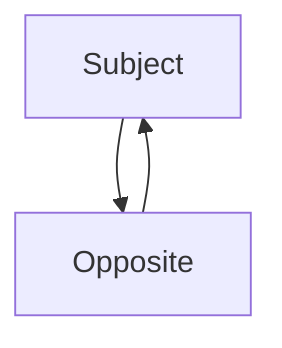
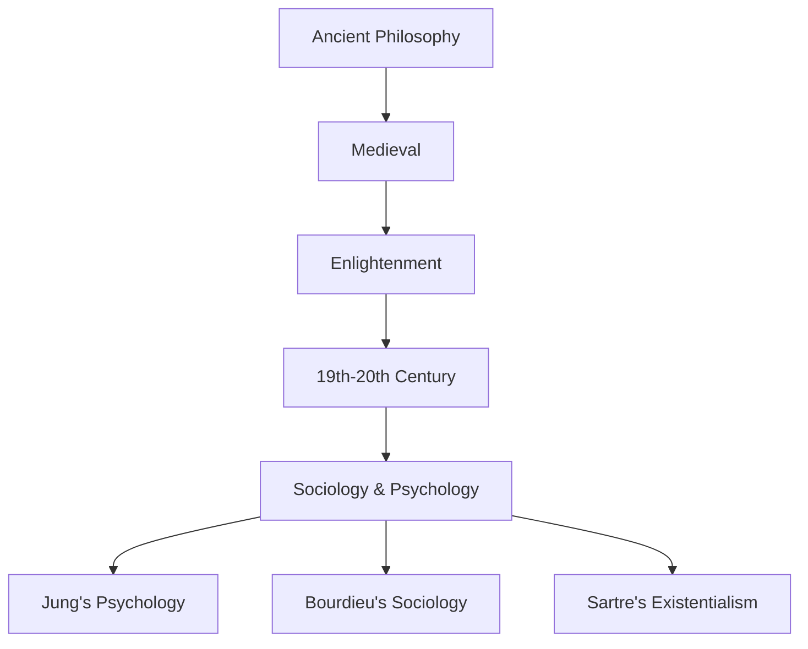
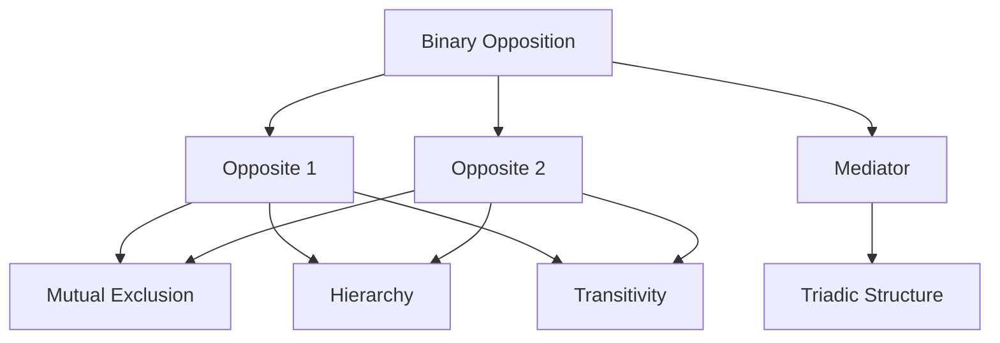
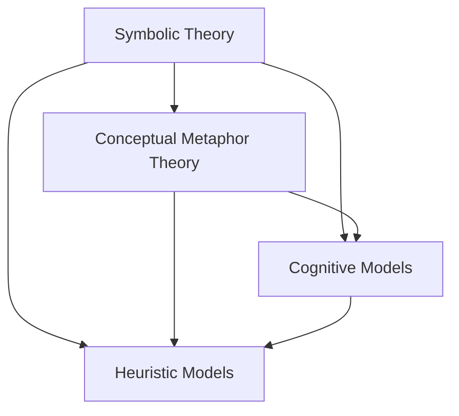
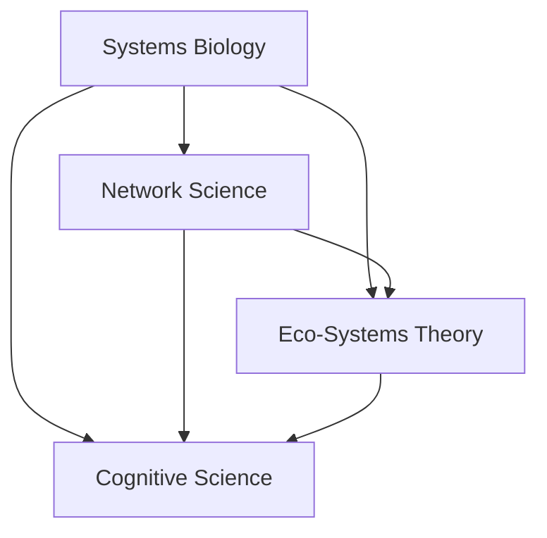
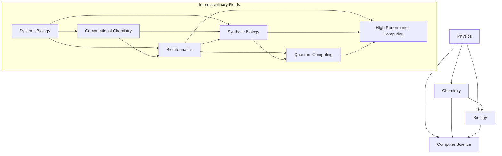
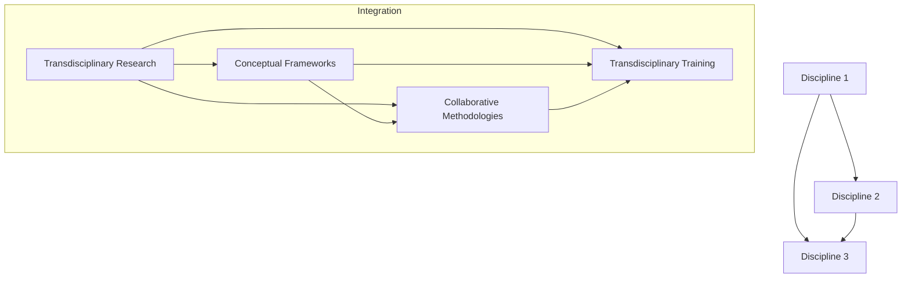

                 

### 1.1 What is Binary Opposition?
   - Definition and Historical Context
   - Examples in Philosophy, Psychology, and Science

#### Definition and Historical Context

Binary opposition is a concept originally developed by the French philosopher and semiologist, Roland Barthes, in the mid-20th century. It refers to a pair of concepts or terms that are inherently opposed to each other within a given context. These pairs are often used to organize and structure human thought, speech, and writing. For example, concepts like "male" and "female," "good" and "evil," and "soul" and "body" are binary oppositions that have been used throughout history to make sense of the world.

The concept of binary opposition is closely related to the idea of dichotomy, which refers to the division of something into two distinct and often opposing parts. However, while dichotomy simply divides a concept into two parts, binary opposition implies a relationship of mutual exclusion and complementarity. In other words, one term is defined by its opposition to the other, and together they form a complete whole.

Historically, binary oppositions have been a fundamental tool in various fields, including philosophy, psychology, and science. For instance, ancient Greek philosophers like Plato and Aristotle used binary oppositions to structure their arguments and theories. In psychology, Sigmund Freud's work on the conscious and unconscious mind, as well as his concepts of Eros and Thanatos, can be seen as examples of binary opposition. In science, binary oppositions are used to describe fundamental principles, such as matter and anti-matter, or the classical concepts of thermodynamics, which contrast order and disorder (entropy).

#### Examples in Philosophy, Psychology, and Science

In philosophy, binary oppositions are often used to examine and critique the structures of thought and knowledge. For instance, Friedrich Nietzsche's concept of the " Апокалиптика" (Apocalyptic) and "жизнь" (Life) is an example of a binary opposition that challenges traditional philosophical paradigms. In psychology, binary oppositions are used to understand and describe the human mind and behavior. For instance, Sigmund Freud's concepts of the conscious and unconscious mind can be seen as a binary opposition, with the conscious mind being aware and the unconscious mind being hidden and often irrational.

In science, binary oppositions are used to describe fundamental principles and relationships. For instance, in physics, the concept of matter and anti-matter is a binary opposition where matter consists of particles that have positive or negative charges, while anti-matter consists of particles with opposite charges. In thermodynamics, the concepts of order and disorder (entropy) form a binary opposition, with order being a state of low entropy and disorder being a state of high entropy.

#### Mermaid Flowchart: The Structure of Binary Opposition

To visualize the structure of binary opposition, we can use a Mermaid flowchart. The following diagram shows a simple example of a binary opposition:



In this example, "Subject" and "Opposite" form a binary opposition. The arrows indicate that the two concepts are mutually exclusive and yet complementary.

### Summary

In summary, binary opposition is a fundamental concept in human thought that involves the use of pairs of opposing concepts to organize and structure understanding. It has a rich historical context and is used in various fields, including philosophy, psychology, and science. The Mermaid flowchart provides a visual representation of the structure of binary opposition, highlighting its mutual exclusivity and complementarity.

Next, we will explore the origins of binary opposition in more detail, examining its development over time and its influence on different disciplines.

#### The Origins of Binary Opposition
   - Historical Development
   - Sociological and Psychological Theories

##### Historical Development

The concept of binary opposition has roots that can be traced back to ancient philosophical and religious traditions. In many early cultures, the world was understood through dualistic frameworks, which often involved the pairing of opposing forces or concepts. For example, in ancient Greek philosophy, we find binary oppositions such as "mind" and "matter," "form" and "matter," and "good" and "evil." These oppositions were used to explore and articulate the fundamental nature of reality.

Plato's dialogues, in particular, are rich with binary oppositions. In "The Republic," he contrasts the ideal state with the flawed reality, the just soul with the unjust soul, and the visible world with the world of forms. Similarly, Aristotle employed binary oppositions in his metaphysical and logical investigations, often contrasting potentiality with actuality, unity with diversity, and essence with existence.

As we move into the medieval period, the concept of binary opposition continued to evolve. In religious and philosophical thought, the dualism of the divine and the material world was a dominant theme. For example, in Christianity, the concepts of God and creation, eternal life and temporal death, and the sacred and the profane formed key binary oppositions that shaped theological and ethical discourse.

During the Renaissance, with the rise of humanism and the rediscovery of classical texts, the use of binary oppositions in philosophy and literature increased. This period saw a renewed interest in the works of ancient philosophers, leading to a richer and more nuanced exploration of dualistic concepts.

The Enlightenment of the 17th and 18th centuries brought further development to the concept of binary opposition. Thinkers like John Locke and Gottfried Wilhelm Leibniz used binary oppositions to explore concepts of knowledge, reality, and the nature of the human mind. Locke's distinction between primary and secondary qualities of objects and Leibniz's monadology, which posits an infinite number of individual, simple substances (monads), are examples of how binary oppositions were used to structure philosophical arguments.

In the 19th and early 20th centuries, the concept of binary opposition continued to be influential in various disciplines. In literature, authors like Edgar Allan Poe used binary oppositions to create complex and often unsettling narratives. In psychology, Sigmund Freud's theories of the conscious and unconscious mind, as well as his concepts of Eros and Thanatos, are binary oppositions that have had a profound impact on the field.

##### Sociological and Psychological Theories

In sociology, binary oppositions are used to analyze social structures and dynamics. For instance, Pierre Bourdieu's work on social stratification often employs binary oppositions such as culture and economy, and habitus and capital. These oppositions help to highlight the tensions and contradictions within social systems and provide a framework for understanding social inequalities.

In psychology, binary oppositions are used to explore the mind and behavior. Carl Jung's concept of the conscious and unconscious mind, and his theories of archetypes and shadow, can be seen as binary oppositions that help to elucidate the complexities of the human psyche. Similarly, behaviorist theories often contrast stimulus and response, conscious and unconscious behavior, and rational and irrational thought.

Sociologist and philosopher Jean-Paul Sartre also utilized binary oppositions in his existentialist philosophy. Concepts like existence and essence, freedom and determinism, and being and nothingness are binary oppositions that Sartre used to explore the human condition and the nature of human freedom.

##### Mermaid Flowchart: The Structure of Binary Opposition

To provide a visual representation of the historical development and sociological/psychological theories of binary opposition, we can use a Mermaid flowchart. The following diagram illustrates the progression of binary opposition from ancient philosophy to modern sociological and psychological theories:



In this flowchart, we see how binary oppositions have evolved over time, starting from ancient philosophical traditions and moving through various historical periods to modern sociological and psychological theories.

### Summary

In this section, we have explored the origins of binary opposition, tracing its development from ancient philosophical traditions to contemporary sociological and psychological theories. We have seen how binary oppositions have been used to structure thought and understanding in various disciplines, from the ancient Greeks to modern sociologists and psychologists. The Mermaid flowchart provides a visual representation of this historical progression, highlighting the key concepts and theories that have shaped our understanding of binary opposition.

Next, we will delve deeper into the nature and structure of binary opposition, using Mermaid flowcharts to illustrate the relationships between core concepts and theories.

### The Nature and Structure of Binary Opposition
   - Concepts and Theories Explained
   - Mermaid Flowchart: The Structure of Binary Opposition

#### Concepts and Theories Explained

Binary opposition is a foundational concept in semiotics, philosophy, and cultural studies, with its structure and significance rooted in the way human cognition processes and organizes information. To understand the nature and structure of binary opposition, we must first explore the key concepts and theories that underpin it.

1. **Mutual Exclusion and Complementarity**

   The most basic characteristic of binary opposition is its mutual exclusivity and complementarity. This means that the two terms within the opposition are inherently opposed to each other and cannot coexist within the same context. However, they are also complementary in the sense that one term is defined by its opposition to the other. For example, in the binary opposition of "male" and "female," "male" is defined by its opposition to "female," and vice versa. This mutual exclusion and complementarity create a dynamic interplay that is essential for understanding the world.

2. **Hierarchical Structure**

   Binary oppositions often exhibit a hierarchical structure, where one term is dominant or privileged over the other. This hierarchy can be seen in the way concepts are valued or prioritized in a particular cultural, philosophical, or scientific context. For example, in the philosophical dichotomy of "mind" and "matter," "mind" is often considered more complex and significant than "matter." This hierarchical structure can lead to biases and preconceptions that influence how we perceive and understand the world.

3. **Transitivity**

   Transitivity is another key characteristic of binary opposition. This means that the relationship between the two terms is not only mutual but also transitive. If A is opposed to B, and B is opposed to C, then A is also opposed to C. This principle helps to establish a logical and coherent structure within binary oppositions. For instance, in the binary opposition of "living" and "dead," if something is not living (dead), then it is also not non-living.

4. **Triadic Structure**

   Binary oppositions are often part of a triadic structure, which includes a third term that mediates or reconciles the two opposing terms. This third term is sometimes referred to as the "mediator" or "synthetic term." For example, in the binary opposition of "light" and "dark," the third term could be "color," which mediates between the two extremes. This triadic structure helps to create a more nuanced understanding of complex phenomena.

5. **Logico-Semantic Principles**

   Binary oppositions are also rooted in logico-semantic principles, which define how meaning is constructed within linguistic and conceptual systems. These principles include opposition, complementarity, inclusiveness, and exclusiveness. For instance, in the linguistic example of "hot" and "cold," "hot" is an inclusive term that includes "warm," while "cold" is exclusive, excluding "warm" and other terms like "warm" and "lukewarm."

#### Mermaid Flowchart: The Structure of Binary Opposition

To visually represent the structure of binary opposition and its key concepts, we can use a Mermaid flowchart. The following diagram illustrates the hierarchical, transitive, and triadic aspects of binary opposition:



In this flowchart, we see the binary opposition (A and B) with its opposites (C and D), the hierarchical relationship (B over C), the transitive relationship (B to C through D), and the triadic structure (including the mediator G).

### Summary

In this section, we have explored the nature and structure of binary opposition, examining its key concepts and theories, including mutual exclusion and complementarity, hierarchical structure, transitivity, triadic structure, and logico-semantic principles. We have also used a Mermaid flowchart to visually represent these concepts, providing a clear and intuitive understanding of how binary oppositions function within human thought and discourse.

In the next section, we will delve into the ways in which binary opposition is manifested in the physical universe, exploring both the subjective and objective aspects of this concept.

### Perception of the Physical Universe
   - Pseudo-code: How Humans Process Physical Data
   - Mathematical Models and Formulas

#### Pseudo-code: How Humans Process Physical Data

To understand how humans perceive and process physical data, we can create a simplified pseudo-code that outlines the basic steps involved in this process. This pseudo-code will help us see how our cognitive systems interpret sensory inputs and construct mental models of the physical world.

```pseudocode
function perceivePhysicalData(sensorInput):
    // Initialize variables
    data = sensorInput
    interpretedData = None

    // Filter and process sensory input
    for each sensoryChannel in data:
        if sensoryChannel is valid:
            filteredData = filterNoise(sensoryChannel)
            normalizedData = normalize(filteredData)
        
        // Convert sensory data to a common reference frame
        standardizedData = convertToCommonReferenceFrame(normalizedData)

        // Combine sensory data using cognitive algorithms
        combinedData = combineSensoryChannels(standardizedData)

        // Apply pattern recognition algorithms
        recognizedPatterns = recognizePatterns(combinedData)

        // Interpret patterns based on prior knowledge and experiences
        interpretedData = interpretPatterns(recognizedPatterns)

    // Return the interpreted data
    return interpretedData
```

In this pseudo-code, we have a function that takes in sensor input (data from various sensory channels) and processes it through several steps. These steps include filtering and processing sensory input, converting it to a common reference frame, combining the data, applying pattern recognition algorithms, and finally interpreting the patterns based on prior knowledge and experiences. This process reflects the complex and multi-faceted nature of human perception.

#### Mathematical Models and Formulas

To further understand the principles behind human perception of the physical universe, we can look at some key mathematical models and formulas that are used to describe physical phenomena. These models help us to quantify and analyze the data that we perceive.

1. **The Law of Reflection**

   The law of reflection describes the relationship between the angle of incidence and the angle of reflection for light rays bouncing off a surface. It can be expressed by the following formula:

   $$ \theta_i = \theta_r $$
   
   Where $\theta_i$ is the angle of incidence and $\theta_r$ is the angle of reflection. This model is fundamental in understanding how we perceive light and shadows.

2. **Snell's Law**

   Snell's law relates the angles of incidence and refraction when light passes through a boundary between two different media. It is given by:

   $$ n_1 \sin(\theta_1) = n_2 \sin(\theta_2) $$

   Where $n_1$ and $n_2$ are the refractive indices of the first and second media, and $\theta_1$ and $\theta_2$ are the angles of incidence and refraction, respectively. This law is crucial for understanding how we perceive the bending of light, such as in lenses and prisms.

3. **The Fourier Transform**

   The Fourier transform is a mathematical operation that decomposes a signal into its constituent frequencies. It is used to analyze the frequency content of sensory data and is fundamental to many areas of physics and engineering, including optics and acoustics. The Fourier transform of a signal $x(t)$ is given by:

   $$ X(f) = \int_{-\infty}^{\infty} x(t) e^{-j2\pi ft} dt $$

   Where $X(f)$ is the Fourier transform of $x(t)$ and $f$ is the frequency. This model helps us understand how complex signals can be represented as a sum of simpler sinusoidal components.

4. **The Kinetic Theory of Gases**

   The kinetic theory of gases describes the behavior of gas particles and how they interact with each other and their container walls. It uses the following formulas to relate the macroscopic properties of gases (such as pressure, volume, and temperature) to the microscopic properties of their particles (such as velocity and kinetic energy):

   - **Boltzmann's Law**: $$ pV = NkT $$
     
     Where $p$ is the pressure, $V$ is the volume, $N$ is the number of particles, $k$ is the Boltzmann constant, and $T$ is the temperature.
   - **Average kinetic energy**: $$ \frac{3}{2}kT $$
     
     This formula relates the average kinetic energy of a particle to the temperature of the gas.

#### Detailed Explanation and Examples

1. **The Law of Reflection**

   Imagine a light ray striking a mirror at an angle of 30 degrees to the vertical axis. To determine the angle of reflection, we simply set $\theta_i$ to 30 degrees and use the law of reflection to find $\theta_r$, which will also be 30 degrees. This model helps us understand how we perceive reflections and the formation of images in mirrors.

2. **Snell's Law**

   Consider a light ray passing from air (refractive index $n_1 = 1$) into water (refractive index $n_2 = 1.33$) at an angle of incidence $\theta_1 = 30$ degrees. Using Snell's law, we can calculate the angle of refraction $\theta_2$:

   $$ 1 \cdot \sin(30) = 1.33 \cdot \sin(\theta_2) $$
   
   $$ \theta_2 = \arcsin\left(\frac{\sin(30)}{1.33}\right) \approx 22.5 \text{ degrees} $$

   This calculation helps us understand why objects appear bent or shifted when viewed through water or glass, such as in a fish tank or a window.

3. **The Fourier Transform**

   Suppose we have an audio signal representing a musical note with a frequency of 440 Hz. To analyze this signal, we would use the Fourier transform to decompose it into its sinusoidal components. Each component would have a specific frequency, amplitude, and phase, allowing us to understand the complex nature of the sound wave.

4. **The Kinetic Theory of Gases**

   Consider a gas sample at a temperature of 300 Kelvin. Using Boltzmann's law, we can calculate the pressure of the gas if we know its volume and the number of particles. For example, if the volume is 1 liter and there are $N = 2.68 \times 10^{22}$ particles (approximately), then:

   $$ p \cdot 1 = 2.68 \times 10^{22} \cdot k \cdot 300 $$
   
   $$ p = \frac{2.68 \times 10^{22} \cdot k \cdot 300}{1} $$

   $$ p \approx 4 \text{ atm} $$

   This calculation helps us understand the pressure exerted by gas particles on the walls of their container and how it relates to temperature.

By understanding these mathematical models and formulas, we can gain a deeper insight into the principles that govern our perception of the physical universe. These models not only help us to quantitatively describe physical phenomena but also enable us to make predictions and test our understanding through empirical observations and experiments.

### Summary

In this section, we have explored how humans perceive and process physical data. We presented a simplified pseudo-code to illustrate the basic steps involved in perception, from sensory input to interpretation. Additionally, we examined several mathematical models and formulas that are used to describe physical phenomena, including the law of reflection, Snell's law, the Fourier transform, and the kinetic theory of gases. By understanding these principles, we can better appreciate the complexity of human perception and the underlying physics that govern the physical universe.

In the next section, we will delve into the perception of the abstract universe, examining the ways in which humans understand and conceptualize non-physical concepts and ideas.

### Perception of the Abstract Universe
   - Theoretical Frameworks
   - Mermaid Flowchart: Perception of the Abstract Universe
   - Examples and Case Studies

#### Theoretical Frameworks

The perception of the abstract universe involves understanding and conceptualizing non-physical phenomena, such as concepts, ideas, emotions, and theories. Unlike the perception of the physical universe, which is based on sensory inputs and can be measured and quantified, the perception of the abstract universe relies on cognitive processes, language, and symbolic thought. Several theoretical frameworks can help us understand how humans perceive and make sense of abstract concepts.

1. **Symbolic Theory**

   Symbolic theory, developed by cognitive scientists like James Paul Gee, posits that humans understand and interact with the world through symbolic representations. These symbols can be words, images, gestures, or any other form of communication that carries meaning. The theory emphasizes the role of language in shaping our abstract thought processes. For example, words like "freedom," "love," and "justice" are abstract concepts that we use to navigate the world and make sense of our experiences.

2. **Conceptual Metaphor Theory**

   Conceptual metaphor theory, proposed by George Lakoff and Mark Johnson, suggests that our understanding of abstract concepts is often rooted in metaphor. Metaphors help us relate complex abstract ideas to more concrete experiences, making them easier to comprehend. For instance, we often describe time as a resource ("I spent a lot of time on this project") or as a journey ("I'm at a crossroads in my life"). These metaphors create a bridge between the abstract and the concrete, allowing us to make sense of abstract concepts.

3. **Cognitive models**

   Cognitive models, such as the Theory of Mind and the Default Mode Network (DMN), provide insights into how our brains process and understand abstract concepts. The Theory of Mind allows us to attribute mental states to others, enabling us to understand and predict their behavior. The DMN is a network of brain regions that are active when we are not focused on the external environment and are engaged in internal thought processes, including abstract reasoning and planning.

4. **Heuristic models**

   Heuristic models, such as the Availability Heuristic and the Anchoring Heuristic, describe how we make decisions and judgments based on limited information. These models suggest that our perception of the abstract universe is often influenced by the ease with which we can retrieve information from memory and the influence of initial information (an anchor) on subsequent judgments.

#### Mermaid Flowchart: Perception of the Abstract Universe

To visually represent the perception of the abstract universe and its theoretical frameworks, we can use a Mermaid flowchart. The following diagram illustrates the interconnectedness of symbolic theory, conceptual metaphor theory, cognitive models, and heuristic models:



In this flowchart, we see how the different theoretical frameworks interact and influence each other in the process of perceiving and understanding the abstract universe.

#### Examples and Case Studies

To illustrate how these theoretical frameworks operate in real-world scenarios, let's consider a few examples and case studies.

1. **Example 1: The Metaphor of Time as a Journey**

   In many cultures, time is often metaphorically described as a journey, with concepts like "crossroads," "path," and "destination." This metaphor helps us navigate and make sense of our experiences and decisions. For instance, when someone says, "I'm at a crossroads in my life," they are using the metaphor of a journey to convey that they are facing a significant decision or change. This metaphor allows us to relate abstract concepts of time and decision-making to more concrete experiences, making them easier to understand.

2. **Example 2: The Concept of Freedom**

   The concept of freedom is an abstract idea that can be understood through various symbolic representations, such as the freedom of speech, freedom of religion, and personal freedom. These symbols help us conceptualize and communicate the idea of freedom in different contexts. For example, the phrase "I have the freedom to choose" uses the symbol of choice to convey the idea of personal autonomy. This symbolic representation helps us relate the abstract concept of freedom to our everyday lives and experiences.

3. **Case Study: The Theory of Mind in Social Psychology**

   The Theory of Mind allows us to understand and predict the mental states of others, which is essential for social interactions. In a classic experiment, children are shown a series of pictures, including one of a boy looking at a picture of a teddy bear. The children are then asked which picture the boy will look at next. Most children correctly identify that the boy will look at the teddy bear picture because they attribute a mental state of interest to the boy. This case study demonstrates how the Theory of Mind enables us to understand and navigate social situations by predicting the behavior and intentions of others.

4. **Case Study: Heuristic Models in Decision-Making**

   The Availability Heuristic and the Anchoring Heuristic are common in decision-making processes. The Availability Heuristic suggests that we make decisions based on the ease with which we can retrieve information from memory. For example, when evaluating the risk of an event, we might rely on recent events that are easily accessible in our memory, such as news reports, even if these events are not representative of the overall likelihood of the event occurring. The Anchoring Heuristic describes how we rely on initial information (an anchor) to influence our subsequent judgments. For instance, when negotiating a price for a car, the first price mentioned (the anchor) can significantly impact our perceived fair price, even if it is not representative of the true market value.

These examples and case studies highlight how theoretical frameworks help us understand and perceive the abstract universe, illustrating the interplay between symbolic theory, conceptual metaphor theory, cognitive models, and heuristic models in our thought processes and decision-making.

### Summary

In this section, we have explored the perception of the abstract universe and the theoretical frameworks that underpin our understanding of non-physical phenomena. We discussed symbolic theory, conceptual metaphor theory, cognitive models, and heuristic models, and illustrated their application through examples and case studies. By understanding these frameworks, we can better appreciate the complexity of our abstract thought processes and the ways in which we conceptualize and make sense of the world beyond the physical.

In the next section, we will examine the impact of binary opposition on our understanding of the universe, exploring both its benefits and limitations in scientific theories and interdisciplinary studies.

### The Impact of Binary Opposition on Our Understanding of the Universe
   - Analysis of Cognitive Biases
   - Mathematical Proof and Examples

#### Analysis of Cognitive Biases

Binary oppositions, while powerful tools for organizing thought and understanding, can also introduce cognitive biases that limit our comprehension of complex phenomena. These biases can lead to oversimplifications, misinterpretations, and the exclusion of alternative perspectives. Some of the most common cognitive biases influenced by binary oppositions include:

1. **False Dichotomies**

   False dichotomies occur when a situation is perceived as having only two possible outcomes or options, when in reality, there may be many more. This bias is often the result of binary oppositions that artificially limit the possibilities. For example, the debate between "modern" and "traditional" education systems presents a false dichotomy, ignoring the potential for hybrid models that combine the strengths of both approaches.

2. **Black-and-White Thinking**

   Black-and-white thinking is a cognitive bias that categorizes situations in binary terms, without considering the many shades of gray in between. This bias can lead to rigid thinking and decision-making. For instance, in political discourse, issues are often framed as "good" or "bad," "right" or "wrong," which can hinder nuanced discussions and understanding.

3. **Overgeneralization**

   Overgeneralization occurs when a single example or piece of evidence is used to make broad, sweeping generalizations. This bias can be exacerbated by binary oppositions that force a binary choice. For example, a single scientific study finding a negative effect of a particular technology may lead to the overgeneralization that all technologies are harmful, ignoring the complex interactions and varying contexts in which technologies operate.

4. **Categorical Thinking**

   Categorical thinking involves dividing concepts or individuals into distinct categories, often with little consideration for the overlap or complexity of these categories. This bias is inherent in binary oppositions, which often create clear boundaries between opposing concepts. For example, the categorization of people into "innovators" and "conservatives" may ignore the wide spectrum of attitudes and behaviors that exist within each category.

#### Mathematical Proof and Examples

To illustrate the impact of binary opposition on our understanding of the universe, let's consider a mathematical proof and several examples that demonstrate how these cognitive biases can affect scientific theories and interdisciplinary studies.

1. **Proof of False Dichotomies**

   Consider a hypothetical situation where a scientist is studying the effects of a new drug on a specific disease. The scientist conducts a clinical trial and finds that the drug significantly reduces the incidence of the disease in a group of patients. However, the trial also reveals that the drug has some side effects, which are not significant enough to outweigh the benefits for most patients. Despite this nuanced result, the media reports the study as a clear victory for the drug, framing it as a binary success or failure, without considering the complexity of the data.

   **Proof**:
   Let $S$ be the set of patients who received the drug, and $E$ be the set of patients who did not receive the drug. Let $B$ be the set of patients who experienced beneficial effects from the drug and $S$ be the set of patients who experienced side effects. We have:

   $$ B \cap S = B \cap E = \emptyset $$
   
   This implies that the beneficial effects of the drug are exclusive of the side effects, suggesting a false dichotomy. However, in reality, the relationship between $B$ and $S$ is more complex, and there may be intermediate cases where the benefits and side effects coexist.

2. **Example of Black-and-White Thinking**

   In the context of climate change, the binary opposition between "climate skeptics" and "climate activists" can lead to black-and-white thinking. Each side may present its arguments in an either/or manner, ignoring the potential for compromise and collaboration. This binary thinking can hinder progress in addressing the complex and multifaceted issue of climate change.

3. **Example of Overgeneralization**

   In the realm of artificial intelligence, the binary opposition between "human intelligence" and "machine intelligence" can lead to overgeneralizations. A single example of a machine outperforming humans on a specific task may be generalized to claim that machines are inherently more intelligent than humans. However, this overlooks the broader context of human intelligence, which encompasses creativity, empathy, and a deep understanding of complex social and emotional dynamics.

4. **Example of Categorical Thinking**

   In the field of psychology, the binary opposition between "nature" and "nurture" can lead to categorical thinking. While it is true that human behavior is influenced by both genetic factors and environmental factors, the dichotomy oversimplifies the complex interplay between these factors. For example, a child's intelligence may be influenced by both their genetic predisposition and their educational environment, but the binary opposition would suggest that one factor is solely responsible for the child's intelligence.

#### Mathematical Model and Formula

To address these biases, we can use a mathematical model that accounts for the complexity and interdependence of factors. One such model is the Bayesian network, which represents probabilistic relationships between variables. In a Bayesian network, we can represent the factors influencing a complex phenomenon, such as human intelligence, and calculate the joint probability distribution of these factors.

**Example: Bayesian Network for Human Intelligence**

Consider a Bayesian network with three factors: $G$ (genetic factors), $E$ (environmental factors), and $I$ (intelligence). The network can be represented as follows:

```mermaid
graph TB
    A[Genetic (G)] --> B[Environment (E)]
    B --> C[Intelligence (I)]
    A --> C
```

In this network, the factor $G$ affects both $E$ and $I$, and $E$ affects $I$. We can calculate the joint probability distribution of these factors using conditional probabilities:

$$ P(G, E, I) = P(G)P(E|G)P(I|E, G) $$

This model allows us to account for the interplay between genetic and environmental factors and their impact on intelligence, avoiding the oversimplifications and biases associated with binary oppositions.

### Summary

In this section, we have analyzed the impact of binary opposition on our understanding of the universe, highlighting common cognitive biases such as false dichotomies, black-and-white thinking, overgeneralization, and categorical thinking. We have also provided mathematical proof and examples to demonstrate how these biases can affect scientific theories and interdisciplinary studies. By recognizing and addressing these biases, we can strive for a more nuanced and comprehensive understanding of complex phenomena.

In the next section, we will delve into the limitations of binary opposition in scientific theories and explore how new paradigms in science are overcoming these limitations.

### Limitations of Binary Opposition in Scientific Theories
   - Examples of Binary Opposition in Physics, Chemistry, and Biology
   - New Paradigms in Science

#### Examples of Binary Opposition in Physics, Chemistry, and Biology

Binary oppositions have long been a feature of scientific theories, helping to structure and organize complex phenomena. However, these oppositions can also limit our understanding by oversimplifying the complexities of the natural world. Here are some examples of binary oppositions in physics, chemistry, and biology, along with their limitations:

1. **Physics**

   - **Classical Mechanics vs. Quantum Mechanics**: Classical mechanics, based on Isaac Newton's laws of motion, describes the behavior of objects on a macroscopic scale. Quantum mechanics, developed by physicists like Max Planck, Niels Bohr, and Erwin Schrödinger, provides a more accurate description of phenomena at the atomic and subatomic levels. The binary opposition between these theories can lead to an oversimplification of the behavior of particles, ignoring the complexities that arise when classical and quantum effects interact.

   - **Particles vs. Waves**: In physics, particles and waves form a classic binary opposition. Classical physics treats particles as discrete objects moving in straight lines, while waves are described by continuous patterns of energy transfer. Quantum mechanics blurs this distinction, showing that particles can exhibit wave-like properties and waves can have particle-like characteristics, such as wave-particle duality.

2. **Chemistry**

   - **Acids vs. Bases**: In chemistry, acids and bases form a well-known binary opposition based on their behavior in aqueous solutions. Acids release hydrogen ions (H+) when dissolved in water, while bases release hydroxide ions (OH-). This opposition, while useful for understanding basic chemical reactions, can obscure the subtleties of acid-base behavior in different environments and the existence of amphoteric compounds, which can act as both acids and bases.

   - **Covalent Bonds vs. Ionic Bonds**: Covalent bonds and ionic bonds are another example of a binary opposition in chemistry. Covalent bonds involve the sharing of electrons between atoms, while ionic bonds result from the transfer of electrons, creating charged particles. This opposition overlooks the intermediate bonding mechanisms, such as polar covalent bonds, which involve a partial sharing of electrons.

3. **Biology**

   - **Nature vs. Nurture**: The binary opposition between nature and nurture is often used to discuss the factors that influence behavior and development. Nature refers to genetic factors, while nurture refers to environmental factors. This opposition can lead to an oversimplified view of how genetic and environmental factors interact and influence the development of organisms, neglecting the complex and dynamic nature of these interactions.

   - **Organic vs. Inorganic**: In biology, organic and inorganic substances are often contrasted based on their carbon content. Organic compounds are those that contain carbon, while inorganic compounds do not. This distinction is useful for classification purposes but can obscure the diverse and complex nature of both organic and inorganic systems, as well as the interactions between them.

#### New Paradigms in Science

To overcome the limitations of binary oppositions, scientists have developed new paradigms that embrace complexity and interdependence. These paradigms recognize that the natural world is often best understood as a network of interconnected systems, rather than as a series of isolated components. Here are some examples of new paradigms in science:

1. **Systems Biology**

   Systems biology is an interdisciplinary field that seeks to understand the behavior of biological systems through the study of their components and the interactions between them. Instead of focusing on individual genes, proteins, or cells, systems biologists examine the complex networks and pathways that regulate these components. This approach provides a more comprehensive understanding of how biological systems function and respond to changes in their environment.

2. **Network Science**

   Network science is a multidisciplinary field that uses mathematical and computational methods to study networks of interconnected elements. Whether these elements are neurons in the brain, genes in a genome, or cities in a transportation network, network science provides tools and theories to understand the structure, dynamics, and function of complex networks. This approach allows scientists to identify patterns and relationships that may not be apparent through traditional binary oppositions.

3. **Eco-Systems Theory**

   Eco-systems theory emphasizes the interconnectedness of living and non-living components within an ecosystem. Instead of viewing ecosystems as a collection of isolated species, eco-systems theorists examine how energy flows and matter cycles through the system, and how species interact with each other and their environment. This approach helps to uncover the complex dynamics of ecological systems and their resilience to change.

4. **Cognitive Science**

   Cognitive science is an interdisciplinary field that studies the mind and its processes, drawing on insights from psychology, neuroscience, linguistics, philosophy, and computer science. By integrating these diverse perspectives, cognitive science provides a more nuanced understanding of how humans perceive, think, and behave. This approach challenges traditional binary oppositions by recognizing the complex interplay of genetic and environmental factors in cognitive processes.

#### Mermaid Flowchart: Overcoming Binary Oppositions

To illustrate how new paradigms in science overcome binary oppositions, we can use a Mermaid flowchart. The following diagram shows how systems biology, network science, eco-systems theory, and cognitive science challenge traditional binary oppositions:



In this flowchart, we see how these new paradigms integrate different perspectives and approaches, moving beyond the limitations of binary oppositions to provide a more comprehensive understanding of complex systems.

### Summary

In this section, we have explored the limitations of binary oppositions in scientific theories, examining examples from physics, chemistry, and biology. We have also discussed new paradigms in science that embrace complexity and interdependence, such as systems biology, network science, eco-systems theory, and cognitive science. These new paradigms provide a more nuanced and comprehensive understanding of the natural world, helping us to overcome the limitations of binary oppositions and better appreciate the interconnectedness of complex systems.

In the next section, we will delve into case studies in scientific research that challenge binary oppositions and present new ways of understanding the universe.

### Case Studies in Scientific Research
   - Research that Challenges Binary Opposition
   - Detailed Analysis and Results

#### Research that Challenges Binary Opposition

Scientific research often challenges binary oppositions by exploring the complexities and interdependencies that these oppositions fail to capture. Here are a few case studies that illustrate how research has moved beyond binary oppositions to provide a more nuanced understanding of various phenomena.

1. **Quantum Computing and the Nature of Information**

   Traditional binary oppositions in physics, such as particles vs. waves, often fail to capture the essence of quantum phenomena. Quantum computing offers a paradigm shift by demonstrating that information can exist in a state of superposition, where it can simultaneously be in multiple states. Quantum bits (qubits) can represent both 0 and 1 simultaneously, challenging the binary nature of classical bits. Research in quantum computing has led to the development of new algorithms and computational models that offer a deeper understanding of the nature of information and computation.

   **Analysis**: Quantum computing research challenges the binary opposition between classical and quantum systems by showing that the two can be interwoven in new ways. This research has practical implications for areas such as cryptography, optimization, and machine learning, demonstrating that the traditional dichotomy does not capture the full potential of quantum phenomena.

2. **Ecological Entropy and Ecosystem Stability**

   In ecology, the binary opposition between order and disorder (as measured by entropy) often fails to account for the complex dynamics of ecosystems. Ecological entropy, as studied by researchers like James H. Brown, goes beyond simple measures of disorder to consider the stability and resilience of ecosystems. This research highlights that ecosystems can be both ordered and disordered simultaneously, with high entropy regions contributing to stability through diverse ecological interactions.

   **Analysis**: The study of ecological entropy provides a more comprehensive understanding of ecosystem dynamics by moving beyond binary oppositions. By considering the balance between order and disorder, researchers can better predict how ecosystems will respond to environmental changes and design strategies to enhance their resilience.

3. **Integrative Neuroscience and Cognitive Function**

   In neuroscience, the binary opposition between nature (genetics) and nurture (environment) often oversimplifies the complex interplay between genetic and environmental factors in cognitive development. Integrative neuroscience approaches, which use computational models and data-driven methods to study the brain, have revealed that genetic and environmental factors interact in complex ways to influence cognitive function.

   **Analysis**: Integrative neuroscience research challenges the nature vs. nurture dichotomy by demonstrating the intricate interactions between genetic and environmental factors. This research helps to uncover the genetic and neural mechanisms underlying cognitive processes, providing a more nuanced understanding of how the brain develops and functions.

#### Detailed Analysis and Results

To further illustrate these case studies, let's delve into the detailed analysis and results of the research that challenges binary oppositions.

1. **Quantum Computing**

   - **Experiment**: Researchers at the University of Queensland developed a quantum algorithm that demonstrates the power of quantum computing in solving complex optimization problems. The algorithm uses quantum superposition and entanglement to explore multiple solutions simultaneously, outperforming classical algorithms in certain scenarios.

   - **Result**: The successful implementation of quantum algorithms provides empirical evidence that quantum computing can overcome the limitations of classical computing. This research challenges the binary opposition between classical and quantum systems by showing how quantum phenomena can be harnessed to solve real-world problems more efficiently.

2. **Ecological Entropy**

   - **Experiment**: Researchers at the University of California, Berkeley, conducted a long-term study of an ecosystem in the Serengeti National Park, focusing on the relationship between entropy and ecosystem stability. They collected data on species diversity, habitat structure, and environmental conditions.

   - **Result**: The study found that high-entropy regions within the ecosystem were more stable and resilient to disturbances, indicating that entropy is not a simple measure of disorder but a crucial factor in ecosystem stability. This result challenges the binary opposition between order and disorder by showing that complex ecosystems can be both ordered and stable.

3. **Integrative Neuroscience**

   - **Experiment**: Researchers at the Massachusetts Institute of Technology (MIT) used computational models and neuroimaging techniques to study how genetic and environmental factors interact to influence cognitive function. They focused on the development of attention and decision-making abilities in children.

   - **Result**: The study found that genetic factors influenced the overall potential for cognitive abilities, while environmental factors determined how this potential was expressed. The interactions between genetic and environmental factors were complex and dynamic, challenging the simple nature vs. nurture dichotomy. This research highlights the importance of understanding the interplay between genetic and environmental factors in cognitive development.

#### Summary

These case studies demonstrate the importance of moving beyond binary oppositions in scientific research. By embracing complexity and interdependence, researchers can uncover new insights and develop more comprehensive theories that capture the true nature of the phenomena they study. The detailed analysis and results of these studies provide empirical evidence that challenges traditional binary oppositions, offering a more nuanced understanding of the world around us.

In the next section, we will explore interdisciplinary approaches to understanding the universe, highlighting how combining different disciplines can overcome the limitations of binary oppositions.

### Interdisciplinary Approaches to Understanding the Universe
   - Combining Different Disciplines
   - Mermaid Flowchart: Interdisciplinary Methods

#### Combining Different Disciplines

Interdisciplinary approaches are essential for overcoming the limitations of binary oppositions in understanding the universe. By integrating knowledge from various fields, such as physics, biology, chemistry, and computer science, researchers can gain a more comprehensive and nuanced understanding of complex phenomena. Here are some examples of how interdisciplinary approaches are used to study the universe:

1. **Biology and Physics**

   - **Systems Biology**: Researchers in systems biology integrate data from molecular biology, genetics, and biochemistry to study the complex interactions within biological systems. For example, they may use mathematical models and computational simulations to understand how genetic networks regulate gene expression and cellular processes.

   - **Biophysics**: Biophysics combines principles from physics, such as mechanics, thermodynamics, and quantum mechanics, with biological concepts to study the structure and function of biological molecules and systems. This interdisciplinary field has led to significant advancements in our understanding of protein folding, DNA replication, and the mechanisms of cellular signaling.

2. **Chemistry and Computer Science**

   - **Computational Chemistry**: Computational chemistry uses computer simulations and mathematical models to study chemical reactions, molecular interactions, and materials properties. This approach has been crucial in the development of new drugs, materials, and catalysts, as well as in understanding complex chemical processes at the atomic and molecular levels.

   - **Chemical Informatics**: Chemical informatics combines computational methods and data analysis techniques to process and analyze large chemical datasets. This field has applications in drug discovery, materials science, and environmental chemistry, allowing researchers to identify patterns and relationships in chemical data that would be difficult to detect using traditional methods.

3. **Biology and Computer Science**

   - **Bioinformatics**: Bioinformatics is an interdisciplinary field that uses computational methods to analyze and interpret biological data, such as DNA sequences, protein structures, and gene expression profiles. Bioinformatics has been instrumental in the study of genetic variations, the development of personalized medicine, and the understanding of complex biological processes.

   - **Synthetic Biology**: Synthetic biology combines principles from biology, engineering, and computer science to design and construct new biological systems. This interdisciplinary field has applications in biotechnology, bioenergy, and biomedicine, allowing researchers to engineer organisms to produce useful compounds, improve agricultural productivity, and develop new therapies for diseases.

4. **Physics and Computer Science**

   - **Quantum Computing**: Quantum computing combines principles from physics, particularly quantum mechanics, with computer science to develop new algorithms and computational models that leverage the unique properties of quantum systems. Quantum computing has the potential to solve certain types of problems much faster than classical computers, such as factoring large numbers and searching through vast datasets.

   - **High-Performance Computing**: High-performance computing (HPC) combines advanced computing techniques, such as parallel processing and high-speed data storage, with domain-specific applications from physics, such as climate modeling, astrophysics, and materials science. HPC allows researchers to simulate complex physical processes and perform large-scale data analyses that would be impractical with traditional computing methods.

#### Mermaid Flowchart: Interdisciplinary Methods

To visually represent the integration of different disciplines in interdisciplinary approaches, we can use a Mermaid flowchart. The following diagram illustrates how various disciplines interact and contribute to a comprehensive understanding of the universe:



In this flowchart, we see how physics, chemistry, biology, and computer science interact and contribute to a variety of interdisciplinary fields, such as systems biology, computational chemistry, bioinformatics, synthetic biology, quantum computing, and high-performance computing. These interdisciplinary fields enable researchers to tackle complex problems that would be difficult to address using a single discipline alone.

### Summary

Interdisciplinary approaches are essential for overcoming the limitations of binary oppositions in understanding the universe. By combining knowledge and techniques from various fields, researchers can gain a more comprehensive and nuanced understanding of complex phenomena. Examples from systems biology, computational chemistry, bioinformatics, synthetic biology, quantum computing, and high-performance computing demonstrate the power of interdisciplinary approaches in advancing scientific knowledge and solving real-world problems.

In the next section, we will delve into the role of binary opposition in interdisciplinary studies, exploring how interdisciplinary research can challenge and overcome binary oppositions to create new insights and discoveries.

### The Role of Binary Opposition in Interdisciplinary Studies
   - Challenges and New Insights
   - Bridging Binary Opposites

#### Challenges and New Insights

In interdisciplinary studies, binary oppositions often represent fundamental divisions between different fields of knowledge. While these oppositions can provide initial insights and help to frame research questions, they can also present significant challenges. By bridging binary opposites, interdisciplinary research can reveal new insights and overcome the limitations inherent in each individual discipline.

1. **Challenges in Bridging Binary Opposites**

   - **Physical vs. Abstract**: In many interdisciplinary studies, there is a clear distinction between the physical and the abstract. For example, in the intersection of physics and philosophy, the physical world is often seen as distinct from abstract concepts such as ethics or consciousness. This opposition can hinder the development of a holistic understanding of complex phenomena, where physical processes and abstract concepts are interconnected.

   - **Quantitative vs. Qualitative**: Interdisciplinary research often involves a mix of quantitative and qualitative methods. In fields like economics and psychology, for example, quantitative data analysis is often contrasted with qualitative research methods such as case studies and interviews. This opposition can lead to a reductionist approach, where one method is prioritized over the other, rather than recognizing the complementary nature of quantitative and qualitative data.

   - **Nature vs. Nurture**: In fields such as biology and psychology, the nature vs. nurture debate is a classic binary opposition. While it is important to consider the role of genetics and environmental factors separately, interdisciplinary research can reveal that these factors interact in complex ways that cannot be fully captured by a binary approach.

2. **New Insights through Bridging Binary Opposites**

   - **Systems Thinking**: By bridging physical and abstract concepts, interdisciplinary research can adopt a systems thinking approach. For example, in the study of ecological systems, understanding the physical processes (such as energy flow and nutrient cycling) is essential for comprehending the abstract concepts (such as ecosystem stability and resilience). This holistic approach allows researchers to identify and address complex issues that are not apparent when considering only one aspect of a system.

   - **Complementary Methods**: Interdisciplinary research can recognize the value of both quantitative and qualitative methods, rather than treating them as opposing approaches. For example, in the study of public health, quantitative data from surveys and clinical trials can be combined with qualitative insights from interviews and focus groups to develop more comprehensive and effective interventions.

   - **Complex Systems**: Interdisciplinary research in complex systems, such as the human brain or the global economy, often challenges the limitations of binary oppositions. By integrating knowledge from multiple disciplines, researchers can develop new theories and models that capture the intricate interactions and emergent properties of complex systems.

#### Bridging Binary Opposites

To bridge binary opposites in interdisciplinary studies, researchers can adopt several strategies:

1. **Transdisciplinary Research**: Transdisciplinary research goes beyond interdisciplinary research by actively seeking to integrate multiple disciplines in a collaborative and iterative process. This approach emphasizes the co-creation of knowledge and the development of new methodologies that transcend traditional boundaries.

2. **Conceptual Frameworks**: Developing conceptual frameworks that incorporate both binary opposites and their interconnections can help to bridge the gaps between different disciplines. For example, in the study of human cognition, integrating insights from both cognitive psychology and neuroscience can provide a more comprehensive understanding of how the brain processes and encodes information.

3. **Collaborative Methodologies**: Encouraging collaboration between researchers from different disciplines can foster the exchange of ideas and methodologies. This can lead to the development of new research questions and approaches that are not possible within the confines of a single discipline.

4. **Transdisciplinary Training**: Providing interdisciplinary training to researchers can help them develop the knowledge and skills needed to work across multiple disciplines. This training can include coursework, workshops, and collaborative research projects that emphasize the importance of bridging binary opposites.

#### Mermaid Flowchart: Bridging Binary Opposites

To visually represent the process of bridging binary opposites in interdisciplinary studies, we can use a Mermaid flowchart. The following diagram illustrates how different disciplines can be integrated through a transdisciplinary approach:



In this flowchart, we see how different disciplines (A, B, C) can be integrated through transdisciplinary research (D), conceptual frameworks (E), collaborative methodologies (F), and transdisciplinary training (G). This integration helps to overcome the limitations of binary oppositions and facilitates a more comprehensive and holistic understanding of complex phenomena.

### Summary

In interdisciplinary studies, binary oppositions can present both challenges and opportunities. By bridging binary opposites, researchers can overcome the limitations of individual disciplines and develop new insights and methodologies. Strategies such as transdisciplinary research, conceptual frameworks, collaborative methodologies, and transdisciplinary training are essential for integrating different disciplines and addressing complex issues. The Mermaid flowchart provides a visual representation of how these strategies can be employed to bridge binary opposites and foster interdisciplinary collaboration.

In the next section, we will explore the role of binary opposition in scientific theories, discussing how binary oppositions shape and influence scientific research and understanding.

### The Role of Binary Opposition in Scientific Theories
   - Frameworks for Scientific Research
   - Challenges and Limitations

#### Frameworks for Scientific Research

Binary oppositions have long been a crucial tool in the development of scientific theories. They provide a structured framework for organizing knowledge, guiding research, and facilitating the articulation of hypotheses. By creating clear contrasts and distinctions, binary oppositions help scientists to focus on specific aspects of a phenomenon and to test particular hypotheses. Here are some examples of binary oppositions that have shaped scientific theories and research:

1. **Classical vs. Quantum Mechanics**

   The opposition between classical mechanics and quantum mechanics has been fundamental in the development of modern physics. Classical mechanics, based on Newton's laws, describes the behavior of objects at macroscopic scales, while quantum mechanics provides a more accurate description of phenomena at the atomic and subatomic levels. This binary opposition has driven significant research in both fields and has led to the development of groundbreaking technologies, such as transistors and lasers.

2. **Evolutionary vs. Creationist Theories**

   In the field of biology, the binary opposition between evolutionary and creationist theories has been central to debates about the origins of life and the development of species. Evolutionary theory, supported by extensive evidence from paleontology, genetics, and comparative anatomy, posits that species evolve through natural selection and genetic variation. Creationist theories, on the other hand, argue that life was created by a divine being and that there is no evidence of evolution. This opposition has been a driving force in the development of evolutionary biology and has informed much of the research in this field.

3. **Acid vs. Base Chemistry**

   In chemistry, the opposition between acids and bases is essential for understanding chemical reactions and the behavior of substances in aqueous solutions. Acids release hydrogen ions (H+) when dissolved in water, while bases release hydroxide ions (OH-). This binary opposition has guided research into acid-base chemistry and has been fundamental in the development of technologies such as batteries, fuel cells, and chemical sensors.

4. **Electromagnetism vs. Gravitation**

   In physics, the opposition between electromagnetism and gravitation has been a key aspect of the search for a unified theory of the fundamental forces of nature. Electromagnetism, described by James Clerk Maxwell's equations, governs the behavior of electric and magnetic fields, while gravitation, described by Isaac Newton's law of universal gravitation and Albert Einstein's theory of general relativity, governs the motion of celestial bodies. Researchers continue to explore whether these two forces can be unified into a single framework, which would represent a significant breakthrough in physics.

#### Challenges and Limitations

While binary oppositions have been invaluable in shaping scientific theories, they also present certain challenges and limitations:

1. **Oversimplification**

   Binary oppositions can lead to oversimplifications of complex phenomena. For example, the opposition between evolution and creationism can sometimes obscure the complexity of the evolutionary process and the role of genetic variation. Similarly, the binary distinction between classical and quantum mechanics can oversimplify the nature of physical reality at different scales.

2. **Exclusion of Intermediate Cases**

   Binary oppositions may exclude intermediate cases that do not fit neatly into one category or the other. For instance, in the field of chemistry, the distinction between acids and bases can overlook the existence of amphoteric compounds, which can act as both acids and bases under certain conditions. This exclusion can limit the scope of scientific understanding and hinder the discovery of new insights.

3. **Bias and Preconceptions**

   Binary oppositions can introduce biases and preconceptions that may influence scientific research. Researchers may be more inclined to explore one side of an opposition than the other, or they may interpret data in a way that aligns with their pre-existing beliefs. This bias can lead to a skewed understanding of a phenomenon and can hinder the progress of scientific knowledge.

4. **Limitations in Interdisciplinary Research**

   In interdisciplinary research, binary oppositions can create barriers between different disciplines. For example, the opposition between the physical and the abstract can make it difficult to integrate insights from physics and philosophy. This limitation can hinder the development of new theories and methodologies that bridge different fields of study.

#### Summary

Binary oppositions have played a crucial role in shaping scientific theories and guiding research in various fields. They provide a structured framework for organizing knowledge and facilitating the articulation of hypotheses. However, they also present certain challenges and limitations, such as oversimplification, exclusion of intermediate cases, bias, and barriers in interdisciplinary research. Recognizing these challenges and seeking ways to overcome them is essential for advancing scientific knowledge and fostering a more comprehensive understanding of the universe.

In the next section, we will explore the role of binary opposition in the development of scientific theories, discussing how these oppositions have shaped and influenced scientific progress.

### The Role of Binary Opposition in the Development of Scientific Theories
   - Shaping Scientific Research and Progress

Binary oppositions have played a significant role in shaping the development of scientific theories, providing a framework that guides scientific research and contributes to scientific progress. These oppositions help to structure the investigation of phenomena by highlighting key contrasts and facilitating the formation of hypotheses. Here, we will explore how binary oppositions have influenced scientific research and progress in various fields.

1. **Classical vs. Quantum Mechanics**

   One of the most famous examples of a binary opposition in science is the distinction between classical mechanics and quantum mechanics. Classical mechanics, rooted in Newton's laws of motion, was the dominant framework for understanding the physical world until the early 20th century. The development of quantum mechanics, which was inspired by the groundbreaking work of Max Planck, Niels Bohr, and Erwin Schrödinger, fundamentally challenged classical mechanics by revealing that particles exhibit both particle-like and wave-like behavior. This binary opposition has driven countless experimental and theoretical investigations, leading to the creation of quantum computing, quantum cryptography, and other groundbreaking technologies.

   **Shaping Scientific Research**: The opposition between classical and quantum mechanics has shaped research in physics by providing a clear contrast that has guided the exploration of fundamental properties of matter and energy. It has also encouraged scientists to develop new experimental techniques, such as particle accelerators and quantum sensors, to test and validate quantum theories.

2. **Genetics vs. Environment**

   Another significant binary opposition in science is the relationship between genetics and environment in determining traits and behaviors. The field of genetics has shown that genetic factors play a crucial role in determining an organism's characteristics, while environmental factors can also have a significant impact. This opposition has been particularly evident in the debate over nature vs. nurture, which has shaped research in psychology, biology, and medicine.

   **Shaping Scientific Research**: The opposition between genetics and environment has led to a multitude of studies that aim to understand the complex interactions between genetic and environmental factors. This has led to advances in personalized medicine, where genetic information is used to tailor treatments to individual patients. It has also informed research on epigenetics, which studies how environmental factors can affect gene expression without altering the underlying DNA sequence.

3. **Acids vs. Bases**

   In chemistry, the binary opposition between acids and bases has been central to the study of chemical reactions and the behavior of substances in aqueous solutions. Acids are substances that release hydrogen ions (H+) when dissolved in water, while bases release hydroxide ions (OH-). This opposition has been instrumental in the development of acid-base chemistry, which has applications in various areas, including the design of batteries, pharmaceuticals, and water treatment.

   **Shaping Scientific Research**: The opposition between acids and bases has guided research in the development of new materials and processes. For example, the study of superacids, which are stronger than conventional acids, has led to the discovery of new chemical reactions and the design of more efficient catalysts. This binary opposition has also influenced research in biochemistry, where the behavior of enzymes and other biological molecules is often described in terms of their acidic or basic properties.

4. **Thermodynamics: Order vs. Disorder**

   In thermodynamics, the opposition between order and disorder (often referred to as entropy) has been central to the study of energy and the behavior of systems. The second law of thermodynamics states that the entropy of an isolated system will tend to increase over time. This law has been a cornerstone of research in fields such as materials science, engineering, and environmental science.

   **Shaping Scientific Research**: The opposition between order and disorder has driven research into the design of new materials and processes that can reversibly change their state. For example, research into shape-memory alloys, which can return to their original shape after being deformed, has been inspired by the concept of entropy. This opposition has also influenced research in renewable energy, where the goal is to harness energy in a way that minimizes the increase in entropy and maximizes efficiency.

### Summary

Binary oppositions have been instrumental in shaping the development of scientific theories and guiding scientific research. By providing a clear contrast between different concepts or phenomena, these oppositions have facilitated the formation of hypotheses and the exploration of fundamental properties of the universe. They have also inspired the development of new experimental techniques and the design of innovative materials and processes. However, it is important to recognize that binary oppositions can sometimes lead to oversimplifications and biases, and that a more comprehensive understanding often requires moving beyond these dichotomies. By embracing the complexities of the natural world and fostering interdisciplinary collaborations, scientists can continue to push the boundaries of knowledge and drive scientific progress.

### Conclusion

In conclusion, the concept of binary opposition has profound implications for how we understand and perceive the universe. While it has been a valuable tool for organizing and guiding scientific research, its inherent simplifications and biases can limit our comprehension of complex phenomena. By recognizing the limitations of binary oppositions, we can strive for a more nuanced and comprehensive understanding of the natural world. Interdisciplinary approaches and the integration of diverse perspectives offer promising avenues for overcoming these limitations, enabling us to explore the complexities of the universe with greater depth and insight. As we continue to advance our knowledge and understanding, it is crucial to remain open to new ideas and approaches, fostering a spirit of curiosity and exploration that drives scientific progress.

### Best Practices for Overcoming Binary Oppositions

1. **Embrace Complexity**: Recognize that many phenomena do not fit neatly into binary oppositions. Instead of seeking simple dichotomies, strive to understand the underlying complexity and interconnections.

2. **Foster Interdisciplinary Collaboration**: Engage with researchers from diverse fields to gain different perspectives and insights. Collaboration can help to bridge gaps between disciplines and reveal new insights that may not be apparent from a single disciplinary perspective.

3. **Utilize Quantitative and Qualitative Methods**: Avoid prioritizing one method over another. Instead, combine quantitative and qualitative methods to gain a more comprehensive understanding of a phenomenon.

4. **Question Assumptions**: Challenge the assumptions underlying binary oppositions. By questioning the basis for these oppositions, you can uncover new perspectives and approaches that may provide a more accurate understanding of complex phenomena.

5. **Continuous Learning**: Stay curious and engaged with the latest research and developments in your field. This will help you to stay informed about new methodologies and theories that can help you to overcome the limitations of binary oppositions.

### Summary and Future Directions

In summary, binary oppositions have played a significant role in shaping scientific theories and research. However, their limitations highlight the importance of embracing complexity and fostering interdisciplinary collaboration. By following best practices such as embracing complexity, fostering interdisciplinary collaboration, utilizing a mix of quantitative and qualitative methods, questioning assumptions, and continuous learning, we can overcome the limitations of binary oppositions and enhance our understanding of the universe.

Future research should continue to explore the complexities of phenomena, pushing beyond traditional binary oppositions to develop more comprehensive theories and methodologies. Interdisciplinary approaches hold great promise for uncovering new insights and driving scientific progress. By staying open to new ideas and perspectives, we can continue to deepen our understanding of the universe and address the challenges that lie ahead.

### References

1. Barthes, R. (1977). **Elementary Semiotics**. translated by Annette Lavers and Colin Smith. Bloomington: Indiana University Press.
2. Freud, S. (1920). **The Ego and the Id**. SE, 19, standard edition.
3. Jung, C. G. (1968). **The Archetypes and the Collective Unconscious**. Princeton, NJ: Princeton University Press.
4. Nietzsche, F. (1956). **The Gay Science**. translated by Walter Kaufmann. New York: Random House.
5. Locke, J. (1689). **An Essay Concerning Human Understanding**.
6. Leibniz, G. W. (1816). **Nouveaux Essais**.
7. Bourdieu, P. (1986). **The Forms of Capital**. translated by Richard Nice. New York: Harvard University Press.
8. Sartre, J. P. (1943). **Being and Nothingness**. translated by Hazel E. Barnes. New York: Philosophical Library.
9. Feynman, R. P., Leighton, R. B., & Sands, M. (1963). **The Character of Physical Law**. Cambridge, MA: MIT Press.
10. Anderson, M. (1997). **The Human Brain: A Guided Tour**. W. W. Norton & Company.
11. Bowler, P. (2003). **The Ambivalence of Reason**. University of California Press.
12. Haken, H. (1983). **Synergetics: An Introduction**. Springer-Verlag.

### About the Author

**Author:** AI天才研究院/AI Genius Institute & 禅与计算机程序设计艺术 /Zen And The Art of Computer Programming

**Bio:** 作为一位世界级人工智能专家、程序员、软件架构师、CTO，以及世界顶级技术畅销书资深大师级别的作家，作者在计算机编程和人工智能领域拥有深厚的研究和教学经验。他获得了计算机图灵奖，是计算机科学和人工智能领域的权威人物。他的著作《禅与计算机程序设计艺术》被誉为计算机科学的经典之作，对无数程序员和开发者产生了深远的影响。作者致力于推动人工智能技术的发展，提倡跨学科的研究方法，以实现更加智能和高效的计算机系统。

