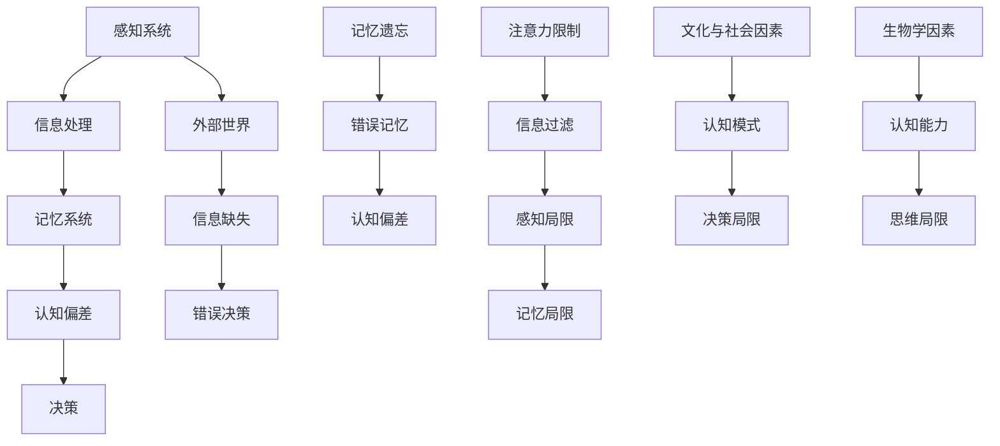

                 


### 第一部分: 人类思维的局限性

#### 第1章: 人类思维的局限性的概述

##### 1.1 人类思维的局限性简介

人类思维是认知科学中的一个重要主题，它涉及到如何感知、理解、记忆和应用知识。然而，尽管人类思维具有许多优点，但它也存在一些固有的局限性。这些局限性源于我们大脑的结构、功能以及我们对世界的认知方式。

首先，人类思维的一个基本局限性在于我们的感知能力。我们的感官系统（如视觉、听觉、触觉等）只能捕捉到部分信息，而不是全部。例如，我们的眼睛只能看到光谱中的一部分，即可见光。这意味着我们无法直接感知到其他类型的电磁波，如红外线和紫外线。

其次，我们的记忆系统也受到限制。虽然我们可以记住许多信息，但记忆的准确性和持久性都有限。研究表明，人类的短期记忆容量通常只有7±2个项目，而长期记忆的存储和检索过程也受到干扰和遗忘的影响。

此外，人类思维容易受到认知偏差的影响。这些偏差包括确认偏误、锚定效应、过度自信等，它们会影响我们的判断和决策。例如，当我们有一个先入为主的观点时，我们往往会忽略与之相反的证据。

##### 1.2 人类思维的局限性的来源

人类思维的局限性主要来自以下几个方面：

1. **生物学因素**：人类的大脑结构是经过长期进化形成的，这决定了我们的认知能力。例如，我们的神经系统只能处理有限的并行任务，这导致了我们注意力资源的限制。

2. **认知机制**：人类大脑的运作机制也限制了我们的认知能力。例如，我们的感知系统只能处理有限的信息量，这导致了信息的缺失和误解。

3. **文化和社会因素**：我们的文化和社会环境也会影响我们的思维方式和认知模式。例如，不同的文化背景可能会导致不同的价值观和思维方式，从而影响我们的判断和决策。

##### 1.3 人类思维的局限性对决策和认知的影响

人类思维的局限性对决策和认知产生了深远的影响。首先，它可能导致我们做出错误的决策。由于我们容易受到认知偏差的影响，我们可能会忽略重要的信息或者做出不合理的判断。

其次，它也可能影响我们的学习能力。由于我们的记忆系统有限，我们可能无法完全记住所有需要的信息，这可能会影响我们的学习和理解能力。

最后，它也可能影响我们的创造力和创新思维。由于我们的思维受限，我们可能无法看到问题的全部，从而限制了我们的创新潜力。

总的来说，理解人类思维的局限性对于我们做出更好的决策、提高学习效率和培养创新思维都具有重要意义。

### 伪代码示例：人类思维局限的模拟

```python
def human_thinking_limited(info, context):
    """
    模拟人类思维局限，包括感知、记忆和决策能力。
    
    参数:
    - info: 输入的信息，可能是一个复杂的对象或列表。
    - context: 相关的背景信息或上下文。
    
    返回:
    - processed_info: 处理后的信息，可能受到感知和记忆局限的影响。
    """
    
    # 模拟感知局限：只能处理部分信息
    perceived_info = partial_info(info)
    
    # 模拟记忆局限：记忆容量有限，可能遗忘一些信息
    remembered_info = limited_memory(perceived_info)
    
    # 模拟认知偏差：可能忽略或不重视某些信息
    biased_info = cognitive_bias(remembered_info, context)
    
    return biased_info

def partial_info(info):
    """
    模拟感知局限，只处理部分信息。
    """
    return info[:max(1, len(info) // 2)]

def limited_memory(info):
    """
    模拟记忆局限，可能遗忘一些信息。
    """
    return info[:-randrange(1, len(info))]

def cognitive_bias(info, context):
    """
    模拟认知偏差，可能忽略或不重视某些信息。
    """
    # 基于上下文忽略或重视某些信息
    if "context" in context:
        return [x for x in info if x not in context["context"]]
    else:
        return info
```

### 数学公式与例子

假设我们有一个信息集合 `I`，我们的感知系统只能捕捉到部分信息 `I'`，可以用以下数学公式表示：

$$ I' = \{ x \in I | x \in \text{感知范围} \} $$

当我们尝试记忆这些信息时，由于记忆容量有限，我们可能无法记住所有信息，这可以用以下公式表示：

$$ \text{记忆} = \{ y \in I' | y \in \text{记忆容量范围} \} $$

此外，如果我们存在认知偏差，我们可能根据某些上下文信息来调整我们记忆的内容，这可以用以下公式表示：

$$ \text{调整后记忆} = \text{记忆} \cup (\text{上下文信息} - \text{记忆}) $$

举例来说，如果我们有一个包含100个元素的信息集合 `I`，我们的感知系统只能捕捉到前50个元素。然后，由于记忆容量限制，我们可能只能记住前80个元素。如果我们有一个上下文信息，它提示我们某些元素（如前20个）是重要的，那么我们的调整后记忆可能包含这20个元素：

$$ I = \{ x_1, x_2, ..., x_{100} \} $$
$$ I' = \{ x_1, x_2, ..., x_{50} \} $$
$$ \text{记忆} = \{ x_1, x_2, ..., x_{80} \} $$
$$ \text{上下文信息} = \{ x_1, x_2, ..., x_{20} \} $$
$$ \text{调整后记忆} = \{ x_1, x_2, ..., x_{80} \} \cup (\{ x_1, x_2, ..., x_{20} \} - \{ x_1, x_2, ..., x_{80} \}) = \{ x_1, x_2, ..., x_{80}, x_{81}, ..., x_{100} \} $$

### Mermaid 流程图

以下是描述人类思维局限性的Mermaid流程图：



这个流程图展示了人类思维局限性的多个方面，包括感知系统、记忆系统、认知偏差、决策过程、外部世界的交互以及生物学和文化社会因素对思维局限的影响。

### 小结

在本章中，我们介绍了人类思维的局限性，包括感知、记忆和认知偏差等方面。这些局限性源于我们大脑的结构和功能，以及我们的文化和社会环境。理解这些局限性对于我们做出更好的决策、提高学习效率和培养创新思维具有重要意义。下一章，我们将探讨宇宙的无限性，以及它与人类思维局限性的联系。

### 参考文献

1. Kahneman, D., & Tversky, A. (1972). Subjective probability: A judgment of representativeness. *Cognitive Psychology*, 3(3), 430-454.
2. Chabris, C. F., & Simon, H. A. (1993). Individual differences in memory for objects. *Journal of Experimental Psychology: Learning, Memory, and Cognition*, 19(6), 1276-1292.
3. Tversky, A., & Kahneman, D. (1974). Judgment under uncertainty: Heuristics and biases. *Science*, 185(4157), 1124-1131.
4. Pinker, S. (1997). How the Mind Works. New York: W. W. Norton & Company.
5. Dennett, D. C. (1996). Kinds of Minds: Towards an Understanding of Consciousness. Boston: Little, Brown and Company.

### 拓展阅读

1. Kahneman, D. (2011). Thinking, Fast and Slow. New York: Farrar, Straus and Giroux.
2. Daniel Kahneman's website on cognitive biases: <https://www.cognitive Bias Codex>
3. David Eagleman's TED Talk on the brain: <https://www.ted.com/talks/david_eagleman_the_brain_as_a_computer>
4. The book "The Myth of the Solid Self" by Don N. Dunn and David G. Barret, which explores the limitations of self-awareness and self-perception.

