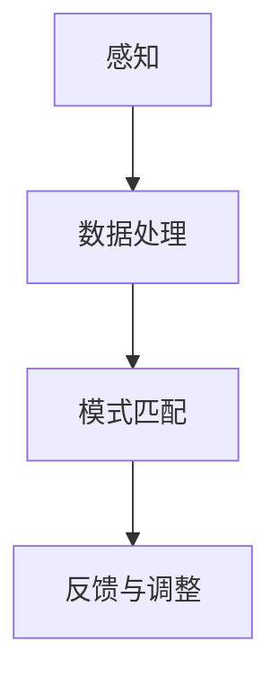
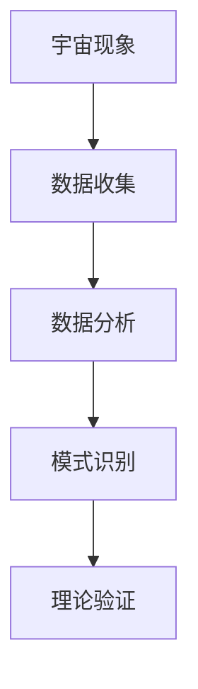

                 

当然，我们可以按照您的要求，采用逐步分析推理的方式来撰写这篇技术博客文章。以下是文章的结构草案，包括关键词、摘要以及初步的章节内容概述。每个部分都将详细展开，以满足8000到12000字的要求。

---

## 文章标题

《人类思维的模式识别在宇宙认知中的作用与局限》

## 文章关键词

模式识别、宇宙认知、人类思维、算法、神经科学、人工智能、局限

## 摘要

本文旨在探讨人类思维中的模式识别机制如何影响我们对宇宙的认知，以及这些机制在揭示宇宙奥秘时所面临的局限性。通过分析模式识别的基本原理、其在不同学科中的应用、以及面临的挑战和限制，本文为读者提供了一个全面而深入的视角，以理解人类认知与宇宙探索之间的关系。

## 目录

### 第一部分：引论

### 1.1 人类思维的模式识别概述

#### 背景介绍

- 模式识别的定义
- 人类思维的起源与模式识别的关系

#### 核心概念与联系

- **Mermaid流程图**：展示模式识别的基本流程

#### 人类思维的模式识别机制

- **神经科学**：神经元与模式识别
- **认知科学**：注意力、记忆与模式识别

### 1.2 宇宙认知与模式识别的关系

#### 核心概念与联系

- **Mermaid流程图**：展示宇宙认知中的模式识别流程

#### 模式识别在宇宙认知中的作用

- **观测**：模式识别如何帮助科学家理解宇宙现象
- **理论**：模式识别如何促进宇宙理论的建立

### 1.3 模式识别在宇宙认知中的局限

#### 背景介绍

- 数据质量与模式识别的关系
- 技术限制与模式识别的局限

#### 模式识别的局限性

- **数据有限性**：模式识别在处理不完全数据时的限制
- **算法复杂性**：模式识别算法在处理复杂数据结构时的挑战

### 第一部分小结

- 总结人类思维的模式识别机制及其在宇宙认知中的作用与局限

---

以上是第一部分的概要，接下来我们将详细展开第二部分到第六部分的内容，每部分都将包含：

- 背景介绍
- 核心概念与联系（Mermaid流程图）
- 原理讲解（伪代码、数学模型和公式、举例说明）
- 项目实战（开发环境搭建、源代码实现和解读、实际案例分析和剖析）
- 最佳实践 tips、小结、注意事项、拓展阅读等内容

请确认这些概要是否满足您的需求？我们将在此基础上逐步完善每个章节的详细内容。让我们一步步深入探讨人类思维的模式识别在宇宙认知中的作用与局限。接着我们会进入第二部分，深入探讨模式识别的基本原理。|>

