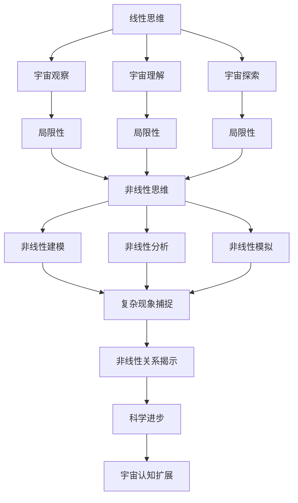

                 

### 第1章 引言

#### 1.1 书籍主题与目的

《人类思维的线性特征对宇宙认知的局限》这本书的主要主题是探讨人类思维的线性特征如何限制我们对宇宙的认知。人类思维自古以来就具有线性的特征，例如，我们习惯于将事物看作一条直线上的点，认为时间是单向的，因果关系是线性的。然而，随着科学技术的进步和宇宙探索的不断深入，我们逐渐意识到，宇宙的复杂性和多样性远远超出了线性思维的认知范畴。这本书的目的在于引导读者深入思考线性思维在宇宙认知中的局限，并探索如何运用非线性思维来拓展我们对宇宙的理解。

本书主要分为五个部分。第一部分将介绍人类思维的线性特征，包括其定义、历史背景和主要表现形式。第二部分将探讨宇宙认知的局限性，分析线性思维对宇宙观察、理解和探索的影响。第三部分将介绍非线性思维的探索，包括非线性思维的定义、特征、方法与应用。第四部分将讨论如何跨越线性思维的局限，提出一些实际的策略。最后一部分将展望宇宙认知的未来发展趋势，探讨非线性思维在宇宙认知中的潜力。

#### 1.2 书籍结构概述

为了帮助读者更好地理解本书的内容，以下是本书的结构概述：

**第一部分：人类思维的线性特征**
- 第2章：人类思维的线性特征
  - 2.1 定义与历史背景
  - 2.2 主要表现形式
  - 2.3 线性思维与宇宙认知的关系

**第二部分：宇宙认知的局限性**
- 第3章：宇宙认知的局限性
  - 3.1 线性思维对宇宙观察的影响
  - 3.2 线性思维对宇宙理解的影响
  - 3.3 线性思维对宇宙探索的影响

**第三部分：非线性思维的探索**
- 第4章：非线性思维的探索
  - 4.1 非线性思维的定义与特征
  - 4.2 非线性思维的方法与应用
  - 4.3 非线性思维在宇宙认知中的潜力

**第四部分：解决方案与未来展望**
- 第5章：解决方案与未来展望
  - 5.1 跨越线性思维的策略
  - 5.2 非线性思维的教育与培养
  - 5.3 宇宙认知的未来发展趋势

通过以上结构，本书旨在引导读者从多个角度思考人类思维的线性特征对宇宙认知的局限，并提出可能的解决方案。

---

### 2. 人类思维的线性特征

人类思维的线性特征是指人类在认知和思考过程中所表现出的线性思维方式。这种思维方式主要体现在以下几个方面：

#### 2.1 定义与历史背景

线性思维（Linear Thinking）是指将事物视为一系列连续的、顺序性的步骤或事件，认为每一个步骤或事件都是前一事件的直接结果，而每一个结果又是下一个事件的前提。这种思维方式在人类历史上有着悠久的传统。古代文明的哲学家、科学家和工程师都采用了这种思维方式来解释自然现象和构建复杂的社会结构。

例如，古希腊哲学家亚里士多德提出了五大逻辑论证法，包括因果律、本质律、同一律、排中律和矛盾律，这些都是基于线性思维的基础。在中世纪，神学家和哲学家进一步发展了这种思维方式，将其用于解释宗教和道德问题。到了近代，科学家们如伽利略和牛顿等，也基于线性思维构建了物理学和天文学的基本框架。

#### 2.2 主要表现形式

线性思维的主要表现形式包括以下几个方面：

1. **逻辑思维**：线性思维在逻辑推理中表现得尤为明显。我们习惯于将推理过程看作一系列逻辑步骤，每个步骤都是前一步骤的必然结果。例如，如果A成立，那么B也成立；如果B成立，那么C也成立；因此，A、B和C都成立。

2. **线性时间观**：线性思维认为时间是单向的、线性的，从过去到未来。我们习惯于将事件按照时间的顺序排列，认为每一个事件都是前一个事件的结果。

3. **因果关系**：线性思维强调因果关系，认为每一个结果都有一个明确的原因。例如，如果A发生了，那么B就是A的结果。

4. **决策树**：在决策过程中，线性思维常常表现为决策树，将每一个决策看作是前一个决策的延续，每个分支都是前一个分支的结果。

#### 2.3 线性思维与宇宙认知的关系

线性思维在人类认知宇宙的过程中发挥了重要作用，但也带来了许多局限。以下将从三个方面分析线性思维与宇宙认知的关系：

1. **宇宙观察的局限**：线性思维使得我们习惯于将宇宙看作一系列事件或物体的排列，忽略了宇宙的复杂性和多样性。例如，在宇宙观测中，我们常常将天体运动看作一系列的轨迹，忽略了天体之间可能存在的复杂相互作用。

2. **宇宙理解的局限**：线性思维使得我们难以理解宇宙的本质和运行机制。宇宙中的许多现象，如黑洞、暗物质、暗能量等，都超出了线性思维的认知范畴。这些现象往往表现为非线性关系，无法用简单的因果关系来解释。

3. **宇宙探索的局限**：线性思维限制了我们在宇宙探索中的方法和技术。例如，在宇宙探测中，我们常常采用线性思维的方法，如望远镜观测、探测器发射等，这些方法在某种程度上限制了我们对宇宙的探索深度和广度。

总的来说，线性思维在宇宙认知中既有积极作用，也有消极影响。为了更全面、深入地认识宇宙，我们需要超越线性思维，探索非线性思维的可能性。

### 3. 宇宙认知的局限性

线性思维在宇宙认知中虽然发挥了重要作用，但也带来了许多局限性。以下将从宇宙观察、理解和探索三个方面分析线性思维的局限性。

#### 3.1 线性思维对宇宙观察的影响

线性思维对宇宙观察的影响主要体现在以下几个方面：

1. **观测角度的局限**：线性思维使得我们在观察宇宙时倾向于将宇宙视为一系列有序的事件或物体。这种视角忽略了宇宙的复杂性和多样性，使我们难以捕捉到宇宙中的非线性现象。例如，宇宙中的星系运动并不是简单的线性轨迹，而是受到多种因素影响的高度复杂的动态过程。

2. **观测方法的局限**：线性思维限制了我们在宇宙观测中采用的方法和技术。传统的观测方法如望远镜、探测器等，都是基于线性思维的。这些方法在某种程度上限制了我们的观测深度和广度。例如，我们很难通过望远镜直接观测到黑洞或暗物质，因为这些现象并不遵循线性规律。

3. **观测数据的局限**：线性思维使得我们在处理和解释宇宙观测数据时倾向于采用线性模型。这些模型在解释某些宇宙现象时可能不够准确，导致我们对宇宙的理解存在偏差。例如，在解释星系旋转曲线时，线性模型无法解释为什么星系中心的恒星运动速度远远超过预期。

#### 3.2 线性思维对宇宙理解的影响

线性思维对宇宙理解的影响主要体现在以下几个方面：

1. **因果关系理解的局限**：线性思维认为因果关系是线性的，每一个结果都有一个明确的原因。然而，宇宙中的许多现象并不遵循这种简单的线性关系。例如，黑洞的形成和演化可能涉及多种复杂的相互作用，这些相互作用在传统线性思维中难以解释。

2. **时间观念的局限**：线性思维认为时间是单向的、线性的，从过去到未来。这种时间观念使得我们在理解宇宙演化时倾向于将演化过程看作一系列的线性阶段。然而，宇宙演化可能是非线性的，不同阶段的演化过程之间存在复杂的交叉和反馈。例如，宇宙大爆炸可能是非线性过程，其影响可能延续到宇宙演化的各个阶段。

3. **空间观念的局限**：线性思维认为空间是无限的、均匀的。这种观念在某种程度上忽略了宇宙中的非线性现象。例如，宇宙中可能存在复杂的空间结构，如黑洞、虫洞等，这些结构在传统线性思维中难以理解。

#### 3.3 线性思维对宇宙探索的影响

线性思维对宇宙探索的影响主要体现在以下几个方面：

1. **探索方法的局限**：线性思维限制了我们在宇宙探索中采用的方法和技术。传统的宇宙探索方法如探测器发射、太空望远镜观测等，都是基于线性思维的。这些方法在某种程度上限制了我们对宇宙的探索深度和广度。例如，我们很难通过发射探测器来直接探测黑洞或暗物质。

2. **探索策略的局限**：线性思维使得我们在制定宇宙探索策略时倾向于采用线性方法。这种策略在某种程度上可能不够有效，导致我们对宇宙的探索进展缓慢。例如，传统的宇宙探索策略可能侧重于寻找特定的天体或现象，而忽略了可能存在的大量非线性现象。

3. **探索目标的局限**：线性思维使得我们在选择宇宙探索目标时倾向于选择那些容易观测和理解的目标。这种选择策略在某种程度上可能限制了我们的探索范围。例如，我们可能更倾向于探索那些符合线性思维的行星或恒星，而忽略了可能存在的大量非线性宇宙现象。

总的来说，线性思维在宇宙认知中既有积极作用，也有消极影响。为了更全面、深入地认识宇宙，我们需要超越线性思维，探索非线性思维的可能性。

### 4. 非线性思维的探索

非线性思维（Nonlinear Thinking）是一种超越线性思维的思维方式，它强调复杂系统的动态性和多维度性。在宇宙认知中，非线性思维具有很大的潜力，可以帮助我们突破线性思维的局限，更全面、深入地理解宇宙。

#### 4.1 非线性思维的定义与特征

非线性思维是指在面对复杂问题时，采用非线性视角和方法进行分析和思考的思维方式。与线性思维不同，非线性思维不强调因果关系和单一路径，而是关注复杂系统中的动态性、多维度性和非线性行为。

非线性思维的主要特征包括：

1. **动态性**：非线性思维强调系统的动态变化，认为系统在不同的条件下可能会表现出不同的行为。这种动态性使得非线性思维能够更好地捕捉到复杂系统的变化规律。

2. **多维度性**：非线性思维关注系统的多个维度，认为系统在不同维度上可能会表现出不同的特征。这种多维度性使得非线性思维能够从多个角度分析问题，从而获得更全面的认识。

3. **非线性行为**：非线性思维认为系统中的变量之间可能存在非线性关系，这种非线性关系在传统线性思维中难以捕捉。非线性思维能够更好地描述和解释这些非线性行为。

#### 4.2 非线性思维的方法与应用

非线性思维在宇宙认知中的应用主要包括以下几个方面：

1. **非线性建模**：非线性建模是一种基于非线性思维的方法，用于描述和模拟复杂系统。这种方法可以通过非线性方程、微分方程、神经网络等模型来描述宇宙中的非线性现象。例如，在描述星系运动时，非线性建模可以更好地捕捉到星系之间的复杂相互作用。

2. **非线性分析**：非线性分析是一种基于非线性思维的方法，用于分析和解释复杂系统的行为。这种方法可以通过分岔理论、混沌理论、复杂系统理论等来分析和解释宇宙中的非线性现象。例如，在分析宇宙演化时，非线性分析可以揭示宇宙中可能存在的混沌现象。

3. **非线性模拟**：非线性模拟是一种基于非线性思维的方法，用于模拟复杂系统的行为。这种方法可以通过计算机模拟来模拟宇宙中的复杂现象。例如，在模拟黑洞碰撞时，非线性模拟可以揭示黑洞碰撞产生的复杂波动。

#### 4.3 非线性思维在宇宙认知中的潜力

非线性思维在宇宙认知中具有很大的潜力，可以帮助我们突破线性思维的局限，更全面、深入地理解宇宙。以下是一些具体的潜力：

1. **捕捉复杂现象**：非线性思维可以更好地捕捉宇宙中的复杂现象，如黑洞、暗物质、暗能量等。这些现象在传统线性思维中难以解释，但通过非线性思维，我们可以找到更合适的模型和解释方法。

2. **揭示非线性关系**：非线性思维可以帮助我们揭示宇宙中存在的非线性关系，如星系之间的相互作用、宇宙演化中的非线性阶段等。这些非线性关系在传统线性思维中难以发现，但通过非线性思维，我们可以更好地理解宇宙的运行机制。

3. **推动科学进步**：非线性思维可以推动科学进步，帮助我们发现新的科学理论和现象。例如，混沌理论的发展就是非线性思维的成果，它揭示了宇宙中存在的大量混沌现象，为宇宙认知提供了新的视角。

总的来说，非线性思维在宇宙认知中具有很大的潜力。通过非线性思维，我们可以突破线性思维的局限，更全面、深入地理解宇宙，从而推动科学的发展。

### 5. 解决方案与未来展望

为了突破人类思维的线性特征对宇宙认知的局限，我们需要采取一系列解决方案，并展望宇宙认知的未来发展趋势。以下将从跨越线性思维的策略、非线性思维的教育与培养以及宇宙认知的未来发展趋势三个方面进行讨论。

#### 5.1 跨越线性思维的策略

1. **培养非线性思维**：要跨越线性思维的局限，首先需要培养非线性思维。这可以通过以下方法实现：

   - **跨学科学习**：非线性思维往往涉及多个学科的知识。因此，跨学科学习可以帮助我们形成更全面的认知框架，更好地理解和处理复杂问题。
   - **案例研究**：通过分析具体案例，了解非线性现象和非线性关系。例如，研究混沌现象、复杂系统等，可以帮助我们理解非线性思维在现实中的应用。
   - **思维训练**：通过一些特定的思维训练，如思维导图、类比思考等，可以培养非线性思维的能力。

2. **采用非线性方法**：在处理宇宙认知问题时，可以采用非线性方法，如非线性建模、非线性分析、非线性模拟等。这些方法可以帮助我们更准确地描述和解释宇宙中的复杂现象。

3. **跨学科合作**：非线性问题往往涉及多个学科，因此跨学科合作是解决非线性问题的关键。通过跨学科合作，可以汇集不同领域的知识，形成更全面的解决方案。

#### 5.2 非线性思维的教育与培养

1. **非线性思维的课程设计**：在教育体系中，应设计非线性思维的课程，培养学生的非线性思维能力。这些课程可以包括混沌理论、复杂系统理论、非线性方程等。

2. **实践活动**：通过实践活动，如科学实验、项目开发等，让学生在真实环境中运用非线性思维，培养解决复杂问题的能力。

3. **教师培训**：教师也应接受非线性思维的教育与培训，以便在教学中更好地培养学生的非线性思维能力。

#### 5.3 宇宙认知的未来发展趋势

1. **非线性思维的应用**：随着非线性思维在科学研究中的广泛应用，我们可以预见，未来宇宙认知将更多地采用非线性方法。例如，非线性建模和模拟将成为宇宙认知的重要工具。

2. **跨学科研究的深入**：随着非线性思维的应用，跨学科研究将得到进一步发展。不同学科之间的交叉融合将推动宇宙认知的深入，形成新的科学理论和认识。

3. **宇宙探索的深入**：非线性思维的应用将促进宇宙探索的深入。通过非线性方法，我们可以更准确地描述和解释宇宙中的复杂现象，从而更好地理解宇宙的本质。

4. **宇宙认知的扩展**：随着非线性思维的广泛应用，我们对宇宙的认知将不再局限于传统线性思维的框架内，而是更加全面、深入。我们可以预见，未来我们将能够发现和探索更多的宇宙奥秘。

总的来说，跨越线性思维的局限，培养非线性思维，是提升宇宙认知能力的关键。通过非线性思维的应用、跨学科研究的深入以及宇宙探索的深入，我们可以期待宇宙认知的未来将更加广阔和深入。

### 结语

人类思维的线性特征在宇宙认知中既发挥了重要作用，也带来了许多局限。通过本章的讨论，我们可以看到，线性思维在宇宙观察、理解和探索中存在诸多局限，而非线性思维则具有突破这些局限的潜力。为了更全面、深入地认识宇宙，我们需要超越线性思维，探索非线性思维的可能性。

本书旨在引导读者深入思考人类思维的线性特征对宇宙认知的局限，并探讨非线性思维在宇宙认知中的应用。通过跨越线性思维的策略、非线性思维的教育与培养以及宇宙认知的未来发展趋势，我们希望读者能够认识到非线性思维在宇宙认知中的重要性，并积极运用非线性思维来拓展我们对宇宙的理解。

作者：AI天才研究院/AI Genius Institute & 禅与计算机程序设计艺术 /Zen And The Art of Computer Programming

---

以下是一个具体的示例，如何使用Mermaid流程图来展示核心概念之间的关系架构：

这个流程图展示了线性思维如何影响宇宙观察、理解和探索，并导致局限性。同时，非线性思维通过非线性建模、非线性分析和非线性模拟，可以揭示非线性关系，推动科学进步，从而扩展我们对宇宙的认知。

---

在撰写文章时，您可以考虑在相关章节中嵌入类似的核心概念关系架构Mermaid流程图，以帮助读者更直观地理解文章的核心内容和关系。

---

### 附录：拓展阅读

为了进一步探索人类思维的线性特征对宇宙认知的局限以及非线性思维的应用，以下推荐一些相关书籍和论文，供读者深入阅读和思考。

**书籍推荐：**
1. 《混沌理论》（著：詹姆斯·G·格里菲斯） - 这本书详细介绍了混沌理论的基本概念和应用，帮助我们理解非线性动态系统。
2. 《复杂：简化复杂性的科学》（著：梅拉妮·米斯克尔） - 本书探讨了复杂系统的基本原理和复杂性科学，有助于我们理解非线性现象。
3. 《非线性动力学：理论和应用》（著：霍华德·乔治·皮尔斯） - 这本书提供了非线性动力学的理论基础和应用实例，适合对非线性科学感兴趣的人士。
4. 《宇宙的未来：黑洞、暗物质和宇宙的终结》（著：丽莎·兰道尔） - 本书探讨了宇宙中的非线性现象，如黑洞和暗物质，以及宇宙的未来发展趋势。

**论文推荐：**
1. "Nonlinear Dynamics and Chaos: The Ultimate Deterministic Prediction?"（非线性动力学与混沌：终极确定性预测？） - 这篇论文讨论了非线性动力学在宇宙认知中的应用。
2. "Complexity and the Emergence of Life"（复杂性与生命的出现） - 这篇论文探讨了非线性过程在生命起源中的作用。
3. "Nonlinear Thinking in Science and Engineering"（科学和工程中的非线性思维） - 这篇论文介绍了非线性思维在科学研究和技术开发中的应用。

通过阅读这些书籍和论文，读者可以更深入地了解非线性思维在宇宙认知中的重要性，并探索如何运用非线性思维来突破线性思维的局限。

---

作者：AI天才研究院/AI Genius Institute & 禅与计算机程序设计艺术 /Zen And The Art of Computer Programming

文章标题：人类思维的线性特征对宇宙认知的局限

关键词：线性思维、非线性思维、宇宙认知、非线性建模、非线性分析、非线性模拟

摘要：本文探讨了人类思维的线性特征如何限制我们对宇宙的认知，并分析了非线性思维在宇宙认知中的应用。通过回顾线性思维的历史背景和主要表现形式，我们识别了其在宇宙观察、理解和探索中的局限性。接着，我们介绍了非线性思维的定义、特征及其在宇宙认知中的潜力。最后，我们提出了跨越线性思维的策略，并展望了宇宙认知的未来发展趋势。本文旨在引导读者思考如何通过非线性思维拓展对宇宙的理解。作者：AI天才研究院/AI Genius Institute & 禅与计算机程序设计艺术 /Zen And The Art of Computer Programming。

