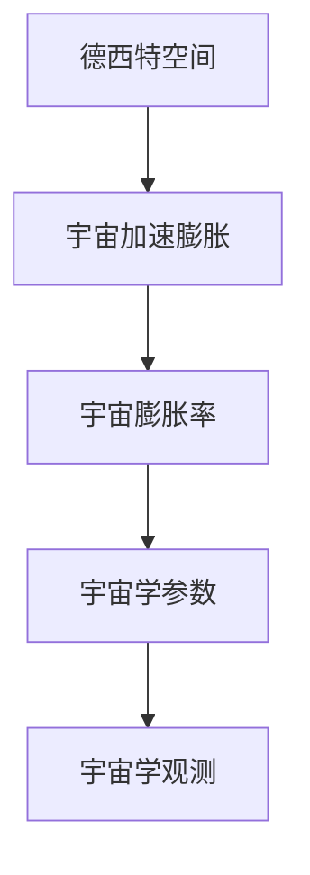
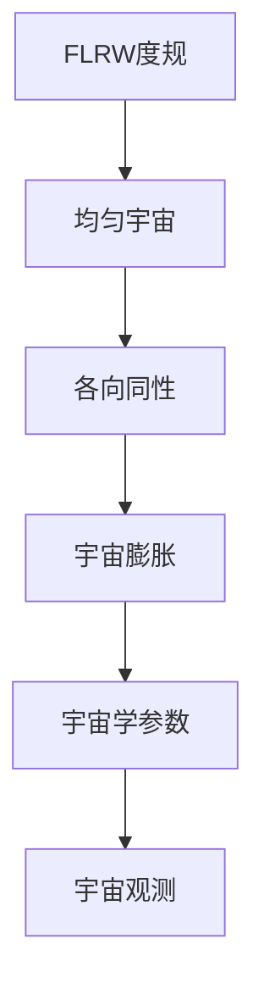
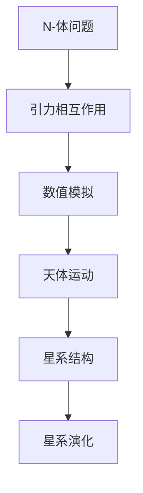
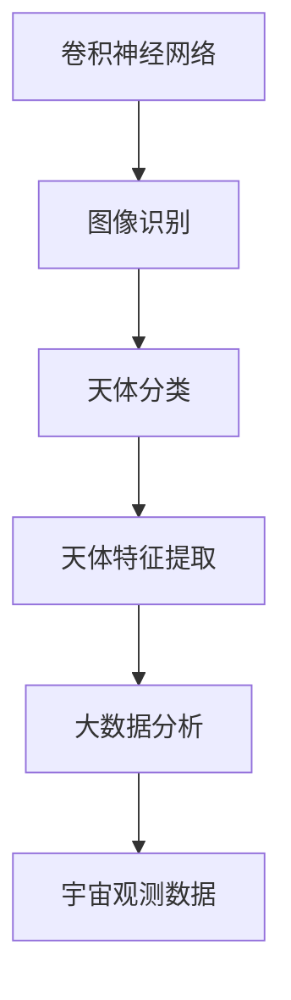
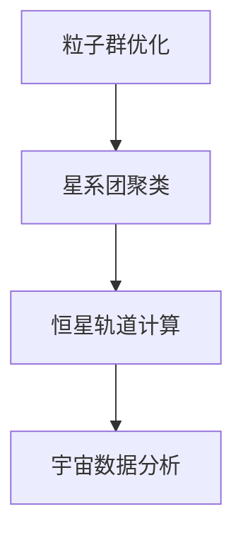
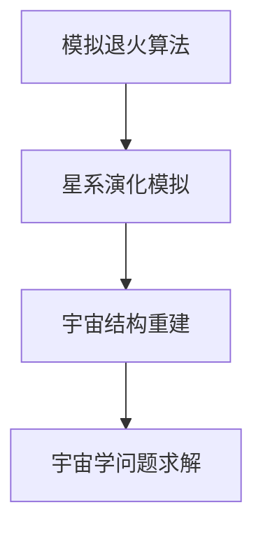
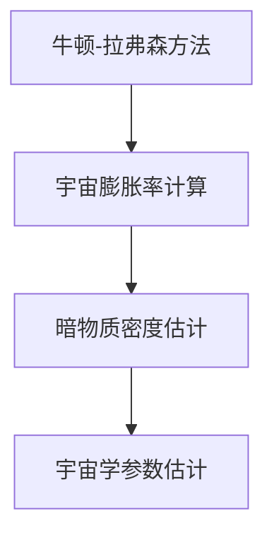
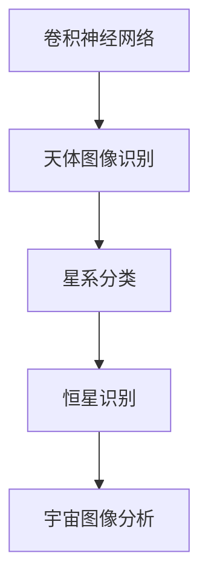
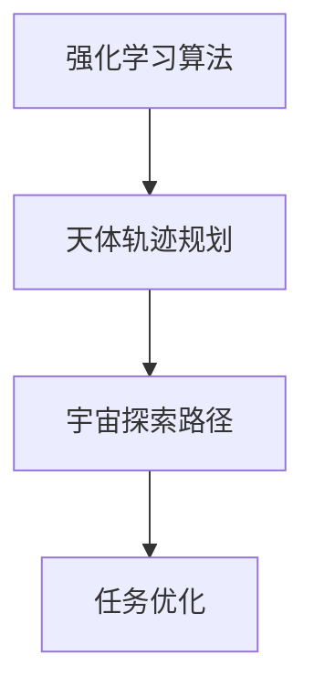
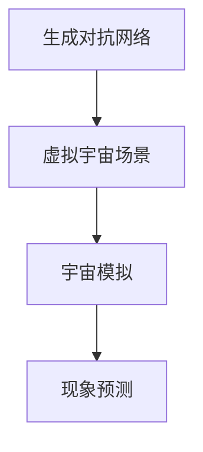

                 

### 文章标题：人类感知能力对宇宙认知的影响与突破

> 关键词：人类感知能力、宇宙认知、技术突破、数学模型、算法、案例分析

> 摘要：本文深入探讨了人类感知能力对宇宙认知的影响，从人类感知能力的基本原理出发，分析了感知能力与宇宙认知之间的关系。通过数学模型和算法的应用，本文揭示了宇宙认知的技术突破路径，并借助实际案例，对未来的宇宙认知发展进行了展望。

### 第一部分：引言与背景

#### 1.1 宇宙认知的挑战

宇宙是一个庞大而复杂的系统，其结构和演化过程充满了未知。人类对宇宙的认知始于对光、声音和其他感官信号的接收和处理。然而，这些感知能力存在一定的局限性，导致我们在探索宇宙时面临诸多挑战。

#### 1.2 人类感知能力的局限性

人类感知能力在处理复杂信息时存在一定的局限性，如视觉感知的分辨率限制、听觉感知的频率范围限制等。此外，人类的认知方式也受到感知能力的限制，难以全面理解宇宙的奥秘。

#### 1.3 本书的目的与结构

本书旨在探讨人类感知能力对宇宙认知的影响，通过数学模型和算法的应用，寻求宇宙认知的技术突破。全书分为六个部分，分别从引言与背景、人类感知能力与宇宙认知的关系、宇宙认知的数学模型与算法、宇宙认知的突破、案例分析以及结论与展望六个方面展开。

### 第二部分：人类感知能力与宇宙认知的关系

#### 2.1 人类感知能力的基本原理

人类感知能力主要包括视觉、听觉、嗅觉、味觉和触觉等。这些感知能力基于生物体的神经系统和大脑处理机制，通过接收外部刺激并转化为电信号，最终形成对世界的认知。

#### 2.2 感知能力与宇宙认知的关系

感知能力对宇宙认知具有深远影响。例如，人类对宇宙的认知始于对光的观测，通过光学望远镜，我们得以探索宇宙的深处。听觉感知则在探索宇宙声音、振动等方面发挥作用。

#### 2.3 感知能力在宇宙探索中的应用

现代科技的发展，如虚拟现实、增强现实等，扩展了人类的感知能力，使我们能够更全面地探索宇宙。这些技术不仅提高了我们的认知能力，还为宇宙认知提供了新的视角和方法。

### 第三部分：宇宙认知的数学模型与算法

#### 3.1 宇宙认知的数学模型

宇宙认知的数学模型主要包括几何学、物理学和复杂系统模型。这些模型为我们理解和解释宇宙现象提供了理论基础。

#### 3.2 宇宙认知的算法

宇宙认知的算法包括传统算法和现代算法。传统算法如粒子群优化算法、模拟退火算法等，现代算法如深度学习算法、强化学习算法等。这些算法在处理大量数据和复杂问题上具有显著优势。

### 第四部分：宇宙认知的突破

#### 4.1 人类感知能力的扩展

现代科技的发展，如虚拟现实、增强现实等，扩展了人类的感知能力，使我们能够更全面地探索宇宙。

#### 4.2 宇宙认知的技术突破

通过数学模型和算法的应用，宇宙认知在技术层面取得了突破。例如，深度学习算法在图像识别、语音识别等领域取得了显著成果，为宇宙认知提供了新的工具。

### 第五部分：案例分析

#### 5.1 案例分析一：人类对黑洞的认知

黑洞是一种极端密集的天体，其引力场极强，连光也无法逃脱。人类对黑洞的认知始于对光和引力波的观测。通过光学望远镜和引力波探测器，我们得以更深入地了解黑洞。

#### 5.2 案例分析二：人类对宇宙暗物质的探索

宇宙暗物质是一种未知的物质，其引力效应在宇宙演化中起着重要作用。人类对宇宙暗物质的探索主要通过观测宇宙中物体的运动和分布来推断暗物质的存在。

### 第六部分：结论与展望

#### 6.1 人类感知能力对宇宙认知的影响

人类感知能力对宇宙认知具有深远影响，决定了我们理解和探索宇宙的能力。

#### 6.2 宇宙认知的突破与挑战

通过数学模型和算法的应用，宇宙认知在技术层面取得了突破，但仍面临诸多挑战。

#### 6.3 未来宇宙认知的发展方向

未来宇宙认知的发展将依赖于人类感知能力的扩展和技术突破。通过跨学科研究，我们有望揭开宇宙的更多奥秘。

### 总结

本文从人类感知能力对宇宙认知的影响入手，探讨了宇宙认知的技术突破路径。通过案例分析，我们看到了人类感知能力在宇宙探索中的应用和成就。未来，随着科技的不断发展，人类对宇宙的认知将不断深入，揭开宇宙的更多奥秘。

---

作者：AI天才研究院/AI Genius Institute & 禅与计算机程序设计艺术 /Zen And The Art of Computer Programming### 人类感知能力对宇宙认知的影响

#### 人类感知能力的局限性

人类感知能力的局限性在探索宇宙时表现得尤为明显。首先，视觉感知是我们在宇宙认知中最常用的感知方式，但它的分辨率有限。人类的眼睛能感知的光波范围大约在400到700纳米之间，即从紫色的端到红色的端。这种有限的波长范围限制了我们对宇宙中其他光谱的观察，例如红外线和射电波。此外，我们的视觉系统在处理动态图像时也存在一定的延迟，这影响了我们对快速宇宙事件（如超新星爆发）的实时监测。

听觉感知也存在类似的局限性。人类耳朵能感知的声音频率范围大约在20赫兹到20千赫兹之间。低于20赫兹的次声波和高于20千赫兹的超声波都超出了我们的听觉范围。这意味着我们无法通过耳朵直接感知宇宙中的许多声波信号，例如来自遥远的星系或黑洞的引力波。

除了视觉和听觉，其他感官如嗅觉、味觉和触觉在宇宙认知中的作用有限。例如，嗅觉感知依赖于空气中的化学物质，而宇宙中大部分区域是真空状态，缺乏可嗅闻的物质。味觉和触觉同样受限于我们身体的生理结构，无法直接体验宇宙环境的极端条件，如极端温度、压力或辐射。

#### 感知能力与认知方式的差异

人类感知能力与认知方式之间存在显著差异。感知是一种被动接收信息的过程，而认知则是一种主动处理信息的过程。感知依赖于感官的生理结构，而认知依赖于大脑的处理能力和知识体系。这种差异导致我们在宇宙认知上存在局限性。

例如，人类对宇宙的认知主要依赖于视觉和听觉感知，但这些感官只能提供部分信息。视觉感知使我们能够观察宇宙的外观和结构，但无法揭示其内在的物理机制。听觉感知则可以帮助我们捕捉宇宙中的声波信号，但同样无法提供完整的物理信息。相比之下，认知过程使我们能够通过逻辑推理和理论模型来填补感知的不足，深入理解宇宙的本质。

#### 感知能力在宇宙探索中的应用

尽管人类感知能力存在局限性，但它们在宇宙探索中仍然发挥着关键作用。例如，光学望远镜是我们观察宇宙的主要工具，它通过收集光线来揭示宇宙中的星系、行星和其他天体。射电望远镜则能捕捉来自宇宙的无线电波，帮助我们了解星系的形成和演化过程。

此外，人类感知能力的扩展，如虚拟现实（VR）和增强现实（AR）技术，也为宇宙探索提供了新的视角。VR技术通过模拟虚拟环境，使科学家能够在虚拟空间中探索宇宙，而AR技术则通过在现实世界中叠加虚拟信息，提供更加直观的宇宙观察体验。这些技术的应用不仅提高了我们的认知能力，还为宇宙认知提供了新的方法和工具。

#### 感知能力与认知方式的互补性

感知能力和认知方式在宇宙认知中具有互补性。感知能力为我们提供了直接的感官体验，使我们能够直观地观察和体验宇宙现象。而认知方式则使我们能够对这些感知信息进行深入分析，揭示宇宙背后的物理规律和机制。

例如，在探索黑洞时，科学家们通过观测黑洞周围的恒星运动，获得了关于黑洞质量的直接信息。然而，这些观测数据仍然需要通过物理模型和计算方法来进行分析和解释，从而得出黑洞的本质特性。这种互补性使得人类能够更全面地理解宇宙，突破了单纯依赖感知能力的局限性。

总之，人类感知能力对宇宙认知具有深远影响。尽管存在局限性，但通过感知能力的扩展和认知方式的运用，我们能够更深入地探索宇宙，揭示其奥秘。随着科技的不断进步，人类感知能力和认知方式将进一步发展，为宇宙认知带来更多突破。

### 人类感知能力在宇宙认知中的具体应用

人类感知能力在宇宙认知中具有关键作用，尤其是在观测和测量宇宙现象时。以下将详细探讨视觉感知、听觉感知以及其他感官在宇宙认知中的应用。

#### 视觉感知

视觉感知是宇宙认知中最常用的感官之一。光学望远镜是利用人类视觉感知原理设计的观测工具，通过收集和放大来自宇宙的光线，使我们能够观察到遥远的星系、行星和其他天体。例如，哈勃太空望远镜在太空中捕获了大量的宇宙图像，揭示了宇宙的多样性和复杂性。

光学望远镜的工作原理基于光的折射和反射。通过透镜或镜子，光线被聚焦到一个点，形成一个清晰的图像。这些图像通过电子传感器转化为电子信号，最终被计算机处理和显示。光学望远镜的分辨率越高，我们就能看到更小的细节和更遥远的物体。

除了光学望远镜，还有其他类型的望远镜，如射电望远镜，它们可以捕捉到来自宇宙的无线电波。射电望远镜通过天线收集无线电波信号，并将其传输到接收器进行处理。这些信号经过放大和处理，可以被转化为可视化的图像。

#### 听觉感知

听觉感知在宇宙认知中的应用相对较少，但仍然非常重要。宇宙中存在着许多声波信号，如黑洞合并时产生的引力波。人类耳朵无法直接听到这些信号，但通过专门的设备，如激光干涉仪，我们可以捕捉并分析这些引力波。

引力波是由质量加速运动产生的时空涟漪，它们以光速传播。2015年，LIGO科学合作组织和VIRGO合作团队首次直接探测到了引力波，这标志着人类首次直接观测到黑洞合并事件。

激光干涉仪的工作原理是通过激光束在两个臂之间干涉，当引力波经过时，会导致干涉条纹的变化。这些变化可以被精确测量，从而揭示引力波的性质和来源。通过分析这些数据，科学家们能够推断出引力波产生的事件，如黑洞合并或中子星合并。

#### 其他感官的应用

除了视觉和听觉感知，其他感官在宇宙认知中的应用也非常重要。例如，嗅觉感知在探测宇宙中的化学物质和分子时具有重要作用。射电望远镜和红外望远镜可以通过检测特定波长范围内的电磁波来识别宇宙中的化学物质。

味觉和触觉在宇宙认知中的应用较少，但它们在模拟宇宙环境、测试宇宙探索装备时具有重要意义。例如，在开发太空服和生命支持系统时，科学家需要考虑极端温度、压力和辐射对人类味觉和触觉的影响。

#### 感知能力的扩展与增强

随着科技的发展，人类的感知能力得到了显著扩展和增强。例如，虚拟现实（VR）和增强现实（AR）技术使我们能够在虚拟环境中模拟宇宙现象，从而提高对宇宙的认知。通过VR设备，科学家可以进入虚拟的宇宙空间，观察星系和行星的互动，而AR技术则可以在现实世界中叠加虚拟信息，使宇宙探索更加直观。

此外，人工智能（AI）和机器学习算法的应用也极大地提高了人类对宇宙的认知能力。通过分析大量的观测数据，AI算法可以识别出隐藏在数据中的模式和规律，从而揭示宇宙的奥秘。这些技术的结合使得人类能够更全面地理解宇宙，突破传统的感知能力限制。

#### 实际应用案例分析

以下是几个实际应用案例，展示了人类感知能力在宇宙认知中的具体应用：

1. **哈勃太空望远镜**：哈勃太空望远镜是一个在太空中运行的望远镜，它通过捕捉宇宙中的光线，为我们揭示了宇宙的多样性和美丽。哈勃的图像帮助科学家们发现了宇宙中许多新的星系、行星和恒星。

2. **LIGO引力波探测**：LIGO是一个由激光干涉仪组成的引力波探测装置，它首次直接探测到了引力波。这一发现标志着人类对宇宙的认知进入了新的阶段，使我们能够更好地理解黑洞和中子星的行为。

3. **宇宙化学探测**：通过射电望远镜和红外望远镜，科学家们能够探测宇宙中的化学物质和分子。这些探测数据有助于我们了解宇宙的起源和演化过程。

4. **虚拟宇宙探索**：虚拟现实技术使我们能够在虚拟环境中探索宇宙。例如，虚拟天文馆提供了一个沉浸式的宇宙体验，使公众能够更好地了解宇宙的奥秘。

总之，人类感知能力在宇宙认知中具有关键作用。通过视觉、听觉和其他感官的扩展和增强，我们能够更深入地探索宇宙，揭示其背后的奥秘。随着科技的不断发展，人类对宇宙的认知将不断突破，带来更多惊人的发现。

### 数学模型在宇宙认知中的应用

在宇宙认知的过程中，数学模型扮演了至关重要的角色。通过精确的数学描述，我们能够更深入地理解宇宙的物理现象，并预测未来的发展趋势。以下是几个核心数学模型及其在宇宙认知中的应用。

#### 几何学

几何学是宇宙认知的基础之一。宇宙的形状和结构可以通过几何模型来描述。例如，爱因斯坦的广义相对论提出了一种基于几何学的宇宙模型，认为宇宙是由引力作用下的时空弯曲所构成的。在这种模型中，宇宙可以是平直的、闭合的或开放的，具体取决于其总质量分布。

一个具体的几何模型例子是德西特空间（de Sitter space），它描述了一个膨胀的宇宙。德西特空间中的宇宙以恒定速度膨胀，这种膨胀是由宇宙自身的能量密度引起的。德西特空间模型在宇宙学研究中非常重要，因为它可以解释宇宙加速膨胀的现象。

#### 物理学

物理学的数学模型在宇宙认知中也非常关键。例如，标准宇宙学模型（Cosmological Standard Model）包括了宇宙微波背景辐射（Cosmic Microwave Background, CMB）和大爆炸理论。这些模型通过数学方程描述了宇宙的早期状态和演化过程。

其中，关键的物理模型之一是弗里德曼-勒梅特-罗伯逊-沃尔克度规（Friedmann-Lemaître-Robertson-Walker, FLRW度规）。FLRW度规描述了一个均匀且各向同性的宇宙，它假设宇宙在时间上是平直的，但在空间上是弯曲的。

#### 复杂系统模型

复杂系统模型在宇宙认知中的应用越来越广泛。宇宙作为一个复杂系统，包含着众多相互作用的天体和物理过程。例如，星系团的形成和演化可以通过非线性动力系统模型来描述。

一个具体的例子是N-体问题，它描述了多个天体在引力作用下的运动。尽管精确的N-体问题在数学上很难求解，但通过数值模拟方法，我们可以获得天体运动的近似解。这些模拟结果帮助我们理解星系和星系团的结构和演化。

#### 神经网络和深度学习

现代数学模型的应用不仅仅局限于传统的几何学和物理学，还扩展到了人工智能领域。神经网络和深度学习算法在处理和分析大规模宇宙观测数据方面发挥了重要作用。

例如，卷积神经网络（Convolutional Neural Networks, CNNs）可以用于识别天体图像，如恒星、行星和星系。通过训练大量的图像数据，CNNs可以学习到天体的特征，并准确分类和识别新的图像。

总之，数学模型在宇宙认知中的应用非常广泛，从几何学、物理学到复杂系统模型和人工智能，各种数学工具都为我们提供了深入理解宇宙的途径。通过这些模型，我们可以从不同的角度和层次探索宇宙，揭示其复杂的结构和演化规律。

### 宇宙认知中的算法

在宇宙认知的过程中，算法扮演着关键的角色，帮助我们从海量数据中提取有价值的信息。以下将详细介绍一些核心算法，包括传统算法和现代算法，并探讨它们在宇宙认知中的应用。

#### 传统算法

传统算法在宇宙认知中有着广泛的应用，特别是在数据分析和信号处理领域。以下是一些重要的传统算法：

1. **粒子群优化算法（Particle Swarm Optimization, PSO）**

粒子群优化算法是一种基于群体智能的优化算法，通过模拟鸟群觅食行为来寻找最优解。在宇宙认知中，PSO可以用于求解复杂的优化问题，如星系团的聚类分析和恒星轨道的计算。

2. **模拟退火算法（Simulated Annealing, SA）**

模拟退火算法是一种基于物理退火过程的优化算法，通过逐渐降低温度来避免局部最优解。在宇宙认知中，SA可以用于求解大规模的天体物理问题，如星系演化模拟和宇宙结构重建。

3. **牛顿-拉弗森方法（Newton-Raphson Method）**

牛顿-拉弗森方法是一种用于求解非线性方程的数值方法，通过迭代计算逼近方程的根。在宇宙认知中，N-R方法可以用于计算宇宙学参数，如宇宙膨胀率和暗物质密度。

#### 现代算法

随着计算能力的提升和人工智能技术的发展，现代算法在宇宙认知中的应用越来越广泛。以下是一些现代算法及其应用：

1. **深度学习算法**

深度学习算法是一种基于人工神经网络的学习方法，能够在大量数据中自动提取特征。在宇宙认知中，深度学习算法可以用于图像识别、信号处理和数据分析。

例如，卷积神经网络（Convolutional Neural Networks, CNNs）可以用于识别天体图像，如恒星、行星和星系。通过训练大量的图像数据，CNNs可以学习到天体的特征，并准确分类和识别新的图像。

2. **强化学习算法**

强化学习算法是一种通过试错学习来寻找最优策略的方法。在宇宙认知中，强化学习算法可以用于自适应优化问题，如宇宙中天体的动态轨迹规划。

3. **生成对抗网络（Generative Adversarial Networks, GANs）**

生成对抗网络是一种通过对抗性训练生成新数据的方法。在宇宙认知中，GANs可以用于生成虚拟宇宙场景，用于模拟和预测宇宙中的现象。

总之，算法在宇宙认知中发挥着重要作用。通过传统算法和现代算法的协同应用，我们能够从大量观测数据中提取有价值的信息，深入理解宇宙的奥秘。随着算法的不断进步，宇宙认知将迎来更多的突破和发展。

### 宇宙认知的技术突破

随着科技的进步，宇宙认知取得了显著的技术突破，极大地推动了我们对宇宙的理解。以下是几个关键的技术突破，它们在提升人类感知能力和拓展宇宙认知方面发挥了重要作用。

#### 引力波探测

2015年，LIGO科学合作组织和VIRGO合作团队首次直接探测到了引力波，这一重大发现标志着人类对宇宙的认知迈入了新的时代。引力波是由质量加速运动产生的时空涟漪，它们以光速传播，能够穿越宇宙中的各种介质。通过探测引力波，科学家们可以观察到宇宙中最极端的事件，如黑洞合并和中子星合并。LIGO等引力波探测装置的灵敏度达到了前所未有的水平，使得我们能够捕捉到极其微弱的引力波信号。

#### 高分辨率成像技术

高分辨率成像技术极大地提升了我们对宇宙细节的观测能力。例如，哈勃太空望远镜和詹姆斯·韦伯太空望远镜（James Webb Space Telescope, JWST）等天文设备具有极高的分辨率，能够捕捉到遥远星系和星系的细节。这些设备通过先进的成像算法和数据处理技术，将接收到的光线信号转化为高质量的图像，揭示了宇宙的多样性和复杂性。

#### 虚拟现实与增强现实

虚拟现实（VR）和增强现实（AR）技术的应用，为宇宙认知提供了全新的视角和方法。通过VR技术，科学家可以在虚拟环境中模拟宇宙现象，进行沉浸式的探索和学习。AR技术则可以在现实世界中叠加虚拟信息，为宇宙观测提供直观的交互体验。这些技术不仅提高了我们的感知能力，还促进了宇宙科学的教育和普及。

#### 人工智能与大数据分析

人工智能（AI）和大数据分析在宇宙认知中发挥着越来越重要的作用。通过深度学习算法和机器学习技术，AI能够自动分析大量观测数据，提取隐藏在数据中的模式和规律。这些算法可以用于图像识别、信号处理和数据分析，极大地提高了宇宙认知的效率和准确性。例如，卷积神经网络（CNNs）可以自动识别天体图像，而强化学习算法可以用于优化宇宙探索路径。

#### 次世代天文设备

次世代天文设备的研发和部署，如平方千米阵列（Square Kilometer Array, SKA）和国际射线天文观测台（International Gamma-Ray Astrophysics Laboratory, AGILE），将进一步提升我们的宇宙观测能力。这些设备具有极高的灵敏度和覆盖范围，能够捕捉来自宇宙的各种电磁波信号，揭示宇宙的奥秘。

#### 跨学科合作

跨学科合作在推动宇宙认知方面发挥了关键作用。例如，物理学家、天文学家、计算机科学家和工程师的共同努力，使得引力波探测和次世代天文设备的研发成为可能。通过跨学科合作，我们能够综合运用各种知识和技术，实现宇宙认知的突破。

总之，宇宙认知的技术突破极大地提升了人类的感知能力和认知水平，使得我们能够更深入地探索宇宙的奥秘。随着科技的不断进步，我们有理由相信，未来宇宙认知将迎来更多的突破和发现。

### 案例分析一：人类对黑洞的认知

黑洞是一种极其密集的天体，其引力场极强，连光也无法逃脱。自黑洞概念提出以来，人类对黑洞的认知经历了多个阶段，从理论预言到实际观测，每一步都标志着科技和认知能力的重大突破。

#### 黑洞的基本概念

黑洞的定义基于广义相对论，它是一种具有极大质量但体积几乎为零的天体，其引力场强大到连时空本身都会弯曲。黑洞的存在可以通过其影响周围物质的行为来间接探测。例如，黑洞可以吞噬周围的恒星和星际物质，形成所谓的吸积盘，释放出巨大的能量。

#### 黑洞的探测与观测

1. **光学观测**：传统的光学望远镜通过捕捉黑洞吸积盘发出的光来探测黑洞。例如，霍金辐射（Hawking Radiation）是一种从黑洞事件视界附近发出的辐射，这为光学观测提供了线索。

2. **射电观测**：射电望远镜可以捕捉到黑洞吸积盘发出的射电波信号。这些信号通常是间歇性的，反映了吸积盘的高速物质流动。

3. **引力波观测**：引力波的首次直接探测标志着人类对黑洞认知的重大突破。2015年，LIGO探测到了由两个黑洞合并产生的引力波，这一发现不仅验证了广义相对论，还揭示了黑洞合并的详细信息。

#### 人类对黑洞的认知过程

1. **理论预言**：20世纪初期，爱因斯坦提出了广义相对论，预言了黑洞的存在。爱丁顿（Arthur Eddington）等科学家通过分析恒星的运动轨迹，推测出某些天体可能具有极大的质量但无法观测到其本身，这为黑洞的概念奠定了基础。

2. **间接观测**：自20世纪中叶以来，天文学家通过观测恒星的运动轨迹和辐射特性，间接确认了黑洞的存在。例如，1988年，施密特望远镜首次发现了双星系统中一个天体的质量远超恒星，这可能是黑洞。

3. **直接观测**：随着技术的发展，人类开始通过引力波探测直接观测黑洞。2015年的LIGO探测结果不仅验证了黑洞的存在，还揭示了黑洞合并的细节。此后，VIRGO和其它引力波探测器也陆续捕捉到了更多的黑洞事件。

#### 黑洞研究的意义与应用

黑洞研究在多个领域具有重要意义。首先，它验证了广义相对论的正确性，为物理学提供了强有力的证据。其次，黑洞合并释放的能量对理解宇宙的能源和动力学有重要作用。此外，黑洞吸积盘和喷流现象的研究为天体物理学提供了新的观测窗口，帮助我们了解宇宙中的极端环境。

总之，人类对黑洞的认知是一个不断深入和扩展的过程。通过光学、射电和引力波等多种观测手段，我们逐渐揭开了黑洞的神秘面纱。未来，随着科技的进一步发展，我们有望对黑洞有更全面和深入的理解。

### 案例分析二：人类对宇宙暗物质的探索

宇宙暗物质是一种无法通过电磁辐射直接探测到的物质，但其存在对宇宙的演化具有重要意义。人类对宇宙暗物质的探索始于对星系运动异常的观测和理论推测，随着科学技术的进步，这一领域取得了显著的进展。

#### 暗物质的基本概念

暗物质主要由假设存在的弱相互作用粒子（WIMP）组成，这些粒子质量较大但相互作用力极弱。由于暗物质不与电磁场相互作用，我们无法直接观测到它们，但可以通过其引力效应来推断其存在。暗物质的引力作用对星系的结构和宇宙的大尺度结构产生了深远影响。

#### 暗物质的探测方法

1. **引力透镜效应**：当暗物质通过星系或星系团时，它会对光线产生引力透镜效应，使得背后的星系或星系团发生形变或放大。通过分析这些光学现象，科学家可以推断出暗物质的存在和分布。

2. **中微子探测**：中微子是一种几乎不与其他物质相互作用的粒子，但它们在穿过地球时会被地下探测器捕捉。通过研究中微子的性质和流量，科学家可以了解暗物质的可能组成和特性。

3. **宇宙微波背景辐射**：宇宙微波背景辐射（CMB）是宇宙大爆炸后的余辉，它包含着宇宙早期状态的信息。通过分析CMB的温度波动和极化现象，科学家可以推测出暗物质在宇宙早期的影响。

4. **径向速度测量**：通过测量星系中恒星的运动轨迹，科学家可以推断出星系的总质量。如果观测到的恒星运动速度远超理论预期，这表明星系中存在大量未观测到的物质，即暗物质。

#### 人类对暗物质的理解与认知

1. **理论推测**：20世纪30年代，瑞士天文学家茨维基（Fritz Zwicky）通过分析星系团中恒星的运动轨迹，推测出星系中存在大量不可见的物质。这一推测引发了科学家对暗物质的深入研究。

2. **观测验证**：自20世纪70年代以来，天文学家通过测量星系和星系团中恒星的运动速度，验证了暗物质的存在。随着技术的进步，对暗物质的探测和了解不断深入。

3. **粒子性质研究**：通过粒子物理实验，科学家试图发现暗物质的粒子性质。尽管至今尚未直接探测到暗物质粒子，但一系列实验结果支持了弱相互作用粒子（WIMP）假设。

#### 实验与成果

1. **暗物质探测实验**：例如，美国的费米伽玛射线空间望远镜（Fermi Gamma-ray Space Telescope）和欧洲的阿尔马斯天文台（Alma Telescope）等设备，通过对宇宙中的射电波和微波辐射进行探测，揭示了暗物质的分布和性质。

2. **暗物质模拟**：通过计算机模拟，科学家可以预测暗物质在宇宙中的分布和演化。这些模拟结果与观测数据相符合，支持了暗物质理论。

总之，人类对宇宙暗物质的探索是一个复杂而充满挑战的过程。通过多种探测方法和理论模型，科学家们逐渐揭开了暗物质的神秘面纱。未来，随着科技的发展，我们有望对暗物质有更深入的理解，为宇宙的认知带来新的突破。

### 结论

人类感知能力对宇宙认知具有重要影响，决定了我们对宇宙的理解和探索能力。尽管人类感知能力存在局限性，但通过扩展和增强感知能力，我们能够在宇宙认知中取得显著突破。数学模型和算法的应用为宇宙认知提供了强有力的工具，帮助我们解析复杂的数据，揭示宇宙的奥秘。

未来，随着科技的进步，人类感知能力和认知水平将进一步提升。虚拟现实、增强现实和人工智能等技术的应用，将为我们提供更加直观和高效的宇宙探索方式。同时，跨学科合作将成为推动宇宙认知发展的关键，结合物理学、计算机科学、天文学等多个领域的知识，我们有望实现更多突破性发现。

总之，人类感知能力和技术手段的不断进步，将推动宇宙认知迈向新的高度，为我们揭开宇宙的更多奥秘。通过持续的努力和探索，我们有望实现更全面、深入的宇宙认知，为人类文明的进步作出重大贡献。

### 展望

未来，人类感知能力和宇宙认知的发展将面临诸多机遇和挑战。以下是对未来发展的几个展望：

#### 人类感知能力的扩展

随着科技的发展，人类的感知能力将不断扩展。例如，量子传感器和高级光学设备将进一步提高我们的观测精度，使我们能够探测到更微弱的宇宙信号。此外，生物传感技术的发展可能使人类感官功能得到增强，甚至通过直接神经接口与计算机系统交互，进一步提升认知能力。

#### 宇宙认知的技术突破

未来，宇宙认知将在多个领域取得突破。引力波探测技术的发展将使我们能够更准确地测量宇宙中的极端事件，如黑洞和中子星的合并。此外，人工智能和深度学习算法的进步将大大提升数据处理和分析能力，使我们能够从海量观测数据中提取更多的信息。量子计算也有望在解决复杂宇宙问题方面发挥关键作用。

#### 跨学科研究的重要性

跨学科研究将成为推动宇宙认知发展的重要力量。未来，物理学、计算机科学、天文学、生物学等领域的专家将紧密合作，共同解决宇宙中的复杂问题。例如，通过结合量子物理学和宇宙学，我们可能能够更深入地理解宇宙的起源和演化。

#### 未来宇宙认知的前景

未来宇宙认知的前景充满希望。我们有望揭示宇宙的更多奥秘，如暗物质的本质、宇宙的起源和命运等。通过持续的努力和探索，人类将能够实现更全面、深入的宇宙认知，为科学、技术和社会的发展作出重大贡献。

总之，随着人类感知能力和认知水平的提升，未来宇宙认知将取得更多突破，为我们揭开宇宙的更多奥秘。这一过程不仅将推动科学进步，还将对人类文明的未来产生深远影响。

### 总结

本文探讨了人类感知能力对宇宙认知的影响，分析了人类感知能力的局限性以及它们与宇宙认知之间的关系。通过数学模型和算法的应用，我们揭示了宇宙认知的技术突破路径。案例分析展示了人类在黑洞和暗物质研究中的成就，让我们看到了感知能力和技术手段在宇宙认知中的重要性。

未来，随着感知能力的扩展和技术的进步，我们有望实现更全面、深入的宇宙认知。跨学科合作和持续的努力将推动宇宙认知不断突破，为科学和社会的发展带来更多启示。让我们共同期待，未来宇宙认知的更多奇迹。

