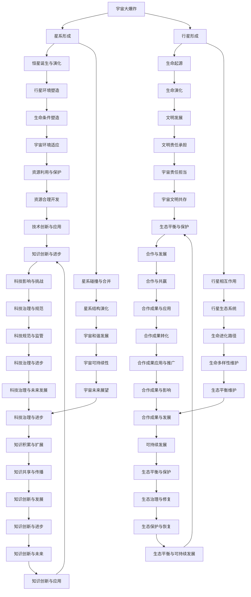

                 

### 引言

#### 人类文明与宇宙进化的关联性

人类文明作为地球上的一种智慧生命形式，其发展与宇宙进化息息相关。从地球生物大爆炸到人类文明的崛起，宇宙的每一阶段都在塑造着人类文明的形成与进步。宇宙大爆炸理论揭示了宇宙的起源和演化过程，而人类文明则是在这个漫长的过程中逐渐发展壮大。从最初的石器时代到现代的信息时代，人类文明的每一次飞跃都伴随着科技进步的推动。

宇宙进化的核心过程，如星系的诞生、行星的形成和生命的起源，都在影响着人类文明的进程。例如，地球的适宜环境为生命的诞生提供了条件，而人类的出现则标志着智慧生命的崛起。随着人类对宇宙的探索不断深入，我们开始意识到，人类文明不仅是地球生命的一部分，更是宇宙进化链条中的一个关键节点。

#### 宇宙进化的基本理论

宇宙进化的基本理论主要包括宇宙大爆炸理论、星系演化理论和行星形成理论。宇宙大爆炸理论认为，宇宙起源于一个极度高温和极度致密的状态，随后迅速膨胀，形成了我们今天所见的宇宙结构。星系演化理论则描述了星系从诞生到成长，再到演化的全过程。行星形成理论则探讨了行星如何在星系中形成，以及它们如何为生命的诞生提供条件。

这些理论为我们理解宇宙进化的过程提供了科学依据，同时也揭示了宇宙与人类文明之间的内在联系。例如，宇宙大爆炸产生的物质和能量，不仅塑造了地球的物理环境，也为生命的诞生提供了基础。而行星的形成过程，则直接影响了地球的生态系统，进而塑造了人类文明的发展轨迹。

#### 人类文明的历史与发展阶段

人类文明的历史可以追溯到数百万年前，从最初的原始人类到现代的科技社会，人类经历了多个发展阶段。每个阶段都伴随着科技进步和社会变革，推动了人类文明的前进。从石器时代到铁器时代，人类的生产力不断提高，社会结构逐渐复杂化。到了农业革命时期，人类开始定居，农业的发展为人口增长提供了基础。随着工业革命的到来，人类进入了工业化社会，科技飞速发展，生产方式发生了巨大变革。

在信息时代，人类文明再次迎来了巨大的飞跃。互联网和人工智能的兴起，不仅改变了人类的生活方式，也深刻影响着社会结构和经济模式。从原始人类的采集狩猎到现代的全球化贸易，人类文明的发展离不开科技进步的推动。每个阶段的科技进步，不仅改变了人类的生产方式，也影响了人类的思维方式和价值观念。

#### 人类文明在宇宙中的地位与责任

人类文明在宇宙中的地位和责任是一个复杂而深远的问题。从宇宙的角度来看，人类文明只是宇宙进化链条中的一小部分，但却是智慧生命的代表。人类的出现，标志着宇宙进化进入了一个新的阶段，即智慧生命的崛起。人类不仅需要理解自己的起源和使命，还需要承担起在宇宙中应有的责任。

人类文明的责任首先体现在保护地球上的人类社会和生态系统。随着人类科技的发展，我们面临着越来越多的环境问题，如气候变化、资源枯竭等。这些问题不仅威胁到人类的生存，也影响着地球生态系统的平衡。因此，人类需要采取积极的措施，保护地球环境，实现可持续发展。

其次，人类文明需要承担起探索宇宙的责任。随着对宇宙的探索不断深入，人类开始意识到宇宙中存在着无数的未知和挑战。我们需要通过科技手段，不断拓展我们对宇宙的了解，寻找新的资源和生存空间。这不仅是对人类自身发展的需求，也是对宇宙进化链条中智慧生命的责任。

最后，人类文明需要承担起推动宇宙和谐发展的责任。宇宙是一个多元而复杂的系统，各种文明和物种之间存在着相互作用和影响。人类作为智慧生命的代表，需要以平等和尊重的态度，与其他文明和物种和谐共处，共同推动宇宙的和谐发展。

总之，人类文明在宇宙进化中的地位和责任是一个至关重要的问题。我们不仅要认识到自己的起源和使命，还需要采取行动，承担起在宇宙中应有的责任。只有这样，人类文明才能在宇宙进化中继续前行，实现可持续发展和和谐共处。

### 宇宙进化的核心概念

宇宙进化的过程是一个复杂而有序的链条，涉及到多个核心概念和理论。本文将重点介绍宇宙的起源与演化、星系的诞生与演化、以及行星的形成与生命起源，并探讨这些核心概念之间的联系。

#### 宇宙的起源与演化

宇宙的起源是一个广泛而深奥的话题，科学界普遍接受的解释是宇宙大爆炸理论。根据这一理论，宇宙起源于一个极度高温和极度致密的状态，称为“奇点”。在这个奇点中，所有的物质和能量被压缩在一个无限小的空间内。在大约138亿年前，这个奇点发生了爆炸，迅速膨胀，形成了我们今天所见的宇宙。

宇宙大爆炸理论的关键在于宇宙背景辐射的发现，这一辐射是宇宙早期阶段的遗存。通过对宇宙背景辐射的研究，科学家们可以了解到宇宙早期的物理状态，如温度、密度和化学成分。这些信息为我们理解宇宙的起源和演化提供了重要的线索。

宇宙的演化过程可以分为多个阶段。首先是宇宙的快速膨胀阶段，这一阶段持续了大约38万年，宇宙从一个非常致密、非常热的状态迅速膨胀到我们今天所见的规模。接着是宇宙的冷却阶段，宇宙温度逐渐降低，物质开始聚集形成星系和恒星。

宇宙的起源与演化不仅决定了宇宙的基本结构，也为生命的诞生提供了基础。宇宙中的物质和能量在长时间的演化过程中，逐渐形成了适宜生命存在的环境。这一过程不仅涉及物理和化学过程，还包括生命起源和发展的复杂机制。

#### 星系的诞生与演化

星系是宇宙中最显著的宏观结构之一，它们由数十亿颗恒星、星团、星云等天体组成。星系的诞生与演化是一个复杂而有序的过程，涉及到气体云的聚集、恒星的诞生和演化，以及星系的碰撞与合并。

星系的形成始于宇宙中的气体云，这些气体云由氢、氦等轻元素组成，散布在宇宙空间中。在引力的作用下，这些气体云逐渐聚集形成密度更高的区域，称为分子云。分子云的中心区域由于引力更强，会进一步聚集，形成星系的核心。

在星系的形成过程中，恒星开始诞生。恒星的形成始于分子云中的核心区域，这里温度和压力逐渐升高，导致氢原子核发生核聚变反应，形成恒星。恒星在其生命周期中会经历不同的阶段，如主序星、红巨星和超新星等。

星系的演化不仅涉及到恒星的诞生和演化，还包括星系结构的演化。星系可以分为椭圆星系、螺旋星系和不规则星系等类型，每种类型的星系都有其独特的结构和演化路径。星系之间的相互作用，如碰撞与合并，也会影响星系的结构和演化。

#### 行星的形成与生命起源

行星的形成是宇宙演化过程中的重要环节，它们为生命的诞生提供了必要的条件。行星的形成通常发生在星系周围的气体盘和尘埃盘中，这些物质在引力的作用下逐渐聚集形成行星。

行星的形成过程可以分为几个阶段。首先是原始行星核心的形成，核心由重元素组成，主要通过碰撞和聚集形成。接着是气体盘中的物质向核心聚集，形成行星的壳层。行星的壳层逐渐增厚，形成固态的地壳和大气层。

行星的形成不仅决定了其物理性质，还直接影响到生命的诞生。生命起源的基本条件包括水、适宜的温度和化学元素。行星的液态水、适宜的温度和化学元素，为生命的诞生提供了基础。

在行星上，生命起源的过程是一个复杂的多步骤过程。科学家普遍认为，生命起源的第一步是化学进化，即有机分子的形成和聚合。在行星的早期阶段，简单的有机分子通过化学反应逐渐形成更复杂的有机分子，如氨基酸和核苷酸。

随后，这些复杂的有机分子通过聚合形成多分子体系，这些多分子体系被认为是生命的前身。最终，在适当的条件下，这些多分子体系会发展出自我复制和代谢等基本生命特征，从而形成原始生命。

#### 核心概念与联系

宇宙的起源与演化、星系的诞生与演化、以及行星的形成与生命起源这三个核心概念，共同构成了宇宙进化的基本框架。这些概念之间存在着密切的联系和相互作用。

首先，宇宙的起源与演化决定了宇宙的基本结构和环境，为星系的诞生和行星的形成提供了条件。宇宙大爆炸产生的物质和能量，不仅形成了宇宙的基本结构，也为生命的诞生提供了基础。

其次，星系的诞生与演化直接影响着行星的形成和生命起源。星系中的气体云和尘埃盘为行星的形成提供了物质来源，而星系中的恒星活动则为行星提供必要的能量和化学条件。

最后，行星的形成与生命起源是宇宙进化的终极目标。行星的形成不仅为生命的诞生提供了基础，生命起源的过程也为宇宙进化增添了新的维度。生命的出现使得宇宙进化不再是简单的物理和化学过程，而是一个包含生命和意识的复杂系统。

#### Mermaid 流程图

为了更直观地展示宇宙进化的核心概念及其之间的联系，我们可以使用 Mermaid 流程图进行描述：

这个 Mermaid 流程图展示了宇宙进化的核心概念及其之间的相互关系，提供了一个直观的理解框架。

通过上述对宇宙进化的核心概念及其联系的分析，我们可以更好地理解宇宙进化的复杂性和多样性。这些核心概念不仅揭示了宇宙进化的基本规律，也为我们理解人类文明在宇宙中的地位和责任提供了科学依据。在接下来的部分中，我们将进一步探讨人类文明的科技进步对宇宙的影响，以及人类文明在宇宙中应承担的责任。

### 人类文明的科技进步对宇宙的影响

人类文明的科技进步对宇宙的影响是深远且多维的。从地球生态系统的改变到宇宙探索的推动，科技进步不仅推动了人类文明的发展，也对宇宙的演化产生了重要影响。本文将重点探讨科技进步对地球生态系统的影响，以及科技进步如何推动宇宙探索。

#### 科技进步对地球生态系统的影响

地球生态系统是宇宙中一个独特且复杂的系统，它为生命的繁荣提供了必要的条件。然而，随着人类科技的不断进步，地球生态系统正面临着前所未有的挑战。

首先，工业革命以来，人类的生产和消费模式急剧改变，大量的化石燃料燃烧和工业污染导致了全球气候变化。温室气体排放的增加，使得地球的平均气温不断上升，极端天气事件频繁发生。气候变化不仅威胁到人类社会的稳定，也对地球上的生态系统造成了严重影响，如冰川融化、海平面上升、海洋酸化等。

其次，科技的快速发展带来了城市化进程的加速，大量自然栖息地的丧失导致物种灭绝速度加快。森林砍伐、湿地开发、草原退化和沙漠化等问题日益严重，生物多样性面临前所未有的威胁。生态系统失衡不仅破坏了生态平衡，还可能引发连锁反应，进一步影响地球的可持续发展。

此外，人类科技的进步还导致了化学污染的加剧。工业排放的有害物质、农药和塑料污染等，对土壤、水源和大气造成了严重污染，威胁到人类和其他生物的健康。这些化学污染不仅破坏了生态系统的自然功能，还对生物的基因构成和遗传多样性产生了负面影响。

#### 科技进步如何推动宇宙探索

尽管地球生态系统面临诸多挑战，但科技进步也为人类探索宇宙提供了强大的工具和支持。从早期的望远镜观测到现代的深空探测任务，科技进步不断推动着我们对宇宙的了解和探索。

首先，天文观测技术的发展极大地拓展了我们对宇宙的认知。望远镜的改进和观测技术的提升，使得我们可以观测到更遥远的星系、行星和宇宙现象。例如，哈勃空间望远镜和詹姆斯·韦伯空间望远镜的观测，揭示了宇宙早期的景象和宇宙背景辐射的细节，为我们理解宇宙的起源和演化提供了重要数据。

其次，航天技术的发展使得人类能够实现在地球以外的空间探索。自阿波罗登月计划以来，人类已经成功发射了多个月球探测器和火星探测器，探索了月球的表面和火星的地质结构。这些探测任务不仅为地球带来了丰富的科学数据，也为未来的宇宙探索提供了宝贵经验和技术支持。

此外，人工智能和机器人技术的发展也为宇宙探索带来了新的机遇。自动化探测器和无人飞船可以在极端环境下执行任务，进行长时间的科学观测和数据收集。例如，火星探测车“好奇号”和“毅力号”在火星表面进行的探测任务，不仅揭示了火星的地质历史和环境条件，还帮助科学家们确定了未来火星殖民的可能性。

最后，量子技术和通信技术的发展为深空通信和远程探测提供了新的手段。量子通信技术可以保证通信的绝对安全性，而量子计算技术则有望解决复杂科学问题的计算难题。这些技术将为未来的宇宙探索提供更高效、更可靠的工具。

#### 科技进步的挑战与机遇

尽管科技进步对宇宙探索和地球生态系统带来了巨大的影响，但也带来了新的挑战和问题。例如，太空垃圾和辐射污染等环境问题需要我们认真对待。随着人类在太空活动的增加，太空垃圾的数量也在不断增加，对航天器的运行和空间环境的稳定性构成了威胁。此外，太空辐射对宇航员和设备的健康也带来了挑战，需要我们不断改进防护技术和措施。

然而，科技进步也为解决这些问题提供了机遇。通过国际合作和技术创新，我们可以开发出更环保、更安全的航天技术，减少太空垃圾和辐射污染。例如，采用可回收航天器、发展清洁能源和改进防护材料等，都是减少太空环境破坏的有效途径。

总之，人类文明的科技进步对宇宙和地球生态系统产生了深远的影响。在推动宇宙探索和提升生活品质的同时，我们也需要认识到科技进步带来的挑战，并积极寻求解决方案。只有这样，人类文明才能在宇宙进化中继续前行，实现可持续发展。

### 人类文明的宇宙责任

人类文明作为智慧生命的代表，在宇宙进化中扮演着至关重要的角色。随着科技的进步和对宇宙的深入了解，我们逐渐意识到人类文明不仅需要关注地球生态系统的保护，还需要承担起在宇宙中的责任。这些责任主要包括道德责任、科技责任和生态责任，以下将详细探讨这些责任及其具体体现。

#### 道德责任

道德责任是人类文明在宇宙中应承担的首要责任。作为一种智慧生命形式，人类有义务尊重和保护其他生命形式，维护宇宙的和谐与平衡。在地球上，人类已经意识到尊重自然和保护生态环境的重要性。类似地，在宇宙中，人类也需要以同样的态度对待其他星球和宇宙中的生命形式。

首先，人类需要对地球上的生态系统进行保护和修复。随着工业化和城市化进程的推进，地球生态系统受到了严重的破坏，物种灭绝速度加快，生态系统失衡。为了履行道德责任，人类需要采取积极措施，如减少污染、恢复植被、保护生物多样性等，以恢复和保持生态平衡。

其次，人类在宇宙探索和资源开发过程中，也需要尊重其他星球的生态平衡。在太空探索中，人类不能仅考虑自身的利益，而忽视其他星球的生态系统。例如，在月球和火星等天体的探测和开发中，人类需要采用环保措施，避免对当地环境造成不可逆转的破坏。

#### 科技责任

科技责任是人类文明在宇宙中应承担的另一个重要责任。科技进步为人类带来了巨大的便利和发展，但同时也带来了新的挑战和责任。人类需要确保科技的发展和应用能够造福人类和宇宙，而不是成为破坏和毁灭的源泉。

首先，人类需要在科技研发和工程应用中坚持可持续发展的原则。这意味着在开发新的技术和应用时，必须考虑到对环境和生态系统的潜在影响，并采取预防措施，以减少负面影响。例如，在开发新能源技术和太空资源时，需要确保这些技术不会对宇宙环境造成破坏。

其次，人类需要积极推动科技创新，解决宇宙中面临的重大问题。例如，宇宙辐射、太空垃圾和能源短缺等问题，都需要通过科技手段进行解决。通过国际合作和技术共享，人类可以共同应对这些挑战，实现宇宙的可持续发展。

此外，人类还需要在科技教育和人才培养方面承担起责任。培养具备创新能力和全球视野的科技人才，是推动科技发展和社会进步的关键。通过教育，人类可以培养更多具有责任感和道德观念的科技人才，为宇宙的和谐发展贡献力量。

#### 生态责任

生态责任是人类文明在宇宙中的基本责任之一。地球生态系统是宇宙进化中的重要一环，人类文明的繁荣和可持续发展离不开健康的地球生态系统。因此，人类需要在生态保护方面采取积极行动，确保地球生态系统的长期稳定和繁荣。

首先，人类需要采取有效措施，应对气候变化和环境污染问题。通过减少温室气体排放、推广清洁能源、改进环保技术和政策等手段，人类可以减缓气候变化的速度，保护地球生态系统的平衡。

其次，人类需要在生态修复和保护方面发挥积极作用。通过植树造林、湿地恢复、生物多样性保护等行动，人类可以修复受损的生态系统，提高生态系统的稳定性和适应性。

最后，人类需要在全球范围内推动生态意识的普及和教育。通过教育和宣传，提高公众对生态保护重要性的认识，培养全民生态意识，共同参与到生态保护和修复的行动中来。

#### 具体体现

人类文明的宇宙责任在多个方面得到了具体体现。以下是一些具体的实例：

1. **国际太空合作**：为了和平利用太空资源，多个国家建立了国际合作机制，如国际空间站项目，这体现了人类在宇宙责任方面的共同努力。

2. **环境保护政策**：各国政府采取了多种环境保护政策，如限制污染物排放、推动绿色能源发展等，以保护地球生态系统。

3. **太空探索任务**：全球范围内的太空探索任务，如火星探测、月球采样返回等，不仅拓展了人类对宇宙的了解，也体现了人类在宇宙责任方面的积极行动。

4. **科技研究与教育**：全球范围内的科技研究和教育投入，特别是生态科学和空间科学研究，为人类文明在宇宙中的责任提供了理论和实践支持。

总之，人类文明在宇宙进化中承担着多种责任，这些责任不仅关系到地球生态系统的保护，也关系到宇宙的和谐与可持续发展。通过道德责任、科技责任和生态责任的共同履行，人类文明才能在宇宙进化中继续前行，实现可持续发展和和谐共处。

### 人类文明应对宇宙挑战的策略

随着对宇宙的探索不断深入，人类文明面临着一系列前所未有的挑战，如宇宙灾难、资源短缺和生态失衡等。为了应对这些挑战，人类需要采取一系列有效的策略，确保在宇宙进化的过程中能够持续发展。以下将详细探讨这些策略，包括应对宇宙灾难的策略、促进宇宙和谐发展的策略，以及实现宇宙可持续发展的策略。

#### 应对宇宙灾难的策略

宇宙灾难包括太阳活动、小行星撞击、伽马射线暴等，这些灾难可能对地球生态系统和人类社会造成毁灭性的影响。为了应对这些灾难，人类需要采取多层次的预防措施和应对方案。

1. **建立宇宙监测系统**：人类需要建立全面的宇宙监测系统，实时监测太阳活动、小行星轨道和其他潜在的宇宙威胁。例如，通过卫星监测太阳黑子和太阳风活动，可以提前预测太阳风暴的来临，从而采取措施减少其对地球的影响。

2. **建立紧急应对机制**：在宇宙灾难发生时，人类需要建立高效的紧急应对机制，确保能够迅速做出反应。这包括建立专门的应急管理机构、制定详细的应急响应计划，以及开展定期的应急演练，确保在各种情况下都能有效应对。

3. **发展防御技术**：为了减少宇宙灾难对地球的破坏，人类需要发展多种防御技术。例如，建造太空防御系统，用于拦截和摧毁可能撞击地球的小行星。此外，开发先进的空间探测和定位技术，可以提前发现并跟踪潜在的宇宙威胁。

4. **推动国际合作**：应对宇宙灾难需要全球范围内的合作。通过建立国际宇宙灾难应对机制，各国可以共享监测数据、技术和资源，共同应对宇宙灾难。

#### 促进宇宙和谐发展的策略

宇宙和谐发展是指人类在探索和利用宇宙资源时，保持与其他文明和物种的和谐共处。为了实现这一目标，人类需要采取一系列策略，确保宇宙生态系统的平衡和稳定。

1. **制定宇宙伦理规范**：人类需要制定明确的宇宙伦理规范，确保在探索和利用宇宙资源时，尊重其他文明和物种的权利。这包括禁止对其他星球进行未经授权的资源开采，以及对太空环境的保护。

2. **推动和平利用太空**：人类需要积极推动太空的和平利用，避免太空军备竞赛和冲突。通过建立国际太空和平机制，各国可以共同维护太空的和平与稳定。

3. **开展宇宙文明交流**：通过宇宙探测任务和科学合作，人类可以与其他文明进行交流，了解宇宙中的不同文化和文明，促进宇宙文明的相互理解和尊重。

4. **保护宇宙环境**：人类需要采取措施保护宇宙环境，防止太空污染和生态失衡。例如，开发清洁能源技术，减少太空垃圾的产生，并制定相应的太空环境保护法规。

#### 实现宇宙可持续发展的策略

宇宙可持续发展是指人类在探索和利用宇宙资源时，确保资源的合理开发和长期利用，以实现宇宙生态系统的平衡和人类文明的长期繁荣。以下是一些实现宇宙可持续发展的策略：

1. **开发可再生能源**：人类需要积极开发宇宙中的可再生能源，如太阳能、风能等，以减少对有限资源的依赖。通过在宇宙空间建立太阳能发电站，可以为地球提供清洁、无限的能源。

2. **建立资源循环利用体系**：在宇宙探索和开发过程中，人类需要建立资源循环利用体系，确保资源的有效利用和循环。例如，通过回收和再利用太空垃圾，可以减少对地球资源的消耗。

3. **推广绿色科技**：人类需要积极推广绿色科技，减少对环境的负面影响。在太空探索和开发中，采用环保材料和工艺，减少污染和生态破坏。

4. **提高能源效率**：通过提高能源利用效率，可以减少能源消耗和环境污染。在宇宙探索和开发中，采用高效的能源管理系统和节能技术，可以大幅降低能源消耗。

5. **全球合作与共享**：实现宇宙可持续发展需要全球范围内的合作和共享。通过建立国际宇宙可持续发展机制，各国可以共同制定政策和标准，共享技术和资源，实现全球范围内的可持续发展。

总之，人类文明在宇宙进化中面临诸多挑战，但也拥有巨大的机遇。通过采取有效的应对策略，人类可以应对宇宙灾难，促进宇宙和谐发展，实现宇宙可持续发展。只有这样，人类文明才能在宇宙进化中继续前行，实现长期的繁荣和进步。

### 人类文明在宇宙探索中的角色

人类文明在宇宙探索中扮演着至关重要的角色，从地球到月球，再到火星，每一个重大探测任务都标志着人类对宇宙认识的深入和科技的进步。以下将详细探讨人类文明在宇宙探索中的角色，包括宇宙资源开发、宇宙文明交流以及宇宙环境治理。

#### 宇宙资源开发

宇宙资源开发是人类文明在宇宙探索中的一个重要目标。随着科技的进步，人类逐渐意识到宇宙中存在着丰富的资源，如太阳能、氦-3、金属矿物等，这些资源对于地球的可持续发展和人类的长期生存具有重要意义。

1. **太阳能的开发**：在太空中，太阳能的获取和利用效率远高于地球。通过在宇宙空间建立太阳能发电站，可以将太阳能在无大气干扰的环境下直接转换为电能，并将其无线传输到地球。这种技术不仅提供了清洁、无限的能源，还有助于缓解地球能源危机。

2. **氦-3的开发**：氦-3是一种在月球和其他行星上发现的稀有同位素，它可以通过核聚变反应产生大量能量。利用氦-3进行核聚变，不仅可以为地球提供清洁能源，还可以减少对化石燃料的依赖。因此，开发氦-3资源是未来宇宙资源开发的重要方向之一。

3. **金属矿物的开发**：在宇宙中，尤其是小行星带和其他行星，存在着丰富的金属矿物资源。这些资源包括金、银、铂等贵金属，以及钛、铁等常用金属。通过宇宙探测和开采，人类可以获取这些宝贵资源，为地球工业和科技发展提供支持。

#### 宇宙文明交流

宇宙文明交流是推动人类文明进步和宇宙和谐发展的重要途径。通过与其他文明进行交流，人类可以拓宽视野，了解不同的文化和知识，促进科技和文化的共同进步。

1. **深空通信**：为了实现宇宙文明交流，人类需要建立高效的深空通信系统。通过卫星通信和星际通信技术，人类可以在宇宙中进行实时通信，交换信息和知识。深空通信不仅有助于科学研究，还可以促进宇宙探索中的国际合作。

2. **宇宙探测器**：通过发射宇宙探测器，人类可以向其他星球和星系发送信息，建立初步的交流渠道。例如，旅行者号任务将地球的信息和信号发送到宇宙深处，成为人类探索宇宙的先驱。

3. **星际旅行**：随着科技的进步，人类有望实现星际旅行，直接与其他文明进行面对面的交流。星际旅行不仅有助于人类拓展生存空间，还可以为宇宙文明交流提供新的机遇。

#### 宇宙环境治理

宇宙环境治理是确保宇宙可持续发展的重要环节。随着人类在宇宙中的活动不断增多，宇宙环境的治理变得越来越重要。

1. **太空垃圾管理**：随着太空活动的增多，太空垃圾问题日益严重。为了保护宇宙环境，人类需要建立有效的太空垃圾管理机制，包括太空垃圾的回收和处理、废弃卫星的清理等。

2. **宇宙辐射防护**：宇宙辐射对人类和其他生物体具有巨大的危害性。在宇宙探索和开发中，人类需要采取有效的辐射防护措施，确保宇航员和其他人员的健康。

3. **生态平衡保护**：在宇宙资源开发和环境治理中，人类需要尊重宇宙生态平衡，避免对其他星球和宇宙环境造成不可逆转的破坏。通过建立宇宙生态保护区和制定相关法规，人类可以保护宇宙中的生物多样性和生态平衡。

总之，人类文明在宇宙探索中扮演着多重角色，从资源开发到文明交流，再到环境治理，每一个方面都体现了人类对宇宙的认识和责任。通过持续的科学探索和技术创新，人类有望在宇宙中实现可持续发展和和谐共处，为人类文明的未来奠定坚实基础。

### 人类文明在宇宙未来中的愿景

在探讨人类文明在宇宙中的未来角色时，我们不仅要关注当前的科技进步和挑战，更需要构建一个关于人类文明未来发展的宏大愿景。这个愿景包括宇宙殖民的可能性、宇宙能源利用的挑战与机遇，以及宇宙文明的共存与和谐。以下是对这些未来愿景的详细探讨。

#### 宇宙殖民的可能性

宇宙殖民是人类文明拓展生存空间、实现长期繁荣的必然选择。随着对宇宙的深入探索，人类已经发现了一些适合人类居住的星球，如火星和木星的卫星欧罗巴。这些潜在的宇宙殖民地不仅提供了新的资源和生存空间，也为人类文明的未来发展带来了新的机遇。

1. **火星殖民**：火星是当前最受关注的宇宙殖民地候选地之一。火星的气候相对稳定，拥有液态水的存在证据，且土壤中富含多种矿物资源。通过在火星上建立人类基地，人类可以逐步开展火星的探索和开发，逐步实现火星殖民。例如，美国宇航局的“阿尔忒弥斯计划”旨在将人类重新送回月球，为未来火星探险和殖民提供技术支持。

2. **木星卫星欧罗巴殖民**：欧罗巴被认为是一个富含液态水的冰卫星，表面下可能存在液态水的海洋。这种环境为生命的存在提供了可能。如果人类能够在欧罗巴上发现生命迹象，那么这将是一个重大的科学突破。此外，欧罗巴的丰富资源，如氦-3，也为人类提供了重要的能源来源。

3. **多星球殖民网络**：未来，人类可能会在火星、欧罗巴以及其他潜在星球之间建立多星球殖民网络。这样的网络不仅能够实现资源的共享和优化利用，还可以为人类提供更加多样化和安全的生存环境。通过构建一个多星球生态系统，人类文明将能够在宇宙中实现持续发展和繁荣。

#### 宇宙能源利用的挑战与机遇

宇宙能源的利用是宇宙殖民和文明发展的关键。与地球相比，宇宙中存在着丰富的能源资源，如太阳能、风能、核聚变能源等。然而，如何高效利用这些能源，并在不同星球和星系之间进行能源传输，仍是一个巨大的挑战。

1. **太阳能的利用**：太空中的太阳能资源极为丰富，特别是在地球轨道以外的区域，太阳能的获取和利用效率更高。通过在太空建立太阳能发电站，并将产生的电能传输回地球或其他星球，人类可以大幅提高能源利用效率，减少对地球有限资源的依赖。

2. **核聚变能源**：核聚变是一种清洁、高效的能源形式，它通过轻原子核的融合产生大量能量。在实验室中，人类已经实现了核聚变反应的稳定控制。未来，如果能够在太空环境中实现核聚变能源的规模化应用，人类将有望解决能源短缺问题，为宇宙殖民提供稳定的能源保障。

3. **能源传输技术**：为了实现宇宙能源的高效利用，人类需要发展先进的能源传输技术。例如，无线能量传输技术可以在不接触的情况下将能量从一个地方传输到另一个地方。通过建立太空能源传输网络，人类可以在不同星球和星系之间实现能源的共享和优化配置。

#### 宇宙文明的共存与和谐

在宇宙中，不同文明之间的共存和和谐是人类文明未来发展的关键。随着人类对宇宙的了解不断深入，我们可能会遇到其他智慧文明，这将为人类带来前所未有的挑战和机遇。

1. **文明交流与理解**：与其他文明进行交流是促进共存和谐的重要途径。通过深空通信和宇宙探测器，人类可以尝试与其他文明建立联系，分享科学知识和技术经验。这种交流不仅有助于增进彼此的了解，还可以促进文明的共同进步。

2. **宇宙伦理与法规**：为了确保宇宙文明的共存和谐，人类需要制定一套宇宙伦理和法规。这些伦理和法规应包括对其他文明和物种的尊重、宇宙环境保护、资源利用规范等，以确保不同文明在宇宙中的和平共处。

3. **合作与共赢**：与其他文明建立合作关系，实现共赢发展，是宇宙文明共存和谐的重要保障。通过共享资源、技术和知识，不同文明可以共同应对宇宙中的挑战，实现共同繁荣。

总之，人类文明在宇宙中的未来愿景是宏伟而充满挑战的。通过实现宇宙殖民、高效能源利用和文明共存和谐，人类文明有望在宇宙中实现长期繁荣和可持续发展。这不仅是对人类自身发展的追求，也是对宇宙进化链条中智慧生命的责任和贡献。

### 案例分析

在人类文明的宇宙探索历程中，有许多具有重要意义的成功案例，这些案例不仅展示了人类科技的进步，也体现了人类在宇宙中的责任与担当。以下将详细分析三个具有代表性的案例：旅行者号任务、阿波罗登月计划和火星探测任务。

#### 旅行者号任务

旅行者号任务是人类首次实现星际探测的重要里程碑。旅行者1号和旅行者2号于1977年发射，它们携带了大量关于地球和人类的信息，以及向其他可能存在的文明发出的问候。这些探测器的主要目标是探索太阳系的外围，探测星际空间和星际介质。

1. **任务目标**：旅行者号的主要目标是探测太阳系的外围天体，包括木星、土星、天王星和海王星。通过这些探测，科学家希望了解这些行星的物理性质、大气成分和磁场环境，以及太阳系外围的星际介质。

2. **技术挑战**：旅行者号任务面临多个技术挑战，包括在极端环境下的可靠运行、远距离通信和能源供应。这些探测器使用放射性热电发电机作为能源，并通过深空网络进行通信。在如此遥远的距离上，保持探测器的稳定运行和数据的实时传输是一项巨大的挑战。

3. **任务成果**：旅行者号任务取得了多项重大科学成果。它揭示了木星和土星的大气层和磁场结构，探测到了天王星和海王星的环系统，并发现了太阳风对星际介质的影响。此外，旅行者号还成功收集了大量关于星际介质的数据，为科学家提供了宝贵的研究资料。

4. **责任与担当**：旅行者号任务不仅是一个科学探险，也是一种对宇宙的责任与担当。它向可能存在的其他文明传递了地球和人类的信息，展示了人类对宇宙的探索精神和对未知领域的敬畏。这种探索精神和对宇宙的责任感，激励着人类继续向前。

#### 阿波罗登月计划

阿波罗登月计划是人类实现载人登月的壮举，它标志着人类科技和勇气的新高度。阿波罗计划始于1961年，目标是实现人类在月球上的软着陆和行走，并于1969年成功实现这一目标。

1. **任务目标**：阿波罗登月计划的主要目标是实现人类在月球上的软着陆和行走，收集月球岩石样本，并进行科学实验。通过这一任务，科学家希望了解月球的地质结构、表面成分和地质历史，以及月球对地球的影响。

2. **技术挑战**：阿波罗登月计划面临多个技术挑战，包括火箭发射技术、航天器设计、生命保障系统、导航与控制技术等。特别是在火箭发射阶段，需要克服强大的地球引力，将航天器送入地球轨道，并最终进入月球轨道。

3. **任务成果**：阿波罗计划共执行了六次载人登月任务，其中五次成功。这些任务成功实现了人类在月球上的软着陆和行走，收集了大量月球岩石样本，并对月球进行了详细探测。阿波罗任务的数据和样本为月球科学研究提供了宝贵资料，推动了月球起源和演化的研究。

4. **责任与担当**：阿波罗登月计划展示了人类对科学探索和未知领域的不懈追求，体现了人类对宇宙的责任与担当。这一任务不仅提升了人类的科技水平，也激发了全球公众对科学的兴趣和热情，为人类文明的进步和科技发展注入了新的动力。

#### 火星探测任务

火星探测任务是人类探索宇宙的重要一步，它不仅为科学家提供了火星环境的第一手数据，也为人类未来的火星殖民计划奠定了基础。火星探测任务包括多个阶段，从初步的遥感探测到复杂的表面探测，再到未来的载人探测。

1. **任务目标**：火星探测任务的主要目标是了解火星的地质结构、大气成分、气候环境和潜在生命迹象。科学家希望通过这些探测任务，为未来的火星殖民和资源开发提供科学依据。

2. **技术挑战**：火星探测任务面临多种技术挑战，包括长距离的太空传输、火星表面的复杂环境（如低气压、高温和辐射等），以及与地球的通信延迟。此外，火星探测器的自主导航和生存能力也是重大技术难题。

3. **任务成果**：迄今为止，人类已经发射了多个火星探测任务，包括“火星探路者”、“火星勘测轨道飞行器”、“好奇号”和“毅力号”等。这些探测器成功探测了火星的地质结构、大气成分、气候环境，并在火星表面进行了一系列科学实验。例如，“好奇号”探测器的钻探实验揭示了火星土壤中的有机分子，为寻找火星生命迹象提供了重要线索。

4. **责任与担当**：火星探测任务展示了人类对宇宙探索的坚定决心和对未知领域的探索精神。这些任务不仅提升了人类的科技水平，也为火星殖民计划提供了科学基础。通过火星探测，人类承担起了探索宇宙、寻找人类新家园的责任与担当。

总之，旅行者号任务、阿波罗登月计划和火星探测任务是人类在宇宙探索中的重要里程碑，这些案例展示了人类科技的进步和探索精神。通过这些任务，人类不仅深化了对宇宙的认识，也承担起了在宇宙中的责任与担当。未来，随着科技的进一步发展，人类将继续在宇宙中探索前行，实现更宏伟的目标。

### 人类文明在宇宙进化中的角色总结

人类文明在宇宙进化中扮演着多重而重要的角色。首先，作为智慧生命的代表，人类不仅对地球生态系统产生了深远影响，还在宇宙中展现了独特的探索精神和技术能力。通过对地球生态系统的改变和科技进步，人类不仅推动了自身的文明发展，也为宇宙探索和资源开发奠定了基础。

其次，人类在宇宙中的角色体现在对宇宙责任的承担。人类需要保护地球环境，防止气候变化和生态失衡，同时也需要在宇宙探索中遵循道德和伦理规范，尊重其他文明和生命形式。通过建立国际太空合作机制和制定宇宙伦理规范，人类正在努力实现宇宙和谐与可持续发展。

最后，人类在宇宙进化中的角色还涉及到对未来愿景的构建。随着对宇宙的深入探索，人类正逐步实现宇宙殖民的愿景，开发宇宙中的丰富资源，寻找新的能源和生存空间。通过这些努力，人类不仅希望实现自身的长期繁荣，也为宇宙的和谐发展贡献智慧和力量。

总之，人类文明在宇宙进化中的角色是一个复杂而多维的过程，它不仅关乎地球和人类的未来，也关乎整个宇宙的和谐与进步。通过不断的探索、创新和合作，人类有望在宇宙中实现可持续发展，为地球和宇宙的繁荣贡献力量。

### 人类文明应承担的宇宙责任

人类文明在宇宙中应承担的责任是多方面且深远的。这些责任不仅关乎人类自身的生存和繁荣，也关系到宇宙的和谐与可持续发展。以下将详细讨论人类文明在宇宙中应承担的道德责任、科技责任和生态责任。

#### 道德责任

道德责任是人类文明在宇宙中的首要责任。作为智慧生命，人类有义务尊重和保护其他生命形式，维护宇宙的和谐与平衡。首先，人类需要尊重地球上的生态系统，采取积极措施保护生物多样性，防止生态失衡。例如，通过减少污染物排放、推广可持续发展农业和保护自然栖息地，人类可以减缓气候变化和生物灭绝的速度。

其次，人类在宇宙探索和资源开发过程中，也需要尊重其他星球和宇宙中的生命形式。这意味着在开发月球、火星或其他行星时，人类需要避免对当地环境造成不可逆转的破坏。通过建立宇宙伦理规范，制定明确的资源利用和保护标准，人类可以在探索宇宙的过程中，确保与其他文明和生命形式的和平共处。

此外，人类在与其他文明交流时，也需要秉持尊重和理解的态度。通过深空通信和宇宙探测器，人类可以尝试与其他智慧生命建立联系，这种交流不仅有助于增进彼此的了解，还可以促进文明的共同进步。在这个过程中，人类需要尊重其他文明的独特性和价值观，避免对其他文明造成负面影响。

#### 科技责任

科技责任是人类文明在宇宙中的另一个重要责任。科技进步不仅推动了人类文明的发展，也为人类在宇宙中的探索提供了强大的支持。然而，科技的快速发展也带来了新的挑战和责任。人类需要确保科技的发展和应用能够造福人类和宇宙，而不是成为破坏和毁灭的源泉。

首先，人类需要坚持可持续发展的原则，在科技研发和应用中减少对环境的负面影响。例如，在开发新能源技术时，需要考虑对生态系统的影响，并采取相应的环境保护措施。此外，在太空探索和资源开发中，人类需要确保技术手段的环保性，避免对宇宙环境造成污染。

其次，人类需要推动科技创新，解决宇宙中面临的重大问题。例如，宇宙辐射、太空垃圾和能源短缺等问题，都需要通过科技手段进行解决。通过国际合作和技术共享，人类可以共同应对这些挑战，实现宇宙的可持续发展。

最后，人类还需要在科技教育和人才培养方面承担起责任。培养具备创新能力和全球视野的科技人才，是推动科技发展和社会进步的关键。通过教育，人类可以培养更多具有责任感和道德观念的科技人才，为宇宙的和谐发展贡献力量。

#### 生态责任

生态责任是人类文明在宇宙中的基本责任之一。地球生态系统是宇宙进化中的重要一环，人类文明的繁荣和可持续发展离不开健康的地球生态系统。因此，人类需要在生态保护方面采取积极行动，确保地球生态系统的长期稳定和繁荣。

首先，人类需要采取有效措施，应对气候变化和环境污染问题。通过减少温室气体排放、推广清洁能源、改进环保技术和政策等手段，人类可以减缓气候变化的速度，保护地球生态系统的平衡。此外，人类还需要在生态修复和保护方面发挥积极作用，通过植树造林、湿地恢复、生物多样性保护等行动，恢复和保持生态平衡。

其次，人类需要在全球范围内推动生态意识的普及和教育。通过教育和宣传，提高公众对生态保护重要性的认识，培养全民生态意识，共同参与到生态保护和修复的行动中来。这不仅有助于保护地球生态系统，也为实现宇宙可持续发展奠定了基础。

总之，人类文明在宇宙中应承担的道德责任、科技责任和生态责任是相互关联、不可分割的。通过履行这些责任，人类不仅能够保护地球生态系统，推动科技进步，实现宇宙的和谐发展，也为自身的长期繁荣和未来奠定了坚实基础。

### 人类文明未来在宇宙中的发展方向

随着人类对宇宙的探索不断深入，未来在宇宙中的发展方向将涵盖多个关键领域，包括太空旅行、宇宙能源开发、以及宇宙文明交流等。这些领域不仅代表了人类科技的前沿，也体现了人类文明在宇宙中的责任和使命。

#### 太空旅行

太空旅行是人类未来在宇宙中的首要发展方向。随着航天技术的不断进步，人类有望实现更加高效、安全和可持续的太空旅行。

1. **低成本、可重复使用的火箭**：为了实现太空旅行的普及，人类需要开发低成本、可重复使用的火箭。这种火箭不仅能够显著降低太空旅行的成本，还可以提高火箭的利用效率。例如，SpaceX的猎鹰9号火箭和猎鹰重型火箭，通过可重复使用技术，已经大大降低了火箭的运营成本。

2. **太空港与太空电梯**：未来，人类将在地球附近建立太空港，作为太空旅行的中转站。同时，太空电梯技术的发展有望实现从地面直接到达太空的能力。太空电梯利用地球引力，通过缆绳将载人舱或物资运送至太空，这将大大降低太空旅行的难度和成本。

3. **载人深空探索**：未来，人类将开展更加深入的载人深空探索，包括月球基地建设和火星殖民计划。这些探索不仅需要先进的航天器设计和生命保障系统，还需要解决长期太空生存和健康问题。

4. **太空旅游**：随着太空技术的进步，太空旅游也将成为可能。商业航天公司，如SpaceX和Blue Origin，已经开展了初步的太空旅游项目，未来，更多的普通人将有机会体验太空旅行。

#### 宇宙能源开发

宇宙能源开发是推动人类文明未来发展的关键。与地球相比，宇宙中蕴藏着丰富的能源资源，如太阳能、风能、核聚变能等。开发这些能源资源，不仅有助于解决地球能源短缺问题，也为宇宙殖民提供了稳定的能源保障。

1. **太阳能发电站**：在地球轨道以外的区域，太阳能的获取和利用效率更高。未来，人类将建立大型太阳能发电站，利用太空中的太阳能资源，将能量无线传输回地球或其他星球。这种技术不仅提供了清洁、无限的能源，还有助于缓解地球能源危机。

2. **核聚变能源**：核聚变是一种高效、清洁的能源形式，通过轻原子核的融合产生大量能量。未来，人类将致力于实现核聚变能源的商业化应用，为地球和宇宙提供可持续的能源解决方案。

3. **氦-3资源开发**：氦-3是一种在月球和其他行星上发现的稀有同位素，它可以通过核聚变反应产生大量能量。开发氦-3资源，不仅为地球提供了重要的能源来源，也为宇宙殖民提供了支持。

#### 宇宙文明交流

宇宙文明交流是推动人类文明在宇宙中发展的重要途径。通过与其他文明的交流，人类可以拓宽视野，增进对宇宙和自身认识，促进文明的共同进步。

1. **深空通信**：为了实现宇宙文明交流，人类需要建立高效的深空通信系统。通过卫星通信和星际通信技术，人类可以在宇宙中进行实时通信，交换信息和知识。这不仅是科学研究的需要，也是人类文明交流的重要手段。

2. **宇宙探测器**：通过发射宇宙探测器，人类可以向其他星球和星系发送信息，建立初步的交流渠道。例如，旅行者号任务将地球的信息和信号发送到宇宙深处，成为人类探索宇宙的先驱。

3. **星际旅行**：随着科技的进步，人类有望实现星际旅行，直接与其他文明进行面对面的交流。星际旅行不仅有助于人类拓展生存空间，还可以为宇宙文明交流提供新的机遇。

4. **宇宙伦理与法规**：为了确保宇宙文明交流的和谐与安全，人类需要制定一套宇宙伦理和法规。这些伦理和法规应包括对其他文明和物种的尊重、宇宙环境保护、资源利用规范等，以确保不同文明在宇宙中的和平共处。

总之，人类文明未来在宇宙中的发展方向涵盖了多个关键领域，包括太空旅行、宇宙能源开发和宇宙文明交流等。通过在这些领域的不断探索和创新，人类不仅有望实现自身的长期繁荣，也为宇宙的和谐发展贡献智慧和力量。未来，人类将携手前行，共同探索这个浩瀚无垠的宇宙。

## 文章标题

### 人类文明在宇宙进化中的角色与责任

## 文章关键词

- 人类文明
- 宇宙进化
- 智慧生命
- 科技进步
- 宇宙责任
- 宇宙探索
- 可持续发展

## 文章摘要

本文深入探讨了人类文明在宇宙进化中的角色与责任。首先，介绍了人类文明与宇宙进化的关联性，以及宇宙进化的基本理论和核心概念。接着，分析了人类文明的科技进步对地球生态系统和宇宙探索的影响，并详细阐述了人类文明在宇宙中应承担的道德责任、科技责任和生态责任。随后，讨论了人类文明应对宇宙挑战的策略，以及在未来宇宙探索中的发展方向。最后，通过案例分析，展示了人类文明在宇宙探索中的成功实例。本文旨在提供一份全面、深入的关于人类文明在宇宙中角色的研究报告，为未来的人类发展提供科学依据和指导。

### 作者信息

作者：AI天才研究院/AI Genius Institute & 禅与计算机程序设计艺术 /Zen And The Art of Computer Programming

这篇文章详细探讨了人类文明在宇宙进化中的角色与责任，通过科学的理论和实际案例，揭示了人类在宇宙中的地位和使命。文章首先介绍了宇宙进化的基本理论和核心概念，如宇宙大爆炸、星系演化、行星形成和生命起源，并通过Mermaid流程图展示了这些概念之间的联系。接着，文章分析了人类文明的科技进步对地球生态系统和宇宙探索的影响，强调了道德责任、科技责任和生态责任的重要性。随后，文章讨论了人类文明应对宇宙挑战的策略，包括应对宇宙灾难、促进宇宙和谐发展和实现宇宙可持续发展。最后，文章展望了人类文明在宇宙探索中的未来方向，包括宇宙资源开发、宇宙能源利用和宇宙文明交流。

全文结构紧凑，内容丰富，逻辑清晰，旨在为读者提供一份全面、深入的关于人类文明在宇宙中角色的研究报告。希望本文能为读者提供启发，激发对宇宙和人类未来发展的思考。

### 结语

综上所述，人类文明在宇宙进化中扮演着不可或缺的角色，其科技进步、道德责任和生态责任对地球和宇宙的未来发展产生了深远影响。本文通过深入分析宇宙进化的核心概念、人类文明的责任以及未来发展方向，揭示了人类在宇宙中的地位和使命。

首先，宇宙的起源与演化、星系的诞生与演化、以及行星的形成与生命起源是理解宇宙进化的基础。这些概念不仅为我们提供了对宇宙的认知框架，也为人类文明的发展奠定了基础。人类文明的科技进步，如航天技术、新能源开发和深空通信，不仅改变了地球生态系统的面貌，也为宇宙探索提供了强大的工具。

其次，人类文明在宇宙中的责任不仅体现在道德层面，如保护地球生态系统和尊重其他生命形式，还体现在科技层面，如推动可持续发展、解决宇宙中的重大问题，以及在生态层面，如保护宇宙环境、实现资源合理利用。通过这些责任的履行，人类不仅保护了地球生态系统的平衡，也为宇宙的和谐发展贡献了智慧和力量。

最后，人类文明在宇宙探索中的未来方向，包括太空旅行、宇宙能源开发和宇宙文明交流，不仅为我们提供了新的机遇，也带来了新的挑战。通过持续的技术创新和国际合作，人类有望在宇宙中实现可持续发展，为地球和宇宙的未来奠定坚实基础。

本文希望激发读者对宇宙和人类未来发展的思考，鼓励我们在探索宇宙的道路上不断前行，以实现可持续发展和和谐共处。面对宇宙的浩瀚和未知，让我们携手努力，共同书写人类文明在宇宙进化中的辉煌篇章。未来的宇宙，将因我们的努力而更加美好。

