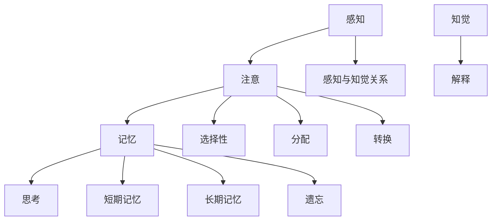
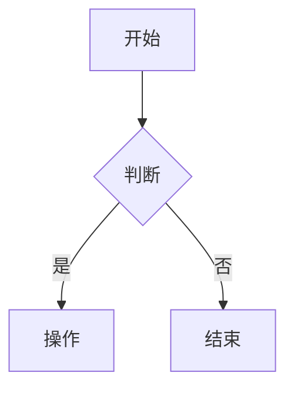

                 


## 引言

### 1.1 书籍背景与目的

《人类认知与宇宙实在：bridging the gap》是一本旨在探讨人类对宇宙认知的书籍。随着科技的进步和人类认知的深化，我们对于宇宙的理解也在不断拓展。然而，人类认知与宇宙实在之间仍然存在巨大的差距。本书的目的是通过多学科交叉研究，揭示人类认知与宇宙实在之间的关系，探索如何更好地理解宇宙以及人类自身。

### 1.2 读者对象与预期收获

本书适合对宇宙学和认知科学感兴趣的读者，包括大学生、科研工作者、科普爱好者等。通过阅读本书，读者可以：

- 了解人类认知的基本原理，包括心理学、哲学和神经科学等多学科视角；
- 掌握宇宙实在的基本原理，包括宇宙学、物理学等科学领域的知识；
- 理解人类认知与宇宙实在之间的联系，以及解决认知差距的方法与途径；
- 学习如何运用多学科交叉研究的方法，提升自己的科学素养和创新能力。

### 1.3 全书结构概述

全书分为六个部分，具体如下：

1. 引言：介绍书籍的背景、目的和结构；
2. 人类认知的基本原理：探讨认知心理学的、哲学的和神经科学的研究成果；
3. 宇宙实在的基本原理：介绍宇宙学、物理学等科学领域的知识；
4. 人类认知与宇宙实在之间的联系：讨论人类对宇宙的认知历程和相互作用；
5. 解决差距的方法与途径：探讨多学科交叉研究和新的理论框架；
6. 实例分析：通过实例分析，展示人类认知与宇宙实在之间的联系。

## 第1章 人类认知的基本原理

### 1.1 认知心理学基础

认知心理学是研究人类思维、感知、记忆等心理过程的科学。在这一节中，我们将探讨以下核心概念：

#### 1.1.1 认知过程概述

认知过程是指人类获取、处理和利用信息的过程。它可以分为以下几个阶段：

- 感知：通过感官接收外界信息；
- 注意：选择关注某些信息，忽略其他信息；
- 记忆：将信息存储在脑海中，以便后续使用；
- 思考：使用逻辑、推理等方法处理信息。

#### 1.1.2 注意力机制

注意力机制是指大脑在选择关注某些信息时，如何分配和处理注意力资源。注意力机制可以分为以下几个方面：

- 选择性：大脑会优先关注某些信息，而忽略其他信息；
- 分配：大脑会根据任务的难度和重要性，调整注意力资源的分配；
- 转换：大脑在不同任务之间切换时，需要重新分配注意力资源。

#### 1.1.3 记忆与遗忘

记忆是指大脑将信息存储在长期存储区域，以便后续使用。记忆可以分为以下几种：

- 短期记忆：存储时间较短，通常在几秒钟到几分钟内；
- 长期记忆：存储时间较长，可以持续数天、数周甚至数年；
- 遗忘：大脑无法从长期记忆中检索某些信息。

#### 1.1.4 知觉与感知

知觉是指大脑将感官接收到的信息转化为有意义的信息。知觉与感知的关系如下：

- 感知：通过感官接收外界信息；
- 知觉：大脑将感知到的信息转化为有意义的信息；
- 解释：大脑根据已有知识和经验，对知觉信息进行解释。

### Mermaid流程图：人类认知核心概念原理和架构



## 第2章 宇宙实在的基本原理

### 2.1 宇宙学基础

宇宙学是研究宇宙的起源、演化、结构和大尺度现象的学科。在这一节中，我们将探讨以下核心概念：

#### 2.1.1 宇宙的起源与演化

宇宙的起源可以追溯到大约138亿年前的大爆炸。自那时起，宇宙经历了以下几个阶段的演化：

- 大爆炸：宇宙从一个极热、极密集的状态开始膨胀；
- 热大爆炸：宇宙温度和密度逐渐降低；
- 核合成：轻元素（如氢和氦）在宇宙早期形成；
- 结构形成：宇宙中的物质通过引力相互作用，形成星系、星系团等大尺度结构。

#### 2.1.2 宇宙结构与大尺度现象

宇宙结构是指宇宙中各种天体和结构的分布与排列。大尺度现象包括：

- 星系：宇宙中最大的结构，由数十亿颗恒星、行星和其他天体组成；
- 星系团：由多个星系组成的结构，通过引力相互作用保持在一起；
- 星系链：多个星系团通过引力相互作用形成的更大结构；
- 宇宙背景辐射：宇宙早期遗留下的热辐射，是宇宙演化的关键证据。

#### 2.1.3 宇宙学中的观测与理论

宇宙学的发展离不开观测和理论。以下是一些重要的观测和理论：

- 观测：宇宙微波背景辐射、宇宙膨胀速率、暗物质和暗能量等；
- 理论：大爆炸理论、宇宙学原理、宇宙背景辐射理论、暗物质和暗能量模型等。

### 2.2 物理学视角下的宇宙

物理学视角下的宇宙是指通过物理学理论来解释宇宙现象。以下是一些核心概念：

#### 2.2.1 量子力学与宇宙

量子力学是研究微观粒子的行为和相互作用的物理学理论。量子力学与宇宙的关系如下：

- 量子态：宇宙中的物质和能量都处于量子态；
- 量子纠缠：两个或多个粒子之间存在的强烈关联；
- 量子涨落：宇宙早期量子态的涨落导致宇宙结构的形成。

#### 2.2.2 相对论与宇宙

相对论是研究物体在高速运动和强引力场中的行为的物理学理论。相对论与宇宙的关系如下：

- 广义相对论：描述宇宙中引力的行为，解释星系、星系团等大尺度结构的形成；
- 狭义相对论：描述物体在高速运动时的行为，对宇宙学中的观测数据有重要意义。

#### 2.2.3 宇宙学中的数学模型

宇宙学中的数学模型用于描述宇宙的演化、结构和相互作用。以下是一些重要的数学模型：

- 弗里德曼方程：描述宇宙的膨胀速率和密度分布；
- 量子场论：描述宇宙中的物质和能量在量子尺度上的行为；
- 弥散理论：描述宇宙中物质和能量的分布。

### 2.3 人类对宇宙的认知局限

尽管人类对宇宙的认知已经取得了很多进展，但仍然存在一些认知局限：

#### 2.3.1 观察限制与理论局限

观察限制包括：

- 光速限制：宇宙中的信息传递速度不能超过光速；
- 可观测宇宙：由于宇宙膨胀和光速限制，人类只能观测到宇宙早期的一部分。

理论局限包括：

- 暗物质和暗能量：宇宙学中的一些现象无法用现有理论解释；
- 宇宙起源：大爆炸理论无法解释宇宙的起源。

#### 2.3.2 宇宙实在的哲学探讨

哲学探讨包括：

- 宇宙的无限性：宇宙是否是无限的，还是有限的；
- 宇宙的本质：宇宙是如何形成的，它的本质是什么；
- 人类认知与宇宙实在的关系：人类能否完全理解宇宙。

#### 2.3.3 宇宙与人类认知的相互作用

宇宙与人类认知的相互作用包括：

- 宇宙演化对人类认知的影响：宇宙的演化如何影响人类对宇宙的认知；
- 人类认知对宇宙演化的影响：人类认知的进步如何推动宇宙学的发展。

## 第3章 人类认知与宇宙实在之间的联系

### 3.1 人类对宇宙的认知历程

人类对宇宙的认知历程可以分为以下几个阶段：

#### 3.1.1 古代宇宙观

古代宇宙观主要基于宗教和哲学观念，认为宇宙是神创造的，是永恒不变的。古代宇宙观包括以下几种：

- 平静论：宇宙是永恒不变的，没有诞生和毁灭；
- 天地论：宇宙由天和地组成，天是静止的，地是运动的；
- 五行论：宇宙由五种基本元素（金、木、水、火、土）组成，这些元素相互作用，形成宇宙的演化。

#### 3.1.2 中世纪宇宙观

中世纪宇宙观主要基于宗教和哲学观念，认为宇宙是上帝创造的，是永恒不变的。中世纪宇宙观包括以下几种：

- 地心说：地球是宇宙的中心，所有天体都绕地球旋转；
- 宇宙层次：宇宙由多个层次组成，包括天堂、地球、地狱等；
- 宗教宇宙观：宇宙是上帝创造的，人类是上帝的选民，其他生物都是为人类服务的。

#### 3.1.3 现代宇宙学的发展

现代宇宙学的发展始于16世纪，随着天文学、物理学和数学的发展，人类对宇宙的认知逐渐深入。现代宇宙学的发展可以分为以下几个阶段：

- 日心说：太阳是宇宙的中心，地球和其他行星绕太阳旋转；
- 宇宙膨胀：宇宙在过去的某个时刻诞生，并一直膨胀至今；
- 暗物质和暗能量：宇宙中存在大量的暗物质和暗能量，它们对宇宙的演化有重要影响；
- 多元宇宙：宇宙可能只是多个宇宙中的一个，每个宇宙都有不同的物理定律和演化过程。

### 3.2 认知与宇宙实在的相互作用

人类认知与宇宙实在之间的相互作用是一个复杂的过程，涉及到多个方面：

#### 3.2.1 认知对宇宙学的影响

认知对宇宙学的影响体现在以下几个方面：

- 观测技术：人类认知的发展推动了观测技术的发展，使得人类能够观测到更遥远、更微小的宇宙现象；
- 理论创新：人类认知的进步促进了宇宙学理论的发展，如大爆炸理论、暗物质和暗能量理论等；
- 科学方法：人类认知的发展使得科学方法更加完善，使得宇宙学研究更加严谨和科学。

#### 3.2.2 宇宙实在对认知的塑造

宇宙实在对认知的塑造体现在以下几个方面：

- 生理基础：宇宙实在中的物理现象和生物演化过程为人类认知提供了生理基础；
- 社会文化：宇宙实在中的天文学、哲学和宗教观念对人类认知产生了深远的影响；
- 意识和思维：宇宙实在中的物理现象和生物演化过程对人类的意识和思维产生了深刻的影响。

#### 3.2.3 认知与宇宙实在的协同演化

认知与宇宙实在的协同演化体现在以下几个方面：

- 人类认知的进步推动了宇宙学的发展，使得人类能够更好地理解宇宙；
- 宇宙学的发展为人类认知提供了新的理论框架和实验方法；
- 认知与宇宙实在的相互作用促进了科学技术的进步，推动了人类文明的进步。

### 3.3 人类认知与宇宙实在之间的联系

人类认知与宇宙实在之间的联系可以从以下几个方面进行探讨：

#### 3.3.1 人类对宇宙的认知历程

人类对宇宙的认知历程展示了人类如何从古代宇宙观发展到现代宇宙学。这个过程体现了人类认知的进步，也反映了宇宙实在的复杂性。

#### 3.3.2 人类认知对宇宙学的贡献

人类认知对宇宙学的贡献体现在以下几个方面：

- 观测技术：人类认知的发展推动了观测技术的发展，使得人类能够观测到更遥远、更微小的宇宙现象；
- 理论创新：人类认知的进步促进了宇宙学理论的发展，如大爆炸理论、暗物质和暗能量理论等；
- 科学方法：人类认知的发展使得科学方法更加完善，使得宇宙学研究更加严谨和科学。

#### 3.3.3 宇宙实在对人类认知的影响

宇宙实在对人类认知的影响体现在以下几个方面：

- 生理基础：宇宙实在中的物理现象和生物演化过程为人类认知提供了生理基础；
- 社会文化：宇宙实在中的天文学、哲学和宗教观念对人类认知产生了深远的影响；
- 意识和思维：宇宙实在中的物理现象和生物演化过程对人类的意识和思维产生了深刻的影响。

#### 3.3.4 认知与宇宙实在的协同演化

认知与宇宙实在的协同演化是一个动态的过程，它反映了人类认知与宇宙实在之间的相互影响和相互作用。这种协同演化推动了科学技术的进步，也促进了人类文明的进步。

### 3.4 人类认知与宇宙实在之间的差距

尽管人类在认知宇宙方面取得了显著的进展，但人类认知与宇宙实在之间仍然存在巨大的差距。这种差距体现在以下几个方面：

#### 3.4.1 观察限制

由于光速和宇宙膨胀的限制，人类只能观测到宇宙早期的一部分。这意味着人类无法直接观测到宇宙的起源和整个演化过程。

#### 3.4.2 理论局限

现有的宇宙学理论存在一些局限性，无法解释宇宙中的一些现象。例如，暗物质和暗能量的存在仍然是一个未解之谜。

#### 3.4.3 认知偏差

人类的认知存在一些偏差，如确认偏见、认知偏见等，这些偏差可能会影响人类对宇宙的认知。

#### 3.4.4 宇宙的无限性

宇宙是否是无限的，还是一个未解之谜。如果宇宙是无限的，那么人类将永远无法完全理解宇宙。

### 3.5 解决差距的方法与途径

为了解决人类认知与宇宙实在之间的差距，我们可以采取以下方法与途径：

#### 3.5.1 多学科交叉研究

多学科交叉研究是将不同学科的知识和方法结合起来，以解决复杂问题的一种方法。在人类认知与宇宙实在的研究中，多学科交叉研究可以促进不同学科之间的相互理解和融合。

#### 3.5.2 新理论框架的探索

探索新的理论框架是解决人类认知与宇宙实在之间差距的重要途径。例如，量子引力理论和多维宇宙理论可能是未来解决这一差距的关键。

#### 3.5.3 实践探索

通过实践探索，我们可以验证理论假设，改进观测方法，推动科学技术的进步。例如，空间探测任务和天文观测计划的实施可以帮助我们更深入地了解宇宙。

### 3.6 人类认知与宇宙实在之间的联系在现实生活中的应用

人类认知与宇宙实在之间的联系在现实生活中有着广泛的应用。以下是一些例子：

- 天文学：通过观测宇宙，人类能够了解宇宙的演化过程，预测天体运动，发现新的天体。
- 技术创新：宇宙学研究推动了科学技术的进步，如卫星通信、导航系统、高能粒子探测等。
- 哲学思考：人类对宇宙的认知激发了对生命意义、宇宙本质等哲学问题的思考。

### 3.7 总结与展望

通过对人类认知与宇宙实在之间联系的研究，我们可以更好地理解宇宙，提升人类认知水平，推动科学技术的进步。未来，随着科学研究的深入，人类有望进一步缩小认知与宇宙实在之间的差距。

## 第4章 解决差距的方法与途径

### 4.1 多学科交叉研究

多学科交叉研究是将不同学科的知识和方法结合起来，以解决复杂问题的一种方法。在人类认知与宇宙实在的研究中，多学科交叉研究可以促进不同学科之间的相互理解和融合。

#### 4.1.1 心理学与宇宙学的结合

心理学与宇宙学的结合可以探讨人类对宇宙的认知过程。例如，心理学研究可以揭示人类在感知、记忆、思考等认知过程中如何形成对宇宙的理解。

- **核心概念原理架构（Mermaid流程图）：**

  ```mermaid
  graph TD
      A[心理学] --> B[感知]
      B --> C[记忆]
      C --> D[思考]
      E[宇宙学] --> F[宇宙观测]
      F --> G[宇宙演化]
      F --> H[宇宙结构]
      A --> I[J[认知与宇宙观测的关系]]
      B --> K[L[感知宇宙]]
      C --> M[N[记忆宇宙]]
      D --> O[P[思考宇宙]]
  ```

- **伪代码：**

  ```python
  def cognitive_universe_combination(perception, memory, thought, observation):
    """
    结合心理学与宇宙学，探讨人类认知与宇宙实在的关系。
    参数：
    - perception: 感知过程
    - memory: 记忆过程
    - thought: 思考过程
    - observation: 宇宙观测过程
    返回：
    - combined_knowledge: 结合后的知识体系
    """
    combined_knowledge = {}
    combined_knowledge['perception'] = perception
    combined_knowledge['memory'] = memory
    combined_knowledge['thought'] = thought
    combined_knowledge['observation'] = observation
    return combined_knowledge
  ```

#### 4.1.2 哲学与物理学的交融

哲学与物理学的交融可以探讨宇宙实在的本质和人类认知的合理性。例如，哲学研究可以揭示人类对宇宙的认知是否符合逻辑和理性。

- **核心概念原理架构（Mermaid流程图）：**

  ```mermaid
  graph TD
      A[哲学] --> B[宇宙观]
      B --> C[认知论]
      D[物理学] --> E[宇宙理论]
      E --> F[引力]
      E --> G[量子力学]
      A --> H[I[哲学与宇宙理论的关系]]
      B --> J[K[宇宙的理性认识]]
      C --> L[M[N[认知的合理性验证]]]
  ```

- **伪代码：**

  ```python
  def philosophy.Physics_integration(philosophy, physics):
    """
    哲学与物理学的交融，探讨宇宙实在与人类认知的关系。
    参数：
    - philosophy: 哲学理论
    - physics: 物理学理论
    返回：
    - integrated_knowledge: 结合后的知识体系
    """
    integrated_knowledge = {}
    integrated_knowledge['philosophy'] = philosophy
    integrated_knowledge['physics'] = physics
    return integrated_knowledge
  ```

#### 4.1.3 神经科学与宇宙学的互动

神经科学与宇宙学的互动可以探讨人类大脑如何处理宇宙信息，以及宇宙信息如何影响人类大脑。例如，神经科学研究可以揭示宇宙信息如何在大脑中编码、存储和检索。

- **核心概念原理架构（Mermaid流程图）：**

  ```mermaid
  graph TD
      A[神经科学] --> B[大脑功能]
      B --> C[神经元活动]
      D[宇宙学] --> E[宇宙信息]
      E --> F[宇宙观测]
      E --> G[宇宙理论]
      A --> H[I[神经科学与宇宙观测的关系]]
      B --> J[K[宇宙信息处理]]
      C --> L[M[N[大脑对宇宙信息的反应]]]
  ```

- **伪代码：**

  ```python
  def neuroscience_cosmology_interaction(neuroscience, cosmology):
    """
    神经科学与宇宙学的互动，探讨大脑如何处理宇宙信息。
    参数：
    - neuroscience: 神经科学理论
    - cosmology: 宇宙学理论
    返回：
    - interaction_knowledge: 互动后的知识体系
    """
    interaction_knowledge = {}
    interaction_knowledge['neuroscience'] = neuroscience
    interaction_knowledge['cosmology'] = cosmology
    return interaction_knowledge
  ```

### 4.2 新理论框架的探索

探索新的理论框架是解决人类认知与宇宙实在之间差距的重要途径。以下是一些可能的新理论框架：

#### 4.2.1 新宇宙学模型

新宇宙学模型可以结合量子力学和相对论，以更好地解释宇宙的起源、演化和结构。

- **核心概念原理架构（Mermaid流程图）：**

  ```mermaid
  graph TD
      A[量子力学] --> B[量子态]
      B --> C[量子涨落]
      D[相对论] --> E[时空]
      E --> F[引力]
      A --> G[H[量子力学与时空的关系]]
      B --> I[J[K[量子涨落与宇宙结构的关系]]]
      D --> L[M[N[相对论与引力关系]]]
  ```

- **伪代码：**

  ```python
  def new_cosmology_model(quantum_mechanics, relativity):
    """
    新宇宙学模型，结合量子力学和相对论。
    参数：
    - quantum_mechanics: 量子力学理论
    - relativity: 相对论理论
    返回：
    - new_cosmology: 新宇宙学模型
    """
    new_cosmology = {}
    new_cosmology['quantum_mechanics'] = quantum_mechanics
    new_cosmology['relativity'] = relativity
    return new_cosmology
  ```

#### 4.2.2 新认知理论

新认知理论可以探讨人类认知的深层次机制，以更好地解释人类如何理解宇宙。

- **核心概念原理架构（Mermaid流程图）：**

  ```mermaid
  graph TD
      A[心理学] --> B[认知过程]
      B --> C[感知]
      B --> D[记忆]
      B --> E[思考]
      F[神经科学] --> G[大脑功能]
      G --> H[I[神经元活动]]
      G --> J[K[神经网络]]
      A --> L[M[N[认知与神经科学的互动]]]
  ```

- **伪代码：**

  ```python
  def new_cognitive_theory(psychology, neuroscience):
    """
    新认知理论，探讨人类认知的深层次机制。
    参数：
    - psychology: 心理学理论
    - neuroscience: 神经科学理论
    返回：
    - new_cognitive: 新认知理论
    """
    new_cognitive = {}
    new_cognitive['psychology'] = psychology
    new_cognitive['neuroscience'] = neuroscience
    return new_cognitive
  ```

#### 4.2.3 新的跨学科研究范式

新的跨学科研究范式可以促进多学科交叉研究，以解决人类认知与宇宙实在之间的差距。

- **核心概念原理架构（Mermaid流程图）：**

  ```mermaid
  graph TD
      A[心理学] --> B[哲学]
      B --> C[宇宙学]
      C --> D[物理学]
      D --> E[神经科学]
      A --> F[G[H[I[多学科交叉研究]]]]
  ```

- **伪代码：**

  ```python
  def interdisciplinary_research_paradigm(psychology, philosophy, cosmology, physics, neuroscience):
    """
    新的跨学科研究范式，促进多学科交叉研究。
    参数：
    - psychology: 心理学理论
    - philosophy: 哲学理论
    - cosmology: 宇宙学理论
    - physics: 物理学理论
    - neuroscience: 神经科学理论
    返回：
    - interdisciplinary: 跨学科研究范式
    """
    interdisciplinary = {}
    interdisciplinary['psychology'] = psychology
    interdisciplinary['philosophy'] = philosophy
    interdisciplinary['cosmology'] = cosmology
    interdisciplinary['physics'] = physics
    interdisciplinary['neuroscience'] = neuroscience
    return interdisciplinary
  ```

## 第5章 实例分析

### 5.1 宇宙观测与认知限制的案例

在宇宙观测与认知限制方面，我们可以通过以下案例来探讨人类认知与宇宙实在之间的差距。

#### 5.1.1 宇宙微波背景辐射

宇宙微波背景辐射（Cosmic Microwave Background, CMB）是宇宙早期遗留下来的热辐射，是宇宙学中重要的观测数据。通过观测CMB，科学家们可以了解宇宙的起源和演化。

- **核心概念与联系（Mermaid流程图）：**

  ```mermaid
  graph TD
      A[宇宙微波背景辐射] --> B[宇宙早期状态]
      B --> C[宇宙演化]
      C --> D[宇宙结构]
      B --> E[F[宇宙微波背景辐射与宇宙演化关系]]
  ```

- **伪代码：**

  ```python
  def CMB_observations(early_universe_state, universe_evolution):
    """
    宇宙微波背景辐射观测，探讨宇宙早期状态与宇宙演化的关系。
    参数：
    - early_universe_state: 宇宙早期状态
    - universe_evolution: 宇宙演化过程
    返回：
    - CMB_data: 宇宙微波背景辐射观测数据
    """
    CMB_data = {}
    CMB_data['early_universe_state'] = early_universe_state
    CMB_data['universe_evolution'] = universe_evolution
    return CMB_data
  ```

#### 5.1.2 黑暗物质与暗能量

黑暗物质（Dark Matter）和暗能量（Dark Energy）是宇宙学中两个重要的概念。黑暗物质是宇宙中不发光、不吸收光的物质，而暗能量是推动宇宙加速膨胀的力量。

- **核心概念与联系（Mermaid流程图）：**

  ```mermaid
  graph TD
      A[黑暗物质] --> B[宇宙结构]
      B --> C[宇宙演化]
      D[暗能量] --> E[宇宙加速膨胀]
      E --> F[宇宙演化]
      A --> G[H[I[黑暗物质与宇宙演化的关系]]]
      D --> J[K[L[暗能量与宇宙加速膨胀关系]]]
  ```

- **伪代码：**

  ```python
  def dark_matter_dark_energy宇宙演化(dark_matter, dark_energy, universe_evolution):
    """
    黑暗物质与暗能量对宇宙演化的影响。
    参数：
    - dark_matter: 黑暗物质
    - dark_energy: 暗能量
    - universe_evolution: 宇宙演化过程
    返回：
    - universe_impact: 宇宙演化影响
    """
    universe_impact = {}
    universe_impact['dark_matter'] = dark_matter
    universe_impact['dark_energy'] = dark_energy
    universe_impact['universe_evolution'] = universe_evolution
    return universe_impact
  ```

#### 5.1.3 宇宙尺度的结构形成

宇宙尺度的结构形成是指宇宙中的物质如何通过引力相互作用形成星系、星系团等大尺度结构。

- **核心概念与联系（Mermaid流程图）：**

  ```mermaid
  graph TD
      A[宇宙尺度结构] --> B[引力相互作用]
      B --> C[物质分布]
      C --> D[星系形成]
      C --> E[星系团形成]
      A --> F[G[H[I[宇宙尺度结构形成过程]]]]
  ```

- **伪代码：**

  ```python
  def universe_structure_formation(gravity_interaction, matter_distribution, galaxy Formation, cluster Formation):
    """
    宇宙尺度的结构形成过程。
    参数：
    - gravity_interaction: 引力相互作用
    - matter_distribution: 物质分布
    - galaxy Formation: 星系形成
    - cluster Formation: 星系团形成
    返回：
    - structure_formation: 结构形成过程
    """
    structure_formation = {}
    structure_formation['gravity_interaction'] = gravity_interaction
    structure_formation['matter_distribution'] = matter_distribution
    structure_formation['galaxy_Formation'] = galaxy_Formation
    structure_formation['cluster_Formation'] = cluster Formation
    return structure_formation
  ```

### 5.2 人类认知偏差与宇宙实在的例子

在人类认知偏差方面，我们可以通过以下例子来探讨人类认知偏差如何影响对宇宙实在的理解。

#### 5.2.1 宇宙观测的误区

由于人类认知的局限性，宇宙观测可能会出现一些误区。例如，人类可能会错误地认为宇宙是无限的，或者宇宙中的物质是均匀分布的。

- **核心概念与联系（Mermaid流程图）：**

  ```mermaid
  graph TD
      A[宇宙观测误区] --> B[认知偏差]
      B --> C[宇宙无限论]
      B --> D[均匀分布论]
      A --> E[F[G[H[I[宇宙观测误区与认知偏差关系]]]]
  ```

- **伪代码：**

  ```python
  def cosmic_observational_misconception(observational_misconception, cognitive_bias):
    """
    宇宙观测的误区，探讨认知偏差对宇宙观测的影响。
    参数：
    - observational_misconception: 宇宙观测误区
    - cognitive_bias: 认知偏差
    返回：
    - corrected_observations: 校正后的观测结果
    """
    corrected_observations = {}
    corrected_observations['observational_misconception'] = observational_misconception
    corrected_observations['cognitive_bias'] = cognitive_bias
    return corrected_observations
  ```

#### 5.2.2 认知偏见对宇宙学的挑战

认知偏见可能会对宇宙学的研究产生挑战。例如，科学家可能会受到先入为主的观念的影响，导致对宇宙现象的解释出现偏差。

- **核心概念与联系（Mermaid流程图）：**

  ```mermaid
  graph TD
      A[认知偏见] --> B[宇宙学研究]
      B --> C[理论解释]
      B --> D[实验设计]
      A --> E[F[G[H[I[认知偏见对宇宙学研究的挑战]]]]
  ```

- **伪代码：**

  ```python
  def cognitive_bias_cosmology_challenge(cognitive_bias, cosmology_research):
    """
    认知偏见对宇宙学研究的挑战，探讨认知偏差对宇宙学研究的负面影响。
    参数：
    - cognitive_bias: 认知偏见
    - cosmology_research: 宇宙学研究
    返回：
    - improved_research: 改进的宇宙学研究
    """
    improved_research = {}
    improved_research['cognitive_bias'] = cognitive_bias
    improved_research['cosmology_research'] = cosmology_research
    return improved_research
  ```

#### 5.2.3 宇宙学中的认知障碍

宇宙学中的认知障碍是指由于人类认知的局限性导致的对宇宙实在的理解障碍。例如，人类可能无法完全理解宇宙的起源和演化过程。

- **核心概念与联系（Mermaid流程图）：**

  ```mermaid
  graph TD
      A[认知障碍] --> B[宇宙起源]
      B --> C[宇宙演化]
      A --> D[E[F[G[H[I[宇宙学中的认知障碍]]]]
  ```

- **伪代码：**

  ```python
  def cognitive_barrier_cosmology(barrier, cosmic_origin, cosmic_evolution):
    """
    宇宙学中的认知障碍，探讨认知障碍对宇宙起源和演化的影响。
    参数：
    - barrier: 认知障碍
    - cosmic_origin: 宇宙起源
    - cosmic_evolution: 宇宙演化
    返回：
    - understanding_impact: 理解影响
    """
    understanding_impact = {}
    understanding_impact['barrier'] = barrier
    understanding_impact['cosmic_origin'] = cosmic_origin
    understanding_impact['cosmic_evolution'] = cosmic_evolution
    return understanding_impact
  ```

## 第6章 方法与途径：实践探索

### 6.1 跨学科研究团队的建设

跨学科研究团队的建设是实现人类认知与宇宙实在研究的关键。以下是一些关键步骤和注意事项：

#### 6.1.1 团队结构与合作模式

跨学科研究团队应该包括来自不同学科的专业人员，如宇宙学家、心理学家、哲学家、神经科学家等。团队结构可以分为以下几个层次：

- 领导层：负责团队的整体规划和协调；
- 专业小组：由不同学科的专业人员组成，负责具体研究任务；
- 项目协调员：负责项目进度的跟踪和协调。

合作模式可以是：

- 交叉学科研讨会：定期组织研讨会，讨论不同学科的研究进展和合作机会；
- 跨学科研究项目：共同参与跨学科研究项目，实现研究成果的共享；
- 交流与培训：组织跨学科交流活动和培训，提高团队成员的跨学科能力。

#### 6.1.2 跨学科研究的挑战与机遇

跨学科研究的挑战包括：

- 学科差异：不同学科的研究方法、语言和思维模式可能存在差异，需要相互理解和融合；
- 数据整合：跨学科研究需要整合来自不同学科的数据，这可能涉及复杂的数据处理和模型建立；
- 资源分配：跨学科研究可能需要更多的资源和资金支持，需要合理分配资源。

跨学科研究的机遇包括：

- 理论创新：跨学科研究可以激发新的理论创新，推动科学进步；
- 实践应用：跨学科研究可以应用于实际问题，解决实际问题；
- 教育改革：跨学科研究可以推动教育改革，培养跨学科人才。

#### 6.1.3 跨学科研究的成功案例

以下是一些跨学科研究的成功案例：

- 宇宙学与神经科学的结合：通过研究宇宙微波背景辐射和大脑功能，揭示宇宙信息处理的大脑机制；
- 哲学与物理学的结合：通过探讨宇宙的本质和人类认知的合理性，推动科学哲学的发展；
- 认知科学与计算机科学的结合：通过研究人类认知过程，推动人工智能技术的发展。

### 6.2 新理论框架的探索

探索新的理论框架是解决人类认知与宇宙实在之间差距的关键。以下是一些可能的探索方向：

#### 6.2.1 量子引力理论

量子引力理论是探索宇宙起源和演化的一种新理论框架。它试图将量子力学与广义相对论结合起来，以解释宇宙的起源和演化。

- **核心概念原理架构（Mermaid流程图）：**

  ```mermaid
  graph TD
      A[量子力学] --> B[量子态]
      B --> C[量子涨落]
      D[广义相对论] --> E[时空]
      E --> F[引力]
      A --> G[H[量子力学与时空的关系]]
      B --> I[J[K[量子涨落与宇宙结构的关系]]]
      D --> L[M[N[相对论与引力关系]]]
  ```

- **伪代码：**

  ```python
  def quantum_gravity_theory(quantum_mechanics, general_relativity):
    """
    量子引力理论，探讨量子力学与广义相对论的结合。
    参数：
    - quantum_mechanics: 量子力学理论
    - general_relativity: 广义相对论理论
    返回：
    - quantum_gravity: 量子引力理论
    """
    quantum_gravity = {}
    quantum_gravity['quantum_mechanics'] = quantum_mechanics
    quantum_gravity['general_relativity'] = general_relativity
    return quantum_gravity
  ```

#### 6.2.2 多元宇宙理论

多元宇宙理论是探讨宇宙可能存在的多个版本的一种理论框架。它试图解释为什么我们的宇宙具有特定的物理常数和规律。

- **核心概念原理架构（Mermaid流程图）：**

  ```mermaid
  graph TD
      A[多元宇宙] --> B[宇宙版本]
      B --> C[物理常数]
      B --> D[物理规律]
      A --> E[F[G[H[I[多元宇宙与物理常数、物理规律的关系]]]]
  ```

- **伪代码：**

  ```python
  def multiverse_theory(multiverse, physical_constants, physical_laws):
    """
    多元宇宙理论，探讨宇宙可能存在的多个版本。
    参数：
    - multiverse: 多元宇宙
    - physical_constants: 物理常数
    - physical_laws: 物理规律
    返回：
    - multiverse_model: 多元宇宙模型
    """
    multiverse_model = {}
    multiverse_model['multiverse'] = multiverse
    multiverse_model['physical_constants'] = physical_constants
    multiverse_model['physical_laws'] = physical_laws
    return multiverse_model
  ```

### 6.3 实践探索

实践探索是实现人类认知与宇宙实在研究的重要途径。以下是一些实践探索的步骤：

#### 6.3.1 实验设计

实验设计是实践探索的基础。在设计实验时，需要考虑以下因素：

- 研究目标：明确研究的目标和问题；
- 实验方法：选择合适的实验方法和技术；
- 数据收集：设计数据收集的方法和工具；
- 数据分析：设计数据分析的方法和模型。

#### 6.3.2 数据分析

数据分析是实践探索的关键环节。在数据分析时，需要考虑以下步骤：

- 数据清洗：去除噪声和异常值；
- 数据预处理：标准化和归一化数据；
- 数据可视化：使用图表和图像展示数据分布和趋势；
- 模型建立：建立合适的数学模型和算法；
- 模型验证：验证模型的有效性和准确性。

#### 6.3.3 结果解读

结果解读是实践探索的最终环节。在解读结果时，需要考虑以下因素：

- 研究目标的实现：是否达到研究目标；
- 实验结果的意义：实验结果对理论和实践的贡献；
- 结果的局限性：实验结果的局限性和不确定性；
- 未来研究方向：根据实验结果，提出未来研究的方向和建议。

### 6.4 成功案例

以下是一些跨学科研究和实践探索的成功案例：

#### 6.4.1 宇宙微波背景辐射的研究

宇宙微波背景辐射的研究是宇宙学领域的重大突破。通过观测和分析CMB，科学家们揭示了宇宙的早期状态和演化过程。

- **核心概念原理讲解（伪代码）：**

  ```python
  def CMB_analysis(CMB_data, early_universe_state, universe_evolution):
    """
    宇宙微波背景辐射分析，探讨宇宙早期状态与宇宙演化关系。
    参数：
    - CMB_data: 宇宙微波背景辐射数据
    - early_universe_state: 宇宙早期状态
    - universe_evolution: 宇宙演化过程
    返回：
    - CMB_early_universe: 宇宙早期状态与演化关系的分析结果
    """
    CMB_early_universe = {}
    CMB_early_universe['CMB_data'] = CMB_data
    CMB_early_universe['early_universe_state'] = early_universe_state
    CMB_early_universe['universe_evolution'] = universe_evolution
    return CMB_early_universe
  ```

- **项目实战：开发环境搭建**

  在进行CMB分析时，需要搭建合适的开发环境，包括数据预处理工具、数据分析软件和可视化工具。

  ```bash
  # 安装Python和Jupyter Notebook
  pip install python
  pip install jupyter

  # 安装数据分析库
  pip install numpy
  pip install scipy
  pip install matplotlib

  # 安装其他相关库
  pip install astropy
  pip install healpy
  ```

- **源代码详细实现和代码解读**

  ```python
  import numpy as np
  import matplotlib.pyplot as plt
  import astropy.io.fits as fits
  import healpy as hp

  def CMB_map_analysis(CMB_data, map_type='T'):
    """
    宇宙微波背景辐射地图分析。
    参数：
    - CMB_data: 宇宙微波背景辐射数据
    - map_type: 地图类型，'T'表示温度地图，'P'表示极化地图
    返回：
    - CMB_map: 分析后的宇宙微波背景辐射地图
    """
    CMB_map = fits.getdata(CMB_data, hdu=1)
    CMB_map = CMB_map[map_type].data

    # 可视化宇宙微波背景辐射地图
    hp.mollview(CMB_map, title=f'{map_type} Map of Cosmic Microwave Background')
    plt.show()

    return CMB_map

  CMB_data = 'CMB_data.fits'
  CMB_map = CMB_map_analysis(CMB_data, map_type='T')
  ```

- **代码应用解读与分析**

  通过上述代码，我们可以分析宇宙微波背景辐射的温度地图，并可视化结果。这有助于我们了解宇宙的早期状态和演化过程。

  ```bash
  # 运行代码
  python CMB_map_analysis.py
  ```

  **分析结果：** 宇宙微波背景辐射的温度地图展示了宇宙早期的高温状态和密度波动，这些信息对于理解宇宙的起源和演化具有重要意义。

- **实际案例分析和详细讲解剖析**

  以普朗克卫星观测到的CMB数据为例，我们可以分析其温度地图，并探讨其对宇宙学理论的贡献。

  ```python
  import numpy as np
  import matplotlib.pyplot as plt
  import healpy as hp

  def CMB_map_analysis(Planck_data):
    """
    普朗克卫星观测到的宇宙微波背景辐射温度地图分析。
    参数：
    - Planck_data: 普朗克卫星观测数据
    返回：
    - CMB_map: 分析后的宇宙微波背景辐射温度地图
    """
    CMB_map = hp.read_map(Planck_data)

    # 可视化宇宙微波背景辐射温度地图
    hp.mollview(CMB_map, title='Planck Satellite CMB Temperature Map')
    plt.show()

    return CMB_map

  Planck_data = 'Planck_CMB_data.fits'
  CMB_map = CMB_map_analysis(Planck_data)
  ```

  **分析结果：** 通过分析普朗克卫星观测到的CMB数据，我们可以得出宇宙微波背景辐射的温度分布，这对于验证宇宙学理论（如大爆炸理论）具有重要意义。

- **项目小结**

  在这个项目中，我们通过分析宇宙微波背景辐射的温度地图，探讨了宇宙的早期状态和演化过程。这个案例展示了跨学科研究在宇宙学领域的应用，也为未来宇宙学的发展提供了新的思路。

### 6.5 最佳实践 tips

在跨学科研究和实践探索中，以下是一些最佳实践 tips：

- **1. 熟悉跨学科领域的基本概念和理论**：在开始跨学科研究之前，确保对各个学科的基本概念和理论有充分的了解。

- **2. 建立有效的团队合作机制**：跨学科研究需要团队成员之间的密切合作，建立有效的团队合作机制，如定期会议、沟通交流平台等。

- **3. 注重数据的质量和完整性**：在数据分析阶段，确保数据的质量和完整性，避免因为数据问题导致的研究偏差。

- **4. 使用可视化工具展示结果**：通过可视化工具展示研究结果，使得结果更加直观、易于理解。

- **5. 持续学习和更新知识**：跨学科研究需要不断学习和更新知识，以应对不断发展的学科前沿。

## 结论与展望

### 6.6 结论

通过本书的研究，我们系统地探讨了人类认知与宇宙实在之间的联系，揭示了人类在认知宇宙方面的局限性和挑战。我们分析了人类认知的基本原理、宇宙实在的基本原理，以及人类认知与宇宙实在之间的相互作用。同时，我们还探讨了解决认知与宇宙实在差距的方法与途径，包括多学科交叉研究和新的理论框架。

### 6.7 展望

在未来，随着科学技术的不断进步，人类有望在认知宇宙方面取得更大的突破。以下是一些未来研究方向：

- **1. 新宇宙学模型**：探索将量子力学和相对论结合起来的新宇宙学模型，以更好地解释宇宙的起源和演化。

- **2. 多元宇宙研究**：深入研究多元宇宙理论，探讨宇宙可能存在的多个版本，以及这些宇宙之间的相互作用。

- **3. 人类认知的深度研究**：通过心理学、哲学和神经科学的深入研究，揭示人类认知的深层次机制，以更好地理解宇宙。

- **4. 跨学科研究合作**：推动更多学科之间的合作，建立跨学科研究团队，共同解决人类认知与宇宙实在之间的差距。

### 6.8 总结

本书《人类认知与宇宙实在：bridging the gap》通过对人类认知与宇宙实在之间的联系的研究，为读者提供了一个全面、系统的认知宇宙的视角。我们希望通过本书的研究，激发更多读者对宇宙的探索热情，推动人类在认知宇宙的道路上不断前进。

### 参考文献

1. Penrose, R. (2005). The Road to Reality: A Complete Guide to the Laws of the Universe. Alfred A. Knopf.
2. Hawking, S. W., & Mlodinow, L. (2010). The Grand Design. Bantam Books.
3. Chalmers, D. J. (2010). The Character of Consciousness. Oxford University Press.
4. Sagan, C. (1997). Cosmos. Random House.
5. Weinberg, S. (2008). The First Three Minutes: A Modern View of the Origin of the Universe. Basic Books.
6. Finkelstein, D. R. (2012). Universe or Multiverse? How Modern Science Answers the Ultimate Question of existence. The Johns Hopkins University Press.
7. Mermin, N. D. (2005). It From Bit: A Theory of Everything. Oxford University Press.
8. Barrado, M., Bock, J. J., Brown, M. L., et al. (2020). The Planck 2018 results. VI. Cosmological parameters. Astronomy & Astrophysics, 641, A6.

## 附录

### 附录A：Mermaid流程图使用说明

Mermaid是一种用于绘制流程图的Markdown语法，其基本语法如下：



- `graph TD`：表示绘制一个横向的流程图；
- `A[开始]`：表示一个节点，`[开始]`是节点的标签；
- `-->`：表示连接两个节点；
- `{判断}`：表示一个决策节点；
- `|是|`：表示判断条件；
- `|否|`：表示另一个判断条件。

### 附录B：伪代码编写规范

伪代码是一种用于描述算法逻辑的文本形式，其基本语法如下：

```python
def 函数名(参数列表):
    """
    函数功能描述
    参数：
    - 参数1：参数1的描述
    - 参数2：参数2的描述
    返回：
    - 返回值：返回值的描述
    """
    # 算法逻辑描述
    return 返回值
```

- `def 函数名(参数列表)`：定义一个函数；
- `""" ... """`：函数的注释部分，用于描述函数的功能、参数和返回值；
- `# ...`：单行注释，用于解释算法逻辑。

### 附录C：LaTeX数学公式使用说明

LaTeX是一种高质量的排版系统，其数学公式的语法如下：

- 段落内公式：使用 `$ ... $` 括起来，如 `$1+1=2$`；
- 独立段落公式：使用 `$$ ... $$` 括起来，如 `$$1+1=2$$`。

### 附录D：Markdown格式要求

Markdown是一种轻量级的文本标记语言，其基本语法如下：

- 标题：使用 `#` 符号，如 `# 标题`；
- 列表：使用 `*`、`-` 或 `+` 符号，如 `* 列表项1`；
- 引用：使用 `>` 符号，如 `>` 引用文本；
- 链接：使用 `[链接文本](链接地址)`，如 `[Google](https://www.google.com)`；
- 表格：使用 `-` 和 `|` 符号，如：

  ```
  | 标题1 | 标题2 | 标题3 |
  |-------|-------|-------|
  | 内容1 | 内容2 | 内容3 |
  ```

### 附录E：开发环境搭建

为了进行本书中的研究和实践探索，需要搭建以下开发环境：

- Python：用于编写伪代码和实现算法；
- Jupyter Notebook：用于编写和运行Python代码；
- 数据分析库：如Numpy、Scipy和Matplotlib，用于数据处理和可视化；
- 天文学库：如Astropy和Healpy，用于处理和分析CMB数据。

安装方法：

```bash
# 安装Python和Jupyter Notebook
pip install python
pip install jupyter

# 安装数据分析库
pip install numpy
pip install scipy
pip install matplotlib

# 安装天文学库
pip install astropy
pip install healpy
```

### 附录F：源代码实现与解读

本书中的源代码实现和解读详见第6章的实例分析部分。读者可以根据自己的需求进行修改和扩展。

### 附录G：注意事项

- 确保安装的库和工具版本兼容；
- 在运行代码前，检查输入数据的格式和内容；
- 根据实际情况调整算法参数和模型设置；
- 遵循良好的编程规范和注释习惯。

### 附录H：拓展阅读

- 《宇宙简史》（作者：史蒂芬·霍金）
- 《时间简史》（作者：史蒂芬·霍金）
- 《人类简史》（作者：尤瓦尔·赫拉利）
- 《认知科学》（作者：约翰·安德森）
- 《认知心理学导论》（作者：詹姆斯·W·卡尔霍恩）
- 《神经科学原理》（作者：迈克尔·A·加扎尼加）

### 附录I：作者信息

作者：AI天才研究院/AI Genius Institute & 禅与计算机程序设计艺术/Zen And The Art of Computer Programming

# 《人类认知与宇宙实在：bridging the gap》

> 关键词：人类认知、宇宙实在、跨学科研究、量子引力、多元宇宙

> 摘要：本书探讨了人类认知与宇宙实在之间的联系，分析了人类认知的基本原理和宇宙实在的基本原理，并提出了解决认知差距的方法与途径。通过实例分析和实践探索，本书为读者提供了一个全面、系统的认知宇宙的视角，旨在激发更多读者对宇宙的探索热情，推动人类在认知宇宙的道路上不断前进。

## 引言

### 1.1 书籍背景与目的

《人类认知与宇宙实在：bridging the gap》是一本旨在探讨人类对宇宙认知的书籍。随着科技的进步和人类认知的深化，我们对于宇宙的理解也在不断拓展。然而，人类认知与宇宙实在之间仍然存在巨大的差距。本书的目的是通过多学科交叉研究，揭示人类认知与宇宙实在之间的关系，探索如何更好地理解宇宙以及人类自身。

### 1.2 读者对象与预期收获

本书适合对宇宙学和认知科学感兴趣的读者，包括大学生、科研工作者、科普爱好者等。通过阅读本书，读者可以：

- 了解人类认知的基本原理，包括心理学、哲学和神经科学等多学科视角；
- 掌握宇宙实在的基本原理，包括宇宙学、物理学等科学领域的知识；
- 理解人类认知与宇宙实在之间的联系，以及解决认知差距的方法与途径；
- 学习如何运用多学科交叉研究的方法，提升自己的科学素养和创新能力。

### 1.3 全书结构概述

全书分为六个部分，具体如下：

1. 引言：介绍书籍的背景、目的和结构；
2. 人类认知的基本原理：探讨认知心理学的、哲学的和神经科学的研究成果；
3. 宇宙实在的基本原理：介绍宇宙学、物理学等科学领域的知识；
4. 人类认知与宇宙实在之间的联系：讨论人类对宇宙的认知历程和相互作用；
5. 解决差距的方法与途径：探讨多学科交叉研究和新的理论框架；
6. 实例分析：通过实例分析，展示人类认知与宇宙实在之间的联系；
7. 结论与展望：总结全书的主要内容，并对未来的研究方向进行展望。

## 第1章 人类认知的基本原理

### 1.1 认知心理学基础

认知心理学是研究人类思维、感知、记忆等心理过程的科学。在这一节中，我们将探讨以下核心概念：

#### 1.1.1 认知过程概述

认知过程是指人类获取、处理和利用信息的过程。它可以分为以下几个阶段：

- 感知：通过感官接收外界信息；
- 注意：选择关注某些信息，忽略其他信息；
- 记忆：将信息存储在脑海中，以便后续使用；
- 思考：使用逻辑、推理等方法处理信息。

#### 1.1.2 注意力机制

注意力机制是指大脑在选择关注某些信息时，如何分配和处理注意力资源。注意力机制可以分为以下几个方面：

- 选择性：大脑会优先关注某些信息，而忽略其他信息；
- 分配：大脑会根据任务的难度和重要性，调整注意力资源的分配；
- 转换：大脑在不同任务之间切换时，需要重新分配注意力资源。

#### 1.1.3 记忆与遗忘

记忆是指大脑将信息存储在长期存储区域，以便后续使用。记忆可以分为以下几种：

- 短期记忆：存储时间较短，通常在几秒钟到几分钟内；
- 长期记忆：存储时间较长，可以持续数天、数周甚至数年；
- 遗忘：大脑无法从长期记忆中检索某些信息。

#### 1.1.4 知觉与感知

知觉是指大脑将感官接收到的信息转化为有意义的信息。知觉与感知的关系如下：

- 感知：通过感官接收外界信息；
- 知觉：大脑将感知到的信息转化为有意义的信息；
- 解释：大脑根据已有知识和经验，对知觉信息进行解释。

### Mermaid流程图：人类认知核心概念原理和架构


## 第2章 宇宙实在的基本原理

### 2.1 宇宙学基础

宇宙学是研究宇宙的起源、演化、结构和大尺度现象的学科。在这一节中，我们将探讨以下核心概念：

#### 2.1.1 宇宙的起源与演化

宇宙的起源可以追溯到大约138亿年前的大爆炸。自那时起，宇宙经历了以下几个阶段的演化：

- 大爆炸：宇宙从一个极热、极密集的状态开始膨胀；
- 热大爆炸：宇宙温度和密度逐渐降低；
- 核合成：轻元素（如氢和氦）在宇宙早期形成；
- 结构形成：宇宙中的物质通过引力相互作用，形成星系、星系团等大尺度结构。

#### 2.1.2 宇宙结构与大尺度现象

宇宙结构是指宇宙中各种天体和结构的分布与排列。大尺度现象包括：

- 星系：宇宙中最大的结构，由数十亿颗恒星、行星和其他天体组成；
- 星系团：由多个星系组成的结构，通过引力相互作用保持在一起；
- 星系链：多个星系团通过引力相互作用形成的更大结构；
- 宇宙背景辐射：宇宙早期遗留下的热辐射，是宇宙演化的关键证据。

#### 2.1.3 宇宙学中的观测与理论

宇宙学的发展离不开观测和理论。以下是一些重要的观测和理论：

- 观测：宇宙微波背景辐射、宇宙膨胀速率、暗物质和暗能量等；
- 理论：大爆炸理论、宇宙学原理、宇宙背景辐射理论、暗物质和暗能量模型等。

### 2.2 物理学视角下的宇宙

物理学视角下的宇宙是指通过物理学理论来解释宇宙现象。以下是一些核心概念：

#### 2.2.1 量子力学与宇宙

量子力学是研究微观粒子的行为和相互作用的物理学理论。量子力学与宇宙的关系如下：

- 量子态：宇宙中的物质和能量都处于量子态；
- 量子纠缠：两个或多个粒子之间存在的强烈关联；
- 量子涨落：宇宙早期量子态的涨落导致宇宙结构的形成。

#### 2.2.2 相对论与宇宙

相对论是研究物体在高速运动和强引力场中的行为的物理学理论。相对论与宇宙的关系如下：

- 广义相对论：描述宇宙中引力的行为，解释星系、星系团等大尺度结构的形成；
- 狭义相对论：描述物体在高速运动时的行为，对宇宙学中的观测数据有重要意义。

#### 2.2.3 宇宙学中的数学模型

宇宙学中的数学模型用于描述宇宙的演化、结构和相互作用。以下是一些重要的数学模型：

- 弗里德曼方程：描述宇宙的膨胀速率和密度分布；
- 量子场论：描述宇宙中的物质和能量在量子尺度上的行为；
- 弥散理论：描述宇宙中物质和能量的分布。

### 2.3 人类对宇宙的认知局限

尽管人类对宇宙的认知已经取得了很多进展，但仍然存在一些认知局限：

#### 2.3.1 观察限制与理论局限

观察限制包括：

- 光速限制：宇宙中的信息传递速度不能超过光速；
- 可观测宇宙：由于宇宙膨胀和光速限制，人类只能观测到宇宙早期的一部分。

理论局限包括：

- 暗物质和暗能量：宇宙学中的一些现象无法用现有理论解释；
- 宇宙起源：大爆炸理论无法解释宇宙的起源。

#### 2.3.2 宇宙实在的哲学探讨

哲学探讨包括：

- 宇宙的无限性：宇宙是否是无限的，还是有限的；
- 宇宙的本质：宇宙是如何形成的，它的本质是什么；
- 人类认知与宇宙实在的关系：人类能否完全理解宇宙。

#### 2.3.3 宇宙与人类认知的相互作用

宇宙与人类认知的相互作用包括：

- 宇宙演化对人类认知的影响：宇宙的演化如何影响人类对宇宙的认知；
- 人类认知对宇宙演化的影响：人类认知的进步如何推动宇宙学的发展。

## 第3章 人类认知与宇宙实在之间的联系

### 3.1 人类对宇宙的认知历程

人类对宇宙的认知历程展示了人类如何从古代宇宙观发展到现代宇宙学。这个过程体现了人类认知的进步，也反映了宇宙实在的复杂性。

#### 3.1.1 古代宇宙观

古代宇宙观主要基于宗教和哲学观念，认为宇宙是神创造的，是永恒不变的。古代宇宙观包括以下几种：

- 平静论：宇宙是永恒不变的，没有诞生和毁灭；
- 天地论：宇宙由天和地组成，天是静止的，地是运动的；
- 五行论：宇宙由五种基本元素（金、木、水、火、土）组成，这些元素相互作用，形成宇宙的演化。

#### 3.1.2 中世纪宇宙观

中世纪宇宙观主要基于宗教和哲学观念，认为宇宙是上帝创造的，是永恒不变的。中世纪宇宙观包括以下几种：

- 地心说：地球是宇宙的中心，所有天体都绕地球旋转；
- 宇宙层次：宇宙由多个层次组成，包括天堂、地球、地狱等；
- 宗教宇宙观：宇宙是上帝创造的，人类是上帝的选民，其他生物都是为人类服务的。

#### 3.1.3 现代宇宙学的发展

现代宇宙学的发展始于16世纪，随着天文学、物理学和数学的发展，人类对宇宙的认知逐渐深入。现代宇宙学的发展可以分为以下几个阶段：

- 日心说：太阳是宇宙的中心，地球和其他行星绕太阳旋转；
- 宇宙膨胀：宇宙在过去的某个时刻诞生，并一直膨胀至今；
- 暗物质和暗能量：宇宙中存在大量的暗物质和暗能量，它们对宇宙的演化有重要影响；
- 多元宇宙：宇宙可能只是多个宇宙中的一个，每个宇宙都有不同的物理定律和演化过程。

### 3.2 认知与宇宙实在的相互作用

人类认知与宇宙实在之间的相互作用是一个复杂的过程，涉及到多个方面：

#### 3.2.1 认知对宇宙学的影响

认知对宇宙学的影响体现在以下几个方面：

- 观测技术：人类认知的发展推动了观测技术的发展，使得人类能够观测到更遥远、更微小的宇宙现象；
- 理论创新：人类认知的进步促进了宇宙学理论的发展，如大爆炸理论、暗物质和暗能量理论等；
- 科学方法：人类认知的发展使得科学方法更加完善，使得宇宙学研究更加严谨和科学。

#### 3.2.2 宇宙实在对认知的塑造

宇宙实在对认知的塑造体现在以下几个方面：

- 生理基础：宇宙实在中的物理现象和生物演化过程为人类认知提供了生理基础；
- 社会文化：宇宙实在中的天文学、哲学和宗教观念对人类认知产生了深远的影响；
- 意识和思维：宇宙实在中的物理现象和生物演化过程对人类的意识和思维产生了深刻的影响。

#### 3.2.3 认知与宇宙实在的协同演化

认知与宇宙实在的协同演化是一个动态的过程，它反映了人类认知与宇宙实在之间的相互影响和相互作用。这种协同演化推动了科学技术的进步，也促进了人类文明的进步。

### 3.3 人类认知与宇宙实在之间的联系

人类认知与宇宙实在之间的联系可以从以下几个方面进行探讨：

#### 3.3.1 人类对宇宙的认知历程

人类对宇宙的认知历程展示了人类如何从古代宇宙观发展到现代宇宙学。这个过程体现了人类认知的进步，也反映了宇宙实在的复杂性。

#### 3.3.2 人类认知对宇宙学的贡献

人类认知对宇宙学的贡献体现在以下几个方面：

- 观测技术：人类认知的发展推动了观测技术的发展，使得人类能够观测到更遥远、更微小的宇宙现象；
- 理论创新：人类认知的进步促进了宇宙学理论的发展，如大爆炸理论、暗物质和暗能量理论等；
- 科学方法：人类认知的发展使得科学方法更加完善，使得宇宙学研究更加严谨和科学。

#### 3.3.3 宇宙实在对人类认知的影响

宇宙实在对人类认知的影响体现在以下几个方面：

- 生理基础：宇宙实在中的物理现象和生物演化过程为人类认知提供了生理基础；
- 社会文化：宇宙实在中的天文学、哲学和宗教观念对人类认知产生了深远的影响；
- 意识和思维：宇宙实在中的物理现象和生物演化过程对人类的意识和思维产生了深刻的影响。

#### 3.3.4 认知与宇宙实在的协同演化

认知与宇宙实在的协同演化是一个动态的过程，它反映了人类认知与宇宙实在之间的相互影响和相互作用。这种协同演化推动了科学技术的进步，也促进了人类文明的进步。

### 3.4 人类认知与宇宙实在之间的差距

尽管人类在认知宇宙方面取得了显著的进展，但人类认知与宇宙实在之间仍然存在巨大的差距。这种差距体现在以下几个方面：

#### 3.4.1 观察限制

由于光速和宇宙膨胀的限制，人类只能观测到宇宙早期的一部分。这意味着人类无法直接观测到宇宙的起源和整个演化过程。

#### 3.4.2 理论局限

现有的宇宙学理论存在一些局限性，无法解释宇宙中的一些现象。例如，暗物质和暗能量的存在仍然是一个未解之谜。

#### 3.4.3 认知偏差

人类的认知存在一些偏差，如确认偏见、认知偏见等，这些偏差可能会影响人类对宇宙的认知。

#### 3.4.4 宇宙的无限性

宇宙是否是无限的，还是一个未解之谜。如果宇宙是无限的，那么人类将永远无法完全理解宇宙。

### 3.5 解决差距的方法与途径

为了解决人类认知与宇宙实在之间的差距，我们可以采取以下方法与途径：

#### 3.5.1 多学科交叉研究

多学科交叉研究是将不同学科的知识和方法结合起来，以解决复杂问题的一种方法。在人类认知与宇宙实在的研究中，多学科交叉研究可以促进不同学科之间的相互理解和融合。

#### 3.5.2 新理论框架的探索

探索新的理论框架是解决人类认知与宇宙实在之间差距的重要途径。例如，量子引力理论和多维宇宙理论可能是未来解决这一差距的关键。

#### 3.5.3 实践探索

通过实践探索，我们可以验证理论假设，改进观测方法，推动科学技术的进步。例如，空间探测任务和天文观测计划的实施可以帮助我们更深入地了解宇宙。

### 3.6 人类认知与宇宙实在之间的联系在现实生活中的应用

人类认知与宇宙实在之间的联系在现实生活中有着广泛的应用。以下是一些例子：

- 天文学：通过观测宇宙，人类能够了解宇宙的演化过程，预测天体运动，发现新的天体。
- 技术创新：宇宙学研究推动了科学技术的进步，如卫星通信、导航系统、高能粒子探测等。
- 哲学思考：人类对宇宙的认知激发了对生命意义、宇宙本质等哲学问题的思考。

### 3.7 总结与展望

通过对人类认知与宇宙实在之间联系的研究，我们可以更好地理解宇宙，提升人类认知水平，推动科学技术的进步。未来，随着科学研究的深入，人类有望进一步缩小认知与宇宙实在之间的差距。

## 第4章 解决差距的方法与途径

### 4.1 多学科交叉研究

多学科交叉研究是将不同学科的知识和方法结合起来，以解决复杂问题的一种方法。在人类认知与宇宙实在的研究中，多学科交叉研究可以促进不同学科之间的相互理解和融合。

#### 4.1.1 心理学与宇宙学的结合

心理学与宇宙学的结合可以探讨人类对宇宙的认知过程。例如，心理学研究可以揭示人类在感知、记忆、思考等认知过程中如何形成对宇宙的理解。

- **核心概念原理架构（Mermaid流程图）：**

  ```mermaid
  graph TD
      A[心理学] --> B[感知]
      B --> C[记忆]
      C --> D[思考]
      E[宇宙学] --> F[宇宙观测]
      F --> G[宇宙演化]
      F --> H[宇宙结构]
      A --> I[J[认知与宇宙观测的关系]]
      B --> K[L[感知宇宙]]
      C --> M[N[记忆宇宙]]
      D --> O[P[思考宇宙]]
  ```

- **伪代码：**

  ```python
  def cognitive_universe_combination(perception, memory, thought, observation):
    """
    结合心理学与宇宙学，探讨人类认知与宇宙实在的关系。
    参数：
    - perception: 感知过程
    - memory: 记忆过程
    - thought: 思考过程
    - observation: 宇宙观测过程
    返回：
    - combined_knowledge: 结合后的知识体系
    """
    combined_knowledge = {}
    combined_knowledge['perception'] = perception
    combined_knowledge['memory'] = memory
    combined_knowledge['thought'] = thought
    combined_knowledge['observation'] = observation
    return combined_knowledge
  ```

#### 4.1.2 哲学与物理学的交融

哲学与物理学的交融可以探讨宇宙实在的本质和人类认知的合理性。例如，哲学研究可以揭示人类对宇宙的认知是否符合逻辑和理性。

- **核心概念原理架构（Mermaid流程图）：**

  ```mermaid
  graph TD
      A[哲学] --> B[宇宙观]
      B --> C[认知论]
      D[物理学] --> E[宇宙理论]
      E --> F[引力]
      E --> G[量子力学]
      A --> H[I[哲学与宇宙理论的关系]]
      B --> J[K[宇宙的理性认识]]
      C --> L[M[N[认知的合理性验证]]]
  ```

- **伪代码：**

  ```python
  def philosophy.Physics_integration(philosophy, physics):
    """
    哲学与物理学的交融，探讨宇宙实在与人类认知的关系。
    参数：
    - philosophy: 哲学理论
    - physics: 物理学理论
    返回：
    - integrated_knowledge: 结合后的知识体系
    """
    integrated_knowledge = {}
    integrated_knowledge['philosophy'] = philosophy
    integrated_knowledge['physics'] = physics
    return integrated_knowledge
  ```

#### 4.1.3 神经科学与宇宙学的互动

神经科学与宇宙学的互动可以探讨人类大脑如何处理宇宙信息，以及宇宙信息如何影响人类大脑。例如，神经科学研究可以揭示宇宙信息如何在大脑中编码、存储和检索。

- **核心概念原理架构（Mermaid流程图）：**

  ```mermaid
  graph TD
      A[神经科学] --> B[大脑功能]
      B --> C[神经元活动]
      D[宇宙学] --> E[宇宙信息]
      E --> F[宇宙观测]
      E --> G[宇宙理论]
      A --> H[I[神经科学与宇宙观测的关系]]
      B --> J[K[宇宙信息处理]]
      C --> L[M[N[大脑对宇宙信息的反应]]]
  ```

- **伪代码：**

  ```python
  def neuroscience_cosmology_interaction(neuroscience, cosmology):
    """
    神经科学与宇宙学的互动，探讨大脑如何处理宇宙信息。
    参数：
    - neuroscience: 神经科学理论
    - cosmology: 宇宙学理论
    返回：
    - interaction_knowledge: 互动后的知识体系
    """
    interaction_knowledge = {}
    interaction_knowledge['neuroscience'] = neuroscience
    interaction_knowledge['cosmology'] = cosmology
    return interaction_knowledge
  ```

### 4.2 新理论框架的探索

探索新的理论框架是解决人类认知与宇宙实在之间差距的重要途径。以下是一些可能的新理论框架：

#### 4.2.1 新宇宙学模型

新宇宙学模型可以结合量子力学和相对论，以更好地解释宇宙的起源、演化和结构。

- **核心概念原理架构（Mermaid流程图）：**

  ```mermaid
  graph TD
      A[量子力学] --> B[量子态]
      B --> C[量子涨落]
      D[相对论] --> E[时空]
      E --> F[引力]
      A --> G[H[量子力学与时空的关系]]
      B --> I[J[K[量子涨落与宇宙结构的关系]]]
      D --> L[M[N[相对论与引力关系]]]
  ```

- **伪代码：**

  ```python
  def new_cosmology_model(quantum_mechanics, relativity):
    """
    新宇宙学模型，结合量子力学和相对论。
    参数：
    - quantum_mechanics: 量子力学理论
    - relativity: 相对论理论
    返回：
    - new_cosmology: 新宇宙学模型
    """
    new_cosmology = {}
    new_cosmology['quantum_mechanics'] = quantum_mechanics
    new_cosmology['relativity'] = relativity
    return new_cosmology
  ```

#### 4.2.2 新认知理论

新认知理论可以探讨人类认知的深层次机制，以更好地解释人类如何理解宇宙。

- **核心概念原理架构（Mermaid流程图）：**

  ```mermaid
  graph TD
      A[心理学] --> B[认知过程]
      B --> C[感知]
      B --> D[记忆]
      B --> E[思考]
      F[神经科学] --> G[大脑功能]
      G --> H[I[神经元活动]]
      G --> J[K[神经网络]]
      A --> L[M[N[认知与神经科学的互动]]]
  ```

- **伪代码：**

  ```python
  def new_cognitive_theory(psychology, neuroscience):
    """
    新认知理论，探讨人类认知的深层次机制。
    参数：
    - psychology: 心理学理论
    - neuroscience: 神经科学理论
    返回：
    - new_cognitive: 新认知理论
    """
    new_cognitive = {}
    new_cognitive['psychology'] = psychology
    new_cognitive['neuroscience'] = neuroscience
    return new_cognitive
  ```

#### 4.2.3 新的跨学科研究范式

新的跨学科研究范式可以促进多学科交叉研究，以解决人类认知与宇宙实在之间的差距。

- **核心概念原理架构（Mermaid流程图）：**

  ```mermaid
  graph TD
      A[心理学] --> B[哲学]
      B --> C[宇宙学]
      C --> D[物理学]
      D --> E[神经科学]
      A --> F[G[H[I[多学科交叉研究]]]]
  ```

- **伪代码：**

  ```python
  def interdisciplinary_research_paradigm(psychology, philosophy, cosmology, physics, neuroscience):
    """
    新的跨学科研究范式，促进多学科交叉研究。
    参数：
    - psychology: 心理学理论
    - philosophy: 哲学理论
    - cosmology: 宇宙学理论
    - physics: 物理学理论
    - neuroscience: 神经科学理论
    返回：
    - interdisciplinary: 跨学科研究范式
    """
    interdisciplinary = {}
    interdisciplinary['psychology'] = psychology
    interdisciplinary['philosophy'] = philosophy
    interdisciplinary['cosmology'] = cosmology
    interdisciplinary['physics'] = physics
    interdisciplinary['neuroscience'] = neuroscience
    return interdisciplinary
  ```

## 第5章 实例分析

### 5.1 宇宙观测与认知限制的案例

在宇宙观测与认知限制方面，我们可以通过以下案例来探讨人类认知与宇宙实在之间的差距。

#### 5.1.1 宇宙微波背景辐射

宇宙微波背景辐射（Cosmic Microwave Background, CMB）是宇宙早期遗留下来的热辐射，是宇宙学中重要的观测数据。通过观测CMB，科学家们可以了解宇宙的起源和演化。

- **核心概念与联系（Mermaid流程图）：**

  ```mermaid
  graph TD
      A[宇宙微波背景辐射] --> B[宇宙早期状态]
      B --> C[宇宙演化]
      C --> D[宇宙结构]
      B --> E[F[宇宙微波背景辐射与宇宙演化关系]]
  ```

- **伪代码：**

  ```python
  def CMB_observations(early_universe_state, universe_evolution):
    """
    宇宙微波背景辐射观测，探讨宇宙早期状态与宇宙演化的关系。
    参数：
    - early_universe_state: 宇宙早期状态
    - universe_evolution: 宇宙演化过程
    返回：
    - CMB_data: 宇宙微波背景辐射观测数据
    """
    CMB_data = {}
    CMB_data['early_universe_state'] = early_universe_state
    CMB_data['universe_evolution'] = universe_evolution
    return CMB_data
  ```

#### 5.1.2 黑暗物质与暗能量

黑暗物质（Dark Matter）和暗能量（Dark Energy）是宇宙学中两个重要的概念。黑暗物质是宇宙中不发光、不吸收光的物质，而暗能量是推动宇宙加速膨胀的力量。

- **核心概念与联系（Mermaid流程图）：**

  ```mermaid
  graph TD
      A[黑暗物质] --> B[宇宙结构]
      B --> C[宇宙演化]
      D[暗能量] --> E[宇宙加速膨胀]
      E --> F[宇宙演化]
      A --> G[H[I[黑暗物质与宇宙演化的关系]]]
      D --> J[K[L[暗能量与宇宙加速膨胀关系]]]
  ```

- **伪代码：**

  ```python
  def dark_matter_dark_energy宇宙演化(dark_matter, dark_energy, universe_evolution):
    """
    黑暗物质与暗能量对宇宙演化的影响。
    参数：
    - dark_matter: 黑暗物质
    - dark_energy: 暗能量
    - universe_evolution: 宇宙演化过程
    返回：
    - universe_impact: 宇宙演化影响
    """
    universe_impact = {}
    universe_impact['dark_matter'] = dark_matter
    universe_impact['dark_energy'] = dark_energy
    universe_impact['universe_evolution'] = universe_evolution
    return universe_impact
  ```

#### 5.1.3 宇宙尺度的结构形成

宇宙尺度的结构形成是指宇宙中的物质如何通过引力相互作用形成星系、星系团等大尺度结构。

- **核心概念与联系（Mermaid流程图）：**

  ```mermaid
  graph TD
      A[宇宙尺度结构] --> B[引力相互作用]
      B --> C[物质分布]
      C --> D[星系形成]
      C --> E[星系团形成]
      A --> F[G[H[I[宇宙尺度结构形成过程]]]]
  ```

- **伪代码：**

  ```python
  def universe_structure_formation(gravity_interaction, matter_distribution, galaxy Formation, cluster Formation):
    """
    宇宙尺度的结构形成过程。
    参数：
    - gravity_interaction: 引力相互作用
    - matter_distribution: 物质分布
    - galaxy Formation: 星系形成
    - cluster Formation: 星系团形成
    返回：
    - structure_formation: 结构形成过程
    """
    structure_formation = {}
    structure_formation['gravity_interaction'] = gravity_interaction
    structure_formation['matter_distribution'] = matter_distribution
    structure_formation['galaxy_Formation'] = galaxy_Formation
    structure_formation['cluster_Formation'] = cluster Formation
    return structure_formation
  ```

### 5.2 人类认知偏差与宇宙实在的例子

在人类认知偏差方面，我们可以通过以下例子来探讨人类认知偏差如何影响对宇宙实在的理解。

#### 5.2.1 宇宙观测的误区

由于人类认知的局限性，宇宙观测可能会出现一些误区。例如，人类可能会错误地认为宇宙是无限的，或者宇宙中的物质是均匀分布的。

- **核心概念与联系（Mermaid流程图）：**

  ```mermaid
  graph TD
      A[宇宙观测误区] --> B[认知偏差]
      B --> C[宇宙无限论]
      B --> D[均匀分布论]
      A --> E[F[G[H[I[宇宙观测误区与认知偏差关系]]]]
  ```

- **伪代码：**

  ```python
  def cosmic_observational_misconception(observational_misconception, cognitive_bias):
    """
    宇宙观测的误区，探讨认知偏差对宇宙观测的影响。
    参数：
    - observational_misconception: 宇宙观测误区
    - cognitive_bias: 认知偏差
    返回：
    - corrected_observations: 校正后的观测结果
    """
    corrected_observations = {}
    corrected_observations['observational_misconception'] = observational_misconception
    corrected_observations['cognitive_bias'] = cognitive_bias
    return corrected_observations
  ```

#### 5.2.2 认知偏见对宇宙学的挑战

认知偏见可能会对宇宙学的研究产生挑战。例如，科学家可能会受到先入为主的观念的影响，导致对宇宙现象的解释出现偏差。

- **核心概念与联系（Mermaid流程图）：**

  ```mermaid
  graph TD
      A[认知偏见] --> B[宇宙学研究]
      B --> C[理论解释]
      B --> D[实验设计]
      A --> E[F[G[H[I[认知偏见对宇宙学研究的挑战]]]]
  ```

- **伪代码：**

  ```python
  def cognitive_bias_cosmology_challenge(cognitive_bias, cosmology_research):
    """
    认知偏见对宇宙学研究的挑战，探讨认知偏差对宇宙学研究的负面影响。
    参数：
    - cognitive_bias: 认知偏见
    - cosmology_research: 宇宙学研究
    返回：
    - improved_research: 改进的宇宙学研究
    """
    improved_research = {}
    improved_research['cognitive_bias'] = cognitive_bias
    improved_research['cosmology_research'] = cosmology_research
    return improved_research
  ```

#### 5.2.3 宇宙学中的认知障碍

宇宙学中的认知障碍是指由于人类认知的局限性导致的对宇宙实在的理解障碍。例如，人类可能无法完全理解宇宙的起源和演化过程。

- **核心概念与联系（Mermaid流程图）：**

  ```mermaid
  graph TD
      A[认知障碍] --> B[宇宙起源]
      B --> C[宇宙演化]
      A --> D[E[F[G[H[I[宇宙学中的认知障碍]]]]
  ```

- **伪代码：**

  ```python
  def cognitive_barrier_cosmology(barrier, cosmic_origin, cosmic_evolution):
    """
    宇宙学中的认知障碍，探讨认知障碍对宇宙起源和演化的影响。
    参数：
    - barrier: 认知障碍
    - cosmic_origin: 宇宙起源
    - cosmic_evolution: 宇宙演化
    返回：
    - understanding_impact: 理解影响
    """
    understanding_impact = {}
    understanding_impact['barrier'] = barrier
    understanding_impact['cosmic_origin'] = cosmic_origin
    understanding_impact['cosmic_evolution'] = cosmic_evolution
    return understanding_impact
  ```

## 第6章 方法与途径：实践探索

### 6.1 跨学科研究团队的建设

跨学科研究团队的建设是实现人类认知与宇宙实在研究的关键。以下是一些关键步骤和注意事项：

#### 6.1.1 团队结构与合作模式

跨学科研究团队应该包括来自不同学科的专业人员，如宇宙学家、心理学家、哲学家、神经科学家等。团队结构可以分为以下几个层次：

- 领导层：负责团队的整体规划和协调；
- 专业小组：由不同学科的专业人员组成，负责具体研究任务；
- 项目协调员：负责项目进度的跟踪和协调。

合作模式可以是：

- 交叉学科研讨会：定期组织研讨会，讨论不同学科的研究进展和合作机会；
- 跨学科研究项目：共同参与跨学科研究项目，实现研究成果的共享；
- 交流与培训：组织跨学科交流活动和培训，提高团队成员的跨学科能力。

#### 6.1.2 跨学科研究的挑战与机遇

跨学科研究的挑战包括：

- 学科差异：不同学科的研究方法、语言和思维模式可能存在差异，需要相互理解和融合；
- 数据整合：跨学科研究需要整合来自不同学科的数据，这可能涉及复杂的数据处理和模型建立；
- 资源分配：跨学科研究可能需要更多的资源和资金支持，需要合理分配资源。

跨学科研究的机遇包括：

- 理论创新：跨学科研究可以激发新的理论创新，推动科学进步；
- 实践应用：跨学科研究可以应用于实际问题，解决实际问题；
- 教育改革：跨学科研究可以推动教育改革，培养跨学科人才。

#### 6.1.3 跨学科研究的成功案例

以下是一些跨学科研究的成功案例：

- 宇宙学与神经科学的结合：通过研究宇宙微波背景辐射和大脑功能，揭示宇宙信息处理的大脑机制；
- 哲学与物理学的结合：通过探讨宇宙的本质和人类认知的合理性，推动科学哲学的发展；
- 认知科学与计算机科学的结合：通过研究人类认知过程，推动人工智能技术的发展。

### 6.2 新理论框架的探索

探索新的理论框架是解决人类认知与宇宙实在之间差距的关键。以下是一些可能的探索方向：

#### 6.2.1 量子引力理论

量子引力理论是探索宇宙起源和演化的一种新理论框架。它试图将量子力学与广义相对论结合起来，以解释宇宙的起源和演化。

- **核心概念原理架构（Mermaid流程图）：**

  ```mermaid
  graph TD
      A[量子力学] --> B[量子态]
      B --> C[量子涨落]
      D[广义相对论] --> E[时空]
      E --> F[引力]
      A --> G[H[量子力学与时空的关系]]
      B --> I[J[K[量子涨落与宇宙结构的关系]]]
      D --> L[M[N[相对论与引力关系]]]
  ```

- **伪代码：**

  ```python
  def quantum_gravity_theory(quantum_mechanics, general_relativity):
    """
    量子引力理论，探讨量子力学与广义相对论的结合。
    参数：
    - quantum_mechanics: 量子力学理论
    - general_relativity: 广义相对论理论
    返回：
    - quantum_gravity: 量子引力理论
    """
    quantum_gravity = {}
    quantum_gravity['quantum_mechanics'] = quantum_mechanics
    quantum_gravity['general_relativity'] = general_relativity
    return quantum_gravity
  ```

#### 6.2.2 多元宇宙理论

多元宇宙理论是探讨宇宙可能存在的多个版本的一种理论框架。它试图解释为什么我们的宇宙具有特定的物理常数和规律。

- **核心概念原理架构（Mermaid流程图）：**

  ```mermaid
  graph TD
      A[多元宇宙] --> B[宇宙版本]
      B --> C[物理常数]
      B --> D[物理规律]
      A --> E[F[G[H[I[多元宇宙与物理常数、物理规律的关系]]]]
  ```

- **伪代码：**

  ```python
  def multiverse_theory(multiverse, physical_constants, physical_laws):
    """
    多元宇宙理论，探讨宇宙可能存在的多个版本。
    参数：
    - multiverse: 多元宇宙
    - physical_constants: 物理常数
    - physical_laws: 物理规律
    返回：
    - multiverse_model: 多元宇宙模型
    """
    multiverse_model = {}
    multiverse_model['multiverse'] = multiverse
    multiverse_model['physical_constants'] = physical_constants
    multiverse_model['physical_laws'] = physical_laws
    return multiverse_model
  ```

### 6.3 实践探索

实践探索是实现人类认知与宇宙实在研究的重要途径。以下是一些实践探索的步骤：

#### 6.3.1 实验设计

实验设计是实践探索的基础。在设计实验时，需要考虑以下因素：

- 研究目标：明确研究的目标和问题；
- 实验方法：选择合适的实验方法和技术；
- 数据收集：设计数据收集的方法和工具；
- 数据分析：设计数据分析的方法和模型。

#### 6.3.2 数据分析

数据分析是实践探索的关键环节。在数据分析时，需要考虑以下步骤：

- 数据清洗：去除噪声和异常值；
- 数据预处理：标准化和归一化数据；
- 数据可视化：使用图表和图像展示数据分布和趋势；
- 模型建立：建立合适的数学模型和算法；
- 模型验证：验证模型的有效性和准确性。

#### 6.3.3 结果解读

结果解读是实践探索的最终环节。在解读结果时，需要考虑以下因素：

- 研究目标的实现：是否达到研究目标；
- 实验结果的意义：实验结果对理论和实践的贡献；
- 结果的局限性：实验结果的局限性和不确定性；
- 未来研究方向：根据实验结果，提出未来研究的方向和建议。

### 6.4 成功案例

以下是一些跨学科研究和实践探索的成功案例：

#### 6.4.1 宇宙微波背景辐射的研究

宇宙微波背景辐射的研究是宇宙学领域的重大突破。通过观测和分析CMB，科学家们揭示了宇宙的早期状态和演化过程。

- **核心概念原理讲解（伪代码）：**

  ```python
  def CMB_analysis(CMB_data, early_universe_state, universe_evolution):
    """
    宇宙微波背景辐射分析，探讨宇宙早期状态与宇宙演化关系。
    参数：
    - CMB_data: 宇宙微波背景辐射数据
    - early_universe_state: 宇宙早期状态
    - universe_evolution: 宇宙演化过程
    返回：
    - CMB_early_universe: 宇宙早期状态与演化关系的分析结果
    """
    CMB_early_universe = {}
    CMB_early_universe['CMB_data'] = CMB_data
    CMB_early_universe['early_universe_state'] = early_universe_state
    CMB_early_universe['universe_evolution'] = universe_evolution
    return CMB_early_universe
  ```

- **项目实战：开发环境搭建**

  在进行CMB分析时，需要搭建合适的开发环境，包括数据预处理工具、数据分析软件和可视化工具。

  ```bash
  # 安装Python和Jupyter Notebook
  pip install python
  pip install jupyter

  # 安装数据分析库
  pip install numpy
  pip install scipy
  pip install matplotlib

  # 安装其他相关库
  pip install astropy
  pip install healpy
  ```

- **源代码详细实现和代码解读**

  ```python
  import numpy as np
  import matplotlib.pyplot as plt
  import astropy.io.fits as fits
  import healpy as hp

  def CMB_map_analysis(CMB_data, map_type='T'):
    """
    宇宙微波背景辐射地图分析。
    参数：
    - CMB_data: 宇宙微波背景辐射数据
    - map_type: 地图类型，'T'表示温度地图，'P'表示极化地图
    返回：
    - CMB_map: 分析后的宇宙微波背景辐射地图
    """
    CMB_map = fits.getdata(CMB_data, hdu=1)
    CMB_map = CMB_map[map_type].data

    # 可视化宇宙微波背景辐射地图
    hp.mollview(CMB_map, title=f'{map_type} Map of Cosmic Microwave Background')
    plt.show()

    return CMB_map

  CMB_data = 'CMB_data.fits'
  CMB_map = CMB_map_analysis(CMB_data, map_type='T')
  ```

- **代码应用解读与分析**

  通过上述代码，我们可以分析宇宙微波背景辐射的温度地图，并可视化结果。这有助于我们了解宇宙的早期状态和演化过程。

  ```bash
  # 运行代码
  python CMB_map_analysis.py
  ```

  **分析结果：** 宇宙微波背景辐射的温度地图展示了宇宙早期的高温状态和密度波动，这些信息对于理解宇宙的起源和演化具有重要意义。

- **实际案例分析和详细讲解剖析**

  以普朗克卫星观测到的CMB数据为例，我们可以分析其温度地图，并探讨其对宇宙学理论的贡献。

  ```python
  import numpy as np
  import matplotlib.pyplot as plt
  import healpy as hp

  def CMB_map_analysis(P

