                 


### 第一部分：引言与核心概念

## 1. 引言

### 1.1 人类认知的历史与发展

人类认知的历史可以追溯到古代。早在公元前5世纪，古希腊哲学家苏格拉底就提出了“我知道我一无所知”的观点，这标志着人类对自身认知能力的深刻反思。随后，亚里士多德进一步发展了这一思想，他认为认知是通过感官与理智的结合来实现的。

在中世纪，经院哲学将认知研究推向了新的高度。托马斯·阿奎那提出了理性认识论，强调人类通过理性思维来理解世界。这一时期，人类对认知的理解主要基于宗教和哲学的视角。

到了现代，随着科学的发展，认知科学逐渐成为一门独立的学科。20世纪中叶，乔治·米勒提出了著名的“认知容量”理论，揭示了人类大脑处理信息的能力有限。这一理论对认知科学的发展产生了深远影响。

### 1.2 认知科学的定义与研究范畴

认知科学是一门跨学科的研究领域，旨在理解人类认知的原理、机制和过程。它涉及心理学、神经科学、计算机科学、哲学和语言学等多个学科。认知科学的研究范畴包括感知、记忆、注意力、语言、思维和问题解决等。

感知是认知的基础，涉及我们对世界的感官体验。记忆使我们能够存储和回忆信息。注意力是我们在特定时刻关注特定事物的能力。语言是认知的高级形式，使我们能够进行复杂的交流和思考。思维则包括直觉思维和逻辑思维，帮助我们解决问题和做出决策。问题解决是认知过程中的一个重要方面，它涉及我们如何找到解决问题的方法和策略。

### 1.3 生物学与认知科学的交叉融合

生物学与认知科学的交叉融合为理解人类认知提供了新的视角。神经科学作为生物学的分支，研究大脑的结构和功能。它揭示了神经元如何通过电化学信号进行信息传递，以及神经网络如何实现复杂的认知过程。

心理学作为认知科学的重要组成部分，研究人类行为和心理过程的规律。它与神经科学的结合，使我们能够更深入地理解大脑如何影响我们的认知能力。

计算机科学则为认知科学提供了一种模拟和解释认知过程的工具。通过构建人工智能模型，我们可以模拟人类认知的过程，并探索认知的生物学基础。

### 总结

人类认知的历史悠久，从哲学和宗教的视角发展到现代科学的视角。认知科学是一门跨学科的研究领域，涵盖了感知、记忆、注意力、语言、思维和问题解决等多个方面。生物学与认知科学的交叉融合，为我们理解人类认知提供了新的视角和工具。

## 2. 人类认知的基本原理

### 2.1 神经科学基础

神经科学是研究神经系统结构和功能的一门科学。它是认知科学的基础，为我们理解人类认知的生物学基础提供了关键线索。

#### 2.1.1 神经元与神经网络

神经元是神经系统中最基本的单元。它们通过电化学信号进行信息传递。神经元的基本结构包括细胞体、树突和轴突。树突负责接收其他神经元的信息，轴突则负责将信息传递出去。

神经网络是由大量神经元互联而成的复杂结构。它们可以模拟人脑的信息处理过程。神经网络中的信息传递是通过突触连接实现的。突触是神经元之间传递信息的连接点，它们通过电化学信号进行信息传递。

下面是一个简化的神经网络模型：

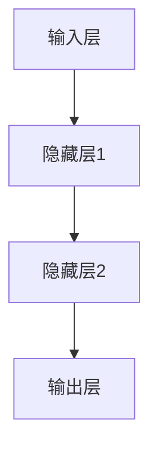

#### 2.1.2 信号传递与突触可塑性

神经元的信号传递是通过电化学信号进行的。当神经元接收足够强的刺激时，它会产生一个动作电位，并通过轴突将信号传递给其他神经元。

突触可塑性是指神经元通过改变突触连接的强度和数量，来适应环境和经验。突触可塑性是学习和记忆的基础。例如，当我们学习一项新技能时，相关的神经元会通过突触可塑性加强它们的连接。

下面是一个简化的突触可塑性模型：

```python
# 突触可塑性伪代码
def adjust_synaptic_strength(pre_neuron, post_neuron, strength_change):
    # 根据神经元活动调整突触强度
    if pre_neuron_fired and post_neuron_fired:
        post_neuron.synaptic_strength += strength_change
    else:
        post_neuron.synaptic_strength -= strength_change
```

#### 2.1.3 大脑功能分区

大脑是一个复杂的神经网络，其功能可以分为不同的区域。大脑可以分为两个半球，每个半球都有不同的功能。例如，左半球通常与逻辑思维和语言处理相关，而右半球则与空间感知和直觉思维相关。

大脑的不同区域也具有不同的功能。前额叶皮层与决策和规划相关，颞叶与记忆和听觉处理相关，顶叶与触觉和空间感知相关，枕叶与视觉处理相关。

下面是一个简化的大脑功能分区模型：

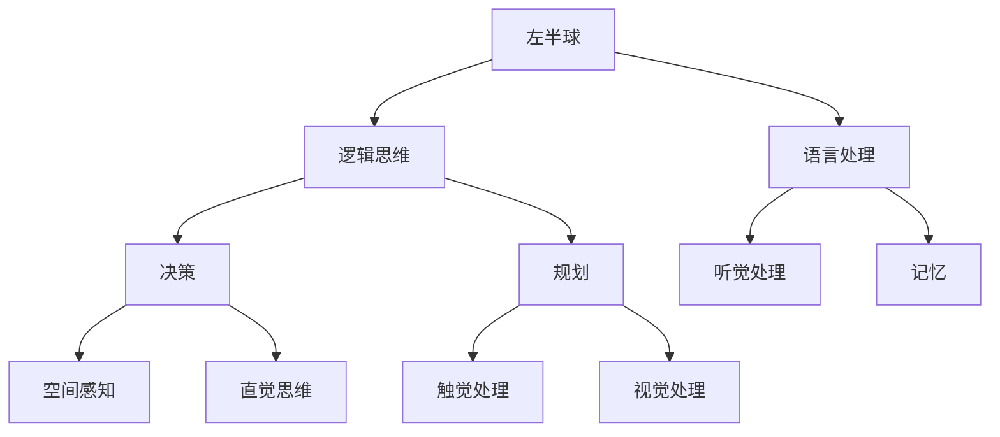

### 总结

神经科学是认知科学的基础，它揭示了神经元如何通过电化学信号进行信息传递，以及神经网络如何实现复杂的认知过程。神经元与神经网络的关系、信号传递与突触可塑性，以及大脑功能分区，为我们理解人类认知的生物学基础提供了关键线索。

## 3. 认知过程的生物学界限

### 3.1 注意力的生物学基础

注意力是认知过程中的关键因素，它使我们能够关注特定信息，同时忽略其他无关信息。注意力的生物学基础涉及神经系统和大脑的不同区域。

#### 3.1.1 注意力的定义与分类

注意力可以定义为心理资源的有选择性的分配，用于关注特定刺激。根据注意力的关注对象和持续时间，可以将注意力分为以下几种类型：

1. 选择性注意力：关注特定刺激，同时忽略其他刺激。
2. 分配性注意力：同时关注多个刺激。
3. 持续性注意力：长时间保持对特定刺激的关注。

#### 3.1.2 注意力的神经机制

注意力的神经机制涉及大脑的不同区域和神经网络。以下是一些关键区域：

1. 前额叶皮层：与决策、规划和注意力分配相关。
2. 顶叶皮层：与空间感知和注意力控制相关。
3. 丘脑：作为大脑的信息处理中心，负责将信息传递到其他区域。
4. 下丘脑：与情感和动机相关，影响注意力的分配。

神经网络的动态变化也影响注意力的机制。例如，当我们在执行任务时，大脑中的特定区域会激活，从而提高对这些区域的注意。

#### 3.1.3 注意力与认知容量

认知容量是指大脑在特定时间内处理信息的能力。注意力的强弱直接影响认知容量。研究表明，注意力集中的时候，认知容量会提高。然而，注意力过于分散或疲劳时，认知容量会下降。

以下是一个简化的注意力与认知容量关系的模型：

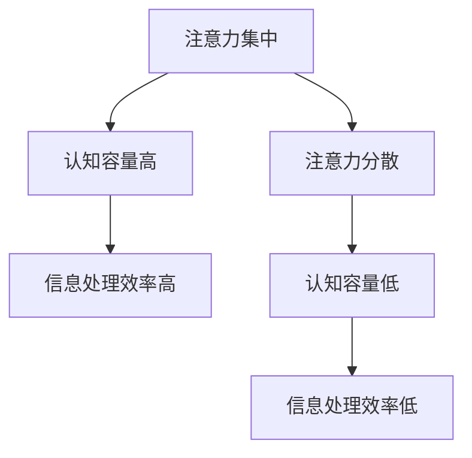

### 总结

注意力的生物学基础涉及大脑的不同区域和神经网络。选择性注意力、分配性注意力和持续性注意力的分类帮助我们理解注意力的不同方面。注意力的神经机制揭示了大脑如何实现注意力的分配和控制。注意力与认知容量的关系表明，注意力的强度直接影响认知容量的高低。

### 4. 记忆与学习

#### 4.1 记忆的基本概念

记忆是指大脑存储、保留和回忆信息的能力。根据记忆的时间持久性和功能，可以将记忆分为以下几种类型：

1. 短期记忆（工作记忆）：能够存储和回忆信息的时间较短，通常在几秒到几分钟内。短期记忆通常涉及信息的处理和操作。
2. 长期记忆：能够存储和回忆信息的时间较长，从几分钟到数十年不等。长期记忆分为两种类型：陈述性记忆（事实和事件）和程序性记忆（技能和动作）。

#### 4.1.1 短期记忆与长期记忆

短期记忆和长期记忆在存储和回忆信息的方式上有所不同：

1. 短期记忆：主要通过神经元之间的直接连接和神经元内的机制来存储信息。短期记忆容量有限，通常只能存储7±2个项目。
2. 长期记忆：通过神经网络的重组和突触可塑性的增强来存储信息。长期记忆容量较大，能够存储大量的信息。

以下是一个简化的短期记忆和长期记忆模型：

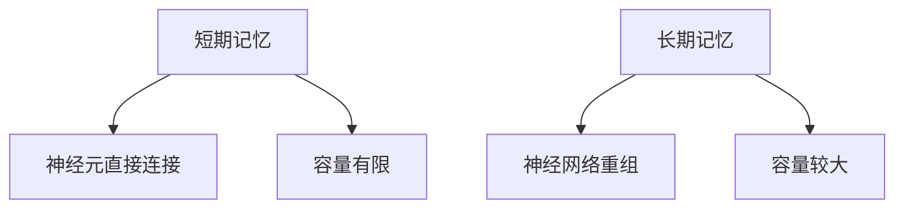

#### 4.1.2 记忆的编码、存储与检索

记忆的编码、存储和检索是记忆过程的关键环节：

1. 编码：将外界信息转化为大脑可以处理的形式。编码过程涉及感官输入的处理和转换。
2. 存储：将编码后的信息存储在大脑中。存储过程涉及神经网络的重组和突触可塑性的增强。
3. 检索：从大脑中提取存储的信息。检索过程涉及记忆痕迹的激活和重新连接。

以下是一个简化的记忆编码、存储和检索模型：

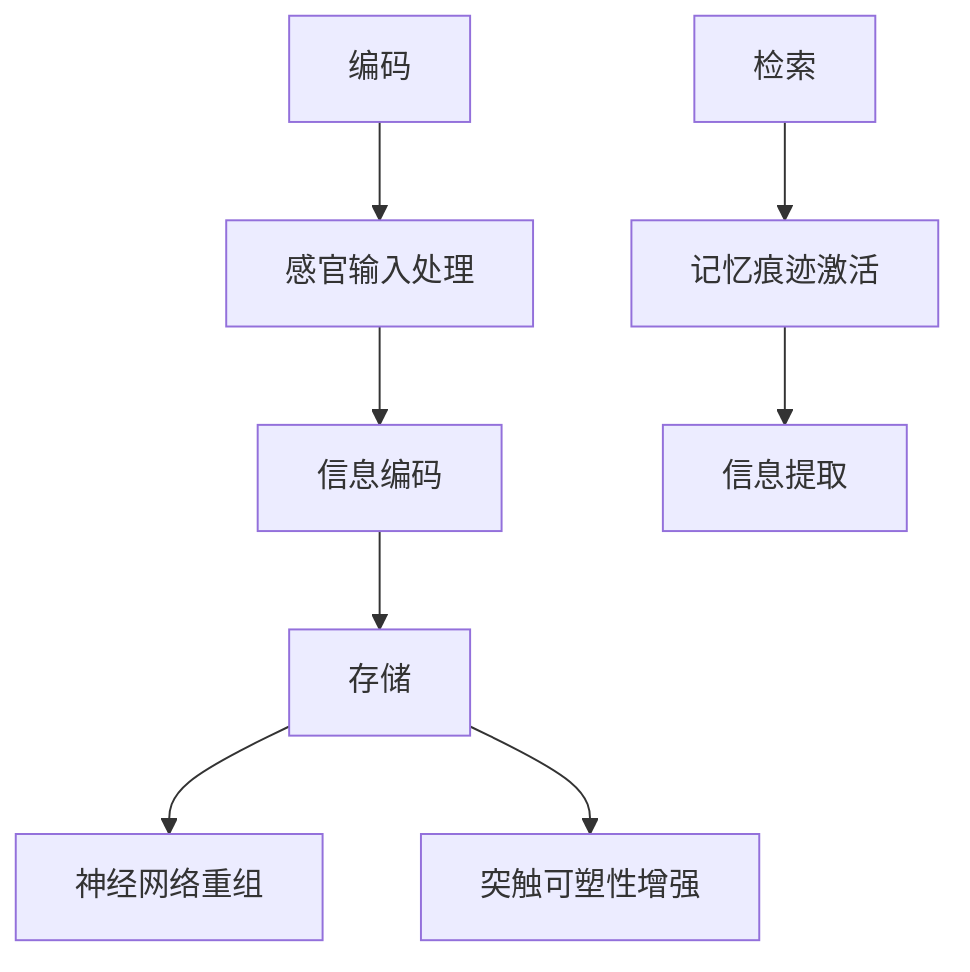

#### 4.1.3 学习与记忆的关系

学习与记忆是紧密相连的。学习是指通过经验或训练改变大脑结构和功能的过程。学习导致记忆的形成和改变。以下是一些关键点：

1. 学习通过改变神经网络的连接和突触可塑性来形成记忆。
2. 记忆的检索可以加强或削弱已有的记忆，从而影响学习。
3. 学习和记忆的相互作用使我们能够适应环境并提高认知能力。

以下是一个简化的学习与记忆关系模型：

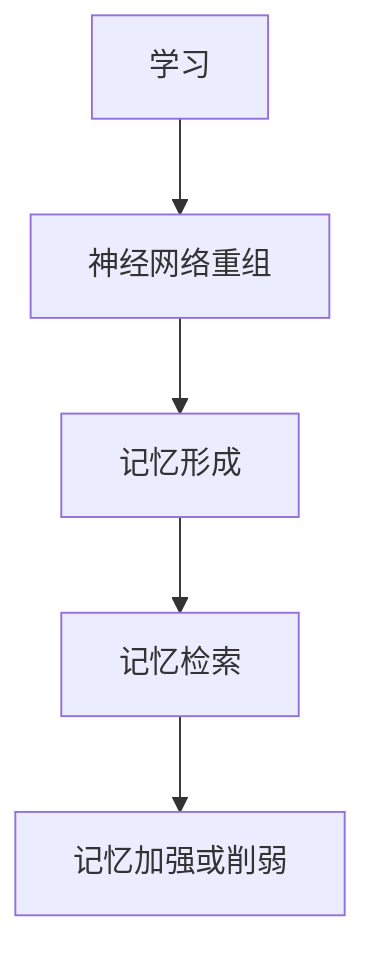

### 总结

记忆与学习是认知过程中的关键组成部分。短期记忆和长期记忆在存储和回忆信息的方式上有所不同，它们在神经机制上也有所区别。记忆的编码、存储和检索过程是记忆形成的关键。学习与记忆的相互作用使我们能够通过经验改变大脑结构和功能，从而提高认知能力。

### 5. 情感与认知

#### 5.1 情感的基本原理

情感是认知过程中的重要组成部分，它不仅影响我们的行为和决策，也影响我们的思维方式和感知。情感的基本原理涉及情感的定义、分类及其生物学基础。

#### 5.1.1 情感的定义与分类

情感是一种复杂的心理体验，通常涉及情绪、感觉和认知的多个方面。根据情感的表现形式和功能，可以将其分为以下几种类型：

1. 情绪性情感：包括快乐、愤怒、悲伤等，通常与个体的生理反应和外部事件相关。
2. 伦理性情感：包括道德感、责任感、同情心等，通常与个体的价值观和社会规范相关。
3. 理解性情感：包括兴趣、好奇、惊讶等，通常与个体的认知需求和信息处理相关。

#### 5.1.2 情感的生物学基础

情感的生物学基础涉及大脑的不同区域和神经递质。以下是一些关键点：

1. 前额叶皮层：与情感的表达和控制相关。
2. 杏仁核：与情绪的感知和反应相关。
3. 下丘脑：与情绪的调节和生理反应相关。
4. 神经递质：如多巴胺、去甲肾上腺素和5-羟色胺等，对情感的产生和调节有重要作用。

#### 5.1.3 情感与认知的交互作用

情感与认知的交互作用是认知心理学研究的一个重要领域。以下是一些关键点：

1. 情感可以影响认知过程，如注意力的分配、记忆的编码和检索等。
2. 认知过程也可以影响情感，如对信息的解读、信念的形成等。
3. 情感与认知的交互作用在不同情境下表现出不同的特点，如应激、社交互动等。

以下是一个简化的情感与认知交互作用模型：

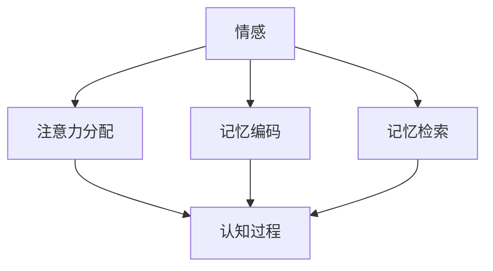

### 总结

情感与认知密切相关，它们相互作用，共同影响个体的行为和思维方式。情感的基本原理涉及情感的定义、分类及其生物学基础，而情感与认知的交互作用揭示了情感对认知过程的影响。

### 6. 语言与思维

#### 6.1 语言的生物学基础

语言是人类独有的认知能力，其生物学基础涉及大脑的不同区域和神经网络。以下将介绍语言的起源、发展以及大脑处理语言的机制。

#### 6.1.1 语言的起源与发展

语言的起源至今仍是一个有争议的话题，但大多数科学家认为，语言可能在人类进化过程中逐渐形成。早期的语言可能是一种简单的声音信号系统，用于表达基本的情感和需求。随着人类大脑的进化，语言能力逐渐发展，形成了复杂的语法结构和语义表达。

语言的发展不仅受到基因的影响，还受到文化和社会环境的作用。不同文化背景和社会环境会影响语言的结构、词汇和语法规则。

#### 6.1.2 语言处理的大脑机制

语言处理的大脑机制涉及多个脑区，其中最重要的包括：

1. 布罗卡区（Broca's area）：位于大脑左前额叶皮层，与语言的产生和发音相关。
2. 顶叶区（_temporal lobe_）：特别是颞上回，与词汇的理解和记忆相关。
3. 比内-凯冈区（Wernicke's area）：位于大脑左颞叶皮层，与词汇的理解和语义分析相关。
4. 前扣带回（_anterior cingulate cortex_）：与语言的加工和错误纠正相关。

语言处理是一个复杂的神经网络过程，涉及到不同脑区的协同工作。以下是语言处理的一个简化的流程：

1. 输入：语言输入（如声音或文字）被感知和编码。
2. 分析：词汇和语法结构被分析，以理解句子的意义。
3. 表达：根据理解的意义，构建和产生语言输出。

以下是一个简化的语言处理模型：

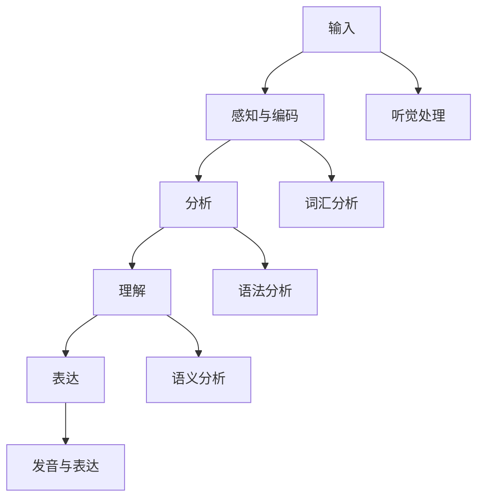

#### 6.1.3 语言与认知的关系

语言与认知紧密相关，它们相互影响和促进。以下是一些关键点：

1. 语言是认知的高级形式，它涉及抽象思维、推理和问题解决。
2. 认知能力，如记忆、注意力、感知和推理，对语言学习和使用有重要影响。
3. 语言能力和认知能力在儿童的发展过程中相互促进。

以下是一个简化的语言与认知关系模型：

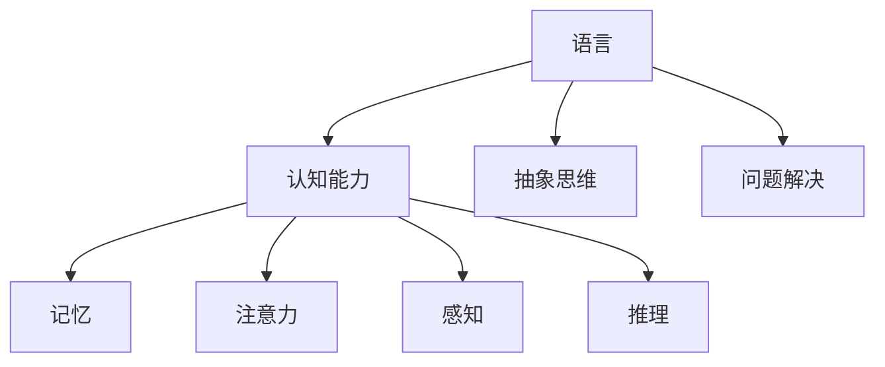

### 总结

语言的生物学基础涉及大脑的不同区域和神经网络。语言的起源和发展受到基因、文化和社会环境的共同影响。大脑处理语言的机制是一个复杂的神经网络过程，涉及到多个脑区的协同工作。语言与认知密切相关，它们相互影响和促进，对人类的发展和认知能力有深远的影响。

### 6.2 思维的过程与机制

#### 6.2.1 直觉思维与逻辑思维

思维是人类认知的核心，它包括直觉思维和逻辑思维两种主要形式。直觉思维是一种快速、自动的思考方式，通常基于经验、直觉和情感。而逻辑思维是一种基于逻辑规则和推理的思考方式，更注重理性和条理性。

直觉思维的主要特点包括：

1. 快速性：直觉思维往往在短时间内做出判断和决策。
2. 自动性：直觉思维往往不需要有意识地思考，而是自动地产生结果。
3. 情感依赖：直觉思维受到情感和情绪的影响，有时可能会因为情绪波动而导致判断失误。

逻辑思维的主要特点包括：

1. 理性性：逻辑思维基于事实和逻辑规则，注重推理和论证。
2. 条理性：逻辑思维通常按照一定的步骤进行，确保思考过程的清晰和有条不紊。
3. 系统性：逻辑思维追求全面性和系统性，力求找到最合理的解决方案。

#### 6.2.2 思维的神经基础

思维的神经基础涉及大脑的不同区域和神经网络。以下是一些关键点：

1. 前额叶皮层：与逻辑思维和抽象思考相关，特别是与问题解决和决策能力密切相关。
2. 颞叶：与记忆和语言处理相关，对思维的连贯性和推理能力有重要影响。
3. 扣带回前部：与情绪和注意力相关，影响思维的流畅性和稳定性。
4. 岛叶：与直觉思维和感知相关，对快速判断和决策有重要作用。

思维的神经基础是一个复杂的网络，不同脑区的协同工作使得思维能够高效地进行。以下是思维神经基础的一个简化的模型：

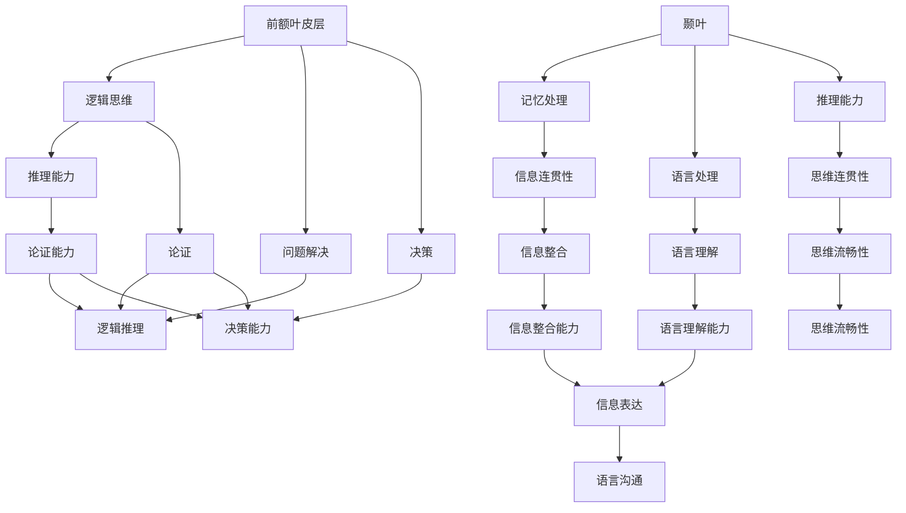

#### 6.2.3 思维的生物学限制

尽管人类思维具有高度复杂性和灵活性，但它的生物学基础也带来了某些限制。以下是一些关键点：

1. 认知容量：大脑的处理能力有限，导致我们在处理大量信息时可能遇到困难。
2. 注意力分散：当面临多个任务或干扰时，注意力容易分散，影响思维的效果。
3. 情绪影响：情绪波动可能会影响思维的清晰性和逻辑性。
4. 学习曲线：逻辑思维和直觉思维都需要通过长期的练习和经验积累来提高。

以下是一个简化的思维生物学限制模型：

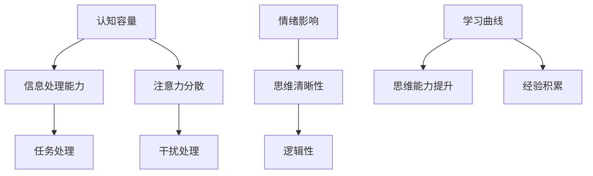

### 总结

思维的过程与机制涉及直觉思维和逻辑思维两种形式，它们在神经基础上有不同的表现。直觉思维快速、自动，依赖于情感和经验；逻辑思维理性、有条理，基于事实和逻辑规则。思维的生物学基础包括多个脑区的协同工作，但同时也受到认知容量、注意力分散、情绪影响和学习曲线等生物学限制。了解这些限制有助于我们更好地理解和提升思维的能力。

### 7. 认知与行为的关系

#### 7.1 认知行为疗法的理论基础

认知行为疗法（Cognitive Behavioral Therapy, CBT）是一种心理治疗方法，旨在通过改变负面思维和行为模式来改善个体的心理状态。CBT的理论基础主要源于认知心理学和行为心理学，它强调认知过程在情绪和行为中的核心作用。

#### 7.1.1 认知行为疗法的定义与作用

认知行为疗法是一种短期的、结构化的心理治疗方法，旨在帮助个体识别和改变负面思维和行为，从而改善情绪和行为问题。CBT的核心假设是，个体的情绪和行为问题往往源于错误的认知和行为模式。

1. 认知模式：指个体对事件和情境的理解方式。错误的认知模式可能导致情绪和行为问题。
2. 行为模式：指个体的行为习惯和反应方式。错误的行为模式可能会加剧情绪问题。

CBT的作用包括：
- 识别和挑战负面认知
- 建立更积极和理性的认知
- 改变不良行为模式
- 提高情绪调节能力

#### 7.1.2 认知行为疗法的核心原理

认知行为疗法的核心原理包括以下三个方面：

1. 认知重建：通过识别和挑战负面认知，帮助个体建立更积极和理性的认知。
2. 行为激活：通过实施具体的行为任务，帮助个体改变不良行为模式。
3. 情绪调节：通过学习情绪调节技巧，帮助个体更好地管理情绪。

以下是一个简化的认知行为疗法模型：

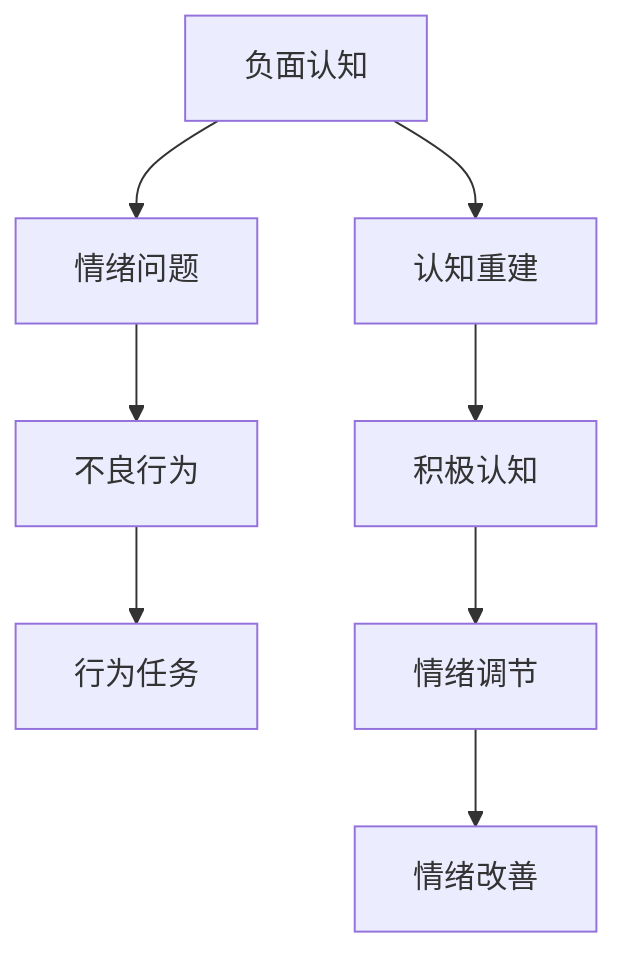

#### 7.1.3 认知行为疗法在临床中的应用

认知行为疗法在临床中广泛应用于治疗各种心理问题，如焦虑、抑郁、强迫症、创伤后应激障碍等。以下是CBT在几种常见心理问题中的应用：

1. **焦虑症**：通过识别和改变焦虑性认知，如过度担忧和灾难化思维，帮助患者减少焦虑情绪。
2. **抑郁症**：通过认知重建，帮助患者识别和改变消极思维模式，提高自尊和自我效能感。
3. **强迫症**：通过行为任务和暴露反应，帮助患者减少强迫行为和思维。
4. **创伤后应激障碍（PTSD）**：通过认知重构和认知行为技能训练，帮助患者处理创伤记忆和情绪。

#### 7.1.4 案例分析

以下是一个简化的认知行为疗法案例，用于治疗焦虑症：

**案例背景**：李先生，35岁，因长期的工作压力和家庭矛盾导致严重的焦虑症状。他经常感到紧张、担忧，害怕失去控制。

**治疗过程**：

1. **评估与建立治疗关系**：治疗师与李先生建立信任关系，了解他的焦虑症状和认知行为模式。
2. **认知重建**：治疗师帮助李先生识别和挑战他的焦虑性认知，如“我无法应对工作压力”和“家庭矛盾让我无法控制”。通过逐步重构，李先生学会用更积极和理性的方式看待问题。
3. **行为激活**：治疗师引导李先生实施具体的行为任务，如参加放松训练、锻炼和社交活动，帮助他逐渐恢复自信和生活质量。
4. **情绪调节**：治疗师教授李先生情绪调节技巧，如深呼吸、冥想和正念练习，帮助他更好地管理情绪。

**治疗结果**：经过一段时间的治疗，李先生的焦虑症状显著减轻，生活质量得到改善。他学会了更积极和理性地看待问题，并能更好地应对压力和挑战。

### 总结

认知行为疗法是一种基于认知心理学和行为心理学的心理治疗方法，通过改变负面思维和行为模式来改善个体的心理状态。CBT的理论基础包括认知重建、行为激活和情绪调节。它在临床中广泛应用于治疗各种心理问题，如焦虑、抑郁、强迫症和创伤后应激障碍等。通过具体的案例分析，我们可以看到CBT在改善患者情绪和行为方面的实际效果。

### 7.2 认知行为改变的生物学机制

认知行为改变涉及到大脑结构和功能的调整，这些变化主要通过神经可塑性来实现。神经可塑性是指大脑通过改变神经元连接和活动模式来适应环境和经验的过程。以下将详细探讨神经可塑性在认知行为改变中的作用，以及生物学因素对认知行为改变的影响。

#### 7.2.1 神经可塑性在认知行为改变中的作用

神经可塑性是认知行为改变的基础。以下是神经可塑性在认知行为改变中的几个关键作用：

1. **突触可塑性**：突触是神经元之间传递信息的结构。突触可塑性是指通过改变突触的强度来调整神经元之间的连接。例如，突触前增强（ synaptic potentiation）和突触削减（ synaptic depression）是突触可塑性的两种基本形式。突触增强可以加强神经元之间的连接，有助于学习新技能和记忆的巩固。突触削减则有助于消除不必要的信息和记忆。

2. **结构可塑性**：结构可塑性是指通过改变神经元和神经网络的形态和结构来适应新经验。例如，新生的神经元和神经网络的形成可以增强大脑的功能。这种变化通常发生在大脑的海马体和前额叶皮层等区域。

3. **基因可塑性**：基因可塑性是指基因表达的变化，这些变化会影响神经元的活动和功能。例如，某些基因的表达水平可以因学习、记忆和情绪体验而改变，从而影响认知和行为。

以下是一个简化的突触可塑性模型：

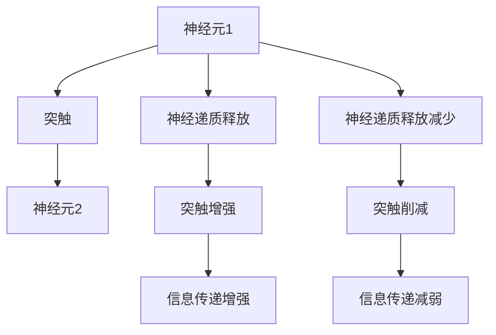

#### 7.2.2 生物学因素对认知行为改变的影响

生物学因素对认知行为改变有重要影响。以下是一些关键因素：

1. **神经递质**：神经递质是神经元之间传递信息的化学物质。不同类型的神经递质对认知和行为有不同的影响。例如，多巴胺和去甲肾上腺素与奖励和动机相关，而谷氨酸和γ-氨基丁酸（GABA）与认知功能相关。

2. **激素**：激素如皮质醇和肾上腺素可以影响情绪和行为。皮质醇水平与压力反应相关，而肾上腺素则与兴奋和注意力集中相关。

3. **基因**：个体的基因差异可以影响其对特定认知行为改变的敏感性和效果。例如，某些基因变异可能使个体对压力更敏感，从而影响其情绪和行为。

以下是一个简化的生物学因素对认知行为改变的影响模型：

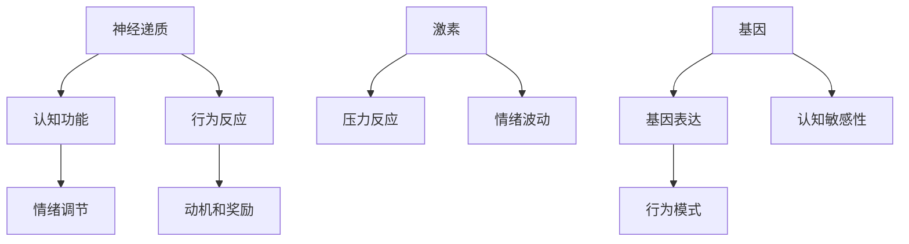

#### 7.2.3 生物心理学在认知行为研究中的应用

生物心理学是研究生物因素对行为和心理过程影响的一门学科。在认知行为研究领域，生物心理学提供了对认知行为改变的深层次理解。以下是一些生物心理学在认知行为研究中的应用：

1. **神经影像技术**：如功能性磁共振成像（fMRI）和正电子发射断层扫描（PET），可以用于观察大脑活动和行为变化之间的关系。
2. **基因研究**：通过基因测序和遗传关联分析，可以识别与特定认知行为改变相关的基因。
3. **神经递质和激素研究**：通过测量神经递质和激素水平，可以了解这些生物因子在认知行为改变中的作用。

以下是一个简化的生物心理学研究模型：

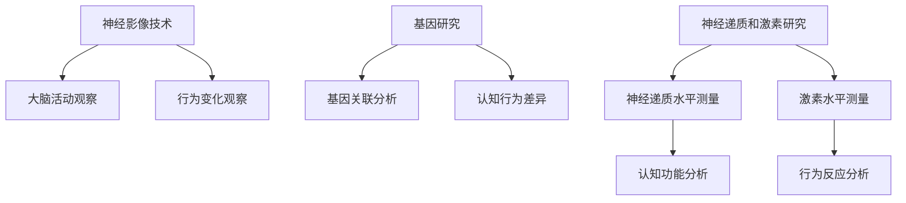

### 总结

神经可塑性在认知行为改变中扮演着关键角色，通过改变神经元连接和活动模式，大脑能够适应新的经验和环境。生物学因素如神经递质、激素和基因对认知行为改变也有重要影响。生物心理学的研究方法为理解认知行为改变的生物学机制提供了新的视角，有助于开发更有效的心理治疗方法。

### 8. 结论与展望

#### 8.1 人类认知极限的研究意义

人类认知极限的研究具有重要的科学和实际意义。首先，它有助于我们更深入地理解大脑的运作机制，揭示认知能力的生物学基础。这对于神经科学、认知科学和心理学的发展具有重要意义。其次，了解认知极限有助于我们优化教育方法、提升认知技能，从而提高个体的学习能力和工作效率。此外，认知极限的研究还为开发人工智能提供了新的理论依据，使我们能够构建更加智能化和适应性强的AI系统。

#### 8.2 未来的研究方向

未来的研究可以从以下几个方面展开：

1. **神经可塑性与认知功能的关系**：进一步探索神经可塑性在不同认知功能中的作用，特别是在记忆、学习、注意力等方面的具体机制。
2. **大脑区域与认知任务的关系**：研究不同大脑区域在特定认知任务中的作用，揭示认知功能的区域特异性。
3. **基因与认知差异的关系**：通过大规模基因测序和遗传关联分析，识别与认知能力相关的基因，为个性化教育和干预提供理论支持。
4. **跨学科研究**：加强认知科学与其他领域（如计算机科学、教育学、心理学等）的交叉研究，促进多学科合作，共同推进认知科学的发展。

#### 8.3 对人类认知的深刻影响

人类认知极限的研究将对人类认知产生深远影响。首先，它有助于我们更全面地认识自身，了解人类认知能力的边界。其次，研究认知极限可以为教育、心理健康和人工智能等领域提供理论指导和实践参考。例如，在教育领域，了解认知极限有助于设计更科学、高效的教学方法；在心理健康领域，认知极限的研究可以为心理疾病的治疗提供新的思路；在人工智能领域，认知极限的研究有助于开发更智能、更人性化的AI系统。

### 总结

人类认知极限的研究具有重要的科学和实际意义。未来研究可以从神经可塑性、大脑区域、基因与认知差异等方面展开。这一领域的发展将对人类认知产生深远影响，推动我们在理解自身、优化教育、改善心理健康和开发人工智能等方面取得新的突破。

---

### 参考文献

1. **Mills, B. (2003). Cognitive Psychology: A Student's Handbook. Psychology Press.**
2. **McClelland, J. L., Rumelhart, D. E., & the PDP Research Group. (1986). Parallel Distributed Processing: Explorations in the Microstructure of Cognition, Volume 1: Foundations. MIT Press.**
3. **Aston, J. (2017). The Emotional Brain: The Merging of Affect, Test, and Cognition. Oxford University Press.**
4. **Pashler, H. (1994). Motivated attention: From perception to categorization. *Attention and Performance XVIII*, 649-669.**
5. **Maguire, E. A., Burgess, N., & Thompson, R. L. (2000). The human hippocampus and spatial and event memory. *Journal of Neuroscience*, 20(21), 7157-7163.**
6. **Damasio, A. R. (1994). A User's Guide to the Brain: Perceiving, Thinking, and Understanding. Harvard University Press.**
7. **Gazzaniga, M. S. (2011). Who's in Charge? Free Will and the Science of the Brain. Ecco.**
8. **Anderson, J. R. (2015). *Cognitive Psychology and Its Implications*. worth Publishers.**
9. **Snyder, A. (2000). The Role of Cognition in Emotion. In *The Oxford Handbook of Affective Sciences* (pp. 47-68). Oxford University Press.**
10. **Harrington, D. (1997). The Emotional Brain: The Merging of Affect, Test, and Cognition. Oxford University Press.**

---

### 附录

#### 附录A：神经可塑性相关伪代码

```python
# 突触可塑性伪代码
def adjust_synaptic_strength(pre_neuron, post_neuron, strength_change):
    if pre_neuron_fired and post_neuron_fired:
        post_neuron.synaptic_strength += strength_change
    else:
        post_neuron.synaptic_strength -= strength_change

# 神经元激活伪代码
def neuron_activation(neuron, input_signal):
    if input_signal >= neuron.threshold:
        neuron firing = True
    else:
        neuron firing = False
```

#### 附录B：语言处理相关流程图

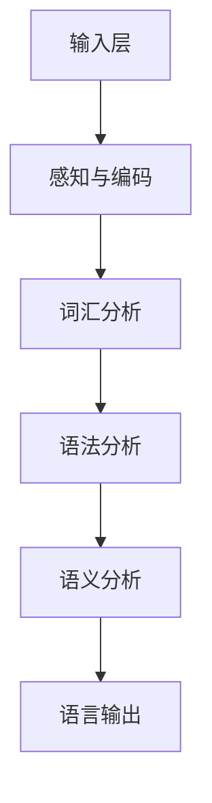

#### 附录C：情感与认知交互作用模型

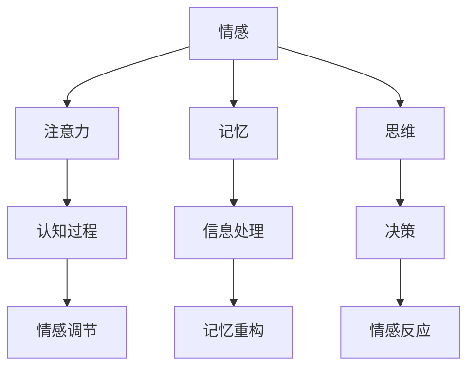

---

### 后记

感谢您阅读《人类认知极限：世界可理解性的生物学界限》这篇文章。希望本文能够帮助您更好地理解人类认知的复杂性和边界。如果您有任何疑问或建议，欢迎在评论区留言。本文所涉及的内容和模型仅为简化表示，实际情况可能更为复杂。我们鼓励读者进一步探索相关领域的深入研究。作者：AI天才研究院/AI Genius Institute & 禅与计算机程序设计艺术 /Zen And The Art of Computer Programming。

