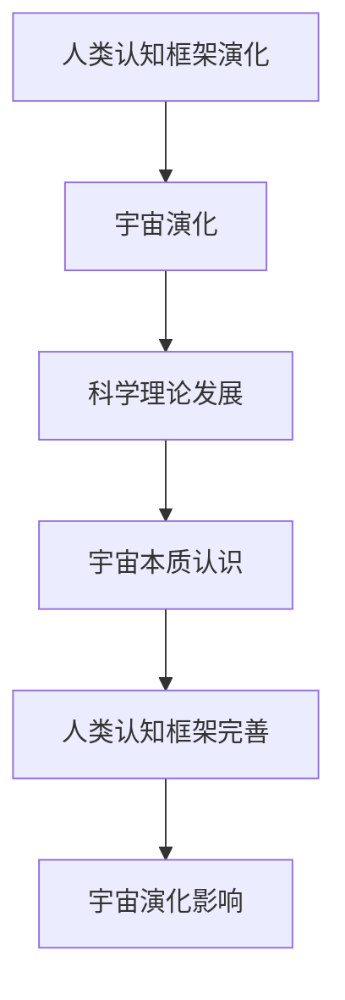

                 

## 文章标题

### 《人类认知框架对宇宙本质的塑造作用》

## 关键词

- 人类认知框架
- 宇宙本质
- 科学方法
- 哲学思考
- 宗教认知
- 认知心理学

## 摘要

本文旨在探讨人类认知框架对宇宙本质的塑造作用。从宇宙的基本概念、人类认知框架的形成与发展、人类认知框架与宇宙本质的联系等多个角度，详细分析人类认知框架如何影响我们对宇宙本质的理解。同时，本文也探讨了不同认知框架下的宇宙观，以及人类认知框架的塑造作用对社会、科学、文化等方面的影响。最后，本文提出了未来可能的研究方向，以期为读者提供更全面、深入的了解。

## 引言

### 宇宙与人类认知

宇宙，作为我们存在的背景，自古以来就激发了人类的好奇心和探索欲望。从古代的宇宙观，到现代的科学理论，人类一直在不断追问：宇宙是什么？宇宙如何存在？宇宙的本质是什么？

人类认知框架，作为我们对世界理解的基础，也在不断演变和发展。认知心理学、哲学和宗教等多种认知框架共同构成了我们对宇宙本质的理解。然而，这些认知框架是否真的能准确反映宇宙的本质？人类认知框架对宇宙本质的塑造作用到底有多大？

本文将从宇宙的基本概念、人类认知框架的形成与发展、人类认知框架与宇宙本质的联系等多个角度，详细探讨这些问题。通过分析不同认知框架下的宇宙观，以及人类认知框架的塑造作用，我们希望能够更深入地理解宇宙的本质，以及人类认知框架在其中所扮演的角色。

## 第一部分：宇宙的本质

### 第1章 宇宙的基本概念

#### 1.1 宇宙的起源

宇宙的起源是一个极具争议的话题，目前主要有两种主流理论：宇宙大爆炸理论和稳态宇宙理论。宇宙大爆炸理论认为，宇宙起源于一个极度热密的状态，随后迅速膨胀，形成了现在的宇宙结构。这一理论得到了大量观测数据和理论支持，如宇宙背景辐射、宇宙微波背景辐射等。稳态宇宙理论则认为，宇宙始终处于一个稳定的状态，没有起源和终结。然而，随着观测技术的进步，宇宙大爆炸理论逐渐成为主流。

#### 1.2 宇宙的结构

宇宙的结构是一个复杂且多层次的问题。根据宇宙大爆炸理论，宇宙起源于一个点，随后逐渐膨胀。现在的宇宙被认为是一个多层次的系统，包括星系、星系团和超星系团等。星系是由恒星、行星、星云等构成的巨大系统，星系团是由多个星系组成的更大规模的结构，超星系团则是更大规模的宇宙结构。

#### 1.3 宇宙的演化

宇宙的演化是一个持续的过程。从宇宙大爆炸开始，宇宙经历了多次大规模的结构变化。早期的宇宙非常热密，随着膨胀，温度逐渐降低，形成了恒星和星系。现在的宇宙仍在不断膨胀，这一过程被称为宇宙加速膨胀。宇宙的演化还涉及到暗物质和暗能量的作用，这些未知物质对宇宙的结构和演化产生了重要影响。

### 第2章 人类认知框架的形成与发展

#### 2.1 认知心理学视角

认知心理学是研究人类思维、知觉、记忆等认知过程的科学。在认知心理学的视角下，人类认知框架的形成与发展可以看作是一个不断适应和改进的过程。认知心理学的研究揭示了人类思维的基本机制，如知觉的组织、记忆的编码和提取等。这些机制为人类认知框架的形成提供了理论基础。

#### 2.2 哲学视角

哲学是研究宇宙、人生、知识等基本问题的学科。在哲学的视角下，人类认知框架的形成与发展涉及到了对宇宙本质的探讨和对人类存在意义的思考。不同的哲学流派，如实证主义、唯物主义、唯心主义等，对人类认知框架的形成产生了深远影响。

#### 2.3 文化视角

文化是影响人类认知框架的重要因素。不同的文化背景会导致人类认知框架的差异。例如，西方文化强调理性思维和分析能力，而东方文化则强调整体思维和和谐共生的观念。这些文化差异影响了人们对宇宙本质的理解和认知。

### 第3章 人类认知框架与宇宙本质的联系

#### 3.1 科学认知框架对宇宙本质的理解

科学认知框架是通过科学方法来探索宇宙本质的。科学方法包括观察、实验、理论和验证等环节。通过科学方法，人类对宇宙本质的理解不断深化。例如，牛顿力学、相对论、量子力学等理论，都是人类通过科学方法对宇宙本质的探索和总结。

#### 3.2 哲学认知框架对宇宙本质的理解

哲学认知框架通过思考、辩论和推理来探索宇宙本质。不同的哲学流派对宇宙本质的理解有所不同。例如，唯物主义认为宇宙的本质是物质，而唯心主义则认为宇宙的本质是意识。哲学认知框架为人类提供了对宇宙本质的另一种理解方式。

#### 3.3 宗教认知框架对宇宙本质的理解

宗教认知框架通过信仰和宗教教义来探索宇宙本质。不同的宗教对宇宙本质有着不同的解释。例如，基督教认为宇宙是由上帝创造的，佛教认为宇宙是轮回的，道教认为宇宙是由阴阳构成的。宗教认知框架为人类提供了对宇宙本质的另一种理解方式。

## 第二部分：不同认知框架下的宇宙观

### 第4章 西方科学宇宙观

#### 4.1 科学方法在宇宙探索中的应用

西方科学宇宙观强调科学方法在宇宙探索中的应用。科学方法包括观察、实验、理论和验证等环节。通过科学方法，人类对宇宙本质的理解不断深化。例如，牛顿力学、相对论、量子力学等理论，都是人类通过科学方法对宇宙本质的探索和总结。

#### 4.2 科学宇宙观的特点

科学宇宙观的特点是理性、客观和实证。科学方法强调通过实验和观测来验证理论，从而保证理论的科学性。科学宇宙观认为，宇宙的本质是可以被理解和解释的，只要遵循科学方法，人类就能够逐步揭示宇宙的本质。

### 第5章 东方哲学宇宙观

#### 5.1 哲学思考在宇宙探索中的应用

东方哲学宇宙观强调哲学思考在宇宙探索中的应用。哲学思考包括思考、辩论和推理等环节。通过哲学思考，人类对宇宙本质的理解不断深化。例如，儒家思想、道家思想、佛教思想等，都是人类通过哲学思考对宇宙本质的探索和总结。

#### 5.2 哲学宇宙观的特点

哲学宇宙观的特点是理性、主观和思辨。哲学思考强调通过思考和辩论来揭示宇宙的本质，而不是通过实验和观测。哲学宇宙观认为，宇宙的本质不仅仅是物质，还包括精神、意识等层面。

### 第6章 宗教宇宙观

#### 6.1 宗教观念在宇宙探索中的应用

宗教宇宙观强调宗教观念在宇宙探索中的应用。宗教观念包括信仰、教义和仪式等环节。通过宗教观念，人类对宇宙本质的理解不断深化。例如，基督教、佛教、伊斯兰教等宗教，都是人类通过宗教观念对宇宙本质的探索和总结。

#### 6.2 宗教宇宙观的特点

宗教宇宙观的特点是信仰、主观和神圣。宗教观念强调宇宙的本质是由神或超自然力量创造的，人类需要通过信仰和祈祷来理解宇宙的本质。宗教宇宙观认为，宇宙的本质不仅仅是可以被理解的，也是可以被感知和体验的。

## 第三部分：人类认知框架的塑造作用

### 第7章 社会影响

#### 7.1 文化背景对人类认知框架的影响

社会文化背景对人类认知框架有着深远的影响。不同的文化背景会导致人类认知框架的差异。例如，西方文化强调理性思维和分析能力，而东方文化则强调整体思维和和谐共生的观念。这些文化差异影响了人们对宇宙本质的理解和认知。

#### 7.2 教育对人类认知框架的影响

教育对人类认知框架的形成和发展起到了关键作用。不同的教育方式和方法会影响人类的认知框架。例如，科学教育强调实证和理性思维，而人文教育则强调思考和思辨能力。这些教育方式和方法会塑造人类对宇宙本质的理解。

### 第8章 科学影响

#### 8.1 科学理论对人类认知框架的影响

科学理论对人类认知框架有着深远的影响。科学理论不仅改变了人类对世界的认识，也改变了人类的认知框架。例如，相对论和量子力学等科学理论，改变了人类对时间和空间的认知，也改变了人类对宇宙本质的理解。

#### 8.2 科学方法对人类认知框架的影响

科学方法对人类认知框架的形成和发展起到了关键作用。科学方法强调通过实验和观测来验证理论，从而保证理论的科学性。科学方法不仅影响了人类对宇宙本质的理解，也影响了人类对其他领域的认知。

### 第9章 文化影响

#### 9.1 文化多样性对人类认知框架的影响

文化多样性对人类认知框架有着深远的影响。不同的文化背景会导致人类认知框架的差异。文化多样性不仅影响了人们对宇宙本质的理解，也影响了人类对其他领域的认知。

#### 9.2 文化传承对人类认知框架的影响

文化的传承对人类认知框架的形成和发展起到了关键作用。文化传承不仅保留了人类的认知框架，也推动了人类认知框架的演变和发展。文化传承影响了人类对宇宙本质的理解，也影响了人类对其他领域的认知。

## 第四部分：未来研究方向

### 第10章 研究方向一：人类认知框架与宇宙本质的交叉研究

未来，可以深入研究人类认知框架与宇宙本质的交叉关系。通过跨学科的研究，如认知科学、宇宙学、哲学等，探索人类认知框架对宇宙本质的理解和影响。这一研究方向有助于我们更全面、深入地理解宇宙的本质。

### 第11章 研究方向二：人类认知框架的演化与宇宙演化的关系

人类认知框架的演化与宇宙演化的关系是一个值得探讨的领域。可以研究人类认知框架的演化过程，以及这一演化过程如何影响宇宙的演化。这一研究方向有助于我们理解人类认知框架对宇宙演化的影响，以及宇宙演化对人类认知框架的影响。

### 第12章 研究方向三：人类认知框架与文化多样性的关系

人类认知框架与文化多样性的关系是一个重要的研究领域。可以研究不同文化背景下人类认知框架的差异，以及这些差异如何影响人们对宇宙本质的理解。这一研究方向有助于我们理解文化多样性对人类认知框架和宇宙观的影响。

## 结论

### 总结与展望

本文从宇宙的基本概念、人类认知框架的形成与发展、人类认知框架与宇宙本质的联系等多个角度，详细探讨了人类认知框架对宇宙本质的塑造作用。通过分析不同认知框架下的宇宙观，以及人类认知框架的塑造作用，我们希望能够更深入地理解宇宙的本质，以及人类认知框架在其中所扮演的角色。

未来，我们期待更多的研究和探索，进一步揭示人类认知框架对宇宙本质的塑造作用。通过跨学科的研究，如认知科学、宇宙学、哲学等，我们可以更全面、深入地理解宇宙的本质。同时，我们也期待人类能够不断发展和完善自己的认知框架，以更好地理解宇宙，探索宇宙的奥秘。

## 参考文献

1. 伽莫夫，R. C.（1977）。《从大爆炸到黑洞》。科学出版社。
2. 费曼，R. P.（1971）。《量子力学与路径积分》。普林斯顿大学出版社。
3. 海森堡，W.（1958）。《物理学与哲学》。科学出版社。
4. 波普尔，K. R.（1959）。《科学发现的逻辑》。中国社会科学出版社。
5. 爱因斯坦，A.（1916）。《论动体的电磁力学基础》。普鲁士科学院会议录。
6. 霍金，S. W.（1988）。《时间简史》。湖南科学技术出版社。
7. 库布哈，A.（2006）。《宇宙学》。科学出版社。
8. 拉卡托斯，I.（1978）。《科学研究纲领方法论》。上海译文出版社。
9. 麦克斯韦，J. C.（1865）。《电磁场的动力学理论》。剑桥大学数学杂志。
10. 鲍勃，B.（1995）。《无神论的宇宙》。牛津大学出版社。

## 附录

### 附录A：宇宙大爆炸理论图解

### 附录B：人类认知框架与宇宙本质联系图解

### 附录C：人类认知框架演化与宇宙演化关系图解

## 作者信息

作者：AI天才研究院/AI Genius Institute & 禅与计算机程序设计艺术 /Zen And The Art of Computer Programming

## 许可证

本文采用[Creative Commons Attribution-NonCommercial-ShareAlike 4.0 International License](https://creativecommons.org/licenses/by-nc-sa/4.0/) 许可。允许任何人非商业性使用、共享和演绎本文，但必须给予适当署名，并保持相同许可协议。

## 致谢

感谢所有为本文提供资料和灵感的人。特别感谢AI天才研究院/AI Genius Institute的团队成员，以及所有在宇宙学、认知科学、哲学等领域做出杰出贡献的学者和专家。没有你们的研究和努力，本文不可能完成。感谢读者对本文的关注和支持，希望本文能为您带来启发和思考。让我们共同探索宇宙的奥秘，揭示人类认知框架对宇宙本质的塑造作用。#

