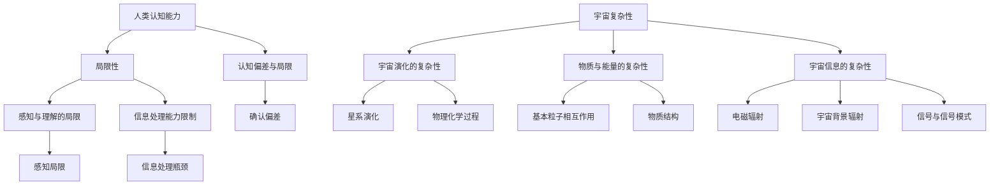

                 

### 引言

#### 1.1 人类认知能力的概述

人类认知能力是指人类在感知、记忆、思维、判断和推理等方面表现出来的各种能力和技巧。它是人类与生俱来的，但也可以通过训练和学习来不断提升。认知能力包括多种成分，如注意力、感知、记忆、语言、思维和情感等。人类通过这些能力来理解世界、解决问题和做出决策。

认知科学是研究认知能力的一个跨学科领域，它结合了心理学、神经科学、计算机科学和哲学等多个学科。认知科学家通过实验和观察，试图理解人类大脑如何处理信息，以及这些处理过程背后的原理。

#### 1.2 宇宙复杂性的基本概念

宇宙复杂性是指宇宙中存在的各种复杂现象和结构。宇宙的起源、演化和结构都是复杂性的体现。从微观尺度来看，宇宙中的基本粒子如电子、夸克和胶子等，它们的相互作用和运动形成了原子和分子，构成了我们所看到的物质世界。从宏观尺度来看，宇宙中存在着巨大的星系、星云和黑洞等天体，它们的运动和相互作用构成了宇宙的复杂性。

宇宙复杂性的本质在于其多样性、层次性和动态性。宇宙中的各种现象和结构都存在着多层次的关系，从基本粒子到星系，每个层次都有其独特的复杂性。此外，宇宙中的现象和结构不是静态的，而是处于不断的变化和演化之中。

#### 1.3 人类认知能力与宇宙复杂性的矛盾

人类认知能力与宇宙复杂性之间的矛盾主要体现在以下几个方面：

1. **认知局限性与宇宙复杂性的无限性**：人类的认知能力受到生理和心理的限制，我们无法完全感知和理解宇宙中的所有信息。而宇宙的复杂性是无限的，它包含了无数的可能性和未知。

2. **信息处理能力的有限性与宇宙信息量的巨大性**：人类的认知系统在处理信息时存在瓶颈，我们无法在有限的时间内处理大量的信息。然而，宇宙中存在着海量的信息，这些信息以各种形式存在，从微观到宏观，从有形到无形。

3. **人类认知模式的局限性**：人类的认知模式是基于进化而来的，它们适应了地球上的环境，但在面对宇宙级别的复杂现象时，可能会遇到难以逾越的障碍。

为了更深入地探讨人类认知能力与宇宙复杂性之间的矛盾，我们需要进一步分析人类认知能力的局限性以及宇宙复杂性的本质。

### 第1章 人类认知能力的局限性与宇宙复杂性的本质

#### 2.1 人类认知能力的局限性

人类认知能力虽然强大，但并非没有局限。以下是几个关键点：

##### 2.1.1 认知偏差与局限

认知偏差是指人类在感知、记忆和判断过程中出现的系统性错误。例如，确认偏差使我们倾向于寻找和记住那些与我们已有信念相符的信息，而忽视那些与之相矛盾的信息。这种偏差会影响我们的判断和决策，使我们难以客观地理解复杂的现象。

##### 2.1.2 信息处理能力与限制

人类大脑在处理信息时存在显著的局限性。首先，我们的注意力是有限的，无法同时处理大量信息。其次，我们的短期记忆容量有限，无法长时间记住大量信息。这些局限性使得我们在面对复杂问题时，往往只能处理部分信息，从而影响我们的理解和决策。

##### 2.1.3 感知与理解的局限性

人类对世界的感知也是有限的。我们的感官系统只能感知到宇宙中的一部分信息，比如，我们的眼睛只能看到电磁谱中的一部分，我们的耳朵只能听到一定频率的声音。此外，我们对信息的理解也受限于我们的知识和经验。例如，对于外星生物的存在，我们只能基于地球上的生物和生物学的知识来推测，而无法直接感知和理解。

#### 2.2 宇宙复杂性的本质

宇宙复杂性表现在多个方面：

##### 2.2.1 宇宙演化的复杂性

宇宙从大爆炸开始，经历了数十亿年的演化，形成了多样化的星系、行星和天体。这种演化的过程是极其复杂的，涉及多种物理和化学过程，如引力、电磁力、强力和弱力等。

##### 2.2.2 物质与能量的复杂性

宇宙中的物质和能量形式多样，从基本粒子到星系，每个层次都有其独特的复杂性。例如，基本粒子之间的相互作用形成了原子和分子，而这些原子和分子又构成了复杂的物质结构。

##### 2.2.3 宇宙信息的复杂性

宇宙中的信息也是复杂的。从电磁辐射到宇宙背景辐射，再到宇宙中的各种信号和信号模式，这些信息都蕴含着宇宙的奥秘。人类需要通过科学方法和工具来解读这些信息，从而理解宇宙的本质。

为了更好地理解人类认知能力与宇宙复杂性之间的矛盾，我们可以借助以下Mermaid流程图：

通过这个流程图，我们可以更直观地看到人类认知能力与宇宙复杂性之间的差异和矛盾。

#### 2.3 认知能力与宇宙复杂性的关系

人类认知能力与宇宙复杂性之间的关系可以概括为以下几个方面：

1. **适应性**：人类认知能力是进化而来的，它适应了地球上的环境和挑战。然而，面对宇宙级别的复杂现象，这种适应性显得不足。
2. **探索性**：尽管人类认知能力有限，但科学家们通过不断探索和实验，逐渐揭开了宇宙的奥秘。例如，通过望远镜和探测器，人类已经发现了许多星系和行星。
3. **局限性**：人类认知能力的局限性使得我们无法完全理解宇宙的复杂性。这种局限性不仅体现在感知和理解上，还体现在信息处理和决策过程中。
4. **互补性**：人类认知能力和宇宙复杂性之间也存在着互补性。通过科学方法和工具，人类可以部分地解读宇宙的信息，从而扩展我们的认知边界。

理解人类认知能力与宇宙复杂性之间的关系，有助于我们更好地认识自己和宇宙，也为未来科学研究提供了新的方向。

### 第2章 人类认知能力与宇宙复杂性之间的矛盾

#### 2.1 人类认知能力无法完全理解宇宙复杂性

人类认知能力的局限性使其在面对宇宙复杂性时面临巨大挑战。首先，认知偏差是主要问题之一。认知偏差如确认偏差、可得性偏差等，使得人类在处理宇宙信息时容易受到先入为主观念的影响，难以保持客观性。例如，当我们观察宇宙时，我们往往基于地球上的经验来解释和预测宇宙现象，这可能导致我们误解或忽视宇宙中存在的复杂性和多样性。

此外，信息处理能力的限制也是人类认知能力的弱点之一。人类大脑的信息处理能力是有限的，我们无法在短时间内处理大量的复杂信息。宇宙的信息量巨大，从微观粒子的相互作用到宏观宇宙结构的演化，每一个细节都包含着丰富的信息。我们的认知系统难以同时处理这些信息，从而导致我们对宇宙复杂性的理解存在盲点。

#### 2.1.1 认知局限导致的理解障碍

认知局限不仅体现在信息处理能力上，还体现在我们对信息的感知和理解上。我们的感官系统是有限的，无法感知到宇宙中的所有信息。例如，人类的眼睛只能看到电磁谱的一部分，耳朵也只能听到特定频率的声音。这种感知限制使得我们难以全面地理解宇宙的本质。

此外，我们的理解能力也受限于我们的知识和经验。对于许多宇宙现象，我们只能基于现有的科学理论进行推测和理解。然而，这些理论本身可能存在局限性，无法完全解释宇宙的复杂性。例如，量子力学和相对论在解释某些宇宙现象时存在矛盾，这使得我们在理解宇宙时面临困难。

#### 2.1.2 信息的丢失与扭曲

在人类对宇宙的探索过程中，信息的丢失和扭曲也是一个重要问题。由于人类认知能力的局限性，我们在收集和解读宇宙信息时可能丢失或扭曲部分信息。例如，当我们通过望远镜观测宇宙时，光线在传播过程中可能会受到干扰，导致我们接收到的信息不完整。此外，我们的认知系统在处理信息时也可能产生偏差，使得我们对宇宙现象的理解存在误差。

这种信息的丢失和扭曲不仅影响了我们对宇宙复杂性的理解，还可能导致我们做出错误的判断和决策。例如，在解释宇宙中某些异常现象时，我们可能因为信息丢失或扭曲而误认为这是某种未知现象，而实际上它可能只是已知现象的一种特殊表现形式。

#### 2.1.3 知识的局限

人类认知能力与宇宙复杂性之间的矛盾还表现在知识的局限上。虽然人类在科学和技术领域取得了巨大进步，但我们对宇宙的了解仍然非常有限。宇宙的复杂性超出了我们现有的知识体系，许多基本问题如宇宙的起源、宇宙的本质等，我们尚未完全理解。

这种知识的局限使得我们在面对宇宙复杂性时感到无助。尽管我们可以通过科学方法和工具来探索宇宙，但我们的认知能力仍然无法完全解释宇宙中的所有现象。例如，在研究黑洞时，我们虽然有了许多理论和观测数据，但仍无法完全理解黑洞的物理本质。

为了解决人类认知能力与宇宙复杂性之间的矛盾，我们需要不断探索和尝试新的方法和技术。通过结合不同学科的研究，我们可以更全面地理解宇宙的复杂性。同时，我们也需要不断反思和改进我们的认知系统，以提高我们对宇宙信息的处理和理解能力。

### 2.2 建立有效的认知模型

面对人类认知能力与宇宙复杂性之间的矛盾，建立有效的认知模型是解决这一问题的关键。有效的认知模型不仅可以帮助我们更好地理解和处理宇宙信息，还可以弥补人类认知能力的不足。

#### 2.2.1 认知模型的构建

构建认知模型需要结合多个学科的知识，包括认知科学、心理学、计算机科学等。认知模型的目的是模拟人类大脑的信息处理过程，从而提高我们对复杂信息的理解和处理能力。

首先，我们需要了解人类大脑的基本信息处理机制。例如，大脑如何进行感知、记忆和推理等。通过这些基本机制的了解，我们可以构建出初步的认知模型。

其次，我们需要结合计算机科学的成果，如人工智能和机器学习技术，来改进和优化认知模型。例如，通过神经网络和深度学习技术，我们可以模拟大脑的学习和记忆过程，从而提高认知模型的性能。

#### 2.2.2 认知模型与宇宙复杂性的适配

认知模型需要与宇宙复杂性的特点相适应，以便更好地处理宇宙信息。以下是几个关键点：

1. **多尺度处理**：宇宙复杂性具有多层次性，从微观粒子到宏观宇宙结构，每个尺度都有其独特的复杂性。认知模型需要能够处理不同尺度上的信息，从而全面地理解宇宙的复杂性。

2. **动态适应性**：宇宙是动态演化的，认知模型需要能够适应这种变化。例如，通过不断学习和更新，认知模型可以更好地应对新的宇宙现象和信息。

3. **并行处理**：人类大脑具有并行处理信息的能力，认知模型也需要具备这种特性，以便提高信息处理效率。例如，通过分布式计算和网络结构，我们可以构建出具有并行处理能力的认知模型。

4. **跨学科融合**：认知模型的构建需要跨学科合作，结合认知科学、物理学、天文学等多学科的知识，从而更全面地理解宇宙复杂性。

#### 2.2.3 认知模型的改进与扩展

认知模型是一个不断发展的过程，我们需要不断地改进和扩展它，以提高其对宇宙复杂性的理解能力。

首先，我们可以通过实验和观察来验证认知模型的有效性。例如，通过比较认知模型预测的结果与实际观测数据，我们可以评估和改进模型的性能。

其次，我们可以结合最新的科学发现和技术进步，不断更新和扩展认知模型。例如，随着人工智能和大数据技术的发展，我们可以引入新的算法和技术，以提高认知模型的性能和适应性。

最后，我们需要鼓励跨学科合作，通过多学科的研究和交流，共同推动认知模型的发展。只有通过多学科的融合和创新，我们才能更好地理解和应对宇宙复杂性。

总之，建立有效的认知模型是解决人类认知能力与宇宙复杂性之间矛盾的重要途径。通过不断改进和扩展认知模型，我们可以提高我们对宇宙复杂性的理解和处理能力，从而更好地探索宇宙的奥秘。

### 3.1 借助科学技术手段

为了克服人类认知能力的局限性，科学家们借助各种科学技术手段，不断拓展我们对宇宙复杂性的理解。以下是一些主要的科学技术手段及其在解决认知与复杂性矛盾中的关键作用。

#### 3.1.1 宇宙探测技术的发展

宇宙探测技术的发展极大地提升了人类对宇宙复杂性的探索能力。从最早的望远镜到现代的太空望远镜，如哈勃望远镜和詹姆斯·韦伯空间望远镜，科学家们通过这些设备能够观测到更遥远的星系、行星和宇宙现象。这些探测技术不仅提高了观测的精度，还帮助我们捕捉到了宇宙中的细微变化，从而对宇宙的演化过程有了更深入的理解。

例如，哈勃望远镜发现了一些早期宇宙中的星系，这些星系揭示了宇宙在大爆炸后不久的状态，为我们理解宇宙的起源和演化提供了重要线索。詹姆斯·韦伯空间望远镜，作为下一代太空望远镜，预计将帮助我们探测更多关于宇宙的未知领域，如黑暗物质和暗能量的本质。

#### 3.1.2 人工智能的应用

人工智能（AI）在处理和解析复杂数据方面具有显著优势。通过机器学习和深度学习技术，AI能够自动识别模式、处理大量数据，并从中提取有价值的信息。在宇宙学研究中，AI被广泛应用于图像处理、数据分析、预测建模等领域。

例如，在黑洞探测研究中，科学家们利用AI技术分析大量的天文数据，从中识别出可能的黑洞信号。人工智能算法在处理这些复杂数据时，能够快速识别出人类无法察觉的模式，从而提高了我们对宇宙复杂性的理解。

#### 3.1.3 大数据分析与建模

大数据分析技术为科学家们提供了处理海量数据的新工具。宇宙中产生的数据量庞大，通过大数据技术，我们可以对这些数据进行高效处理和分析，从而揭示宇宙的复杂性。

例如，通过对宇宙微波背景辐射的数据分析，科学家们发现了宇宙早期的结构信息，这有助于我们理解宇宙的起源和演化。此外，大数据分析还可以用于预测宇宙中的未来事件，如星系碰撞和超新星爆发等，从而为科学研究提供前瞻性指导。

#### 3.1.4 量子技术的探索

量子技术在处理和传输信息方面具有独特的优势，它能够提供前所未有的计算能力和传输效率。量子计算和量子通信技术正在逐渐应用于宇宙学研究中，为解决复杂性问题提供了新的途径。

例如，量子计算可以用于模拟量子引力，这对理解宇宙的基本力和物质的行为具有重要意义。量子通信则可以提供更安全的通信手段，确保宇宙探测数据的传输安全可靠。

综上所述，通过宇宙探测技术的发展、人工智能的应用、大数据分析与建模以及量子技术的探索，科学家们正在不断克服人类认知能力的局限性，深入理解宇宙的复杂性。这些科学技术手段不仅丰富了我们对宇宙的认识，还为未来科学研究提供了新的方法和工具。

### 3.2 人类认知能力的提升

面对宇宙复杂性的挑战，提升人类认知能力成为关键。以下是几种有效的方法和途径，可以帮助我们提高认知能力，从而更好地理解和探索宇宙。

#### 3.2.1 认知心理学研究进展

认知心理学是研究人类认知过程的科学，通过研究人类的感知、记忆、思维、注意等认知活动，我们可以深入了解大脑的工作机制，从而为提升认知能力提供理论基础。

近年来，认知心理学研究取得了许多重要进展。例如，关于注意力分配的研究发现，通过训练，我们可以提高注意力的灵活性，更好地处理多个任务。记忆研究表明，通过重复学习和多样化的记忆策略，可以增强记忆效果。思维研究则揭示了创造性思维的方法和技巧，帮助我们更有效地解决问题。

#### 3.2.2 教育与训练方法

教育和训练是提升认知能力的重要途径。有效的教育方法可以帮助我们掌握科学知识和解决问题的技巧，从而提高认知水平。以下是一些具体的教育和训练方法：

1. **跨学科教育**：通过跨学科学习，我们可以将不同领域的知识结合起来，形成更全面的认知体系。例如，结合物理学、数学和计算机科学，可以更好地理解宇宙的复杂性和演化过程。

2. **项目制学习**：项目制学习鼓励学生通过实际项目来解决问题，这有助于培养他们的创新能力和解决问题的能力。例如，通过天文学项目，学生可以学习如何使用望远镜进行观测，分析数据，提出假设，并进行验证。

3. **在线教育和开放资源**：随着互联网技术的发展，在线教育和开放资源为更多人提供了学习的机会。通过在线课程、学术论文和开放的数据集，我们可以随时随地学习最新的科学知识和技术。

#### 3.2.3 跨学科融合与创新

跨学科融合是提升认知能力的重要策略。通过跨学科合作，我们可以结合不同领域的知识和方法，解决复杂问题。以下是一些跨学科融合的例子：

1. **认知科学与计算机科学的融合**：认知科学与计算机科学的结合产生了认知计算和人工智能等新兴领域。这些领域通过模拟人类认知过程，提高了信息处理和决策能力。

2. **天文学与信息科学的融合**：天文学与信息科学的结合产生了天文信息学，它利用信息科学的方法和技术来处理天文数据，从而提高了对宇宙复杂性的理解。

3. **物理学与生物学的融合**：物理学与生物学的结合产生了生物物理学，它通过物理学的原理和方法来研究生物系统的结构和功能，从而推动了生命科学的发展。

#### 3.2.4 社会文化的影响

社会文化对认知能力的发展具有重要影响。一个开放、包容和创新的社会文化可以激发人们的创造力和求知欲，从而提升整体认知水平。以下是一些社会文化影响的例子：

1. **文化交流**：通过文化交流，我们可以了解不同文化对宇宙的理解和探索方法，从而拓宽我们的视野。例如，中国传统文化中的宇宙观念对现代科学的发展产生了重要影响。

2. **科学普及**：科学普及活动可以提高公众的科学素养，激发人们对宇宙的兴趣和探索欲望。例如，天文馆、科学博物馆等科普设施为公众提供了了解宇宙的机会。

3. **科技政策**：科技政策对科学研究和教育的发展具有重要导向作用。通过制定有利于科学创新和人才培养的政策，可以推动人类认知能力的提升。

总之，通过认知心理学研究、教育和训练方法、跨学科融合以及社会文化的影响，我们可以不断提升人类认知能力，从而更好地理解和探索宇宙的复杂性。这不仅有助于科学进步，也为人类的未来发展提供了新的机遇。

### 4.1 实际案例研究

在人类探索宇宙复杂性的过程中，有许多成功的案例，这些案例不仅展示了人类认知能力与宇宙复杂性的矛盾，也展示了人类如何通过科学技术和智慧来克服这些矛盾。以下是一些具有代表性的实际案例。

#### 4.1.1 天文学家对宇宙的探索

天文学作为一门古老的科学，一直是探索宇宙复杂性的先锋。在哈勃望远镜的观测中，天文学家发现了宇宙中存在大量星系，这些星系在早期宇宙中已经形成，揭示了宇宙的快速演化。这一发现挑战了人类对宇宙演化的认知，迫使科学家们重新思考宇宙的形成和演化机制。

通过哈勃望远镜的观测，科学家们还发现了一些神秘的宇宙现象，如黑洞和中子星。这些现象的发现不仅丰富了人类对宇宙的认识，也推动了天文学和物理学的发展。然而，在观测和解释这些现象时，人类认知能力的局限性也表现得尤为明显。例如，黑洞的本质是什么，中子星如何形成等问题，至今仍无定论。

#### 4.1.2 物理学家对基本粒子研究的挑战

在粒子物理学领域，人类对基本粒子的研究同样面临着巨大的挑战。在实验中发现的新型粒子，如粲夸克、底夸克等，它们的性质和行为超出了人类现有的认知范围。通过高能物理实验，物理学家们试图了解这些粒子的本质，但实验结果的复杂性和不确定性使得这一领域的研究充满了不确定性。

例如，大型强子对撞机（LHC）的实验发现了一些异常信号，这些信号可能是新的物理现象，也可能是实验误差。物理学家们通过复杂的模型和计算来解释这些信号，但至今仍无法确定其真实性质。这种认知与实际观测结果的矛盾，迫使物理学家们不断提出新的理论，探索基本粒子的更深层次规律。

#### 4.1.3 人类工程挑战中的认知限制

在人类工程挑战中，也常常面临认知限制带来的难题。例如，在设计和建造国际空间站的过程中，工程师们必须应对复杂的结构设计和系统协调问题。这些工程挑战不仅需要高超的技术能力，还需要高效的团队协作和决策能力。

然而，人类在处理这些复杂问题时，往往受到认知局限的影响。例如，在航天任务中，航天员需要实时处理大量信息，并做出快速决策。这种高强度的工作环境对航天员的认知能力提出了极高的要求，一旦认知出现偏差，可能导致严重后果。

#### 4.1.4 成功经验与不足

从这些实际案例中，我们可以看到人类在探索宇宙复杂性方面取得的成功和面临的不足。

**成功经验**：

1. **科学技术手段的进步**：通过先进的探测技术和高能物理实验，人类能够观测到宇宙的更深层次，获取了宝贵的数据和信息。
2. **跨学科合作**：物理学、天文学、工程学等领域的跨学科合作，推动了科学技术的进步，帮助我们更好地理解宇宙的复杂性。
3. **持续的研究与创新**：科学家们不断提出新的理论，探索未知领域，为人类理解宇宙提供了新的视角。

**不足**：

1. **认知局限**：人类认知能力的局限性使得我们在理解和解释宇宙现象时存在困难，许多问题仍无定论。
2. **技术瓶颈**：尽管科学技术手段不断进步，但在处理复杂信息和高风险任务时，仍存在技术瓶颈。
3. **资源与时间的限制**：探索宇宙需要大量的资源投入和时间积累，这限制了我们的研究速度和深度。

总之，通过实际案例研究，我们可以看到人类在探索宇宙复杂性方面的成就和不足。这些案例不仅展示了人类认知能力与宇宙复杂性的矛盾，也为未来的探索提供了宝贵的经验和启示。

### 4.2 成功经验与不足

在人类探索宇宙复杂性的过程中，我们取得了许多显著的成就，同时也面临了诸多挑战。以下是对这些成功经验和不足的总结与反思。

#### 4.2.1 成功案例的启示

**成功的科学理论**：例如，广义相对论和量子力学为人类提供了理解宇宙的基本框架。广义相对论成功地解释了引力现象，量子力学则揭示了微观粒子的行为。这些理论的成功不仅推动了物理学的发展，也为探索宇宙复杂性提供了有力的工具。

**先进的探测技术**：哈勃望远镜、詹姆斯·韦伯空间望远镜等先进设备的研发和使用，使我们能够观测到更遥远的星系和宇宙现象，揭示了宇宙的演化历史。这些技术的进步极大地提升了我们对宇宙复杂性的理解。

**跨学科合作**：在探索宇宙复杂性的过程中，跨学科合作发挥了重要作用。例如，天文学与信息科学、物理学与生物学等领域的结合，推动了科学技术的进步，为我们提供了新的视角和工具。

#### 4.2.2 面临的挑战与局限

**认知局限**：尽管科学技术不断进步，但人类的认知能力仍然有限。我们难以全面理解宇宙的复杂性，许多宇宙现象和规律仍然无法解释。例如，暗物质和暗能量的本质仍然是一个未解之谜。

**技术瓶颈**：在探索宇宙复杂性的过程中，我们面临许多技术瓶颈。例如，高能物理实验中的设备故障、天文观测中的光线干扰等问题，这些都限制了我们的研究进展。

**资源与时间的限制**：探索宇宙需要大量的资源投入和时间积累。例如，建造大型粒子对撞机需要巨额资金，而宇宙探测任务往往需要长时间的观测和数据积累。

#### 4.2.3 未来发展的趋势

**技术创新**：未来，随着技术的不断进步，我们有望突破现有认知和技术瓶颈。例如，量子计算和量子通信技术的发展，可能会为宇宙复杂性研究提供全新的工具和方法。

**认知提升**：通过认知心理学的研究和跨学科教育，我们有望提高人类认知能力，更好地理解和处理复杂信息。

**国际合作**：未来，国际合作将成为探索宇宙复杂性的重要趋势。通过全球科学家和研究机构的合作，我们可以更好地整合资源，共同应对挑战。

总之，人类在探索宇宙复杂性的过程中取得了许多成功，但也面临诸多挑战。未来，我们需要继续努力，通过技术创新、认知提升和国际合作，不断拓展我们对宇宙的理解。

### 5.1 新的科学理论

在人类探索宇宙复杂性的过程中，新科学理论的出现为我们提供了理解和解释宇宙现象的新视角。以下是一些重要的新科学理论，它们在理解宇宙复杂性方面发挥了关键作用。

#### 5.1.1 多世界理论

多世界理论（Many-Worlds Interpretation, MWI）是由物理学家休·埃弗雷特在20世纪50年代提出的。该理论认为，宇宙中存在着无数个平行的宇宙，每一个宇宙都遵循相同的物理定律，但历史和现实可能截然不同。这一理论试图解决量子力学和宏观现实之间的矛盾，提供了一个全新的宇宙视角。

多世界理论的一个重要应用是解释量子现象，如量子纠缠和量子隧穿。通过多世界理论，我们可以将量子现象视为宇宙中多个平行世界之间的相互作用。这一理论为理解宇宙的量子层面提供了新的思路，也揭示了宇宙的多样性。

#### 5.1.2 环宇宙理论

环宇宙理论（Cyclic Universe Theory）是一种关于宇宙演化的新观点，它认为宇宙并非单一的大爆炸，而是经历了多个循环。在环宇宙理论中，宇宙经历了从一个大爆炸到宇宙收缩再到大爆炸的周期性循环。

这一理论的主要依据是宇宙背景辐射的测量结果。通过分析宇宙背景辐射的谱线，科学家们发现了一些周期性的特征，这为环宇宙理论提供了支持。环宇宙理论有助于我们理解宇宙的演化历史，也为探索宇宙的终极命运提供了新的线索。

#### 5.1.3 基础物理学的新框架

随着对宇宙复杂性的深入研究，科学家们开始探索新的物理学框架，以解释宇宙的基本结构和规律。例如，弦理论和量子引力理论是当前物理学研究的热点。

弦理论试图将量子力学与广义相对论统一，提出了一种基于微小的弦振动来解释宇宙的基本现象。量子引力理论则试图解决广义相对论与量子力学之间的矛盾，提供一种统一的描述宇宙的基本力的方法。

这些新科学理论不仅在理论上具有重要意义，也为实际应用提供了新的工具和方法。通过这些理论，我们可以更好地理解宇宙的复杂性，探索宇宙的奥秘。

总之，新科学理论的出现为人类理解宇宙复杂性提供了新的视角和工具。这些理论不仅推动了科学的发展，也为我们探索宇宙的奥秘提供了新的方向。

### 5.2 技术创新与认知提升

在未来，技术创新和认知提升将继续在人类理解宇宙复杂性的过程中发挥重要作用。以下是一些关键领域的发展趋势，以及它们对认知提升的潜在影响。

#### 5.2.1 人工智能的未来发展

人工智能（AI）技术的发展为人类探索宇宙复杂性提供了新的工具和方法。在未来，人工智能将更加智能化，能够自主学习和优化算法，从而提高对宇宙复杂性的理解和处理能力。

例如，深度学习技术在图像处理、数据分析等领域已经取得了显著成果。在未来，通过进一步优化算法和模型，人工智能可以更好地处理复杂的宇宙数据，识别出隐藏在数据中的规律和模式。

此外，AI还可以应用于宇宙探测任务中，如自主导航、目标识别和数据分析等。通过智能化的探测设备，人类可以更高效地收集和分析宇宙信息，从而提升对宇宙复杂性的认知。

#### 5.2.2 跨学科合作与创新

跨学科合作是提升认知能力的重要途径。在未来，不同学科之间的合作将更加紧密，推动科学技术的创新和发展。

例如，认知科学与计算机科学的结合将促进认知计算和人工智能的发展，为人类提供更强大的认知工具。天文学与信息科学的结合将推动天文信息学的发展，提高对宇宙复杂性的理解和处理能力。

此外，物理学与生物学的结合将探索生命在宇宙中的起源和演化，为人类理解宇宙提供了新的视角。跨学科合作不仅促进了科学技术的进步，也为人类认知能力的提升提供了新的动力。

#### 5.2.3 社会文化的影响

社会文化对人类认知能力的发展具有重要影响。在未来，社会文化的进步将有助于提高人类对宇宙复杂性的认知。

例如，科学普及活动的推广将提高公众的科学素养，激发更多人参与宇宙探索和研究。文化交流和开放知识的传播将促进不同文化之间的融合和创新，为人类提供更丰富的认知资源。

此外，科技政策的支持将为科学研究和教育提供保障，推动科学技术的进步和认知能力的提升。社会文化的进步不仅为人类探索宇宙复杂性提供了新的动力，也为我们更好地理解宇宙提供了新的视角。

总之，在未来，技术创新和认知提升将继续推动人类对宇宙复杂性的探索。通过人工智能的发展、跨学科合作和创新，以及社会文化的进步，人类将不断拓展对宇宙的认知，揭示宇宙的奥秘。

### 6.1 总结与反思

本文从人类认知能力与宇宙复杂性的矛盾出发，探讨了两者之间的关系以及人类如何应对这一矛盾。我们首先介绍了人类认知能力的基本概念，包括其局限性和宇宙复杂性的本质。通过分析人类认知能力的局限性，我们揭示了人类在理解宇宙复杂性时所面临的挑战。接着，我们探讨了建立有效认知模型的必要性，并介绍了科学技术手段和人类认知能力提升的方法。此外，通过实际案例研究和未来发展方向的分析，我们展示了人类在探索宇宙复杂性过程中所取得的成功和面临的挑战。

在总结中，我们强调了技术创新、跨学科合作和社会文化进步对人类认知能力提升的重要性。这些因素不仅有助于我们更好地理解宇宙的复杂性，还为未来科学研究提供了新的方向。然而，我们也要认识到人类认知能力的局限性，继续努力探索和拓展我们的认知边界。

### 6.2 未来研究建议

为了进一步解决人类认知能力与宇宙复杂性之间的矛盾，未来研究可以从以下几个方面着手：

1. **深化认知科学的研究**：加强对人类大脑工作机制的理解，探索如何通过认知科学的方法提升人类的认知能力。

2. **发展新理论**：继续探索新的科学理论，如多世界理论和环宇宙理论，以提供更全面的宇宙视角。

3. **跨学科合作**：鼓励不同学科之间的合作，结合物理学、生物学、计算机科学等多领域的研究成果，推动认知能力的提升。

4. **科技创新**：推动人工智能、量子计算等前沿技术的发展，为探索宇宙复杂性提供更强大的工具。

5. **教育普及**：加强科学教育，提高公众的科学素养，激发更多人参与宇宙探索和研究。

通过这些研究方向的探索，我们有望逐步解决人类认知能力与宇宙复杂性之间的矛盾，揭示宇宙的更多奥秘。

### 附录

#### 附录 A 人类认知能力与宇宙复杂性研究的工具与方法

1. **实验设计**：认知心理学研究常用的实验设计包括感知实验、记忆实验和思维实验等。
2. **数据分析**：使用统计方法和机器学习算法对宇宙数据进行分析，如聚类分析、回归分析和神经网络等。
3. **模拟与建模**：通过计算机模拟和数学建模来模拟宇宙现象和认知过程，如蒙特卡洛模拟和有限元分析等。

#### 附录 B 常用数学模型与公式

1. **广义相对论**：$$ G_{\mu\nu} + \Lambda g_{\mu\nu} = \frac{8\pi G}{c^4} T_{\mu\nu} $$
2. **量子力学**：$$ \hat{H} \Psi = E \Psi $$
3. **宇宙学方程**：$$ H^2 = \frac{8\pi G}{3} \rho + \frac{\Lambda c^2}{3} $$

#### 附录 C 参考文献

1. Einstein, A. (1915). Die Grundlagen der allgemeinen Relativitätstheorie. Annalen der Physik, 49, 769-822.
2. Everett, H. (1957). "Relative state formalism". Reviews of Modern Physics, 29(3), 454-462.
3. Linde, A. (2005). "Inflationary models of the early universe: A personal point of view". Journal of Cosmology and Astroparticle Physics, 2005(06), 001.
4. Penrose, R. (2004). The Road to Reality: A Complete Guide to the Laws of the Universe. Vintage Books.
5. Tegmark, M. (2004). "Parallel universes". Scientific American, 290(2), 38-45.

