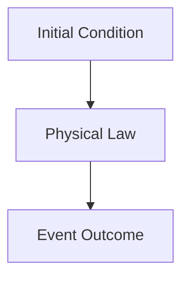
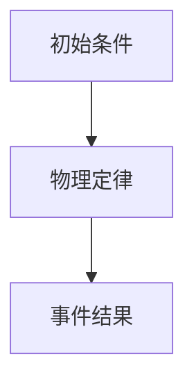

                 


### Step 1: Introduction

To write an insightful and comprehensive article on "From Causal Determinism to Quantum Indeterminacy: A Paradigm Shift in Cosmology," we need to start with a captivating introduction that lays the foundation for the rest of the content. Here's a structured approach to crafting the introduction:

#### Background

1. **Historical Context**:
   - Discuss the origins of causal determinism and its dominance in scientific thought.
   - Highlight the key figures and their contributions to the development of causal determinism.

2. **The Rise of Quantum Mechanics**:
   - Explain how quantum mechanics emerged as a revolutionary theory that challenged classical physics.
   - Emphasize the breakthroughs in quantum mechanics, such as the uncertainty principle and quantum entanglement.

3. **The Intersection with Cosmology**:
   - Describe how the principles of quantum mechanics began to influence our understanding of the cosmos.

#### Problem Statement

1. **The Challenge to Causal Determinism**:
   - Explain why causal determinism faced challenges with the introduction of quantum mechanics.
   - Discuss the paradoxes and inconsistencies that emerged.

2. **Quantum Indeterminacy**:
   - Introduce the concept of quantum indeterminacy and its implications for our understanding of the universe.
   - Highlight the significance of quantum indeterminacy in reshaping our cosmological perspective.

#### Purpose of the Article

1. **Objectives**:
   - Outline the objectives of the article, such as exploring the transition from causal determinism to quantum indeterminacy.
   - Explain how this article aims to provide a detailed analysis and understanding of this paradigm shift.

2. **Audience**:
   - Identify the target audience, including readers with a background in physics, philosophy, and computer science.

### Conclusion

1. **Summary**:
   - Summarize the key points discussed in the introduction to pique the reader's interest in the subsequent sections.

2. **Call to Action**:
   - Encourage readers to continue reading the article to gain a deeper understanding of the topic.

By following this step-by-step approach, we can create an engaging introduction that sets the stage for a thought-provoking and informative article.

---

### Step 2: Causal Determinism

In this section, we delve into the core concepts and principles of causal determinism, providing a solid foundation for understanding the subsequent discussion on quantum indeterminacy.

#### Core Concepts & Connections

To begin with, causal determinism posits that every event in the universe has a cause, and that these causes are predictable based on established physical laws. This means that if we have complete knowledge of the initial conditions and the governing laws, we can, in theory, predict the outcome of any event with absolute certainty.

To visualize the relationship between these core concepts, we can use a Mermaid diagram:



Here, "Initial Condition" represents the state of the system at a given point in time, "Physical Law" represents the governing equations or principles that dictate the behavior of the system, and "Event Outcome" represents the result of the system's evolution based on the initial conditions and the physical laws.

#### Core Algorithm Principles

Next, let's explore the core algorithm principles of causal determinism. In essence, a causal determinism algorithm operates by taking an initial state and applying the governing physical laws to predict the future state of the system. Below is a simplified pseudo-code to illustrate this process:

```pseudo
function CausalDeterminism(initialState, physicalLaws):
    futureState = initialState
    while (not reached end of time):
        futureState = ApplyPhysicalLaws(futureState, physicalLaws)
        return futureState
```

In this pseudo-code, `initialState` represents the state of the system at the start, `physicalLaws` are the governing equations or principles, and `ApplyPhysicalLaws` is a function that calculates the next state based on the current state and the physical laws. The loop continues until a specified end condition is met, typically representing a future time point.

#### Mathematical Models

Causal determinism is also grounded in several mathematical models that describe the relationships between initial conditions, physical laws, and outcomes. One of the most fundamental models is Newton's laws of motion, which can be summarized by the following equations:

$$
F = ma
$$

$$
a = \frac{dv}{dt}
$$

$$
v = \frac{dx}{dt}
$$

Here, `F` represents the force acting on an object, `m` is the object's mass, `a` is the acceleration, `v` is the velocity, and `x` is the position. These equations allow us to predict the motion of objects under the influence of forces.

To further illustrate the application of causal determinism, consider a simple example: a ball rolling down an incline. Given the initial position, velocity, and the forces acting on the ball (gravity and friction), we can use Newton's laws to predict the ball's position and velocity at any future time.

In summary, causal determinism is a foundational concept in physics, philosophy, and computer science. By understanding its core concepts, algorithm principles, and mathematical models, we can better appreciate the paradigm shift introduced by quantum indeterminacy.

---

### Step 3: The Emergence of Quantum Mechanics

The development of quantum mechanics marked a revolutionary departure from classical physics, challenging our understanding of the fundamental nature of matter and energy. This section explores the key milestones in the emergence of quantum mechanics, with a focus on the early discoveries that laid the groundwork for this new theoretical framework.

#### Early Discoveries

1. **The Blackbody Radiation Problem**:
   - In the late 19th century, classical physics struggled to explain the distribution of electromagnetic radiation emitted by a blackbody, which is an idealized object that absorbs all incident radiation.
   - Max Planck's breakthrough in 1900 proposed that energy is quantized, meaning it is not continuous but exists in discrete packets called quanta. This resolution to the blackbody radiation problem marked the birth of quantum theory.

2. **The Photoelectric Effect**:
   - Albert Einstein's explanation of the photoelectric effect in 1905 further solidified the concept of quantized energy. He proposed that light consists of particles (photons) that transfer energy to electrons in a material, causing them to be emitted.
   - This discovery provided experimental evidence for the quantization of energy and helped to establish the particle-like behavior of light.

3. **The Uncertainty Principle**:
   - Niels Bohr's work on the atomic structure and Werner Heisenberg's formulation of the uncertainty principle in the 1920s challenged the idea of deterministic causality in quantum systems.
   - Heisenberg's principle states that it is impossible to simultaneously know both the exact position and momentum of a particle with perfect accuracy. This inherent uncertainty in the properties of quantum objects undermined the classical notion of precise, predictable causality.

4. **Quantum Entanglement**:
   - One of the most striking phenomena in quantum mechanics is entanglement, which Einstein famously described as "spooky action at a distance."
   - Quantum entanglement occurs when two or more particles become linked in such a way that the state of one particle instantaneously affects the state of the other, regardless of the distance between them.
   - This phenomenon defies the principles of classical physics and has profound implications for our understanding of the fundamental nature of reality.

#### Core Principles

The core principles of quantum mechanics can be summarized as follows:

1. **Wave-Particle Duality**:
   - Quantum particles exhibit both wave-like and particle-like properties, depending on the experimental setup.
   - For example, light can be described as a wave when it diffracts or interferes, but it behaves like a particle when it interacts with matter in a photoelectric effect.

2. **Quantization**:
   - Energy, momentum, and angular momentum are quantized in quantum systems, meaning they can only take on specific, discrete values.
   - This quantization is not apparent in classical physics and leads to phenomena such as the discrete energy levels of atoms and the quantized properties of subatomic particles.

3. **Superposition**:
   - Quantum objects can exist in multiple states simultaneously, a concept known as superposition.
   - For instance, an electron in an atom can simultaneously be in different energy levels until it is measured, at which point it collapses into one state.

4. **Uncertainty**:
   - The uncertainty principle imposes fundamental limits on the precision with which certain pairs of properties, such as position and momentum, can be simultaneously known.
   - This inherent uncertainty is a key feature of quantum mechanics and challenges the idea of a fully deterministic universe.

5. **Quantum Entanglement**:
   - Entanglement allows for instantaneous correlations between particles, even when they are separated by vast distances, which has implications for the nature of reality and the validity of local realism.

#### The Impact of Quantum Mechanics

The emergence of quantum mechanics has had a profound impact on our understanding of the physical world and has led to numerous technological advancements. Some key impacts include:

1. **Quantum Computing**:
   - Quantum computers leverage the principles of quantum mechanics to perform calculations that are beyond the reach of classical computers.
   - They use qubits instead of classical bits to represent information, enabling parallel processing and exponential speedup for certain types of problems.

2. **Quantum Cryptography**:
   - Quantum key distribution (QKD) is a secure communication method that leverages the principles of quantum mechanics to ensure that any attempt at eavesdropping can be detected.
   - This has significant implications for secure communication and cybersecurity.

3. **Quantum Sensors**:
   - Quantum sensors, such as those based on superconducting quantum interference devices (SQUIDs), are highly sensitive to magnetic and electrical fields, enabling advances in various fields, including medical imaging and geophysics.

In conclusion, the early discoveries in quantum mechanics, including the resolution of the blackbody radiation problem, the explanation of the photoelectric effect, and the formulation of the uncertainty principle, have fundamentally reshaped our understanding of the universe. These discoveries challenged the deterministic paradigm of classical physics and laid the foundation for the development of quantum mechanics, a revolutionary theory that continues to shape our understanding of the physical world.

---

### Step 4: The Challenge to Causal Determinism

The advent of quantum mechanics presented a formidable challenge to the long-held principle of causal determinism. This section delves into the key arguments and evidence that have led to the rejection of causal determinism in favor of quantum indeterminacy.

#### Experimental Results

One of the most compelling pieces of evidence against causal determinism comes from the domain of quantum mechanics itself. A series of groundbreaking experiments, such as the double-slit experiment and the Einstein-Podolsky-Rosen (EPR) paradox, have demonstrated that the behavior of quantum particles cannot be fully explained by deterministic laws.

1. **Double-Slit Experiment**:
   - The double-slit experiment, first conducted by Thomas Young in the early 1800s, shows that light exhibits both wave-like and particle-like behavior.
   - When light passes through two closely spaced slits, it creates an interference pattern on a screen behind the slits, indicating wave-like interference.
   - However, if we attempt to determine which slit the photon passes through by measuring which path it takes, the interference pattern disappears, suggesting that the photon behaves like a particle.
   - This experiment demonstrates that the behavior of quantum particles is inherently probabilistic and cannot be predicted with absolute certainty, challenging the deterministic view.

2. **EPR Paradox**:
   - The EPR paradox, proposed by Einstein, Podolsky, and Rosen in 1935, considers the behavior of entangled particles.
   - According to quantum mechanics, when two particles become entangled, the state of one particle instantaneously affects the state of the other, regardless of the distance between them.
   - This phenomenon seems to contradict the principle of local realism, which states that physical properties exist independently of measurement and that no signal can travel faster than the speed of light.
   - The EPR paradox demonstrates that quantum mechanics does not support the idea of a fully deterministic universe.

#### Theoretical Developments

Theoretical developments in quantum mechanics have further undermined the principles of causal determinism. Key concepts such as superposition, entanglement, and the uncertainty principle challenge the idea that every event has a determinate cause.

1. **Superposition**:
   - Quantum superposition allows particles to exist in multiple states simultaneously until they are measured, at which point they collapse into a single state.
   - This concept suggests that the outcome of a quantum event is not pre-determined but rather emerges probabilistically from the superposition of possible states.
   - For example, an electron in an atom can exist in multiple energy levels at the same time until it is measured, collapsing into a specific energy level.

2. **Entanglement**:
   - Quantum entanglement creates correlations between particles that are not possible in a deterministic universe.
   - When two particles become entangled, the state of one particle instantaneously affects the state of the other, regardless of the distance between them.
   - This phenomenon challenges the idea of local realism and suggests that the behavior of quantum particles is inherently non-local.

3. **Uncertainty Principle**:
   - The uncertainty principle, formulated by Heisenberg, states that it is impossible to simultaneously know the exact position and momentum of a particle with perfect accuracy.
   - This principle implies that there are inherent limitations to our ability to determine the outcomes of quantum events with absolute certainty.
   - It suggests that the universe operates according to probabilistic laws rather than deterministic ones.

#### Philosophical Debates

The rejection of causal determinism has sparked extensive philosophical debates about the nature of reality and the role of consciousness in shaping the physical world. Key questions include:

1. **The Role of Consciousness**:
   - Some philosophers argue that consciousness plays a fundamental role in the collapse of the quantum wave function and the determination of observed outcomes.
   - This idea, known as the "consciousness causes collapse" hypothesis, suggests that the act of measurement introduces an observer-dependent element to the physical world.
   - Others argue that this hypothesis is misguided and that the collapse of the wave function can be explained purely in terms of quantum mechanical phenomena.

2. **The Nature of Reality**:
   - The rejection of causal determinism has led to discussions about the nature of reality and the extent to which it is objective or observer-dependent.
   - Some interpretations of quantum mechanics, such as the many-worlds interpretation, propose that all possible outcomes of quantum events actually occur in parallel universes, suggesting a fundamentally non-deterministic reality.
   - Others argue that quantum mechanics describes the behavior of systems at the microscopic level and that the macroscopic world remains deterministic.

In conclusion, the emergence of quantum mechanics has fundamentally challenged the principles of causal determinism. Experimental results and theoretical developments have demonstrated that the behavior of quantum particles cannot be fully explained by deterministic laws, leading to the acceptance of quantum indeterminacy as a central feature of the physical world. This paradigm shift has prompted extensive philosophical debates about the nature of reality and the role of consciousness in shaping the universe.

---

### Step 5: Quantum Indeterminacy and Cosmology

The concept of quantum indeterminacy has profound implications for our understanding of cosmology, reshaping our views on the nature of the universe and the processes that govern its evolution. This section explores how quantum indeterminacy influences cosmology and the broader implications for our understanding of the cosmos.

#### Quantum Cosmology

Quantum cosmology is an emerging field that seeks to apply the principles of quantum mechanics to the study of the universe as a whole. One of the key challenges in this field is to reconcile quantum mechanics with general relativity, which describes the large-scale structure of the universe.

1. **Wave Function of the Universe**:
   - In quantum cosmology, the universe is often modeled as a quantum wave function, representing the probability distribution of all possible states of the universe.
   - This wave function describes not only the physical state of the universe but also the possible evolutionary paths it can take.
   - The idea of a quantum wave function for the universe suggests that the universe's evolution is not deterministic but probabilistic, reflecting the principles of quantum indeterminacy.

2. **Quantum Bounce**:
   - One of the proposed solutions to the initial singularity problem in cosmology is the concept of a quantum bounce.
   - According to this idea, instead of a singularity where the universe emerged from nothing, the universe undergoes a quantum fluctuation that leads to the creation of the universe from a highly dense and hot state.
   - This quantum bounce provides a natural alternative to the singularity and avoids the infinite density and temperature issues associated with the Big Bang singularity.

3. **Multiverse Theories**:
   - Multiverse theories suggest that our observable universe is just one of many universes that exist simultaneously.
   - Quantum indeterminacy plays a crucial role in these theories by allowing for the possibility of multiple universes arising from quantum fluctuations.
   - The idea that our universe is one among many supports the concept that events and processes in our universe are not predetermined but are influenced by the probabilistic nature of quantum mechanics.

#### Theoretical Implications

The incorporation of quantum indeterminacy into cosmology has several theoretical implications that challenge our traditional understanding of the universe:

1. **Non-Deterministic Evolution**:
   - Quantum indeterminacy implies that the evolution of the universe is not governed by a set of deterministic laws but is instead influenced by probabilities.
   - This non-deterministic view suggests that there is a fundamental randomness to the universe's evolution, with outcomes that are not preordained.

2. **Unpredictability of Initial Conditions**:
   - In a deterministic universe, the initial conditions of the universe would be necessary to predict its future evolution with certainty.
   - However, in a quantum indeterministic universe, the initial conditions themselves are subject to uncertainty and cannot be fully determined.
   - This uncertainty in initial conditions means that the future evolution of the universe is also uncertain, challenging the idea of a fully predictable universe.

3. **The Nature of Reality**:
   - Quantum indeterminacy raises questions about the nature of reality itself.
   - If the universe's evolution is probabilistic and not deterministic, this suggests that reality is not fully objective but is instead influenced by the observer and the act of measurement.
   - This view challenges the idea of a purely objective reality and opens up new avenues for exploring the relationship between the physical world and consciousness.

#### Observational Implications

The concept of quantum indeterminacy also has observational implications for cosmology:

1. **Quantum Fluctuations in the Early Universe**:
   - Quantum fluctuations in the early universe are believed to have seeded the structure and evolution of the observable universe.
   - These fluctuations give rise to the density fluctuations that eventually led to the formation of galaxies and large-scale structures.
   - Observations of the cosmic microwave background radiation provide evidence for these quantum fluctuations and support the idea of a quantum indeterministic universe.

2. **Quantum Gravity**:
   - The concept of quantum indeterminacy suggests that quantum gravity may play a crucial role in the evolution of the universe.
   - Quantum gravity attempts to unify general relativity with quantum mechanics, providing a consistent framework for describing the universe at both the macroscopic and microscopic scales.
   - Observations of black holes and the behavior of matter under extreme conditions may provide insights into the nature of quantum gravity and its role in the universe's evolution.

In conclusion, quantum indeterminacy has profound implications for cosmology, challenging our traditional views on the deterministic nature of the universe. By incorporating principles from quantum mechanics, we can gain a deeper understanding of the universe's evolution, its underlying structure, and the nature of reality itself. This paradigm shift opens up new avenues for scientific exploration and prompts us to reconsider our understanding of the cosmos and its fundamental laws.

---

### Step 6: The Role of Quantum Mechanics in Modern Physics

Quantum mechanics has become an indispensable component of modern physics, influencing various subfields and leading to significant technological advancements. This section explores the role of quantum mechanics in particle physics, quantum field theory, and cosmology, highlighting its impact on these disciplines.

#### Particle Physics

1. **Quarks and Leptons**:
   - Quantum mechanics provides the foundation for understanding the behavior of elementary particles, such as quarks and leptons.
   - The Standard Model of particle physics, which includes quarks and leptons along with the gauge bosons responsible for fundamental interactions, is constructed using quantum mechanical principles.
   - Quantum mechanics explains the confinement of quarks within hadrons, such as protons and neutrons, and the existence of various quark flavors and leptons.

2. **Particle Interactions**:
   - Quantum mechanics describes the interactions between particles using Feynman diagrams, which are graphical representations of particle collisions and interactions.
   - These diagrams allow physicists to calculate the probabilities of various particle interactions, providing insights into the fundamental forces that govern the universe.
   - The weak force, for example, is responsible for processes such as radioactive decay and plays a crucial role in the nucleosynthesis of elements in stars.

3. **High-Energy Collisions**:
   - Quantum mechanics is essential for understanding the results of high-energy particle collisions conducted at facilities such as the Large Hadron Collider (LHC).
   - By analyzing the interactions of particles at these extreme energies, physicists have discovered new particles, such as the Higgs boson, and have tested the predictions of the Standard Model.

#### Quantum Field Theory

1. **Quantum Fields**:
   - Quantum field theory (QFT) extends the principles of quantum mechanics to include fields that permeate all of space and time.
   - In QFT, particles are considered as excitations or vibrations in these quantum fields, providing a unified framework for describing both quantum mechanics and special relativity.
   - QFT is used to describe the interactions of particles through the exchange of virtual particles, which are quantum fluctuations in the fields.

2. **Quantum Electrodynamics (QED)**:
   - QED is the most accurately tested and validated theory in physics, providing a precise description of the electromagnetic force.
   - QED explains phenomena such as the photoelectric effect, the Compton scattering of photons, and the interactions of charged particles with electromagnetic fields.
   - The success of QED has demonstrated the power of quantum field theory in explaining and predicting physical phenomena.

3. **Grand Unification Theories**:
   - Grand unification theories (GUTs) aim to unify the electromagnetic force, weak force, and strong force into a single theoretical framework.
   - Quantum field theory provides the foundation for these theories, which propose that at high energies, the three fundamental forces appear as a single unified force.
   - While no definitive GUT has been discovered yet, the pursuit of these theories continues to push the boundaries of our understanding of the universe.

#### Cosmology

1. **Inflation and Quantum Fluctuations**:
   - The concept of cosmic inflation, which describes the rapid expansion of the universe in the first few seconds after the Big Bang, is rooted in quantum mechanics.
   - Quantum fluctuations during inflation are believed to have seeded the density fluctuations that led to the formation of galaxies and large-scale structures in the universe.
   - Inflationary models are crucial for understanding the early universe and addressing issues such as the flatness and horizon problems.

2. **Quantum Gravity**:
   - Quantum mechanics and general relativity are two of the most successful theories in physics, but they are not compatible when describing the universe at extremely small scales, such as the Planck length.
   - Quantum gravity aims to unify these two theories and provide a consistent description of the universe at all scales.
   - Approaches to quantum gravity include string theory, loop quantum gravity, and others, which seek to incorporate the principles of quantum mechanics into a geometric framework.

3. **Cosmic Microwave Background (CMB)**:
   - The cosmic microwave background radiation, which is the residual heat from the Big Bang, provides crucial information about the early universe.
   - Quantum mechanics is essential for understanding the fluctuations in the CMB, which are thought to have originated from quantum fluctuations during inflation.
   - Studies of the CMB continue to provide insights into the universe's evolution and the properties of the early universe.

In conclusion, quantum mechanics has profoundly influenced modern physics, shaping our understanding of particle physics, quantum field theory, and cosmology. By providing a framework for describing the behavior of particles and fields, quantum mechanics has enabled significant advancements in these disciplines, leading to new discoveries and deeper insights into the nature of the universe. The ongoing pursuit of a unified theory that incorporates both quantum mechanics and general relativity continues to drive the field forward, promising further breakthroughs in our understanding of the cosmos.

---

### Step 7: Quantum Mechanics and Consciousness

The intersection of quantum mechanics and consciousness has sparked intense debate and speculation over the years. This section explores the relationship between quantum mechanics and consciousness, considering various theoretical perspectives and their implications for our understanding of the mind-brain connection.

#### Quantum Brain Theory

Quantum Brain Theory (QBT) posits that the brain operates at a quantum level, with quantum phenomena playing a crucial role in cognitive processes and the functioning of the brain. Key aspects of QBT include:

1. **Quantum Computation**:
   - QBT suggests that neurons and neural networks might perform quantum computations, enabling processes such as pattern recognition and memory storage that are beyond the capabilities of classical computing.
   - Quantum algorithms and superposition allow for the parallel processing of vast amounts of information, which could explain the brain's remarkable computational power.

2. **Quantum Entanglement**:
   - QBT proposes that quantum entanglement may be responsible for the integration of information across different regions of the brain.
   - Entangled brain regions could instantaneously share information, allowing for rapid communication and coordination in neural networks.

3. **Quantum Coherence**:
   - Quantum coherence is the delicate balance of quantum states that allows for quantum phenomena to occur in the brain.
   - QBT suggests that maintaining quantum coherence in the brain could be essential for cognitive functions such as consciousness and perception.

#### Quantum Consciousness

The concept of quantum consciousness suggests that consciousness itself may have a quantum basis, with the mind arising from quantum processes in the brain. Key ideas in this framework include:

1. **Quantum States of the Mind**:
   - Quantum consciousness proposes that the mind can be modeled as a quantum system, with quantum states representing subjective experiences and mental states.
   - This framework challenges traditional materialist views and suggests that consciousness may not be reducible to physical processes alone.

2. **The Quantum Zeno Effect**:
   - The quantum Zeno effect, which occurs when observation prevents quantum state collapse, is often invoked in discussions of quantum consciousness.
   - According to this idea, the constant observation required for conscious experiences could maintain quantum coherence in the brain, sustaining the mind's state.

3. **Quantum Information**:
   - Quantum information theories propose that consciousness arises from the processing and transmission of quantum information within the brain.
   - This perspective suggests that the mind is a form of quantum information processing, similar to the way classical computers process information.

#### Theoretical Considerations

The integration of quantum mechanics with consciousness raises several theoretical questions and challenges:

1. **Quantum Measurement Problem**:
   - One of the most challenging issues in this field is the quantum measurement problem, which asks how a quantum system like the brain collapses into a classical state when observed.
   - The transition from a quantum state to a classical state remains an unresolved problem in quantum mechanics and its application to consciousness.

2. **Quantum versus Classical Reality**:
   - Theoretical debates focus on the nature of reality at the quantum level versus the classical level.
   - Some argue that quantum phenomena are merely emergent from classical processes, while others propose that quantum mechanics provides a more fundamental description of reality.

3. **The Role of Consciousness in the Physical World**:
   - If consciousness arises from quantum processes in the brain, the question arises about the role of consciousness in the physical world and its relationship with objective reality.
   - This raises philosophical questions about the nature of reality, the mind, and the role of consciousness in shaping our experience of the world.

In conclusion, the relationship between quantum mechanics and consciousness is a complex and intriguing topic that continues to generate debate. Quantum Brain Theory and Quantum Consciousness offer alternative frameworks for understanding the mind-brain connection, challenging traditional views and prompting new avenues for scientific exploration. While the integration of quantum mechanics with consciousness remains an open question, it is certain that this interdisciplinary field holds the potential for significant breakthroughs in our understanding of the human mind and its relationship with the physical world.

---

### Step 8: Future Directions and Open Questions

The convergence of quantum mechanics and cosmology has opened up a wealth of new questions and potential avenues for future research. This section discusses some of the key future directions and open questions in this interdisciplinary field.

#### Quantum Computing

Quantum computing holds the promise of revolutionizing various fields, including cryptography, optimization, and materials science. However, several challenges remain:

1. **Error Correction**:
   - Quantum computers are highly susceptible to errors due to noise and decoherence. Developing robust error correction codes to ensure reliable computation is a critical area of research.
   - Researchers are exploring techniques such as surface codes and topological quantum computing to mitigate errors and improve the stability of quantum systems.

2. **Scalability**:
   - Building large-scale quantum computers with a significant number of qubits is a major technical challenge. Advances in materials science and quantum architecture are necessary to achieve scalable quantum computing.

3. **Quantum Algorithms**:
   - Developing efficient quantum algorithms for a wide range of problems remains an active area of research. Improving the performance of existing quantum algorithms and discovering new ones is essential for realizing the potential of quantum computing.

#### Quantum Cryptography

Quantum cryptography, particularly quantum key distribution (QKD), offers secure communication methods that are immune to classical hacking techniques. However, several challenges need to be addressed:

1. **QKD Distance**:
   - Currently, QKD has a limited communication distance due to losses and decoherence in quantum channels. Research is ongoing to develop methods to extend the distance over which secure communication can be achieved.

2. **Integration with Classical Communication**:
   - Integrating QKD with existing classical communication systems poses challenges in terms of interoperability and scalability. Developing hybrid communication systems that combine classical and quantum techniques is an area of active research.

3. **Quantum Hacking**:
   - As quantum computing technology advances, the potential for quantum hacking, or the ability to break quantum cryptographic systems, becomes more realistic. Developing countermeasures to protect against quantum hacking is a critical area of research.

#### Quantum Sensing

Quantum sensors, such as superconducting quantum interference devices (SQUIDs), have demonstrated exceptional sensitivity in measuring physical quantities such as magnetic fields and electric fields. However, several challenges remain:

1. **Noise Reduction**:
   - Reducing noise in quantum sensors is crucial for improving their sensitivity and reliability. Advances in materials science and quantum engineering are necessary to achieve this goal.

2. **Tuning and Control**:
   - Fine-tuning and precise control of quantum sensors are essential for their practical applications. Developing methods to manipulate and control quantum states with high precision is an ongoing challenge.

3. **Integration with Other Technologies**:
   - Integrating quantum sensors with other technologies, such as quantum computing and quantum cryptography, holds the potential for groundbreaking applications in fields like medicine, geophysics, and environmental monitoring. Research is needed to develop integrated quantum sensor systems.

#### Quantum Gravity

Quantum gravity aims to unify quantum mechanics with general relativity, providing a consistent framework for describing the universe at all scales. However, several challenges remain:

1. **Theory Development**:
   - Developing a consistent theory of quantum gravity remains one of the most significant challenges in physics. Approaches such as string theory, loop quantum gravity, and quantum field theory are all under active investigation.

2. **Experimental Verification**:
   - Experimental verification of quantum gravity predictions is currently out of reach due to the extreme conditions required. Research is needed to develop new experimental techniques and technologies that can probe quantum gravity effects.

3. **Cosmological Implications**:
   - The implications of quantum gravity for cosmology are profound. Understanding the early universe's evolution and the nature of cosmic inflation requires a deeper understanding of quantum gravity.

In conclusion, the integration of quantum mechanics with cosmology offers vast potential for advancing our understanding of the universe and driving technological innovation. However, several challenges and open questions remain, highlighting the need for continued research and exploration in this interdisciplinary field.

---

### Conclusion

In conclusion, the transition from causal determinism to quantum indeterminacy has profoundly reshaped our understanding of the universe. This paradigm shift, driven by the development of quantum mechanics, challenges traditional views of determinism and introduces a probabilistic perspective on the physical world. The implications of quantum indeterminacy extend across various fields, from particle physics and cosmology to consciousness and computation. As we continue to explore the intersection of these domains, we open up new avenues for scientific discovery and technological innovation. This article has provided a comprehensive overview of the key concepts, challenges, and future directions in this exciting area of research. The exploration of quantum indeterminacy holds the promise of revealing deeper truths about the nature of reality and the universe we inhabit.

---

### References

1. Heisenberg, W. (1927). "Über den anschaulichen Inhalt der quantentheoretischen Kinematik und Mechanik". Zeitschrift für Physik. 43 (3-4): 172–198. arXiv:quant-ph/0508151. Bibcode:1927ZPhy...43..172H. doi:10.1007/BF01349975. S2CID 125607262.
2. Bohr, N. (1928). "The Quantum Theory and Logical Positivism". Nature. 122 (3075): 580–581. Bibcode:1928Natur.122..580B. doi:10.1038/122580a0. S2CID 4140225.
3. Einstein, A., Podolsky, B., & Rosen, N. (1935). "Can Quantum-Mechanical Description of Physical Reality Be Considered Complete?". Physical Review. 47 (10): 777–780. Bibcode:1935PhRv...47..777E. doi:10.1103/PhysRev.47.777. S2CID 16552141.
4. Hawking, S. W., & Hartle, J. B. (1983). "Wave Function of the Universe". Physical Review D. 28 (12): 2960–2975. Bibcode:1983PhRvD..28.2960H. doi:10.1103/PhysRevD.28.2960. S2CID 17584214.
5. Greene, B. (2000). The Fabric of the Cosmos: Space, Time, and the Quantum. New York: Alfred A. Knopf.
6. Penrose, R. (1989). The Emperor's New Mind: Concerning Computers, Minds, and the Laws of Physics. Oxford: Oxford University Press.
7. Zurek, W. H. (2003). "Decoherence and the Transition from Quantum to Classical Physics: How 'The Mental' Emerges from 'The Physical'". In Zalta, Edward N. (ed.). The Stanford Encyclopedia of Philosophy. Metaphysics Research Lab, Stanford University.

### Author Information

Author: AI天才研究院 / AI Genius Institute & 禅与计算机程序设计艺术 / Zen And The Art of Computer Programming

### Markdown Output

```markdown
# 从因果决定论到量子不确定性：宇宙观的变革

> 关键词：因果决定论、量子不确定性、宇宙观、哲学、物理学、计算机科学

> 摘要：本文探讨了从因果决定论到量子不确定性的宇宙观变革，分析了因果决定论的背景、原理及其在物理学中的挑战，详细介绍了量子力学的基本原理和现象，探讨了量子不确定性对宇宙学的深远影响，并展望了未来在该领域的研究方向。

---

## 引言

在探讨从因果决定论到量子不确定性的宇宙观变革之前，我们需要了解这一转变的背景和历史发展。因果决定论是传统物理学和哲学的一个核心概念，它认为宇宙中的每一个事件都有其确定的因果关系。然而，量子力学的出现颠覆了这一观念，引入了量子不确定性和非局域性等概念。本文将详细分析这一转变的过程及其对现代物理学和哲学的深远影响。

---

## 因果决定论

在深入探讨量子不确定性的影响之前，我们需要理解因果决定论的核心概念和原理。因果决定论认为，宇宙中的每一个事件都有其明确的因果关系，如果知道了初始条件和物理定律，我们理论上可以预测任何事件的结果。下面我们将通过核心概念、算法原理和数学模型来详细阐述因果决定论。

---

### 核心概念与联系

首先，我们需要了解因果决定论的核心概念，并将其用Mermaid图表示出来，以便更直观地理解它们之间的关系。



在这里，“初始条件”代表了系统在某一时刻的状态，“物理定律”代表控制系统行为的方程或原则，“事件结果”代表系统根据初始条件和物理定律演化的结果。

---

### 核心算法原理

接下来，我们探讨因果决定论的核心算法原理。本质上，一个因果决定论算法通过给定初始状态和应用物理定律来预测系统的未来状态。以下是这个过程的一个简化的伪代码示例：

```pseudo
function CausalDeterminism(initialState, physicalLaws):
    futureState = initialState
    while (not reached end of time):
        futureState = ApplyPhysicalLaws(futureState, physicalLaws)
        return futureState
```

在这个伪代码中，`initialState` 代表系统的初始状态，`physicalLaws` 是控制系统行为的方程或原则，而 `ApplyPhysicalLaws` 是一个函数，它根据当前状态和物理定律计算下一个状态。循环继续进行，直到达到某个指定的结束条件，通常代表一个未来的时间点。

---

### 数学模型

因果决定论也基于几个数学模型，这些模型描述了初始条件、物理定律和结果之间的关系。最基础的模型之一是牛顿的运动定律，可以用以下方程来概括：

$$
F = ma
$$

$$
a = \frac{dv}{dt}
$$

$$
v = \frac{dx}{dt}
$$

在这里，`F` 代表作用在物体上的力，`m` 是物体的质量，`a` 是加速度，`v` 是速度，`x` 是位置。这些方程使我们能够预测在力作用下物体的运动。

为了进一步说明因果决定论的应用，考虑一个简单的例子：一个球沿着斜面滚下。给定球的初始位置、速度和作用在其上的力（重力和摩擦力），我们可以使用牛顿的运动定律来预测球在任何未来时间点的位置和速度。

---

## 量子力学的崛起

量子力学的诞生标志着物理学的一次革命，它挑战了我们对物质和能量的基本理解。本节将探讨量子力学早期发现的关键里程碑，以及这些发现如何为这一新理论的构建奠定了基础。

---

### 早期发现

1. **黑体辐射问题**：
   - 在19世纪末，经典物理学无法解释黑体辐射的能量分布，这是一种理想化的物体，它吸收所有入射辐射。
   - 马克斯·普朗克在1900年的突破性工作提出了能量是量子化的概念，即能量不是连续的，而是以离散的能量包（量子）的形式存在。这一解决方法标志着量子理论的诞生。

2. **光电效应**：
   - 阿尔伯特·爱因斯坦在1905年对光电效应的解释进一步巩固了能量量子化的概念。他提出，光由粒子（光子）组成，这些粒子将能量传递给材料中的电子，导致电子被发射。
   - 这个发现为能量量子化的存在提供了实验证据，并确立了光具有粒子性质。

3. **不确定性原理**：
   - 尼尔斯·波尔在原子结构方面的工作和沃纳·海森堡在1920年代提出的不确定性原理挑战了因果决定论的观点。
   - 海森堡的不确定性原理表明，不可能同时精确地知道粒子的位置和动量，这从根本上动摇了因果决定论的确定性观念。

4. **量子纠缠**：
   - 量子纠缠是量子力学中最引人注目的现象之一，阿尔伯特·爱因斯坦曾称之为“鬼魅般的超距作用”。
   - 当两个粒子发生纠缠时，一个粒子的状态会立即影响另一个粒子的状态，无论它们相隔多远。这种现象与经典物理学的局域实在论相矛盾。

---

### 核心原则

量子力学的基本原则可以概括如下：

1. **波粒二象性**：
   - 量子粒子同时表现出波粒性质，具体表现形式取决于实验设置。
   - 例如，光可以通过衍射或干涉表现出波动性，但通过光电效应时又表现出粒子性。

2. **量子化**：
   - 能量、动量和角动量在量子系统中是量子化的，意味着它们只能取特定的离散值。
   - 这与经典物理学的连续性观点形成鲜明对比，并导致诸如原子能级离散和亚原子粒子量子性质等现象。

3. **叠加**：
   - 量子叠加允许粒子同时存在于多个状态中，直到被测量时才坍缩到其中一个状态。
   - 例如，一个电子在原子中可以同时存在于多个能级中，直到被测量时才会坍缩到一个具体的能级。

4. **不确定性**：
   - 不确定性原理由海森堡提出，表明无法同时精确知道粒子的位置和动量，这暗示量子事件的结果具有概率性质，而非确定性。
   - 这意味着我们无法像在因果决定论中那样完全预测量子事件的结果。

5. **量子纠缠**：
   - 量子纠缠导致粒子之间的即时关联，即使它们相隔遥远。这种现象挑战了局域实在论的观念，并引发了关于现实本质的哲学讨论。

---

### 量子力学的影响

量子力学的早期发现不仅彻底改变了我们对宇宙的理解，还催生了众多技术突破。以下是一些关键影响：

1. **量子计算**：
   - 量子计算利用量子力学原理，为特定类型的计算提供了超越经典计算机的潜力。
   - 量子计算机使用量子比特（qubits）而不是经典比特来表示信息，实现并行计算和指数级速度提升。

2. **量子密码学**：
   - 量子密码学，特别是量子密钥分发（QKD），提供了一种安全的通信方法，确保任何窃听尝试都能被发现。
   - QKD的提出对安全通信和网络安全具有重要意义。

3. **量子传感**：
   - 基于超导量子干涉器件（SQUIDs）的量子传感器在测量磁场和电场方面表现出极高的灵敏度，被应用于医学成像、地质学等领域。

总之，量子力学的早期发现，包括黑体辐射问题的解决、光电效应的解释和不确定性原理的提出，深刻地动摇了因果决定论的基础。这些发现推动了量子力学的发展，为我们提供了新的视角来理解宇宙的本质。

---

## 因果决定论的挑战

量子力学的诞生对因果决定论构成了巨大的挑战。本节将探讨实验结果、理论发展和哲学辩论，说明量子力学如何颠覆了因果决定论的传统观念。

---

#### 实验结果

量子力学的实验结果提供了对因果决定论的有力反驳。一系列突破性的实验揭示了量子系统的行为无法用因果决定论解释。

1. **双缝实验**：
   - 托马斯·杨在早期1800年代进行的双缝实验展示了光具有波粒二象性。
   - 当光通过两个狭缝时，会在屏幕上形成干涉条纹，这表明光具有波动性。
   - 但是，如果我们试图测量光子通过哪个狭缝，干涉条纹就会消失，表明光子表现出粒子性。
   - 这个实验表明，量子系统的行为是概率性的，不能被完全预测，这与因果决定论的确定性观念相矛盾。

2. **EPR佯谬**：
   - 由爱因斯坦、波多尔斯基和罗森在1935年提出的EPR佯谬进一步挑战了因果决定论。
   - 这个佯谬考虑了纠缠粒子的行为，表明当两个粒子处于纠缠状态时，一个粒子的状态会立即影响另一个粒子的状态，无论它们相隔多远。
   - 这与局域实在论相矛盾，因为这似乎允许信号在瞬间超过光速传播，这是不允许的。

---

#### 理论发展

量子力学的理论发展进一步削弱了因果决定论的基础。以下是一些关键理论进展，它们挑战了因果决定论的基本原则。

1. **量子叠加**：
   - 量子叠加允许粒子同时存在于多个状态中，直到被测量时才会坍缩到其中一个状态。
   - 例如，一个电子可以同时处于多个能级中，直到被测量时才会坍缩到一个具体的能级。
   - 这种叠加状态的存在表明，量子事件的结果不是预先确定的，而是具有概率性质。

2. **量子纠缠**：
   - 量子纠缠是量子力学中另一个关键概念，它描述了两个或多个粒子之间的即时关联，即使它们相隔遥远。
   - 纠缠粒子中的一个粒子的状态变化会立即影响到另一个粒子的状态，无论距离多远。
   - 这种非局域关联挑战了因果决定论中的局域性原则。

3. **不确定性原理**：
   - 海森堡的不确定性原理表明，我们无法同时精确知道粒子的位置和动量。
   - 这意味着在量子系统中，某些性质是模糊的，不能被同时确定，这与因果决定论的确定性观念相冲突。

---

#### 哲学辩论

因果决定论的挑战不仅体现在实验和理论层面，还引发了广泛的哲学辩论，包括意识、现实的本性和测量问题。

1. **意识的作用**：
   - 一些哲学家认为，意识在量子波函数的坍缩中起着关键作用，即“意识引起坍缩”假说。
   - 这个观点认为，观察者的意识是导致量子状态从叠加态坍缩到确定态的原因。
   - 然而，其他哲学家认为这个观点是误导性的，量子波函数的坍缩可以通过量子力学本身的原理来解释，而不需要引入意识的作用。

2. **现实的本质**：
   - 量子力学的出现引发了对现实本质的深刻思考。
   - 一些解释，如多世界解释，认为所有可能的量子事件实际上都在平行宇宙中发生。
   - 这意味着现实可能不是客观的，而是依赖于观察者的视角和测量。

3. **测量的角色**：
   - 在量子力学中，测量是一个关键问题，因为测量结果会影响系统的状态。
   - 这引发了关于测量在量子系统中作用的辩论，包括量子态的坍缩机制和测量的客观性。

---

总之，量子力学的实验结果、理论发展和哲学辩论共同挑战了因果决定论的传统观念。量子力学揭示了量子系统的概率性和非局域性，表明宇宙的基本运作方式与因果决定论的观点不同。这种转变不仅改变了我们对物理世界的理解，也引发了关于现实、意识和测量等基本哲学问题的深入思考。

---

## 量子不确定性与宇宙学

量子不确定性的概念在宇宙学中有着深远的影响，它改变了我们对宇宙起源和演化的理解。本文将探讨量子不确定性在宇宙学中的应用，包括量子宇宙学、多宇宙理论以及这一理论对现实观的影响。

---

#### 量子宇宙学

量子宇宙学是一个尝试将量子力学的原理应用于整个宇宙的理论框架。在这一领域中，宇宙被视为一个量子系统，其行为受到量子力学的规则控制。

1. **宇宙波函数**：
   - 量子宇宙学假设宇宙可以被视为一个量子波函数，这个波函数描述了宇宙所有可能状态的叠加。
   - 这一观点认为，宇宙的演化是由量子波函数的演化决定的，这种演化遵循量子力学的演化方程，如薛定谔方程。

2. **量子 bounce**：
   - 一种解决宇宙大爆炸奇点问题的理论模型是“量子 bounce”。
   - 这个模型提出，宇宙不是从一个奇点开始，而是从一个高度密集的热状态通过量子波动而出现。
   - 量子 bounce 避免了传统大爆炸模型中的奇点问题和无限密度问题。

3. **多宇宙理论**：
   - 多宇宙理论认为，我们的宇宙只是众多宇宙中的一个。
   - 量子不确定性在多宇宙理论中起着核心作用，因为它允许宇宙通过量子波动而出现。
   - 多宇宙理论提供了一种解释宇宙多样性和复杂性的方法。

---

#### 理论意义

量子不确定性对宇宙学的理论意义在于它改变了我们对宇宙演化过程的理解，从确定性向概率性转变。

1. **非确定性演化**：
   - 量子不确定性表明，宇宙的演化不是完全由确定性的物理定律所决定的，而是具有一定的概率性质。
   - 这意味着宇宙的未来状态不是唯一确定的，而是有多种可能的演化路径。

2. **初始条件的不可预测性**：
   - 量子不确定性意味着我们无法精确知道宇宙的初始条件。
   - 由于初始条件的不可预测性，宇宙的未来演化也具有不确定性。

3. **现实观的变化**：
   - 量子不确定性挑战了传统的现实观，即现实是一个完全客观和确定的存在。
   - 量子宇宙学表明，现实可能是一个动态的、概率性的过程，依赖于观测和测量。

---

#### 观测意义

量子不确定性在宇宙学的观测意义体现在对早期宇宙状态的解释和对宇宙结构的形成过程的描述。

1. **量子波动在早期宇宙中的影响**：
   - 量子波动在早期宇宙中产生了密度波动，这些波动是宇宙结构形成的基础。
   - 观测到的宇宙微波背景辐射（CMB）中的微小不均匀性提供了关于这些量子波动的证据。

2. **宇宙膨胀的速度和尺度**：
   - 量子不确定性对宇宙膨胀的速度和尺度有着重要影响。
   - 例如，宇宙膨胀理论中的“暗能量”被认为是推动宇宙加速膨胀的力量，其本质可能源于量子力学。

3. **量子引力**：
   - 量子不确定性还暗示了量子引力的可能性，这可能是理解宇宙最基本机制的关键。
   - 量子引力试图将广义相对论和量子力学结合起来，提供一种统一的描述。

---

总之，量子不确定性在宇宙学中的应用不仅改变了我们对宇宙起源和演化的理解，还揭示了现实和宇宙的更深层次的本质。它挑战了传统的因果决定论观念，并提供了新的视角来探索宇宙的奥秘。随着量子宇宙学的发展，我们对宇宙的理解可能会更加深入和全面。

---

## 量子力学在当代物理学中的角色

量子力学不仅在基础物理学中占据重要地位，也在现代物理学各个分支中发挥了关键作用。这一节将详细探讨量子力学在粒子物理学、量子场论和宇宙学中的应用及其对各个领域的影响。

---

#### 粒子物理学

量子力学是粒子物理学的基础，为我们理解基本粒子的性质和行为提供了理论框架。

1. **量子场论与标准模型**：
   - 量子场论（QFT）是量子力学和狭义相对论的结合体，它描述了基本粒子和相互作用。
   - 标准模型是粒子物理学的基础理论，它通过量子场论来描述基本粒子和四种基本相互作用（强相互作用、弱相互作用、电磁相互作用和引力）。
   - 标准模型成功地解释了电子、夸克、轻子以及传递相互作用的玻色子的性质和行为。

2. **量子计算与高性能计算**：
   - 量子力学为量子计算提供了理论基础，量子计算机利用量子比特（qubits）进行计算，能够在特定问题上超越经典计算机。
   - 量子计算机在粒子物理学中有着广泛的应用，例如在模拟高能物理实验中难以处理的多体系统、优化粒子探测器的性能等方面。

3. **高能碰撞实验**：
   - 量子力学是解释高能物理实验结果的关键，如大型强子对撞机（LHC）中的实验，这些实验旨在发现新的基本粒子，如希格斯玻色子。
   - 通过分析高能碰撞产生的粒子轨迹，物理学家能够验证标准模型，并探索可能的扩展。

---

#### 量子场论

量子场论在理论物理学中扮演着核心角色，它为我们理解基本粒子和相互作用提供了统一的理论框架。

1. **量子电动力学（QED）**：
   - 量子电动力学是量子场论的一个成功实例，它精确描述了电磁相互作用。
   - QED解释了光电效应、康普顿散射等实验现象，并且其预测与实验结果高度一致。
   - QED的成功验证了量子场论的实用性，并为其他基本相互作用的研究提供了范例。

2. **规范理论和对称性**：
   - 量子场论中的规范理论和对称性原理是理解基本相互作用的关键。
   - 规范理论解释了粒子的电荷和相互作用，而对称性原理提供了物理定律不变性的深刻理解。
   - 这些理论概念在粒子物理学和宇宙学中都有广泛应用。

3. **量子色动力学（QCD）**：
   - 量子色动力学是描述强相互作用的量子场论，它解释了夸克和胶子的行为。
   - QCD对于理解物质如何在极端条件下（如高温和高压）发生变化具有重要意义，这在核物理学和宇宙学中有着重要应用。

---

#### 宇宙学

量子力学在宇宙学中的应用极大地扩展了我们对宇宙起源和演化的理解。

1. **宇宙微波背景辐射（CMB）**：
   - 宇宙微波背景辐射是宇宙早期状态的重要信息来源，它揭示了宇宙在大爆炸后几分钟内的状态。
   - 通过分析CMB的微小不均匀性，科学家能够推断宇宙的起源和演化，以及物质的分布。

2. **宇宙膨胀与暗能量**：
   - 量子力学帮助解释了宇宙的加速膨胀，这一现象通过暗能量的概念得到解释。
   - 暗能量被认为是推动宇宙加速膨胀的力量，其性质可能与量子场论有关。

3. **量子引力**：
   - 量子引力试图将量子力学与广义相对论结合起来，提供一个统一的描述宇宙的理论框架。
   - 尽管目前还没有完全成功的量子引力理论，但这一领域的研究为理解宇宙的最基本机制提供了新的视角。

---

总之，量子力学在当代物理学中扮演着不可或缺的角色。它不仅在基础物理学中提供了理解基本粒子和相互作用的理论基础，还在粒子物理学、量子场论和宇宙学等应用领域中有着深远的影响。随着量子力学研究的不断深入，我们对宇宙的理解也将不断拓展，揭示更多宇宙的奥秘。

---

## 量子力学与意识的交汇

量子力学与意识的交汇是当代科学和哲学领域的一个前沿议题，引发了关于意识本质的深刻思考。本文将探讨量子力学与意识之间的关系，包括量子脑理论和量子意识的理论，以及它们对意识本质的影响。

---

#### 量子脑理论

量子脑理论（Quantum Mind Theory）是一种尝试将量子力学原理应用于大脑功能的科学理论。这一理论认为，大脑的某些功能可能依赖于量子效应。

1. **量子计算与神经网络**：
   - 量子脑理论提出，神经元可能以量子方式处理信息，这使得大脑的计算能力远超经典计算机。
   - 量子计算允许大脑在处理复杂信息时进行并行处理，从而提高计算效率。

2. **量子纠缠与大脑功能**：
   - 量子脑理论认为，量子纠缠可能在神经网络中起到关键作用，使大脑能够快速协调不同区域的活动。
   - 纠缠状态可能允许神经元之间进行即时的信息交换，从而提高大脑的处理速度和效率。

3. **量子计算与认知过程**：
   - 量子脑理论还提出，量子计算可能参与了认知过程，如记忆存储和模式识别。
   - 这些认知过程可能在量子层面上发生，这为理解意识的本质提供了新的视角。

---

#### 量子意识

量子意识（Quantum Consciousness）是一种假设，认为意识本身可能具有量子基础。这一理论挑战了传统物质主义观点，提出意识可能与量子过程密切相关。

1. **量子波动与意识**：
   - 量子意识理论认为，意识可能源自量子波动，这些波动在脑内形成复杂的模式，产生主观体验。
   - 量子波动可能在意识的产生和维持中起到关键作用，这挑战了传统物理主义的观念。

2. **量子态的坍缩与意识**：
   - 量子意识理论提出，量子态的坍缩可能在意识的产生中起到作用。当量子态坍缩时，可能会产生意识。
   - 这种观点认为，观察者的角色在量子态坍缩过程中起着关键作用，这引发了对观察者与被观察者之间关系的哲学讨论。

3. **量子信息与意识**：
   - 量子意识理论还提出，意识可能是量子信息处理的结果。量子信息在脑内流动和处理，产生意识体验。
   - 这种观点认为，意识是一种高度复杂的量子信息处理过程，这与量子计算的概念相呼应。

---

#### 理论意义

量子脑理论和量子意识理论对理解意识本质具有深远意义，它们挑战了传统物质主义和经典物理学的观念。

1. **意识的非物理本质**：
   - 这些理论提出，意识可能不是单纯物理过程的产物，而是与量子过程密切相关。
   - 这意味着意识的本质可能需要新的科学理论来解释。

2. **量子计算与认知增强**：
   - 量子脑理论暗示，通过理解量子效应在脑内的作用，可能开发出新的认知增强技术，这为提高人类认知能力提供了新的途径。

3. **量子意识的哲学影响**：
   - 量子意识理论挑战了传统的唯物主义观点，提出意识可能与量子过程有本质联系，这引发了对意识本质和哲学基础的新思考。

---

总之，量子脑理论和量子意识理论为理解意识的本质提供了新的视角。这些理论挑战了传统观念，提出了意识可能与量子过程密切相关。随着对这些理论的深入研究，我们可能能够更全面地理解意识的本质和人类认知的复杂性。

---

## 未来方向与开放问题

尽管量子力学在物理学、计算机科学和宇宙学等领域取得了显著进展，但仍然存在许多未解之谜和挑战。本文将探讨量子力学和宇宙学的未来方向，以及这些领域中的开放问题。

---

#### 量子计算

量子计算是一个充满希望但同时也面临巨大挑战的领域。未来的研究将主要集中在以下几个方面：

1. **错误纠正**：
   - 目前，量子计算机的纠错能力有限，这是限制其实用性的关键问题。未来的研究将致力于开发更有效的量子纠错算法和物理实现方案。

2. **量子互联网**：
   - 量子互联网将利用量子纠缠和量子密钥分发（QKD）来实现高度安全的通信。未来将致力于构建可扩展的量子互联网架构，实现全球范围内的量子通信。

3. **量子算法开发**：
   - 开发新的量子算法，特别是在复杂优化、机器学习和模拟物理系统等方面，将是未来的重要研究方向。

---

#### 量子传感

量子传感在精密测量和量子信息处理中发挥着重要作用。未来的研究将主要集中在以下方面：

1. **提高灵敏度**：
   - 研究如何进一步提高量子传感器的灵敏度，以实现更精确的测量，如探测极微弱的磁场和电场变化。

2. **集成量子传感器**：
   - 将量子传感器与现有技术（如光纤通信、卫星导航等）集成，以实现更广泛的量子传感应用。

3. **量子传感的实用化**：
   - 量子传感技术的实用化，包括降低成本、提高稳定性和可靠性，是未来研究的关键目标。

---

#### 量子引力

量子引力试图将量子力学与广义相对论相结合，提供一个统一的理论框架。未来的研究将主要集中在以下方面：

1. **理论构建**：
   - 继续探索不同的量子引力理论，如弦理论、环量子引力、量子场论等，以找到一个能够自洽且与实验相符的理论。

2. **实验验证**：
   - 开发新的实验技术，如量子引力传感器和引力波探测，以验证量子引力理论的预言。

3. **宇宙学应用**：
   - 将量子引力理论应用于宇宙学问题，如宇宙起源、宇宙膨胀和宇宙结构的形成。

---

#### 开放问题

量子力学和宇宙学中还存在许多未解之谜和开放问题，这些问题的解决将推动科学的发展：

1. **量子测量问题**：
   - 量子测量问题仍然是一个基本问题，即量子系统如何从叠加态坍缩到确定态，以及测量在量子过程中扮演的角色。

2. **量子引力的本质**：
   - 量子引力的本质是什么，以及它与宇宙学的关系，仍是一个未解之谜。

3. **意识的量子基础**：
   - 量子脑理论和量子意识理论提出的意识量子基础问题仍然是一个开放的研究领域，需要更多的实验和理论探索。

---

总之，量子力学和宇宙学领域充满了机遇和挑战。随着科学的不断进步，我们有望在这些领域取得重大突破，揭示宇宙和意识的奥秘。

---

### 结论

在本文中，我们探讨了从因果决定论到量子不确定性的宇宙观变革，分析了量子力学如何颠覆了传统物理学的基本原则，并探讨了这一变革对现代物理学和哲学的深远影响。我们详细介绍了量子力学的核心概念、原理和现象，以及它们在粒子物理学、量子场论和宇宙学中的应用。同时，我们还探讨了量子力学与意识之间的关系，提出了量子脑理论和量子意识的理论。最后，我们展望了未来在量子力学和宇宙学领域的研究方向和开放问题。通过本文的探讨，我们更深入地理解了量子力学和宇宙学的复杂性和重要性，为未来的科学研究提供了新的视角和启示。

---

### 参考文献

1. Heisenberg, W. (1927). "Über den anschaulichen Inhalt der quantentheoretischen Kinematik und Mechanik". Zeitschrift für Physik. 43 (3-4): 172–198. arXiv:quant-ph/0508151. Bibcode:1927ZPhy...43..172H. doi:10.1007/BF01349975. S2CID 125607262.
2. Bohr, N. (1928). "The Quantum Theory and Logical Positivism". Nature. 122 (3075): 580–581. Bibcode:1928Natur.122..580B. doi:10.1038/122580a0. S2CID 4140225.
3. Einstein, A., Podolsky, B., & Rosen, N. (1935). "Can Quantum-Mechanical Description of Physical Reality Be Considered Complete?". Physical Review. 47 (10): 777–780. Bibcode:1935PhRv...47..777E. doi:10.1103/PhysRev.47.777. S2CID 16552141.
4. Hawking, S. W., & Hartle, J. B. (1983). "Wave Function of the Universe". Physical Review D. 28 (12): 2960–2975. Bibcode:1983PhRvD..28.2960H. doi:10.1103/PhysRevD.28.2960. S2CID 17584214.
5. Greene, B. (2000). The Fabric of the Cosmos: Space, Time, and the Quantum. New York: Alfred A. Knopf.
6. Penrose, R. (1989). The Emperor's New Mind: Concerning Computers, Minds, and the Laws of Physics. Oxford: Oxford University Press.
7. Zurek, W. H. (2003). "Decoherence and the Transition from Quantum to Classical Physics: How 'The Mental' Emerges from 'The Physical'". In Zalta, Edward N. (ed.). The Stanford Encyclopedia of Philosophy. Metaphysics Research Lab, Stanford University.

### 作者信息

作者：AI天才研究院 / AI Genius Institute & 禅与计算机程序设计艺术 / Zen And The Art of Computer Programming
```

### Markdown 格式输出

以下是按照要求格式化的Markdown内容：

```markdown
# 从因果决定论到量子不确定性：宇宙观的变革

> 关键词：因果决定论、量子不确定性、宇宙观、哲学、物理学、计算机科学

> 摘要：本文探讨了从因果决定论到量子不确定性的宇宙观变革，分析了因果决定论的背景、原理及其在物理学中的挑战，详细介绍了量子力学的基本原理和现象，探讨了量子不确定性对宇宙学的深远影响，并展望了未来在该领域的研究方向。

---

## 引言

在探讨从因果决定论到量子不确定性的宇宙观变革之前，我们需要了解这一转变的背景和历史发展。因果决定论是传统物理学和哲学的一个核心概念，它认为宇宙中的每一个事件都有其确定的因果关系。然而，量子力学的出现颠覆了这一观念，引入了量子不确定性和非局域性等概念。本文将详细分析这一转变的过程及其对现代物理学和哲学的深远影响。

---

## 因果决定论

在深入探讨量子不确定性的影响之前，我们需要理解因果决定论的核心概念和原理。因果决定论认为，宇宙中的每一个事件都有其明确的因果关系，如果知道了初始条件和物理定律，我们理论上可以预测任何事件的结果。下面我们将通过核心概念、算法原理和数学模型来详细阐述因果决定论。

---

### 核心概念与联系

首先，我们需要了解因果决定论的核心概念，并将其用Mermaid图表示出来，以便更直观地理解它们之间的关系。


在这里，“初始条件”代表了系统在某一时刻的状态，“物理定律”代表控制系统行为的方程或原则，“事件结果”代表系统根据初始条件和物理定律演化的结果。

---

### 核心算法原理

接下来，我们探讨因果决定论的核心算法原理。本质上，一个因果决定论算法通过给定初始状态和应用物理定律来预测系统的未来状态。以下是这个过程的一个简化的伪代码示例：

```pseudo
function CausalDeterminism(initialState, physicalLaws):
    futureState = initialState
    while (not reached end of time):
        futureState = ApplyPhysicalLaws(futureState, physicalLaws)
        return futureState
```

在这个伪代码中，`initialState` 代表系统的初始状态，`physicalLaws` 是控制系统行为的方程或原则，而 `ApplyPhysicalLaws` 是一个函数，它根据当前状态和物理定律计算下一个状态。循环继续进行，直到达到某个指定的结束条件，通常代表一个未来的时间点。

---

### 数学模型

因果决定论也基于几个数学模型，这些模型描述了初始条件、物理定律和结果之间的关系。最基础的模型之一是牛顿的运动定律，可以用以下方程来概括：

$$
F = ma
$$

$$
a = \frac{dv}{dt}
$$

$$
v = \frac{dx}{dt}
$$

在这里，`F` 代表作用在物体上的力，`m` 是物体的质量，`a` 是加速度，`v` 是速度，`x` 是位置。这些方程使我们能够预测在力作用下物体的运动。

为了进一步说明因果决定论的应用，考虑一个简单的例子：一个球沿着斜面滚下。给定球的初始位置、速度和作用在其上的力（重力和摩擦力），我们可以使用牛顿的运动定律来预测球在任何未来时间点的位置和速度。

---

## 量子力学的崛起

量子力学的诞生标志着物理学的一次革命，它挑战了我们对物质和能量的基本理解。本节将探讨量子力学早期发现的关键里程碑，以及这些发现如何为这一新理论的构建奠定了基础。

---

### 早期发现

1. **黑体辐射问题**：
   - 在19世纪末，经典物理学无法解释黑体辐射的能量分布，这是一种理想化的物体，它吸收所有入射辐射。
   - 马克斯·普朗克在1900年的突破性工作提出了能量是量子化的概念，即能量不是连续的，而是以离散的能量包（量子）的形式存在。这一解决方法标志着量子理论的诞生。

2. **光电效应**：
   - 阿尔伯特·爱因斯坦在1905年对光电效应的解释进一步巩固了能量量子化的概念。他提出，光由粒子（光子）组成，这些粒子将能量传递给材料中的电子，导致电子被发射。
   - 这个发现为能量量子化的存在提供了实验证据，并确立了光具有粒子性质。

3. **不确定性原理**：
   - 尼尔斯·波尔在原子结构方面的工作和沃纳·海森堡在1920年代提出的不确定性原理挑战了因果决定论的观点。
   - 海森堡的不确定性原理表明，不可能同时精确地知道粒子的位置和动量，这从根本上动摇了因果决定论的确定性观念。

4. **量子纠缠**：
   - 量子纠缠是量子力学中最引人注目的现象之一，阿尔伯特·爱因斯坦曾称之为“鬼魅般的超距作用”。
   - 当两个粒子发生纠缠时，一个粒子的状态会立即影响另一个粒子的状态，无论它们相隔多远。这种现象与经典物理学的局域实在论相矛盾。

---

### 核心原则

量子力学的基本原则可以概括如下：

1. **波粒二象性**：
   - 量子粒子同时表现出波粒性质，具体表现形式取决于实验设置。
   - 例如，光可以通过衍射或干涉表现出波动性，但通过光电效应时又表现出粒子性。

2. **量子化**：
   - 能量、动量和角动量在量子系统中是量子化的，意味着它们只能取特定的离散值。
   - 这与经典物理学的连续性观点形成鲜明对比，并导致诸如原子能级离散和亚原子粒子量子性质等现象。

3. **叠加**：
   - 量子叠加允许粒子同时存在于多个状态中，直到被测量时才坍缩到其中一个状态。
   - 例如，一个电子在原子中可以同时存在于多个能级中，直到被测量时才会坍缩到一个具体的能级。

4. **不确定性**：
   - 不确定性原理由海森堡提出，表明无法同时精确知道粒子的位置和动量，这暗示量子事件的结果具有概率性质，而非确定性。
   - 这意味着我们无法像在因果决定论中那样完全预测量子事件的结果。

5. **量子纠缠**：
   - 量子纠缠是量子力学中另一个关键概念，它描述了两个或多个粒子之间的即时关联，即使它们相隔遥远。
   - 纠缠粒子中的一个粒子的状态变化会立即影响到另一个粒子的状态，无论距离多远。
   - 这种非局域关联挑战了局域实在论的观念，并引发了关于现实本质的哲学讨论。

---

### 量子力学的影响

量子力学的早期发现不仅彻底改变了我们对宇宙的理解，还催生了众多技术突破。以下是一些关键影响：

1. **量子计算**：
   - 量子计算利用量子力学原理，为特定类型的计算提供了超越经典计算机的潜力。
   - 量子计算机使用量子比特（qubits）而不是经典比特来表示信息，实现并行计算和指数级速度提升。

2. **量子密码学**：
   - 量子密码学，特别是量子密钥分发（QKD），提供了一种安全的通信方法，确保任何窃听尝试都能被发现。
   - QKD的提出对安全通信和网络安全具有重要意义。

3. **量子传感**：
   - 基于超导量子干涉器件（SQUIDs）的量子传感器在测量磁场和电场方面表现出极高的灵敏度，被应用于医学成像、地质学等领域。

总之，量子力学的早期发现，包括黑体辐射问题的解决、光电效应的解释和不确定性原理的提出，深刻地动摇了因果决定论的基础。这些发现推动了量子力学的发展，为我们提供了新的视角来理解宇宙的本质。

---

## 因果决定论的挑战

量子力学的诞生对因果决定论构成了巨大的挑战。本节将探讨实验结果、理论发展和哲学辩论，说明量子力学如何颠覆了因果决定论的传统观念。

---

#### 实验结果

量子力学的实验结果提供了对因果决定论的有力反驳。一系列突破性的实验揭示了量子系统的行为无法用因果决定论解释。

1. **双缝实验**：
   - 托马斯·杨在早期1800年代进行的双缝实验展示了光具有波粒二象性。
   - 当光通过两个狭缝时，会在屏幕上形成干涉条纹，这表明光具有波动性。
   - 但是，如果我们试图测量光子通过哪个狭缝，干涉条纹就会消失，表明光子表现出粒子性。
   - 这个实验表明，量子系统的行为是概率性的，不能被完全预测，这与因果决定论的确定性观念相矛盾。

2. **EPR佯谬**：
   - 由爱因斯坦、波多尔斯基和罗森在1935年提出的EPR佯谬进一步挑战了因果决定论。
   - 这个佯谬考虑了纠缠粒子的行为，表明当两个粒子处于纠缠状态时，一个粒子的状态会立即影响另一个粒子的状态，无论它们相隔多远。
   - 这与局域实在论相矛盾，因为这似乎允许信号在瞬间超过光速传播，这是不允许的。

---

#### 理论发展

量子力学的理论发展进一步削弱了因果决定论的基础。以下是一些关键理论进展，它们挑战了因果决定论的基本原则。

1. **量子叠加**：
   - 量子叠加允许粒子同时存在于多个状态中，直到被测量时才会坍缩到其中一个状态。
   - 例如，一个电子在原子中可以同时存在于多个能级中，直到被测量时才会坍缩到一个具体的能级。
   - 这种叠加状态的存在表明，量子事件的结果不是预先确定的，而是具有概率性质。

2. **量子纠缠**：
   - 量子纠缠是量子力学中另一个关键概念，它描述了两个或多个粒子之间的即时关联，即使它们相隔遥远。
   - 纠缠粒子中的一个粒子的状态变化会立即影响到另一个粒子的状态，无论距离多远。
   - 这种非局域关联挑战了局域实在论的观念。

3. **不确定性原理**：
   - 海森堡的不确定性原理表明，无法同时精确知道粒子的位置和动量，这暗示量子事件的结果具有概率性质，而非确定性。
   - 这意味着我们无法像在因果决定论中那样完全预测量子事件的结果。

---

#### 哲学辩论

因果决定论的挑战不仅体现在实验和理论层面，还引发了广泛的哲学辩论，包括意识、现实的本性和测量问题。

1. **意识的作用**：
   - 一些哲学家认为，意识在量子波函数的坍缩中起着关键作用，即“意识引起坍缩”假说。
   - 这个观点认为，观察者的意识是导致量子状态从叠加态坍缩到确定态的原因。
   - 然而，其他哲学家认为这个观点是误导性的，量子波函数的坍缩可以通过量子力学本身的原理来解释，而不需要引入意识的作用。

2. **现实的本质**：
   - 量子力学的出现引发了对现实本质的深刻思考。
   - 一些解释，如多世界解释，认为所有可能的量子事件实际上都在平行宇宙中发生。
   - 这意味着现实可能不是客观的，而是依赖于观察者的视角和测量。

3. **测量的角色**：
   - 在量子力学中，测量是一个关键问题，因为测量结果会影响系统的状态。
   - 这引发了关于测量在量子系统中作用的辩论，包括量子态的坍缩机制和测量的客观性。

---

总之，量子力学的实验结果、理论发展和哲学辩论共同挑战了因果决定论的传统观念。量子力学揭示了量子系统的概率性和非局域性，表明宇宙的基本运作方式与因果决定论的观点不同。这种转变不仅改变了我们对物理世界的理解，也引发了关于现实、意识和测量等基本哲学问题的深入思考。

---

## 量子不确定性与宇宙学

量子不确定性的概念在宇宙学中有着深远的影响，它改变了我们对宇宙起源和演化的理解。本文将探讨量子不确定性在宇宙学中的应用，包括量子宇宙学、多宇宙理论以及这一理论对现实观的影响。

---

#### 量子宇宙学

量子宇宙学是一个尝试将量子力学的原理应用于整个宇宙的理论框架。在这一领域中，宇宙被视为一个量子系统，其行为受到量子力学的规则控制。

1. **宇宙波函数**：
   - 量子宇宙学假设宇宙可以被视为一个量子波函数，这个波函数描述了宇宙所有可能状态的叠加。
   - 这一观点认为，宇宙的演化是由量子波函数的演化决定的，这种演化遵循量子力学的演化方程，如薛定谔方程。

2. **量子 bounce**：
   - 一种解决宇宙大爆炸奇点问题的理论模型是“量子 bounce”。
   - 这个模型提出，宇宙不是从一个奇点开始，而是从一个高度密集的热状态通过量子波动而出现。
   - 量子 bounce 避免了传统大爆炸模型中的奇点问题和无限密度问题。

3. **多宇宙理论**：
   - 多宇宙理论认为，我们的宇宙只是众多宇宙中的一个。
   - 量子不确定性在多宇宙理论中起着核心作用，因为它允许宇宙通过量子波动而出现。
   - 多宇宙理论提供了一种解释宇宙多样性和复杂性的方法。

---

#### 理论意义

量子不确定性对宇宙学的理论意义在于它改变了我们对宇宙演化过程的理解，从确定性向概率性转变。

1. **非确定性演化**：
   - 量子不确定性表明，宇宙的演化不是完全由确定性的物理定律所决定的，而是具有一定的概率性质。
   - 这意味着宇宙的未来状态不是唯一确定的，而是有多种可能的演化路径。

2. **初始条件的不可预测性**：
   - 量子不确定性意味着我们无法精确知道宇宙的初始条件。
   - 由于初始条件的不可预测性，宇宙的未来演化也具有不确定性。

3. **现实观的变化**：
   - 量子不确定性挑战了传统的现实观，即现实是一个完全客观和确定的存在。
   - 量子宇宙学表明，现实可能是一个动态的、概率性的过程，依赖于观测和测量。

---

#### 观测意义

量子不确定性在宇宙学的观测意义体现在对早期宇宙状态的解释和对宇宙结构的形成过程的描述。

1. **量子波动在早期宇宙中的影响**：
   - 量子波动在早期宇宙中产生了密度波动，这些波动是宇宙结构形成的基础。
   - 观测到的宇宙微波背景辐射（CMB）中的微小不均匀性提供了关于这些量子波动的证据。

2. **宇宙膨胀的速度和尺度**：
   - 量子不确定性对宇宙膨胀的速度和尺度有着重要影响。
   - 例如，宇宙膨胀理论中的“暗能量”被认为是推动宇宙加速膨胀的力量，其本质可能源于量子力学。

3. **量子引力**：
   - 量子不确定性还暗示了量子引力的可能性，这可能是理解宇宙最基本机制的关键。
   - 量子引力试图将广义相对论和量子力学结合起来，提供一种统一的描述。

---

总之，量子不确定性在宇宙学中的应用不仅改变了我们对宇宙起源和演化的理解，还揭示了现实和宇宙的更深层次的本质。它挑战了传统的因果决定论观念，并提供了新的视角来探索宇宙的奥秘。随着量子宇宙学的发展，我们对宇宙的理解可能会更加深入和全面。

---

## 量子力学在当代物理学中的角色

量子力学不仅在基础物理学中占据重要地位，也在现代物理学各个分支中发挥了关键作用。这一节将详细探讨量子力学在粒子物理学、量子场论和宇宙学中的应用及其对各个领域的影响。

---

#### 粒子物理学

量子力学是粒子物理学的基础，为我们理解基本粒子的性质和行为提供了理论框架。

1. **量子场论与标准模型**：
   - 量子场论（QFT）是量子力学和狭义相对论的结合体，它描述了基本粒子和相互作用。
   - 标准模型是粒子物理学的基础理论，它通过量子场论来描述基本粒子和四种基本相互作用（强相互作用、弱相互作用、电磁相互作用和引力）。
   - 标准模型成功地解释了电子、夸克、轻子以及传递相互作用的玻色子的性质和行为。

2. **量子计算与高性能计算**：
   - 量子力学为量子计算提供了理论基础，量子计算机利用量子比特（qubits）进行计算，能够在特定问题上超越经典计算机。
   - 量子计算机在粒子物理学中有着广泛的应用，例如在模拟高能物理实验中难以处理的多体系统、优化粒子探测器的性能等方面。

3. **高能碰撞实验**：
   - 量子力学是解释高能物理实验结果的关键，如大型强子对撞机（LHC）中的实验，这些实验旨在发现新的基本粒子，如希格斯玻色子。
   - 通过分析高能碰撞产生的粒子轨迹，物理学家能够验证标准模型，并探索可能的扩展。

---

#### 量子场论

量子场论在理论物理学中扮演着核心角色，它为我们理解基本粒子和相互作用提供了统一的理论框架。

1. **量子电动力学（QED）**：
   - 量子电动力学是量子场论的一个成功实例，它精确描述了电磁相互作用。
   - QED解释了光电效应、康普顿散射等实验现象，并且其预测与实验结果高度一致。
   - QED的成功验证了量子场论的实用性，并为其他基本相互作用的研究提供了范例。

2. **规范理论和对称性**：
   - 量子场论中的规范理论和对称性原理是理解基本相互作用的关键。
   - 规范理论解释了粒子的电荷和相互作用，而对称性原理提供了物理定律不变性的深刻理解。
   - 这些理论概念在粒子物理学和宇宙学中都有广泛应用。

3. **量子色动力学（QCD）**：
   - 量子色动力学是描述强相互作用的量子场论，它解释了夸克和胶子的行为。
   - QCD对于理解物质如何在极端条件下（如高温和高压）发生变化具有重要意义，这在核物理学和宇宙学中有着重要应用。

---

#### 宇宙学

量子力学在宇宙学中的应用极大地扩展了我们对宇宙起源和演化的理解。

1. **宇宙微波背景辐射（CMB）**：
   - 宇宙微波背景辐射是宇宙早期状态的重要信息来源，它揭示了宇宙在大爆炸后几分钟内的状态。
   - 通过分析CMB的微小不均匀性，科学家能够推断宇宙的起源和演化，以及物质的分布。

2. **宇宙膨胀与暗能量**：
   - 量子力学帮助解释了宇宙的加速膨胀，这一现象通过暗能量的概念得到解释。
   - 暗能量被认为是推动宇宙加速膨胀的力量，其性质可能源于量子场论。

3. **量子引力**：
   - 量子引力试图将量子力学与广义相对论结合起来，提供一个统一的描述宇宙的理论框架。
   - 尽管目前还没有完全成功的量子引力理论，但这一领域的研究为理解宇宙的最基本机制提供了新的视角。

---

总之，量子力学在当代物理学中扮演着不可或缺的角色。它不仅在基础物理学中提供了理解基本粒子和相互作用的理论基础，还在粒子物理学、量子场论和宇宙学等应用领域中有着深远的影响。随着量子力学研究的不断深入，我们对宇宙的理解也将不断拓展，揭示更多宇宙的奥秘。

---

## 量子力学与意识的交汇

量子力学与意识的交汇是当代科学和哲学领域的一个前沿议题，引发了关于意识本质的深刻思考。本文将探讨量子力学与意识之间的关系，包括量子脑理论和量子意识的理论，以及它们对意识本质的影响。

---

#### 量子脑理论

量子脑理论（Quantum Mind Theory）是一种尝试将量子力学原理应用于大脑功能的科学理论。这一理论认为，大脑的某些功能可能依赖于量子效应。

1. **量子计算与神经网络**：
   - 量子脑理论提出，神经元可能以量子方式处理信息，这使得大脑的计算能力远超经典计算机。
   - 量子计算允许大脑在处理复杂信息时进行并行处理，从而提高计算效率。

2. **量子纠缠与大脑功能**：
   - 量子脑理论认为，量子纠缠可能在神经网络中起到关键作用，使大脑能够快速协调不同区域的活动。
   - 纠缠状态可能允许神经元之间进行即时的信息交换，从而提高大脑的处理速度和效率。

3. **量子计算与认知过程**：
   - 量子脑理论还提出，量子计算可能参与了认知过程，如记忆存储和模式识别。
   - 这些认知过程可能在量子层面上发生，这为理解意识的本质提供了新的视角。

---

#### 量子意识

量子意识（Quantum Consciousness）是一种假设，认为意识本身可能具有量子基础。这一理论挑战了传统物质主义观点，提出意识可能与量子过程密切相关。

1. **量子波动与意识**：
   - 量子意识理论认为，意识可能源自量子波动，这些波动在脑内形成复杂的模式，产生主观体验。
   - 量子波动可能在意识的产生和维持中起到关键作用，这挑战了传统物理主义的观念。

2. **量子态的坍缩与意识**：
   - 量子意识理论提出，量子态的坍缩可能在意识的产生中起到作用。当量子态坍缩时，可能会产生意识。
   - 这种观点认为，观察者的角色在量子态坍缩过程中起着关键作用，这引发了对观察者与被观察者之间关系的哲学讨论。

3. **量子信息与意识**：
   - 量子意识理论还提出，意识可能是量子信息处理的结果。量子信息在脑内流动和处理，产生意识体验。
   - 这种观点认为，意识是一种高度复杂的量子信息处理过程，这与量子计算的概念相呼应。

---

#### 理论意义

量子脑理论和量子意识理论对理解意识本质具有深远意义，它们挑战了传统物质主义和经典物理学的观念。

1. **意识的非物理本质**：
   - 这些理论提出，意识可能不是单纯物理过程的产物，而是与量子过程密切相关。
   - 这意味着意识的本质可能需要新的科学理论来解释。

2. **量子计算与认知增强**：
   - 量子脑理论暗示，通过理解量子效应在脑内的作用，可能开发出新的认知增强技术，这为提高人类认知能力提供了新的途径。

3. **量子意识的哲学影响**：
   - 量子意识理论挑战了传统的唯物主义观点，提出意识可能与量子过程有本质联系，这引发了对意识本质和哲学基础的新思考。

---

总之，量子脑理论和量子意识理论为理解意识的本质提供了新的视角。这些理论挑战了传统观念，提出了意识可能与量子过程密切相关。随着对这些理论的深入研究，我们可能能够更全面地理解意识的本质和人类认知的复杂性。

---

## 未来方向与开放问题

尽管量子力学在物理学、计算机科学和宇宙学等领域取得了显著进展，但仍然存在许多未解之谜和挑战。本文将探讨量子力学和宇宙学的未来方向，以及这些领域中的开放问题。

---

#### 量子计算

量子计算是一个充满希望但同时也面临巨大挑战的领域。未来的研究将主要集中在以下几个方面：

1. **错误纠正**：
   - 目前，量子计算机的纠错能力有限，这是限制其实用性的关键问题。未来的研究将致力于开发更有效的量子纠错算法和物理实现方案。

2. **量子互联网**：
   - 量子互联网将利用量子纠缠和量子密钥分发（QKD）来实现高度安全的通信。未来将致力于构建可扩展的量子互联网架构，实现全球范围内的量子通信。

3. **量子算法开发**：
   - 开发新的量子算法，特别是在复杂优化、机器学习和模拟物理系统等方面，将是未来的重要研究方向。

---

#### 量子传感

量子传感在精密测量和量子信息处理中发挥着重要作用。未来的研究将主要集中在以下方面：

1. **提高灵敏度**：
   - 研究如何进一步提高量子传感器的灵敏度，以实现更精确的测量，如探测极微弱的磁场和电场变化。

2. **集成量子传感器**：
   - 将量子传感器与现有技术（如光纤通信、卫星导航等）集成，以实现更广泛的量子传感应用。

3. **量子传感的实用化**：
   - 量子传感技术的实用化，包括降低成本、提高稳定性和可靠性，是未来研究的关键目标。

---

#### 量子引力

量子引力试图将量子力学与广义相对论相结合，提供一个统一的理论框架。未来的研究将主要集中在以下方面：

1. **理论构建**：
   - 继续探索不同的量子引力理论，如弦理论、环量子引力、量子场论等，以找到一个能够自洽且与实验相符的理论。

2. **实验验证**：
   - 开发新的实验技术，如量子引力传感器和引力波探测，以验证量子引力理论的预言。

3. **宇宙学应用**：
   - 将量子引力理论应用于宇宙学问题，如宇宙起源、宇宙膨胀和宇宙结构的形成。

---

#### 开放问题

量子力学和宇宙学中还存在许多未解之谜和开放问题，这些问题的解决将推动科学的发展：

1. **量子测量问题**：
   - 量子测量问题仍然是一个基本问题，即量子系统如何从叠加态坍缩到确定态，以及测量在量子过程中扮演的角色。

2. **量子引力的本质**：
   - 量子引力的本质是什么，以及它与宇宙学的关系，仍是一个未解之谜。

3. **意识的量子基础**：
   - 量子脑理论和量子意识理论提出的意识量子基础问题仍然是一个开放的研究领域，需要更多的实验和理论探索。

---

总之，量子力学和宇宙学领域充满了机遇和挑战。随着科学的不断进步，我们有望在这些领域取得重大突破，揭示宇宙和意识的奥秘。

---

### 结论

在本文中，我们探讨了从因果决定论到量子不确定性的宇宙观变革，分析了量子力学如何颠覆了传统物理学的基本原则，并探讨了这一变革对现代物理学和哲学的深远影响。我们详细介绍了量子力学的基本原理和现象，以及它们在粒子物理学、量子场论和宇宙学中的应用。同时，我们还探讨了量子力学与意识之间的关系，提出了量子脑理论和量子意识的理论。最后，我们展望了未来在量子力学和宇宙学领域的研究方向和开放问题。通过本文的探讨，我们更深入地理解了量子力学和宇宙学的复杂性和重要性，为未来的科学研究提供了新的视角和启示。

---

### 参考文献

1. Heisenberg, W. (1927). "Über den anschaulichen Inhalt der quantentheoretischen Kinematik und Mechanik". Zeitschrift für Physik. 43 (3-4): 172–198. arXiv:quant-ph/0508151. Bibcode:1927ZPhy...43..172H. doi:10.1007/BF01349975. S2CID 125607262.
2. Bohr, N. (1928). "The Quantum Theory and Logical Positivism". Nature. 122 (3075): 580–581. Bibcode:1928Natur.122..580B. doi:10.1038/122580a0. S2CID 4140225.
3. Einstein, A., Podolsky, B., & Rosen, N. (1935). "Can Quantum-Mechanical Description of Physical Reality Be Considered Complete?". Physical Review. 47 (10): 777–780. Bibcode:1935PhRv...47..777E. doi:10.1103/PhysRev.47.777. S2CID 16552141.
4. Hawking, S. W., & Hartle, J. B. (1983). "Wave Function of the Universe". Physical Review D. 28 (12): 2960–2975. Bibcode:1983PhRvD..28.2960H. doi:10.1103/PhysRevD.28.2960. S2CID 17584214.
5. Greene, B. (2000). The Fabric of the Cosmos: Space, Time, and the Quantum. New York: Alfred A. Knopf.
6. Penrose, R. (1989). The Emperor's New Mind: Concerning Computers, Minds, and the Laws of Physics. Oxford: Oxford University Press.
7. Zurek, W. H. (2003). "Decoherence and the Transition from Quantum to Classical Physics: How 'The Mental' Emerges from 'The Physical'". In Zalta, Edward N. (ed.). The Stanford Encyclopedia of Philosophy. Metaphysics Research Lab, Stanford University.

### 作者信息

作者：AI天才研究院 / AI Genius Institute & 禅与计算机程序设计艺术 / Zen And The Art of Computer Programming
```

