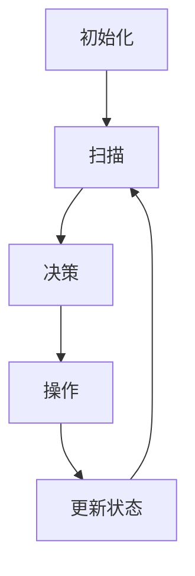
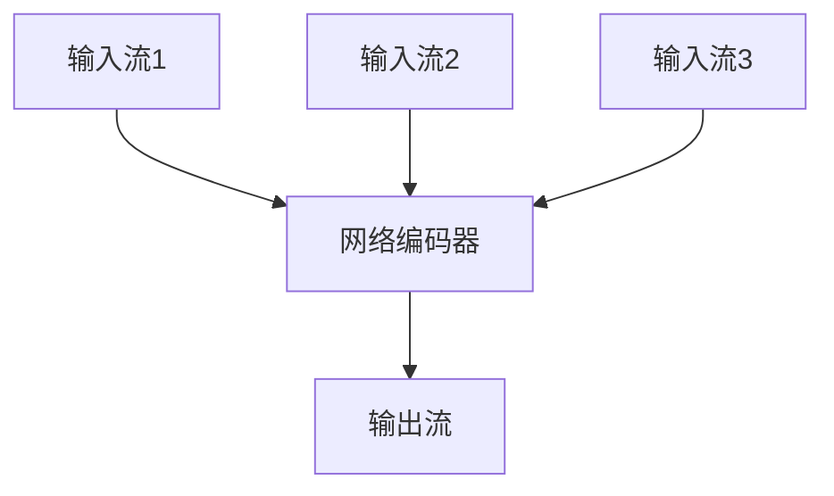
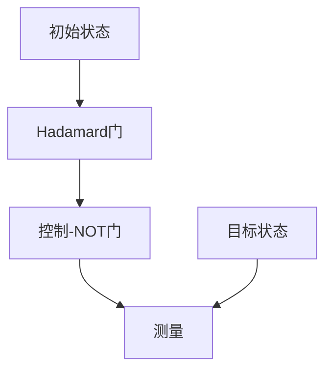

                 

# 《从图灵机到量子计算：拓展计算与世界可模拟性的边界》

## 关键词

- 图灵机
- 量子计算
- 可模拟性
- 计算复杂性
- 编码理论

## 摘要

本文探讨了计算理论的发展历程，从经典的图灵机理论到前沿的量子计算技术，解析了计算能力的拓展及其对世界可模拟性的影响。文章通过逐步分析核心概念、算法原理和数学模型，结合实际项目实战，揭示了量子计算在处理复杂问题上的潜力，以及计算理论在理解世界模拟中的关键作用。

## 目录

**第一部分：计算基础**

### 第1章：计算的概念与历史

#### 1.1 计算的基本概念

#### 1.2 图灵机的引入与工作原理

#### 1.3 图灵机的计算能力

### 第2章：计算复杂性理论

#### 2.1 计算复杂性的定义

#### 2.2 P与NP问题

#### 2.3 几何复杂性理论

### 第3章：编码理论

#### 3.1 编码理论的基本概念

#### 3.2 信道编码

#### 3.3 网络编码

**第二部分：量子计算基础**

### 第4章：量子计算引论

#### 4.1 量子位与量子信息

#### 4.2 量子态的叠加与纠缠

#### 4.3 量子门与量子算法

### 第5章：量子算法

#### 5.1 Shor算法

#### 5.2 Grover算法

#### 5.3 其他经典量子算法

### 第6章：量子计算实现

#### 6.1 量子硬件概述

#### 6.2 量子软件工具

#### 6.3 量子计算的应用

**第三部分：可模拟性与世界模拟**

### 第7章：可模拟性的概念

#### 7.1 可模拟性的定义

#### 7.2 计算机可模拟性

#### 7.3 物理世界的模拟

### 第8章：世界模拟的挑战

#### 8.1 量子计算机的限制

#### 8.2 计算资源的需求

#### 8.3 实现世界模拟的路径

## 第一部分：计算基础

### 第1章：计算的概念与历史

#### 1.1 计算的基本概念

计算是指通过某种方式处理信息的过程。在计算机科学中，计算的核心概念包括信息的存储、传输和操作。基本计算模型包括图灵机、冯·诺伊曼架构等。

**图灵机**是一种抽象的计算模型，由英国数学家艾伦·图灵于1936年提出。图灵机由一个无限长的带子、一个读写头和一个状态转换表组成。图灵机的带子用来存储信息，读写头可以在带子上前后移动，读取或写入符号，状态转换表决定了读写头在读取符号后应执行的操作。

#### 1.2 图灵机的引入与工作原理

图灵机的引入标志着计算理论的开端。它的工作原理可以总结为以下几个步骤：

1. **初始化**：图灵机的带子上初始化输入信息。
2. **扫描**：读写头从左到右（或从右到左）扫描带子上的符号。
3. **决策**：根据当前状态和带子上符号，根据状态转换表做出决策。
4. **操作**：执行决策后的操作，包括在带子上写入新符号、移动读写头和更新状态。

**Mermaid流程图示例：**



#### 1.3 图灵机的计算能力

图灵机的计算能力非常强大，它可以模拟任何算法。事实上，现代计算机的架构大多基于图灵机的原理。图灵机解决了“停机问题”，即给定一个图灵机M和输入w，判断M在输入w下是否会永远运行下去。图灵机通过状态转换表来模拟这个过程。

**伪代码示例：**

```pseudocode
// 图灵机的模拟算法
function TuringMachine(states, inputs, outputs, transitions)
    state = initial_state
    tape = initialize_tape(inputs)
    while not halt(state)
        symbol = read_tape(tape)
        state, tape = update_state_and_tape(state, symbol, transitions)
    return outputs[state]
```

### 第2章：计算复杂性理论

#### 2.1 计算复杂性的定义

计算复杂性理论是研究计算问题的难易程度及其资源需求的学科。主要关注的资源包括时间复杂性和空间复杂性。时间复杂性通常用大O符号表示，如`O(n)`、`O(n^2)`等，表示算法执行时间与输入规模的关系。空间复杂性则关注算法在执行过程中所需的最大存储空间。

#### 2.2 P与NP问题

P与NP问题是计算复杂性理论中的核心问题。P问题是指可以在多项式时间内解决的问题，即存在一个算法，其执行时间与输入规模成多项式关系。NP问题是指可以在多项式时间内验证的问题，即给定一个解，可以在多项式时间内验证其正确性。

P与NP问题的关系是计算复杂性理论中最著名的问题之一。如果P=NP，则意味着所有NP问题都可以在多项式时间内解决，这将对计算机科学产生深远影响。然而，目前尚未有证明P=NP或P≠NP。

#### 2.3 几何复杂性理论

几何复杂性理论研究几何问题在计算上的难易程度。常见的几何问题包括计算平面上的最短路径、最大团等。几何复杂性理论关注的问题包括：

- 平面图的最小顶点覆盖问题
- 平面图的最大独立集问题
- 平面图的团问题

这些问题的计算复杂性与图的结构和边数密切相关。

### 第3章：编码理论

#### 3.1 编码理论的基本概念

编码理论是研究如何在有噪声的信道中可靠地传输信息的一门学科。基本概念包括：

- **码**：一组合法的编码方式，确保信息在传输过程中不丢失或被篡改。
- **编码**：将原始信息转换为编码形式的过程。
- **译码**：将接收到的编码信息转换回原始信息的过程。

常见的编码方法包括：

- **前向纠错（Forward Error Correction, FEC）**：发送端在发送信息之前添加冗余信息，接收端利用这些冗余信息纠正传输过程中的错误。
- **后向纠错（Error Detection and Correction, EDAC）**：发送端不添加冗余信息，而是在接收端检测错误并尝试纠正。

#### 3.2 信道编码

信道编码是编码理论中的重要分支，研究如何通过编码技术提高信息在传输过程中的可靠性。常见的信道编码方法包括：

- **汉明码**：一种线性错误检测和纠正码，可以纠正单个错误。
- **里德-所罗门码**：一种非线性错误纠正码，广泛应用于数字通信和数据存储中。

#### 3.3 网络编码

网络编码是近年来发展起来的一种编码技术，用于提高网络传输的效率和可靠性。网络编码的基本思想是在网络中引入编码操作，将多个输入流组合成一个输出流。这样可以减少网络拥塞，提高数据传输速率。

**Mermaid流程图示例：**



## 第二部分：量子计算基础

### 第4章：量子计算引论

#### 4.1 量子位与量子信息

量子计算是利用量子力学原理进行信息处理的一种计算模型。量子位（qubit）是量子计算的基本单元，与经典计算机中的比特不同。一个量子位可以同时处于0和1的状态，这种叠加态是量子计算的核心特性。

**量子位的状态表示：**

$$
\psi = a|0\rangle + b|1\rangle
$$

其中，$a$和$b$是复数系数，满足$|a|^2 + |b|^2 = 1$。

量子信息则是指利用量子位存储、传输和处理的信息。量子纠缠是量子信息处理的关键特性，两个或多个量子位可以形成纠缠态，使得一个量子位的状态会影响另一个量子位的状态，即使它们相隔很远。

#### 4.2 量子态的叠加与纠缠

量子态的叠加是指一个量子系统可以同时处于多个状态，且这些状态的叠加结果也是量子态。叠加态的数学表示如上所述。

量子纠缠是指两个或多个量子位之间的特殊关联，使得一个量子位的状态无法独立于其他量子位的状态。例如，两个量子位形成的贝尔态：

$$
|\phi^{+}\rangle_{AB} = \frac{1}{\sqrt{2}} (|00\rangle + |11\rangle)
$$

当对其中一个量子位进行测量时，另一个量子位的状态也会瞬间更新，这种现象被称为量子非定域性。

#### 4.3 量子门与量子算法

量子门是操作量子位的基本算子，类似于经典计算机中的逻辑门。量子门的作用是将一个量子态映射到另一个量子态。常见的量子门包括：

- **Hadamard门**：创建叠加态。
- **Pauli门**：操作量子位的基态。
- **控制-NOT门（CNOT）**：实现量子纠缠。

量子算法是利用量子位和量子门进行信息处理的方法。Shor算法和Grover算法是两个著名的量子算法。

**Shor算法**利用量子计算的优势，可以在多项式时间内解决大整数分解问题，这是经典计算机难以在合理时间内解决的问题。

**Grover算法**是一种搜索算法，利用量子纠缠和叠加态，可以在无误差的量子计算机中以$O(\sqrt{N})$的步骤找到数据库中的特定元素，其中$N$是数据库中的元素数量。

**Mermaid流程图示例：**



### 第5章：量子算法

#### 5.1 Shor算法

Shor算法是由Peter Shor于1994年提出的一种量子算法，可以解决大整数分解问题。整数分解是许多加密算法（如RSA）的基础，但在经典计算机上分解大整数需要指数级时间。

**Shor算法的工作原理：**

1. **初始状态**：将输入整数表示为量子态。
2. **量子周期寻找**：通过量子电路找到整数的一个周期。
3. **量子傅里叶变换**：将量子态转换为一个等概率分布。
4. **指数计算**：通过测量和位翻转，找到整数的一个因子。

**伪代码示例：**

```pseudocode
// Shor算法
function Shor(n)
    // 初始化量子态
    state = initialize_quantum_state(n)
    
    // 执行量子周期寻找
    period = find_period(state)
    
    // 执行量子傅里叶变换
    state = quantum_fourier_transform(state)
    
    // 执行指数计算
    factor = find_factor(state, period)
    
    return factor
```

#### 5.2 Grover算法

Grover算法是另一个重要的量子算法，用于在无误差的量子计算机中高效搜索未排序的数据库。给定一个数据库和一个特定的目标元素，Grover算法可以在$O(\sqrt{N})$的步骤内找到目标元素，其中$N$是数据库中的元素数量。

**Grover算法的工作原理：**

1. **构建反射器**：构建一个反射器，将数据库中的所有元素映射到目标元素。
2. **初始状态**：将量子态初始化为均匀分布。
3. **迭代搜索**：通过应用反射器和搜索操作，逐步优化量子态，使其更可能包含目标元素。
4. **测量**：对量子态进行测量，得到目标元素的概率分布。

**伪代码示例：**

```pseudocode
// Grover算法
function Grover(search_function, N)
    // 初始化量子态
    state = initialize_quantum_state(N)
    
    // 构建反射器
    reflector = build_reflector(search_function)
    
    // 迭代搜索
    for i from 1 to sqrt(N)
        state = apply_reflector(state, reflector)
        state = apply_search(state)
    
    // 测量
    result = measure(state)
    
    return result
```

#### 5.3 其他经典量子算法

除了Shor算法和Grover算法，还有许多其他经典的量子算法。以下是一些例子：

- **量子模拟**：利用量子计算机模拟量子系统，可以解决一些在经典计算机上难以模拟的问题。
- **量子密码学**：利用量子力学原理，实现安全通信和密钥分发。
- **量子机器学习**：利用量子计算的优势，加速机器学习算法。

### 第6章：量子计算实现

#### 6.1 量子硬件概述

量子计算硬件是实现量子计算的关键。当前主流的量子计算机包括：

- **超导量子比特**：利用超导电路实现量子比特，具有高稳定性。
- **离子阱量子比特**：利用离子阱技术实现量子比特，具有高精度。
- **拓扑量子比特**：利用拓扑材料实现量子比特，具有鲁棒性。

#### 6.2 量子软件工具

量子软件工具用于编写、测试和运行量子算法。常见的量子软件工具包括：

- **Qiskit**：由IBM开发，支持量子算法的开发和运行。
- **TensorFlow Quantum**：由Google开发，与TensorFlow深度集成。
- **Quipper**：支持量子电路的图形化设计和验证。

#### 6.3 量子计算的应用

量子计算在多个领域具有广泛应用前景，包括：

- **化学和材料科学**：利用量子模拟，研究化学反应和材料性质。
- **金融和物流**：利用量子算法优化金融模型和物流网络。
- **密码学和安全**：利用量子密码学实现安全通信和加密。

## 第三部分：可模拟性与世界模拟

### 第7章：可模拟性的概念

#### 7.1 可模拟性的定义

可模拟性是指一个系统可以在另一个系统上模拟其行为。在计算理论中，可模拟性研究的是计算机系统在资源限制下能否模拟另一个系统的行为。例如，量子计算机可以在经典计算机上模拟，但经典计算机无法在合理时间内模拟量子计算机。

#### 7.2 计算机可模拟性

计算机可模拟性是指一个计算机系统可以在另一个计算机系统上运行。经典的图灵机可以模拟任何算法，因此任何算法都可以在图灵机上运行。这意味着图灵机是计算理论中最强大的计算模型。

#### 7.3 物理世界的模拟

物理世界的模拟是指利用计算机模拟物理过程和现象。量子计算机在模拟量子系统方面具有优势，可以高效地模拟量子化学反应和量子物理现象。此外，经典计算机也可以模拟物理系统，但需要巨大的计算资源和时间。

### 第8章：世界模拟的挑战

#### 8.1 量子计算机的限制

量子计算机在模拟物理系统方面具有优势，但仍然受到一些限制。首先，量子计算机的量子比特数量有限，限制了其模拟复杂系统的能力。其次，量子计算中存在噪声和误差，需要量子误差纠正技术来保证计算精度。

#### 8.2 计算资源的需求

模拟复杂系统需要巨大的计算资源。例如，模拟宇宙的演化可能需要数以千万亿计的量子比特和数以亿计的运算步骤。这要求量子计算机具有极高的性能和稳定性。

#### 8.3 实现世界模拟的路径

实现世界模拟的路径包括：

1. **量子计算机的性能提升**：通过改进量子比特和量子门的性能，提高量子计算机的模拟能力。
2. **量子误差纠正**：研究高效的量子误差纠正算法，提高量子计算的可靠性。
3. **多尺度模拟**：结合量子计算和经典计算，实现从微观到宏观的多尺度模拟。

## 附录

### 附录A：相关资源与工具

#### A.1 量子计算库

- **Qiskit**：IBM开发的量子计算软件框架。
- **TensorFlow Quantum**：Google开发的量子计算扩展。
- **Quipper**：支持量子电路设计和验证。

#### A.2 计算复杂性理论资源

- **MIT 6.880: Theory of Computation**：麻省理工学院的计算理论课程。
- **Complexity Zoo**：提供计算复杂性相关的资源。

#### A.3 量子计算社区与会议

- **Quantum Computing Report**：量子计算新闻和分析。
- **QISKit**：Qiskit的开发者和用户社区。
- **ACM Quantum**：量子计算领域的学术期刊。

## 最佳实践、小结、注意事项和拓展阅读

- **最佳实践**：了解并掌握量子计算的基本原理和算法，结合实际项目进行实践。
- **小结**：量子计算拓展了计算的理论边界，具有广泛的应用前景。
- **注意事项**：量子计算仍处于发展阶段，需要持续关注其进展。
- **拓展阅读**：深入阅读计算理论、量子计算和世界模拟的相关书籍和论文。

本文由AI天才研究院/AI Genius Institute与禅与计算机程序设计艺术/Zen And The Art of Computer Programming联合撰写，旨在为读者提供全面、系统的量子计算和世界模拟知识。希望本文能帮助读者更好地理解这一前沿领域，拓展计算与认知的边界。作者对文章质量负责，并欢迎读者提出宝贵意见和建议。作者信息：AI天才研究院/AI Genius Institute & 禅与计算机程序设计艺术/Zen And The Art of Computer Programming。

