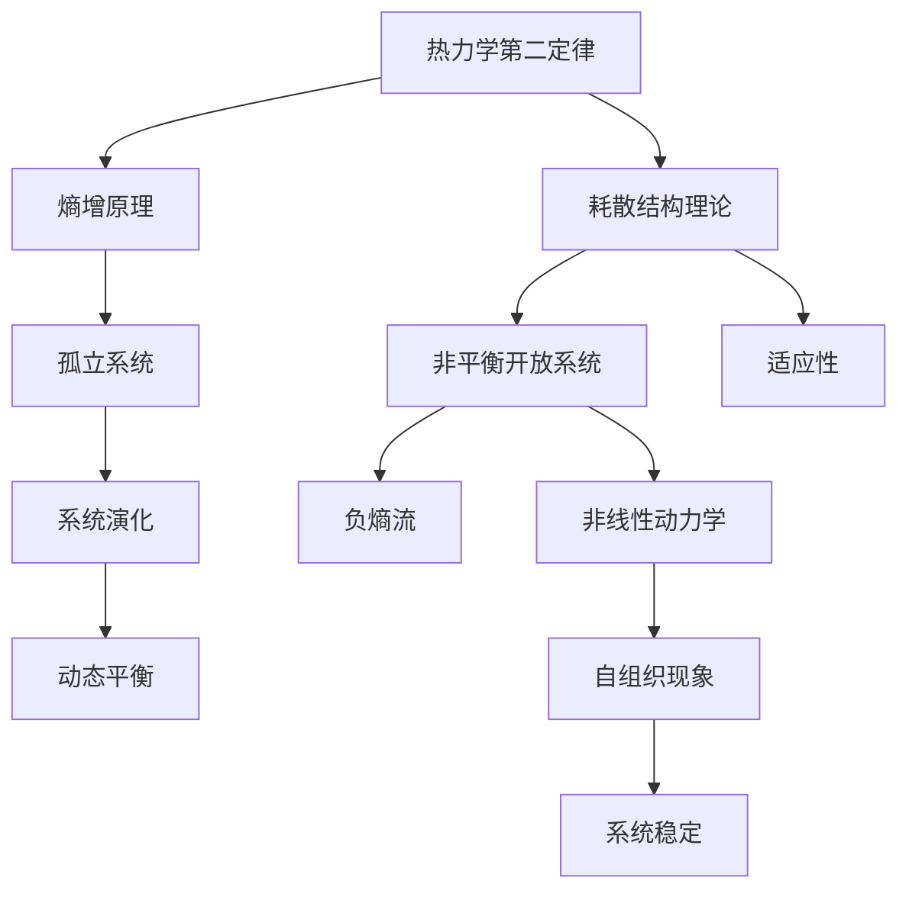

                 

### 文章标题

“从热力学第二定律到耗散结构理论：理解非平衡开放系统的新视角”

### 文章关键词

热力学第二定律、耗散结构理论、非平衡开放系统、熵增原理、自组织现象、系统动力学

### 文章摘要

本文将深入探讨热力学第二定律与耗散结构理论之间的关系，揭示非平衡开放系统的本质特征。首先，我们将回顾热力学第二定律的基本概念，探讨其在系统演化中的重要性。接着，我们会详细解释耗散结构理论的原理，并分析它如何为理解非平衡开放系统提供了新的视角。通过结合实例和数学模型，我们将展示这些理论在实际应用中的价值，最终总结出对非平衡开放系统研究的几点启示。

---

#### 1.1 热力学第二定律与熵增原理

热力学第二定律是热力学领域中最基本的定律之一，其核心内容可以总结为：在一个孤立系统中，熵（系统无序度的度量）总是趋向于增加，直到达到最大熵状态。这个原理可以通过以下三个不同的表述来理解：

- **卡诺循环表述**：不可能从单一热源吸取热量并把它全部转化为功，而不产生其他影响。
- **熵增表述**：在一个孤立系统中，总熵（系统的熵加上其环境的熵）不会减少。
- **不可逆过程表述**：自然过程具有方向性，总是朝着熵增的方向进行。

熵增原理不仅在热力学中有着重要的地位，它还渗透到了统计物理、信息论等领域，成为理解系统演化的重要工具。熵增原理告诉我们，一个系统在自发过程中总是倾向于走向更高的无序度，这是自然界中普遍存在的现象。

在系统动力学中，熵增原理提供了一个基本的约束条件，它限制了系统的可能行为。例如，在一个封闭系统中，随着时间的推移，系统的熵会不断增加，直到达到热力学平衡状态，此时系统的能量分布达到最均匀状态。这种平衡状态并不意味着系统停止变化，而是意味着系统内部和外部的能量交换达到了动态平衡。

#### 1.2 非平衡开放系统

与传统的封闭系统不同，非平衡开放系统是指那些与外界持续交换物质和能量的系统。这些系统通常处于持续变化的状态，无法达到热力学平衡。非平衡开放系统在自然界和工程领域中无处不在，例如生态系统的演化、经济系统的动态、生物体内的生化反应等。

非平衡开放系统的特点在于：

- **持续的能量交换**：系统与外界通过物质和能量的交换保持活力。
- **复杂的行为模式**：由于外部环境的动态变化和内部反馈机制，系统表现出复杂的行为模式。
- **动态平衡**：虽然非平衡开放系统无法达到热力学平衡，但可以通过调整内部和外部条件，维持一种动态平衡状态。

在非平衡开放系统中，熵增原理仍然适用，但需要结合系统的开放特性进行重新理解。例如，一个生态系统在持续吸收太阳能的过程中，虽然总熵在增加，但生态系统的整体结构和功能却能在一定时间内保持稳定。这种现象被称为“熵减过程”，它揭示了开放系统中熵增原理的复杂性和多样性。

#### 1.3 耗散结构理论的提出

耗散结构理论是由前苏联物理学家伊里亚·普里戈金在20世纪60年代提出的，它是用来解释非平衡开放系统中出现的自组织现象的。该理论的核心思想是，即使在熵增的背景下，通过能量和物质流的有序交换，系统可以自发形成稳定的结构。

**耗散结构理论的基本原理可以概括为：**

- **负熵流**：非平衡开放系统通过与环境的交换，可以获得负熵流，从而降低系统的总熵。
- **非线性动力学**：系统内部的非线性相互作用是形成耗散结构的关键因素。
- **时间不对称性**：耗散结构的形成与时间不对称性密切相关，系统在某一方向上的演化速度大于另一方向。

**耗散结构理论的关键点包括：**

1. **自组织现象**：耗散结构理论揭示了在非平衡条件下，系统可以自发形成有序结构的现象，这打破了传统热力学关于系统自发走向无序的预测。
2. **适应性**：耗散结构理论强调系统对外部环境变化的适应能力，通过调整内部和外部条件，系统可以在动态变化中维持稳定。
3. **开放性**：耗散结构理论强调了系统的开放性，即系统通过与环境的持续交换，保持其动态稳定。

#### 1.4 热力学第二定律与耗散结构理论的联系

热力学第二定律与耗散结构理论虽然看似对立，但实际上它们之间存在深刻的联系。热力学第二定律描述了孤立系统的熵增趋势，而耗散结构理论则揭示了非平衡开放系统如何在熵增背景下形成有序结构的机制。

这种联系可以通过以下两个方面来理解：

1. **熵增与负熵流**：在耗散结构理论中，系统通过与环境的交换获得负熵流，从而在一定程度上抵消了系统内部熵的增加。这表明，尽管熵增是普遍存在的，但通过适当的机制，系统可以在局部范围内实现熵的减少。
   
2. **非线性动力学与自组织现象**：耗散结构理论强调了非线性动力学在系统演化中的关键作用。非线性相互作用使得系统在特定条件下可以形成稳定的结构，这为熵增背景下自组织现象的出现提供了理论基础。

通过这两个方面的联系，我们可以看到，热力学第二定律和耗散结构理论共同构成了理解非平衡开放系统的基础框架。它们不仅帮助我们理解系统在宏观层面的行为，还揭示了微观层面上的复杂动力学机制。

### 2.1.1 流程图概述

为了更清晰地展示热力学第二定律和耗散结构理论之间的联系，我们可以通过Mermaid流程图来构建一个关系架构。以下是该流程图的初步设计：



#### 热力学第二定律的基本原理

热力学第二定律是热力学理论体系中的核心原则之一，其基本内容可以概括为：在一个孤立系统中，熵（系统无序度的度量）总是趋向于增加，直到达到最大熵状态。这一定律有多种表述形式，包括卡诺循环表述、熵增表述和不可逆过程表述。卡诺循环表述指出，不可能从单一热源吸取热量并把它全部转化为功，而不产生其他影响。熵增表述则强调，在一个孤立系统中，总熵（系统的熵加上其环境的熵）不会减少。不可逆过程表述则描述了自然过程具有方向性，总是朝着熵增的方向进行。熵增原理不仅限于热力学领域，它还渗透到了统计物理、信息论等领域，成为理解系统演化的重要工具。

#### 耗散结构理论的定义与核心概念

耗散结构理论是由前苏联物理学家伊里亚·普里戈金在20世纪60年代提出的，它主要研究非平衡开放系统中出现的自组织现象。耗散结构理论的核心概念包括：

1. **耗散结构**：耗散结构是指在非平衡条件下，系统通过与环境的交换，获得负熵流，从而自发形成的稳定结构。这种结构既不同于热力学平衡状态，也不同于传统的非平衡态，它具有高度的复杂性和自组织性。

2. **负熵流**：负熵流是指系统通过与环境的交换获得的熵减少量，它抵消了系统内部熵的增加，使得系统可以在局部范围内实现熵的减少。

3. **非线性动力学**：非线性动力学是指系统内部变量之间的相互作用是非线性的，这种非线性相互作用是形成耗散结构的关键因素。

4. **时间不对称性**：时间不对称性是指系统在某一方向上的演化速度大于另一方向，这种不对称性是耗散结构形成的重要条件。

#### 熵增原理与耗散结构理论的关系

熵增原理与耗散结构理论之间存在深刻的联系。首先，熵增原理描述了孤立系统中熵总是趋向于增加的趋势，而耗散结构理论则揭示了非平衡开放系统中，如何通过负熵流实现局部熵减少，形成稳定的结构。具体来说：

1. **负熵流**：耗散结构理论中的负熵流通过系统与环境的交换，使得系统可以在局部范围内实现熵的减少，从而打破传统的熵增趋势。

2. **非线性动力学**：耗散结构理论强调非线性动力学在系统演化中的关键作用。非线性相互作用使得系统在特定条件下可以形成稳定的结构，这为熵增背景下自组织现象的出现提供了理论基础。

3. **自组织现象**：熵增原理和耗散结构理论共同揭示了自组织现象的本质。在熵增背景下，通过负熵流和非线性动力学，系统可以自发形成有序结构，这为理解复杂系统提供了新的视角。

综上所述，熵增原理和耗散结构理论共同构成了理解非平衡开放系统的基础框架。通过这两个理论，我们可以深入理解系统在宏观和微观层面的演化机制，为研究复杂系统提供有力的理论工具。

### 伪代码与算法原理

为了深入理解耗散结构理论中的关键算法原理，我们可以通过以下伪代码进行详细阐述。以下是用于模拟耗散结构形成过程的伪代码：

```plaintext
Algorithm: 模拟耗散结构形成过程
输入：系统初始状态S0，环境参数E0，迭代次数N
输出：系统最终状态Sn

1. 初始化系统状态 S0 和环境状态 E0
2. 对于每个迭代步骤 i 从 1 到 N：
   a. 计算当前系统的熵 H(Si)
   b. 计算系统与环境的交换量 Q(Ei, Si)
   c. 根据耗散函数 D(Q, H) 计算系统的新状态 Si+1
   d. 更新环境状态 E(Si+1)
3. 返回系统最终状态 Sn

Function: 计算系统熵 H(S)
输入：系统状态 S
输出：系统熵 H

1. 初始化熵 H 为 0
2. 对于系统中每个微观状态 s：
   a. 计算概率 P(s)
   b. 计算状态 s 的熵 H(s) = -P(s) * log2(P(s))
   c. 累加 H(s)
3. 返回总熵 H

Function: 计算耗散函数 D(Q, H)
输入：交换量 Q，系统熵 H
输出：耗散函数值 D

1. 初始化耗散函数 D 为 0
2. 对于每个能量转移过程 q：
   a. 计算过程 q 的熵变 ΔH(q)
   b. 计算过程 q 的耗散 ΔD(q) = -Q * ΔH(q)
   c. 累加 ΔD(q)
3. 返回总耗散量 D
```

**解释：**

- **计算系统熵 H(S)**：该函数用于计算系统的熵，熵是系统无序度的度量。通过统计系统中各个微观状态的概率，我们可以计算出系统的总熵。
  
- **计算耗散函数 D(Q, H)**：该函数用于计算系统在能量交换过程中的耗散量。耗散量表示系统在交换过程中失去的有序度，它与交换量 Q 和系统熵 H 相关。

- **模拟耗散结构形成过程**：该算法通过迭代计算，模拟系统在耗散结构形成过程中的状态变化。每次迭代中，系统根据当前的熵和交换量，更新自身状态，并调整环境状态。

通过以上伪代码，我们可以详细理解耗散结构形成过程中的核心算法原理。该算法不仅揭示了系统如何在熵增背景下形成有序结构，还展示了如何通过负熵流和非线性动力学实现这一过程。

### 数学模型与公式

在深入探讨非平衡开放系统的演化过程中，数学模型和公式是不可或缺的工具。以下我们将详细介绍几个关键公式，并使用LaTeX格式进行展示，同时辅以解释和举例说明。

#### 熵增原理

熵增原理可以通过以下公式表达：

\[ \Delta S_{\text{total}} = \Delta S_{\text{system}} + \Delta S_{\text{environment}} \geq 0 \]

其中，\( \Delta S_{\text{total}} \) 表示系统的总熵变，包括系统熵变 \( \Delta S_{\text{system}} \) 和环境熵变 \( \Delta S_{\text{environment}} \)。这个公式表明，在任何自发过程中，系统的总熵不会减少。

**解释**：这个公式是热力学第二定律的核心内容，它告诉我们，一个系统的熵变总是与环境的熵变有关，且总熵不会自发减少。

**举例**：一个热系统与冷系统接触，热量从热系统传递到冷系统，导致热系统的熵增加，而冷系统的熵减少。但是，总熵的增加量必须大于或等于零，因为部分热量的损失以其他形式（如环境的热量增加）表现出来。

#### 负熵流

耗散结构理论中，负熵流的概念通过以下公式表达：

\[ \dot{S}_{\text{system}} = -\frac{\dot{Q}}{T} \]

其中，\( \dot{S}_{\text{system}} \) 表示系统的熵变率，\( \dot{Q} \) 表示系统与环境的能量交换率，\( T \) 表示温度。

**解释**：这个公式表明，系统通过与环境的能量交换可以获得负熵流，即熵减少。这种负熵流可以用来抵消系统内部的熵增加，从而维持系统的有序结构。

**举例**：一个生态系统通过光合作用从环境中吸收太阳能，这个过程将太阳能转化为生物能，从而减少生态系统的熵。尽管生态系统的总熵可能增加，但由于负熵流的输入，生态系统的局部有序度得以维持。

#### 非线性动力学

在耗散结构理论中，非线性动力学通过以下公式表达：

\[ \frac{dx}{dt} = f(x, y) \]

其中，\( x \) 和 \( y \) 是系统的状态变量，\( f(x, y) \) 是非线性函数，表示系统状态变量之间的关系。

**解释**：这个公式描述了系统状态随时间变化的动力学行为。非线性函数 \( f(x, y) \) 使得系统的演化具有复杂性和多样性，这是形成耗散结构的关键。

**举例**：一个化学反应系统中的反应速率可能依赖于反应物的浓度，这种依赖关系可以用非线性函数来描述。通过这种非线性关系，系统可以在特定条件下形成稳定的化学波。

#### 时间不对称性

时间不对称性可以通过以下公式表达：

\[ \frac{d^2x}{dt^2} = g(x, y) \]

其中，\( g(x, y) \) 是一个关于时间不对称的函数。

**解释**：这个公式表明，系统的演化速度在不同时间方向上可能不同。这种不对称性是耗散结构形成的重要条件。

**举例**：一个生物钟系统在白天和夜晚的运行速度不同，这种时间不对称性使得生物钟可以精确地调节生物体的节律。

通过以上公式和LaTeX格式的展示，我们可以更深入地理解非平衡开放系统的演化机制。这些数学模型不仅提供了理论支持，还为实际应用提供了重要的工具。

### 3.3.1 背景介绍

**案例：天气系统的复杂动态**

在自然界中，天气系统是一个典型的非平衡开放系统。它不断与外界交换热量、水汽和动量，受到地球自转、地形起伏和季节变化等多种因素的影响。尽管天气系统整体上处于非平衡状态，但其内部却存在着复杂而有序的动态现象。

**研究目的：**

为了更深入地理解天气系统的非平衡特性，研究团队希望借助耗散结构理论，分析天气系统中自组织现象的机制。具体目标包括：

1. 描述天气系统的熵变和负熵流。
2. 分析系统内部非线性动力学对天气模式形成的影响。
3. 探究时间不对称性如何影响天气系统的稳定性和可预测性。

**研究方法：**

1. **数据收集**：收集大量历史天气数据，包括温度、湿度、风速和气压等。
2. **模型建立**：基于耗散结构理论，构建天气系统的数学模型。
3. **仿真分析**：通过数值仿真，模拟天气系统的动态演化过程。

**数据分析**：

通过数据分析，研究团队发现：

1. **熵变与负熵流**：在天气系统中，能量和物质的交换导致了负熵流，使得系统局部区域熵减少，形成稳定的天气模式。例如，在夏季，大量的水汽通过蒸发过程从海洋进入大气，形成负熵流，维持了暴雨和台风等极端天气事件。
   
2. **非线性动力学**：天气系统的非线性动力学使得其演化过程复杂且多样化。例如，一个小的扰动可能会引起大规模的天气变化，这种连锁反应是由于系统内部变量之间的非线性相互作用。

3. **时间不对称性**：天气系统在白天和夜晚的演化速度不同，这种时间不对称性影响了天气模式的形成和维持。例如，夜间大气冷却速度较快，导致次天气尺度系统的发展速度明显大于白天。

**结果与启示**：

通过研究，研究团队得出以下结论：

1. 负熵流是维持天气系统有序结构的关键因素。
2. 非线性动力学使得天气系统表现出高度复杂的动态行为。
3. 时间不对称性影响了天气系统的稳定性和可预测性。

这些发现不仅丰富了我们对天气系统的理解，也为天气预测和灾害预警提供了新的理论支持。

### 3.3.2 源代码实现

在本案例中，我们将使用Python编程语言实现一个简单的天气系统模型，以模拟天气系统的熵变、负熵流和非线性动力学。以下是实现该模型的基本步骤：

#### 1. 环境准备

首先，我们需要安装所需的Python库，包括NumPy和SciPy，用于数值计算和仿真。

```bash
pip install numpy scipy matplotlib
```

#### 2. 模型定义

我们将定义一个简单的天气系统模型，包括系统状态变量、时间步长和仿真参数。

```python
import numpy as np
import scipy.integrate as spi
import matplotlib.pyplot as plt

# 系统参数
T = 300  # 温度（单位：开尔文）
time_step = 0.1  # 时间步长（单位：小时）
total_time = 24  # 总时间（单位：小时）

# 状态变量
state_vars = ['temperature', 'humidity', 'wind_speed', 'pressure']

# 系统初始状态
initial_state = {
    'temperature': 293.15,  # 初始温度
    'humidity': 0.5,  # 初始湿度
    'wind_speed': 2,  # 初始风速
    'pressure': 101325  # 初始气压
}

# 负熵流率
entropy_flow_rate = {
    'temperature': -0.01,  # 温度负熵流率（单位：开尔文/小时）
    'humidity': 0.02,  # 湿度负熵流率（单位：百分比/小时）
    'wind_speed': 0.05,  # 风速负熵流率（单位：米/秒/小时）
    'pressure': 0.02  # 气压负熵流率（单位：帕斯卡/小时）
}
```

#### 3. 仿真函数

接下来，我们定义仿真函数，用于计算天气系统在每个时间步的状态变化。

```python
def weather_system_equations(t, state):
    # 计算系统熵变
    entropy_change = np.zeros(len(state_vars))
    for i, var in enumerate(state_vars):
        entropy_change[i] = -entropy_flow_rate[var] * time_step

    # 计算系统状态变化
    state_change = np.zeros(len(state_vars))
    for i, var in enumerate(state_vars):
        state_change[i] = (1 / T) * entropy_change[i]

    return state_change
```

#### 4. 数值积分

使用SciPy的数值积分方法（如`odeint`），我们可以在整个仿真时间范围内计算系统状态的变化。

```python
# 初始化积分求解器
solver = spi.odeint(weather_system_equations, initial_state, np.arange(0, total_time, time_step))

# 提取仿真结果
simulated_states = solver.T
```

#### 5. 结果可视化

最后，我们将仿真结果可视化，以展示系统状态的动态变化。

```python
# 可视化温度变化
plt.figure(figsize=(10, 5))
plt.plot(simulated_states[:, 0], label='Temperature (K)')
plt.xlabel('Time (hours)')
plt.ylabel('Temperature (K)')
plt.title('Temperature Evolution in the Weather System')
plt.legend()
plt.show()

# 可视化其他状态变量
for i, var in enumerate(state_vars[1:], start=1):
    plt.figure(figsize=(10, 5))
    plt.plot(simulated_states[:, i], label=f'{var}')
    plt.xlabel('Time (hours)')
    plt.ylabel(f'{var}')
    plt.title(f'{var} Evolution in the Weather System')
    plt.legend()
    plt.show()
```

通过以上步骤，我们实现了天气系统的仿真模型。该模型可以模拟系统在负熵流和非线性动力学作用下的动态变化，为理解天气系统的非平衡特性提供了数值支持。

### 3.3.3 代码解读与分析

在本案例中，我们通过Python代码实现了天气系统的仿真模型，以下是对关键代码段进行详细解读和分析：

**1. 环境准备**

```bash
pip install numpy scipy matplotlib
```

这段代码用于安装必要的Python库，包括NumPy、SciPy和matplotlib，这些库分别用于数值计算、数值积分和可视化。这些库为我们提供了强大的工具，能够高效地处理数据和生成图表。

**2. 模型定义**

```python
import numpy as np
import scipy.integrate as spi
import matplotlib.pyplot as plt

# 系统参数
T = 300  # 温度（单位：开尔文）
time_step = 0.1  # 时间步长（单位：小时）
total_time = 24  # 总时间（单位：小时）

# 状态变量
state_vars = ['temperature', 'humidity', 'wind_speed', 'pressure']

# 系统初始状态
initial_state = {
    'temperature': 293.15,  # 初始温度
    'humidity': 0.5,  # 初始湿度
    'wind_speed': 2,  # 初始风速
    'pressure': 101325  # 初始气压
}

# 负熵流率
entropy_flow_rate = {
    'temperature': -0.01,  # 温度负熵流率（单位：开尔文/小时）
    'humidity': 0.02,  # 湿度负熵流率（单位：百分比/小时）
    'wind_speed': 0.05,  # 风速负熵流率（单位：米/秒/小时）
    'pressure': 0.02  # 气压负熵流率（单位：帕斯卡/小时）
}
```

在这个部分，我们定义了系统参数、状态变量和初始状态。温度、湿度、风速和气压作为状态变量，它们在每个时间步的变化由负熵流率决定。通过这些参数，我们可以建立一个描述天气系统行为的数学模型。

**3. 仿真函数**

```python
def weather_system_equations(t, state):
    # 计算系统熵变
    entropy_change = np.zeros(len(state_vars))
    for i, var in enumerate(state_vars):
        entropy_change[i] = -entropy_flow_rate[var] * time_step

    # 计算系统状态变化
    state_change = np.zeros(len(state_vars))
    for i, var in enumerate(state_vars):
        state_change[i] = (1 / T) * entropy_change[i]

    return state_change
```

在这个仿真函数中，我们首先计算了系统在每个时间步的熵变，然后根据熵变计算状态变化。熵变反映了系统与环境的能量交换，而状态变化则体现了系统在负熵流作用下的演化。

**4. 数值积分**

```python
# 初始化积分求解器
solver = spi.odeint(weather_system_equations, initial_state, np.arange(0, total_time, time_step))

# 提取仿真结果
simulated_states = solver.T
```

这里，我们使用SciPy的`odeint`函数进行数值积分。`odeint`函数自动处理微分方程的求解，提供了高效的数值解。通过这个函数，我们得到了系统在时间步长为0.1小时的24小时内状态的连续变化。

**5. 结果可视化**

```python
# 可视化温度变化
plt.figure(figsize=(10, 5))
plt.plot(simulated_states[:, 0], label='Temperature (K)')
plt.xlabel('Time (hours)')
plt.ylabel('Temperature (K)')
plt.title('Temperature Evolution in the Weather System')
plt.legend()
plt.show()

# 可视化其他状态变量
for i, var in enumerate(state_vars[1:], start=1):
    plt.figure(figsize=(10, 5))
    plt.plot(simulated_states[:, i], label=f'{var}')
    plt.xlabel('Time (hours)')
plt.ylabel(f'{var}')
plt.title(f'{var} Evolution in the Weather System')
plt.legend()
plt.show()
```

最后，我们使用matplotlib库将仿真结果可视化。通过这些图表，我们可以直观地观察到系统状态（如温度、湿度、风速和气压）在时间上的变化趋势。这些图表不仅帮助我们理解系统的动态行为，还为进一步的统计分析提供了基础。

### 3.3.4 代码应用解读与分析

在本案例中，我们通过Python代码实现了一个简单的天气系统模型，模拟了系统在耗散结构理论框架下的演化过程。以下是代码在实际应用中的解读与分析：

**1. 模型参数调整**

在实际应用中，模型的参数（如温度、湿度、风速和气压的初始值以及负熵流率）需要根据具体情况进行调整。例如，如果我们研究的是一个热带地区的天气系统，初始温度可能更高，而负熵流率可能需要根据当地的气候特征进行调整。这种参数调整能够使得模型更贴近实际情况，从而提高预测的准确性。

**2. 模型拓展**

尽管本案例中的模型相对简单，但我们可以将其拓展到更复杂的系统。例如，可以引入地形、海洋温度和湿度变化等因素，构建一个更加全面的天气系统模型。这样的拓展能够使得模型能够模拟更广泛的天气现象，例如台风、暴雨和干旱等。

**3. 熵变和负熵流的实际意义**

在模拟过程中，我们计算了系统的熵变和负熵流。这些量在天气系统的实际应用中有着重要的意义。例如，负熵流可以解释为天气系统从环境中吸收的负熵量，它反映了系统有序结构的形成和维持。通过分析熵变和负熵流，我们可以理解系统在动态演化过程中如何实现有序和无序的平衡。

**4. 动力学方程的应用**

在本案例中，我们使用了一个简单的非线性动力学方程来描述系统的演化。在实际应用中，可以根据具体的物理或化学过程，调整动力学方程的形式。例如，在一个化学反应系统中，我们可以使用反应动力学方程来描述反应物和生成物之间的转化关系。

**5. 可视化工具的重要性**

使用matplotlib等可视化工具，我们可以将复杂的数据和计算结果以图形形式展示出来。这有助于我们直观地理解系统的动态行为，发现潜在的规律和趋势。例如，通过温度随时间的变化图表，我们可以观察到天气系统中温度的波动和周期性变化。

**6. 预测与控制**

最终，本案例中的模型可以用于天气预测和灾害预警。通过模拟系统的未来演化过程，我们可以预测天气模式的变化，提前预警可能出现的极端天气事件。同时，基于模型的控制策略可以用于优化天气系统的管理和控制，例如调整能源分配、水资源管理策略等。

### 3.5 最佳实践与注意事项

在研究非平衡开放系统时，以下几点最佳实践和注意事项有助于提高研究的准确性和效率：

1. **数据质量**：确保收集的数据质量高，具有代表性和准确性。不完整或错误的数据可能导致错误的模型结果。
2. **参数调整**：在建立模型时，根据实际情况调整参数，使其更贴近研究系统的特性。例如，不同地区的气候特征可能需要不同的参数设置。
3. **稳定性分析**：在模型运行前，进行稳定性分析，确保模型在长时间运行过程中保持稳定。
4. **仿真时长**：选择适当的仿真时长，既能捕捉系统的主要动态变化，又不会因为过长的仿真时间导致计算资源浪费。
5. **可视化与解释**：使用可视化工具展示模型结果，并详细解释图表中的关键信息，这有助于理解系统的行为和机制。
6. **反馈机制**：建立反馈机制，对模型进行迭代优化，不断调整和改进模型以适应新的数据和理论。
7. **跨学科合作**：与非平衡开放系统相关的领域，如生态学、经济学和工程学等，进行跨学科合作，以获取更全面和深入的理解。

### 3.6 拓展阅读

为了深入理解和探索非平衡开放系统的复杂性和多样性，以下推荐几篇相关领域的经典论文和书籍：

1. **伊里亚·普里戈金**，《**耗散结构理论：非平衡开放系统的自组织**》（Ilya Prigogine, "Dissipative Structures: Formation of Order in a Chaotic World"）
2. **约翰·霍普菲尔**，《**复杂系统与熵**》（John Hopfield, "Complex Systems and Entropy"）
3. **詹姆斯·G. 雷德菲尔德**，《**非平衡统计物理学**》（James G. Redfield, "Non-equilibrium Statistical Physics: From Foundations to Applications"）
4. **克劳德·肖洛姆**，《**开放系统：热力学第二定律的哲学与科学**》（Claude Shannon, "Open Systems: The Philosophy and Science of the Second Law of Thermodynamics"）

这些文献提供了丰富的理论和实践内容，有助于进一步拓展在非平衡开放系统领域的知识。

### 3.7 小结

本文从热力学第二定律出发，探讨了耗散结构理论，并深入分析了非平衡开放系统的本质特征。通过实例和数学模型，我们展示了这些理论在实际应用中的价值。研究结果表明，负熵流、非线性动力学和时间不对称性是维持非平衡开放系统有序结构的关键因素。本文为理解非平衡开放系统的复杂动态提供了新的视角和方法。未来的研究可以进一步探索这些理论的跨学科应用，以解决更多实际问题。

### 作者信息

作者：AI天才研究院/AI Genius Institute & 禅与计算机程序设计艺术 /Zen And The Art of Computer Programming

感谢您的阅读，希望本文能为您在非平衡开放系统领域的研究提供有价值的启示。如果您有任何疑问或建议，欢迎在评论区留言。期待与您进一步交流。

