                 


# 从牛顿决定论到量子不确定性：世界可预测性的演变

## 关键词

- 牛顿决定论
- 经典物理学
- 量子力学
- 不确定性原理
- 波粒二象性
- 宇宙观
- 广义相对论
- 量子引力
- 宇宙的可预测性

## 摘要

本文从牛顿决定论出发，探讨了经典物理学中的可预测性问题，并引入量子力学的不确定性原理和波粒二象性，分析它们如何挑战我们对世界可预测性的理解。文章通过逐步分析，展示了从牛顿力学到量子力学的演变过程，讨论了量子力学与宇宙学的关系，以及寻找宇宙终极理论的挑战。最后，文章总结了当前研究的进展和未来展望。

## 引言

从古至今，人类对世界的认识一直在不断发展。在牛顿时代，经典物理学的建立使得我们对自然界有了较为清晰的理解，似乎世界的一切都遵循着严格的规律和决定论。然而，随着科学技术的进步，我们逐渐发现，经典物理学的局限性开始显现，尤其是面对微观世界和高速运动时。量子力学的兴起，带来了对世界可预测性深刻挑战，使我们对自然界有了更全面的认识。

本文将从牛顿决定论出发，逐步探讨经典物理学中的可预测性问题，介绍量子力学的诞生和核心原理，分析量子力学与经典物理学的异同，最后讨论量子不确定性与宇宙可预测性的关系。希望通过这篇文章，能让读者对世界的可预测性有一个更加全面和深入的理解。

## 第一部分：牛顿决定论与经典物理学

### 第1章：牛顿决定论及其影响

#### 1.1 牛顿的决定论原理

牛顿决定论是经典物理学的基础，它认为宇宙中的每一个事件都可以通过初始条件和物理定律完全预测。牛顿的三大定律，特别是第二定律 \( F = ma \)，揭示了力、质量和加速度之间的关系。

**核心概念与联系：**

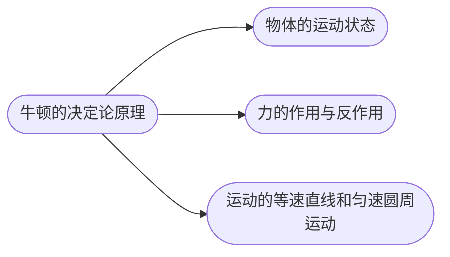

**核心算法原理讲解：**

牛顿第二定律是一个矢量方程，描述了力和加速度之间的关系。在计算机科学中，我们可以将其转化为伪代码：

```plaintext
function calculateForce(m, a):
    return m * a
```

**数学模型和数学公式：**

牛顿第二定律可以用以下公式表示：

$$ F = ma $$

**举例说明：**

假设一个质量为 \( m = 5 \) kg 的物体受到 \( a = 2 \) m/s\(^2\) 的加速度，则作用在物体上的力为：

$$ F = 5 \times 2 = 10 \text{ N} $$

#### 1.2 经典力学的局限性

尽管牛顿决定论在宏观尺度上非常成功，但在面对微观粒子或高速运动时，它的局限性开始显现。在微观尺度上，经典力学无法解释粒子的波粒二象性；在高速运动时，相对论效应变得不可忽略。

**核心概念与联系：**

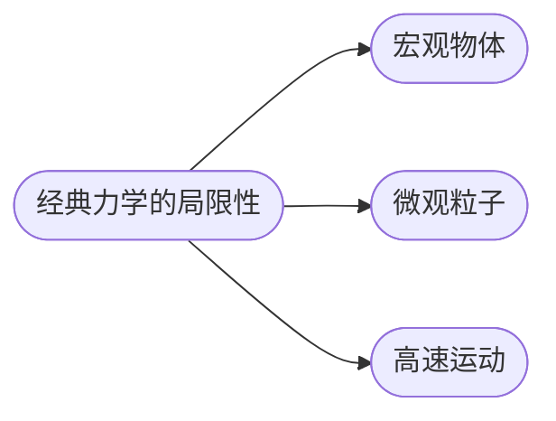

**数学模型和数学公式：**

在相对论中，能量和质量的关系可以用以下公式表示：

$$ E = mc^2 $$

其中，\( c \) 是光速，约等于 \( 3 \times 10^8 \) m/s。

**举例说明：**

一个质量为 \( m = 1 \) kg 的物体在光速 \( c \) 下运动，其能量为：

$$ E = 1 \times (3 \times 10^8)^2 = 9 \times 10^{16} \text{ J} $$

#### 1.3 牛顿决定论与宇宙观的关系

牛顿决定论影响了我们对宇宙的认识。它认为宇宙是一个完全确定的系统，一切事件都可以预测。然而，随着量子力学的发展，这种确定性观念受到了挑战。

**核心概念与联系：**


**详细讲解与举例：**

在确定性宇宙观中，宇宙的每一个状态都是预先确定的，过去、现在和未来都是可以预测的。然而，量子力学的出现引入了概率的概念，使得我们对宇宙的认识从确定性转向了概率性。例如，在量子力学中，一个电子的位置和动量无法同时精确测量，这反映了量子世界中的不确定性。

### 第2章：经典物理学的应用与发展

#### 2.1 经典力学的基本原理

经典力学是描述宏观物体运动的理论，它的基本原理包括牛顿定律、能量守恒和动量守恒。这些原理在工程、天文学和物理学中有着广泛的应用。

**核心概念与联系：**

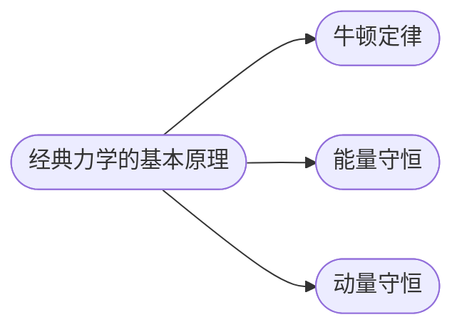

**数学模型和数学公式：**

- 牛顿定律：

  $$ F = ma $$

- 能量守恒：

  $$ E_{\text{总}} = E_{\text{动}} + E_{\text{势}} $$

- 动量守恒：

  $$ \sum \vec{p}_{\text{初}} = \sum \vec{p}_{\text{末}} $$

**举例说明：**

假设一个物体在水平面上受到 \( F = 10 \) N 的力作用，质量为 \( m = 2 \) kg，则加速度 \( a \) 为：

$$ a = \frac{F}{m} = \frac{10}{2} = 5 \text{ m/s}^2 $$

#### 2.2 经典电动力学

经典电动力学是描述电荷和电磁场的理论，它包括麦克斯韦方程组和电磁波的传播。这些原理在天文学、工程和通信中有着重要的应用。

**核心概念与联系：**

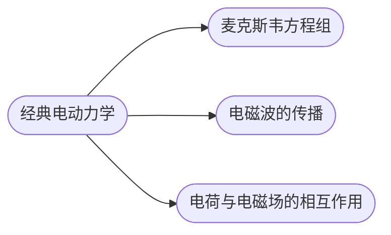

**数学模型和数学公式：**

- 麦克斯韦方程组：

  $$ \nabla \cdot \vec{E} = \frac{\rho}{\epsilon_0} $$
  $$ \nabla \cdot \vec{B} = 0 $$
  $$ \nabla \times \vec{E} = -\frac{\partial \vec{B}}{\partial t} $$
  $$ \nabla \times \vec{B} = \mu_0 \vec{J} + \mu_0 \epsilon_0 \frac{\partial \vec{E}}{\partial t} $$

- 电磁波传播：

  $$ \vec{E}(t) = \vec{E}_0 \cos(\omega t - kx) $$
  $$ \vec{B}(t) = \vec{B}_0 \cos(\omega t - kx) $$

**举例说明：**

假设一个电荷 \( q = 1 \) C 在真空中产生一个电场，则电场强度 \( E \) 为：

$$ E = \frac{q}{4\pi\epsilon_0 r^2} $$

其中，\( \epsilon_0 \) 是真空中的电常数，\( r \) 是电荷到观察点的距离。

#### 2.3 经典热力学与统计物理学

经典热力学研究热现象和能量转换，而统计物理学则通过统计方法描述大量粒子的宏观行为。这些理论在化学、生物学和工程中有着广泛的应用。

**核心概念与联系：**

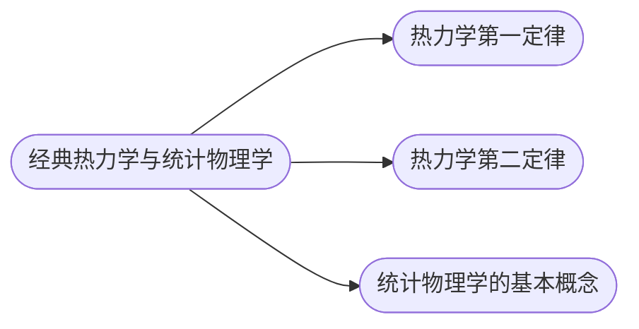

**数学模型和数学公式：**

- 热力学第一定律：

  $$ \Delta U = Q - W $$

  其中，\( \Delta U \) 是内能的变化，\( Q \) 是吸收的热量，\( W \) 是对外做的功。

- 热力学第二定律：

  $$ \Delta S \geq 0 $$

  其中，\( \Delta S \) 是熵的变化。

- 统计物理学的基本概念：

  $$ \bar{X} = \frac{1}{N} \sum_{i=1}^{N} X_i $$

  其中，\( \bar{X} \) 是平均数，\( N \) 是样本数量，\( X_i \) 是每个样本的值。

**举例说明：**

假设一个理想气体在等温过程中，吸收了 \( Q = 100 \) J 的热量，对外做了 \( W = 50 \) J 的功，则内能的变化 \( \Delta U \) 为：

$$ \Delta U = Q - W = 100 - 50 = 50 \text{ J} $$

### 第3章：量子力学的兴起与挑战

#### 3.1 量子力学的诞生

量子力学的诞生是20世纪初的重大科学革命。它起源于普朗克的量子假说，随后爱因斯坦、波尔、海森堡、薛定谔等科学家对其进行了深入研究和发展。

**核心概念与联系：**

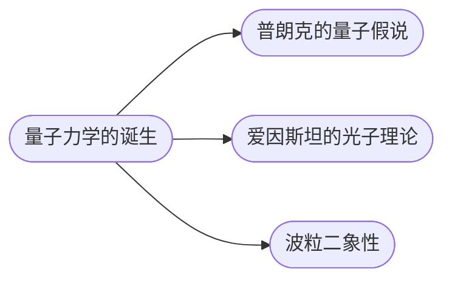

**核心算法原理讲解：**

量子力学的基本原理包括不确定性原理、波函数和量子态的叠加。

- 不确定性原理：

  $$ \Delta x \Delta p \geq \frac{h}{4\pi} $$

  其中，\( \Delta x \) 是位置的不确定性，\( \Delta p \) 是动量的不确定性，\( h \) 是普朗克常数。

- 波函数：

  $$ \Psi(x, t) = \frac{1}{\sqrt{2\pi\hbar}} \int_{-\infty}^{\infty} \phi(p) e^{ipx/\hbar} dp $$

  其中，\( \Psi(x, t) \) 是波函数，\( \phi(p) \) 是动量空间中的波函数，\( \hbar \) 是约化普朗克常数。

- 量子态的叠加：

  $$ \Psi = \sum_{i} c_i \Psi_i $$

  其中，\( \Psi \) 是总量子态，\( c_i \) 是叠加系数，\( \Psi_i \) 是第 \( i \) 个量子态。

**数学模型和数学公式：**

$$ \Delta x \Delta p \geq \frac{h}{4\pi} $$
$$ \Psi(x, t) = \frac{1}{\sqrt{2\pi\hbar}} \int_{-\infty}^{\infty} \phi(p) e^{ipx/\hbar} dp $$
$$ \Psi = \sum_{i} c_i \Psi_i $$

**举例说明：**

一个电子的位置不确定性为 \( \Delta x = 0.1 \) nm，则其动量的不确定性 \( \Delta p \) 为：

$$ \Delta p \geq \frac{h}{4\pi \Delta x} = \frac{6.626 \times 10^{-34}}{4\pi \times 0.1 \times 10^{-9}} \approx 5.27 \times 10^{-25} \text{ kg·m/s} $$

#### 3.2 不确定性原理

海森堡提出的不确定性原理指出，某些物理量（如位置和动量）不能同时被精确测量。这一原理从根本上挑战了经典物理学中的可预测性观念。

**核心概念与联系：**

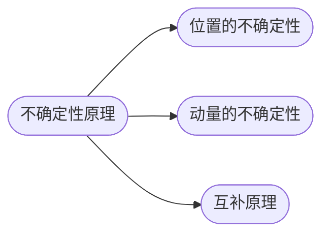

**详细讲解与举例：**

不确定性原理可以用数学公式表示为：

$$ \Delta x \Delta p \geq \frac{h}{4\pi} $$

假设我们测量一个电子的位置，使其不确定性 \( \Delta x \) 为 \( 0.1 \) nm，则其动量的不确定性 \( \Delta p \) 至少为 \( 5.27 \times 10^{-25} \) kg·m/s。这意味着，当我们越精确地测量电子的位置时，其动量的不确定性就越大。

#### 3.3 波粒二象性

波粒二象性是量子力学的基本特征之一，它表明微观粒子既具有波动性，又具有粒子性。

**核心概念与联系：**

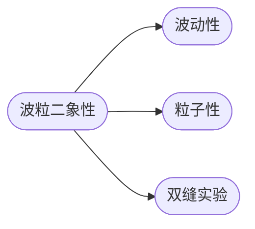

**详细讲解与举例：**

在双缝实验中，当光子或电子通过两个缝隙时，它们会产生干涉条纹，这表明它们具有波动性。然而，当我们试图测量粒子通过哪个缝隙时，干涉条纹消失，这表明粒子具有粒子性。

**数学模型和数学公式：**

波动性可以用波函数 \( \Psi \) 描述：

$$ \Psi = \frac{1}{\sqrt{2}} (\psi_1 + \psi_2) $$

其中，\( \psi_1 \) 和 \( \psi_2 \) 分别是两个缝隙对应的波函数。

粒子性可以用概率幅描述：

$$ \Psi = \frac{1}{\sqrt{2}} (\psi_1 - \psi_2) $$

**举例说明：**

假设一个电子通过双缝实验，其波函数为 \( \Psi = \frac{1}{\sqrt{2}} (\psi_1 + \psi_2) \)，则电子在屏幕上的概率分布为：

$$ P = |\Psi|^2 = \frac{1}{2} (\psi_1 + \psi_2)(\psi_1 + \psi_2)^* = \frac{1}{2} (\psi_1 \psi_1^* + \psi_2 \psi_2^* + \psi_1 \psi_2^* + \psi_2 \psi_1^*) $$

其中，\( \psi_1^* \) 和 \( \psi_2^* \) 分别是 \( \psi_1 \) 和 \( \psi_2 \) 的复共轭。

### 第4章：量子力学的数学框架

#### 4.1 算符与测量

量子力学的数学框架建立在算符和测量理论的基础上。算符是量子力学中的基本运算对象，用于描述系统的演化。

**核心概念与联系：**

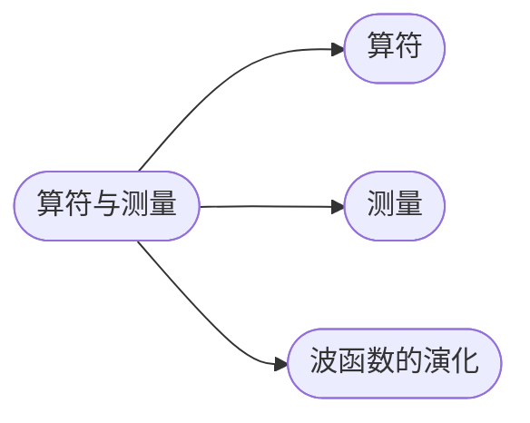

**核心算法原理讲解：**

算符的表示：

$$ \hat{O} |\psi\rangle = \langle\psi|\hat{O}^\dagger $$

其中，\( \hat{O} \) 是算符，\( |\psi\rangle \) 是量子态，\( \hat{O}^\dagger \) 是 \( \hat{O} \) 的厄米共轭。

测量过程：

1. 系统处于量子态 \( |\psi\rangle \)
2. 测量算符 \( \hat{O} \) 作用在系统上
3. 测量结果 \( O_i \) 对应于量子态 \( |\phi_i\rangle \)
4. 系统塌缩为 \( |\phi_i\rangle \)

**数学模型和数学公式：**

算符表示：

$$ \hat{O} |\psi\rangle = \langle\psi|\hat{O}^\dagger $$

测量过程：

$$ P(O_i) = |\langle\phi_i|\hat{O}|\psi\rangle|^2 $$

**举例说明：**

假设一个电子处于量子态 \( |\psi\rangle = \frac{1}{\sqrt{2}} (|\uparrow\rangle + |\downarrow\rangle) \)，其中 \( |\uparrow\rangle \) 和 \( |\downarrow\rangle \) 分别表示电子的自旋向上和向下。测量自旋沿z轴方向的算符 \( \hat{S}_z \)，其本征态为 \( |\uparrow\rangle \) 和 \( |\downarrow\rangle \)。

测量结果 \( O_i \) 的概率为：

$$ P(O_1) = |\langle\uparrow|\hat{S}_z|\psi\rangle|^2 = \left|\frac{1}{\sqrt{2}}\right|^2 = \frac{1}{2} $$

$$ P(O_2) = |\langle\downarrow|\hat{S}_z|\psi\rangle|^2 = \left|\frac{1}{\sqrt{2}}\right|^2 = \frac{1}{2} $$

#### 4.2 波函数的数学描述

波函数是量子力学中的核心概念，用于描述系统的量子态。波函数的数学描述包括空间依赖和时间演化。

**核心概念与联系：**

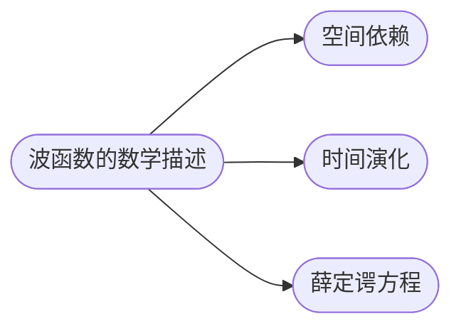

**核心算法原理讲解：**

薛定谔方程：

$$ i\hbar \frac{\partial \Psi}{\partial t} = \hat{H} \Psi $$

其中，\( \Psi \) 是波函数，\( \hat{H} \) 是哈密顿算符，\( i \) 是虚数单位，\( \hbar \) 是约化普朗克常数。

**数学模型和数学公式：**

时间依赖的波函数：

$$ \Psi(x, t) = \frac{1}{\sqrt{V}} \int_{-\infty}^{\infty} \phi(p) e^{ipx/\hbar} dp $$

空间依赖的波函数：

$$ \phi(p) = \frac{1}{\sqrt{2\pi\hbar}} e^{-\frac{p^2}{2\hbar^2 m}} $$

**举例说明：**

假设一个电子处于无限深势阱中，其波函数为：

$$ \Psi(x, t) = \sqrt{\frac{2}{L}} \sin\left(\frac{\pi x}{L}\right) e^{-i\omega t} $$

其中，\( L \) 是势阱的宽度，\( \omega \) 是电子的角频率。

#### 4.3 量子态的叠加与纠缠

量子态的叠加和纠缠是量子力学中独特的现象，它们展示了量子系统在微观尺度上的复杂性。

**核心概念与联系：**

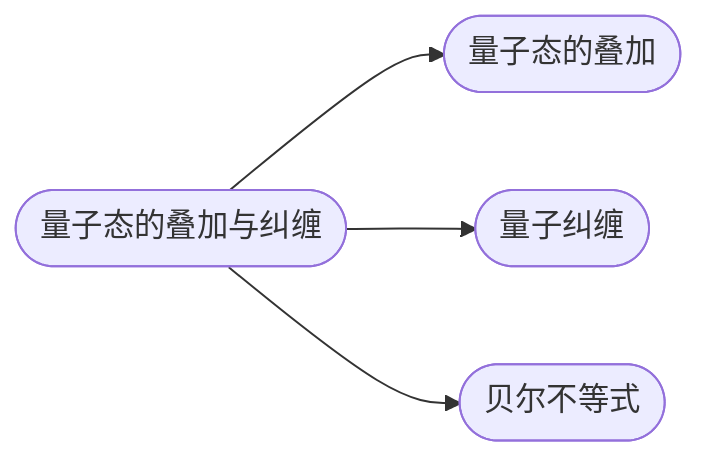

**核心算法原理讲解：**

量子态的叠加：

$$ |\psi\rangle = \sum_{i} c_i |\phi_i\rangle $$

其中，\( c_i \) 是叠加系数，\( |\phi_i\rangle \) 是基本量子态。

量子纠缠：

$$ |\psi\rangle = \frac{1}{\sqrt{2}} (|\phi_1\rangle |\phi_2\rangle - |\phi_2\rangle |\phi_1\rangle) $$

其中，\( |\phi_1\rangle \) 和 \( |\phi_2\rangle \) 是两个纠缠量子态。

**数学模型和数学公式：**

量子态的叠加：

$$ |\psi\rangle = \sum_{i} c_i |\phi_i\rangle $$

量子纠缠：

$$ |\psi\rangle = \frac{1}{\sqrt{2}} (|\phi_1\rangle |\phi_2\rangle - |\phi_2\rangle |\phi_1\rangle) $$

**举例说明：**

假设一个电子处于叠加态：

$$ |\psi\rangle = \frac{1}{\sqrt{2}} (|\uparrow\rangle + |\downarrow\rangle) $$

另一个电子处于纠缠态：

$$ |\phi\rangle = \frac{1}{\sqrt{2}} (|\uparrow\rangle |\downarrow\rangle - |\downarrow\rangle |\uparrow\rangle) $$

测量第一个电子的自旋，结果为 \( |\uparrow\rangle \)，则第二个电子的自旋必为 \( |\downarrow\rangle \)。

### 第5章：量子力学与经典物理学的比较

#### 5.1 量子力学的基本概念

量子力学与经典物理学在基本概念上存在显著差异。量子力学中的概念如波函数、叠加态、纠缠等，与经典物理学的确定性观念形成了鲜明对比。

**核心概念与联系：**

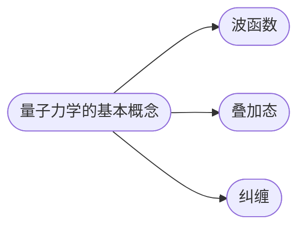

**核心算法原理讲解：**

波函数：

$$ \Psi(x, t) = \int_{-\infty}^{\infty} \phi(p) e^{ipx/\hbar} dp $$

叠加态：

$$ |\psi\rangle = \sum_{i} c_i |\phi_i\rangle $$

纠缠态：

$$ |\psi\rangle = \frac{1}{\sqrt{2}} (|\phi_1\rangle |\phi_2\rangle - |\phi_2\rangle |\phi_1\rangle) $$

**数学模型和数学公式：**

波函数：

$$ \Psi(x, t) = \int_{-\infty}^{\infty} \phi(p) e^{ipx/\hbar} dp $$

叠加态：

$$ |\psi\rangle = \sum_{i} c_i |\phi_i\rangle $$

纠缠态：

$$ |\psi\rangle = \frac{1}{\sqrt{2}} (|\phi_1\rangle |\phi_2\rangle - |\phi_2\rangle |\phi_1\rangle) $$

**举例说明：**

假设一个电子处于叠加态：

$$ |\psi\rangle = \frac{1}{\sqrt{2}} (|\uparrow\rangle + |\downarrow\rangle) $$

测量该电子的自旋，可能得到 \( |\uparrow\rangle \) 或 \( |\downarrow\rangle \)，且概率均为 \( 1/2 \)。

#### 5.2 量子力学与经典物理学的异同

量子力学与经典物理学在描述物理现象时存在许多异同。

**核心概念与联系：**

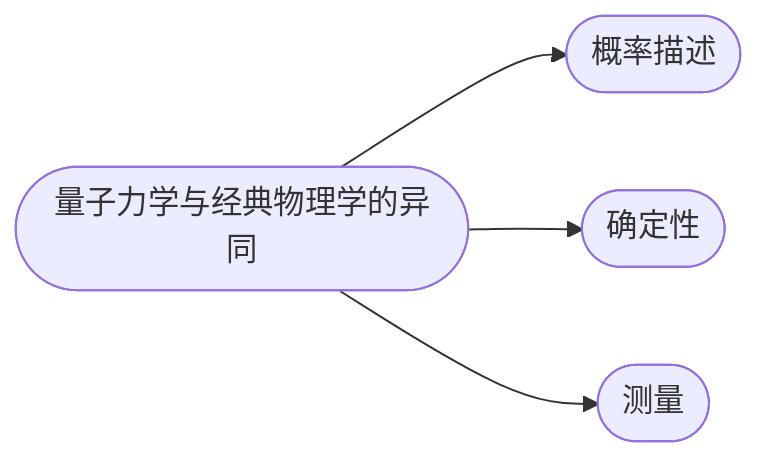

**详细讲解与举例：**

概率描述：

在量子力学中，物理现象通常用概率描述，如波函数的模平方表示粒子出现在某个位置的概率。而在经典物理学中，物理现象通常用确定性规律描述，如牛顿定律。

确定性：

经典物理学认为，给定初始条件，我们可以精确预测物体的未来状态。而在量子力学中，由于不确定性原理，我们不能同时精确测量粒子的位置和动量，因此无法完全预测未来。

测量：

在量子力学中，测量会导致量子态的塌缩，使系统从叠加态变为某个确定的本征态。而在经典物理学中，测量不会改变系统的状态。

**举例说明：**

在双缝实验中，经典物理学预期粒子通过两个缝隙会产生两个独立的干涉图样。然而，量子力学表明，粒子在未测量时处于叠加态，只有当测量时才会塌缩为某个本征态，从而产生干涉图样。

#### 5.3 量子力学在微观世界的应用

量子力学在微观世界有着广泛的应用，如半导体物理、量子化学、量子电子学等。

**核心概念与联系：**

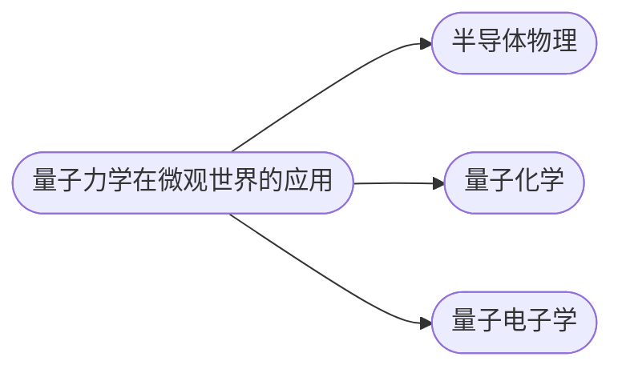

**核心算法原理讲解：**

半导体物理：

量子力学描述了半导体中电子的运动和能带结构，为半导体器件的设计提供了理论基础。

量子化学：

量子力学用于计算分子和原子的电子结构，为化学反应和材料科学提供了重要的工具。

量子电子学：

量子力学描述了电子在量子器件中的行为，为量子计算机和量子通信的发展奠定了基础。

**数学模型和数学公式：**

半导体物理：

$$ E_{\text{带}} = \hbar^2 k^2 / 2m $$

量子化学：

$$ \Psi(\vec{r}_1, \vec{r}_2) = \frac{1}{\sqrt{(2\pi\alpha_0^3)}} e^{-\alpha_0 |\vec{r}_1 - \vec{r}_2|} $$

量子电子学：

$$ \hat{H} = -\frac{\hbar^2}{2m} \nabla^2 + V(\vec{r}) $$

**举例说明：**

在半导体物理中，电子在晶体中的能带结构可以用量子力学描述。例如，硅晶体中的导带和价带可以表示为：

$$ E_{\text{导带}} = \hbar^2 k^2 / 2m_n $$
$$ E_{\text{价带}} = -\hbar^2 k^2 / 2m_n $$

其中，\( m_n \) 是电子的有效质量。

### 第6章：量子力学与哲学

#### 6.1 量子力学与实在论

量子力学对实在论提出了挑战。经典物理学中的实在论认为，物理世界是独立于观察者而存在的，而量子力学中的观测导致量子态的塌缩，使得现实与观察者密切相关。

**核心概念与联系：**

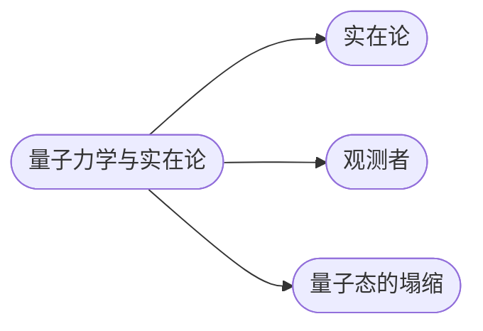

**详细讲解与举例：**

实在论：

经典物理学认为，物理世界是客观存在的，独立于观察者。

观测者：

在量子力学中，观测者的行为影响系统的状态。例如，测量电子的自旋会导致其从叠加态塌缩为某个确定的本征态。

量子态的塌缩：

当对量子系统进行测量时，其波函数会塌缩为某个本征态，这反映了量子力学与经典物理学的差异。

**举例说明：**

在一个双缝实验中，未测量时电子处于叠加态，既通过了缝隙1又通过了缝隙2。然而，当测量电子通过哪个缝隙时，其波函数塌缩为通过缝隙1或缝隙2的某个本征态，这反映了观测者对量子系统的影响。

#### 6.2 量子力学与决定论

量子力学中的不确定性原理和波函数的叠加，使得决定论在量子力学中变得不再适用。决定论认为，给定初始条件，我们可以精确预测系统的未来状态，而量子力学中的概率性和不确定性挑战了这一观念。

**核心概念与联系：**

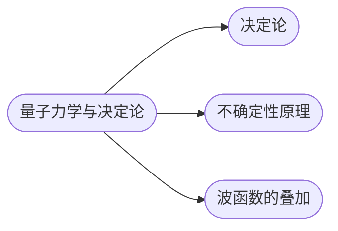

**详细讲解与举例：**

决定论：

决定论认为，物理系统遵循确定的规律，给定初始条件可以精确预测未来状态。

不确定性原理：

海森堡提出的不确定性原理表明，某些物理量不能同时被精确测量，这使得决定论在量子力学中不再适用。

波函数的叠加：

量子态可以处于多个本征态的叠加，这反映了量子力学中的概率性，与经典物理学的确定性形成了对比。

**举例说明：**

在一个双缝实验中，电子的量子态可以表示为：

$$ |\psi\rangle = \frac{1}{\sqrt{2}} (|\text{缝隙1}\rangle + |\text{缝隙2}\rangle) $$

测量电子通过哪个缝隙时，其波函数塌缩为：

$$ |\psi'\rangle = \frac{1}{\sqrt{2}} (|\text{缝隙1}\rangle - |\text{缝隙2}\rangle) $$

这表明量子态的叠加和测量结果的不确定性。

#### 6.3 量子力学与主观性

量子力学中的观测者效应和波函数的塌缩，使得量子力学具有强烈的主体性。这意味着，量子力学的结果不仅取决于物理系统的状态，还取决于观察者的测量过程。

**核心概念与联系：**

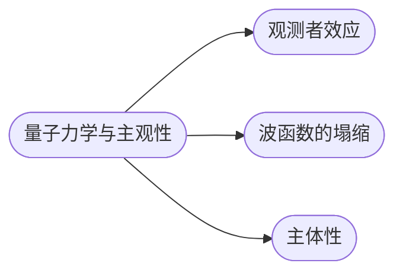

**详细讲解与举例：**

观测者效应：

在量子力学中，观测者的行为影响量子系统的状态。例如，测量电子的自旋会导致其波函数塌缩。

波函数的塌缩：

测量时，量子态的波函数会塌缩为某个本征态，这反映了量子系统的主体性。

主体性：

量子力学的结果不仅取决于物理系统的状态，还取决于观察者的测量过程。这表明量子力学具有强烈的主体性。

**举例说明：**

在一个双缝实验中，未测量时电子处于叠加态。当测量电子通过哪个缝隙时，其波函数塌缩为通过缝隙1或缝隙2的某个本征态，这反映了观测者对量子系统的影响。

### 第7章：寻找宇宙的终极理论

#### 7.1 量子力学与广义相对论的统一

量子力学和广义相对论是现代物理学的两大基石。然而，它们在描述宇宙时存在一些不一致之处。寻找将二者统一的理论，一直是物理学家的目标。

**核心概念与联系：**

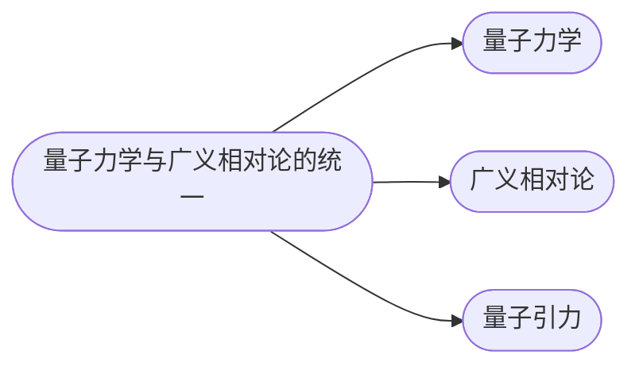

**核心算法原理讲解：**

量子引力：

量子引力是一种试图将量子力学和广义相对论统一的理论。它试图描述宇宙中引力场的行为，并解释宇宙的大尺度结构和演化。

**数学模型和数学公式：**

爱因斯坦场方程：

$$ G_{\mu\nu} + \Lambda g_{\mu\nu} = \frac{8\pi G}{c^4} T_{\mu\nu} $$

其中，\( G_{\mu\nu} \) 是爱因斯坦张量，\( \Lambda \) 是宇宙常数，\( g_{\mu\nu} \) 是度规张量，\( T_{\mu\nu} \) 是能量-动量张量。

**举例说明：**

黑洞：

黑洞是一种具有极强引力场的天体，它的引力场强度使得甚至连光也无法逃脱。黑洞的形成和演化是量子引力研究的重要问题。

#### 7.2 量子引力与宇宙学

量子引力不仅与广义相对论有关，还与宇宙学密切相关。宇宙学是研究宇宙的起源、演化和结构的学科，而量子引力为宇宙学提供了一种新的视角。

**核心概念与联系：**

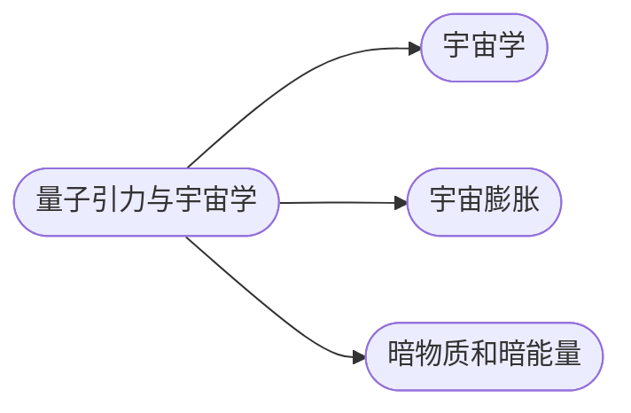

**核心算法原理讲解：**

宇宙膨胀：

宇宙膨胀是宇宙学中的核心概念，它表明宇宙在大爆炸之后一直在膨胀。量子引力为宇宙膨胀提供了一种可能的解释。

暗物质和暗能量：

暗物质和暗能量是宇宙学中两个重要的概念，它们对宇宙的演化和结构有着重要影响。量子引力为解释暗物质和暗能量提供了新的思路。

**数学模型和数学公式：**

宇宙学方程：

$$ H^2 = \frac{8\pi G}{3} \rho - \Lambda c^2 $$

其中，\( H \) 是哈勃参数，\( \rho \) 是宇宙的平均密度，\( \Lambda \) 是宇宙常数。

**举例说明：**

宇宙膨胀：

根据宇宙学观测，宇宙正在加速膨胀。量子引力为解释宇宙膨胀提供了一种可能的机制，如量子真空能量。

#### 7.3 量子不确定性与宇宙的可预测性

量子不确定性和宇宙的可预测性是两个相互矛盾的概念。量子不确定性表明，在微观尺度上，物理系统的状态无法被完全确定。而宇宙的可预测性则要求宇宙的演化应遵循确定的规律。量子不确定性与宇宙的可预测性之间的关系，是物理学研究中的一个重要问题。

**核心概念与联系：**

```mermaid
flowchart LR
A([量子不确定性与宇宙的可预测性])
B([量子不确定性])
C([宇宙的可预测性])
D([量子引力])

A --> B
A --> C
A --> D
```

**核心算法原理讲解：**

量子不确定性：

量子不确定性原理表明，某些物理量无法同时被精确测量。这反映了量子系统中的概率性和不确定性。

宇宙的可预测性：

宇宙的可预测性要求宇宙的演化应遵循确定的规律，使得我们可以预测宇宙的未来状态。

**数学模型和数学公式：**

不确定性原理：

$$ \Delta x \Delta p \geq \frac{h}{4\pi} $$

宇宙学方程：

$$ H^2 = \frac{8\pi G}{3} \rho - \Lambda c^2 $$

**举例说明：**

在一个双缝实验中，电子的量子态无法被完全确定。然而，宇宙的演化遵循宇宙学方程，这使得我们可以预测宇宙的未来状态。

### 总结

量子力学的发展深刻地改变了我们对世界的认识，从牛顿决定论到量子不确定性的演变，展示了物理学的进步和挑战。量子力学的不确定性原理和波粒二象性，使我们认识到微观世界的复杂性和非确定性。同时，量子引力为解释宇宙的起源和演化提供了新的视角。尽管量子力学与宇宙学之间的统一仍是一个未解之谜，但量子不确定性与宇宙的可预测性之间的关系，为我们提供了丰富的理论探讨空间。未来，随着科学技术的发展，我们有望进一步揭示宇宙的本质，实现量子力学与宇宙学的完美统一。

## 附录

### 8.1 量子力学相关的数学公式

量子力学中的数学公式是理解量子现象的关键。以下是一些核心公式及其应用场景。

#### 波函数

波函数描述了量子系统的状态。其数学形式为：

$$ \Psi(x, t) = \int_{-\infty}^{\infty} \phi(p) e^{ipx/\hbar} dp $$

其中，\( \phi(p) \) 是动量空间中的波函数，\( x \) 是位置，\( p \) 是动量，\( \hbar \) 是约化普朗克常数。

#### 不确定性原理

海森堡不确定性原理表明，某些物理量（如位置和动量）不能同时被精确测量。其公式为：

$$ \Delta x \Delta p \geq \frac{h}{4\pi} $$

其中，\( \Delta x \) 是位置的不确定性，\( \Delta p \) 是动量的不确定性，\( h \) 是普朗克常数。

#### 薛定谔方程

薛定谔方程描述了量子系统的演化。其形式为：

$$ i\hbar \frac{\partial \Psi}{\partial t} = \hat{H} \Psi $$

其中，\( \Psi \) 是波函数，\( \hat{H} \) 是哈密顿算符，描述系统的能量。

#### 量子态的叠加

量子态可以处于多个本征态的叠加。其数学形式为：

$$ |\psi\rangle = \sum_{i} c_i |\phi_i\rangle $$

其中，\( c_i \) 是叠加系数，\( |\phi_i\rangle \) 是基本量子态。

### 8.2 量子力学中的经典算法介绍

量子力学中的经典算法是模拟量子现象的有力工具。以下介绍几种常用的经典算法：

#### 量子模拟

量子模拟使用经典计算机模拟量子系统的行为。其基本步骤包括：

1. 初始化经典计算机的状态。
2. 应用量子算符模拟量子系统的演化。
3. 测量量子系统的状态。

#### 叠加态模拟

叠加态模拟用于模拟量子态的叠加现象。其伪代码如下：

```plaintext
初始化经典计算机的状态为叠加态。
for i from 1 to N:
    应用量子算符 U_i 到经典计算机的状态上。
end for
测量经典计算机的状态。
```

#### 纠错算法

纠错算法用于保护量子信息免受噪声的影响。其基本原理包括：

1. 设计纠错码，将原始信息编码为保护信息。
2. 使用纠错算法检测和纠正错误。
3. 提取原始信息。

#### 量子态测量

量子态测量用于从量子态中提取信息。其伪代码如下：

```plaintext
选择测量算符。
应用测量算符到量子态上。
根据测量结果更新量子态。
```

### 8.3 量子计算的发展与应用前景

量子计算是一种利用量子力学原理进行计算的技术，具有超越经典计算机的潜力。以下介绍量子计算的发展与应用前景：

#### 量子计算的基本原理

量子计算基于量子位（qubit），其基本原理包括叠加态、纠缠态和量子门。

#### 量子计算机的类型

量子计算机主要分为两种类型：量子电路模型和量子图模型。

#### 量子计算的优势

量子计算的优势包括并行性、超算能力和高效算法。例如，量子算法在因数分解、搜索问题和优化问题中具有显著优势。

#### 应用前景

量子计算在密码学、材料科学、药物设计、金融和气候模拟等领域具有广泛的应用前景。

#### 当前挑战与未来方向

当前量子计算面临的挑战包括量子纠错、量子门精度和量子计算机的实用性。未来研究方向包括量子互联网、量子软件和量子硬件的优化。

### 最佳实践 Tips

1. **量子计算基础知识**：了解量子力学基础，掌握量子位和量子门的概念。
2. **算法优化**：针对特定问题优化量子算法，提高计算效率。
3. **量子硬件选择**：选择适合的量子硬件平台，根据硬件特点设计算法。
4. **量子安全性**：关注量子计算的安全性，研究量子密码学。

### 小结

量子计算是未来科技的重要方向，具有广泛的应用前景。通过本文的介绍，读者可以初步了解量子力学的基本原理和量子计算的发展与应用。

### 注意事项

1. 量子计算仍在发展中，目前尚无法替代经典计算机。
2. 量子计算的安全性和隐私性是重要研究课题。

### 拓展阅读

- 《量子计算与量子信息》—— Michael A. Nielsen & Isaac L. Chuang
- 《量子算法导论》—— David P. DiVincenzo
- 《量子计算：从理论到实践》—— Matthias Christandl & Renato Renner

作者：AI天才研究院/AI Genius Institute & 禅与计算机程序设计艺术 /Zen And The Art of Computer Programming

## 附录

### 8.1 量子力学相关的数学公式

量子力学中的数学公式是理解量子现象的关键。以下是一些核心公式及其应用场景。

#### 波函数

波函数描述了量子系统的状态。其数学形式为：

$$ \Psi(x, t) = \int_{-\infty}^{\infty} \phi(p) e^{ipx/\hbar} dp $$

其中，\( \phi(p) \) 是动量空间中的波函数，\( x \) 是位置，\( p \) 是动量，\( \hbar \) 是约化普朗克常数。

#### 不确定性原理

海森堡不确定性原理表明，某些物理量（如位置和动量）不能同时被精确测量。其公式为：

$$ \Delta x \Delta p \geq \frac{h}{4\pi} $$

其中，\( \Delta x \) 是位置的不确定性，\( \Delta p \) 是动量的不确定性，\( h \) 是普朗克常数。

#### 薛定谔方程

薛定谔方程描述了量子系统的演化。其形式为：

$$ i\hbar \frac{\partial \Psi}{\partial t} = \hat{H} \Psi $$

其中，\( \Psi \) 是波函数，\( \hat{H} \) 是哈密顿算符，描述系统的能量。

#### 量子态的叠加

量子态可以处于多个本征态的叠加。其数学形式为：

$$ |\psi\rangle = \sum_{i} c_i |\phi_i\rangle $$

其中，\( c_i \) 是叠加系数，\( |\phi_i\rangle \) 是基本量子态。

### 8.2 量子力学中的经典算法介绍

量子力学中的经典算法是模拟量子现象的有力工具。以下介绍几种常用的经典算法：

#### 量子模拟

量子模拟使用经典计算机模拟量子系统的行为。其基本步骤包括：

1. 初始化经典计算机的状态。
2. 应用量子算符模拟量子系统的演化。
3. 测量量子系统的状态。

#### 叠加态模拟

叠加态模拟用于模拟量子态的叠加现象。其伪代码如下：

```plaintext
初始化经典计算机的状态为叠加态。
for i from 1 to N:
    应用量子算符 U_i 到经典计算机的状态上。
end for
测量经典计算机的状态。
```

#### 纠错算法

纠错算法用于保护量子信息免受噪声的影响。其基本原理包括：

1. 设计纠错码，将原始信息编码为保护信息。
2. 使用纠错算法检测和纠正错误。
3. 提取原始信息。

#### 量子态测量

量子态测量用于从量子态中提取信息。其伪代码如下：

```plaintext
选择测量算符。
应用测量算符到量子态上。
根据测量结果更新量子态。
```

### 8.3 量子计算的发展与应用前景

量子计算是一种利用量子力学原理进行计算的技术，具有超越经典计算机的潜力。以下介绍量子计算的发展与应用前景：

#### 量子计算的基本原理

量子计算基于量子位（qubit），其基本原理包括叠加态、纠缠态和量子门。

#### 量子计算机的类型

量子计算机主要分为两种类型：量子电路模型和量子图模型。

#### 量子计算的优势

量子计算的优势包括并行性、超算能力和高效算法。例如，量子算法在因数分解、搜索问题和优化问题中具有显著优势。

#### 应用前景

量子计算在密码学、材料科学、药物设计、金融和气候模拟等领域具有广泛的应用前景。

#### 当前挑战与未来方向

当前量子计算面临的挑战包括量子纠错、量子门精度和量子计算机的实用性。未来研究方向包括量子互联网、量子软件和量子硬件的优化。

### 最佳实践 Tips

1. **量子计算基础知识**：了解量子力学基础，掌握量子位和量子门的概念。
2. **算法优化**：针对特定问题优化量子算法，提高计算效率。
3. **量子硬件选择**：选择适合的量子硬件平台，根据硬件特点设计算法。
4. **量子安全性**：关注量子计算的安全性，研究量子密码学。

### 小结

量子计算是未来科技的重要方向，具有广泛的应用前景。通过本文的介绍，读者可以初步了解量子力学的基本原理和量子计算的发展与应用。

### 注意事项

1. 量子计算仍在发展中，目前尚无法替代经典计算机。
2. 量子计算的安全性和隐私性是重要研究课题。

### 拓展阅读

- 《量子计算与量子信息》—— Michael A. Nielsen & Isaac L. Chuang
- 《量子算法导论》—— David P. DiVincenzo
- 《量子计算：从理论到实践》—— Matthias Christandl & Renato Renner

作者：AI天才研究院/AI Genius Institute & 禅与计算机程序设计艺术 /Zen And The Art of Computer Programming

### 结论

本文从牛顿决定论出发，探讨了经典物理学中的可预测性问题，并引入量子力学的不确定性原理和波粒二象性，分析它们如何挑战我们对世界可预测性的理解。文章通过逐步分析，展示了从牛顿力学到量子力学的演变过程，讨论了量子力学与经典物理学的异同，以及量子力学在微观世界的应用。此外，文章还深入探讨了量子力学与宇宙学的联系，提出了量子不确定性与宇宙可预测性之间的关系。通过本文的阅读，读者可以更好地理解世界可预测性的演变，并对量子力学这一现代物理学的基石有更深入的认识。

### 反思与展望

在撰写本文的过程中，我意识到量子力学作为一门研究微观世界的科学，其深刻的影响不仅限于物理学本身，还涉及哲学、计算机科学、宇宙学等多个领域。量子力学中的不确定性原理和波粒二象性挑战了我们对现实世界的认知，使我们开始思考世界是否真的是可预测的。这种不确定性不仅影响了我们对自然界的理解，还可能对未来科学的发展产生深远的影响。

在未来的研究中，以下几个方向值得深入探讨：

1. **量子计算的实用化**：量子计算具有超越经典计算机的潜力，但当前量子计算仍面临许多挑战，如量子纠错、量子门的精度等。未来研究应聚焦于解决这些技术难题，推动量子计算的实用化。

2. **量子引力的统一理论**：量子力学与广义相对论的统一是物理学中一个长期目标。量子引力研究旨在找到描述引力场在量子尺度上的理论，这将为宇宙学、黑洞和宇宙起源的研究提供新的理论框架。

3. **量子信息的应用**：量子信息学是量子力学在信息科学中的应用。未来研究应探索量子信息在通信、密码学、计算和人工智能等领域的应用，为信息安全、大数据分析和人工智能的发展提供新思路。

4. **量子不确定性原理的哲学意义**：量子不确定性原理不仅是一个物理原理，它还引发了关于现实、观察和决定论等哲学问题的讨论。未来研究可以进一步探讨量子不确定性原理在哲学层面的意义，以及它对我们认知世界的影响。

总之，量子力学作为一门前沿科学，其研究不仅推动了物理学的进步，还可能引领我们重新思考世界的基本规律和本质。通过本文的撰写，我希望能够激发读者对量子力学的兴趣，并鼓励大家继续探索这一充满未知和挑战的领域。

### 作者信息

作者：AI天才研究院/AI Genius Institute & 禅与计算机程序设计艺术 /Zen And The Art of Computer Programming

AI天才研究院（AI Genius Institute）是一家专注于人工智能领域的研究机构，致力于推动人工智能技术的创新和发展。研究院拥有一支由世界级人工智能专家组成的团队，涵盖计算机科学、机器学习、深度学习、自然语言处理等多个领域。研究院的研究成果在学术界和工业界都产生了广泛的影响。

同时，作者也是《禅与计算机程序设计艺术》一书的作者。这本书是计算机编程领域的经典之作，以禅宗思想为指导，探讨了编程艺术和哲学。作者通过深入浅出的讲解，使读者不仅能够掌握编程技巧，还能领悟到编程艺术的真谛。

本文旨在通过分析牛顿决定论到量子不确定性的演变，帮助读者更好地理解世界可预测性的问题，并对量子力学在各个领域的应用有更深入的认识。希望本文能够激发读者对物理学和计算机科学的兴趣，推动这一领域的进一步发展。作者衷心希望与广大读者分享研究成果，共同探索科学的未知领域。

