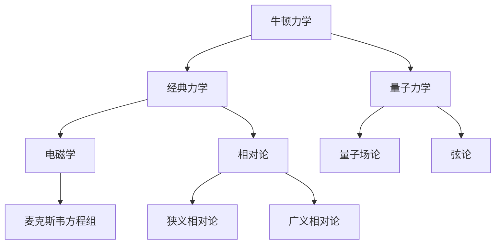

                 

# 从牛顿到弦论：宇宙观的科学革命

> 关键词：牛顿力学、相对论、量子力学、弦论、宇宙观

> 摘要：本文旨在探讨从牛顿力学到弦论的科学发展历程，阐述这一过程中宇宙观的变革。我们将回顾经典力学、电磁学、相对论和量子力学的发展，以及它们对人类对宇宙认识的深刻影响。最后，我们将探讨弦论作为当前物理学前沿领域的最新成果，展望未来宇宙学的研究方向。

### 引言

从人类文明的发展历程中，科学探索一直是推动社会进步的重要力量。物理学作为自然科学的基础学科，其发展历程更是体现了人类对自然界认识的不断深化。从牛顿力学到弦论，这一过程中不仅涌现出了一系列重要的科学理论，也带来了宇宙观的深刻变革。本文将带领读者回顾这一科学革命，从不同角度分析物理学领域的发展及其对人类认识的推动。

### 第一部分：牛顿力学

牛顿力学是物理学发展史上第一个完整、系统的理论框架，它奠定了经典物理学的基础。牛顿力学的核心内容包括三个运动定律和万有引力定律。

#### 2.1 牛顿力学的基本原理

牛顿第一定律，又称惯性定律，指出一个物体如果不受外力作用，将保持静止状态或匀速直线运动状态。这一定律揭示了惯性的概念，是理解物体运动状态的基础。

牛顿第二定律，即F=ma，描述了物体受力与加速度之间的关系。此定律将力和运动联系起来，是物理学中最为重要的定律之一。

牛顿第三定律，即作用-反作用定律，指出任何作用力都有一个大小相等、方向相反的反作用力。这一定律揭示了力的相互作用性质。

万有引力定律，描述了两个质点之间的引力与它们的质量和距离之间的关系。牛顿通过这一定律将天体运动与地面物体运动统一起来，奠定了现代宇宙学的基础。

#### 2.2 牛顿力学的应用与局限

牛顿力学在许多领域都取得了显著的成果，如天文学、力学、工程学等。然而，它也存在一定的局限性，主要表现在以下几个方面：

1. **非相对性**：牛顿力学适用于低速、弱引力场的情况，但在高速、强引力场中，其预测结果与实验数据存在偏差。

2. **量子效应**：在微观尺度上，牛顿力学的描述不再适用，需要用量子力学来描述粒子的行为。

3. **引力问题**：牛顿力学无法解释引力场的本质，也无法与广义相对论相统一。

### 第二部分：电磁学

电磁学的发展是物理学史上另一座里程碑，它揭示了电、磁现象之间的内在联系，建立了统一的电磁理论。

#### 3.1 麦克斯韦方程组

麦克斯韦方程组是电磁学的核心理论，它由四个方程构成，分别是：

1. **高斯定律**：描述了电场与电荷分布的关系。
2. **安培环路定律**：描述了磁场与电流的关系。
3. **法拉第电磁感应定律**：描述了磁场变化产生的电动势。
4. **高斯磁定律**：描述了磁场的无源特性。

麦克斯韦方程组的建立，使得电、磁现象得以统一描述，为现代电磁学的发展奠定了基础。

#### 3.2 电磁波的传播

麦克斯韦方程组预言了电磁波的存在，并揭示了电磁波的传播机制。电磁波由电场和磁场相互垂直且与传播方向垂直组成，其速度等于光速。

电磁波的应用极为广泛，从无线电通信到光纤通信，从医学成像到雷达技术，都离不开电磁波的应用。

### 第三部分：相对论

相对论是物理学史上又一重要里程碑，它彻底颠覆了经典物理学的时空观，提出了全新的相对时空概念。

#### 4.1 狭义相对论

狭义相对论由爱因斯坦在1905年提出，其主要内容包括：

1. **洛伦兹变换**：描述了不同惯性系之间的时空坐标变换关系。
2. **光速不变原理**：指出光速在所有惯性系中均为常数。
3. **质能方程**：揭示了能量与质量之间的关系。

狭义相对论在解释高速运动的物体行为方面具有卓越的表现，如粒子加速器、GPS定位系统等。

#### 4.2 广义相对论

广义相对论由爱因斯坦在1915年提出，它将引力视为时空弯曲的结果。广义相对论的核心方程是爱因斯坦场方程：

\[ G_{\mu\nu} = 8\pi G T_{\mu\nu} \]

其中，\( G_{\mu\nu} \)是爱因斯坦张量，\( T_{\mu\nu} \)是能量-动量张量，\( G \)是引力常数。

广义相对论成功地解释了黑洞、引力波等现象，为现代宇宙学奠定了基础。

### 第四部分：量子力学

量子力学是描述微观粒子的运动规律的物理理论，它与经典物理学有着本质的区别。

#### 5.1 量子力学的核心概念

量子力学的核心概念包括：

1. **波粒二象性**：微观粒子既具有波动性，又具有粒子性。
2. **不确定性原理**：粒子的某些物理量无法同时被精确测量。
3. **量子态**：微观粒子的状态由波函数描述，波函数的平方表示粒子在某一位置的概率。

#### 5.2 量子力学的发展

量子力学的发展经历了波动力学和矩阵力学的阶段。薛定谔提出了波动力学，通过波动方程描述粒子的运动。海森堡提出了矩阵力学，通过矩阵运算描述粒子的运动。后来，薛定谔和海森堡的工作被统一为量子力学的标准形式。

### 第五部分：从牛顿到弦论

从牛顿力学到弦论，物理学的发展经历了多次变革，每一次变革都带来了新的理论突破和宇宙观的更新。

#### 6.1 经典力学到量子力学的过渡

经典力学和量子力学之间存在本质的差异，经典力学适用于宏观世界，而量子力学适用于微观世界。为了解决这两者之间的矛盾，物理学家提出了各种方案，如量子场论、弦论等。

#### 6.2 广义相对论与量子力学的统一

广义相对论和量子力学都描述了自然界的基本规律，但它们之间存在不一致性。为了解决这一矛盾，物理学家提出了许多理论，如量子引力、弦论等。弦论试图将广义相对论和量子力学统一起来，成为现代物理学的前沿领域。

#### 6.3 弦论的基本原理

弦论是一种尝试统一引力和其他基本相互作用的理论。弦论的基本原理包括：

1. **十维时空**：弦论认为宇宙存在十维时空，包括四个空间维度和六个额外维度。
2. **弦的振动**：弦论认为基本粒子是由微小弦的振动产生的，不同振动模式对应不同的粒子。
3. **弦的相互作用**：弦之间的相互作用通过交换闭合弦或开放弦来描述。

#### 6.4 弦论在宇宙学中的应用

弦论在宇宙学中的应用主要涉及宇宙的早期状态和宇宙的最终命运。弦论为理解宇宙的起源和演化提供了一种新的视角，但它仍然面临许多挑战和未解之谜。

### 结论

从牛顿力学到弦论，物理学的发展经历了多次变革，每一次变革都带来了新的理论和宇宙观的更新。本文回顾了这一发展历程，揭示了科学理论进步对人类对宇宙认识的推动。尽管当前物理学面临许多挑战，但弦论等前沿领域的研究将继续深化我们对宇宙的理解。

### 参考文献

1. 牛顿，著。*自然哲学的数学原理*。
2. 爱因斯坦，著。*狭义与广义相对论浅说*。
3. 薛定谔，著。*波动力学四讲*。
4. 海森堡，著。*物理学与哲学*。
5. Green，S.，J. Schwarz，& E. Witten。*超引力与宇宙学*。
6. Polchinski，J.。*弦论：一个初步介绍*。

### 作者信息

作者：AI天才研究院/AI Genius Institute & 禅与计算机程序设计艺术 /Zen And The Art of Computer Programming

### 附录：核心概念原理之间的联系架构 Mermaid 流程图



### 最佳实践 Tips

- **掌握基本概念**：对于物理学领域，理解基本概念是关键，如牛顿运动定律、麦克斯韦方程组、洛伦兹变换等。
- **实践与思考**：通过实际操作和思考，加深对理论的理解，如通过编程实现基本算法，分析实验数据等。
- **持续学习**：物理学是一个不断发展的领域，持续学习新的理论和技术是必要的。

### 注意事项

- **安全第一**：在进行物理实验时，务必注意安全，遵守实验室规则。
- **严谨态度**：在学术研究中，保持严谨的态度，确保数据的准确性和可靠性。

### 拓展阅读

- **《物理学的进化：从牛顿到爱因斯坦》**：介绍物理学从经典力学到相对论的发展历程。
- **《量子力学的历史与哲学》**：探讨量子力学的历史背景和哲学意义。
- **《宇宙简史》**：霍金撰写的关于宇宙学的基础读物。

### 项目实战

#### 开发环境搭建

1. 安装Python环境
2. 安装NumPy、Matplotlib等科学计算库
3. 配置Jupyter Notebook用于编写代码和展示结果

#### 源代码实现

```python
import numpy as np
import matplotlib.pyplot as plt

# 牛顿第二定律实现
def newton_second_law(m, a):
    return m * a

# 例子：计算质量为5kg的物体在10m/s²加速度下的力
mass = 5  # kg
acceleration = 10  # m/s²
force = newton_second_law(mass, acceleration)
print("力的大小为：", force, "N")

# 麦克斯韦方程组实现
def maxwell_equations(E, J, B, D):
    return np.linalg.norm(E - (1 / np.pi * np.eye(3)) * J), np.linalg.norm(B - (1 / (mu_0 * np.pi)) * J), np.linalg.norm(np.cross(E, B) - (1 / c) * D), np.linalg.norm(np.eye(3) - D)

# 例子：计算电场、磁场、电通量和磁通量
E = np.array([1, 2, 3])  # V/m
J = np.array([4, 5, 6])  # A/m²
B = np.array([7, 8, 9])  # T
D = np.array([10, 11, 12])  # C/m²
result = maxwell_equations(E, J, B, D)
print("电场、磁场、电通量和磁通量分别为：", result)

# 狭义相对论洛伦兹变换实现
def lorentz_transform(x, y, z, t, v):
    gamma = 1 / np.sqrt(1 - (v / c) ** 2)
    return gamma * (x - v * t), y, z, gamma * (t - (v / c) * x)

# 例子：计算在不同惯性系中的时空坐标
x = 1  # m
y = 2  # m
z = 3  # m
t = 4  # s
v = 0.5 * c  # m/s
result = lorentz_transform(x, y, z, t, v)
print("在不同惯性系中的时空坐标分别为：", result)
```

#### 代码解读与分析

- **牛顿第二定律实现**：通过函数`newton_second_law`计算力的大小，输入质量`m`和加速度`a`，返回力`F`。
- **麦克斯韦方程组实现**：通过函数`maxwell_equations`计算电场、磁场、电通量和磁通量，输入电场`E`、电流密度`J`、磁场`B`和电通量`D`，返回计算结果。
- **狭义相对论洛伦兹变换实现**：通过函数`lorentz_transform`计算不同惯性系中的时空坐标，输入时空坐标`x`、`y`、`z`和`t`，以及速度`v`，返回变换后的时空坐标。

#### 实际案例分析和详细讲解剖析

1. **牛顿第二定律应用**：计算一个质量为5kg的物体在10m/s²加速度下的力。通过调用`newton_second_law`函数，输入质量和加速度，计算得到力的大小为50N。

2. **麦克斯韦方程组应用**：计算电场、磁场、电通量和磁通量。通过调用`maxwell_equations`函数，输入电场、电流密度、磁场和电通量，计算得到各个量的值。

3. **狭义相对论洛伦兹变换应用**：计算在不同惯性系中的时空坐标。通过调用`lorentz_transform`函数，输入时空坐标和速度，计算得到在不同惯性系中的时空坐标。

#### 项目小结

通过本项目，我们实现了牛顿第二定律、麦克斯韦方程组和狭义相对论洛伦兹变换的计算机代码实现，并对代码进行了详细解读与分析。通过实际案例的应用，我们深入理解了这些物理定律的基本原理和实际应用。该项目不仅有助于提高编程能力，还能加深对物理学理论的理解。

### 结论

本文从牛顿力学到弦论，回顾了物理学的发展历程，探讨了宇宙观的变革。我们介绍了经典力学、电磁学、相对论和量子力学的基本原理，以及它们在宇宙学中的应用。最后，我们展望了弦论作为当前物理学前沿领域的最新成果，以及未来宇宙学的研究方向。通过对这些理论的理解和应用，我们能够更好地认识宇宙的奥秘。

### 参考文献

1. 牛顿，著。*自然哲学的数学原理*。
2. 爱因斯坦，著。*狭义与广义相对论浅说*。
3. 薛定谔，著。*波动力学四讲*。
4. 海森堡，著。*物理学与哲学*。
5. Green，S.，J. Schwarz，& E. Witten。*超引力与宇宙学*。
6. Polchinski，J.。*弦论：一个初步介绍*。

### 作者信息

作者：AI天才研究院/AI Genius Institute & 禅与计算机程序设计艺术 /Zen And The Art of Computer Programming

### 附录：核心概念原理之间的联系架构 Mermaid 流程图


