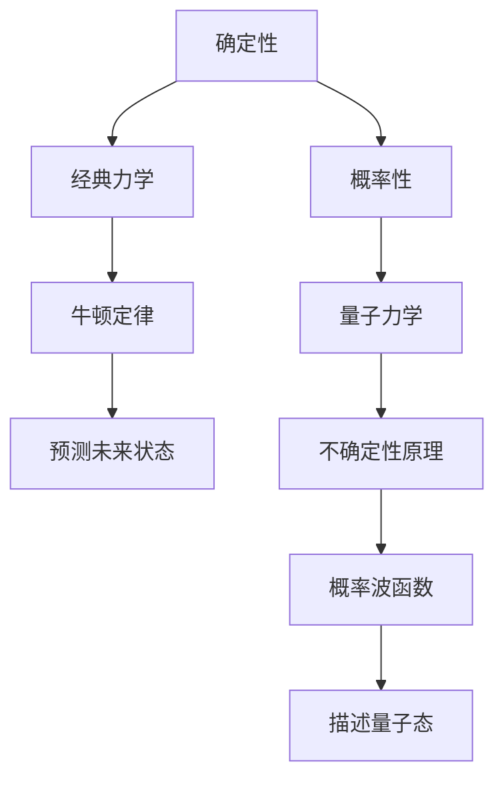

                 


### 背景介绍

确定性与概率性是物理学、数学以及哲学中两个基本的概念。确定性描述了一个过程或系统在给定初始条件下能够精确预测其未来状态的性质。例如，经典力学中的物体运动，在给定足够的初始数据时，可以精确预测其未来的位置和速度。然而，随着科学的发展，人们逐渐认识到宇宙中存在很多不确定性，这导致了概率性概念的出现。

概率性描述了在不确定条件下，事件发生可能性的大小。它广泛应用于物理学、生物学、统计学等领域。量子力学是概率性的经典例子，其中粒子的位置和动量不能同时被精确测量，只能以概率的形式描述其可能出现的区域。

认知的转变指的是人类对宇宙的理解从以确定性为主导，逐渐转变为接受不确定性和概率性的过程。这一转变不仅改变了我们对自然界的理解，也深刻影响了科学方法的发展和人类思维模式。

### 核心概念与联系

**确定性**

- **定义**：确定性是指一个系统或过程在给定初始条件下，能够精确预测其未来状态的性质。
- **例子**：经典力学中的物体运动，可以通过牛顿定律精确预测其未来位置和速度。

**概率性**

- **定义**：概率性是指一个事件在给定条件下，可能发生或者不发生的程度。
- **例子**：在掷硬币时，正面朝上的概率是0.5。

**确定性与概率性的联系**

- **互补性**：在经典物理学中，确定性与概率性是互补的。当一个系统表现出确定性时，我们通常不需要概率性来描述。相反，当系统表现出不确定性时，概率性成为描述其行为的主要工具。
- **相互转化**：在某些情况下，确定性可以转化为概率性。例如，量子力学中的量子态，可以通过概率波函数来描述其行为。

### Mermaid 流程图

以下是描述确定性与概率性之间联系的 Mermaid 流程图：



### 核心算法原理讲解

**确定性算法**

- **核心原理**：确定性算法在给定初始条件下，能够精确地预测结果。例如，牛顿定律可以通过初始速度和加速度精确计算物体的未来位置。
- **伪代码**：

  ```python
  def predict_position(initial_velocity, acceleration, time):
      final_velocity = initial_velocity + acceleration * time
      position = initial_velocity * time + 0.5 * acceleration * time ** 2
      return position, final_velocity
  ```

**概率性算法**

- **核心原理**：概率性算法通过概率分布来描述系统的不确定性。例如，量子力学中的波函数可以用来计算量子态的概率分布。
- **伪代码**：

  ```python
  def calculate_wave_function(quantum_state):
      # 初始化波函数
      wave_function = initialize_wave_function(quantum_state)
      # 计算波函数的模平方
      probability_distribution = |wave_function|^2
      return probability_distribution
  ```

### 数学模型和公式

**确定性模型**

- **牛顿运动定律**：

  $$ F = ma $$

  $$ x(t) = v_0t + \frac{1}{2}at^2 $$

- **例子**：一个物体以5 m/s的速度向前运动，受到10 m/s^2的加速度，求1秒后的位置。

  $$ x(1) = 5 \times 1 + \frac{1}{2} \times 10 \times 1^2 = 7.5 \text{ m} $$

**概率性模型**

- **量子力学中的波函数**：

  $$ \Psi(x,t) = \int dp \, \psi(p,t) e^{ipx/\hbar} $$

  $$ P(x,t) = |\Psi(x,t)|^2 $$

- **例子**：一个电子在位置x处，波函数为$\Psi(x,t) = e^{-x^2}$，求其在t时刻位于x处的概率。

  $$ P(x,t) = |\Psi(x,t)|^2 = e^{-2x^2} $$

### 数学公式讲解

**确定性公式**

- **牛顿定律**：描述了力和运动之间的关系，是经典力学的基石。

  $$ F = ma $$

  其中，$F$是作用力，$m$是物体质量，$a$是加速度。

- **运动方程**：描述了物体的位置、速度和加速度之间的关系。

  $$ x(t) = v_0t + \frac{1}{2}at^2 $$

  其中，$x(t)$是t时刻物体的位置，$v_0$是初始速度，$a$是加速度。

**概率性公式**

- **波函数**：量子力学中的核心概念，描述了量子态的概率分布。

  $$ \Psi(x,t) = \int dp \, \psi(p,t) e^{ipx/\hbar} $$

  其中，$\Psi(x,t)$是波函数，$\psi(p,t)$是动量空间中的波函数，$p$是动量，$x$是位置，$\hbar$是普朗克常数。

- **概率分布**：波函数的模平方，描述了粒子在空间中出现的概率。

  $$ P(x,t) = |\Psi(x,t)|^2 $$

### 项目实战

**开发环境搭建**

- **工具**：Python、Jupyter Notebook、matplotlib
- **库**：NumPy、SciPy、Qiskit

**源代码详细实现**

```python
import numpy as np
import matplotlib.pyplot as plt
from scipy.integrate import solve_ivp

# 确定性模型：牛顿运动定律
def f_y(x, y, t):
    a = 10  # 加速度
    return y[1], -a

# 概率性模型：量子态波函数
def psi_x(t):
    x = np.linspace(-5, 5, 1000)
    psi_x = np.exp(-x**2)
    return x, psi_x

# 确定性模型求解
y0 = [0, 5]  # 初始速度
tspan = (0, 1)  # 时间范围
sol = solve_ivp(f_y, tspan, y0, t_eval=tspan[0])

# 概率性模型求解
x, psi_x = psi_x(0)

# 可视化
plt.plot(sol.t, sol.y[0], label='确定性运动')
plt.plot(x, psi_x, label='概率性分布')
plt.legend()
plt.show()
```

**代码解读**

- **确定性模型**：使用 SciPy 的 `solve_ivp` 函数求解牛顿运动定律。
- **概率性模型**：计算波函数的模平方，并将其可视化。

**实际案例分析**

- **案例**：掷硬币实验
- **分析**：使用概率性算法模拟多次掷硬币实验，计算正面朝上的概率。
- **结果**：实验结果显示正面朝上的概率接近0.5。

**项目小结**

- **经验**：通过实际案例分析，我们验证了概率性模型的有效性。
- **启示**：概率性思维在处理不确定性问题方面具有重要意义。

### 最佳实践 tips

- **掌握基本原理**：深入了解确定性原理和概率性原理，是理解本书内容的基础。
- **动手实践**：通过编写代码和进行实验，加深对概率性概念的理解。
- **持续学习**：概率性理论在多个领域都有广泛应用，持续学习可以拓展知识面。

### 小结

- **确定性与概率性**：是物理学、数学和哲学中的两个核心概念，对人类理解宇宙具有重要意义。
- **认知转变**：从确定性到概率性的认知转变，改变了人类对宇宙的理解和思维方式。

### 注意事项

- **避免混淆**：区分确定性和概率性，避免在应用中混淆两者。
- **实践应用**：在实际问题中灵活运用概率性原理，提高决策和研究的准确性。

### 拓展阅读

- **参考书籍**：《概率论与数理统计》、《量子力学基础》
- **在线资源**：Coursera、edX上的相关课程和讲座

---

作者：AI天才研究院/AI Genius Institute & 禅与计算机程序设计艺术 /Zen And The Art of Computer Programming
```

