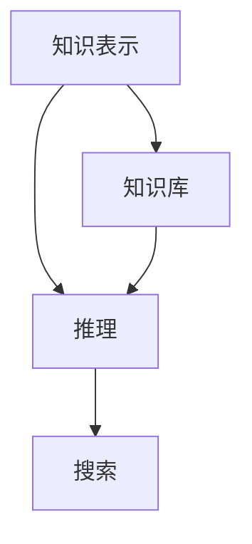
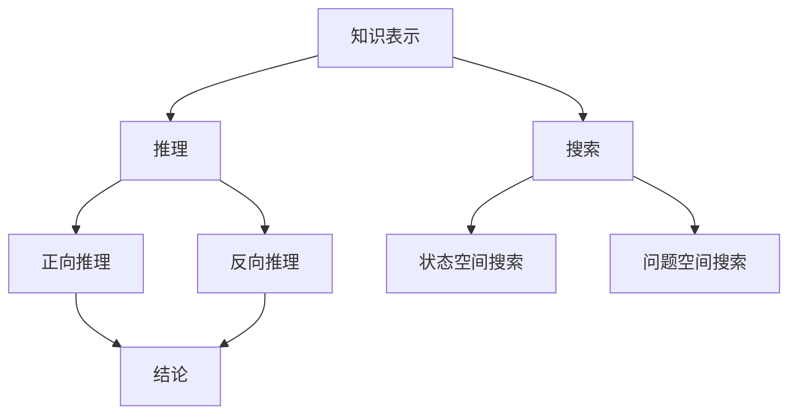
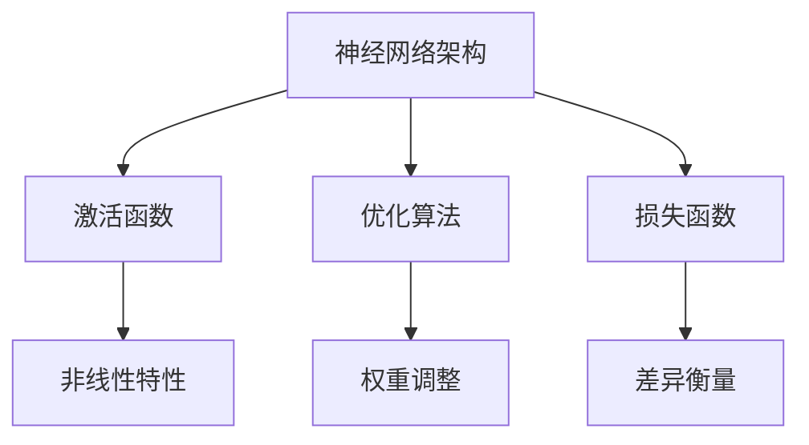

                 

当然，让我们一步一步地构建这篇文章。由于文章字数要求较高，我们将分阶段完成。首先，我会创建一个详细的目录大纲，并在每个部分中提供大纲和基本内容。接下来，我们将逐步填充和扩展每个部分，确保满足完整性要求。

### 目录大纲

#### 引言
- 书籍背景与目标
- 符号人工智能与深度学习的区别
- 机器理解世界的挑战

#### 符号人工智能
- 概述
- 核心概念与联系
- 算法原理讲解
- 应用场景

#### 深度学习原理
- 概述
- 核心概念与联系
- 神经网络基础
- 深度学习优化算法

#### 范式转换分析
- 范式转换的原因
- 范式转换的影响
- 范式转换的挑战

#### 深度学习应用案例
- 图像识别案例
- 自然语言处理案例

#### 未来展望
- 深度学习发展趋势
- 符号人工智能与深度学习的融合
- 机器理解世界的未来挑战

#### 附录
- 参考资料与扩展阅读
- 深度学习工具与资源

### 引言部分

#### 书籍背景与目标
- **符号人工智能**：起源于20世纪50年代，基于逻辑推理和知识表示，旨在通过模拟人类思维来解决复杂问题。
- **深度学习**：起源于20世纪80年代，基于神经网络，通过大量数据训练模型来模拟人类学习过程。
- **书籍目标**：探讨符号人工智能向深度学习转换的过程，分析其背后的原因、影响以及面临的挑战。

#### 符号人工智能与深度学习的区别
- **理论基础**：符号人工智能基于逻辑和知识表示，而深度学习基于统计学和神经网络。
- **数据需求**：符号人工智能需要大量先验知识，而深度学习需要大量数据。
- **学习方式**：符号人工智能通过规则和逻辑推理学习，而深度学习通过数据驱动学习。

#### 机器理解世界的挑战
- **数据复杂性**：世界数据的多样性和复杂性对机器理解提出了挑战。
- **实时性**：在现实世界中，机器需要实时处理信息并做出决策。
- **泛化能力**：机器需要能够在新的、未见过的情境中表现良好。

### 符号人工智能部分

#### 概述
- **发展历程**：从最初的理论构建到实际应用的逐步演变。
- **核心概念**：知识表示、推理、搜索等。

#### 核心概念与联系
- **Mermaid流程图**：展示符号人工智能的核心概念及其联系。



#### 算法原理讲解
- **伪代码**：讲解符号人工智能的关键算法，如前向推理和反向推理。

```python
# 前向推理伪代码
def forward_inference(knowledge_base, query):
    # 初始化假设集合
    hypotheses = []
    # 从知识库中查找所有与查询相关的规则
    rules = find_rules(knowledge_base, query)
    for rule in rules:
        # 应用规则到假设集合
        hypotheses.extend(apply_rule(rule, hypotheses))
    return hypotheses

# 反向推理伪代码
def backward_inference(knowledge_base, query):
    # 初始化目标集合
    goals = [query]
    # 初始化证据集合
    evidence = []
    while goals:
        # 选择一个目标
        goal = goals.pop()
        # 在知识库中查找所有与目标相关的规则
        rules = find_rules(knowledge_base, goal)
        for rule in rules:
            # 如果规则的前提条件在证据中，则应用规则
            if all前提条件都在证据中：
                apply_rule(rule, evidence)
                # 如果规则的结果是新的目标，则将其添加到目标集合
                goals.append(rule_result)
    return evidence
```

#### 应用场景
- **专家系统**：在医疗诊断、金融分析等领域广泛应用。
- **智能搜索**：在搜索引擎、问答系统中提供决策支持。

### 深度学习原理部分

#### 概述
- **发展历程**：从最初的前馈神经网络到深度学习的演进。

#### 核心概念与联系
- **神经网络架构**：展示不同类型的神经网络及其联系。

```mermaid
graph TD
A[单层神经网络] --> B[多层神经网络]
B --> C[卷积神经网络(CNN)]
B --> D[循环神经网络(RNN)]
C --> E[深度残差网络(DNN)]
D --> F[长短时记忆网络(LSTM)]
```

#### 神经网络基础
- **神经元与神经网络**：讲解神经元的结构和神经网络的基本概念。

#### 深度学习优化算法
- **反向传播算法**：详细解释反向传播算法的原理和步骤。

### 范式转换分析部分

#### 范式转换的原因
- **数据驱动学习的优势**：与符号人工智能相比，深度学习在处理大量数据时表现更优。

#### 范式转换的影响
- **行业变革**：深度学习在图像识别、自然语言处理等领域取得了显著突破。

#### 范式转换的挑战
- **模型解释性**：深度学习模型的黑箱特性对理解和解释提出了挑战。

### 深度学习应用案例部分

#### 图像识别案例
- **项目背景**：介绍一个图像识别项目的背景和目标。

#### 自然语言处理案例
- **项目背景**：介绍一个自然语言处理项目的背景和目标。

### 未来展望部分

#### 深度学习发展趋势
- **自主性**：深度学习模型将具备更强的自主学习和适应能力。

#### 符号人工智能与深度学习的融合
- **混合模型**：将符号人工智能与深度学习结合起来，发挥各自优势。

#### 机器理解世界的未来挑战
- **多模态数据融合**：如何处理和融合多种类型的数据。

### 附录部分

#### 参考资料与扩展阅读
- **书籍推荐**：推荐几本与本书主题相关的书籍。

#### 深度学习工具与资源
- **开源框架**：介绍几个常用的深度学习开源框架。

接下来，我们将逐步填充每个部分的详细内容，确保文章的完整性和专业性。由于字数限制，我们将分阶段完成。在下一个阶段，我们将继续扩展和细化深度学习原理、范式转换分析以及深度学习应用案例等内容。

---

### 引言部分（续）

#### 符号人工智能与深度学习的区别

符号人工智能（Symbolic Artificial Intelligence）和深度学习（Deep Learning）是人工智能（AI）领域的两个重要分支，它们在理论基础、学习方法、应用场景等方面存在显著差异。

**理论基础**：
- **符号人工智能**：基于逻辑、数学和符号表示，旨在通过模拟人类思维过程来解决问题。它强调知识的表示、推理和搜索，依赖于专家系统和形式逻辑等理论框架。
- **深度学习**：基于统计学和机器学习，特别是神经网络理论。它通过模拟人脑神经网络的结构和功能，通过大量数据的训练来学习和预测。

**数据需求**：
- **符号人工智能**：通常需要大量的先验知识和领域特定的规则。这种知识通常是由专家手动编码的，因此知识获取是一个瓶颈。
- **深度学习**：依赖于大量的数据集进行训练，通过数据驱动的方法来发现模式。深度学习模型的性能很大程度上取决于数据量和质量。

**学习方式**：
- **符号人工智能**：通过显式规则和逻辑推理学习，需要事先定义好所有可能的规则和条件。
- **深度学习**：通过隐式学习，即通过从数据中自动学习特征和模式，无需显式定义规则。

**应用场景**：
- **符号人工智能**：在需要复杂推理和知识表示的领域表现出色，如医疗诊断、法律咨询、智能搜索等。
- **深度学习**：在处理图像、语音、自然语言等数据时具有显著优势，如图像识别、语音识别、机器翻译等。

符号人工智能与深度学习之间的差异不仅体现在技术层面，还对社会和产业产生了深远的影响。深度学习的发展使得机器能够在没有显式规则的情况下处理复杂问题，这在一定程度上改变了传统的人工智能模式。

#### 机器理解世界的挑战

机器理解世界面临着一系列挑战，这些挑战既来自于技术层面，也来自于数据和应用场景的复杂性。

**数据复杂性**：
- 世界数据是多样且复杂的，包括结构化数据、半结构化数据和非结构化数据。深度学习依赖于大规模数据集，但是获取和处理这些数据是一个挑战。
- 数据的质量也是一个关键问题。噪声、缺失值和不一致性都会影响模型的性能。

**实时性**：
- 在现实世界中，机器需要实时处理信息并做出决策。这要求模型具有快速响应能力，同时保持高准确性和鲁棒性。
- 实时决策还需要考虑资源限制，如计算能力、存储能力和通信带宽。

**泛化能力**：
- 机器需要能够在新的、未见过的情境中表现良好。这意味着模型必须具有泛化能力，而不仅仅是针对特定数据集的表现。
- 泛化能力也是对抗数据分布迁移和模型过拟合的关键。

为了应对这些挑战，研究人员和工程师不断探索新的算法和技术，同时也需要社会和产业界共同努力，为人工智能的发展提供支持和资源。

### 符号人工智能部分（续）

#### 概述

符号人工智能（Symbolic Artificial Intelligence，简称SAI）起源于20世纪50年代，是人工智能领域的一个重要分支。它通过模拟人类思维过程，利用逻辑、数学和符号表示来解决问题。符号人工智能的发展经历了多个阶段，从最初的逻辑推理到知识表示、搜索算法等，逐渐形成了相对成熟的理论体系。

符号人工智能的核心在于将知识表示为符号形式，并通过推理和搜索来解决问题。它强调知识的明确性、可操作性和可解释性，因此在某些领域，如医疗诊断、法律咨询和智能搜索等，表现出色。

符号人工智能的发展历程可以分为以下几个阶段：

1. **早期探索**（1950-1960年代）：这一阶段，人工智能的概念首次被提出，符号人工智能开始萌芽。逻辑和数学成为研究的主要工具，研究者试图通过形式化的方法来模拟人类思维。

2. **知识表示与推理**（1960-1970年代）：在这一阶段，研究者开始关注如何将知识表示为符号形式，并开发出了一系列推理算法，如反演推理、正向推理等。

3. **搜索与规划**（1970-1980年代）：随着知识表示和推理方法的成熟，搜索算法和规划理论成为研究热点。研究者试图通过搜索和规划来模拟人类解决问题的过程。

4. **专家系统与知识工程**（1980-1990年代）：这一阶段，符号人工智能进入了应用阶段，专家系统成为标志性成果。知识工程成为研究重点，研究者开始关注如何构建和维护大规模的知识库。

5. **现代符号人工智能**（1990年代至今）：随着计算机性能的提升和算法的优化，符号人工智能在多个领域取得了显著进展。现代符号人工智能不仅保留了传统的推理和搜索方法，还融合了机器学习和数据驱动的技术，进一步提高了其解决问题的能力。

#### 核心概念与联系

符号人工智能的核心概念包括知识表示、推理、搜索等。这些概念之间存在着紧密的联系，共同构成了符号人工智能的理论体系。

1. **知识表示**：知识表示是符号人工智能的基础。它指的是将知识以符号形式进行编码，使得计算机能够理解和处理。常见的知识表示方法包括命题表示、谓词逻辑、产生式规则等。

2. **推理**：推理是符号人工智能的核心功能之一。它指的是根据已知的事实和规则，推导出新的结论。推理可以分为正向推理和反向推理。正向推理是从已知的事实出发，逐步推导出新的结论；反向推理则是从目标开始，逆向推导出所需的前提条件。

3. **搜索**：搜索是符号人工智能解决问题的关键。它指的是在所有可能的解决方案中找到最优解或次优解。搜索可以分为状态空间搜索、问题空间搜索等。

知识表示、推理和搜索之间存在着紧密的联系。知识表示提供了推理和搜索的基础，推理和搜索则是知识表示的应用。知识表示和推理算法需要通过搜索来找到解决问题的路径。

下面是一个简单的Mermaid流程图，展示了符号人工智能的核心概念及其联系：



#### 算法原理讲解

符号人工智能的关键算法包括推理算法和搜索算法。以下将详细讲解这两种算法的原理和步骤。

1. **正向推理**（Forward Inference）

正向推理是一种从已知事实出发，逐步推导出新的结论的推理方法。其基本思想是根据已知的事实和规则，推导出新的中间结论，直到达到目标。

正向推理的步骤如下：

- **初始化**：设置一个初始假设集，通常为空。
- **选择规则**：从知识库中选择一条规则。
- **应用规则**：将规则的前提条件与当前假设集进行匹配，如果匹配成功，则将规则的前提条件加入到假设集中。
- **递归**：重复步骤2和步骤3，直到没有新的规则可以应用或者达到目标。

以下是正向推理的伪代码：

```python
def forward_inference(knowledge_base, query):
    hypotheses = []  # 初始化假设集
    while True:
        rule = select_rule(knowledge_base)  # 选择规则
        if apply_rule(rule, hypotheses):  # 应用规则
            hypotheses.extend(rule_conclusions)  # 更新假设集
        else:
            break  # 没有新的规则可以应用，停止搜索
    if query in hypotheses:  # 判断是否达到目标
        return hypotheses
    else:
        return None  # 目标未达到，返回空
```

2. **反向推理**（Backward Inference）

反向推理是一种从目标开始，逆向推导出所需的前提条件的推理方法。其基本思想是根据目标，逐步推导出需要的前提条件，直到达到已知的事实。

反向推理的步骤如下：

- **初始化**：设置一个目标集合，包含初始目标；设置一个证据集合，通常为空。
- **选择目标**：从目标集合中选择一个目标。
- **应用规则**：从知识库中选择一条规则，该规则的目标与当前选择的目标匹配。
- **推导前提条件**：将规则的前提条件与当前证据集合进行匹配，如果匹配成功，则将规则的前提条件加入到证据集合中，并从目标集合中删除当前选择的目标。
- **递归**：重复步骤2和步骤3，直到没有新的目标可以推导或者达到已知的事实。

以下是反向推理的伪代码：

```python
def backward_inference(knowledge_base, query):
    goals = [query]  # 初始化目标集合
    evidence = []  # 初始化证据集合
    while goals:
        goal = goals.pop()  # 选择一个目标
        rule = select_rule(knowledge_base, goal)  # 选择规则
        if apply_rule(rule, evidence):  # 应用规则
            evidence.extend(rule_preconditions)  # 更新证据集合
            goals.extend(rule_results)  # 更新目标集合
        else:
            goals.append(goal)  # 目标未能推导，重新加入目标集合
    return evidence
```

3. **状态空间搜索**（State Space Search）

状态空间搜索是一种用于求解规划问题的搜索算法。它将问题表示为一个状态空间，其中每个状态是一个可能的世界状态，每个状态之间的转换是一个动作。

状态空间搜索的步骤如下：

- **初始化**：设置一个初始状态，通常为问题的起始状态；设置一个开放列表，用于存储待搜索的状态；设置一个封闭列表，用于存储已经搜索过的状态。
- **选择状态**：从开放列表中选择一个状态。
- **扩展状态**：对于当前选择的状态，应用所有可能的动作，生成新的状态。
- **评估状态**：对新的状态进行评估，判断是否满足目标条件。
- **更新列表**：将新的状态加入开放列表，并将已搜索过的状态加入封闭列表。
- **递归**：重复步骤2至步骤5，直到找到满足目标条件的状态或者开放列表为空。

以下是状态空间搜索的伪代码：

```python
def state_space_search(initial_state, goal_state):
    open_list = [initial_state]  # 初始化开放列表
    closed_list = []  # 初始化封闭列表
    while open_list:
        current_state = open_list.pop(0)  # 选择状态
        if current_state == goal_state:  # 判断是否满足目标条件
            return current_state  # 找到解决方案
        closed_list.append(current_state)  # 更新封闭列表
        for action in possible_actions(current_state):  # 扩展状态
            new_state = apply_action(current_state, action)
            if new_state not in closed_list:  # 判断是否已搜索
                open_list.append(new_state)  # 更新开放列表
    return None  # 未找到解决方案
```

4. **动作规划**（Action Planning）

动作规划是一种用于求解规划问题的算法，它通过一系列的动作来将初始状态转换为目标状态。动作规划通常结合状态空间搜索和决策图搜索等方法。

动作规划的步骤如下：

- **初始化**：设置一个初始状态，通常为问题的起始状态；设置一个决策图，用于存储状态和动作。
- **生成决策图**：从初始状态开始，应用所有可能的动作，生成决策图。
- **搜索决策图**：在决策图中搜索一条从初始状态到目标状态的路径。
- **生成规划**：根据搜索到的路径，生成一系列的动作序列，实现从初始状态到目标状态的转换。

以下是动作规划的伪代码：

```python
def action_planning(initial_state, goal_state):
    decision_graph = create_decision_graph(initial_state)  # 生成决策图
    path = search_decision_graph(decision_graph, initial_state, goal_state)  # 搜索决策图
    if path:
        actions = generate_actions(path)  # 生成动作序列
        return actions  # 返回规划
    else:
        return None  # 未找到规划
```

通过这些算法，符号人工智能能够模拟人类思维过程，解决复杂的问题。

#### 应用场景

符号人工智能在多个领域有着广泛的应用，其中一些典型的应用场景包括：

1. **专家系统**：专家系统是符号人工智能的典型应用之一。它模拟专家的决策过程，通过知识库和推理机来提供专业建议。例如，在医疗诊断、金融分析和法律咨询等领域，专家系统能够帮助医生、金融分析师和法律专家做出更加准确和高效的决策。

2. **智能搜索**：符号人工智能在智能搜索领域也有着重要的应用。通过知识表示和推理算法，智能搜索系统能够更好地理解用户的查询意图，提供更加精准的搜索结果。例如，搜索引擎中的问答系统、企业内部的决策支持系统等。

3. **规划与决策**：符号人工智能在规划与决策领域也有着广泛的应用。通过状态空间搜索和动作规划算法，系统能够自动生成复杂的规划方案，帮助用户在复杂的环境中做出最优的决策。例如，自动驾驶系统、资源调度系统等。

符号人工智能通过其强大的推理和搜索能力，在解决复杂问题、提高决策效率和自动化程度等方面发挥着重要作用。

### 深度学习原理部分

#### 概述

深度学习（Deep Learning，简称DL）是机器学习（Machine Learning，简称ML）的一个重要分支，起源于20世纪80年代，但真正引起广泛关注和发展则是在21世纪初。深度学习基于人工神经网络（Artificial Neural Networks，简称ANNs）的架构，通过模仿人脑神经网络的结构和功能，实现从大量数据中自动学习特征和模式。深度学习的发展不仅得益于计算能力的提升和大数据的普及，还依赖于优化算法的改进和计算资源的优化。

深度学习的主要特点包括：

1. **多层神经网络**：深度学习模型包含多个隐藏层，能够捕捉数据中的深层次特征，这是与传统的单层神经网络（如感知机、多层感知机）最大的区别。
2. **数据驱动学习**：深度学习依赖于大量的训练数据，通过训练数据学习数据分布和内在规律，从而实现模型的泛化能力。
3. **端到端学习**：深度学习模型可以直接从原始数据学习到输出结果，不需要手动提取特征，这使得模型在处理复杂任务时更加高效。
4. **强大的表达能力**：多层神经网络能够表示复杂的函数，这使得深度学习在图像识别、自然语言处理、语音识别等领域表现出色。

深度学习的发展历程可以分为以下几个阶段：

1. **早期研究**（1980年代）：这一阶段，神经网络的理论基础开始建立，但受限于计算能力和算法的局限性，深度学习并没有得到广泛应用。
2. **初步发展**（1990年代）：随着反向传播算法（Backpropagation Algorithm）的出现，神经网络的训练效率得到了显著提升。虽然深度学习仍然面临过拟合和优化难题，但这一阶段的研究为后续的发展奠定了基础。
3. **突破性进展**（2006-2012年）：2006年，Geoffrey Hinton等研究者提出了深度信念网络（Deep Belief Networks，简称DBNs），解决了多层神经网络训练困难的问题。这一突破性进展标志着深度学习的重新崛起。
4. **快速发展**（2012年至今）：在2012年，Alex Krizhevsky等研究者凭借卷积神经网络（Convolutional Neural Networks，简称CNNs）在ImageNet图像识别挑战赛上取得了突破性成绩，这一成果引发了深度学习的快速发展。随后，深度学习在语音识别、自然语言处理、自动驾驶等领域取得了显著进展。

#### 核心概念与联系

深度学习的核心概念包括神经网络架构、激活函数、优化算法、损失函数等。这些概念相互联系，共同构成了深度学习的理论基础。

1. **神经网络架构**：神经网络是深度学习的基石。一个基本的神经网络由输入层、多个隐藏层和输出层组成。每个层由多个神经元（或节点）组成，神经元之间通过权重连接。神经网络通过调整这些权重来学习数据的特征和模式。

2. **激活函数**：激活函数是神经元输出的非线性函数，用于引入非线性特性，使得神经网络能够模拟更复杂的函数。常见的激活函数包括Sigmoid函数、ReLU函数、Tanh函数等。

3. **优化算法**：优化算法用于调整神经网络的权重，以最小化损失函数。常见的优化算法包括梯度下降（Gradient Descent）、随机梯度下降（Stochastic Gradient Descent，简称SGD）、Adam优化器等。

4. **损失函数**：损失函数是用于衡量模型预测值与真实值之间差异的函数。深度学习通过最小化损失函数来优化模型。常见的损失函数包括均方误差（Mean Squared Error，简称MSE）、交叉熵损失（Cross-Entropy Loss）等。

下面是一个简单的Mermaid流程图，展示了深度学习的核心概念及其联系：



#### 神经网络基础

神经网络（Neural Networks，简称NNs）是深度学习的基础。一个基本的神经网络由输入层、隐藏层和输出层组成，每个层由多个神经元（或节点）组成。神经元之间通过权重（weights）连接，形成复杂的网络结构。神经网络通过学习输入数据与输出数据之间的映射关系，实现对数据的分类、回归或其他类型的任务。

1. **神经元与神经网络**

每个神经元可以视为一个简单的计算单元，它接收输入信号，通过加权求和后应用激活函数得到输出。一个基本的神经元模型可以表示为：

$$
y = \sigma(\sum_{i=1}^{n} w_i x_i + b)
$$

其中，$y$ 是神经元的输出，$x_i$ 是第 $i$ 个输入，$w_i$ 是第 $i$ 个输入的权重，$b$ 是偏置项，$\sigma$ 是激活函数。常见的激活函数包括：

- **Sigmoid函数**：
  $$
  \sigma(x) = \frac{1}{1 + e^{-x}}
  $$

  Sigmoid函数在输入为负时输出接近0，输入为正时输出接近1，具有S形曲线。

- **ReLU函数**（Rectified Linear Unit）：
  $$
  \sigma(x) = \max(0, x)
  $$

 ReLU函数在输入为负时输出为0，输入为正时输出为自身，具有简单的线性特性。

- **Tanh函数**：
  $$
  \sigma(x) = \frac{e^x - e^{-x}}{e^x + e^{-x}}
  $$

  Tanh函数与Sigmoid函数类似，但输出范围在-1到1之间，具有对称性。

2. **前向传播与反向传播**

神经网络通过前向传播（Forward Propagation）和反向传播（Back Propagation）来学习数据。前向传播是指输入数据从输入层经过隐藏层，最终到达输出层的过程。在每个层中，神经元接收来自前一层的输入，通过加权求和和激活函数得到输出，传递给下一层。反向传播是指根据预测值与真实值之间的差异，调整神经网络的权重和偏置项的过程。

前向传播的过程可以表示为：

$$
\begin{align*}
z_l &= \sum_{i=1}^{n} w_{li} x_i + b_l \\
a_l &= \sigma(z_l)
\end{align*}
$$

其中，$z_l$ 是第 $l$ 层的输入，$a_l$ 是第 $l$ 层的输出，$w_{li}$ 是第 $l$ 层的第 $i$ 个神经元的权重，$b_l$ 是第 $l$ 层的偏置项，$\sigma$ 是激活函数。

反向传播的过程主要包括以下几个步骤：

1. **计算误差**：
   $$
   \begin{align*}
   \delta_{l}^+ &= a_l (1 - a_l) (y - a_l) \\
   \delta_{l-1} &= \delta_{l}^+ \cdot w_{l-1}
   \end{align*}
   $$
   其中，$\delta_{l}^+$ 是第 $l$ 层的输出误差，$y$ 是真实值，$a_l$ 是第 $l$ 层的输出。

2. **更新权重和偏置项**：
   $$
   \begin{align*}
   \Delta w_{li} &= \eta \cdot \delta_{l}^+ \cdot a_{l-1} \\
   \Delta b_l &= \eta \cdot \delta_{l}^+
   \end{align*}
   $$
   其中，$\Delta w_{li}$ 是第 $l$ 层的第 $i$ 个神经元的权重更新，$\Delta b_l$ 是第 $l$ 层的偏置项更新，$\eta$ 是学习率。

3. **递归更新**：
   $$
   \begin{align*}
   \delta_{l-1} &= \delta_{l-1} \cdot \sigma'(z_{l-1}) \cdot w_{l-1} \\
   \Delta w_{l-1i} &= \eta \cdot \delta_{l-1} \cdot a_{l-2} \\
   \Delta b_{l-1} &= \eta \cdot \delta_{l-1}
   \end{align*}
   $$
   其中，$\sigma'$ 是激活函数的导数。

通过反向传播，神经网络能够不断调整权重和偏置项，使得预测值逐渐接近真实值。这个过程称为梯度下降（Gradient Descent），是一种优化算法，用于最小化损失函数。

3. **多层神经网络**

多层神经网络（Multilayer Neural Networks，简称MLNs）是深度学习的基础。与单层神经网络相比，多层神经网络能够捕捉数据中的深层次特征，从而提高模型的泛化能力。

一个多层神经网络的结构可以表示为：

$$
\begin{align*}
z_l &= \sum_{i=1}^{n} w_{li} x_i + b_l \\
a_l &= \sigma(z_l)
\end{align*}
$$

其中，$l$ 表示层的索引，从输入层（$l=1$）到输出层（$l=L$）。多层神经网络通过前向传播和反向传播来学习数据。在每个隐藏层中，神经元接收来自前一层的输入，通过加权求和和激活函数得到输出，传递给下一层。反向传播过程中，神经网络通过梯度下降来调整权重和偏置项，使得预测值逐渐接近真实值。

#### 深度学习优化算法

深度学习优化算法是用于调整神经网络权重和偏置项的算法，其目的是最小化损失函数，提高模型的泛化能力。常见的优化算法包括梯度下降（Gradient Descent）、随机梯度下降（Stochastic Gradient Descent，简称SGD）和Adam优化器等。

1. **梯度下降（Gradient Descent）**

梯度下降是最基本的优化算法，其基本思想是通过计算损失函数关于模型参数的梯度，沿着梯度的反方向更新模型参数，从而最小化损失函数。

梯度下降的步骤如下：

1. **初始化参数**：随机初始化模型参数，如权重和偏置项。
2. **计算梯度**：计算损失函数关于模型参数的梯度。
3. **更新参数**：根据梯度和学习率（learning rate），更新模型参数。
4. **迭代优化**：重复步骤2和步骤3，直到满足停止条件（如损失函数收敛）。

梯度下降的伪代码如下：

```python
# 初始化参数
w, b = initialize_parameters()

# 设定学习率
learning_rate = 0.01

# 迭代优化
for epoch in range(num_epochs):
    for sample in data:
        # 前向传播
        output = forward_pass(sample, w, b)
        
        # 计算损失函数
        loss = loss_function(output, target)
        
        # 计算梯度
        gradient = compute_gradient(output, target, w, b)
        
        # 更新参数
        w -= learning_rate * gradient[0]
        b -= learning_rate * gradient[1]
```

2. **随机梯度下降（Stochastic Gradient Descent，简称SGD）**

随机梯度下降是对梯度下降的改进，其基本思想是在每次迭代过程中，随机选择一个样本来计算梯度，并更新模型参数。SGD能够加速收敛，减少局部最小值的风险，但可能会增加噪声。

SGD的步骤如下：

1. **初始化参数**：随机初始化模型参数。
2. **随机选择样本**：从数据集中随机选择一个样本。
3. **计算梯度**：计算损失函数关于当前样本的梯度。
4. **更新参数**：根据梯度和学习率，更新模型参数。
5. **迭代优化**：重复步骤2至步骤4，直到满足停止条件。

SGD的伪代码如下：

```python
# 初始化参数
w, b = initialize_parameters()

# 设定学习率
learning_rate = 0.01

# 迭代优化
for epoch in range(num_epochs):
    for sample in data:
        # 随机选择样本
        random_sample = random.choice(data)
        
        # 前向传播
        output = forward_pass(random_sample, w, b)
        
        # 计算损失函数
        loss = loss_function(output, target)
        
        # 计算梯度
        gradient = compute_gradient(output, target, w, b)
        
        # 更新参数
        w -= learning_rate * gradient[0]
        b -= learning_rate * gradient[1]
```

3. **Adam优化器**

Adam优化器是梯度下降和SGD的改进版本，其结合了两种算法的优点。Adam优化器利用一阶矩估计（mean）和二阶矩估计（variance）来自适应调整学习率，能够更快地收敛，减少噪声。

Adam优化器的步骤如下：

1. **初始化参数**：随机初始化模型参数，以及一阶矩估计（$m$）和二阶矩估计（$v$）的初始值。
2. **计算梯度**：计算损失函数关于当前样本的梯度。
3. **更新一阶矩估计和二阶矩估计**：
   $$
   \begin{align*}
   m_t &= \beta_1 m_{t-1} + (1 - \beta_1) \nabla_{\theta} J(\theta; x_t) \\
   v_t &= \beta_2 v_{t-1} + (1 - \beta_2) (\nabla_{\theta} J(\theta; x_t))^2
   \end{align*}
   $$
   其中，$\beta_1$ 和 $\beta_2$ 是超参数，通常取值为0.9和0.999。
4. **计算修正的一阶矩估计和二阶矩估计**：
   $$
   \begin{align*}
   \hat{m}_t &= \frac{m_t}{1 - \beta_1^t} \\
   \hat{v}_t &= \frac{v_t}{1 - \beta_2^t}
   \end{align*}
   $$
5. **更新参数**：
   $$
   \begin{align*}
   \theta_t &= \theta_{t-1} - \alpha \frac{\hat{m}_t}{\sqrt{\hat{v}_t} + \epsilon} \\
   \end{align*}
   $$
   其中，$\alpha$ 是学习率，$\epsilon$ 是一个小常数，通常取值为1e-8。

Adam优化器的伪代码如下：

```python
# 初始化参数
w, b, m, v = initialize_parameters()

# 设定学习率
alpha = 0.001

# 设定超参数
beta1 = 0.9
beta2 = 0.999
epsilon = 1e-8

# 迭代优化
for epoch in range(num_epochs):
    for sample in data:
        # 前向传播
        output = forward_pass(sample, w, b)
        
        # 计算损失函数
        loss = loss_function(output, target)
        
        # 计算梯度
        gradient = compute_gradient(output, target, w, b)
        
        # 更新一阶矩估计和二阶矩估计
        m = beta1 * m + (1 - beta1) * gradient
        v = beta2 * v + (1 - beta2) * gradient**2
        
        # 计算修正的一阶矩估计和二阶矩估计
        hat_m = m / (1 - beta1**epoch)
        hat_v = v / (1 - beta2**epoch)
        
        # 更新参数
        w -= alpha * hat_m / (sqrt(hat_v) + epsilon)
        b -= alpha * hat_m / (sqrt(hat_v) + epsilon)
```

通过这些优化算法，深度学习模型能够在大规模数据集上高效地训练，从而实现高性能的预测和分类。

### 范式转换分析部分

#### 范式转换的原因

符号人工智能（Symbolic AI）向深度学习（Deep Learning）的范式转换是由于多个因素共同作用的结果。以下是主要的推动原因：

1. **计算能力的提升**：随着计算机硬件性能的飞速发展，尤其是GPU的普及，深度学习模型能够在更短的时间内完成大规模数据处理和模型训练。这使得深度学习在计算资源方面具备了显著的竞争优势。

2. **大数据的兴起**：互联网的普及和数据存储技术的发展，使得大量结构化和非结构化数据可以被收集、存储和分析。深度学习模型依赖于大规模数据集进行训练，大数据的兴起为深度学习的应用提供了丰富的数据资源。

3. **算法的进步**：深度学习算法的优化和改进，如深度信念网络（Deep Belief Networks，DBNs）、卷积神经网络（CNNs）和循环神经网络（RNNs）等，使得深度学习模型在处理复杂任务时表现出色。算法的进步是深度学习范式转换的重要推动力。

4. **实际应用的需求**：在图像识别、自然语言处理、语音识别等领域，深度学习模型取得了显著的突破。传统符号人工智能方法在这些应用场景中面临挑战，而深度学习提供了更为有效的解决方案。

5. **可解释性的需求**：随着深度学习模型在关键领域的应用，如医疗诊断、金融分析等，人们对于模型的可解释性提出了更高的要求。虽然深度学习模型在性能上表现优异，但其“黑箱”特性使得理解模型的决策过程变得困难。因此，深度学习的可解释性研究成为范式转换的一个重要原因。

#### 范式转换的影响

符号人工智能向深度学习的范式转换对人工智能领域产生了深远的影响：

1. **性能提升**：深度学习模型在图像识别、自然语言处理、语音识别等任务上取得了显著的性能提升。相较于传统符号人工智能方法，深度学习模型在处理复杂任务时表现更加出色。

2. **应用拓展**：深度学习范式转换使得人工智能应用的范围进一步拓展。从传统的专家系统、决策支持系统，到自动驾驶、机器人、智能客服等领域，深度学习都展现出了强大的潜力。

3. **研究热点转移**：随着深度学习的兴起，人工智能领域的研究热点逐渐从符号推理和知识表示转向了数据驱动的学习方法。深度学习算法的研究成为学术界和工业界的重要研究方向。

4. **产业变革**：深度学习在各个行业的应用推动了产业变革。在医疗领域，深度学习辅助诊断系统提高了诊断的准确性和效率；在金融领域，深度学习模型用于风险管理、欺诈检测等任务，提高了金融服务的智能化水平。

5. **可解释性挑战**：虽然深度学习在性能上取得了显著提升，但其“黑箱”特性使得理解模型的决策过程变得困难。可解释性成为深度学习研究的一个重要挑战，也影响了其在某些关键领域的应用。

#### 范式转换的挑战

符号人工智能向深度学习的范式转换并非一帆风顺，面临以下挑战：

1. **数据依赖**：深度学习依赖于大量标注数据，而在某些领域（如医疗、金融等）获取标注数据非常困难。数据依赖成为深度学习应用的一个瓶颈。

2. **计算资源消耗**：深度学习模型通常需要大量的计算资源进行训练，尤其是对于复杂的模型和大规模的数据集。计算资源消耗成为深度学习推广的一个障碍。

3. **模型解释性**：深度学习模型是一个“黑箱”，其内部决策过程难以解释。这在某些关键领域（如医疗诊断、金融分析等）可能引起信任危机。

4. **泛化能力**：虽然深度学习模型在特定任务上表现出色，但其在新的、未见过的情境中可能表现不佳。泛化能力成为深度学习研究的一个重要挑战。

5. **伦理和法律问题**：深度学习模型的广泛应用引发了伦理和法律问题。例如，模型的偏见、隐私保护等问题需要得到妥善解决。

为了应对这些挑战，研究人员和工程师需要不断探索新的算法和技术，同时也需要社会和产业界的共同努力，为人工智能的发展提供支持和资源。

### 深度学习应用案例部分

深度学习在图像识别、自然语言处理、语音识别等领域有着广泛的应用，以下是两个具体的案例研究。

#### 案例一：图像识别

**项目背景**：图像识别是深度学习的一个重要应用领域，其目标是让计算机能够自动识别和理解图像中的内容。该项目旨在开发一个图像识别系统，用于对大量图像进行分类。

**数据集准备**：为了训练图像识别模型，需要准备一个包含大量图像的数据集。常用的数据集包括ImageNet、CIFAR-10和MNIST等。数据集通常需要经过预处理，如数据增强、归一化、标签标注等。

**模型构建与训练**：在该项目中，选择了卷积神经网络（CNN）作为图像识别模型。卷积神经网络通过多层卷积、池化和全连接层来提取图像特征，并最终输出分类结果。

以下是一个简化的CNN模型构建和训练的伪代码：

```python
# 导入必要的库
import tensorflow as tf
from tensorflow.keras.models import Sequential
from tensorflow.keras.layers import Conv2D, MaxPooling2D, Flatten, Dense

# 构建模型
model = Sequential()
model.add(Conv2D(filters=32, kernel_size=(3, 3), activation='relu', input_shape=(28, 28, 1)))
model.add(MaxPooling2D(pool_size=(2, 2)))
model.add(Conv2D(filters=64, kernel_size=(3, 3), activation='relu'))
model.add(MaxPooling2D(pool_size=(2, 2)))
model.add(Flatten())
model.add(Dense(units=128, activation='relu'))
model.add(Dense(units=num_classes, activation='softmax'))

# 编译模型
model.compile(optimizer='adam', loss='categorical_crossentropy', metrics=['accuracy'])

# 训练模型
model.fit(x_train, y_train, epochs=10, batch_size=64, validation_data=(x_val, y_val))
```

**模型评估与优化**：在模型训练完成后，需要对模型进行评估。常用的评估指标包括准确率（accuracy）、精确率（precision）、召回率（recall）和F1分数（F1 score）等。根据评估结果，可以对模型进行调整和优化，如调整超参数、使用不同的优化算法等。

**项目小结**：通过该项目，我们掌握了图像识别的基本原理和实现方法。尽管该项目只是一个简单的案例，但它为我们提供了一个了解深度学习图像识别的入口。在实际应用中，图像识别系统需要处理更复杂的任务，如目标检测、图像分割等。

#### 案例二：自然语言处理

**项目背景**：自然语言处理（Natural Language Processing，NLP）是深度学习的另一个重要应用领域，其目标是让计算机能够理解和处理自然语言。该项目旨在开发一个自然语言处理系统，用于对文本数据进行分析和分类。

**数据集准备**：为了训练自然语言处理模型，需要准备一个包含大量文本数据的数据集。数据集通常需要经过预处理，如分词、词干提取、词性标注等。

**模型构建与训练**：在该项目中，选择了循环神经网络（RNN）和长短期记忆网络（LSTM）作为自然语言处理模型。RNN和LSTM能够处理序列数据，适合于文本数据的处理。

以下是一个简化的LSTM模型构建和训练的伪代码：

```python
# 导入必要的库
import tensorflow as tf
from tensorflow.keras.models import Sequential
from tensorflow.keras.layers import LSTM, Dense

# 构建模型
model = Sequential()
model.add(LSTM(units=128, return_sequences=True, input_shape=(max_sequence_length, embedding_size)))
model.add(LSTM(units=128))
model.add(Dense(units=num_classes, activation='softmax'))

# 编译模型
model.compile(optimizer='adam', loss='categorical_crossentropy', metrics=['accuracy'])

# 训练模型
model.fit(x_train, y_train, epochs=10, batch_size=64, validation_data=(x_val, y_val))
```

**模型评估与优化**：在模型训练完成后，需要对模型进行评估。常用的评估指标包括准确率（accuracy）、精确率（precision）、召回率（recall）和F1分数（F1 score）等。根据评估结果，可以对模型进行调整和优化，如调整超参数、使用不同的优化算法等。

**项目小结**：通过该项目，我们掌握了自然语言处理的基本原理和实现方法。尽管该项目只是一个简单的案例，但它为我们提供了一个了解深度学习自然语言处理的入口。在实际应用中，自然语言处理系统需要处理更复杂的任务，如情感分析、机器翻译等。

### 深度学习在符号人工智能领域的应用

深度学习在符号人工智能（Symbolic Artificial Intelligence，简称SAI）领域的应用正日益增多，为传统符号人工智能带来了新的机遇和挑战。深度学习的强大数据处理能力和特征学习能力，使得它在知识表示、智能搜索和规划等SAI核心领域展现出独特的优势。

#### 深度学习在知识表示中的应用

知识表示是符号人工智能的基础，而深度学习通过自动特征提取和表示学习，为知识表示提供了新的思路和方法。

1. **知识图谱**：深度学习可以用于构建知识图谱，通过图神经网络（Graph Neural Networks，GNNs）对图数据进行处理。GNNs能够捕捉图数据中的复杂关系和模式，使得知识图谱在表示复杂知识结构方面表现出色。

2. **机器阅读理解**：深度学习模型，如BERT（Bidirectional Encoder Representations from Transformers）和GPT（Generative Pre-trained Transformer），通过预训练和微调，能够理解文本中的语义和上下文信息。这些模型在知识表示中的表现优于传统方法，例如，在问答系统、文本分类和文本生成等任务中，深度学习模型能够更准确地提取和表示文本知识。

3. **知识嵌入**：知识嵌入是一种将知识表示为向量的方法，深度学习通过神经网络模型，如词嵌入（Word Embeddings）和实体嵌入（Entity Embeddings），能够自动发现知识之间的相似性和关联性。这些嵌入向量可以用于知识图谱的构建和查询优化，提高了知识表示的效率。

#### 深度学习在智能搜索与规划中的应用

智能搜索和规划是符号人工智能的重要应用领域，深度学习通过改进搜索算法和优化规划过程，为这些领域带来了新的可能性。

1. **智能搜索算法**：深度学习模型，如深度强化学习（Deep Reinforcement Learning，DRL）和图神经网络，能够用于优化搜索算法。DRL通过学习策略，使得搜索过程更加高效和鲁棒。图神经网络则能够处理复杂的图数据结构，优化搜索路径，提高搜索精度。

2. **智能规划算法**：深度学习模型，如生成对抗网络（Generative Adversarial Networks，GANs）和强化学习，能够用于规划问题的求解。GANs能够生成多样化的解决方案，强化学习则通过学习策略，使得规划过程更加灵活和自适应。这些方法在资源调度、路径规划和自动化决策等方面具有广泛的应用前景。

3. **知识驱动的规划**：深度学习与符号人工智能的结合，可以实现知识驱动的规划。通过将深度学习模型与符号推理系统相结合，规划过程不仅能够利用深度学习模型的强大数据处理能力，还能够利用符号人工智能的知识表示和推理优势，提高规划的质量和效率。

#### 深度学习与符号人工智能融合的优势

深度学习与符号人工智能的融合，不仅保留了各自的优势，还互补了彼此的不足，为人工智能的发展带来了新的机遇。

1. **数据与知识的结合**：深度学习擅长处理大量数据，而符号人工智能擅长处理知识表示和推理。将两者结合，可以实现数据驱动的知识发现和知识驱动的数据解释，提高系统的智能化水平。

2. **强泛化能力**：深度学习模型具有强大的泛化能力，能够在新的、未见过的情境中表现良好。而符号人工智能在处理复杂逻辑推理和知识表示方面具有优势。两者结合，可以实现既具备泛化能力又能够处理复杂任务的智能系统。

3. **解释性与可解释性**：深度学习模型通常被视为“黑箱”，其决策过程难以解释。而符号人工智能能够提供清晰的推理路径和知识表示。将两者结合，可以实现既具备高效性又具有可解释性的智能系统。

4. **多模态数据处理**：深度学习在处理图像、语音、文本等多模态数据方面具有优势。而符号人工智能在处理知识图谱、逻辑推理等结构化数据方面表现良好。两者结合，可以实现多模态数据的高效处理和融合。

#### 深度学习与符号人工智能融合的挑战

虽然深度学习与符号人工智能的融合具有巨大潜力，但实际应用中仍面临一些挑战。

1. **数据获取与标注**：深度学习依赖于大量标注数据，而在某些领域（如医疗、金融等）获取标注数据非常困难。符号人工智能在处理结构化数据方面具有优势，但如何将深度学习与符号人工智能有机结合，仍需解决数据获取和标注的问题。

2. **计算资源消耗**：深度学习模型通常需要大量的计算资源进行训练，这对于资源受限的系统和应用场景是一个挑战。符号人工智能在计算资源消耗方面相对较低，但如何与深度学习模型高效结合，仍需进一步研究。

3. **模型解释性与可解释性**：深度学习模型的“黑箱”特性使得其决策过程难以解释。符号人工智能能够提供清晰的推理路径，但如何将深度学习与符号人工智能有机结合，同时保持模型的可解释性，是一个重要的研究课题。

4. **集成与优化**：如何有效地将深度学习与符号人工智能模型进行集成，优化其性能和效率，仍需进一步探索。包括模型架构设计、算法优化和系统实现等方面，都需要深入研究。

总之，深度学习与符号人工智能的融合为人工智能的发展带来了新的机遇，但同时也带来了新的挑战。通过不断探索和优化，我们可以期待未来出现更加高效、智能、可解释的人工智能系统。

### 未来展望

#### 深度学习的发展趋势

深度学习（Deep Learning，DL）作为人工智能（Artificial Intelligence，AI）的重要分支，正经历着快速的发展和变革。以下是未来深度学习的一些发展趋势：

1. **模型压缩与优化**：随着深度学习模型的规模越来越大，计算资源和存储资源的需求也在增加。为了满足这些需求，模型压缩和优化技术将成为研究的热点。包括模型剪枝（Model Pruning）、量化（Quantization）和低秩分解（Low-Rank Factorization）等方法，将帮助减轻模型的计算负担。

2. **分布式计算与并行处理**：深度学习模型的训练和推理过程通常需要大量的计算资源。分布式计算和并行处理技术，如多GPU训练、分布式训练和异步通信，将提高深度学习模型的训练效率，使其能够更快地应用于实际场景。

3. **多模态数据处理**：未来，深度学习将能够更好地处理多种类型的数据，如文本、图像、音频和视频等。多模态深度学习模型将能够从不同类型的数据中提取互补的特征，提高任务的准确性和鲁棒性。

4. **迁移学习和少样本学习**：迁移学习（Transfer Learning）和少样本学习（Few-Shot Learning）将使得深度学习模型能够更好地适应新的任务和数据集，减少对大量标注数据的依赖。

5. **自我监督学习和无监督学习**：自我监督学习和无监督学习技术将使深度学习模型能够在没有大量标注数据的情况下进行训练。这些技术将提高模型的泛化能力，使其能够在新的、未见过的情境中表现良好。

#### 符号人工智能与深度学习的融合

符号人工智能（Symbolic Artificial Intelligence，SAI）和深度学习（Deep Learning，DL）各有其优势，将两者融合有望实现更强大的人工智能系统。以下是符号人工智能与深度学习融合的一些展望：

1. **知识增强的深度学习**：深度学习擅长处理大量数据，而符号人工智能擅长知识表示和推理。通过将符号人工智能与深度学习结合，可以构建知识增强的深度学习模型，提高模型的解释性和可解释性。例如，将深度学习模型嵌入到符号推理系统中，使模型不仅能够进行数据驱动的学习，还能够利用先验知识和逻辑推理。

2. **多模态学习与知识融合**：多模态学习是深度学习和符号人工智能结合的一个重要方向。通过融合来自不同模态的数据（如图像、文本和语音），可以构建更强大的多模态深度学习模型。同时，符号人工智能可以帮助模型更好地理解和整合这些多模态信息。

3. **自动化机器学习**：符号人工智能与深度学习的结合将推动自动化机器学习（Automated Machine Learning，AutoML）的发展。符号人工智能可以用于自动化特征工程和模型选择，而深度学习可以用于自动化数据预处理和模型训练。这种结合将大大降低机器学习应用的门槛，使其更易于推广和应用。

4. **解释性深度学习**：深度学习模型的“黑箱”特性一直是其发展的一个瓶颈。符号人工智能可以提供清晰的推理路径和知识表示，有助于提高深度学习模型的可解释性。未来，将符号人工智能与深度学习结合，可以构建具有更好解释性的深度学习模型。

#### 机器理解世界的未来挑战

尽管深度学习和符号人工智能取得了显著进展，但机器理解世界的未来仍面临诸多挑战：

1. **数据隐私与安全性**：随着深度学习和符号人工智能的广泛应用，数据隐私和安全问题日益突出。如何保护用户数据隐私，防止数据泄露和滥用，将成为一个重要的研究课题。

2. **可解释性和透明度**：深度学习模型的“黑箱”特性使得其决策过程难以解释。未来，需要开发更具有解释性的深度学习模型，提高模型的透明度和可解释性，使其能够被广泛接受和应用。

3. **伦理和责任**：随着人工智能技术的不断进步，其在医疗、金融和法律等关键领域的应用也带来了新的伦理和责任问题。如何确保人工智能系统的决策过程公平、公正和可靠，是一个重要的社会问题。

4. **多语言和多文化支持**：在全球化和多元文化的背景下，机器理解世界的挑战之一是如何处理多种语言和文化背景下的数据。未来，需要开发支持多语言和多文化的深度学习模型和符号人工智能系统。

总之，深度学习和符号人工智能的融合将为机器理解世界带来新的机遇和挑战。通过不断的研究和探索，我们可以期待未来出现更智能、更可解释、更安全的人工智能系统。

### 附录

#### 参考资料与扩展阅读

1. **《深度学习》（Deep Learning）** - Ian Goodfellow、Yoshua Bengio和Aaron Courville著。这本书是深度学习领域的经典教材，详细介绍了深度学习的理论基础、算法实现和应用场景。

2. **《神经网络与深度学习》** - 潘云鹤、陈宝权等著。这本书深入讲解了神经网络的原理和深度学习的技术，适合初学者和研究者。

3. **《机器学习》** - 周志华著。这本书是机器学习领域的入门教材，涵盖了机器学习的理论基础和算法实现。

4. **《人工智能：一种现代的方法》** - Stuart Russell和Peter Norvig著。这本书详细介绍了人工智能的基本理论、方法和应用。

#### 深度学习工具与资源

1. **TensorFlow** - 一个开源的深度学习框架，由Google开发。提供了丰富的API和工具，适合进行深度学习模型的训练和部署。

2. **PyTorch** - 一个开源的深度学习框架，由Facebook开发。以其灵活的动态计算图和丰富的API受到广泛欢迎。

3. **Keras** - 一个高级神经网络API，可以在TensorFlow和Theano后端运行。提供了简单而强大的接口，适合快速原型设计和实验。

4. **NumPy** - 一个开源的Python库，用于科学计算。在深度学习模型中，NumPy用于矩阵运算和数据预处理。

5. **JAX** - 一个开源的数值计算库，支持自动微分和硬件加速。在深度学习领域，JAX被用于优化模型训练和推理过程。

通过这些工具和资源，研究人员和开发者可以更高效地进行深度学习的研究和开发。此外，还有许多在线课程、博客和社区，如Coursera、Udacity、Kaggle等，提供了丰富的学习资源和交流平台。

