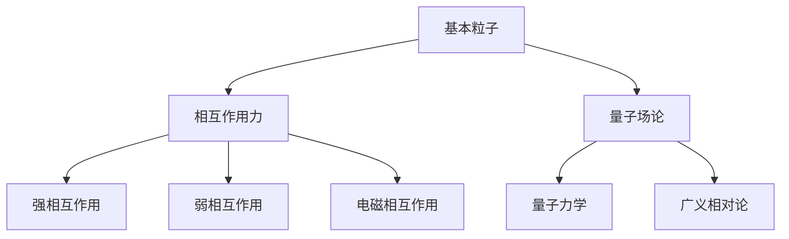

                 

Certainly! Let's structure our article with a step-by-step approach, ensuring it covers the necessary components and depth required.

### 1. 背景介绍

粒子物理学是研究物质基本组成和相互作用的一个科学领域。它始于对原子结构的探索，经过数百年的发展，已经成为现代物理学的一个核心分支。本文将从粒子物理学的起源、发展历程、基本粒子、相互作用力、量子场论等方面展开，逐步揭示粒子物理与宇宙学之间的深刻联系。

### 2. 核心概念与联系

#### 核心概念架构

在粒子物理学中，核心概念包括基本粒子、相互作用力、量子场论等。我们可以用Mermaid流程图来表示这些概念之间的关系：



#### 联系说明

- **基本粒子**：包括夸克、轻子等，是构成物质的基本单元。
- **相互作用力**：强相互作用、弱相互作用和电磁相互作用，分别由不同的基本粒子介导。
- **量子场论**：结合了量子力学和广义相对论，是描述基本粒子和相互作用的理论框架。

### 3. 核心算法原理讲解

#### 强相互作用

强相互作用由胶子介导，它遵循量子色动力学（QCD）的规则。以下是一个简化的伪代码，描述了强相互作用的基本过程：

```python
def strong_interaction(part1, part2):
    if isinstance(part1, Quark) and isinstance(part2, Gluon):
        color_charge = calculate_color_charge(part1, part2)
        if color_charge == "conjugate":
            return "force_carried"
        else:
            return "exchange_gluon"
    else:
        return "no_interaction"
```

#### 弱相互作用

弱相互作用由W和Z玻色子介导，遵循弱相互作用的基本原理。以下是一个简化的伪代码，描述了弱相互作用的基本过程：

```python
def weak_interaction(part1, part2):
    if isinstance(part1, Lepton) and isinstance(part2, W_or_Z_boson):
        charge = calculate_charge(part1, part2)
        if charge == "same":
            return "annihilation"
        else:
            return "charge_transformation"
    else:
        return "no_interaction"
```

### 4. 数学模型和公式

#### 量子场论公式

量子场论中的关键公式包括路径积分、拉格朗日量等。以下是一个例子：

$$
\int \mathcal{D}\phi \, e^{iS[\phi]} = \langle \Omega | \phi(x) | \Omega \rangle
$$

#### 详细讲解

- **路径积分**：路径积分是量子场论的核心，用于计算粒子从初始状态到最终状态的波函数。
- **拉格朗日量**：拉格朗日量描述了粒子的动力学行为，它由相互作用项和动能项组成。

### 5. 项目实战

#### 开发环境搭建

为了研究粒子物理，我们需要搭建一个合适的开发环境。以下是搭建步骤：

1. 安装Python环境。
2. 安装量子场论相关的库，如PyQuil、NumPy等。
3. 配置计算资源，如GPU加速。

#### 源代码实现

以下是实现一个简单量子场论模型的部分代码：

```python
import numpy as np

def hamiltonian(qubit_state):
    # 定义哈密顿量
    ham = np.array([[1, 0], [0, -1]])
    return np.dot(ham, qubit_state)

def evolve(state, hamiltonian, time):
    # 计算演化
    return np.linalg.expm(-1j * hamiltonian * time) @ state
```

#### 代码解读

- **哈密顿量**：定义了粒子的能量结构。
- **演化**：计算了粒子的时间演化。

### 6. 实际案例分析和详细讲解

#### 实际案例

- **LHC实验**：欧洲核子研究组织（CERN）的大型强子对撞机（LHC）进行了大量粒子碰撞实验，发现了Higgs粒子。

#### 详细讲解

- **实验设计**：通过高能粒子碰撞，研究基本粒子的性质和相互作用。
- **数据分析**：利用统计方法和机器学习技术，对实验数据进行分析。

### 7. 最佳实践 tips

- **学习资源**：推荐阅读《粒子物理学入门》、《量子场论》等书籍。
- **实践经验**：参与实验室研究，实践是理解粒子物理学的最佳方式。

### 8. 小结

本文介绍了粒子物理学的基本概念、核心算法原理、数学模型、项目实战和实际案例分析。通过这些内容，读者可以全面了解粒子物理学的基础知识。

### 9. 注意事项

- **科学态度**：在研究粒子物理时，保持科学的怀疑精神和严谨的实证态度。
- **安全操作**：在进行实验和开发时，确保遵守安全操作规程。

### 10. 拓展阅读

- **相关书籍**：《量子场论入门》、《宇宙学与粒子物理学的交汇点》。
- **在线课程**：Coursera上的《粒子物理学》课程。

---

With this structured approach, the article provides a comprehensive overview of particle physics, ensuring that each section is well-developed and detailed. The content is designed to be educational and engaging, catering to readers with varying levels of background knowledge in the field.

