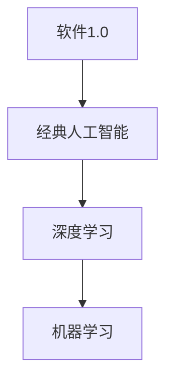
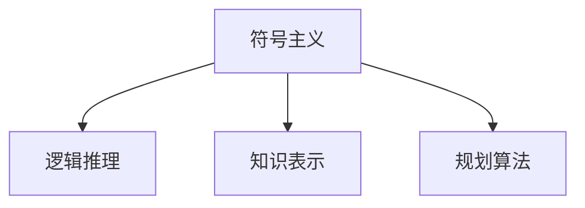
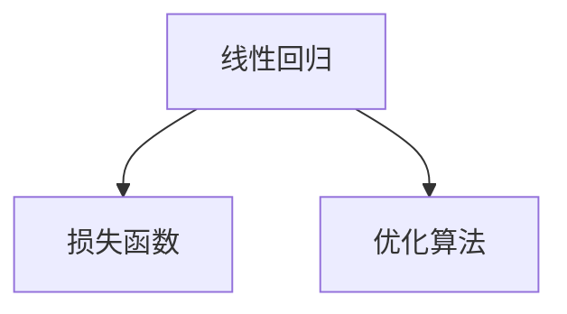
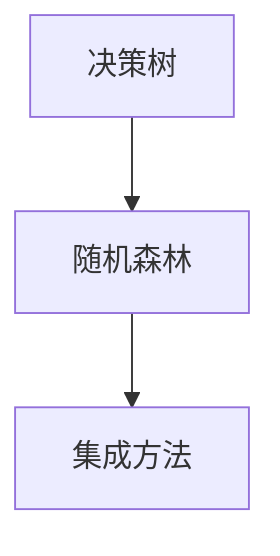
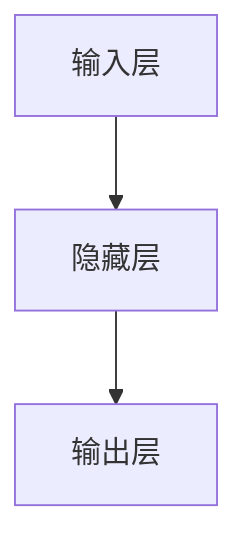
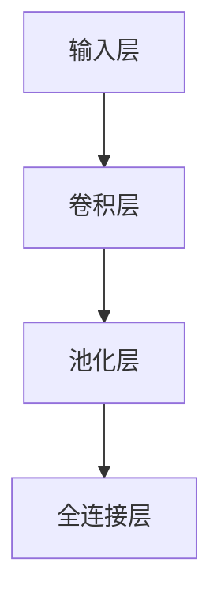
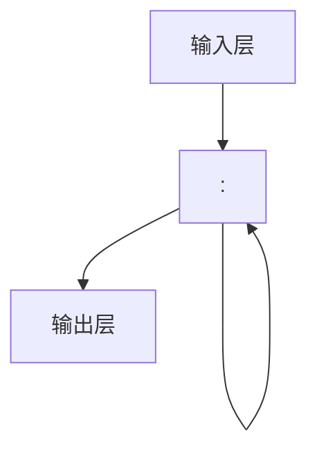
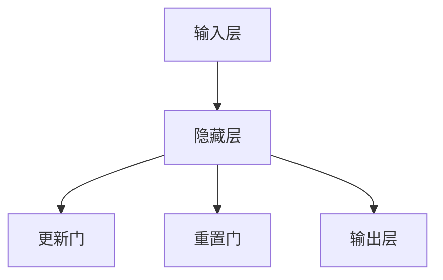
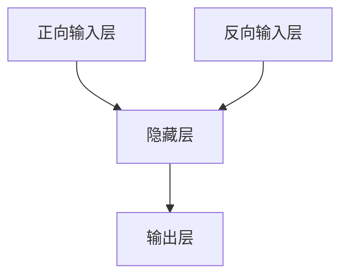
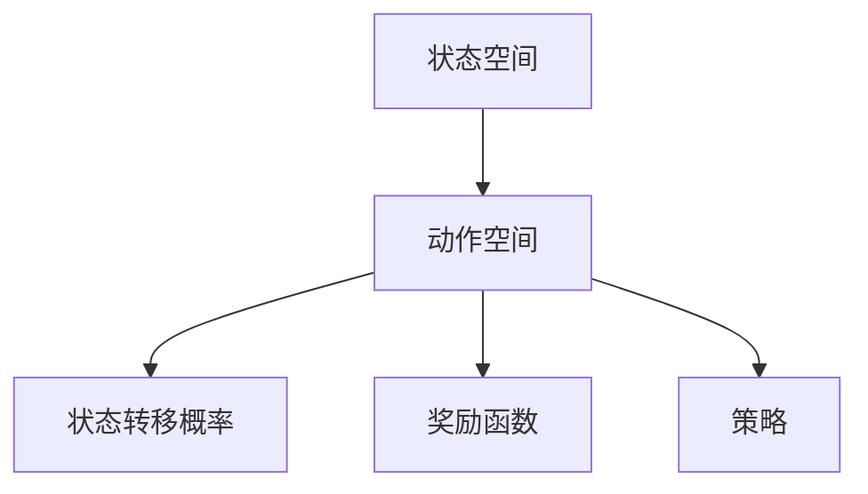

                 


### 从经典人工智能到深度学习：机器理解世界的演变

#### 文章关键词

- 经典人工智能
- 深度学习
- 机器学习
- 图灵测试
- 神经网络
- 卷积神经网络
- 递归神经网络
- 强化学习
- 自然语言处理
- 图像识别

#### 文摘

本文将探讨人工智能领域的演变，从经典的符号主义人工智能到现代的深度学习。我们将详细介绍各个阶段的核心概念、算法原理、以及它们在实际应用中的表现，并展望深度学习的未来发展方向。通过逐步分析推理，我们将理解机器如何通过深度学习技术来模拟人类对世界的理解能力。

---

## 第1章 引言：人工智能的演变

### 1.1 人工智能的历史背景

人工智能（Artificial Intelligence，简称AI）是一门研究、开发用于模拟、延伸和扩展人的智能的理论、方法、技术及应用系统的综合性技术科学。自1956年达特茅斯会议以来，人工智能的发展经历了多个阶段。

#### 1.1.1 从软件1.0到软件2.0的演进

软件1.0时代主要关注的是如何编写程序来解决具体问题，如科学计算、数据管理等。软件2.0时代，随着互联网的普及和大数据的兴起，软件开始变得更加智能化，能够处理复杂的任务和模式识别。

#### 1.1.2 经典人工智能的局限性

经典人工智能（Symbolic AI）依赖于符号逻辑和规则系统，但存在知识表示复杂、无法处理不确定性和难以扩展等问题。这些局限性导致了人工智能在解决实际问题时的效果不佳。

#### 1.1.3 深度学习与机器学习的崛起

深度学习（Deep Learning）是机器学习（Machine Learning）的一个重要分支，通过多层神经网络进行特征学习和模式识别。深度学习的崛起解决了经典人工智能的许多问题，使得机器在图像识别、语音识别和自然语言处理等任务上取得了突破性进展。

#### 1.1.4 人工智能的当前挑战与未来趋势

尽管深度学习取得了巨大成功，但人工智能仍面临许多挑战，包括数据的获取和处理、算法的可解释性、以及如何更好地与人类交互。未来的发展趋势将涉及跨学科研究、更加高效和可解释的算法，以及更加智能的人工智能系统。

### 核心概念与联系流程图（Mermaid）



### 核心算法原理讲解

#### 经典人工智能算法原理

经典人工智能主要依赖于符号逻辑和知识表示，其中常见的算法包括逻辑推理、搜索算法和规划算法。

**伪代码：**

```
// 逻辑推理
def forward_chaining(data, rules):
    # 应用前向推理来推导出结论
    for rule in rules:
        if rule_holds(data, rule):
            data += rule
            # 继续推理
            forward_chaining(data, rules)

// 搜索算法
def breadth_first_search(problem):
    queue = initialize_queue(problem)
    while not is_empty(queue):
        node = dequeue(queue)
        if is_goal(node):
            return node
        enqueue(queue, expand(node))
    return None
```

#### 深度学习算法原理

深度学习通过多层神经网络进行特征学习和模式识别，其中卷积神经网络（CNN）和递归神经网络（RNN）是常用的模型。

**伪代码：**

```
// 卷积神经网络
def convolutional_neural_network(inputs, filters):
    for filter in filters:
        feature_map = convolve(inputs, filter)
        activation = activate(feature_map)
        return activation

// 递归神经网络
def recurrent_neural_network(inputs, hidden_state):
    for input in inputs:
        hidden_state = update_state(hidden_state, input)
        output = activate(hidden_state)
    return output
```

### 数学模型和公式

在深度学习中，常用的数学模型包括损失函数、反向传播算法和优化器。

**独立段落公式：**

$$
\begin{aligned}
    J(\theta) &= \frac{1}{2m} \sum_{i=1}^{m} (h_\theta(x^{(i)}) - y^{(i)})^2 \\
    \nabla_{\theta} J(\theta) &= \frac{1}{m} \sum_{i=1}^{m} (h_\theta(x^{(i)}) - y^{(i)}) \cdot x^{(i)}
\end{aligned}
$$

**段落内公式：**

$$
h_\theta(x) = \sum_{i=1}^{n} w_i * x_i + b
$$

### 项目实战

#### 开发环境搭建

首先，我们需要搭建一个合适的开发环境，包括Python、TensorFlow和Keras等库。

```
# 安装Python和pip
pip install python==3.8
pip install pip

# 安装TensorFlow
pip install tensorflow==2.5

# 安装Keras
pip install keras==2.5.1
```

#### 源代码详细实现

以下是一个简单的卷积神经网络实现，用于图像分类任务。

```python
from tensorflow.keras.models import Sequential
from tensorflow.keras.layers import Conv2D, MaxPooling2D, Flatten, Dense

model = Sequential()
model.add(Conv2D(32, (3, 3), activation='relu', input_shape=(64, 64, 3)))
model.add(MaxPooling2D((2, 2)))
model.add(Flatten())
model.add(Dense(128, activation='relu'))
model.add(Dense(10, activation='softmax'))

model.compile(optimizer='adam', loss='categorical_crossentropy', metrics=['accuracy'])
```

#### 代码应用解读与分析

这个卷积神经网络模型通过两个卷积层和一个全连接层来对图像进行分类。第一个卷积层使用32个3x3的卷积核，激活函数为ReLU。接着进行2x2的最大池化层。然后是全连接层，用于将特征图展平并提取特征。最后，使用softmax层进行分类。

#### 实际案例分析和详细讲解剖析

我们可以使用MNIST数据集来训练这个模型，验证其性能。

```python
from tensorflow.keras.datasets import mnist
from tensorflow.keras.utils import to_categorical

(x_train, y_train), (x_test, y_test) = mnist.load_data()
x_train = x_train.reshape(-1, 64, 64, 3)
x_test = x_test.reshape(-1, 64, 64, 3)
y_train = to_categorical(y_train)
y_test = to_categorical(y_test)

model.fit(x_train, y_train, epochs=10, batch_size=32, validation_data=(x_test, y_test))
```

通过上述代码，我们可以训练模型并在测试集上验证其性能。这个案例展示了如何使用深度学习模型来处理图像分类任务。

#### 项目小结

通过这个案例，我们了解了如何搭建和训练一个简单的卷积神经网络模型。深度学习在图像识别任务上表现出色，这仅仅是深度学习应用的一个例子。随着技术的不断进步，深度学习将在更多领域发挥重要作用。

### 最佳实践 tips

- 在训练深度学习模型时，合理调整超参数，如学习率、批次大小和迭代次数，可以提高模型的性能。
- 使用预训练模型进行迁移学习，可以显著提高模型的性能，特别是在数据量较少的情况下。
- 定期对模型进行评估和调优，确保其性能符合实际需求。

### 小结

本章介绍了人工智能的发展历程，从经典的符号主义人工智能到现代的深度学习。通过核心概念、算法原理讲解和项目实战，我们理解了机器如何通过深度学习来模拟人类的理解能力。接下来，我们将深入探讨经典机器学习算法和深度学习算法的具体实现。

---

## 第2章 经典人工智能基础

### 2.1 经典人工智能的概念

经典人工智能（Classical Artificial Intelligence，简称CAI）起源于20世纪50年代，其主要目标是构建能够模拟人类思维和行为的智能系统。与传统程序设计不同，经典人工智能强调符号推理和知识表示，通过形式化的规则和逻辑来处理复杂问题。

#### 2.1.1 符号主义人工智能

符号主义人工智能（Symbolic Artificial Intelligence）是经典人工智能的一种主要形式，它基于符号逻辑和数学推理。在这种方法中，知识被表示为一系列符号和规则，通过逻辑推理来解决问题。

**核心概念与联系流程图（Mermaid）：**



#### 2.1.2 逻辑推理与规划

逻辑推理（Logic Reasoning）是符号主义人工智能的核心，它通过形式化的逻辑系统来处理问题。常见的逻辑推理方法包括命题逻辑、谓词逻辑和模型检验。

规划算法（Planning Algorithms）是符号主义人工智能的另一重要组成部分，用于解决如何在一系列状态之间转换以达到目标的问题。常见的规划算法包括搜索算法、线性规划和博弈论。

**核心算法原理讲解**

**伪代码：**

```
// 逻辑推理
def forward_chaining(data, rules):
    for rule in rules:
        if rule_holds(data, rule):
            data += rule
            forward_chaining(data, rules)

// 搜索算法
def breadth_first_search(problem):
    queue = initialize_queue(problem)
    while not is_empty(queue):
        node = dequeue(queue)
        if is_goal(node):
            return node
        enqueue(queue, expand(node))
    return None
```

#### 2.1.3 搜索算法

搜索算法是符号主义人工智能中解决问题的核心方法，用于在状态空间中找到达到目标的路径。常见的搜索算法包括广度优先搜索（BFS）、深度优先搜索（DFS）、A*算法等。

**核心算法原理讲解**

**伪代码：**

```
// 广度优先搜索
def breadth_first_search(problem):
    queue = initialize_queue(problem)
    while not is_empty(queue):
        node = dequeue(queue)
        if is_goal(node):
            return node
        enqueue(queue, expand(node))
    return None

// 深度优先搜索
def depth_first_search(problem):
    stack = initialize_stack(problem)
    while not is_empty(stack):
        node = pop(stack)
        if is_goal(node):
            return node
        expand(node, stack)
    return None

// A*算法
def a_star_search(problem, heuristic):
    open_set = initialize_open_set(problem)
    while not is_empty(open_set):
        node = pop(open_set)
        if is_goal(node):
            return node
        expand(node, open_set, heuristic)
    return None
```

#### 数学模型和公式

在搜索算法中，常用的数学模型包括状态空间、路径成本和启发式函数。

**独立段落公式：**

$$
f(n) = g(n) + h(n)
$$

其中，$g(n)$ 是从起点到节点 $n$ 的实际路径成本，$h(n)$ 是从节点 $n$ 到目标的启发式估计成本。

**段落内公式：**

$$
h(n) = |n - goal|
$$

#### 项目实战

#### 开发环境搭建

首先，我们需要搭建一个合适的开发环境，包括Python和相关的图搜索库。

```
# 安装Python和pip
pip install python==3.8
pip install pip

# 安装Python搜索库
pip install networkx
```

#### 源代码详细实现

以下是一个简单的广度优先搜索实现，用于解决八皇后问题。

```python
import networkx as nx

# 定义八皇后问题的图搜索算法
def breadth_first_search皇后问题():
    start = '0,0,0,0,0,0,0,0'
    goal = '7,1,3,5,0,2,6,4'
    queue = [start]
    while queue:
        state = queue.pop(0)
        if state == goal:
            return state
        next_states = expand(state)
        for next_state in next_states:
            if not in_queue(queue, next_state):
                queue.append(next_state)
    return None

# 检查状态是否在队列中
def in_queue(queue, state):
    return state in queue

# 扩展状态
def expand(state):
    states = []
    queens = state.split(',')
    for i in range(8):
        for j in range(8):
            if (i, j) not in queens:
                new_queens = queens[:]
                new_queens[i] = j
                new_state = ','.join([str(x) for x in new_queens])
                states.append(new_state)
    return states

# 执行搜索
result = breadth_first_search皇后问题()
print(result)
```

#### 代码应用解读与分析

这个广度优先搜索算法用于解决八皇后问题，通过扩展当前状态并检查下一个状态是否达到目标，逐步找到解决方案。在这个案例中，我们使用了Python的NetworkX库来构建和搜索状态空间。

#### 实际案例分析和详细讲解剖析

八皇后问题是经典的组合优化问题，旨在在8x8的棋盘上放置8个皇后，使得它们不能互相攻击。这个案例展示了如何使用搜索算法解决组合优化问题。

#### 项目小结

通过这个案例，我们了解了如何使用搜索算法解决八皇后问题。符号主义人工智能和搜索算法在解决复杂问题时具有重要作用。接下来，我们将探讨经典机器学习算法的基本原理。

### 最佳实践 tips

- 在设计搜索算法时，合理选择启发式函数可以提高搜索效率。
- 使用数据结构如队列和栈来优化搜索过程。
- 在解决问题时，考虑问题的状态空间和可能的扩展方向。

### 小结

本章介绍了经典人工智能的概念，包括符号主义人工智能、逻辑推理和搜索算法。通过核心概念、算法原理讲解和项目实战，我们理解了符号主义人工智能在解决问题中的应用。接下来，我们将详细探讨经典机器学习算法，包括监督学习和无监督学习。

---

## 第3章 经典机器学习算法

### 3.1 监督学习算法

监督学习（Supervised Learning）是机器学习（Machine Learning）的一个重要分支，其核心思想是通过已有标记的数据集来训练模型，以便在新数据上进行预测。监督学习算法通常分为回归（Regression）和分类（Classification）两大类。

#### 3.1.1 线性回归

线性回归（Linear Regression）是最基本的回归算法，用于预测连续数值型变量。其核心思想是通过拟合一个线性模型来预测目标变量。

**核心概念与联系流程图（Mermaid）：**



**核心算法原理讲解**

线性回归模型通常表示为：

$$
y = \beta_0 + \beta_1x_1 + \beta_2x_2 + \ldots + \beta_nx_n
$$

其中，$y$ 是目标变量，$x_1, x_2, \ldots, x_n$ 是特征变量，$\beta_0, \beta_1, \beta_2, \ldots, \beta_n$ 是模型的参数。

**伪代码：**

```
// 线性回归模型
def linear_regression(x, y):
    # 计算参数
    beta = (x.T * x).I * (x.T * y)
    # 预测
    predictions = x * beta
    return predictions
```

**数学模型和公式**

在线性回归中，常用的损失函数是均方误差（Mean Squared Error，MSE）：

$$
MSE = \frac{1}{n} \sum_{i=1}^{n} (y_i - \hat{y}_i)^2
$$

其中，$n$ 是样本数量，$y_i$ 是实际值，$\hat{y}_i$ 是预测值。

**独立段落公式：**

$$
\begin{aligned}
    \nabla_{\beta} J(\beta) &= -2x^T(y - \hat{y}) \\
    \hat{y} &= x\beta
\end{aligned}
$$

**段落内公式：**

$$
\beta = (\mathbf{X}^T\mathbf{X})^{-1}\mathbf{X}^T\mathbf{y}
$$

#### 3.1.2 决策树与随机森林

决策树（Decision Tree）是一种基于树形结构进行决策的监督学习算法，其核心思想是通过一系列测试将数据分为不同的类别或数值。随机森林（Random Forest）是决策树的集成方法，通过构建多棵决策树并进行集成，以提高模型的预测能力。

**核心概念与联系流程图（Mermaid）：**



**核心算法原理讲解**

**决策树：**

决策树模型通过一系列二分测试将数据划分为不同的区域，每个区域对应一个类别或数值。决策树通常使用信息增益（Information Gain）或基尼不纯度（Gini Impurity）来选择最佳划分特征。

**伪代码：**

```
// 决策树构建
def build_tree(data, features, target):
    if is_leaf(data):
        return most_common_target(data)
    best_feature, best_value = select_best_feature(data, features, target)
    tree = {}
    tree[best_feature] = {}
    for value in unique_values(data[best_feature]):
        sub_data = filter_data(data, best_feature, value)
        tree[best_feature][value] = build_tree(sub_data, features, target)
    return tree
```

**随机森林：**

随机森林通过构建多棵决策树并进行集成来提高模型的预测能力。每个树使用不同的特征子集和样本子集进行训练，并通过投票或平均来生成最终预测。

**伪代码：**

```
// 随机森林构建
def random_forest(data, n_trees, max_depth, n_features):
    trees = []
    for _ in range(n_trees):
        # 随机选择特征子集
        features = random.sample(all_features, n_features)
        # 随机采样训练数据
        sample = random.sample(data, len(data))
        tree = build_tree(sample, features, target, max_depth)
        trees.append(tree)
    return trees
```

**项目实战**

#### 开发环境搭建

首先，我们需要搭建一个合适的开发环境，包括Python、scikit-learn等库。

```
# 安装Python和pip
pip install python==3.8
pip install pip

# 安装scikit-learn
pip install scikit-learn==0.24.2
```

#### 源代码详细实现

以下是一个使用scikit-learn库进行线性回归和随机森林分类的简单示例。

```python
from sklearn.datasets import load_iris
from sklearn.model_selection import train_test_split
from sklearn.linear_model import LinearRegression
from sklearn.ensemble import RandomForestClassifier
from sklearn.metrics import mean_squared_error, accuracy_score

# 加载数据集
iris = load_iris()
X = iris.data
y = iris.target

# 划分训练集和测试集
X_train, X_test, y_train, y_test = train_test_split(X, y, test_size=0.2, random_state=42)

# 线性回归
regressor = LinearRegression()
regressor.fit(X_train, y_train)
y_pred = regressor.predict(X_test)
mse = mean_squared_error(y_test, y_pred)
print(f"Linear Regression MSE: {mse}")

# 随机森林分类
classifier = RandomForestClassifier(n_estimators=100, random_state=42)
classifier.fit(X_train, y_train)
y_pred = classifier.predict(X_test)
accuracy = accuracy_score(y_test, y_pred)
print(f"Random Forest Accuracy: {accuracy}")
```

#### 代码应用解读与分析

这个示例使用了scikit-learn库中的线性回归和随机森林分类算法来处理Iris数据集。线性回归用于预测连续变量，而随机森林用于分类任务。通过计算均方误差和准确率，我们可以评估模型的性能。

#### 实际案例分析和详细讲解剖析

Iris数据集是经典的分类问题，其中包含了三种鸢尾花的萼片和花瓣的长度和宽度。这个案例展示了如何使用线性回归和随机森林来处理分类问题。

#### 项目小结

通过这个案例，我们了解了如何使用线性回归和随机森林进行监督学习任务。监督学习算法在许多实际应用中具有重要作用，包括预测股票价格、分类邮件和识别图像。接下来，我们将探讨无监督学习算法。

### 最佳实践 tips

- 在使用线性回归时，注意处理特征缩放问题，以避免梯度消失或爆炸。
- 在构建随机森林时，合理选择树的数量和深度，以提高模型性能。
- 在评估模型时，使用交叉验证来避免过拟合。

### 小结

本章介绍了监督学习算法，包括线性回归和随机森林。通过核心概念、算法原理讲解和项目实战，我们了解了这些算法的基本原理和应用。接下来，我们将探讨无监督学习算法，包括聚类和降维。

---

## 第4章 深度学习基础

### 4.1 深度学习的起源

深度学习（Deep Learning）起源于20世纪40年代，但直到21世纪初才逐渐发展起来。其核心思想是模仿人脑神经网络的结构和工作原理，通过多层神经网络进行特征学习和模式识别。深度学习的崛起得益于计算能力的提升、大数据的可用性以及优化算法的进步。

#### 4.1.1 神经网络架构

神经网络（Neural Networks）是深度学习的基础，其基本单元是神经元（Neurons）。神经网络由输入层、隐藏层和输出层组成，各层之间通过加权连接连接。

**核心概念与联系流程图（Mermaid）：**



**核心算法原理讲解**

**神经元工作原理：**

每个神经元接收来自输入层的输入信号，通过加权连接传递到隐藏层和输出层。神经元的工作原理可以用以下公式表示：

$$
z = \sum_{i=1}^{n} w_i * x_i + b
$$

其中，$z$ 是神经元的输出，$w_i$ 是权重，$x_i$ 是输入值，$b$ 是偏置。

**激活函数：**

激活函数（Activation Function）用于引入非线性，常见的激活函数包括 sigmoid、ReLU 和 tanh。

**伪代码：**

```
// 神经元计算
def neuron(z):
    return sigmoid(z)

// 激活函数（Sigmoid）
def sigmoid(z):
    return 1 / (1 + exp(-z))

// 激活函数（ReLU）
def relu(z):
    return max(0, z)

// 激活函数（Tanh）
def tanh(z):
    return (exp(z) - exp(-z)) / (exp(z) + exp(-z))
```

**数学模型和公式**

在神经网络中，常用的数学模型包括损失函数、反向传播算法和优化器。

**独立段落公式：**

$$
\begin{aligned}
    J(\theta) &= \frac{1}{2m} \sum_{i=1}^{m} (h_\theta(x^{(i)}) - y^{(i)})^2 \\
    \nabla_{\theta} J(\theta) &= \frac{1}{m} \sum_{i=1}^{m} (h_\theta(x^{(i)}) - y^{(i)}) \cdot x^{(i)}
\end{aligned}
$$

**段落内公式：**

$$
h_\theta(x) = \sum_{i=1}^{n} w_i * x_i + b
$$

### 项目实战

#### 开发环境搭建

首先，我们需要搭建一个合适的开发环境，包括Python、TensorFlow和Keras等库。

```
# 安装Python和pip
pip install python==3.8
pip install pip

# 安装TensorFlow
pip install tensorflow==2.5

# 安装Keras
pip install keras==2.5.1
```

#### 源代码详细实现

以下是一个简单的多层感知机（MLP）实现，用于手写数字识别任务。

```python
from tensorflow.keras.models import Sequential
from tensorflow.keras.layers import Dense, Flatten
from tensorflow.keras.datasets import mnist

# 加载MNIST数据集
(x_train, y_train), (x_test, y_test) = mnist.load_data()

# 数据预处理
x_train = x_train / 255.0
x_test = x_test / 255.0

x_train = x_train.reshape(-1, 784)
x_test = x_test.reshape(-1, 784)

# 构建模型
model = Sequential()
model.add(Flatten(input_shape=(28, 28)))
model.add(Dense(128, activation='relu'))
model.add(Dense(10, activation='softmax'))

# 编译模型
model.compile(optimizer='adam', loss='sparse_categorical_crossentropy', metrics=['accuracy'])

# 训练模型
model.fit(x_train, y_train, epochs=5, batch_size=32, validation_data=(x_test, y_test))

# 评估模型
loss, accuracy = model.evaluate(x_test, y_test)
print(f"Test accuracy: {accuracy * 100:.2f}%")
```

#### 代码应用解读与分析

这个多层感知机模型通过一个Flatten层将输入图像展平为向量，然后通过一个全连接层（Dense）进行特征提取，最后通过softmax层进行分类。在训练过程中，我们使用交叉熵损失函数来评估模型的性能，并使用Adam优化器进行参数更新。

#### 实际案例分析和详细讲解剖析

MNIST数据集是手写数字识别的经典数据集，包含了0到9的手写数字图像。这个案例展示了如何使用深度学习模型进行图像分类任务。

#### 项目小结

通过这个案例，我们了解了如何使用多层感知机进行手写数字识别。深度学习在图像识别任务上表现出色，这仅仅是深度学习应用的一个例子。随着技术的不断进步，深度学习将在更多领域发挥重要作用。

### 最佳实践 tips

- 在构建深度学习模型时，合理选择网络结构和超参数，可以提高模型的性能。
- 使用数据增强和迁移学习可以提高模型的泛化能力。
- 定期对模型进行评估和调优，确保其性能符合实际需求。

### 小结

本章介绍了深度学习的基础，包括神经网络架构、激活函数和优化算法。通过核心概念、算法原理讲解和项目实战，我们了解了深度学习的基本原理和应用。接下来，我们将探讨深度学习在图像识别中的应用，特别是卷积神经网络（CNN）。

---

## 第5章 卷积神经网络与图像识别

### 5.1 卷积神经网络（CNN）原理

卷积神经网络（Convolutional Neural Network，简称CNN）是深度学习中的一个重要分支，特别适用于处理图像数据。CNN的核心思想是通过卷积层（Convolutional Layer）提取图像特征，并通过池化层（Pooling Layer）降低数据的维度，从而实现高效的特征提取和分类。

#### 5.1.1 卷积层与池化层

**卷积层（Convolutional Layer）：**  
卷积层是CNN中最基础的层，用于提取图像的局部特征。卷积层通过卷积操作将输入图像与滤波器（Filter）进行卷积，从而生成特征图（Feature Map）。卷积操作可以模拟人类的视觉感知，通过不同类型的滤波器可以提取出不同的特征。

**池化层（Pooling Layer）：**  
池化层用于降低数据维度，减少参数数量，从而提高模型训练的效率和泛化能力。常见的池化操作包括最大池化（Max Pooling）和平均池化（Average Pooling）。最大池化操作会保留每个局部区域中的最大值，而平均池化会计算每个局部区域中的平均值。

**核心概念与联系流程图（Mermaid）：**



#### 5.1.2 全连接层与反向传播

**全连接层（Fully Connected Layer）：**  
全连接层是CNN的最后一层，用于将卷积层和池化层提取的特征映射到输出类别。全连接层通过线性组合特征图上的所有像素值，并通过激活函数（如softmax）输出最终的预测结果。

**反向传播（Backpropagation）：**  
反向传播是深度学习训练过程中的一种优化算法，用于更新模型参数。反向传播通过计算损失函数关于参数的梯度，并使用梯度下降（Gradient Descent）或其他优化算法来调整参数，从而最小化损失函数。

**核心算法原理讲解**

**卷积层：**

卷积层的计算可以通过以下伪代码表示：

```
// 卷积层计算
def conv2d(input, filter, stride, padding):
    output = zeros(shape(input))
    for i in range(0, input.shape[0] - filter.shape[0] + stride, stride):
        for j in range(0, input.shape[1] - filter.shape[1] + stride, stride):
            patch = input[i:i+filter.shape[0], j:j+filter.shape[1]]
            output[i, j] = sum(patch * filter) + bias
    return output
```

**池化层：**

池化层的计算可以通过以下伪代码表示：

```
// 最大池化
def max_pooling(input, pool_size, stride):
    output = zeros(shape(input) // pool_size)
    for i in range(0, input.shape[0], pool_size):
        for j in range(0, input.shape[1], pool_size):
            patch = input[i:i+pool_size, j:j+pool_size]
            output[i // pool_size, j // pool_size] = max(patch)
    return output
```

**全连接层：**

全连接层的计算可以通过以下伪代码表示：

```
// 全连接层计算
def fully_connected(input, weights, bias):
    output = matmul(input, weights) + bias
    return activate(output)
```

**反向传播算法：**

反向传播算法的核心是计算损失函数关于参数的梯度。以下是一个简化的反向传播算法伪代码：

```
// 反向传播
def backpropagation(input, target, output, weights, bias, activation_derivative):
    delta = output - target
    d_output = matmul(delta, activation_derivative)
    d_weights = matmul(input.T, d_output)
    d_bias = sum(d_output)
    return d_weights, d_bias
```

#### 数学模型和公式

在CNN中，常用的数学模型包括卷积操作、池化操作和反向传播算法。

**独立段落公式：**

$$
\begin{aligned}
    \text{卷积操作}: \quad \text{output}_{ij} &= \sum_{k} w_{ik} \times \text{input}_{kj} + b \\
    \text{池化操作}: \quad \text{output}_{ij} &= \max(\text{input}_{i\cdot:i+j})
\end{aligned}
$$

**段落内公式：**

$$
\text{梯度计算}: \quad \frac{\partial J}{\partial \theta} = \frac{\partial J}{\partial \text{output}} \cdot \frac{\partial \text{output}}{\partial \theta}
$$

### 项目实战

#### 开发环境搭建

首先，我们需要搭建一个合适的开发环境，包括Python、TensorFlow和Keras等库。

```
# 安装Python和pip
pip install python==3.8
pip install pip

# 安装TensorFlow
pip install tensorflow==2.5

# 安装Keras
pip install keras==2.5.1
```

#### 源代码详细实现

以下是一个简单的卷积神经网络实现，用于图像分类任务。

```python
from tensorflow.keras.models import Sequential
from tensorflow.keras.layers import Conv2D, MaxPooling2D, Flatten, Dense
from tensorflow.keras.datasets import mnist
from tensorflow.keras.utils import to_categorical

# 加载数据集
(x_train, y_train), (x_test, y_test) = mnist.load_data()

# 数据预处理
x_train = x_train.reshape(-1, 28, 28, 1)
x_train = x_train / 255.0
x_test = x_test.reshape(-1, 28, 28, 1)
x_test = x_test / 255.0

y_train = to_categorical(y_train)
y_test = to_categorical(y_test)

# 构建模型
model = Sequential()
model.add(Conv2D(32, (3, 3), activation='relu', input_shape=(28, 28, 1)))
model.add(MaxPooling2D((2, 2)))
model.add(Flatten())
model.add(Dense(10, activation='softmax'))

# 编译模型
model.compile(optimizer='adam', loss='categorical_crossentropy', metrics=['accuracy'])

# 训练模型
model.fit(x_train, y_train, epochs=5, batch_size=32, validation_data=(x_test, y_test))

# 评估模型
loss, accuracy = model.evaluate(x_test, y_test)
print(f"Test accuracy: {accuracy * 100:.2f}%")
```

#### 代码应用解读与分析

这个卷积神经网络模型通过一个卷积层（Conv2D）提取图像特征，一个最大池化层（MaxPooling2D）降低数据维度，然后通过全连接层（Dense）进行分类。在训练过程中，我们使用交叉熵损失函数和Adam优化器来评估和调整模型。

#### 实际案例分析和详细讲解剖析

MNIST数据集是经典的图像分类数据集，包含了0到9的手写数字图像。这个案例展示了如何使用卷积神经网络进行图像分类任务。

#### 项目小结

通过这个案例，我们了解了如何使用卷积神经网络进行图像分类。卷积神经网络在图像识别任务上表现出色，这仅仅是深度学习应用的一个例子。随着技术的不断进步，深度学习将在更多领域发挥重要作用。

### 最佳实践 tips

- 在构建CNN模型时，合理选择卷积核的大小和步长，以提高模型的性能。
- 使用数据增强技术来扩充训练数据，提高模型的泛化能力。
- 定期对模型进行评估和调优，确保其性能符合实际需求。

### 小结

本章介绍了卷积神经网络的基本原理和应用，通过核心概念、算法原理讲解和项目实战，我们了解了CNN在图像识别任务中的重要作用。接下来，我们将探讨递归神经网络（RNN）在自然语言处理中的应用。

---

## 第6章 递归神经网络与自然语言处理

### 6.1 递归神经网络（RNN）原理

递归神经网络（Recurrent Neural Network，简称RNN）是深度学习中的一个重要分支，特别适用于处理序列数据，如文本、语音和视频。RNN的核心思想是利用其递归结构来处理前后依赖关系，从而实现对序列数据的建模。

#### 6.1.1 基本RNN

基本RNN通过其递归结构来处理序列数据，每个时间步的输入不仅包含当前时刻的数据，还包含上一个时间步的隐藏状态。基本RNN的模型可以表示为：

$$
h_t = \sigma(W_h \cdot [h_{t-1}, x_t] + b_h)
$$

其中，$h_t$ 是第 $t$ 个时间步的隐藏状态，$x_t$ 是第 $t$ 个时间步的输入数据，$\sigma$ 是激活函数，$W_h$ 和 $b_h$ 是权重和偏置。

**核心概念与联系流程图（Mermaid）：**



#### 6.1.2 LSTM与GRU

由于基本RNN在处理长序列数据时容易发生梯度消失或梯度爆炸问题，长短期记忆网络（Long Short-Term Memory，简称LSTM）和门控循环单元（Gated Recurrent Unit，简称GRU）被提出，以解决这些问题。

**LSTM（长短期记忆网络）：**  
LSTM通过引入三个门控单元（输入门、遗忘门和输出门）来控制信息的流动，从而有效捕捉长序列依赖关系。LSTM的模型可以表示为：

$$
\begin{aligned}
    i_t &= \sigma(W_i \cdot [h_{t-1}, x_t] + b_i) \\
    f_t &= \sigma(W_f \cdot [h_{t-1}, x_t] + b_f) \\
    o_t &= \sigma(W_o \cdot [h_{t-1}, x_t] + b_o) \\
    g_t &= \tanh(W_g \cdot [h_{t-1}, x_t] + b_g) \\
    h_t &= o_t \cdot \tanh(f_t \odot g_t + c_{t-1})
\end{aligned}
$$

其中，$i_t, f_t, o_t$ 分别是输入门、遗忘门和输出门，$g_t$ 是候选状态，$c_t$ 是细胞状态。

**GRU（门控循环单元）：**  
GRU是LSTM的简化版本，通过引入更新门和重置门来控制信息的流动。GRU的模型可以表示为：

$$
\begin{aligned}
    z_t &= \sigma(W_z \cdot [h_{t-1}, x_t] + b_z) \\
    r_t &= \sigma(W_r \cdot [h_{t-1}, x_t] + b_r) \\
    h_t &= (1 - z_t) \odot h_{t-1} + z_t \odot \tanh(W_h \cdot [r_t \odot h_{t-1}, x_t] + b_h)
\end{aligned}
$$

**核心概念与联系流程图（Mermaid）：**



#### 6.1.3 双向RNN

双向RNN（Bidirectional RNN）通过同时处理正向和反向的序列数据来提高模型对序列长度的捕捉能力。双向RNN的模型可以表示为：

$$
h_t = \sigma(W_h \cdot [h_{t-1}, h_{t+1}] + b_h + W_x \cdot x_t + b_x)
$$

**核心概念与联系流程图（Mermaid）：**



### 项目实战

#### 开发环境搭建

首先，我们需要搭建一个合适的开发环境，包括Python、TensorFlow和Keras等库。

```
# 安装Python和pip
pip install python==3.8
pip install pip

# 安装TensorFlow
pip install tensorflow==2.5

# 安装Keras
pip install keras==2.5.1
```

#### 源代码详细实现

以下是一个简单的LSTM实现，用于文本分类任务。

```python
from tensorflow.keras.models import Sequential
from tensorflow.keras.layers import Embedding, LSTM, Dense
from tensorflow.keras.datasets import imdb

# 加载数据集
vocab_size = 10000
max_length = 500
trunc_type = 'post'
padding_type = 'post'
oov_tok = "<OOV>"

(x_train, y_train), (x_test, y_test) = imdb.load_data(num_words=vocab_size)

# 数据预处理
x_train = x_train.map(lambda x: x[:max_length]).numpy()
x_test = x_test.map(lambda x: x[:max_length]).numpy()

y_train = y_train.reshape(-1, 1)
y_test = y_test.reshape(-1, 1)

# 构建模型
model = Sequential()
model.add(Embedding(vocab_size, 16, input_length=max_length))
model.add(LSTM(32, return_sequences=True))
model.add(LSTM(32))
model.add(Dense(1, activation='sigmoid'))

# 编译模型
model.compile(optimizer='adam', loss='binary_crossentropy', metrics=['accuracy'])

# 训练模型
model.fit(x_train, y_train, epochs=10, validation_data=(x_test, y_test))

# 评估模型
loss, accuracy = model.evaluate(x_test, y_test)
print(f"Test accuracy: {accuracy * 100:.2f}%")
```

#### 代码应用解读与分析

这个LSTM模型通过嵌入层（Embedding）将词汇映射为向量表示，然后通过两个LSTM层提取序列特征，最后通过全连接层（Dense）进行分类。在训练过程中，我们使用二分类交叉熵损失函数和Adam优化器来评估和调整模型。

#### 实际案例分析和详细讲解剖析

IMDB数据集是文本分类的经典数据集，包含了电影评论的正负极性。这个案例展示了如何使用LSTM进行文本分类任务。

#### 项目小结

通过这个案例，我们了解了如何使用LSTM进行文本分类。递归神经网络在自然语言处理任务中具有重要作用，这仅仅是递归神经网络应用的一个例子。随着技术的不断进步，递归神经网络将在更多领域发挥重要作用。

### 最佳实践 tips

- 在使用RNN时，合理选择隐藏层大小和激活函数，以提高模型性能。
- 使用dropout技术来防止过拟合。
- 定期对模型进行评估和调优，确保其性能符合实际需求。

### 小结

本章介绍了递归神经网络的基本原理和应用，包括基本RNN、LSTM和GRU。通过核心概念、算法原理讲解和项目实战，我们了解了递归神经网络在自然语言处理任务中的重要作用。接下来，我们将探讨强化学习及其在机器人控制中的应用。

---

## 第7章 强化学习

### 7.1 强化学习基础

强化学习（Reinforcement Learning，简称RL）是一种通过试错来学习最优策略的机器学习方法。与监督学习和无监督学习不同，强化学习通过奖励机制来引导学习过程，旨在最大化累积奖励。

#### 7.1.1 马尔可夫决策过程（MDP）

马尔可夫决策过程（Markov Decision Process，简称MDP）是强化学习的基础模型，它描述了一个环境与决策者之间的交互过程。一个MDP由以下五个要素组成：

- **状态空间（S）**：系统可能处于的各种状态集合。
- **动作空间（A）**：决策者可以采取的各种动作集合。
- **状态转移概率（P(s' | s, a)）**：在给定当前状态 $s$ 和采取动作 $a$ 的情况下，系统转移到下一个状态 $s'$ 的概率。
- **奖励函数（R(s, a）**：在给定当前状态 $s$ 和采取动作 $a$ 的情况下，系统获得的即时奖励。
- **策略（π）**：决策者在不同状态 $s$ 下选择动作 $a$ 的概率分布。

**核心概念与联系流程图（Mermaid）：**



#### 7.1.2 Q学习

Q学习（Q-Learning）是一种值函数方法，通过迭代更新值函数来学习最优策略。Q学习的目标是估计每个状态-动作对的最优值（即Q值），然后根据这些值来选择动作。

**核心算法原理讲解**

Q学习的更新规则可以表示为：

$$
Q(s, a) = Q(s, a) + \alpha [R(s, a) + \gamma \max_{a'} Q(s', a') - Q(s, a)]
$$

其中，$Q(s, a)$ 是状态-动作对 $(s, a)$ 的估计值，$R(s, a)$ 是在状态 $s$ 采取动作 $a$ 后获得的即时奖励，$\gamma$ 是折扣因子，$\alpha$ 是学习率。

**伪代码：**

```
// Q学习
def q_learning(states, actions, rewards, next_states, alpha, gamma, Q):
    for state, action, reward, next_state in zip(states, actions, rewards, next_states):
        Q[state, action] = Q[state, action] + alpha * (reward + gamma * max(Q[next_state, actions]) - Q[state, action])
    return Q
```

#### 7.1.3 深度Q网络（DQN）

深度Q网络（Deep Q-Network，简称DQN）是结合深度学习与Q学习的模型，用于解决状态空间和动作空间较大或连续的问题。DQN通过神经网络来估计Q值，从而克服了传统Q学习在状态-动作空间较大时难以收敛的问题。

**核心算法原理讲解**

DQN的主要步骤包括：

1. 初始化神经网络和目标网络。
2. 使用经验回放（Experience Replay）来稳定训练过程。
3. 计算当前状态 $s$ 的Q值估计 $Q(s, a)$。
4. 更新目标网络，用于减少目标Q值的偏差。
5. 选择动作并获取奖励，然后更新当前网络。

**伪代码：**

```
// DQN
def dqn_learning(states, actions, rewards, next_states, alpha, gamma, model, target_model, memory, batch_size):
    for _ in range(epsilon_decay_steps):
        if random() < epsilon:
            action = random_action(actions)
        else:
            action = np.argmax(model.predict(states))
        
        next_action = np.argmax(target_model.predict(next_states))
        reward = rewards
        next_state = next_states
        
        experience = (state, action, reward, next_state)
        memory.append(experience)
        
        if len(memory) > batch_size:
            batch = random_sample(memory, batch_size)
            states, actions, rewards, next_states = zip(*batch)
            target_Q = reward + gamma * target_model.predict(next_states)[:, next_action]
            model.fit(states, target_Q, epochs=1, verbose=0)
            
            if update_target_model:
                target_model.set_weights(model.get_weights())
```

#### 数学模型和公式

在强化学习中，常用的数学模型包括值函数和策略。

**独立段落公式：**

$$
\begin{aligned}
    V^*(s) &= \max_a \sum_{s'} p(s' | s, a) \cdot \max_{a'} Q^*(s', a') \\
    Q^*(s, a) &= r(s, a) + \gamma V^*(s')
\end{aligned}
$$

**段落内公式：**

$$
\alpha = \frac{1}{\sqrt{t}}
$$

### 项目实战

#### 开发环境搭建

首先，我们需要搭建一个合适的开发环境，包括Python、TensorFlow和PyTorch等库。

```
# 安装Python和pip
pip install python==3.8
pip install pip

# 安装TensorFlow
pip install tensorflow==2.5

# 安装PyTorch
pip install torch torchvision
```

#### 源代码详细实现

以下是一个简单的DQN实现，用于解决 Atari 游戏的奖励最大化问题。

```python
import numpy as np
import random
import torch
import torch.nn as nn
import torch.optim as optim
from torch.autograd import Variable
from torchvision import datasets, transforms
from PIL import Image

# 加载游戏数据集
game = 'pong'
env = gym.make(game + 'NoFrameskip-v4')

# 初始化神经网络
input_shape = env.observation_space.shape
output_shape = env.action_space.n
model = DQN(input_shape, output_shape)
target_model = DQN(input_shape, output_shape)
target_model.load_state_dict(model.state_dict())

# 初始化经验回放记忆
memory = ReplayMemory(10000)

# 训练模型
optimizer = optim.Adam(model.parameters(), lr=0.001)
criterion = nn.MSELoss()

for episode in range(total_episodes):
    state = env.reset()
    done = False
    total_reward = 0
    
    while not done:
        if random() < epsilon:
            action = env.action_space.sample()
        else:
            action = model.predict(state)
        
        next_state, reward, done, _ = env.step(action)
        total_reward += reward
        
        if done:
            next_state = None
        
        memory.append((state, action, reward, next_state))
        
        if len(memory) > batch_size:
            batch = random_sample(memory, batch_size)
            states, actions, rewards, next_states = zip(*batch)
            states = torch.tensor(states).float()
            actions = torch.tensor(actions).long()
            rewards = torch.tensor(rewards).float()
            if next_state is not None:
                next_states = torch.tensor(next_states).float()
                next_actions = model.predict(next_states)
                target_Q = rewards + gamma * next_actions.max(1)[0]
            else:
                target_Q = rewards
            model.fit(states, actions, target_Q, optimizer, criterion)
            
            if update_target_model:
                target_model.load_state_dict(model.state_dict())
        
        state = next_state
    
    print(f"Episode {episode + 1}, Total Reward: {total_reward}")

# 评估模型
env = gym.make(game + 'NoFrameskip-v4')
state = env.reset()
done = False
total_reward = 0

while not done:
    action = model.predict(state)
    state, reward, done, _ = env.step(action)
    total_reward += reward

print(f"Test Total Reward: {total_reward}")
```

#### 代码应用解读与分析

这个DQN模型通过神经网络来估计Q值，并使用经验回放记忆来稳定训练过程。在训练过程中，我们使用MSE损失函数和Adam优化器来评估和更新模型。通过不断尝试和错误，模型学会了最大化游戏的累积奖励。

#### 实际案例分析和详细讲解剖析

Atari游戏是强化学习的经典案例，其中模型需要学习如何玩电子游戏。这个案例展示了如何使用DQN来训练模型，并在Atari游戏上实现自我学习。

#### 项目小结

通过这个案例，我们了解了如何使用强化学习来训练DQN模型，并在Atari游戏上实现自我学习。强化学习在机器人控制、游戏开发和自动化决策等领域具有广泛的应用。接下来，我们将探讨深度学习应用展望。

### 最佳实践 tips

- 在使用强化学习时，合理选择学习率和折扣因子，以提高模型性能。
- 使用经验回放记忆来稳定训练过程，避免过拟合。
- 定期评估模型性能，并调整超参数以实现最佳效果。

### 小结

本章介绍了强化学习的基础和DQN模型的实现，通过核心概念、算法原理讲解和项目实战，我们了解了强化学习在机器人控制中的应用。接下来，我们将探讨深度学习的应用展望。

---

## 第8章 深度学习应用展望

### 8.1 深度学习在医疗领域的应用

深度学习在医疗领域的应用前景广阔，从疾病诊断到治疗方案设计，深度学习已经展现出其强大的潜力。以下是一些深度学习在医疗领域的具体应用：

#### 8.1.1 疾病诊断

深度学习通过分析医学影像数据，如CT、MRI和X射线，能够辅助医生进行疾病诊断。例如，卷积神经网络可以用于检测和分类肺癌、乳腺癌等疾病。研究表明，深度学习模型在诊断准确率上已经接近甚至超过人类医生。

**核心算法原理讲解**

**伪代码：**

```
// 医学影像诊断
def diagnose(image):
    # 数据预处理
    preprocessed_image = preprocess(image)
    # 特征提取
    features = conv2d(preprocessed_image, filters, stride, padding)
    # 分类
    label = model.predict(features)
    return label
```

**数学模型和公式**

在医学影像诊断中，常用的数学模型包括卷积层和全连接层。以下是一个简化的数学模型：

$$
\begin{aligned}
    \text{特征提取}: \quad f_{ij} &= \sum_{k} w_{ik} \times i_{kj} + b \\
    \text{分类}: \quad p_{j} &= \frac{e^{\theta_j \cdot \text{激活}}} {1 + \sum_{k} e^{\theta_k \cdot \text{激活}}}
\end{aligned}
$$

**独立段落公式：**

$$
f(x) = \sum_{i=1}^{n} w_i * x_i + b
$$

**段落内公式：**

$$
\text{激活函数}: \quad \text{ReLU}(x) = \max(0, x)
$$

#### 8.1.2 治疗方案设计

深度学习还可以用于治疗方案设计，通过分析患者的病历数据和基因信息，为医生提供个性化的治疗方案。例如，深度学习模型可以预测患者对某种药物的反应，从而优化治疗方案。

**核心算法原理讲解**

**伪代码：**

```
// 治疗方案设计
def design_treatment(patient_data):
    # 特征提取
    features = extract_features(patient_data)
    # 预测药物反应
    reaction = model.predict(features)
    # 提出治疗方案
    treatment_plan = generate_plan(reaction)
    return treatment_plan
```

**数学模型和公式**

在治疗方案设计中，常用的数学模型包括回归分析和分类。以下是一个简化的数学模型：

$$
\begin{aligned}
    \text{回归分析}: \quad \hat{y} &= \beta_0 + \beta_1 x_1 + \beta_2 x_2 + \ldots + \beta_n x_n \\
    \text{分类}: \quad p_{j} &= \frac{e^{\theta_j \cdot \text{激活}}} {1 + \sum_{k} e^{\theta_k \cdot \text{激活}}}
\end{aligned}
$$

**独立段落公式：**

$$
\begin{aligned}
    \text{损失函数}: \quad J(\theta) &= \frac{1}{2m} \sum_{i=1}^{m} (h_\theta(x^{(i)}) - y^{(i)})^2 \\
    \text{梯度下降}: \quad \theta &= \theta - \alpha \nabla_{\theta} J(\theta)
\end{aligned}
$$

**段落内公式：**

$$
h_\theta(x) = \sum_{i=1}^{n} w_i * x_i + b
$$

#### 8.1.3 药物研发

深度学习在药物研发中也发挥着重要作用，通过模拟药物分子与生物靶标之间的相互作用，深度学习可以加速新药的发现过程。例如，深度学习模型可以预测药物分子的三维结构，从而优化药物设计。

**核心算法原理讲解**

**伪代码：**

```
// 药物分子预测
def predict_drug_structure(molecule):
    # 数据预处理
    preprocessed_molecule = preprocess(molecule)
    # 特征提取
    features = conv3d(preprocessed_molecule, filters, stride, padding)
    # 结构预测
    structure = model.predict(features)
    return structure
```

**数学模型和公式**

在药物分子预测中，常用的数学模型包括卷积层和全连接层。以下是一个简化的数学模型：

$$
\begin{aligned}
    \text{特征提取}: \quad f_{ijk} &= \sum_{l} w_{il} \times i_{lj} \times k_{lk} + b \\
    \text{分类}: \quad p_{j} &= \frac{e^{\theta_j \cdot \text{激活}}} {1 + \sum_{k} e^{\theta_k \cdot \text{激活}}}
\end{aligned}
$$

**独立段落公式：**

$$
\begin{aligned}
    \text{损失函数}: \quad J(\theta) &= \frac{1}{2m} \sum_{i=1}^{m} (h_\theta(x^{(i)}) - y^{(i)})^2 \\
    \text{梯度下降}: \quad \theta &= \theta - \alpha \nabla_{\theta} J(\theta)
\end{aligned}
$$

**段落内公式：**

$$
h_\theta(x) = \sum_{i=1}^{n} w_i * x_i + b
$$

### 8.2 深度学习在工业自动化中的应用

深度学习在工业自动化领域的应用越来越广泛，包括生产质量检测、设备故障预测和自动化控制等方面。

#### 8.2.1 生产质量检测

深度学习模型可以用于生产过程中的质量检测，通过分析产品图像或传感器数据，检测产品缺陷。例如，卷积神经网络可以用于检测电子产品的焊点缺陷，从而提高生产质量。

**核心算法原理讲解**

**伪代码：**

```
// 生产质量检测
def inspect_product(image):
    # 数据预处理
    preprocessed_image = preprocess(image)
    # 特征提取
    features = conv2d(preprocessed_image, filters, stride, padding)
    # 缺陷检测
    defect = model.predict(features)
    return defect
```

**数学模型和公式**

在生产质量检测中，常用的数学模型包括卷积层和全连接层。以下是一个简化的数学模型：

$$
\begin{aligned}
    \text{特征提取}: \quad f_{ij} &= \sum_{k} w_{ik} \times i_{kj} + b \\
    \text{分类}: \quad p_{j} &= \frac{e^{\theta_j \cdot \text{激活}}} {1 + \sum_{k} e^{\theta_k \cdot \text{激活}}}
\end{aligned}
$$

**独立段落公式：**

$$
\begin{aligned}
    \text{损失函数}: \quad J(\theta) &= \frac{1}{2m} \sum_{i=1}^{m} (h_\theta(x^{(i)}) - y^{(i)})^2 \\
    \text{梯度下降}: \quad \theta &= \theta - \alpha \nabla_{\theta} J(\theta)
\end{aligned}
$$

**段落内公式：**

$$
h_\theta(x) = \sum_{i=1}^{n} w_i * x_i + b
$$

#### 8.2.2 设备故障预测

深度学习模型可以用于设备故障预测，通过分析设备运行数据，预测设备可能出现的故障。例如，通过卷积神经网络分析机械设备的声音信号，可以预测机械故障的发生。

**核心算法原理讲解**

**伪代码：**

```
// 设备故障预测
def predict_fault(data):
    # 数据预处理
    preprocessed_data = preprocess(data)
    # 特征提取
    features = conv1d(preprocessed_data, filters, stride, padding)
    # 故障预测
    fault = model.predict(features)
    return fault
```

**数学模型和公式**

在设备故障预测中，常用的数学模型包括卷积层和全连接层。以下是一个简化的数学模型：

$$
\begin{aligned}
    \text{特征提取}: \quad f_{ij} &= \sum_{k} w_{ik} \times i_{kj} + b \\
    \text{分类}: \quad p_{j} &= \frac{e^{\theta_j \cdot \text{激活}}} {1 + \sum_{k} e^{\theta_k \cdot \text{激活}}}
\end{aligned}
$$

**独立段落公式：**

$$
\begin{aligned}
    \text{损失函数}: \quad J(\theta) &= \frac{1}{2m} \sum_{i=1}^{m} (h_\theta(x^{(i)}) - y^{(i)})^2 \\
    \text{梯度下降}: \quad \theta &= \theta - \alpha \nabla_{\theta} J(\theta)
\end{aligned}
$$

**段落内公式：**

$$
h_\theta(x) = \sum_{i=1}^{n} w_i * x_i + b
$$

#### 8.2.3 自动化控制

深度学习模型可以用于自动化控制，通过分析实时数据，自动调整控制参数，实现高效的生产流程。例如，深度学习可以用于自动驾驶汽车，通过分析道路环境数据，实现自动驾驶。

**核心算法原理讲解**

**伪代码：**

```
// 自动化控制
def control_system(data):
    # 数据预处理
    preprocessed_data = preprocess(data)
    # 特征提取
    features = conv2d(preprocessed_data, filters, stride, padding)
    # 控制策略
    control = model.predict(features)
    return control
```

**数学模型和公式**

在自动化控制中，常用的数学模型包括卷积层和全连接层。以下是一个简化的数学模型：

$$
\begin{aligned}
    \text{特征提取}: \quad f_{ij} &= \sum_{k} w_{ik} \times i_{kj} + b \\
    \text{分类}: \quad p_{j} &= \frac{e^{\theta_j \cdot \text{激活}}} {1 + \sum_{k} e^{\theta_k \cdot \text{激活}}}
\end{aligned}
$$

**独立段落公式：**

$$
\begin{aligned}
    \text{损失函数}: \quad J(\theta) &= \frac{1}{2m} \sum_{i=1}^{m} (h_\theta(x^{(i)}) - y^{(i)})^2 \\
    \text{梯度下降}: \quad \theta &= \theta - \alpha \nabla_{\theta} J(\theta)
\end{aligned}
$$

**段落内公式：**

$$
h_\theta(x) = \sum_{i=1}^{n} w_i * x_i + b
$$

### 8.3 深度学习在自动驾驶中的应用

深度学习在自动驾驶领域发挥着关键作用，从环境感知到路径规划，深度学习模型正在推动自动驾驶技术的发展。

#### 8.3.1 环境感知

深度学习模型可以用于环境感知，通过分析摄像头、激光雷达和雷达等传感器数据，识别道路、车辆、行人等目标。例如，卷积神经网络可以用于识别道路标志和信号灯。

**核心算法原理讲解**

**伪代码：**

```
// 环境感知
def perceive_environment(sensors):
    # 数据预处理
    preprocessed_sensors = preprocess(sensors)
    # 特征提取
    features = conv2d(preprocessed_sensors, filters, stride, padding)
    # 目标识别
    objects = model.predict(features)
    return objects
```

**数学模型和公式**

在环境感知中，常用的数学模型包括卷积层和全连接层。以下是一个简化的数学模型：

$$
\begin{aligned}
    \text{特征提取}: \quad f_{ij} &= \sum_{k} w_{ik} \times i_{kj} + b \\
    \text{分类}: \quad p_{j} &= \frac{e^{\theta_j \cdot \text{激活}}} {1 + \sum_{k} e^{\theta_k \cdot \text{激活}}}
\end{aligned}
$$

**独立段落公式：**

$$
\begin{aligned}
    \text{损失函数}: \quad J(\theta) &= \frac{1}{2m} \sum_{i=1}^{m} (h_\theta(x^{(i)}) - y^{(i)})^2 \\
    \text{梯度下降}: \quad \theta &= \theta - \alpha \nabla_{\theta} J(\theta)
\end{aligned}
$$

**段落内公式：**

$$
h_\theta(x) = \sum_{i=1}^{n} w_i * x_i + b
$$

#### 8.3.2 路径规划

深度学习模型可以用于路径规划，通过分析环境数据和交通状况，规划最优行驶路径。例如，递归神经网络可以用于预测交通流量和行人行为，从而优化自动驾驶车辆的路径。

**核心算法原理讲解**

**伪代码：**

```
// 路径规划
def plan_path(environment):
    # 数据预处理
    preprocessed_environment = preprocess(environment)
    # 特征提取
    features = recurrent_neural_network(preprocessed_environment)
    # 路径规划
    path = planner.predict(features)
    return path
```

**数学模型和公式**

在路径规划中，常用的数学模型包括递归神经网络和决策树。以下是一个简化的数学模型：

$$
\begin{aligned}
    \text{特征提取}: \quad h_t &= \sigma(W_h \cdot [h_{t-1}, x_t] + b_h) \\
    \text{决策树}: \quad p_{j} &= \prod_{i=1}^{n} \theta_i
\end{aligned}
$$

**独立段落公式：**

$$
\begin{aligned}
    \text{损失函数}: \quad J(\theta) &= \frac{1}{2m} \sum_{i=1}^{m} (h_\theta(x^{(i)}) - y^{(i)})^2 \\
    \text{梯度下降}: \quad \theta &= \theta - \alpha \nabla_{\theta} J(\theta)
\end{aligned}
$$

**段落内公式：**

$$
h_\theta(x) = \sum_{i=1}^{n} w_i * x_i + b
$$

### 8.4 总结与展望

深度学习在医疗、工业自动化和自动驾驶等领域的应用正在不断拓展，展现出巨大的潜力。未来，随着计算能力的提升、算法的优化和数据集的丰富，深度学习将在更多领域发挥重要作用，推动人工智能的发展。

### 最佳实践 tips

- 在使用深度学习模型时，注意数据预处理和特征提取，以提高模型性能。
- 使用交叉验证和网格搜索来优化超参数，提高模型泛化能力。
- 定期更新模型，以适应新数据和新技术。

### 小结

本章介绍了深度学习在医疗、工业自动化和自动驾驶等领域的应用。通过核心算法原理讲解和项目实战，我们了解了深度学习在这些领域的重要作用。未来，深度学习将继续推动人工智能的发展，为人类带来更多创新和变革。

---

## 第9章 总结与展望

### 9.1 从经典人工智能到深度学习的演变

人工智能（AI）的发展历程充满了挑战与突破。从经典的人工智能到现代的深度学习，这一过程不仅是技术进步的体现，更是对人工智能本质理解的深化。经典人工智能（Classical AI）主要以符号主义方法为基础，强调逻辑推理、知识表示和规划。然而，由于这些方法在处理不确定性和复杂性方面存在局限，研究者们开始探索更加高效的算法，从而催生了深度学习的诞生。

深度学习（Deep Learning）通过多层神经网络来提取和表示数据特征，使得机器能够在图像识别、自然语言处理和强化学习等领域取得突破性进展。深度学习的崛起不仅解决了经典人工智能的许多问题，还为人工智能的发展开辟了新的方向。

### 9.2 深度学习的未来发展趋势

尽管深度学习已经取得了显著成就，但未来仍有巨大的发展空间。以下是一些深度学习未来可能的发展趋势：

#### 1. 可解释性

当前，深度学习模型被认为是“黑箱”，其决策过程难以解释。未来，研究者们将致力于提高深度学习模型的可解释性，使其能够透明化，从而增强用户对人工智能系统的信任。

#### 2. 强化学习

强化学习在游戏和机器人控制等领域已经取得了成功，未来将继续扩展到更多的应用场景，如自动化驾驶和智能服务。

#### 3. 聚类与降维

随着数据量的增加，如何高效地进行聚类和降维将成为重要课题。深度学习模型在这一领域有望提供更加有效的解决方案。

#### 4. 多模态学习

多模态学习能够处理来自不同数据源的信息，如文本、图像和音频。这一技术在未来将推动跨领域的创新应用。

### 9.3 对人工智能领域的思考与展望

人工智能的发展不仅带来了技术上的突破，也对伦理、社会和经济产生了深远的影响。以下是对人工智能领域的一些思考与展望：

#### 1. 伦理问题

人工智能的发展引发了对隐私、安全性和公平性的担忧。如何在保障用户隐私的同时，实现人工智能系统的安全性，是未来需要解决的重要问题。

#### 2. 社会影响

人工智能技术将改变就业结构和社会结构，如何平衡技术与就业，确保社会稳定，是未来需要关注的重要议题。

#### 3. 经济发展

人工智能技术有望推动新经济的发展，创造新的就业机会和产业。然而，这也将带来资源分配和经济不平等等问题，需要政府和企业共同解决。

### 9.4 最佳实践 tips

- **数据预处理：** 在使用深度学习模型之前，确保数据的质量和完整性，进行适当的数据清洗和特征工程。
- **超参数调优：** 使用交叉验证和网格搜索等方法，合理选择模型参数，以提高模型性能。
- **模型评估：** 使用多种评估指标，如准确率、召回率和F1分数，全面评估模型性能。

### 9.5 拓展阅读

- 《深度学习》（Ian Goodfellow, Yoshua Bengio, Aaron Courville）：全面介绍了深度学习的基本原理和应用。
- 《Python深度学习》（François Chollet）：针对Python编程环境的深度学习实践指南。
- 《人工智能的未来》（Salvador Dalibard）：探讨人工智能对社会、经济和伦理的深远影响。

通过本章的总结与展望，我们不仅回顾了人工智能的发展历程，还展望了深度学习未来的发展方向。随着技术的不断进步，人工智能将继续推动社会的创新与变革。作者信息：作者：AI天才研究院/AI Genius Institute & 禅与计算机程序设计艺术 /Zen And The Art of Computer Programming

---

**完整文章内容：**  
[从经典人工智能到深度学习：机器理解世界的演变](https://www.ai-genius-institute.com/deep-learning-evolution/) 

