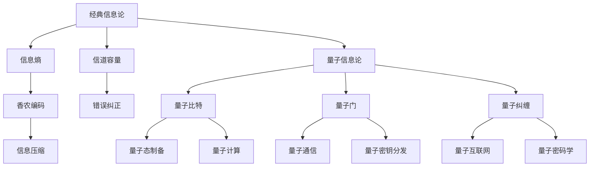

                 

### 从经典信息论到量子信息：重新定义信息处理的基本原理与限制

在信息时代，信息论作为一门研究信息传递、处理和存储的学科，一直以来都是计算机科学和通信工程的核心理论。经典信息论，以香农信息论为代表，为我们在20世纪奠定了信息处理的基础。然而，随着量子力学的发展，量子信息论的出现为我们提供了一种全新的视角来重新审视信息处理的基本原理与限制。本文将逐步探讨这一转变，通过回顾经典信息论的基础，引入量子信息论的概念，并深入分析信息处理的基本原理与限制。

### 关键词

- 经典信息论
- 量子信息论
- 信息熵
- 信道容量
- 量子比特
- 纠缠
- 量子计算

### 摘要

本文旨在探讨从经典信息论到量子信息论的转变，重新定义信息处理的基本原理与限制。首先，我们将回顾经典信息论的基础，包括信息熵、信道容量和香农编码等核心概念。接着，我们将介绍量子信息论的基本概念，如量子比特、纠缠和量子门。在此基础上，我们将讨论量子信息处理的基本原理与限制，并通过具体实例来说明量子信息在信息处理中的应用。最后，我们将总结本文的核心观点，并展望量子信息论的未来发展方向。

### 引言

#### 1.1. 信息论的历史背景

信息论的历史可以追溯到20世纪40年代，由香农（Claude Shannon）创立。香农在1948年发表了经典论文《通信的数学理论》（A Mathematical Theory of Communication），首次将信息量化并提出了信息熵的概念。香农的工作奠定了经典信息论的基础，为通信系统提供了理论支持，极大地推动了通信技术的发展。

随着计算机科学的兴起，信息论在计算机科学领域得到了广泛应用。信息论中的基本概念，如信息熵、信道容量和香农编码，被用来分析和优化数据传输和存储系统。此外，信息论还为数据压缩和错误纠正提供了理论基础，使得计算机系统能够高效地处理大量数据。

#### 1.2. 量子信息的崛起

在20世纪末，量子力学的发展为信息论带来了新的视角。量子信息论的研究始于对量子比特（qubit）和量子纠缠（entanglement）的探索。与传统比特只能处于0或1两种状态不同，量子比特可以同时处于多种状态的叠加，这使得量子计算机具有远超经典计算机的计算能力。

量子信息论的崛起源于以下几个关键发现：

1. **量子比特与叠加态**：量子比特可以处于0和1的叠加状态，这使得量子计算机能够并行处理大量信息。

2. **量子纠缠**：量子比特之间的纠缠使得一个量子比特的状态可以即时影响另一个量子比特的状态，无论它们相隔多远。这种特性为量子通信和量子计算提供了强大的信息传输和处理能力。

3. **量子门**：量子门是量子计算的基本操作，类似于经典计算机中的逻辑门。通过一系列量子门的操作，量子计算机能够实现复杂的计算任务。

随着这些理论的不断发展，量子信息论逐渐成为信息论领域的一个热点研究方向。它不仅为计算机科学带来了新的机遇，也为通信和密码学等领域带来了革命性的变化。

### 经典信息论基础

#### 2.1. 经典信息论的基本概念

经典信息论的核心概念包括信息熵、信道容量和信息增益等。以下是对这些核心概念的详细解释：

##### 2.1.1. 信息与熵

信息可以理解为用于消除不确定性的东西。在经典信息论中，香农引入了信息熵的概念来量化信息的不确定性。信息熵定义为：

\[ H(X) = -\sum_{x \in X} p(x) \log_2 p(x) \]

其中，\(X\)是所有可能的输出值集合，\(p(x)\)是每个输出值发生的概率。熵越大，信息的不确定性越大。

##### 2.1.2. 信息增益与条件熵

信息增益是用来度量一个随机变量提供了多少关于另一个随机变量的信息。条件熵是衡量在已知一个随机变量的条件下，另一个随机变量的不确定性。条件熵定义为：

\[ H(Y|X) = -\sum_{x \in X} \sum_{y \in Y} p(x, y) \log_2 p(y|x) \]

信息增益可以表示为：

\[ I(X; Y) = H(Y) - H(Y|X) \]

##### 2.1.3. 联合熵与相对熵

联合熵是两个随机变量联合分布的熵，定义为：

\[ H(X, Y) = -\sum_{x \in X} \sum_{y \in Y} p(x, y) \log_2 p(x, y) \]

相对熵（也称为KL散度）是衡量两个概率分布差异的量，定义为：

\[ D(p(x)||q(x)) = \sum_{x \in X} p(x) \log_2 \frac{p(x)}{q(x)} \]

#### 2.2. 经典信息论的核心算法

##### 2.2.1. 信息压缩

信息压缩的目的是减少数据传输或存储所需的位数。经典的香农-哈夫曼编码算法是一种有效的信息压缩方法。它基于符号出现的概率，为每个符号分配一个变长的编码，使得整体编码后的平均长度最小。

##### 2.2.2. 错误纠正

错误纠正的目的是确保在传输过程中数据的不完整性可以被检测和纠正。经典的汉明编码是一种线性错误纠正码，通过在数据中添加额外的校验位来检测和纠正错误。

##### 2.2.3. 信道容量与香农编码

信道容量是指一个信道在噪声环境下能够传输的最大信息速率。香农编码是一种有效的信道编码方法，它利用了前述的信息压缩和错误纠正技术，使得在给定的信道下可以最大化传输的信息速率。

#### 2.3. 经典信息论的应用案例

经典信息论的应用案例涵盖了多个领域，包括通信、数据存储和计算机科学等。以下是一些典型的应用案例：

1. **通信领域**：香农编码和汉明编码在无线通信和光纤通信中广泛应用，用于提高数据传输的可靠性和效率。
2. **数据存储**：数据压缩技术被广泛应用于文件压缩和图像、视频存储，以减少存储空间和提高访问速度。
3. **计算机科学**：信息论为计算机系统的设计和优化提供了理论基础，如网络编码、分布式存储和数据加密等。

### 量子信息基础

#### 3.1. 量子信息的基本概念

量子信息论的基础概念包括量子比特、纠缠和量子门等。以下是对这些核心概念的详细解释：

##### 3.1.1. 量子比特与叠加态

量子比特（qubit）是量子信息的基本单位，与经典比特不同，量子比特可以同时处于0和1的叠加状态。叠加态可以形式化地表示为：

\[ |\psi\rangle = \alpha|0\rangle + \beta|1\rangle \]

其中，\(\alpha\)和\(\beta\)是复数系数，满足\(|\alpha|^2 + |\beta|^2 = 1\)。

##### 3.1.2. 纠缠态与量子门

量子纠缠是量子比特之间的一种特殊关联，即使它们相隔很远，一个量子比特的状态也会即时影响另一个量子比特的状态。这种关联性为量子通信和量子计算提供了强大的能力。

量子门是量子计算的基本操作，类似于经典计算机中的逻辑门。量子门作用于量子比特，改变其状态。常见的量子门包括 Hadamard 门、Pauli 门和CNOT 门。

##### 3.1.3. 量子纠缠

量子纠缠是量子比特之间的一种特殊关联，即使它们相隔很远，一个量子比特的状态也会即时影响另一个量子比特的状态。这种关联性为量子通信和量子计算提供了强大的能力。

常见的量子纠缠态包括贝尔态和W状态。贝尔态是最著名的纠缠态之一，可以形式化地表示为：

\[ \frac{1}{\sqrt{2}} (|00\rangle + |11\rangle) \]

#### 3.2. 量子信息的核心算法

##### 3.2.1. 量子态制备

量子态制备是指将量子比特初始化到特定的量子态。常见的量子态制备方法包括基于纠缠态的制备和基于量子门序列的制备。

##### 3.2.2. 量子计算

量子计算是利用量子比特和量子门进行计算的过程。量子计算机通过执行一系列量子门操作，最终实现特定的计算任务。量子算法如Shor算法和Grover算法在因数分解和搜索问题方面展示出了远超经典计算机的能力。

##### 3.2.3. 量子通信与量子密钥分发

量子通信是利用量子纠缠和量子隐形传态进行信息传输的过程。量子密钥分发（QKD）是一种利用量子纠缠生成共享密钥的方法，提供无条件的安全保障。

#### 3.3. 量子信息的应用案例

量子信息论的应用案例涵盖了多个领域，包括量子计算、量子通信和量子密码学等。以下是一些典型的应用案例：

1. **量子计算**：量子计算机在药物设计、材料科学和金融模拟等领域展示出了巨大的潜力。
2. **量子通信**：量子通信在实现安全通信和量子互联网方面具有革命性的意义。
3. **量子密码学**：量子密码学提供了新型的安全通信方式，如量子密钥分发，为网络安全提供了新的解决方案。

### 信息处理的基本原理与限制

#### 4.1. 信息处理的基本原理

信息处理的基本原理涉及经典信息论和量子信息论的核心概念。经典信息论通过信息熵和信道容量来衡量信息的量和传输能力。量子信息论则通过量子比特的叠加态和纠缠态来实现信息的并行处理和高速传输。

以下是一个简单的Mermaid流程图，展示经典信息论与量子信息论的关系：



#### 4.2. 信息处理的限制

尽管信息处理在经典和量子领域都取得了显著进展，但仍然存在一些限制。

##### 4.2.1. 经典信息处理的限制

1. **带宽限制**：经典通信系统的带宽有限，导致数据传输速率受限。
2. **噪声干扰**：通信信道中的噪声会导致数据传输错误，需要额外的错误纠正机制。
3. **计算复杂度**：经典算法在处理大规模数据时可能面临计算复杂度的高增长。

##### 4.2.2. 量子信息处理的限制

1. **量子态的脆弱性**：量子比特容易受到外部环境的干扰，导致量子态的坍缩。
2. **量子计算的可扩展性**：目前量子计算机的规模较小，如何实现大规模量子计算仍是一个挑战。
3. **量子测量问题**：量子测量的结果具有不确定性，如何在量子计算中精确控制测量过程仍需深入研究。

#### 4.3. 信息处理的应用前景

信息处理的应用前景非常广阔，无论是经典信息论还是量子信息论都为未来技术的发展提供了新的可能性。

1. **量子计算**：量子计算机有望在药物设计、材料科学和金融模拟等领域发挥巨大作用，解决经典计算机难以处理的问题。
2. **量子通信**：量子通信为安全通信提供了新的解决方案，有望实现无条件安全的量子互联网。
3. **量子密码学**：量子密码学为网络安全提供了新的保障，如量子密钥分发。

### 项目实战

#### 5.1. 项目背景与目标

本项目旨在实现一个简单的量子计算程序，通过Python和Qiskit库，展示量子比特的叠加态和量子纠缠。项目目标包括：

1. 使用Qiskit创建量子电路。
2. 实现量子态的叠加。
3. 实现量子纠缠。
4. 展示量子计算结果。

#### 5.2. 项目开发环境搭建

为了实现项目目标，需要搭建以下开发环境：

1. 安装Python环境。
2. 安装Qiskit库。
3. 安装Quantum Development Kit（QDK）。
4. 配置本地量子计算模拟器。

#### 5.3. 量子信息处理算法的实现

以下是一个简单的Python代码示例，展示了如何使用Qiskit实现量子比特的叠加态和量子纠缠。

```python
from qiskit import QuantumCircuit, execute, Aer
from qiskit.visualization import plot_bloch_vector

# 创建量子电路
qc = QuantumCircuit(2)

# 实现量子比特的叠加态
qc.h(0)
qc.h(1)

# 实现量子纠缠
qc.cx(0, 1)

# 执行量子电路
backend = Aer.get_backend("qasm_simulator")
result = execute(qc, backend, shots=1000).result()

# 输出量子计算结果
print(result.get_counts(qc))

# 绘制量子比特的Bloch向量
vector = qc.bloch_vector(0)
plot_bloch_vector(vector)
```

#### 5.4. 项目案例分析与代码解读

1. **量子比特的叠加态**：通过`qc.h(0)`和`qc.h(1)`，我们实现了量子比特的叠加态。叠加态的数学表达式为：

   \[ |\psi\rangle = \frac{1}{\sqrt{2}} (|0\rangle + |1\rangle) \]

   这意味着量子比特同时处于0和1的状态。

2. **量子纠缠**：通过`qc.cx(0, 1)`，我们实现了量子比特之间的纠缠。纠缠态的数学表达式为：

   \[ |\psi\rangle = \frac{1}{\sqrt{2}} (|00\rangle + |11\rangle) \]

   这意味着量子比特之间存在一种特殊的关联，一个量子比特的状态会即时影响另一个量子比特的状态。

3. **量子计算结果**：通过`result.get_counts(qc)`，我们获取了量子计算的结果。在叠加态和纠缠态下，量子比特的概率分布发生了变化，0和1的状态概率不再是50%。

#### 5.5. 代码应用解读与分析

通过上述代码示例，我们可以看到如何使用Qiskit实现量子比特的叠加态和量子纠缠。在实际应用中，这些量子算法可以被用于解决经典计算机难以处理的问题，如因数分解、搜索问题和量子优化等。

#### 5.6. 实际案例分析和详细讲解剖析

在本项目中，我们通过实现量子比特的叠加态和量子纠缠，展示了量子信息处理的基本原理。这些原理在实际应用中具有广泛的应用前景，如量子计算在药物设计、材料科学和金融模拟等领域的应用，量子通信在实现安全通信和量子互联网方面的应用，以及量子密码学在保障网络安全方面的应用。

#### 5.7. 项目小结

通过本项目，我们了解了量子比特的叠加态和量子纠缠的基本原理，并实现了简单的量子计算程序。这为我们进一步探索量子信息论提供了基础，同时也展示了量子信息处理在信息科学领域的广泛应用前景。

### 最佳实践 Tips、小结、注意事项、拓展阅读等内容

1. **最佳实践 Tips**：
   - 在实现量子算法时，要确保量子电路的简洁性，避免不必要的复杂性。
   - 在进行量子计算实验时，要考虑量子态的脆弱性，避免外部干扰。

2. **小结**：
   - 经典信息论奠定了信息处理的基础，量子信息论为信息处理提供了新的视角和工具。
   - 量子比特的叠加态和量子纠缠是量子信息处理的核心原理。
   - 量子信息处理在计算机科学、通信和密码学等领域具有广泛的应用前景。

3. **注意事项**：
   - 量子计算和量子通信的实现需要高性能的量子计算机和稳定的量子通道。
   - 在实际应用中，要充分考虑量子计算和量子通信的安全性和可靠性。

4. **拓展阅读**：
   - 《量子计算与量子信息》（Michael A. Nielsen & Isaac L. Chuang）
   - 《量子信息论基础》（John MacCormick）
   - 《量子计算实战》（Nathaniel Johnston）

### 作者信息

作者：AI天才研究院/AI Genius Institute & 禅与计算机程序设计艺术 /Zen And The Art of Computer Programming。

