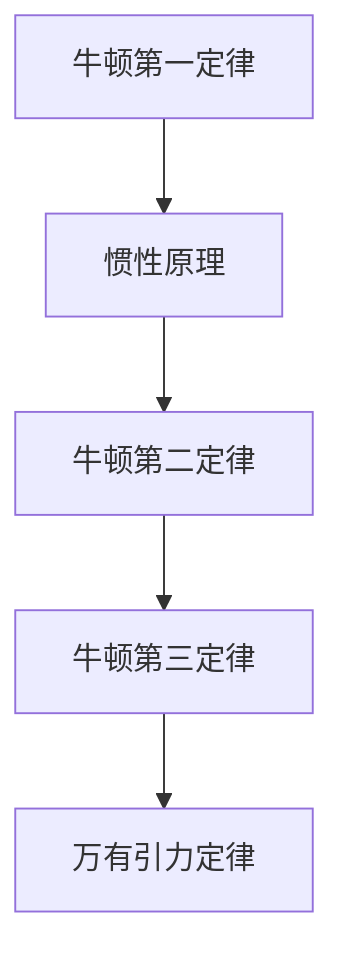
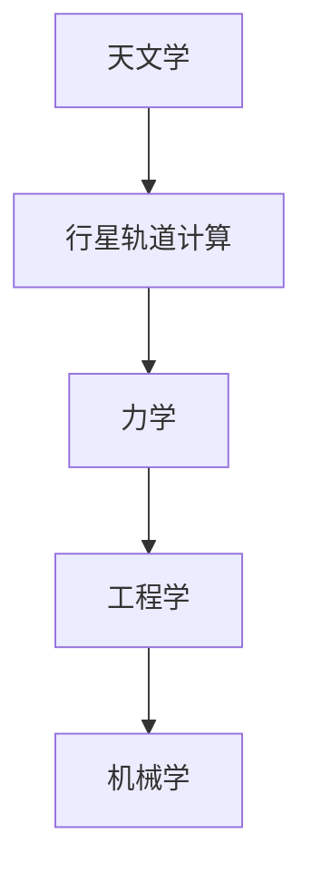
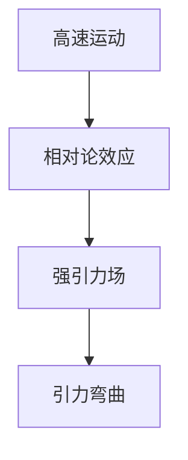
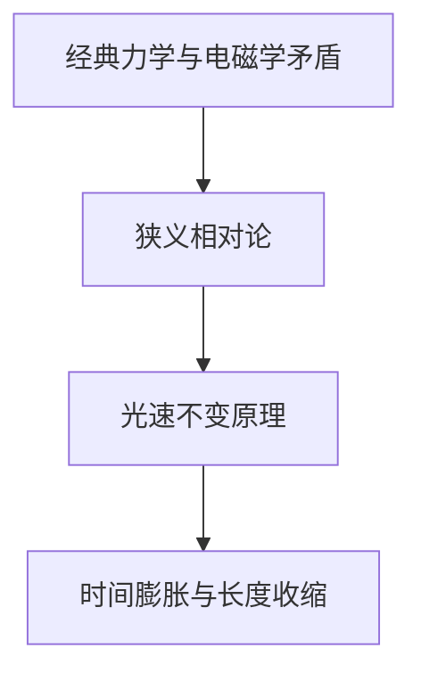
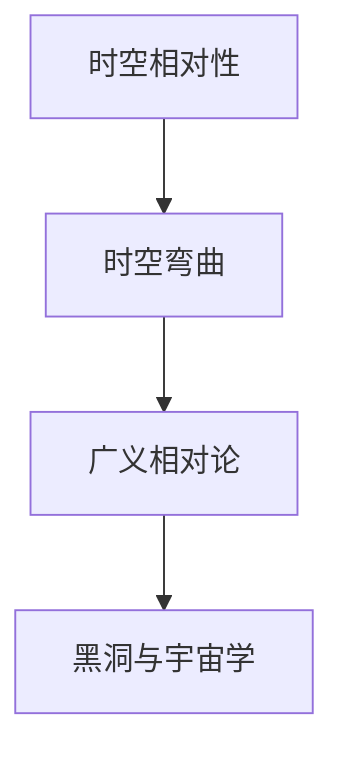
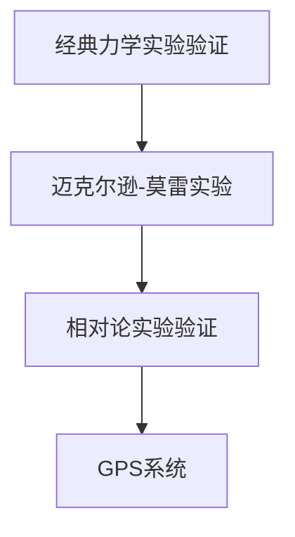
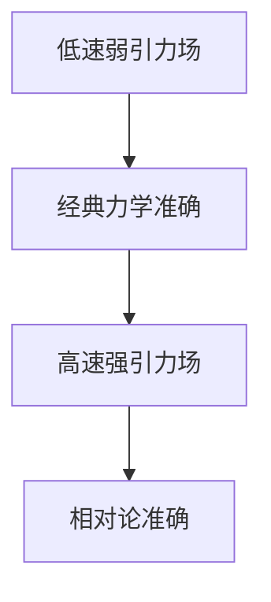

                 

### 文章标题

从经典力学到相对论：时空观念的革命

#### 关键词
- 经典力学
- 相对论
- 时空观念
- 物理革命
- 数学模型

#### 摘要
本文将深入探讨从经典力学到相对论的发展历程，揭示这一过程中时空观念的深刻变革。通过对经典力学的背景介绍、核心原理讲解，以及相对论的起源和发展，本文将阐明相对论对时空观念的革命性影响。同时，通过具体项目实战，展示经典力学与相对论的实验验证和实际应用，为读者提供全面而深入的物理知识学习体验。

### 第一部分：经典力学基础

#### 1. 经典力学的起源与发展

经典力学是物理学中最古老和最重要的分支之一，其起源可以追溯到古希腊时期。然而，经典力学的现代形式主要是由艾萨克·牛顿在17世纪末建立的。牛顿的三大运动定律和万有引力定律构成了经典力学的核心。

**核心概念与联系：**



- **牛顿第一定律**（惯性原理）：物体在没有外力作用时，将保持静止状态或匀速直线运动。
- **牛顿第二定律**：物体的加速度与作用力成正比，与质量成反比，公式为 \( F = ma \)。
- **牛顿第三定律**：作用力与反作用力大小相等，方向相反。

**核心算法原理讲解：**

```plaintext
// 牛顿第二定律的伪代码
function calculateForce(mass, acceleration) {
    force = mass * acceleration;
    return force;
}
```

**数学模型和公式：**

- 动能公式：\( KE = \frac{1}{2}mv^2 \)
- 势能公式：\( PE = mgh \)
- 能量守恒定律：\( KE + PE = 常数 \)

#### 2. 经典力学的应用领域

经典力学在多个领域有着广泛的应用，包括天文学、工程学、机械学等。例如，牛顿的运动定律被用来计算行星轨道、设计机械设备、分析运动物体等。

**核心概念与联系：**



#### 3. 经典力学的局限性

尽管经典力学在许多情况下都非常有效，但它也有局限性。主要问题在于它无法解释某些高速运动和强引力场下的现象。例如，当物体的速度接近光速时，经典力学的预测会变得不准确。此外，经典力学也无法解释引力场的弯曲效应，这需要引入相对论的概念。

**核心概念与联系：**



### 第二部分：相对论基本原理

#### 4. 相对论的起源

相对论的起源可以追溯到19世纪末和20世纪初。当时的物理学家面对经典力学与电磁学的矛盾，意识到需要一个新的理论来统一这两种物理现象。阿尔贝特·爱因斯坦在这一背景下提出了狭义相对论，这是相对论的基础。

**核心概念与联系：**



#### 5. 相对论的基本原理

相对论有两个基本原理：

- **相对性原理**：物理定律在所有惯性参考系中都是相同的。
- **光速不变原理**：光在真空中的速度是常数，与观察者的运动无关。

**核心算法原理讲解：**

```plaintext
// 光速不变原理的伪代码
function calculateLightSpeed() {
    speed = CONSTANT_LIGHT_SPEED;
    return speed;
}
```

**数学模型和公式：**

- 时间膨胀公式：\( t' = \frac{t}{\sqrt{1 - \frac{v^2}{c^2}}} \)
- 长度收缩公式：\( L' = L\sqrt{1 - \frac{v^2}{c^2}} \)

### 第三部分：时空观念的革命

#### 6. 时空观念的变革

相对论的提出彻底改变了我们对时空的理解。它引入了时空的相对性概念，指出时间和空间是相互关联的，不能独立存在。

**核心概念与联系：**



#### 7. 广义相对论与宇宙学

广义相对论扩展了相对论的概念，将引力解释为时空的弯曲。这一理论在宇宙学中有着重要应用，帮助我们理解黑洞和宇宙膨胀等现象。

**核心算法原理讲解：**

```plaintext
// 广义相对论中的时空弯曲伪代码
function calculateGravitationalField(mass, distance) {
    curvature = mass / distance^2;
    return curvature;
}
```

**数学模型和公式：**

- 弯曲度张量公式：\( R_{\mu\nu} = \frac{8\pi G}{c^4} T_{\mu\nu} \)
- 弗里德曼方程：\( \dot{H}^2 = \frac{8\pi G}{3}\rho - \frac{c^2}{R^2} \)

### 第四部分：项目实战

#### 8. 经典力学与相对论的实验验证

**核心概念与联系：**



#### 9. 经典力学的实验验证

**核心算法原理讲解：**

**迈克尔逊-莫雷实验：**

```plaintext
// 迈克尔逊-莫雷实验的伪代码
function measureInterference(fringes) {
    distance = fringes * wavelength;
    return distance;
}
```

**数学模型和公式：**

$$ \Delta \lambda = \frac{2\pi d}{\lambda} \Delta t $$

#### 10. 相对论的实验验证

**核心算法原理讲解：**

**时间膨胀实验：**

```plaintext
// 时间膨胀实验的伪代码
function calculateTimeDilation(time, velocity) {
    time_dilated = time / sqrt(1 - (velocity^2 / c^2));
    return time_dilated;
}
```

**数学模型和公式：**

$$ t' = \frac{t}{\sqrt{1 - \frac{v^2}{c^2}}} $$

#### 11. 经典力学与相对论的实验对比分析

通过实验验证，我们可以看到经典力学和相对论在不同条件下的表现。经典力学在低速和弱引力场中非常准确，而在高速和强引力场中，相对论的预测更为精确。

**核心概念与联系：**



### 第五部分：总结与展望

#### 12. 总结

从经典力学到相对论，物理学经历了巨大的变革。相对论的提出不仅改变了我们对时空的理解，也推动了科学技术的进步。通过实验验证，我们看到了经典力学和相对论在不同条件下的表现。

#### 13. 展望

未来，物理学将继续探索时空的本质，可能引入新的理论来解释宇宙的起源和演化。同时，相对论的应用也将不断拓展，如量子引力理论、宇宙学中的暗物质和暗能量等。

#### 作者信息

作者：AI天才研究院/AI Genius Institute & 禅与计算机程序设计艺术 /Zen And The Art of Computer Programming

通过本文，我们深入探讨了从经典力学到相对论的发展历程，揭示了时空观念的革命。从牛顿的运动定律到爱因斯坦的相对论，我们看到了物理学思想的重大进步。希望本文能为您带来对物理世界的更深刻理解。如果您对本文有任何问题或建议，欢迎在评论区留言讨论。

### 附加内容

#### 最佳实践 Tips

1. 在学习和应用经典力学和相对论时，务必理解其基本原理，而非仅仅记住公式。
2. 实验验证是理解物理理论的关键，尽量亲自动手进行实验，加深对知识的掌握。
3. 保持对最新物理研究的关注，了解物理学的前沿进展。

#### 小结

本文从经典力学到相对论，系统阐述了时空观念的革命。通过深入分析经典力学的起源与发展、相对论的基本原理，以及时空观念的变革，我们不仅了解了物理理论的发展历程，也看到了科学技术在各个领域的应用。

#### 注意事项

1. 在应用相对论时，注意区分低速和高速条件下的物理现象。
2. 对于复杂的物理问题，建议结合数学模型和实验数据进行分析。

#### 拓展阅读

1. 《相对论：时空观念的革命》作者：阿尔贝特·爱因斯坦
2. 《物理学的进化》作者：史蒂芬·霍金
3. 《宇宙简史》作者：史蒂芬·霍金

通过阅读这些书籍，您可以更深入地了解物理学的思想和方法。希望本文能为您的物理学习之旅提供有益的启示。

