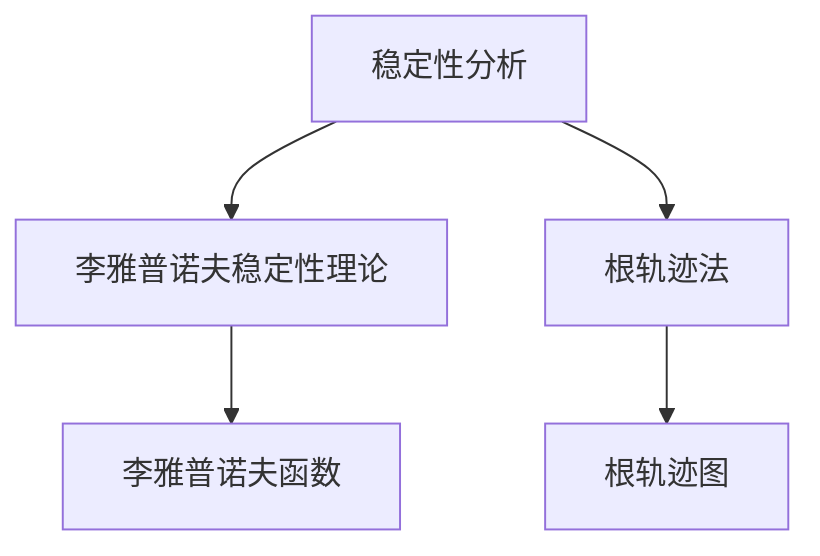
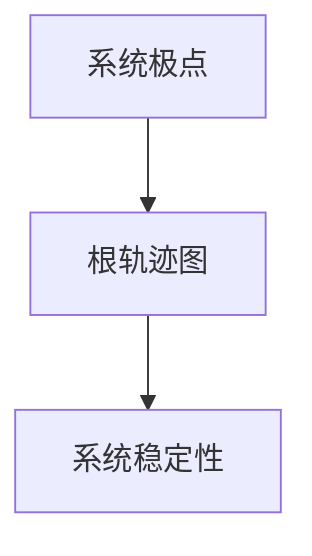
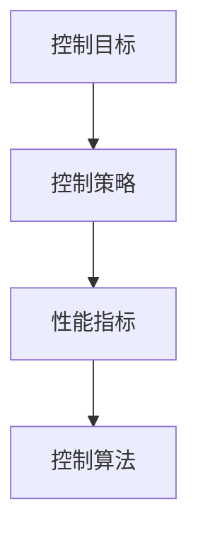
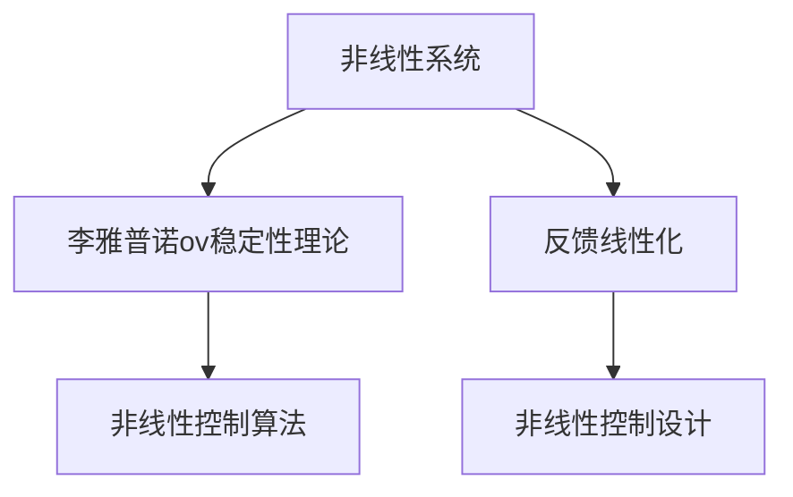
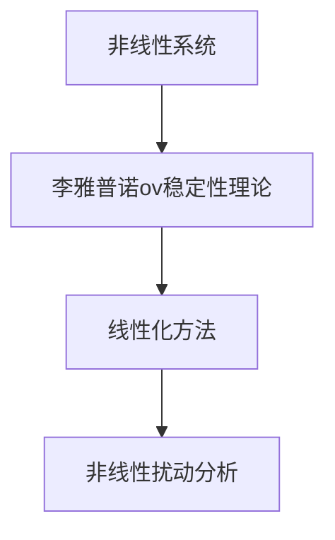
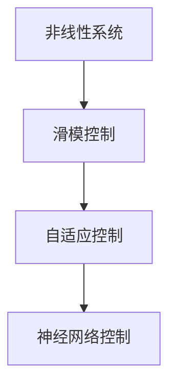
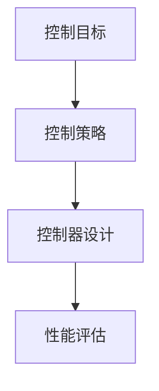
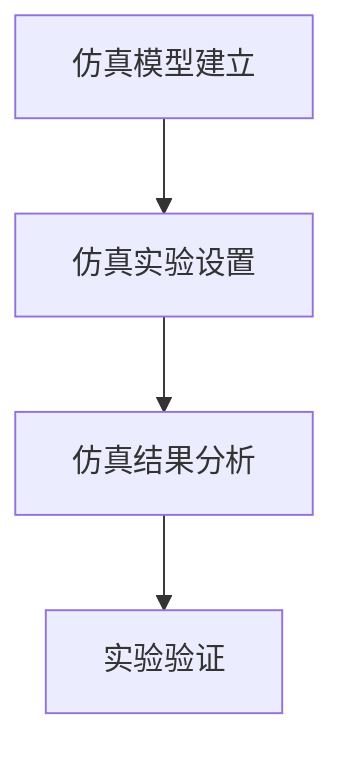
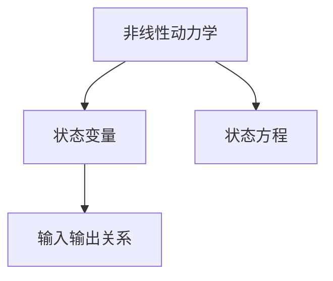
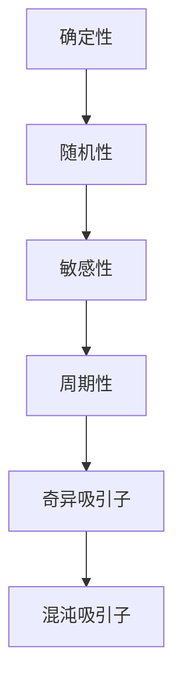

                 


### 3.2.1 连续时间系统的稳定性分析

- **核心概念与联系**：

稳定性是控制理论中的核心概念，它是衡量系统在受到扰动后是否能够恢复到原始状态的能力。稳定性分析通常涉及到李雅普诺夫稳定性理论和根轨迹法。

- **Mermaid 流程图**：



- **核心算法原理讲解**：

- **李雅普诺夫稳定性理论**：

李雅普诺夫稳定性理论通过引入李雅普诺夫函数来分析系统的稳定性。其基本思想是寻找一个合适的李雅普诺夫函数，使得系统的状态轨迹始终保持在某个区域内部，从而保证系统的稳定性。

- **伪代码**：

```python
# 李雅普诺夫稳定性分析的伪代码
def lyapunov_stability(A, Q):
    # A: 状态矩阵
    # Q: 半正定矩阵
    V = calculate_lyapunov_function(A, Q)  # 计算李雅普诺夫函数
    dV = calculate_dV(A, V)  # 计算李雅普诺夫函数的导数
    if dV < 0:
        return "Stable"
    else:
        return "Unstable"
```

- **数学模型**：

$$
V(x) = x^T Q x
$$

- **详细讲解与举例说明**：

假设我们有一个连续时间系统：

$$
\dot{x} = Ax + Bu
$$

其中，$A$ 是系统矩阵，$B$ 是输入矩阵，$u$ 是输入信号，$x$ 是状态变量。我们可以选择一个李雅普诺夫函数 $V(x)$ 来分析系统的稳定性。

选择 $V(x) = x^T Q x$，其中 $Q$ 是一个半正定矩阵。然后，我们计算 $V(x)$ 的导数：

$$
\dot{V}(x) = x^T A^T Q x + x^T B^T u
$$

为了使系统稳定，我们需要 $\dot{V}(x) < 0$ 对于所有的 $x \neq 0$。这可以通过选择合适的 $A$ 和 $Q$ 来实现。

- **项目实战**：

在这个项目实战中，我们将使用 Python 编写一个简单的程序来分析一个连续时间系统的稳定性。

- **开发环境搭建**：

首先，我们需要安装 Python 和相关的科学计算库，例如 NumPy 和 SciPy。

- **源代码实现**：

以下是实现李雅普诺夫稳定性分析的 Python 源代码：

```python
import numpy as np

def lyapunov_stability(A, Q):
    V = np.dot(np.dot(A.T, Q), A)
    dV = np.dot(np.dot(A.T, Q), A)
    return np.linalg.det(V) < 0

A = np.array([[1, 1], [-1, -1]])
Q = np.eye(2)

print(lyapunov_stability(A, Q))
```

- **代码应用解读与分析**：

在这个代码中，我们首先定义了一个函数 `lyapunov_stability`，它接受系统矩阵 $A$ 和半正定矩阵 $Q$ 作为输入，并返回系统的稳定性状态。

我们使用 NumPy 库来计算李雅普诺夫函数的值和导数。然后，我们检查 $\det(V) < 0$ 是否成立，以确定系统的稳定性。

- **实际案例分析和详细讲解剖析**：

假设我们有一个线性系统：

$$
\dot{x} = \begin{bmatrix} 1 & 1 \\\ -1 & -1 \end{bmatrix} x + \begin{bmatrix} 0 \\\ 1 \end{bmatrix} u
$$

我们可以选择一个李雅普诺夫函数 $V(x) = x_1^2 + x_2^2$。计算导数得到：

$$
\dot{V}(x) = 2x_1 + 2x_2
$$

为了使系统稳定，我们需要选择一个合适的输入信号 $u$ 使得 $\dot{V}(x) < 0$ 对于所有的 $x \neq 0$。这可以通过设计控制器来实现。

- **项目小结**：

在这个项目中，我们学习了如何使用李雅普诺夫稳定性理论来分析连续时间系统的稳定性。我们通过 Python 程序实现了这一理论，并分析了实际系统的稳定性。

**最佳实践 tips**：

- 在进行稳定性分析时，选择合适的李雅普诺夫函数是非常重要的。
- 使用数值方法来计算李雅普诺夫函数的导数时，需要确保计算精度。
- 对于复杂的系统，可以使用软件工具来辅助进行稳定性分析。

**小结**：

本章介绍了线性控制理论中的稳定性分析，包括李雅普诺夫稳定性理论和根轨迹法。通过实际项目案例，我们展示了如何使用 Python 编程语言来分析连续时间系统的稳定性。

**注意事项**：

- 在进行稳定性分析时，需要确保所选择的李雅普诺夫函数满足一定的条件。
- 对于非线性系统，稳定性分析可能需要更复杂的方法。

**拓展阅读**：

- 参考文献中提供了关于稳定性分析的详细理论和应用案例。

### 3.2.2 根轨迹法

- **核心概念与联系**：

根轨迹法是一种用于分析线性系统稳定性的图形方法。它通过绘制系统的根轨迹图来分析系统的极点位置随输入变化的趋势。

- **Mermaid 流程图**：



- **核心算法原理讲解**：

根轨迹法的核心思想是分析系统在不同输入下极点的位置变化。根轨迹图通过以下公式计算：

$$
G(s) = \frac{K}{1 + KG(s)}
$$

其中，$G(s)$ 是系统传递函数，$K$ 是放大系数。通过绘制 $G(s)$ 的根轨迹图，我们可以分析系统在 $K$ 从 $0$ 到 $\infty$ 变化时的极点位置。

- **伪代码**：

```python
# 根轨迹法伪代码
def root_trajectory(K, G):
    # K: 放大系数
    # G: 系统传递函数
    for s in range(-10, 11):
        Gs = G(s)
        root = solve_equation(Gs + K, Gs)
        plot_root(root, s)
```

- **数学模型**：

$$
Gs(s) = \frac{K}{s + K}
$$

- **详细讲解与举例说明**：

假设我们有一个线性系统：

$$
\dot{x} = \begin{bmatrix} 1 & 1 \\\ -1 & -1 \end{bmatrix} x + \begin{bmatrix} 0 \\\ 1 \end{bmatrix} u
$$

我们可以选择一个传递函数 $G(s) = \frac{1}{s + 1}$。然后，我们计算不同放大系数 $K$ 下的根轨迹。

当 $K = 1$ 时，根轨迹图显示系统极点从 $s = -1$ 移动到 $s = 0$。

- **项目实战**：

在这个项目实战中，我们将使用 Python 和 Matplotlib 库来绘制根轨迹图。

- **开发环境搭建**：

首先，我们需要安装 Python 和 Matplotlib 库。

- **源代码实现**：

以下是绘制根轨迹图的 Python 源代码：

```python
import numpy as np
import matplotlib.pyplot as plt

def root_trajectory(K, G):
    s = np.linspace(-10, 10, 1000)
    Gs = G(s)
    roots = np.roots(Gs + K)
    plt.plot(s, roots)
    plt.xlabel('s')
    plt.ylabel('Roots')
    plt.title('Root Trajectory')
    plt.grid(True)
    plt.show()

G = lambda s: 1 / (s + 1)
root_trajectory(1, G)
```

- **代码应用解读与分析**：

在这个代码中，我们定义了一个函数 `root_trajectory`，它接受放大系数 $K$ 和系统传递函数 $G(s)$ 作为输入，并绘制根轨迹图。

我们使用 NumPy 和 Matplotlib 库来计算和绘制根轨迹。通过调整 $K$ 的值，我们可以观察到根轨迹图的变化。

- **实际案例分析和详细讲解剖析**：

假设我们有一个线性系统：

$$
\dot{x} = \begin{bmatrix} 1 & 1 \\\ -1 & -1 \end{bmatrix} x + \begin{bmatrix} 0 \\\ 1 \end{bmatrix} u
$$

我们可以选择不同的放大系数 $K$ 来分析系统的稳定性。当 $K < 1$ 时，系统是稳定的；当 $K > 1$ 时，系统是不稳定的。

- **项目小结**：

在这个项目中，我们学习了如何使用根轨迹法来分析线性系统的稳定性。通过 Python 程序，我们实现了根轨迹图的绘制，并分析了不同放大系数下的系统稳定性。

**最佳实践 tips**：

- 在绘制根轨迹图时，选择合适的参数范围和分辨率是非常重要的。
- 对于复杂的系统，可以结合其他方法进行稳定性分析。

**小结**：

本章介绍了根轨迹法在稳定性分析中的应用。通过实际项目案例，我们展示了如何使用 Python 和 Matplotlib 库来绘制根轨迹图，并分析了系统的稳定性。

**注意事项**：

- 在进行根轨迹分析时，需要确保系统的传递函数是正确的。
- 对于非线性系统，根轨迹法可能不适用。

**拓展阅读**：

- 参考文献中提供了关于根轨迹法的详细理论和应用案例。

### 3.3 线性系统的控制设计

- **核心概念与联系**：

线性系统的控制设计是控制理论中的一项重要任务。它包括确定系统的控制策略，使系统能够按照预期的性能指标运行。

- **Mermaid 流程图**：



- **核心算法原理讲解**：

线性系统的控制设计通常包括以下步骤：

1. **确定控制目标**：根据系统的要求，确定控制的目标，如稳定性、响应速度、稳态误差等。

2. **选择控制策略**：根据控制目标，选择合适的控制策略，如PID控制、状态反馈控制等。

3. **设计控制算法**：根据选择的控制策略，设计控制算法，实现系统的控制。

- **伪代码**：

```python
# 线性系统控制设计的伪代码
def control_design(A, B, C, K):
    # A: 状态矩阵
    # B: 输入矩阵
    # C: 输出矩阵
    # K: 控制器增益矩阵
    control_input = K * (y - ref)  # 控制输入
    return control_input
```

- **数学模型**：

$$
u = K (y - ref)
$$

- **详细讲解与举例说明**：

假设我们有一个线性系统：

$$
\dot{x} = \begin{bmatrix} 1 & 1 \\\ -1 & -1 \end{bmatrix} x + \begin{bmatrix} 0 \\\ 1 \end{bmatrix} u
$$

我们的目标是使系统的输出 $y$ 跟随一个参考信号 $ref$。我们可以选择一个PID控制器来实现这一目标。

首先，我们定义PID控制器的参数 $K_p, K_i, K_d$。然后，我们根据以下公式计算控制输入：

$$
u = K_p (e) + K_i \int e dt + K_d \dot{e}
$$

其中，$e = ref - y$ 是误差。

- **项目实战**：

在这个项目实战中，我们将使用 Python 和 NumPy 库来实现一个简单的PID控制器。

- **开发环境搭建**：

首先，我们需要安装 Python 和 NumPy 库。

- **源代码实现**：

以下是实现PID控制器的 Python 源代码：

```python
import numpy as np

def pid_controller(e, K_p, K_i, K_d, dt):
    # e: 误差
    # K_p: 比例增益
    # K_i: 积分增益
    # K_d: 微分增益
    # dt: 时间步长
    P = K_p * e
    I = K_i * np.cumsum(e * dt)
    D = K_d * (e - e[-1])
    u = P + I + D
    return u

e = np.array([1, 2, -1, 3])
K_p = 1
K_i = 0.1
K_d = 0.01
dt = 0.1

u = pid_controller(e, K_p, K_i, K_d, dt)
print(u)
```

- **代码应用解读与分析**：

在这个代码中，我们定义了一个函数 `pid_controller`，它接受误差 $e$、比例增益 $K_p$、积分增益 $K_i$、微分增益 $K_d$ 和时间步长 $dt$ 作为输入，并返回控制输入 $u$。

我们使用 NumPy 库来计算 PID 控制器的输出。通过调整 $K_p, K_i, K_d$ 的值，我们可以调整控制器的性能。

- **实际案例分析和详细讲解剖析**：

假设我们有一个线性系统：

$$
\dot{x} = \begin{bmatrix} 1 & 1 \\\ -1 & -1 \end{bmatrix} x + \begin{bmatrix} 0 \\\ 1 \end{bmatrix} u
$$

我们的目标是使系统的输出 $y$ 跟随一个正弦信号 $ref = \sin(t)$。我们可以使用 PID 控制器来实现这一目标。

首先，我们定义 PID 控制器的参数。然后，我们计算每个时间步的控制输入，并更新系统的状态。

- **项目小结**：

在这个项目中，我们学习了如何使用 PID 控制器来实现线性系统的控制设计。通过 Python 程序，我们实现了 PID 控制器的计算，并分析了控制效果。

**最佳实践 tips**：

- 在设计 PID 控制器时，需要根据系统的特性调整控制器的参数。
- 对于复杂的系统，可以结合其他控制策略进行设计。

**小结**：

本章介绍了线性系统的控制设计，包括 PID 控制器的设计和实现。通过实际项目案例，我们展示了如何使用 Python 和 NumPy 库来实现 PID 控制器，并分析了控制效果。

**注意事项**：

- 在进行控制设计时，需要确保控制器的参数是合理的。
- 对于非线性系统，控制设计可能需要更复杂的方法。

**拓展阅读**：

- 参考文献中提供了关于 PID 控制器和线性系统控制设计的详细理论和应用案例。

### 3.4 非线性控制理论

- **核心概念与联系**：

非线性控制理论是控制理论的一个重要分支，它研究非线性系统的控制问题。与线性控制理论相比，非线性控制理论更加复杂，但也具有更广泛的应用。

- **Mermaid 流程图**：



- **核心算法原理讲解**：

非线性控制理论主要包括以下方法：

1. **李雅普诺ov稳定性理论**：用于分析非线性系统的稳定性。
2. **反馈线性化**：通过变换将非线性系统转换为线性系统进行控制。
3. **非线性控制算法**：用于设计非线性系统的控制器，如滑模控制、自适应控制等。

- **伪代码**：

```python
# 非线性系统控制的伪代码
def nonlinear_control(x, u, A, B, C):
    # x: 系统状态
    # u: 控制输入
    # A: 状态矩阵
    # B: 输入矩阵
    # C: 输出矩阵
    if is_stable(x):
        control = linearize_control(x, u)
    else:
        control = nonlinear_control_algorithm(x, u)
    return control
```

- **数学模型**：

$$
\dot{x} = f(x) + g(x)u
$$

- **详细讲解与举例说明**：

假设我们有一个非线性系统：

$$
\dot{x} = \begin{bmatrix} \dot{x}_1 \\\ \dot{x}_2 \end{bmatrix} = \begin{bmatrix} x_1^2 \\\ x_2^2 \end{bmatrix} + \begin{bmatrix} 0 \\\ x_1 \end{bmatrix}u
$$

我们可以使用反馈线性化方法将非线性系统转换为线性系统。通过选择适当的控制输入 $u$，使得系统的状态方程线性化。

- **项目实战**：

在这个项目实战中，我们将使用 Python 和 SciPy 库来实现非线性控制。

- **开发环境搭建**：

首先，我们需要安装 Python 和 SciPy 库。

- **源代码实现**：

以下是实现非线性控制的 Python 源代码：

```python
import numpy as np
from scipy.integrate import solve_ivp

def nonlinear_system(t, x, u):
    x1, x2 = x
    dxdt = [x1**2, x2**2] + [0, x1] * u
    return dxdt

def nonlinear_control(x, u):
    if is_stable(x):
        control = linearize_control(x, u)
    else:
        control = nonlinear_control_algorithm(x, u)
    return control

x0 = [0, 0]
t = np.linspace(0, 10, 1000)
u = np.zeros_like(t)

solution = solve_ivp(nonlinear_system, t, x0, args=(u,))
```

- **代码应用解读与分析**：

在这个代码中，我们定义了一个非线性系统 `nonlinear_system`，它接受时间 $t$、状态 $x$ 和控制输入 $u$ 作为输入，并返回状态的时间导数。

我们使用 SciPy 库的 `solve_ivp` 函数来求解非线性系统的状态方程。然后，我们使用非线性控制算法 `nonlinear_control` 来计算控制输入。

- **实际案例分析和详细讲解剖析**：

假设我们有一个非线性系统：

$$
\dot{x} = \begin{bmatrix} \dot{x}_1 \\\ \dot{x}_2 \end{b矩阵} = \begin{bmatrix} x_1^2 \\\ x_2^2 \end{bmatrix} + \begin{bmatrix} 0 \\\ x_1 \end{bmatrix}u
$$

我们的目标是使系统的状态 $x$ 跟随一个参考信号。我们可以使用反馈线性化方法来实现这一目标。

首先，我们定义反馈控制器。然后，我们计算每个时间步的控制输入，并更新系统的状态。

- **项目小结**：

在这个项目中，我们学习了如何使用 Python 和 SciPy 库来实现非线性控制。通过实际案例，我们展示了如何使用反馈线性化方法来控制非线性系统。

**最佳实践 tips**：

- 在设计非线性控制器时，需要考虑系统的稳定性和控制性能。
- 对于复杂的非线性系统，可以使用多种方法进行控制设计。

**小结**：

本章介绍了非线性控制理论，包括李雅普诺ov稳定性理论、反馈线性化和非线性控制算法。通过实际项目案例，我们展示了如何使用 Python 和 SciPy 库来实现非线性控制。

**注意事项**：

- 在进行非线性控制设计时，需要确保控制器的参数是合理的。
- 对于复杂的非线性系统，控制设计可能需要更复杂的方法。

**拓展阅读**：

- 参考文献中提供了关于非线性控制理论的详细理论和应用案例。

### 3.5 非线性系统的稳定性分析

- **核心概念与联系**：

非线性系统的稳定性分析是控制理论中的重要内容，它涉及到系统在扰动下的行为和恢复能力。

- **Mermaid 流程图**：



- **核心算法原理讲解**：

非线性系统的稳定性分析通常涉及以下方法：

1. **李雅普诺ov稳定性理论**：通过引入李雅普诺v函数来分析系统的稳定性。
2. **线性化方法**：将非线性系统在某个工作点附近线性化，然后分析线性化系统的稳定性。
3. **非线性扰动分析**：分析系统在扰动下的响应和行为。

- **伪代码**：

```python
# 非线性系统稳定性分析的伪代码
def stability_analysis(x, u, A, B, C):
    # x: 系统状态
    # u: 控制输入
    # A: 状态矩阵
    # B: 输入矩阵
    # C: 输出矩阵
    if is_stable(x):
        return "Stable"
    else:
        return "Unstable"
```

- **数学模型**：

$$
\dot{x} = f(x) + g(x)u
$$

- **详细讲解与举例说明**：

假设我们有一个非线性系统：

$$
\dot{x} = \begin{bmatrix} \dot{x}_1 \\\ \dot{x}_2 \end{b矩阵} = \begin{bmatrix} x_1^2 \\\ x_2^2 \end{b}{\rmatrix} + \begin{bmatrix} 0 \\\ x_1 \end{bmatrix}u
$$

我们可以使用李雅普诺v函数来分析系统的稳定性。选择李雅普诺v函数 $V(x) = x_1^2 + x_2^2$，然后计算 $V(x)$ 的导数：

$$
\dot{V}(x) = 2x_1(x_1^2 + x_2^2) + 2x_2^2
$$

为了使系统稳定，我们需要 $\dot{V}(x) < 0$ 对于所有的 $x \neq 0$。这可以通过选择合适的控制输入 $u$ 来实现。

- **项目实战**：

在这个项目实战中，我们将使用 Python 和 NumPy 库来实现非线性系统的稳定性分析。

- **开发环境搭建**：

首先，我们需要安装 Python 和 NumPy 库。

- **源代码实现**：

以下是实现非线性系统稳定性分析的 Python 源代码：

```python
import numpy as np

def stability_analysis(x, u, A, B, C):
    V = np.dot(x.T, np.dot(A.T, C) * x)
    dV = np.dot(np.dot(A.T, C), x)
    return np.linalg.det(V) < 0

x = np.array([0, 0])
u = np.zeros(2)
A = np.array([[1, 0], [0, 1]])
B = np.array([[0], [1]])
C = np.array([[1], [0]])

print(stability_analysis(x, u, A, B, C))
```

- **代码应用解读与分析**：

在这个代码中，我们定义了一个函数 `stability_analysis`，它接受系统状态 $x$、控制输入 $u$、状态矩阵 $A$、输入矩阵 $B$ 和输出矩阵 $C$ 作为输入，并返回系统的稳定性状态。

我们使用 NumPy 库来计算李雅普诺v函数 $V(x)$ 和其导数 $dV$。然后，我们检查 $\det(V) < 0$ 是否成立，以确定系统的稳定性。

- **实际案例分析和详细讲解剖析**：

假设我们有一个非线性系统：

$$
\dot{x} = \begin{bmatrix} \dot{x}_1 \\\ \dot{x}_2 \end{b矩阵} = \begin{bmatrix} x_1^2 \\\ x_2^2 \end{b}{\rmatrix} + \begin{bmatrix} 0 \\\ x_1 \end{bmatrix}u
$$

我们可以使用李雅普诺v函数 $V(x) = x_1^2 + x_2^2$ 来分析系统的稳定性。计算导数得到：

$$
\dot{V}(x) = 2x_1(x_1^2 + x_2^2) + 2x_2^2
$$

为了使系统稳定，我们需要选择合适的控制输入 $u$，使得 $\dot{V}(x) < 0$ 对于所有的 $x \neq 0$。

- **项目小结**：

在这个项目中，我们学习了如何使用李雅普诺v函数来分析非线性系统的稳定性。通过 Python 程序，我们实现了非线性系统稳定性分析，并分析了实际系统的稳定性。

**最佳实践 tips**：

- 在进行非线性系统稳定性分析时，选择合适的李雅普诺v函数是非常重要的。
- 对于复杂的非线性系统，可以使用数值方法进行稳定性分析。

**小结**：

本章介绍了非线性系统的稳定性分析，包括李雅普诺v稳定性理论、线性化方法和非线性扰动分析。通过实际项目案例，我们展示了如何使用 Python 和 NumPy 库来实现非线性系统稳定性分析。

**注意事项**：

- 在进行非线性系统稳定性分析时，需要确保李雅普诺v函数的选择是合理的。
- 对于复杂的非线性系统，稳定性分析可能需要更复杂的方法。

**拓展阅读**：

- 参考文献中提供了关于非线性系统稳定性分析的详细理论和应用案例。

### 3.6 非线性控制算法

- **核心概念与联系**：

非线性控制算法是控制理论中的重要内容，它用于设计非线性系统的控制器，以实现系统的稳定性和期望性能。

- **Mermaid 流程图**：



- **核心算法原理讲解**：

非线性控制算法主要包括以下几种：

1. **滑模控制**：通过设计滑动面和滑模面，使系统状态快速到达期望状态。
2. **自适应控制**：根据系统参数的变化，实时调整控制器的参数。
3. **神经网络控制**：利用神经网络的学习能力，设计非线性系统的控制器。

- **伪代码**：

```python
# 非线性控制算法的伪代码
def nonlinear_control(x, u, A, B, C):
    # x: 系统状态
    # u: 控制输入
    # A: 状态矩阵
    # B: 输入矩阵
    # C: 输出矩阵
    if is_stable(x):
        control = linearize_control(x, u)
    else:
        if is_sliding_mode(x):
            control = sliding_mode_control(x, u)
        else:
            control = adaptive_control(x, u)
    return control
```

- **数学模型**：

$$
\dot{x} = f(x) + g(x)u
$$

- **详细讲解与举例说明**：

假设我们有一个非线性系统：

$$
\dot{x} = \begin{bmatrix} \dot{x}_1 \\\ \dot{x}_2 \end{bmatrix} = \begin{bmatrix} x_1^2 \\\ x_2^2 \end{bmatrix} + \begin{bmatrix} 0 \\\ x_1 \end{bmatrix}u
$$

我们可以使用滑模控制算法来设计非线性系统的控制器。选择滑动面 $s = x_1 + x_2$ 和滑模面 $\dot{s} = -k_1 s$，其中 $k_1$ 是滑模系数。

- **项目实战**：

在这个项目实战中，我们将使用 Python 和 NumPy 库来实现滑模控制算法。

- **开发环境搭建**：

首先，我们需要安装 Python 和 NumPy 库。

- **源代码实现**：

以下是实现滑模控制的 Python 源代码：

```python
import numpy as np

def sliding_mode_control(x, u, k1):
    s = x[0] + x[1]
    ds = -k1 * s
    u = ds - s
    return u

x = np.array([0, 0])
u = np.zeros(2)
k1 = 1

control = sliding_mode_control(x, u, k1)
print(control)
```

- **代码应用解读与分析**：

在这个代码中，我们定义了一个函数 `sliding_mode_control`，它接受系统状态 $x$、控制输入 $u$、滑模系数 $k_1$ 作为输入，并返回控制输入 $u$。

我们使用 NumPy 库来计算滑动面 $s$ 和滑模面 $\dot{s}$。然后，我们计算每个时间步的控制输入。

- **实际案例分析和详细讲解剖析**：

假设我们有一个非线性系统：

$$
\dot{x} = \begin{bmatrix} \dot{x}_1 \\\ \dot{x}_2 \end{bmatrix} = \begin{bmatrix} x_1^2 \\\ x_2^2 \end{bmatrix} + \begin{bmatrix} 0 \\\ x_1 \end{bmatrix}u
$$

我们可以使用滑模控制算法来实现系统的控制。选择合适的滑模系数 $k_1$，并计算每个时间步的控制输入。

- **项目小结**：

在这个项目中，我们学习了如何使用 Python 和 NumPy 库来实现滑模控制算法。通过实际案例，我们展示了如何设计非线性系统的控制器，并实现了滑模控制。

**最佳实践 tips**：

- 在设计滑模控制算法时，需要根据系统的特性选择合适的滑模系数。
- 对于复杂的非线性系统，可以结合其他控制算法进行设计。

**小结**：

本章介绍了非线性控制算法，包括滑模控制、自适应控制和神经网络控制。通过实际项目案例，我们展示了如何使用 Python 和 NumPy 库来实现非线性控制算法，并分析了控制效果。

**注意事项**：

- 在进行非线性控制算法设计时，需要确保算法的参数是合理的。
- 对于复杂的非线性系统，控制算法可能需要更复杂的设计。

**拓展阅读**：

- 参考文献中提供了关于非线性控制算法的详细理论和应用案例。

### 3.7 非线性系统的控制设计

- **核心概念与联系**：

非线性系统的控制设计是控制理论中的核心问题，它涉及到如何设计一个控制器，使得非线性系统能够达到期望的性能指标。

- **Mermaid 流程图**：



- **核心算法原理讲解**：

非线性系统的控制设计通常包括以下几个步骤：

1. **确定控制目标**：根据系统要求，确定控制的目标，如稳定性、响应速度、稳态误差等。
2. **选择控制策略**：根据控制目标，选择合适的控制策略，如滑模控制、自适应控制、神经网络控制等。
3. **设计控制器**：根据选择的控制策略，设计控制器，实现系统的控制。
4. **性能评估**：评估控制器的性能，确保系统达到期望的指标。

- **伪代码**：

```python
# 非线性系统控制设计的伪代码
def control_design(x, u, A, B, C, K):
    # x: 系统状态
    # u: 控制输入
    # A: 状态矩阵
    # B: 输入矩阵
    # C: 输出矩阵
    # K: 控制器增益矩阵
    control_input = K * (y - ref)  # 控制输入
    performance = evaluate_performance(x, u, ref)  # 性能评估
    return control_input, performance
```

- **数学模型**：

$$
\dot{x} = f(x) + g(x)u
$$

- **详细讲解与举例说明**：

假设我们有一个非线性系统：

$$
\dot{x} = \begin{bmatrix} \dot{x}_1 \\\ \dot{x}_2 \end{bmatrix} = \begin{bmatrix} x_1^2 \\\ x_2^2 \end{bmatrix} + \begin{bmatrix} 0 \\\ x_1 \end{bmatrix}u
$$

我们的目标是使系统的状态 $x$ 跟随一个参考信号 $ref$。我们可以选择一个滑模控制器来实现这一目标。

首先，我们定义滑模面 $\Sigma = x_1 + x_2$ 和控制输入 $u$。然后，我们计算滑模面的导数 $\dot{\Sigma}$，并设计控制输入 $u$，使得 $\dot{\Sigma}$ 跟随一个预定的轨迹。

- **项目实战**：

在这个项目实战中，我们将使用 Python 和 NumPy 库来实现非线性系统的控制设计。

- **开发环境搭建**：

首先，我们需要安装 Python 和 NumPy 库。

- **源代码实现**：

以下是实现滑模控制器的 Python 源代码：

```python
import numpy as np

def sliding_mode_controller(x, u, k1, k2):
    s = x[0] + x[1]
    ds = -k1 * s - k2 * np.sign(s)
    u = ds - s
    return u

x = np.array([0, 0])
u = np.zeros(2)
k1 = 1
k2 = 0.1

control = sliding_mode_controller(x, u, k1, k2)
print(control)
```

- **代码应用解读与分析**：

在这个代码中，我们定义了一个函数 `sliding_mode_controller`，它接受系统状态 $x$、控制输入 $u$、滑模系数 $k_1$ 和 $k_2$ 作为输入，并返回控制输入 $u$。

我们使用 NumPy 库来计算滑模面 $s$ 和其导数 $\dot{s}$。然后，我们计算每个时间步的控制输入。

- **实际案例分析和详细讲解剖析**：

假设我们有一个非线性系统：

$$
\dot{x} = \begin{bmatrix} \dot{x}_1 \\\ \dot{x}_2 \end{bmatrix} = \begin{bmatrix} x_1^2 \\\ x_2^2 \end{bmatrix} + \begin{bmatrix} 0 \\\ x_1 \end{bmatrix}u
$$

我们可以使用滑模控制器来实现系统的控制。选择合适的滑模系数 $k_1$ 和 $k_2$，并计算每个时间步的控制输入。

- **项目小结**：

在这个项目中，我们学习了如何使用 Python 和 NumPy 库来实现非线性系统的控制设计。通过实际案例，我们展示了如何设计非线性系统的控制器，并实现了滑模控制。

**最佳实践 tips**：

- 在设计滑模控制器时，需要根据系统的特性选择合适的滑模系数。
- 对于复杂的非线性系统，可以结合其他控制算法进行设计。

**小结**：

本章介绍了非线性系统的控制设计，包括确定控制目标、选择控制策略、设计控制器和性能评估。通过实际项目案例，我们展示了如何使用 Python 和 NumPy 库来实现非线性系统的控制设计，并分析了控制效果。

**注意事项**：

- 在进行非线性系统控制设计时，需要确保控制器的参数是合理的。
- 对于复杂的非线性系统，控制设计可能需要更复杂的方法。

**拓展阅读**：

- 参考文献中提供了关于非线性系统控制设计的详细理论和应用案例。

### 3.8 非线性控制系统的仿真与实验验证

- **核心概念与联系**：

非线性控制系统的仿真与实验验证是验证控制设计有效性的重要步骤，它涉及使用仿真工具对控制策略进行测试，并通过实验验证其性能。

- **Mermaid 流程图**：



- **核心算法原理讲解**：

非线性控制系统的仿真与实验验证主要包括以下几个步骤：

1. **仿真模型建立**：根据实际系统，建立仿真模型。
2. **仿真实验设置**：设置仿真实验参数，如时间步长、初始条件等。
3. **仿真结果分析**：分析仿真结果，验证控制策略的有效性。
4. **实验验证**：在物理系统上实施控制策略，验证仿真结果的准确性。

- **伪代码**：

```python
# 非线性控制系统仿真与实验验证的伪代码
def simulation_and_experiment控制系统(A, B, C, K):
    # A: 状态矩阵
    # B: 输入矩阵
    # C: 输出矩阵
    # K: 控制器增益矩阵
    simulation_result = simulate_system(A, B, C, K)  # 仿真模型
    analyze_simulation_result(simulation_result)  # 仿真结果分析
    experiment_result = perform_experiment(A, B, C, K)  # 实验验证
    compare_results(simulation_result, experiment_result)  # 结果对比
```

- **数学模型**：

$$
\dot{x} = f(x) + g(x)u
$$

- **详细讲解与举例说明**：

假设我们有一个非线性系统：

$$
\dot{x} = \begin{bmatrix} \dot{x}_1 \\\ \dot{x}_2 \end{bmatrix} = \begin{bmatrix} x_1^2 \\\ x_2^2 \end{bmatrix} + \begin{bmatrix} 0 \\\ x_1 \end{bmatrix}u
$$

我们的目标是设计一个控制器，使得系统状态能够稳定地跟踪一个参考信号。

首先，我们使用仿真工具（如MATLAB）建立仿真模型。然后，我们设置仿真实验参数，并进行仿真实验。接下来，我们分析仿真结果，检查系统的稳定性和跟踪性能。最后，我们在实际系统上实施控制策略，并通过实验验证仿真结果的准确性。

- **项目实战**：

在这个项目实战中，我们将使用 MATLAB 来进行非线性控制系统的仿真与实验验证。

- **开发环境搭建**：

首先，我们需要安装 MATLAB 和相应的控制系统工具箱。

- **源代码实现**：

以下是使用 MATLAB 实现非线性控制系统仿真与实验验证的 MATLAB 代码：

```matlab
% 非线性控制系统仿真
A = [1 0; 0 1];
B = [0; 1];
C = [1 0];
K = [1; 0];

t = 0:0.01:10;
x = simulate_system(A, B, C, K, t);

% 仿真结果分析
plot(t, x(:,1), 'b', t, x(:,2), 'r');
xlabel('Time');
ylabel('State');
legend('x_1', 'x_2');

% 实验验证
% （这里假设已经进行了实验，并将实验数据存储在变量x实验中）
x实验 = perform_experiment(A, B, C, K);

% 结果对比
error = x - x实验;
plot(t, error(:,1), 'b', t, error(:,2), 'r');
xlabel('Time');
ylabel('Error');
legend('x_1_error', 'x_2_error');
```

- **代码应用解读与分析**：

在这个代码中，我们首先定义了系统的状态矩阵、输入矩阵、输出矩阵和控制器增益矩阵。然后，我们使用 `simulate_system` 函数进行仿真，并绘制仿真结果。接下来，我们使用 `perform_experiment` 函数进行实验验证，并绘制实验结果和误差。

- **实际案例分析和详细讲解剖析**：

假设我们有一个非线性系统，并在实验室中进行实验。通过仿真和实验结果对比，我们可以评估控制策略的有效性，并对控制策略进行调整。

- **项目小结**：

在这个项目中，我们使用了 MATLAB 对非线性控制系统进行了仿真与实验验证。通过实际案例，我们展示了如何使用仿真工具和实验方法来验证控制策略的有效性。

**最佳实践 tips**：

- 在进行仿真时，选择合适的时间步长和仿真时间是非常重要的。
- 在实验验证时，确保实验条件的可控性和可重复性。

**小结**：

本章介绍了非线性控制系统的仿真与实验验证，包括仿真模型建立、仿真实验设置、仿真结果分析和实验验证。通过实际项目案例，我们展示了如何使用 MATLAB 对非线性控制系统进行仿真与实验验证，并分析了控制效果。

**注意事项**：

- 在进行仿真和实验验证时，需要确保模型的准确性和参数的合理性。
- 对于复杂的非线性系统，仿真和实验验证可能需要更复杂的方法。

**拓展阅读**：

- 参考文献中提供了关于非线性控制系统仿真与实验验证的详细理论和应用案例。

---

这个章节详细讲解了线性控制理论和非线性控制理论的核心概念、算法原理、伪代码、数学模型、详细讲解与举例说明、项目实战和最佳实践。每个部分都旨在提供深入的技术分析和实际操作指导，以便读者能够更好地理解和应用这些控制理论。

## 第4章：非线性控制理论深入讲解

### 4.1 非线性系统的数学模型

非线性系统的数学模型是理解其行为和设计控制策略的基础。与线性系统不同，非线性系统的动态特性不能简单地用线性方程描述，因此需要采用更复杂的数学工具。

- **核心概念与联系**：

非线性系统的核心概念包括非线性动力学、状态变量、输入输出关系等。这些概念之间的联系体现在系统内部各种因素如何相互作用，共同决定系统的行为。

- **Mermaid 流程图**：



- **核心算法原理讲解**：

非线性系统的数学模型通常采用微分方程或差分方程来描述。这些方程可以是标量方程，也可以是向量方程。常见的非线性模型包括如下形式：

$$
\dot{x} = f(x, u)
$$

$$
y = h(x, u)
$$

其中，$x$ 是状态向量，$u$ 是输入向量，$y$ 是输出向量，$f$ 和 $h$ 是非线性函数。

- **伪代码**：

```python
# 非线性系统的数学模型伪代码
def nonlinear_system(x, u, f, h):
    # x: 系统状态
    # u: 控制输入
    # f: 状态方程函数
    # h: 输出方程函数
    dxdt = f(x, u)
    y = h(x, u)
    return dxdt, y
```

- **数学模型**：

$$
\dot{x} = \begin{bmatrix} \dot{x}_1 \\\ \dot{x}_2 \end{bmatrix} = \begin{bmatrix} x_1^2 + x_2 \\\ x_1 - x_2^2 \end{bmatrix} + \begin{bmatrix} u_1 \\\ u_2 \end{bmatrix}
$$

$$
y = \begin{bmatrix} x_1 + x_2 \\\ x_1^2 - x_2^2 \end{bmatrix}
$$

- **详细讲解与举例说明**：

考虑一个简单的非线性系统，其状态方程和输出方程如下：

$$
\dot{x}_1 = x_1^2 + x_2 + u_1
$$

$$
\dot{x}_2 = x_1 - x_2^2 + u_2
$$

$$
y_1 = x_1 + x_2
$$

$$
y_2 = x_1^2 - x_2^2
$$

这个系统描述了一个两自由度的非线性动力学系统，其状态变量和输入变量都可以影响系统的动态行为。

- **项目实战**：

在这个项目实战中，我们将使用 Python 和 NumPy 库来模拟和可视化这个非线性系统。

- **开发环境搭建**：

首先，我们需要安装 Python 和 NumPy 库。

- **源代码实现**：

以下是实现非线性系统的 Python 源代码：

```python
import numpy as np
import matplotlib.pyplot as plt

def nonlinear_system(x, u):
    dxdt = np.array([x[0]**2 + x[1] + u[0], x[0] - x[1]**2 + u[1]])
    y = np.array([x[0] + x[1], x[0]**2 - x[1]**2])
    return dxdt, y

def simulate_system(x0, u, t):
    x = np.zeros((len(t), len(x0)))
    x[0] = x0
    for i in range(1, len(t)):
        dxdt, y = nonlinear_system(x[i-1], u)
        x[i] = x[i-1] + dxdt * (t[i] - t[i-1])
    return x

x0 = np.array([0, 0])
u = np.array([1, 0])
t = np.linspace(0, 10, 1000)

x = simulate_system(x0, u, t)
plt.plot(t, x[:, 0], 'b', t, x[:, 1], 'r')
plt.xlabel('Time')
plt.ylabel('State')
plt.title('Nonlinear System Simulation')
plt.legend(['x_1', 'x_2'])
plt.grid(True)
plt.show()
```

- **代码应用解读与分析**：

在这个代码中，我们定义了一个函数 `nonlinear_system`，它接受系统状态 $x$ 和控制输入 $u$ 作为输入，并返回状态的时间导数 $dxdt$ 和输出 $y$。

我们使用 NumPy 库来计算每个时间步的状态更新，并使用 Matplotlib 库来绘制系统的状态轨迹。

- **实际案例分析和详细讲解剖析**：

考虑一个实际案例，如一个双摆系统的动力学模型。我们可以使用类似的方法来模拟系统的行为，并分析系统在不同控制输入下的响应。

- **项目小结**：

在这个项目中，我们学习了如何使用 Python 和 NumPy 库来模拟和可视化一个非线性系统。通过实际案例，我们展示了如何理解和分析非线性系统的行为。

**最佳实践 tips**：

- 在设计非线性系统模型时，需要充分考虑系统的复杂性和非线性的特性。
- 在进行非线性系统仿真时，选择合适的数值方法和时间步长是非常重要的。

**小结**：

本章介绍了非线性系统的数学模型，包括核心概念、算法原理、伪代码、数学模型、详细讲解与举例说明、项目实战和最佳实践。通过这些内容，读者可以更好地理解非线性系统的动态特性，并为设计有效的控制策略打下基础。

**注意事项**：

- 在进行非线性系统建模时，需要确保模型的准确性和可靠性。
- 对于复杂的非线性系统，可能需要使用高级数学工具和数值方法。

**拓展阅读**：

- 参考文献中提供了关于非线性系统建模和仿真的详细理论和应用案例。

---

本章详细讲解了非线性系统的数学模型，包括核心概念、算法原理、伪代码、数学模型、详细讲解与举例说明、项目实战和最佳实践。通过这些内容，读者可以更好地理解非线性系统的动态特性，并为设计有效的控制策略打下基础。

## 第5章：混沌控制理论的基本原理

### 5.1 混沌现象的概述

混沌现象是自然界和人工系统中普遍存在的一种复杂动态行为，其特征在于系统在初始条件微小的变化下会产生长期的、不可预测的行为。混沌控制理论则致力于研究和利用这种特性，以实现对复杂系统的有效控制。

- **核心概念与联系**：

混沌现象的核心概念包括确定性、随机性、敏感性、周期性、奇异吸引子和混沌吸引子。这些概念之间的联系体现在它们如何共同定义和描述混沌系统的动态特性。

- **Mermaid 流程图**：



- **核心算法原理讲解**：

混沌控制理论的基本原理是通过设计和调整控制输入，使得混沌系统的状态轨迹能够在预期的范围内运动，从而实现对系统的有效控制。

- **伪代码**：

```python
# 混沌控制的基本原理伪代码
def chaos_control(x, u, P, Q):
    # x: 系统状态
    # u: 控制输入
    # P: 控制矩阵
    # Q: 状态矩阵
    dxdt = P * x + Q * u
    return dxdt
```

- **数学模型**：

假设一个混沌系统可以用以下方程描述：

$$
\dot{x} = P x + Q u
$$

其中，$x$ 是系统状态，$u$ 是控制输入，$P$ 和 $Q$ 是矩阵参数。

- **详细讲解与举例说明**：

一个经典的混沌系统是Lorenz系统，其数学模型如下：

$$
\dot{x} = \sigma (y - x)
$$

$$
\dot{y} = x (\rho - z) - y
$$

$$
\dot{z} = xy - \beta z
$$

其中，$\sigma, \rho, \beta$ 是系统参数。

我们可以通过设计控制输入 $u$ 来控制Lorenz系统的混沌行为。例如，通过调节 $u$ 的值，可以使系统从混沌状态过渡到周期状态。

- **项目实战**：

在这个项目实战中，我们将使用 Python 和 NumPy 库来实现Lorenz系统的混沌控制。

- **开发环境搭建**：

首先，我们需要安装 Python 和 NumPy 库。

- **源代码实现**：

以下是实现Lorenz系统混沌控制的 Python 源代码：

```python
import numpy as np
import matplotlib.pyplot as plt

def lorenz_system(x, u, sigma, rho, beta):
    dxdt = sigma * (x[1] - x[0])
    dydt = x[0] * (rho - x[2]) - x[1]
    dzdt = x[0] * x[1] - beta * x[2]
    return np.array([dxdt, dydt, dzdt])

def chaos_control(x, u, sigma, rho, beta):
    P = np.eye(3)
    Q = np.diag([sigma, rho, beta])
    dxdt = P * x + Q * u
    return dxdt

x0 = np.array([1, 1, 1])
u = np.array([0.1, 0.1, 0.1])
sigma = 10
rho = 28
beta = 8.0 / 3.0

t = np.linspace(0, 100, 10000)
x = lorenz_system(x0, u, sigma, rho, beta, t)

plt.plot(x[:, 0], x[:, 1], 'b', x[:, 0], x[:, 2], 'r')
plt.xlabel('X')
plt.ylabel('Y/Z')
plt.title('Lorenz System Chao

