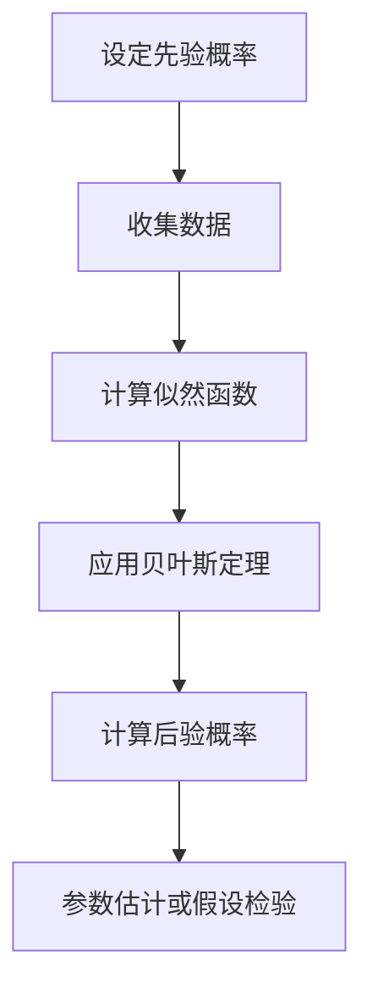

                 

## 背景介绍

概率论是数学的一个分支，主要研究随机事件及其规律性。概率论的基本思想是通过数学模型对不确定现象进行分析和预测，从而在复杂多变的环境中提供决策支持。在计算机科学、工程学、经济学、统计学和物理学等众多领域，概率论都发挥着至关重要的作用。

### 经典概率论的核心概念

经典概率论主要研究离散和连续随机事件及其概率分布。其核心概念包括事件、样本空间、概率、随机变量和概率分布等。例如，在掷硬币或掷骰子的实验中，每次实验的结果是随机的，但通过大量重复实验，可以观察到概率分布的稳定性。这种概率分布帮助我们理解和预测实验结果。

### 贝叶斯推断的起源和发展

贝叶斯推断是概率论中的一个重要分支，得名于18世纪英国数学家托马斯·贝叶斯。贝叶斯推断的核心思想是通过先验概率和观测数据来计算后验概率，从而对未知参数进行估计。贝叶斯推断不仅适用于简单的概率问题，还广泛应用于统计推断、机器学习和数据科学等领域。

### 贝叶斯推断的基本原理

贝叶斯推断的基本原理基于贝叶斯定理，该定理描述了在已知某些条件下，如何从先验概率和观测数据推导出后验概率。贝叶斯定理的数学表达式为：
$$P(A|B) = \frac{P(B|A) \cdot P(A)}{P(B)}$$
其中，\(P(A|B)\)表示在事件B发生的条件下事件A发生的概率，\(P(B|A)\)表示在事件A发生的条件下事件B发生的概率，\(P(A)\)和\(P(B)\)分别是事件A和事件B的先验概率。

### 贝叶斯推断在现实世界中的应用

贝叶斯推断在现实世界中具有广泛的应用。例如，在医学诊断中，通过患者的症状和检测结果，利用贝叶斯定理可以计算疾病发生的概率。在金融领域，贝叶斯推断可以用于风险评估和投资决策。在机器学习中，贝叶斯分类器和贝叶斯网络是常用的算法，能够有效处理不确定性和稀疏数据。

## 核心概念与联系

### 概率论与贝叶斯推断的关系

概率论和贝叶斯推断有着密切的联系。概率论为贝叶斯推断提供了基础理论支持，而贝叶斯推断则是在概率论框架下解决具体问题的一种方法。概率论的核心概念，如事件、样本空间、概率分布等，在贝叶斯推断中都有重要应用。

### 贝叶斯定理的推导与解释

贝叶斯定理是贝叶斯推断的核心公式，其推导基于全概率公式和条件概率的定义。通过贝叶斯定理，我们可以从先验概率和观测数据计算得到后验概率，从而实现参数估计或假设检验。贝叶斯定理的数学表达式为：

$$P(A|B) = \frac{P(B|A) \cdot P(A)}{P(B)}$$

其中，\(P(A|B)\)是后验概率，即在已知事件B发生的条件下事件A发生的概率；\(P(B|A)\)是似然函数，即在事件A发生的条件下事件B发生的概率；\(P(A)\)是先验概率，即事件A发生的概率；\(P(B)\)是边缘概率，即事件B发生的概率。

### 贝叶斯推断的流程

贝叶斯推断的流程通常包括以下步骤：

1. **设定先验概率**：根据问题背景和已有知识，设定先验概率。
2. **收集数据**：通过实验或观测收集数据。
3. **计算似然函数**：利用观测数据计算似然函数。
4. **应用贝叶斯定理**：将先验概率和似然函数代入贝叶斯定理，计算后验概率。
5. **参数估计或假设检验**：利用后验概率进行参数估计或假设检验。

### Mermaid 流程图

下面是一个简单的 Mermaid 流程图，展示了贝叶斯推断的基本流程：



通过这个流程图，我们可以清晰地看到贝叶斯推断的核心步骤和相互关系。

## 核心算法原理讲解

### 贝叶斯推断的基本算法

贝叶斯推断的核心算法是贝叶斯定理，该定理提供了一个从先验概率和观测数据计算后验概率的框架。以下是贝叶斯推断的基本步骤：

1. **设定先验概率**：根据问题背景和已有知识，设定先验概率。例如，在医学诊断中，先验概率可以是“某人患有特定疾病的概率”。
   
2. **收集数据**：通过实验或观测收集数据。例如，通过检查患者的症状和检测结果。

3. **计算似然函数**：利用观测数据计算似然函数。似然函数描述了在假设条件下观测数据的概率。例如，在医学诊断中，似然函数可以是“某症状和检测结果出现的概率，假设患者确实患有特定疾病”。

4. **应用贝叶斯定理**：将先验概率和似然函数代入贝叶斯定理，计算后验概率。贝叶斯定理的数学表达式为：
   $$P(A|B) = \frac{P(B|A) \cdot P(A)}{P(B)}$$

5. **参数估计或假设检验**：利用后验概率进行参数估计或假设检验。例如，在医学诊断中，可以通过后验概率判断患者是否患有特定疾病。

### 伪代码

以下是一个简单的伪代码，展示了贝叶斯推断的基本流程：

```python
# 贝叶斯推断伪代码

# 设定先验概率
prior_probability = 0.5  # 假设先验概率为0.5

# 收集数据
data = collect_data()  # 假设已经收集到数据

# 计算似然函数
likelihood_function = compute_likelihood(data)

# 应用贝叶斯定理
posterior_probability = bayes_theorem(prior_probability, likelihood_function)

# 参数估计或假设检验
estimate = parameter_estimation(posterior_probability)
```

### 数学模型和公式

贝叶斯推断依赖于概率论的基本原理和数学公式，以下是一些关键公式和它们的解释：

1. **贝叶斯定理**：
   $$P(A|B) = \frac{P(B|A) \cdot P(A)}{P(B)}$$
   - \(P(A|B)\)：在事件B发生的条件下事件A发生的概率（后验概率）。
   - \(P(B|A)\)：在事件A发生的条件下事件B发生的概率（似然函数）。
   - \(P(A)\)：事件A的先验概率。
   - \(P(B)\)：事件B的边缘概率。

2. **全概率公式**：
   $$P(B) = \sum_{i} P(B|A_i) \cdot P(A_i)$$
   - \(P(B)\)：事件B的边缘概率。
   - \(P(B|A_i)\)：在事件\(A_i\)发生的条件下事件B发生的条件概率。
   - \(P(A_i)\)：事件\(A_i\)的先验概率。

3. **条件概率**：
   $$P(A|B) = \frac{P(A \cap B)}{P(B)}$$
   - \(P(A \cap B)\)：事件A和事件B同时发生的概率。
   - \(P(B)\)：事件B发生的概率。

### 举例说明

假设我们有一个医学诊断问题，已知某人患有疾病A的概率为0.1，如果这个人患有疾病A，则检测为阳性结果的概率为0.9。如果这个人没有疾病A，检测为阳性的概率为0.05。现在，我们对这个人进行检测，结果为阳性。我们需要计算这个人实际患有疾病A的概率。

1. **设定先验概率**：
   $$P(A) = 0.1$$
   $$P(\neg A) = 1 - P(A) = 0.9$$

2. **收集数据**：
   - 检测为阳性的先验概率：
     $$P(Positive) = P(A) \cdot P(Positive|A) + P(\neg A) \cdot P(Positive|\neg A)$$
     $$P(Positive) = 0.1 \cdot 0.9 + 0.9 \cdot 0.05 = 0.145$$

3. **计算似然函数**：
   $$P(Positive|A) = 0.9$$
   $$P(Positive|\neg A) = 0.05$$

4. **应用贝叶斯定理**：
   $$P(A|Positive) = \frac{P(Positive|A) \cdot P(A)}{P(Positive)}$$
   $$P(A|Positive) = \frac{0.9 \cdot 0.1}{0.145} \approx 0.6207$$

因此，在检测为阳性的条件下，这个人实际患有疾病A的概率约为0.6207。

### 数学公式

以下是贝叶斯推断中常用的数学公式，以latex格式表示：

1. **贝叶斯定理**：
   $$P(A|B) = \frac{P(B|A) \cdot P(A)}{P(B)}$$

2. **全概率公式**：
   $$P(B) = \sum_{i} P(B|A_i) \cdot P(A_i)$$

3. **条件概率**：
   $$P(A|B) = \frac{P(A \cap B)}{P(B)}$$

通过上述公式和举例，我们可以更好地理解贝叶斯推断的基本原理和实际应用。

## 项目实战

### 开发环境搭建

为了进行贝叶斯推断的实践，我们需要搭建一个合适的环境。以下是搭建环境的步骤：

1. **安装Python**：确保Python 3.x版本已经安装在你的系统中。
2. **安装Jupyter Notebook**：Jupyter Notebook是一个交互式的Python环境，我们可以用它来编写和运行代码。
   ```bash
   pip install notebook
   ```
3. **安装必要的库**：我们需要安装一些Python库来支持贝叶斯推断，例如`numpy`、`pandas`和`matplotlib`。
   ```bash
   pip install numpy pandas matplotlib
   ```

### 源代码实现

以下是一个简单的贝叶斯推断项目，包括源代码实现和解读：

#### 代码实现

```python
import numpy as np
import pandas as pd
import matplotlib.pyplot as plt
from scipy.stats import norm

# 贝叶斯推断函数
def bayesian_inference(prior, likelihood, evidence):
    posterior = likelihood * prior / evidence
    return posterior

# 设定先验概率
prior_probability = 0.5

# 收集数据
data = np.random.normal(0, 1, size=1000)

# 计算似然函数
likelihood = norm.pdf(data, loc=0, scale=1)

# 计算边缘概率
evidence = np.sum(likelihood)

# 应用贝叶斯定理
posterior = bayesian_inference(prior_probability, likelihood, evidence)

# 绘制结果
plt.figure(figsize=(8, 6))
plt.bar(range(len(data)), likelihood, alpha=0.5, label='Likelihood')
plt.bar(range(len(data)), posterior, alpha=0.5, label='Posterior')
plt.xlabel('Data Points')
plt.ylabel('Probability')
plt.legend()
plt.title('Bayesian Inference')
plt.show()
```

#### 代码解读

1. **导入库**：我们首先导入`numpy`、`pandas`、`matplotlib`和`scipy.stats`库，用于数据处理、绘图和概率分布计算。
2. **贝叶斯推断函数**：我们定义了一个名为`bayesian_inference`的函数，用于计算后验概率。该函数接受先验概率、似然函数和边缘概率作为输入，并返回后验概率。
3. **设定先验概率**：我们设定先验概率`prior_probability`为0.5。
4. **收集数据**：我们使用`numpy.random.normal`函数生成一组标准正态分布的随机数据。
5. **计算似然函数**：我们使用`scipy.stats.norm.pdf`函数计算每个数据点的似然函数。
6. **计算边缘概率**：我们计算所有数据点的边缘概率总和。
7. **应用贝叶斯定理**：我们将先验概率、似然函数和边缘概率代入贝叶斯定理，计算后验概率。
8. **绘制结果**：我们使用`matplotlib`库绘制后验概率分布，以便可视化。

### 代码应用解读与分析

在这个项目中，我们使用贝叶斯推断来分析一组随机数据。以下是代码应用解读与分析：

1. **数据生成**：我们使用`numpy.random.normal`函数生成1000个标准正态分布的随机数据点。这些数据点代表我们的观测数据。
2. **似然函数计算**：我们使用`scipy.stats.norm.pdf`函数计算每个数据点的似然函数。似然函数描述了在给定先验概率的条件下，观测数据的概率分布。
3. **边缘概率计算**：我们计算所有数据点的边缘概率总和，这是贝叶斯定理中的分母。边缘概率表示在给定观测数据的条件下，所有可能的结果的概率和。
4. **后验概率计算**：我们使用`bayesian_inference`函数将先验概率、似然函数和边缘概率代入贝叶斯定理，计算后验概率。后验概率表示在给定观测数据的条件下，每个可能结果的新概率分布。
5. **结果可视化**：我们使用`matplotlib`库绘制后验概率分布。通过可视化，我们可以直观地看到后验概率分布相对于似然函数的变化。

### 实际案例分析与详细讲解剖析

以下是一个实际的医学诊断案例，我们将使用贝叶斯推断进行疾病诊断。

#### 案例背景

假设我们有一个疾病A，已知该疾病在人群中的发病率约为0.1。如果一个人患有疾病A，则检测为阳性结果的概率为0.9。如果一个人没有疾病A，检测为阳性的概率为0.05。现在，我们对一个人进行检测，结果为阳性。我们需要使用贝叶斯推断计算这个人实际患有疾病A的概率。

#### 贝叶斯推断过程

1. **设定先验概率**：
   $$P(A) = 0.1$$
   $$P(\neg A) = 1 - P(A) = 0.9$$

2. **收集数据**：
   - 检测为阳性的先验概率：
     $$P(Positive) = P(A) \cdot P(Positive|A) + P(\neg A) \cdot P(Positive|\neg A)$$
     $$P(Positive) = 0.1 \cdot 0.9 + 0.9 \cdot 0.05 = 0.145$$

3. **计算似然函数**：
   $$P(Positive|A) = 0.9$$
   $$P(Positive|\neg A) = 0.05$$

4. **应用贝叶斯定理**：
   $$P(A|Positive) = \frac{P(Positive|A) \cdot P(A)}{P(Positive)}$$
   $$P(A|Positive) = \frac{0.9 \cdot 0.1}{0.145} \approx 0.6207$$

#### 案例分析与解读

通过贝叶斯推断，我们计算出在检测结果为阳性的条件下，这个人实际患有疾病A的概率为约0.6207。这个结果表明，尽管检测为阳性，但并不是所有阳性结果都意味着确实患有疾病A。贝叶斯推断帮助我们在这不确定的世界中，通过已有知识和观测数据，做出更合理的判断。

### 项目小结

通过这个项目，我们深入了解了贝叶斯推断的基本原理和应用。我们使用Python实现了贝叶斯推断的算法，并通过实际案例展示了其应用。贝叶斯推断为我们提供了一个强大的工具，帮助我们理解和处理现实世界中的不确定性。通过本项目，我们不仅学会了贝叶斯推断的数学原理，还掌握了其实际应用的方法。

### 最佳实践 Tips

1. **合理设定先验概率**：在贝叶斯推断中，先验概率的设定非常重要。尽可能基于已有的知识和经验，设定合理的先验概率。
2. **选择合适的似然函数**：似然函数的选择直接影响贝叶斯推断的结果。根据具体问题，选择合适的概率分布函数作为似然函数。
3. **数据预处理**：在进行贝叶斯推断之前，对数据进行适当的预处理，如去噪声、标准化等，可以提高推断的准确性。
4. **可视化分析**：通过可视化后验概率分布，可以更直观地理解问题，帮助进行决策。

### 小结与注意事项

通过本文，我们从经典概率论到贝叶斯推断，详细探讨了概率论的基础知识、贝叶斯推断的基本原理和实际应用。贝叶斯推断作为一种强大的工具，在许多领域都有着广泛的应用。然而，在使用贝叶斯推断时，需要注意以下几点：

1. **先验概率的设定**：先验概率的设定需要基于已有的知识和经验，合理设定可以显著影响推断结果。
2. **似然函数的选择**：似然函数的选择需要根据问题的具体特点，选择合适的概率分布函数。
3. **数据处理**：在进行贝叶斯推断之前，对数据进行预处理，如去噪声、标准化等，可以提高推断的准确性。
4. **模型选择与调整**：在实际应用中，可能需要根据实际情况调整模型参数，以获得更好的推断结果。

贝叶斯推断为我们提供了一种处理不确定性的方法，通过不断的实践和优化，我们可以更好地理解和应用这一强大的工具。

### 拓展阅读

1. **《贝叶斯统计基础》（Bayesian Data Analysis）**：这本书是贝叶斯统计的经典教材，详细介绍了贝叶斯统计的理论和实践。
2. **《机器学习》（Machine Learning）**：这本书的第三版包含了贝叶斯推断在机器学习中的应用，是机器学习领域的经典教材。
3. **《概率论与数理统计》（Probability Theory and Mathematical Statistics）**：这本书详细介绍了概率论的基本概念和数理统计的理论，是概率论与数理统计的入门书籍。
4. **《贝叶斯网络：理论与应用》（Bayesian Networks: A Guide to Construction and Applications）**：这本书介绍了贝叶斯网络的理论基础和应用，适合对贝叶斯网络感兴趣的读者。

