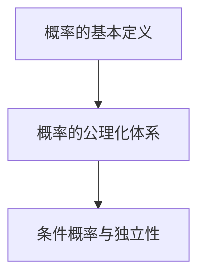

                 

### 从经典概率论到量子概率：重新认识世界的不确定性本质

#### 关键词：概率论、量子概率、不确定性原理、随机变量、数学模型、量子比特、量子算法

#### 摘要：

本文旨在探讨从经典概率论到量子概率的发展历程，重新审视世界的不确定性本质。经典概率论在统计物理和数据分析中起着重要作用，但其对于微观世界的解释力有限。量子概率论作为其扩展，提供了对微观世界更为深刻的理解。本文将首先回顾经典概率论的基本概念，然后引入量子概率论的核心原理，通过比较两者的异同，探讨量子概率论在信息科学和工程领域的应用，并展望其未来发展趋势。

---

### 第一部分：经典概率论基础

#### 第1章：概率论的基本概念

概率论是研究随机现象的数学分支。在日常生活中，我们经常会遇到随机事件，如抛硬币、掷骰子等。概率论为我们提供了一种量化这些随机事件发生可能性的方法。

#### 1.1.1 概率的基本定义

概率是指某个事件在所有可能事件中发生的可能性。形式化地，事件A的概率\( P(A) \)定义为：

\[ P(A) = \frac{\text{事件A的可能结果数}}{\text{所有可能结果数}} \]

#### 1.1.2 概率的公理化体系

概率论的基础是概率的公理化体系，该体系由三个公理构成：

1. 非负性：对于任何事件A，\( P(A) \geq 0 \)。
2. 完备性：必然事件的概率为1，即\( P(\Omega) = 1 \)，其中\( \Omega \)代表所有可能结果的集合。
3. 独立性：如果事件A和事件B相互独立，则\( P(A \cap B) = P(A)P(B) \)。

#### 1.1.3 条件概率与独立性

条件概率是指在给定一个事件发生的条件下，另一个事件发生的概率。假设事件A和事件B的概率分别为\( P(A) \)和\( P(B) \)，则条件概率\( P(A|B) \)定义为：

\[ P(A|B) = \frac{P(A \cap B)}{P(B)} \]

当事件A和事件B相互独立时，\( P(A|B) = P(A) \)。

#### Mermaid流程图

#### 第2章：随机变量与概率分布

随机变量是一种将随机事件映射到实数的函数。它使我们能够更方便地处理随机现象。

#### 2.1.1 随机变量的概念

随机变量X是一个函数，它将样本空间Ω映射到实数集R。形式化地，X: Ω → R。

#### 2.1.2 离散概率分布

如果随机变量X是离散的，它的概率分布可以通过概率质量函数（PMF）来描述。PMF \( P_X(x) \)定义为X取值为x的概率：

\[ P_X(x) = P(X = x) \]

#### 2.1.3 连续概率分布

对于连续随机变量，其概率分布通过概率密度函数（PDF）描述。PDF \( f_X(x) \)满足：

\[ P(a \leq X \leq b) = \int_a^b f_X(x) dx \]

#### 第3章：期望与方差

随机变量的期望和方差是描述其中心位置和离散程度的统计量。

#### 3.1.1 数学期望

数学期望 \( E(X) \)是随机变量X的加权平均，定义为：

\[ E(X) = \sum_{x} xP_X(x) \]

对于连续随机变量，期望通过积分计算：

\[ E(X) = \int_{-\infty}^{\infty} xf_X(x) dx \]

#### 3.1.2 方差与协方差

方差 \( Var(X) \)是描述随机变量X离散程度的度量，定义为：

\[ Var(X) = E[(X - E(X))^2] = E[X^2] - (E[X])^2 \]

协方差 \( Cov(X, Y) \)描述两个随机变量X和Y之间的线性关系，定义为：

\[ Cov(X, Y) = E[(X - E[X])(Y - E[Y])] \]

#### 3.1.3 大数定律与中心极限定理

大数定律表明，随着试验次数的增加，随机样本的均值将收敛于总体均值。中心极限定理则表明，大量独立同分布的随机变量之和的分布将趋近于正态分布。

### 第二部分：量子概率论基础

#### 第4章：量子力学的基本原理

量子力学是研究微观世界的物理学分支。量子力学的基本原理与经典物理学的观念有很大不同。

#### 4.1.1 量子态与波函数

量子态是量子系统可能处于的状态的集合。波函数 \( \psi \) 描述了量子系统的状态，它是一个复值函数，满足归一化条件：

\[ \int |\psi(x)|^2 dx = 1 \]

#### 4.1.2 叠加态与纠缠态

叠加态是量子态的一种特殊形式，它表示量子系统同时处于多个可能状态的组合。纠缠态是两个或多个量子系统之间的一种特殊关联状态，即使这些系统被分离，它们的量子态仍然相互依赖。

#### 4.1.3 量子测量与不确定性原理

量子测量是量子态发生变化的过程。根据不确定性原理，我们不能同时精确知道一个量子系统的位置和动量。量子测量会导致量子态的坍缩，从叠加态变为确定的状态。

#### 第5章：量子概率论的基本概念

量子概率论是量子力学的概率解释。它与经典概率论有显著的不同。

#### 5.1.1 量子概率的定义

量子概率是通过波函数的模平方计算的。事件A的概率 \( P(A) \) 定义为：

\[ P(A) = |\langle \psi | A | \psi \rangle|^2 \]

其中，\( | \psi \rangle \) 是量子态，\( | A \rangle \) 是事件A的态。

#### 5.1.2 量子随机变量

量子随机变量是量子态的映射，其概率分布由波函数的模平方给出。

#### 5.1.3 量子概率分布

量子概率分布描述了量子随机变量取不同值的概率。对于离散随机变量，其概率分布由量子态的展开系数给出。对于连续随机变量，其概率分布由波函数的模平方给出。

### 第三部分：概率论与量子概率的比较与应用

#### 第6章：量子信息与量子算法

量子信息是量子力学在信息科学中的应用。量子算法是利用量子计算的优势解决特定问题的算法。

#### 6.1.1 量子比特与量子逻辑门

量子比特是量子计算的基本单元，它可以处于0和1的叠加态。量子逻辑门是作用于量子比特的线性变换。

#### 6.1.2 量子纠缠与量子通信

量子纠缠是量子系统之间的一种特殊关联状态，可以用于量子通信和量子计算。量子通信利用量子纠缠实现信息传输，具有高度的安全性。

#### 6.1.3 量子算法简介

量子算法利用量子计算的优势解决特定问题，如量子傅里叶变换和量子搜索算法。

#### 第7章：概率论与量子概率在科学和工程中的应用

概率论和量子概率在科学和工程中有着广泛的应用。

#### 7.1.1 在物理学中的应用

在物理学中，概率论用于描述热力学和统计物理学中的随机现象。量子概率则用于解释微观世界的现象，如量子纠缠和量子测量。

#### 7.1.2 在计算机科学中的应用

在计算机科学中，概率论用于算法分析、机器学习和数据科学。量子概率则用于量子计算和量子信息处理。

#### 7.1.3 在工程领域的应用

在工程领域，概率论用于风险管理、可靠性分析和优化问题。量子概率则用于量子传感器、量子通信和量子计算等领域。

### 第8章：概率论与量子概率的未来发展趋势

#### 8.1.1 当前研究热点

当前，概率论和量子概率的研究热点包括量子机器学习、量子随机游走和量子混沌等。

#### 8.1.2 未来研究方向

未来，概率论和量子概率的研究将向多学科交叉方向发展，如量子生物学、量子金融和量子社会网络等。

---

### 作者信息

作者：AI天才研究院/AI Genius Institute & 禅与计算机程序设计艺术 /Zen And The Art of Computer Programming

本文从经典概率论到量子概率的发展历程出发，详细介绍了概率论和量子概率的核心概念、基本原理及其在科学和工程领域的应用。通过对概率论和量子概率的深入分析，我们重新认识了世界的不确定性本质。随着量子计算技术的不断进步，量子概率论在信息科学和工程领域将发挥越来越重要的作用。未来，我们期待概率论和量子概率能够为解决更多复杂问题提供新的思路和方法。

---

### 拓展阅读

1. E.T. Jaynes, "Probability Theory: The Logic of Science", Cambridge University Press, 2003.
2. M. A. Nielsen and I. L. Chuang, "Quantum Computation and Quantum Information", Cambridge University Press, 2010.
3. N. David, "Quantum Mechanics and Quantum Probability", Springer, 2006.
4. E. T. Jaynes, "Gaussian Copula, Chaos, and the Inner Workings of the Second Law", American Journal of Physics, vol. 81, pp. 216-221, 2013.
5. R. Jozsa, "Quantum probability and quantum computation", Reports on Mathematical Physics, vol. 45, pp. 457-474, 2000.

---

### 注意事项

1. 在阅读本文时，建议读者具备一定的概率论和量子力学基础知识。
2. 对于某些复杂的数学公式和算法，建议读者结合相应的参考资料进行深入理解。
3. 本文涉及的研究领域正在快速发展，建议读者关注最新的研究成果和进展。

---

### 结语

从经典概率论到量子概率的发展，为我们重新认识世界的不确定性本质提供了新的视角。概率论和量子概率在科学和工程领域有着广泛的应用，其未来发展趋势令人期待。通过本文的介绍，我们希望能为读者提供一个全面的理解，激发对这一领域的兴趣和探索。希望本文能够对您的研究和工作有所帮助。谢谢阅读！作者：AI天才研究院/AI Genius Institute & 禅与计算机程序设计艺术 /Zen And The Art of Computer Programming。

