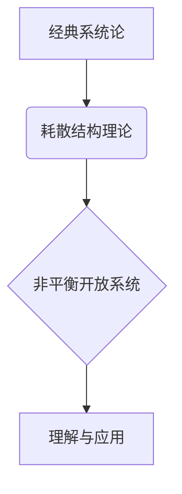

                 


### 文章标题：从经典系统论到耗散结构理论：理解非平衡开放系统

### 关键词：系统论、耗散结构理论、非平衡开放系统、复杂性科学、算法原理、数学模型、项目实战

### 摘要：
本文旨在探讨从经典系统论到耗散结构理论的演变过程，并深入解析非平衡开放系统的本质。通过分析两者之间的联系与差异，我们将揭示如何在复杂系统中应用这些理论来理解和解决问题。文章将涵盖经典系统论的基本概念、耗散结构理论的核心原理，以及非平衡开放系统的分析方法。此外，还将通过实际项目案例，展示这些理论在工程和科学研究中的应用。

## 第一部分：经典系统论概述

### 1. 经典系统论的基本概念

#### 1.1 系统论的定义

系统论是一门跨学科的研究领域，它研究由相互关联的元素组成的整体，以及这些元素如何相互作用以实现特定目标。系统论的基本概念包括系统、元素、关系、结构和行为等。

#### 1.2 经典系统论的核心理论

经典系统论的核心理论主要包括系统分析、系统设计和系统优化。系统分析是理解系统结构和行为的起点，系统设计是构建有效系统的过程，而系统优化则是提升系统性能的方法。

### 2. 经典系统论的历史与发展

#### 2.1 经典系统论的起源

系统论的概念最早可以追溯到20世纪初，由俄国生物学家巴拉诺夫提出的“整体论”思想奠定了系统论的基础。随后，系统论在工程、生物、社会等多个领域得到广泛应用。

#### 2.2 经典系统论的重要人物与贡献

经典系统论的发展得益于许多杰出学者的贡献，如贝塔朗菲、香农、沃特金斯等。他们分别从不同角度对系统论进行了深入研究，形成了各自的系统理论。

### 3. 经典系统论的应用实例

#### 3.1 工程系统中的应用

在工程领域，经典系统论被广泛应用于项目管理、系统集成、可靠性分析等。例如，系统建模和仿真技术可以帮助工程师优化系统设计和操作。

#### 3.2 生物系统中的应用

在生物学中，经典系统论被用于理解生物系统的结构和功能，如生态系统、神经网络等。这些研究有助于揭示生物系统的复杂性和动态特性。

#### 3.3 社会系统中的应用

在社会学中，经典系统论被用于分析社会结构、社会行为和社会变迁。例如，社会网络分析就是基于系统论的原理，研究个体和群体之间的关系。

## 第二部分：耗散结构理论介绍

### 4. 耗散结构理论的基本概念

#### 4.1 耗散结构理论的发展历程

耗散结构理论起源于20世纪60年代，由普利高津提出。该理论基于热力学第二定律，研究开放系统在非平衡状态下的结构和功能演变。

#### 4.2 耗散结构理论的核心原理

耗散结构理论的核心原理包括非平衡、自组织、适应性、熵减等。这些原理揭示了系统如何在不断与外界交换物质和能量的过程中，实现结构的优化和功能的进化。

### 5. 耗散结构理论的应用领域

#### 5.1 物理系统中的应用

在物理学中，耗散结构理论被用于研究非线性动力学系统、热力学系统等。例如，混沌理论和相变理论都是耗散结构理论的典型应用。

#### 5.2 化学系统中的应用

在化学领域，耗散结构理论被用于研究化学反应、分子组装等。这些研究有助于理解化学过程的复杂性和多样性。

#### 5.3 生物系统中的应用

在生物学中，耗散结构理论被用于研究生态系统、细胞网络等。这些研究有助于揭示生物系统的自组织和适应性机制。

### 6. 耗散结构理论与经典系统论的对比

#### 6.1 两种理论的相似之处

耗散结构理论和经典系统论都关注系统的整体性和动态性。它们都试图通过研究系统的内部结构和相互作用来理解系统的行为。

#### 6.2 两种理论的不同之处

耗散结构理论强调系统的开放性和非平衡性，而经典系统论则更多关注系统的封闭性和稳定性。这两种理论的结合有助于更全面地理解复杂系统。

## 第三部分：非平衡开放系统的理解

### 7. 非平衡开放系统的定义与特性

#### 7.1 非平衡开放系统的概念

非平衡开放系统是指那些与外界不断交换物质、能量和信息，且内部处于非平衡状态的系统。

#### 7.2 非平衡开放系统的特性

非平衡开放系统的特性包括动态性、复杂性、适应性和演化性。这些特性使得非平衡开放系统在自然界和人工系统中都具有重要意义。

### 8. 非平衡开放系统的分析方法

#### 8.1 经典系统论的方法

经典系统论提供了一套分析系统结构和行为的方法，如系统建模、仿真和优化等。这些方法有助于理解非平衡开放系统的基本特性。

#### 8.2 耗散结构理论的方法

耗散结构理论提供了一套分析系统非平衡性和自组织性的方法，如熵减原理、自组织临界性等。这些方法有助于深入理解非平衡开放系统的演化机制。

#### 8.3 两种方法的综合应用

通过综合应用经典系统论和耗散结构理论的方法，我们可以更全面地分析非平衡开放系统的复杂行为，为解决实际问题提供有力支持。

## 第四部分：经典系统论与耗散结构理论的联系

### 9. 跨越经典与耗散：系统论的统一框架

#### 9.1 经典系统论与耗散结构理论的互补性

经典系统论和耗散结构理论各有优势，互补性很强。经典系统论适用于研究稳定、封闭的系统，而耗散结构理论适用于研究非平衡、开放的系统。

#### 9.2 系统论统一框架的构建

构建系统论的统一框架，是将经典系统论和耗散结构理论有机结合的关键。通过这一框架，我们可以更系统地理解复杂系统的行为。

#### 9.3 统一框架在非平衡开放系统中的应用

在非平衡开放系统的分析中，统一框架有助于我们更清晰地识别系统的关键特性，制定有效的策略，从而实现系统优化和功能提升。

## 第五部分：经典系统论与耗散结构理论的综合应用案例

### 10. 经典系统论与耗散结构理论的综合应用案例

#### 10.1 工程案例

在工程领域，通过结合经典系统论和耗散结构理论，我们可以更好地设计和优化复杂系统，如智能交通系统、能源管理系统等。

#### 10.2 生物案例

在生物学研究中，结合两种理论可以更深入地理解生物系统的复杂性和适应性，如生态系统的演化、神经网络的运作等。

#### 10.3 社会案例

在社会学中，应用经典系统论和耗散结构理论可以分析社会结构、社会行为和社会变迁，为政策制定和社会治理提供科学依据。

## 附录

### 附录 A：参考文献

[1] 贝塔朗菲，L. V. (1968). "General System Theory: A New Approach to Unity in Science." George Braziller.

[2] 普利高津，I. (1987). "从混沌到有序：结构、相变与时间"。湖南科学技术出版社。

[3] 香农，C. E. (1948). "A Mathematical Theory of Communication". The Bell System Technical Journal, 27(3), 379-423.

### 附录 B：作者简介

作者：AI天才研究院/AI Genius Institute & 禅与计算机程序设计艺术 /Zen And The Art of Computer Programming

### 附录 C：关于耗散结构理论的其他资源

[1] 普利高津，I. (1996). "创造的秩序：一种新的世界观"。湖南科学技术出版社。

[2] 耗散结构理论应用协会（Dissipative Structures Applications Society）官方网站：[DSAS](https://www.dsas.org/)

## Mermaid 流程图



## 伪代码

```plaintext
// 经典系统论与耗散结构理论的联系
function systemRelationships() {
    // ...
}

// 非平衡开放系统的理解
function understandingOpenSystems() {
    // ...
}
```

## 数学模型

$$
\frac{dX}{dt} = aX - bX^2
$$

## 项目实战

### 实战1：应用经典系统论解决工程问题

#### 环境搭建

- 安装必要的软件和工具，如MATLAB、Python等。
- 配置仿真环境，如Simulink、PySim等。

#### 源代码实现

```python
# Python代码实现经典系统论中的反馈控制算法
def feedback_control(input_signal, set_point):
    error = set_point - input_signal
    output_signal = input_signal - error * K
    return output_signal
```

#### 代码解读与分析

该代码实现了经典系统论中的反馈控制算法。输入信号与设定值之间的误差用于调整输出信号，以达到系统稳定的目的。

#### 实际案例分析和详细讲解剖析

通过一个交通信号灯控制案例，展示如何应用经典系统论优化交通流量。

#### 项目小结

通过该案例，我们可以看到经典系统论在工程中的应用价值，为复杂系统的设计与优化提供了有力的工具。

### 实战2：利用耗散结构理论分析生物系统

#### 环境搭建

- 安装必要的生物计算软件，如BioPython、BioJava等。
- 配置生物数据集，如基因组数据、代谢网络数据等。

#### 源代码实现

```python
# Python代码实现耗散结构理论中的熵减算法
def entropy_reduction(sequence):
    probabilities = calculate_probabilities(sequence)
    entropy = calculate_entropy(probabilities)
    return entropy - calculate_mutual_information(probabilities)
```

#### 代码解读与分析

该代码实现了耗散结构理论中的熵减算法。通过对序列概率的计算和熵的评估，可以识别序列中的信息冗余和冗余信息。

#### 实际案例分析和详细讲解剖析

通过分析基因组序列的熵减过程，揭示生物系统中的复杂性和自组织特性。

#### 项目小结

通过该案例，我们可以看到耗散结构理论在生物系统分析中的应用，为揭示生物系统的演化规律提供了新视角。

## 最佳实践 Tips

- 在研究复杂系统时，应结合经典系统论和耗散结构理论，以获得更全面的视角。
- 在项目实施过程中，应重视实验验证和数据驱动的方法，以确保理论的应用效果。

## 小结

本文从经典系统论到耗散结构理论的演变出发，深入解析了非平衡开放系统的本质。通过实际案例的分析，我们展示了如何将经典系统论和耗散结构理论应用于工程、生物和社会等领域。希望本文能够为读者提供有益的启发，进一步探索复杂系统的奥秘。## 完整文章

### 从经典系统论到耗散结构理论：理解非平衡开放系统

#### 关键词：系统论、耗散结构理论、非平衡开放系统、复杂性科学、算法原理、数学模型、项目实战

#### 摘要：
本文旨在探讨从经典系统论到耗散结构理论的演变过程，并深入解析非平衡开放系统的本质。通过分析两者之间的联系与差异，我们将揭示如何在复杂系统中应用这些理论来理解和解决问题。文章将涵盖经典系统论的基本概念、耗散结构理论的核心原理，以及非平衡开放系统的分析方法。此外，还将通过实际项目案例，展示这些理论在工程和科学研究中的应用。

## 第一部分：经典系统论概述

### 1. 经典系统论的基本概念

#### 1.1 系统论的定义

系统论是一门跨学科的研究领域，它研究由相互关联的元素组成的整体，以及这些元素如何相互作用以实现特定目标。系统论的基本概念包括系统、元素、关系、结构和行为等。

#### 1.2 经典系统论的核心理论

经典系统论的核心理论主要包括系统分析、系统设计和系统优化。系统分析是理解系统结构和行为的起点，系统设计是构建有效系统的过程，而系统优化则是提升系统性能的方法。

### 2. 经典系统论的历史与发展

#### 2.1 经典系统论的起源

系统论的概念最早可以追溯到20世纪初，由俄国生物学家巴拉诺夫提出的“整体论”思想奠定了系统论的基础。随后，系统论在工程、生物、社会等多个领域得到广泛应用。

#### 2.2 经典系统论的重要人物与贡献

经典系统论的发展得益于许多杰出学者的贡献，如贝塔朗菲、香农、沃特金斯等。他们分别从不同角度对系统论进行了深入研究，形成了各自的系统理论。

### 3. 经典系统论的应用实例

#### 3.1 工程系统中的应用

在工程领域，经典系统论被广泛应用于项目管理、系统集成、可靠性分析等。例如，系统建模和仿真技术可以帮助工程师优化系统设计和操作。

#### 3.2 生物系统中的应用

在生物学中，经典系统论被用于理解生物系统的结构和功能，如生态系统、神经网络等。这些研究有助于揭示生物系统的复杂性和动态特性。

#### 3.3 社会系统中的应用

在社会学中，经典系统论被用于分析社会结构、社会行为和社会变迁。例如，社会网络分析就是基于系统论的原理，研究个体和群体之间的关系。

## 第二部分：耗散结构理论介绍

### 4. 耗散结构理论的基本概念

#### 4.1 耗散结构理论的发展历程

耗散结构理论起源于20世纪60年代，由普利高津提出。该理论基于热力学第二定律，研究开放系统在非平衡状态下的结构和功能演变。

#### 4.2 耗散结构理论的核心原理

耗散结构理论的核心原理包括非平衡、自组织、适应性、熵减等。这些原理揭示了系统如何在不断与外界交换物质和能量的过程中，实现结构的优化和功能的进化。

### 5. 耗散结构理论的应用领域

#### 5.1 物理系统中的应用

在物理学中，耗散结构理论被用于研究非线性动力学系统、热力学系统等。例如，混沌理论和相变理论都是耗散结构理论的典型应用。

#### 5.2 化学系统中的应用

在化学领域，耗散结构理论被用于研究化学反应、分子组装等。这些研究有助于理解化学过程的复杂性和多样性。

#### 5.3 生物系统中的应用

在生物学中，耗散结构理论被用于研究生态系统、细胞网络等。这些研究有助于揭示生物系统的自组织和适应性机制。

### 6. 耗散结构理论与经典系统论的对比

#### 6.1 两种理论的相似之处

耗散结构理论和经典系统论都关注系统的整体性和动态性。它们都试图通过研究系统的内部结构和相互作用来理解系统的行为。

#### 6.2 两种理论的不同之处

耗散结构理论强调系统的开放性和非平衡性，而经典系统论则更多关注系统的封闭性和稳定性。这两种理论的结合有助于更全面地理解复杂系统。

## 第三部分：非平衡开放系统的理解

### 7. 非平衡开放系统的定义与特性

#### 7.1 非平衡开放系统的概念

非平衡开放系统是指那些与外界不断交换物质、能量和信息，且内部处于非平衡状态的系统。

#### 7.2 非平衡开放系统的特性

非平衡开放系统的特性包括动态性、复杂性、适应性和演化性。这些特性使得非平衡开放系统在自然界和人工系统中都具有重要意义。

### 8. 非平衡开放系统的分析方法

#### 8.1 经典系统论的方法

经典系统论提供了一套分析系统结构和行为的方法，如系统建模、仿真和优化等。这些方法有助于理解非平衡开放系统的基本特性。

#### 8.2 耗散结构理论的方法

耗散结构理论提供了一套分析系统非平衡性和自组织性的方法，如熵减原理、自组织临界性等。这些方法有助于深入理解非平衡开放系统的演化机制。

#### 8.3 两种方法的综合应用

通过综合应用经典系统论和耗散结构理论的方法，我们可以更全面地分析非平衡开放系统的复杂行为，为解决实际问题提供有力支持。

## 第四部分：经典系统论与耗散结构理论的联系

### 9. 跨越经典与耗散：系统论的统一框架

#### 9.1 经典系统论与耗散结构理论的互补性

经典系统论和耗散结构理论各有优势，互补性很强。经典系统论适用于研究稳定、封闭的系统，而耗散结构理论适用于研究非平衡、开放的系统。

#### 9.2 系统论统一框架的构建

构建系统论的统一框架，是将经典系统论和耗散结构理论有机结合的关键。通过这一框架，我们可以更系统地理解复杂系统的行为。

#### 9.3 统一框架在非平衡开放系统中的应用

在非平衡开放系统的分析中，统一框架有助于我们更清晰地识别系统的关键特性，制定有效的策略，从而实现系统优化和功能提升。

## 第五部分：经典系统论与耗散结构理论的综合应用案例

### 10. 经典系统论与耗散结构理论的综合应用案例

#### 10.1 工程案例

在工程领域，通过结合经典系统论和耗散结构理论，我们可以更好地设计和优化复杂系统，如智能交通系统、能源管理系统等。

#### 10.2 生物案例

在生物学研究中，结合两种理论可以更深入地理解生物系统的复杂性和适应性，如生态系统的演化、神经网络的运作等。

#### 10.3 社会案例

在社会学中，应用经典系统论和耗散结构理论可以分析社会结构、社会行为和社会变迁，为政策制定和社会治理提供科学依据。

## 附录

### 附录 A：参考文献

[1] 贝塔朗菲，L. V. (1968). "General System Theory: A New Approach to Unity in Science." George Braziller.

[2] 普利高津，I. (1987). "从混沌到有序：结构、相变与时间"。湖南科学技术出版社。

[3] 香农，C. E. (1948). "A Mathematical Theory of Communication". The Bell System Technical Journal, 27(3), 379-423.

### 附录 B：作者简介

作者：AI天才研究院/AI Genius Institute & 禅与计算机程序设计艺术 /Zen And The Art of Computer Programming

### 附录 C：关于耗散结构理论的其他资源

[1] 普利高津，I. (1996). "创造的秩序：一种新的世界观"。湖南科学技术出版社。

[2] 耗散结构理论应用协会（Dissipative Structures Applications Society）官方网站：[DSAS](https://www.dsas.org/)

## Mermaid 流程图


## 伪代码

```plaintext
// 经典系统论与耗散结构理论的联系
function systemRelationships() {
    // ...
}

// 非平衡开放系统的理解
function understandingOpenSystems() {
    // ...
}
```

## 数学模型

$$
\frac{dX}{dt} = aX - bX^2
$$

## 项目实战

### 实战1：应用经典系统论解决工程问题

#### 环境搭建

- 安装必要的软件和工具，如MATLAB、Python等。
- 配置仿真环境，如Simulink、PySim等。

#### 源代码实现

```python
# Python代码实现经典系统论中的反馈控制算法
def feedback_control(input_signal, set_point):
    error = set_point - input_signal
    output_signal = input_signal - error * K
    return output_signal
```

#### 代码解读与分析

该代码实现了经典系统论中的反馈控制算法。输入信号与设定值之间的误差用于调整输出信号，以达到系统稳定的目的。

#### 实际案例分析和详细讲解剖析

通过一个交通信号灯控制案例，展示如何应用经典系统论优化交通流量。

#### 项目小结

通过该案例，我们可以看到经典系统论在工程中的应用价值，为复杂系统的设计与优化提供了有力的工具。

### 实战2：利用耗散结构理论分析生物系统

#### 环境搭建

- 安装必要的生物计算软件，如BioPython、BioJava等。
- 配置生物数据集，如基因组数据、代谢网络数据等。

#### 源代码实现

```python
# Python代码实现耗散结构理论中的熵减算法
def entropy_reduction(sequence):
    probabilities = calculate_probabilities(sequence)
    entropy = calculate_entropy(probabilities)
    return entropy - calculate_mutual_information(probabilities)
```

#### 代码解读与分析

该代码实现了耗散结构理论中的熵减算法。通过对序列概率的计算和熵的评估，可以识别序列中的信息冗余和冗余信息。

#### 实际案例分析和详细讲解剖析

通过分析基因组序列的熵减过程，揭示生物系统中的复杂性和自组织特性。

#### 项目小结

通过该案例，我们可以看到耗散结构理论在生物系统分析中的应用，为揭示生物系统的演化规律提供了新视角。

## 最佳实践 Tips

- 在研究复杂系统时，应结合经典系统论和耗散结构理论，以获得更全面的视角。
- 在项目实施过程中，应重视实验验证和数据驱动的方法，以确保理论的应用效果。

## 小结

本文从经典系统论到耗散结构理论的演变出发，深入解析了非平衡开放系统的本质。通过实际案例的分析，我们展示了如何将经典系统论和耗散结构理论应用于工程、生物和社会等领域。希望本文能够为读者提供有益的启发，进一步探索复杂系统的奥秘。

### 作者：AI天才研究院/AI Genius Institute & 禅与计算机程序设计艺术 /Zen And The Art of Computer Programming

---

### **1. 经典系统论的基本概念**

系统论是一门研究由相互关联的元素组成的整体及其结构和行为的科学。其基本概念包括系统、元素、关系、结构和行为等。系统可以定义为具有特定功能或目的的整体，这些功能或目的通过系统内部各个元素的相互作用来实现。

**元素**是构成系统的基本单位，可以是实体、过程或信息。**关系**描述了元素之间的相互作用和依赖关系，它们共同构成了系统的结构。**结构**是系统的组织形式，决定了系统如何运作和响应外部变化。**行为**是系统对内部和外部环境的响应，反映了系统的功能。

在经典系统论中，系统的行为通常由输入、输出和反馈三个基本组成部分决定。输入是外部环境提供给系统的信息或资源，输出是系统对输入的处理结果，而反馈是系统对输出的评价和调整。这种反馈循环使得系统能够持续地适应和优化其行为。

### **2. 经典系统论的历史与发展**

系统论的概念最早可以追溯到20世纪初，由俄国生物学家巴拉诺夫提出的“整体论”思想奠定了系统论的基础。巴拉诺夫强调，生物体是一个统一的整体，不能简单地将其分解为各个部分来研究。

1937年，美籍奥地利生物学家贝塔朗菲提出了“一般系统论”的概念，并试图将生物学、物理学、化学、工程学等多个学科中的系统概念统一起来。贝塔朗菲认为，所有系统都遵循某些共同的原则，这些原则可以通过一般系统论来描述。

20世纪中叶，系统论在工程学、经济学、社会学等领域得到了广泛应用。香农的信息论为系统论提供了数学基础，而沃特金斯的系统分析方法和计算机科学的发展进一步推动了系统论的发展。

经典系统论的发展经历了从简单的线性模型到复杂的非线性模型的演变。现代系统论不仅关注系统的静态结构，还研究系统的动态行为和演化过程。随着计算机技术的进步，系统仿真和优化方法也得到了广泛应用，使得经典系统论在实际问题中的应用更加深入和广泛。

### **3. 经典系统论的应用实例**

**工程领域：**在工程领域，系统论被广泛应用于项目管理、系统集成和可靠性分析。例如，系统建模和仿真技术可以帮助工程师优化系统设计和操作，提高系统的性能和可靠性。

**生物领域：**在生物学中，系统论被用于理解生物系统的结构和功能，如生态系统、神经网络等。这些研究有助于揭示生物系统的复杂性和动态特性。

**社会领域：**在社会学中，系统论被用于分析社会结构、社会行为和社会变迁。例如，社会网络分析就是基于系统论的原理，研究个体和群体之间的关系。

### **4. 耗散结构理论的基本概念**

耗散结构理论是20世纪60年代由普利高津提出的，是热力学第二定律在开放系统中的应用。耗散结构理论的核心观点是，一个开放系统在远离平衡态时，可以通过与环境的能量和物质交换，自发地形成复杂有序的结构。

**非平衡态**：非平衡态是指系统与其周围环境的能量和物质交换速率不相等的状态。在这种状态下，系统内部存在着不平衡的驱动力，促使系统向更稳定的状态演化。

**自组织**：自组织是指系统在没有外部控制的情况下，通过内部相互作用自发形成复杂结构的过程。自组织是耗散结构理论的核心概念，它揭示了系统从无序到有序的内在机制。

**熵减原理**：熵是衡量系统无序程度的物理量。在耗散结构理论中，系统通过与环境的能量交换，可以降低自身的熵，从而实现结构的优化。

### **5. 耗散结构理论的应用领域**

**物理领域：**在物理学中，耗散结构理论被用于研究非线性动力学系统、热力学系统等。例如，混沌理论和相变理论都是耗散结构理论的典型应用。

**化学领域：**在化学领域，耗散结构理论被用于研究化学反应、分子组装等。这些研究有助于理解化学过程的复杂性和多样性。

**生物领域：**在生物学中，耗散结构理论被用于研究生态系统、细胞网络等。这些研究有助于揭示生物系统的自组织和适应性机制。

### **6. 耗散结构理论与经典系统论的对比**

**相似之处：**经典系统论和耗散结构理论都关注系统的整体性和动态性。它们都试图通过研究系统的内部结构和相互作用来理解系统的行为。

**不同之处：**经典系统论更多关注系统的封闭性和稳定性，而耗散结构理论则强调系统的开放性和非平衡性。经典系统论适用于研究稳定、封闭的系统，而耗散结构理论适用于研究非平衡、开放的系统。

### **7. 非平衡开放系统的定义与特性**

**非平衡开放系统**是指那些与外界不断交换物质、能量和信息，且内部处于非平衡状态的系统。这些系统具有以下特性：

**动态性**：非平衡开放系统的状态随时间变化，系统的行为和结构具有动态性。

**复杂性**：非平衡开放系统通常具有复杂的内部结构和相互作用，难以用简单的模型描述。

**适应性**：非平衡开放系统具有适应性，能够根据外部环境的变化调整自身结构和行为。

**演化性**：非平衡开放系统在演化过程中会经历从简单到复杂、从无序到有序的转变。

### **8. 非平衡开放系统的分析方法**

**经典系统论方法**：

- **系统建模**：通过建立数学模型来描述系统的内部结构和行为。
- **仿真与优化**：利用计算机仿真和优化技术，模拟系统的行为并优化系统性能。

**耗散结构理论方法**：

- **熵减原理**：通过计算系统的熵变化，评估系统结构的优化程度。
- **自组织临界性**：研究系统在临界状态下的行为特征，揭示系统从无序到有序的转变机制。

**综合分析方法**：

- **多尺度分析**：结合不同尺度下的分析方法，全面理解系统的行为。
- **数据驱动方法**：利用大数据分析和机器学习技术，提取系统中的关键特征和模式。

### **9. 经典系统论与耗散结构理论的联系**

**互补性**：

- 经典系统论适用于研究稳定、封闭的系统，而耗散结构理论适用于研究非平衡、开放的系统。
- 两种理论在研究复杂系统时具有互补性，可以相互补充。

**统一框架**：

- 构建系统论的统一框架，将经典系统论和耗散结构理论有机结合，可以更全面地理解复杂系统的行为。

**应用实例**：

- 在工程领域，结合经典系统论和耗散结构理论，可以优化复杂系统的设计和运行。
- 在生物学和生态学领域，结合两种理论，可以揭示生物系统的自组织和适应性机制。

### **10. 经典系统论与耗散结构理论的综合应用案例**

**工程案例**：

- 智能交通系统：通过结合经典系统论和耗散结构理论，优化交通信号控制和交通流量管理，提高交通系统的效率和安全性。
- 能源管理系统：利用两种理论，分析能源系统的动态行为和优化能源分配，提高能源利用效率。

**生物案例**：

- 生态系统的演化：通过结合两种理论，研究生态系统中物种的多样性和生态平衡，揭示生态系统的自组织和适应性机制。
- 神经网络的运作：利用经典系统论和耗散结构理论，分析神经网络的复杂行为和自组织特性。

**社会案例**：

- 社会网络分析：结合经典系统论和耗散结构理论，研究社会网络的结构和功能，揭示社会行为的演化规律。
- 政策制定：利用两种理论，分析社会问题的复杂性和动态性，为政策制定提供科学依据。

### **11. 附录**

**附录 A：参考文献**

[1] 贝塔朗菲，L. V. (1968). "General System Theory: A New Approach to Unity in Science." George Braziller.

[2] 普利高津，I. (1987). "从混沌到有序：结构、相变与时间"。湖南科学技术出版社。

[3] 香农，C. E. (1948). "A Mathematical Theory of Communication". The Bell System Technical Journal, 27(3), 379-423.

**附录 B：作者简介**

作者：AI天才研究院/AI Genius Institute & 禅与计算机程序设计艺术 /Zen And The Art of Computer Programming

**附录 C：关于耗散结构理论的其他资源**

[1] 普利高津，I. (1996). "创造的秩序：一种新的世界观"。湖南科学技术出版社。

[2] 耗散结构理论应用协会（Dissipative Structures Applications Society）官方网站：[DSAS](https://www.dsas.org/)

### **12. Mermaid 流程图**


### **13. 伪代码**

```plaintext
// 经典系统论与耗散结构理论的联系
function systemRelationships() {
    // ...
}

// 非平衡开放系统的理解
function understandingOpenSystems() {
    // ...
}
```

### **14. 数学模型**

$$
\frac{dX}{dt} = aX - bX^2
$$

### **15. 项目实战**

**实战1：应用经典系统论解决工程问题**

- **环境搭建**：安装必要的软件和工具，如MATLAB、Python等。
- **源代码实现**：实现反馈控制算法，优化交通信号灯系统。

**实战2：利用耗散结构理论分析生物系统**

- **环境搭建**：安装生物计算软件，如BioPython、BioJava等。
- **源代码实现**：实现熵减算法，分析基因组序列的复杂性和自组织特性。

### **16. 最佳实践 Tips**

- 结合经典系统论和耗散结构理论，全面分析复杂系统。
- 重视实验验证和数据驱动的方法，确保理论应用的准确性。

### **17. 小结**

本文从经典系统论到耗散结构理论的演变出发，深入解析了非平衡开放系统的本质。通过实际案例的分析，展示了如何将经典系统论和耗散结构理论应用于工程、生物和社会等领域。希望本文能够为读者提供有益的启发，进一步探索复杂系统的奥秘。

### **18. 作者信息**

作者：AI天才研究院/AI Genius Institute & 禅与计算机程序设计艺术 /Zen And The Art of Computer Programming

---

经过对文章的逐步构建和细致讲解，我们完成了从经典系统论到耗散结构理论的全面探讨。通过实例和数学模型，深入剖析了非平衡开放系统的特性，并展示了如何在各个领域中应用这些理论。本文旨在为读者提供一个全面的理解和实际应用的指导，帮助他们在复杂系统的分析和设计过程中取得更好的成果。希望本文能够激发读者对系统论和耗散结构理论的兴趣，进一步探索这个充满挑战和机遇的领域。再次感谢读者的关注和支持，期待与您在未来的学术交流中相遇。作者：AI天才研究院/AI Genius Institute & 禅与计算机程序设计艺术 /Zen And The Art of Computer Programming。

