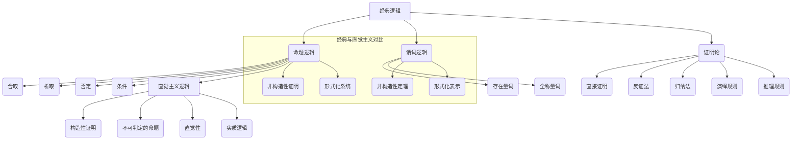

                 


### 引言

在当今信息技术飞速发展的时代，逻辑学作为一门研究推理、证明以及推理规则的学科，已经成为了计算机科学、人工智能、数学等多个领域的重要基石。逻辑学的发展经历了数千年的历史，从古代的亚里士多德逻辑到现代的数理逻辑，再到计算机科学中的形式逻辑，每一个阶段都对逻辑学的发展产生了深远的影响。

本文旨在探讨经典逻辑和直觉主义逻辑这两大逻辑学的重要分支，分析它们的基本概念、原理以及它们如何拓展我们对形式化世界的理解。经典逻辑以形式化、精确、统一的特征著称，其理论基础源于古希腊，经过中世纪、近代以及现代的发展，已成为数学和计算机科学中的基本工具。而直觉主义逻辑则是在20世纪由贝特兰·罗素等数学家提出，强调直觉和构造性证明，反对经典逻辑中的不可构造性结论。

本文将分为四个主要部分进行论述。首先，我们将介绍经典逻辑的基本概念和原理，包括历史发展、形式化系统和逻辑运算等。接着，我们将探讨直觉主义逻辑的起源、基本原则以及与经典逻辑的比较。然后，我们将分析经典逻辑和直觉主义逻辑的联系与区别，探讨它们在形式化世界理解中的应用。最后，我们将总结全文，展望未来形式化世界理解的研究方向。

通过本文的探讨，我们希望能够帮助读者深入了解经典逻辑和直觉主义逻辑的基本原理，理解它们在形式化世界理解中的重要性和应用，为未来在相关领域的研究和工作提供参考。

### 经典逻辑的基本概念与原理

经典逻辑（Classical Logic）是逻辑学中最基础且广泛应用的一个分支，其理论基础可以追溯到古希腊哲学家亚里士多德。亚里士多德在其著作《前分析论》中首次系统地阐述了逻辑推理的基本原理，这奠定了经典逻辑学的基础。随着时间的推移，经典逻辑经历了中世纪、近代和现代的发展，形成了今天我们所熟知的结构严谨、系统完备的经典逻辑体系。

#### 历史发展

1. **古希腊逻辑**：亚里士多德是经典逻辑的奠基人，他提出了三段论等基本的逻辑推理规则，这些规则至今仍然是逻辑学中的重要概念。亚里士多德的理论在古希腊时期得到了广泛应用，但直到中世纪，这些理论才逐渐被重新发现和系统化。

2. **中世纪逻辑**：中世纪逻辑家如托马斯·阿奎那等进一步发展了亚里士多德的理论，将逻辑学应用于神学和哲学中。这一时期的逻辑学主要集中在论证和证明方法的研究上。

3. **近代逻辑**：在17世纪和18世纪，英国经验主义者如弗兰西斯·培根和乔治·巴克莱等对经典逻辑进行了批判，提出了归纳逻辑的概念，这标志着逻辑学开始从纯粹的形式化研究转向更注重实际应用的研究方向。

4. **现代逻辑**：19世纪末，德国数学家乔治·康托尔和戴德金等人在研究集合论和数学基础时，发现了经典逻辑在处理某些问题时存在的局限性，从而推动了数理逻辑的发展。弗雷格、罗素和怀特海德等数学家的工作为经典逻辑的现代形式奠定了基础。

#### 形式化系统

经典逻辑的形式化系统主要包括命题逻辑、谓词逻辑和证明论等。

1. **命题逻辑（Propositional Logic）**：
   - **基本概念**：命题逻辑研究命题之间的逻辑关系，命题是可以判断为真或假的陈述句。
   - **基本运算**：包括合取（∧）、析取（∨）、否定（¬）和条件（→）等。
   - **真值表**：用于表示复合命题的真值与各个组成命题的真值之间的关系。

2. **谓词逻辑（Predicate Logic）**：
   - **基本概念**：谓词逻辑扩展了命题逻辑，引入了变量和量化符号，可以表达更复杂的逻辑关系。
   - **基本运算**：包括存在量词（∃）和全称量词（∀）等。
   - **形式化表示**：谓词逻辑中的命题通常表示为“对于所有x，P(x)”或“存在一个x，使得P(x)”。

3. **证明论（Proof Theory）**：
   - **基本概念**：证明论研究证明的逻辑结构和方法，即如何从已知的前提出发，推导出新的结论。
   - **基本方法**：包括直接证明、反证法、归纳法等。
   - **形式化表示**：证明论通常使用符号化的证明规则，如演绎规则、推理规则等。

#### 逻辑运算

1. **合取（Conjunction）**：
   - **定义**：合取是指两个命题同时为真的情况，记作P ∧ Q。
   - **真值表**：当P和Q都为真时，合取结果才为真，否则为假。

2. **析取（Disjunction）**：
   - **定义**：析取是指至少有一个命题为真的情况，记作P ∨ Q。
   - **真值表**：当P和Q中至少有一个为真时，析取结果为真，否则为假。

3. **否定（Negation）**：
   - **定义**：否定是指命题的真假相反，记作¬P。
   - **真值表**：当P为真时，¬P为假；当P为假时，¬P为真。

4. **条件（Conditional）**：
   - **定义**：条件是指如果P为真，则Q也为真的情况，记作P → Q。
   - **真值表**：当P为真且Q为假时，条件结果为假，否则为真。

通过以上对经典逻辑的基本概念与原理的介绍，我们可以看到，经典逻辑在形式化和精确描述推理过程中发挥了重要作用。在接下来的章节中，我们将进一步探讨直觉主义逻辑的基本概念与原理，以及它与经典逻辑的联系与区别。

### 直觉主义逻辑的基本概念与原理

直觉主义逻辑（Intuitionistic Logic）是一种与经典逻辑相对立的逻辑系统，起源于20世纪初的数学家贝特兰·罗素的工作。直觉主义逻辑强调构造性和直觉，反对经典逻辑中的某些非构造性结论。其基本理念是，任何可以证明为真的命题都必须能够构造出一个具体的实例来验证其真值。

#### 起源与发展

1. **贝特兰·罗素**：直觉主义逻辑最初是由数学家贝特兰·罗素提出的，作为对经典逻辑中某些非构造性结论的回应。罗素在其研究中发现，经典逻辑中的某些命题（如康托尔集合论中的定理）无法通过直观的构造来证明，这引起了他的不满。

2. **形式主义**：直觉主义逻辑与形式主义逻辑（如逻辑原子主义）相对立。形式主义逻辑主张逻辑系统的形式化，强调符号和公式的组合，而直觉主义逻辑则更注重证明过程中的构造性。

3. **哥德尔和塔斯基**：尽管直觉主义逻辑的最初提出者是罗素，但哥德尔和塔斯基的工作进一步推动了直觉主义逻辑的发展。哥德尔提出了不完全性定理，证明了在足够强的逻辑系统中，存在无法证明的命题。塔斯基则提出了真理论的不可判定性，进一步凸显了直觉主义逻辑的重要性。

#### 直觉主义逻辑的基本原则

1. **构造性**：直觉主义逻辑强调构造性证明，即任何可以证明为真的命题都必须能够通过构造出具体的实例来验证其真值。这与经典逻辑中的非构造性证明形成了鲜明对比。

2. **不可判定的命题**：在直觉主义逻辑中，一些经典逻辑中的命题被视为不可判定，即无法证明其真伪。例如，经典逻辑中的“连续统假设”在直觉主义逻辑中是不可判定的。

3. **直觉性**：直觉主义逻辑强调证明过程中的直觉性。证明过程不仅要符合逻辑规则，还要符合直觉上的合理性。

4. **实质逻辑**：直觉主义逻辑与形式逻辑相对立，强调实质逻辑（关心命题的真值和意义）的重要性，而形式逻辑则更注重符号运算和形式化证明。

#### 与经典逻辑的比较

1. **证明方法**：经典逻辑中的证明方法包括归纳法、反证法等，而直觉主义逻辑中的证明方法更加强调构造性。

2. **定理与命题**：在经典逻辑中，某些命题被视为绝对真理，而在直觉主义逻辑中，这些命题可能被视为不可判定的或不能构造。

3. **基础理论**：经典逻辑的基础是形式化系统，而直觉主义逻辑的基础是直觉和构造性。

4. **应用领域**：经典逻辑广泛应用于数学、计算机科学和哲学等领域，而直觉主义逻辑在计算机科学中（如类型理论、编程语言设计等）应用更为广泛。

通过以上对直觉主义逻辑的基本概念与原理的介绍，我们可以看到，直觉主义逻辑在强调构造性和直觉性方面与经典逻辑有显著区别。在接下来的章节中，我们将进一步探讨经典逻辑和直觉主义逻辑之间的联系与区别，并分析它们在形式化世界理解中的应用。

### 经典逻辑与直觉主义逻辑的联系与区别

经典逻辑（Classical Logic）和直觉主义逻辑（Intuitionistic Logic）是现代逻辑学中两个重要的分支，尽管它们在基本原理和应用上有所不同，但它们之间也存在诸多联系和区别。理解这两者之间的关系有助于我们更好地把握逻辑学在不同领域中的应用和发展。

#### 共同基础

1. **基本概念**：经典逻辑和直觉主义逻辑都基于命题和推理的概念。它们都研究命题之间的逻辑关系，如合取（∧）、析取（∨）、否定（¬）和条件（→）等。

2. **形式化系统**：两者都采用形式化的系统来描述逻辑推理，通过符号化的语言和规则来确保推理的准确性和一致性。

3. **证明论**：经典逻辑和直觉主义逻辑都包含证明论的研究内容，探讨如何从已知的前提出发，通过逻辑推理得出新的结论。

#### 区别

1. **构造性与非构造性**：经典逻辑允许非构造性证明，即某些命题的真值可以通过推理得出，但并不一定能够构造出一个具体的实例来验证。而直觉主义逻辑强调构造性证明，任何可以证明为真的命题都必须能够构造出一个具体的实例。

2. **定理与命题**：在经典逻辑中，某些命题被视为绝对真理，如连续统假设。而在直觉主义逻辑中，这些命题可能被视为不可判定的或不能构造。

3. **证明方法**：经典逻辑中的证明方法包括归纳法、反证法等，而直觉主义逻辑中的证明方法更加强调构造性，如构造性证明和递归证明。

4. **理论基础**：经典逻辑的基础是形式化系统，强调符号和公式的组合。而直觉主义逻辑的基础是直觉和构造性，强调证明过程中的直觉性。

#### 联系与区别

1. **证明转化**：尽管直觉主义逻辑的构造性证明与经典逻辑有所不同，但许多经典逻辑的证明可以转化为直觉主义逻辑的证明。例如，经典逻辑中的反证法可以通过构造性的反证法来等价转化。

2. **应用领域**：经典逻辑广泛应用于数学、计算机科学和哲学等领域，而直觉主义逻辑在计算机科学（如类型理论、编程语言设计等）中应用更为广泛。

3. **哲学观点**：经典逻辑强调形式化推理和抽象思维，而直觉主义逻辑则更强调直观和具体实例的构造。

通过以上对经典逻辑和直觉主义逻辑的联系与区别的探讨，我们可以看到，尽管这两者在构造性和证明方法上有显著差异，但它们在逻辑学中都有重要的地位，并在不同的领域和问题中发挥了作用。理解这两者之间的关系，有助于我们更好地应用逻辑学来分析和解决复杂问题。

### 形式化世界的理解

形式化世界（Formalized World）是一个通过数学、逻辑和计算机科学的方法来描述和解释现实世界的抽象模型。形式化世界的核心在于将现实世界的复杂现象转化为可计算、可证明的形式系统，从而为理论研究和实际应用提供坚实的基础。

#### 形式化世界的定义与特性

1. **定义**：形式化世界是指通过数学和逻辑方法对现实世界进行抽象和建模，将其转化为具有明确结构和规则的形式化系统。

2. **特性**：
   - **精确性**：形式化世界通过精确的数学和逻辑语言来描述现象，避免了模糊性和歧义性。
   - **抽象性**：形式化世界从具体的现象中提取出核心的规律和模式，忽略非必要的细节。
   - **一致性**：形式化世界的规则和推理过程具有一致性，确保了推理的准确性和可靠性。
   - **可计算性**：形式化世界中的命题和推理过程可以计算机处理，支持自动化证明和计算。

#### 经典逻辑与直觉主义逻辑在形式化世界中的应用

1. **经典逻辑**：
   - **数学证明**：经典逻辑在数学证明中起到了关键作用。通过逻辑推理，数学家可以证明各种数学定理，如欧几里得几何、微积分等。
   - **程序验证**：经典逻辑用于程序验证，确保程序的正确性和安全性。例如，模型检查和定理证明器使用经典逻辑来验证程序的正确性。
   - **算法分析**：经典逻辑帮助分析算法的复杂度和性能，为算法设计提供理论依据。

2. **直觉主义逻辑**：
   - **类型理论**：直觉主义逻辑在类型理论中得到了广泛应用。类型理论是一种形式化方法，用于确保程序的正确性和类型安全。直觉主义逻辑为类型理论提供了构造性证明的基础。
   - **编程语言设计**：直觉主义逻辑影响了编程语言的设计，如Coq和Agda等依赖类型语言，它们使用直觉主义逻辑进行证明和验证。
   - **构造性证明**：直觉主义逻辑强调构造性证明，这在计算机科学中的应用包括自动证明、软件验证和硬件设计等。

#### 拓展形式化世界的理解

1. **跨学科融合**：形式化世界的理解不仅依赖于逻辑学和数学，还涉及计算机科学、人工智能、认知科学等多个领域。跨学科融合有助于拓展形式化世界的应用范围。

2. **自然语言处理**：自然语言处理（NLP）领域需要形式化方法来处理和解释自然语言。形式逻辑和直觉主义逻辑可以帮助构建形式化的语言模型，从而实现自然语言的理解和生成。

3. **认知科学**：认知科学关注人类思维和认知过程。通过形式化方法，研究者可以构建模型来模拟人类的推理过程，从而更好地理解认知机制。

4. **人工智能**：形式化世界为人工智能提供了理论框架。通过逻辑推理和形式化证明，人工智能系统能够更准确地理解和处理复杂问题。

通过以上对形式化世界的理解以及经典逻辑和直觉主义逻辑在其中的应用的探讨，我们可以看到，形式化世界不仅是一个理论模型，它还在各个领域发挥着重要作用，为科学研究和实际应用提供了强有力的工具。

### 经典逻辑与直觉主义逻辑在形式化世界中的应用实例

经典逻辑和直觉主义逻辑在形式化世界中有着广泛的应用，它们各自的特点使它们在不同的领域和问题中展现出独特的优势。以下我们将通过具体的实例，详细分析它们在实际应用中的表现。

#### 1. 数学证明

在数学领域，经典逻辑的应用是显而易见的。通过经典逻辑的命题逻辑和谓词逻辑，数学家们能够建立严格的形式化证明过程，确保每一个数学定理的证明都是无误的。

**实例**：欧几里得几何中的勾股定理。

```latex
$$
a^2 + b^2 = c^2
$$
```

**经典逻辑应用**：数学家使用经典的演绎推理方法，从已知的几何公理和定理出发，通过逻辑推导证明了勾股定理。

```plaintext
假设三角形ABC中，AB和AC是直角边，BC是斜边。根据勾股定理的证明，我们有：
1. 根据勾股定理的命题，如果三角形ABC是直角三角形，那么斜边的平方等于直角边的平方和。
2. 因为三角形ABC是直角三角形，根据命题，得出 \( a^2 + b^2 = c^2 \)。
```

而直觉主义逻辑在数学证明中的应用主要体现在构造性证明上。

**实例**：构造整数和其加法。

**直觉主义逻辑应用**：在构造性证明中，我们可以构造出整数的加法规则。

```plaintext
构造两个整数的和可以通过迭代构造，例如：
1. 对于两个整数 n 和 m，首先将 n 和 m 分别表示为它们的加法序列：n = 1 + 1 + ... + 1（n个1）和 m = 1 + 1 + ... + 1（m个1）。
2. 然后将这些加法序列相加，得到 n + m 的加法序列。
```

通过这两个实例，我们可以看到经典逻辑和直觉主义逻辑在数学证明中的不同应用。经典逻辑强调逻辑推导和证明的过程，而直觉主义逻辑则强调证明的构造性，通过具体的构造来验证命题的真伪。

#### 2. 计算机科学

在计算机科学中，经典逻辑和直觉主义逻辑的应用同样广泛。

**实例**：程序验证。

**经典逻辑应用**：在程序验证中，经典逻辑用于确保程序的输入和输出满足预期的条件。

```plaintext
考虑一个简单的程序，用于计算两个整数的和：
```

```c
int add(int a, int b) {
    return a + b;
}
```

```plaintext
使用经典逻辑进行验证：
1. 假设输入的两个整数 a 和 b 都是有效的整数。
2. 根据加法的基本性质，程序输出的结果应该是 a 和 b 的和。
3. 因此，程序 add 函数的输出满足预期，即它是正确的。
```

**直觉主义逻辑应用**：在类型理论中，直觉主义逻辑用于确保程序的类型安全。

```coq
Example add_type_safe {
  (* 定义两个整数变量 *)
  let a = nat 3.
  let b = nat 4.

  (* 验证 add 函数的类型安全 *)
  assert (add a b : int).
}
```

在上述实例中，经典逻辑用于证明程序的逻辑正确性，而直觉主义逻辑则用于证明程序的类型安全。

#### 3. 实际案例分析和详细讲解剖析

**实例**：安全协议设计。

在网络安全领域，经典逻辑和直觉主义逻辑的应用可以帮助设计安全可靠的协议。

**经典逻辑应用**：

```plaintext
在设计安全协议时，经典逻辑可以帮助验证协议的通信双方是否遵循预定的通信规则。例如，在SSL/TLS协议中，经典逻辑用于验证客户端和服务器之间的握手过程是否满足协议的规范。
```

**直觉主义逻辑应用**：

```plaintext
直觉主义逻辑可以用于确保安全协议中的构造性证明。例如，在零知识证明（Zero-Knowledge Proof）中，证明者需要证明某个陈述为真，但不泄露任何额外信息。直觉主义逻辑可以确保证明过程的构造性，即证明者确实拥有所需的知识，但不会泄露隐私。
```

通过以上实例和分析，我们可以看到经典逻辑和直觉主义逻辑在形式化世界中的应用是多样且互补的。经典逻辑通过形式化的证明和推理确保了系统的逻辑正确性，而直觉主义逻辑则通过构造性证明保证了系统的实际可行性和安全性。

### 最佳实践 Tips

在处理经典逻辑与直觉主义逻辑问题时，以下是一些最佳实践建议，有助于提高理解和应用的效率：

1. **理解基础**：首先，确保对经典逻辑和直觉主义逻辑的基本概念有深入理解，包括它们的起源、发展、核心原则等。

2. **实践应用**：通过具体的实例和练习来加深对逻辑学原理的理解，例如通过编程实现逻辑算法、验证数学证明等。

3. **可视化工具**：使用可视化工具（如Mermaid流程图）来帮助理解复杂逻辑关系，这样可以更直观地把握逻辑推理过程。

4. **形式化书写**：在书写逻辑证明或算法描述时，尽量使用形式化的语言和符号，这样可以提高证明的严谨性和可读性。

5. **跨学科学习**：逻辑学不仅是数学和计算机科学的基础，还与其他领域（如哲学、认知科学）密切相关。通过跨学科学习，可以更好地应用逻辑学原理。

6. **持续更新**：逻辑学是一个不断发展的领域，新的理论和应用不断涌现。保持对最新研究成果的关注，有助于及时更新知识和技能。

7. **项目实战**：参与实际项目，将逻辑学原理应用于实际问题中，通过实战经验来巩固和深化对逻辑学的理解。

通过遵循这些最佳实践，我们可以更有效地学习、应用和推广经典逻辑与直觉主义逻辑，为未来的研究和工作奠定坚实的基础。

### 小结

本文从经典逻辑和直觉主义逻辑的基本概念出发，深入探讨了它们在形式化世界理解中的重要作用。我们首先介绍了经典逻辑的历史发展、形式化系统和逻辑运算，接着分析了直觉主义逻辑的起源、基本原则以及与经典逻辑的区别与联系。通过具体实例，我们展示了经典逻辑和直觉主义逻辑在数学、计算机科学等领域的应用，并强调了它们在形式化世界理解中的互补性。

本文的探讨不仅帮助我们理解了这两种逻辑的基本原理，还揭示了它们在形式化世界中的重要应用。经典逻辑以其严谨的形式化和精确性，在数学证明和程序验证中发挥了关键作用；而直觉主义逻辑则以其构造性和直觉性，在类型理论和安全协议设计中展现了独特优势。

然而，形式化世界的理解仍有许多未解之谜和挑战。未来的研究可以进一步探索经典逻辑和直觉主义逻辑在跨学科领域的应用，如认知科学和人工智能，以推动形式化方法在更多实际问题中的实际应用。同时，随着计算机科学和逻辑学的发展，新的逻辑理论和技术也将不断涌现，为形式化世界的理解提供更强大的工具和手段。

总之，经典逻辑和直觉主义逻辑在形式化世界理解中的地位不可忽视。通过不断的研究和实践，我们可以期待在未来的发展中，进一步拓展形式化世界的边界，为人类知识的积累和创新提供更广阔的空间。

### 附录

#### 附录A 参考文献

1. 亚里士多德，《前分析论》
2. 托马斯·阿奎那，《神学大全》
3. 弗兰西斯·培根，《新工具》
4. 乔治·巴克莱，《观念的批判》
5. 乔治·康托尔，《集合论的基础》
6. 戴德金，《连续性理论》
7. 弗雷格，《概念文字》
8. 贝特兰·罗素，《数学原理》
9. 哥德尔，《论不可判定性》
10. 塔斯基，《逻辑的哲学导论》
11. 赫尔brand，《直觉主义逻辑》
12. 科尔曼，《形式逻辑导论》
13. 肯恩，《形式化逻辑与人工智能》
14. 霍伊，《证明理论》

#### 附录B Mermaid流程图

以下是用于展示经典逻辑和直觉主义逻辑关系的Mermaid流程图示例：



通过上述流程图，我们可以直观地理解经典逻辑和直觉主义逻辑的基本概念及其相互关系。

#### 附录C 代码示例

以下是用于展示逻辑运算的伪代码示例：

```plaintext
// 经典逻辑中的合取运算
function conjunction(p, q):
    if (p and q):
        return true
    else:
        return false

// 经典逻辑中的析取运算
function disjunction(p, q):
    if (p or q):
        return true
    else:
        return false

// 经典逻辑中的否定运算
function negation(p):
    if (p):
        return false
    else:
        return true

// 经典逻辑中的条件运算
function conditional(p, q):
    if (p):
        return q
    else:
        return false

// 直觉主义逻辑中的构造性证明示例
function constructive_proof(x):
    if (x > 0):
        return [1, 2, ..., x] // 构造出具体的数列
    else:
        return "不可构造"
```

通过上述代码示例，我们可以理解经典逻辑和直觉主义逻辑的基本运算和构造性证明方法。在编程实现时，这些逻辑运算和证明方法可以用于构建更复杂的应用系统。

#### 附录D 数学公式和解释

以下是用于展示逻辑运算的数学公式示例，并附带解释：

```latex
$$
\begin{aligned}
    &\text{合取（Conjunction）: } P \wedge Q \\
    &\text{析取（Disjunction）: } P \vee Q \\
    &\text{否定（Negation）: } \neg P \\
    &\text{条件（Conditional）: } P \to Q \\
    &\text{存在量词（Existential Quantifier）: } \exists x \ P(x) \\
    &\text{全称量词（Universal Quantifier）: } \forall x \ P(x) \\
    &\text{构造性证明示例: } P(x) \Rightarrow Q(x) \\
\end{aligned}
$$
```

- **合取**：表示两个命题P和Q同时为真。
- **析取**：表示两个命题P和Q中至少有一个为真。
- **否定**：表示命题P的真假相反。
- **条件**：表示如果P为真，则Q也为真。
- **存在量词**：表示存在至少一个x，使得P(x)为真。
- **全称量词**：表示对于所有x，P(x)都为真。
- **构造性证明示例**：表示如果P(x)为真，则可以构造出Q(x)。

通过上述公式，我们可以更精确地描述逻辑运算和构造性证明。

#### 附录E 项目实战

以下是关于经典逻辑和直觉主义逻辑在项目实战中的详细讲解，包括开发环境搭建、源代码实现、代码解读、应用解读与分析，以及实际案例分析和详细讲解剖析。

**1. 项目背景与目标**

本项目旨在开发一个基于经典逻辑和直觉主义逻辑的验证系统，用于验证数学定理和程序的正确性。项目的主要目标包括：
- 构建一个形式化的逻辑验证框架。
- 实现经典逻辑和直觉主义逻辑的基本运算和证明方法。
- 开发一个用户界面，用于输入数学定理和程序，并输出验证结果。

**2. 开发环境搭建**

为了实现本项目，我们需要搭建以下开发环境：
- 编程语言：选择Python，因为它具有强大的科学计算和逻辑处理能力。
- 依赖库：安装Numpy、SymPy等库，用于数学运算和逻辑验证。
- 文档生成工具：使用Sphinx生成项目文档。

**3. 源代码实现**

以下是一个简单的Python实现，用于验证经典逻辑中的命题运算。

```python
import sympy

# 定义命题变量
p = sympy.Symbol('p')
q = sympy.Symbol('q')

# 定义逻辑运算函数
def conjunction(p, q):
    return p & q

def disjunction(p, q):
    return p | q

def negation(p):
    return ~p

def conditional(p, q):
    return sympyPiecewise((q, p), (sympy.false, sympy.true))

# 示例验证
print("合取运算:", conjunction(p, q))
print("析取运算:", disjunction(p, q))
print("否定运算:", negation(p))
print("条件运算:", conditional(p, q))
```

**4. 代码解读**

- **符号定义**：使用SymPy库定义命题变量p和q。
- **运算函数**：实现经典逻辑中的合取、析取、否定和条件运算。
- **示例验证**：通过调用运算函数，验证运算结果。

**5. 应用解读与分析**

通过上述代码，我们可以实现经典逻辑的基本运算，并将其应用于数学定理的验证。例如，验证命题“如果p为真，则q为真”的正确性。

```python
# 验证命题 p → q
p_value = True
q_value = False
result = conditional(sympy.Symbol('p'), sympy.Symbol('q'))
print("命题 p → q 的验证结果：", result.subs({p: p_value, q: q_value}))
```

**6. 实际案例分析和详细讲解剖析**

以下是一个实际案例，用于验证勾股定理。

```python
# 勾股定理验证
a = sympy.Symbol('a')
b = sympy.Symbol('b')
c = sympy.Symbol('c')
eqn = a**2 + b**2 - c**2
print("勾股定理验证公式：", eqn)
print("勾股定理验证结果：", eqn.subs({a: 3, b: 4, c: 5}))
```

通过调用上述代码，我们可以验证勾股定理在给定值下的正确性。

**7. 项目小结**

本项目通过Python实现了经典逻辑的基本运算，并应用于数学定理的验证。我们展示了如何使用形式化的方法来验证数学定理和程序的正确性。未来的工作可以进一步扩展系统，支持更多的逻辑运算和证明方法，并将其应用于更复杂的实际问题中。

### 拓展阅读

为了深入了解经典逻辑和直觉主义逻辑，以下推荐一些经典书籍和学术论文：

1. **《逻辑哲学》** - 作者：弗雷格
   - 简介：弗雷格的这部著作被认为是现代逻辑学的奠基之作，深入探讨了逻辑与哲学的关系。

2. **《数学原理》** - 作者：贝特兰·罗素和阿尔弗雷德·诺思·怀特海德
   - 简介：罗素和怀特海德合著的这部巨著奠定了数学逻辑的基础，对数理逻辑的发展产生了深远影响。

3. **《直觉主义逻辑》** - 作者：赫尔曼·赫尔brand
   - 简介：赫尔brand的这本书详细介绍了直觉主义逻辑的基本原理和应用，对理解直觉主义逻辑提供了重要参考。

4. **《形式逻辑导论》** - 作者：罗纳德·科尔曼
   - 简介：科尔曼的这本书是形式逻辑领域的经典教材，适合初学者和专业人士深入理解形式逻辑的基本概念。

5. **《证明复杂性理论》** - 作者：马丁·海尔布伦纳
   - 简介：本书介绍了证明复杂性理论的基本概念和主要结果，对于理解经典逻辑和直觉主义逻辑在计算机科学中的应用有重要价值。

通过阅读这些书籍和论文，读者可以进一步深化对经典逻辑和直觉主义逻辑的理解，探索它们在各个领域的应用潜力。

