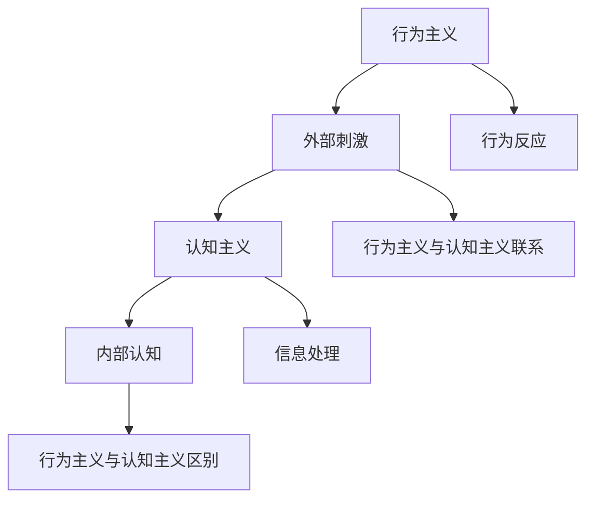

                 

### 一、前言

#### 1.1 文章背景

在心理学与认知科学领域，行为主义和认知主义两大理论体系长期以来占据着重要的地位。行为主义起源于20世纪初，其核心观点是，人类行为是外部刺激与反应之间的简单关联。这一理论由心理学家约翰·沃森（John B. Watson）等人提出，并通过经典条件反射和操作性条件反射等实验得到验证。然而，随着心理学研究的发展，人们逐渐意识到，人类行为并不像行为主义所描述的那样简单，其中涉及更为复杂的内部认知过程。

认知主义理论则强调人的主观体验和内部认知过程，认为人类行为是由内在的心理过程所驱动的。认知主义兴起于20世纪中后期，以瑞士心理学家让·皮亚杰（Jean Piaget）的认知发展理论、美国心理学家乔治·米勒（George A. Miller）的信息处理理论等为代表。认知主义理论认为，学习是一个积极的、主动的过程，个体通过理解信息、构建知识结构来适应环境。

#### 1.2 文章目的

本文旨在深入探讨行为主义和认知主义两大理论体系，通过比较分析，揭示它们在理论观点、研究方法、应用领域等方面的联系与区别。具体来说，本文将首先介绍行为主义和认知主义的理论起源、核心观点和主要代表人物；接着，分析这两大理论在心理学研究中的实际应用及其面临的挑战与局限；然后，探讨行为主义与认知主义之间的联系和区别；最后，探讨认知主义作为新的学习范式对学习理论和实践的影响，并展望其未来发展方向。

#### 1.3 文章结构

本文将分为四个部分进行论述：

- **第一部分：行为主义**：介绍行为主义的历史背景、核心观点、主要代表人物以及其在心理学研究中的应用。
- **第二部分：认知主义**：介绍认知主义的历史背景、核心观点、主要代表人物以及其在心理学研究中的应用。
- **第三部分：行为主义与认知主义的联系与区别**：分析行为主义与认知主义之间的联系和区别，并给出理论架构的Mermaid流程图。
- **第四部分：认知主义作为新的学习范式**：探讨认知主义对学习理论和实践的影响，介绍认知主义在教育、职业培训等领域的应用，并展望其未来发展方向。

通过本文的论述，希望读者能够对行为主义和认知主义有更深入的理解，从而更好地把握现代心理学的发展方向。

### 二、行为主义

#### 2.1 行为主义的起源

行为主义（Behaviorism）起源于20世纪初，其背景主要受几个因素的推动。首先，科学方法的兴起和实验心理学的兴起使得心理学家开始关注可观察的行为，而不再局限于主观的内省方法。其次，心理学在19世纪末和20世纪初经历了重大变革，特别是结构主义和精神分析理论的兴起，使得心理学家开始寻求更为客观和可验证的研究方法。最后，哲学家约翰·B·沃森（John B. Watson）在1913年发表了《行为主义者眼中的心理学》，标志着行为主义的正式诞生。

#### 2.2 行为主义的核心观点

行为主义的核心观点可以总结为以下几点：

1. **行为与刺激-反应关系**：行为主义认为，人类行为是由外部刺激和内部反应之间的简单关联构成的。这种关系可以用S-R（刺激-反应）模型来表示，即行为是外部刺激与个体反应之间的直接联系。

2. **可观察和可测量**：行为主义强调心理学研究应该关注可观察和可测量的行为，而不是主观的心理状态或内在的心理过程。

3. **环境决定论**：行为主义倾向于环境决定论，认为个体的行为和性格主要是由其周围的环境所塑造的，而遗传因素的作用相对较小。

4. **操作性条件反射**：操作性条件反射是行为主义的重要概念，由行为主义心理学家伯尔赫斯·斯金纳（B.F. Skinner）提出。它描述了个体通过行为结果（奖励或惩罚）来调整其行为的过程。

#### 2.3 行为主义的主要代表人物

1. **约翰·B·沃森**（John B. Watson）：行为主义的奠基人，他在1913年的《行为主义者眼中的心理学》一书中提出了行为主义的基本观点。

2. **伯尔赫斯·斯金纳**（B.F. Skinner）：斯金纳是行为主义的重要代表人物，他提出了操作性条件反射理论，并对教育、心理治疗等领域产生了深远的影响。

3. **爱德华·托尔曼**（Edward L. Thorndike）：托尔曼是早期行为主义的重要代表，他提出了“认知行为主义”的观点，强调个体内部的心理过程。

#### 2.4 行为主义的应用

行为主义在心理学研究中有广泛的应用，主要表现在以下几个方面：

1. **教育**：行为主义理论被广泛应用于教育领域，特别是在行为主义心理学家斯金纳的“程序教学”中。程序教学通过逐步呈现问题和解决方案，帮助学生逐步掌握知识。

2. **心理治疗**：行为主义心理治疗，如行为疗法和认知行为疗法，通过改变个体的行为模式来治疗各种心理障碍。

3. **动物行为研究**：行为主义理论被广泛应用于动物行为研究，特别是通过实验研究动物的学习和适应行为。

#### 2.5 行为主义的挑战与局限

尽管行为主义在心理学研究中取得了重要成就，但它也面临着一些挑战和局限：

1. **忽视内部心理过程**：行为主义主要关注可观察的行为，忽视了个体内部的心理过程，这限制了其对复杂行为的解释能力。

2. **环境决定论**：行为主义倾向于环境决定论，忽视了个体遗传因素的作用，这在一定程度上限制了其理论解释力。

3. **操作性问题**：在行为主义研究中，操作化和量化的挑战使得一些研究难以精确地测量和解释行为。

通过以上对行为主义的介绍，我们可以看到，行为主义作为心理学的一个重要理论体系，尽管有其局限性，但在理解和改变人类行为方面仍然具有重要的理论和实践价值。

### 三、认知主义

#### 3.1 认知主义的起源

认知主义（Cognitivism）是心理学中的一个重要理论体系，起源于20世纪中叶。其起源可以追溯到瑞士心理学家让·皮亚杰（Jean Piaget）的工作，他在20世纪20年代开始研究儿童认知发展，提出了著名的认知发展理论。随后，美国心理学家乔治·米勒（George A. Miller）在1956年提出了信息处理理论，进一步推动了认知主义的发展。

#### 3.2 认知主义的核心观点

认知主义的核心观点可以概括为以下几点：

1. **内部认知过程**：与行为主义不同，认知主义强调个体内部的认知过程，认为心理活动是一个信息处理的过程，涉及感知、记忆、思维、问题解决和语言等多个方面。

2. **主动建构**：认知主义认为，学习是一个主动建构的过程，个体通过感知信息、理解和解释信息来构建自己的知识结构。

3. **思维和问题解决**：认知主义强调思维和问题解决在认知过程中的重要性，认为个体通过逻辑推理、分析、比较和决策来处理信息。

4. **模型建构**：认知主义倡导通过建立模型来理解和解释心理现象，这些模型可以是认知过程模型、信息处理模型或神经网络模型等。

#### 3.3 认知主义的主要代表人物

1. **让·皮亚杰**（Jean Piaget）：皮亚杰是认知主义的奠基人之一，他的认知发展理论对心理学研究产生了深远的影响。

2. **乔治·米勒**（George A. Miller）：米勒是信息处理理论的提出者，他对认知心理学的发展做出了重要贡献。

3. **艾伦·纽厄尔**（Allen Newell）和赫伯特·西蒙**（Herbert Simon）：纽厄尔和西蒙是早期认知心理学的重要代表，他们提出了物理符号系统假设，并开发了普林斯顿认知项目。

4. **约翰·安德森**（John Anderson）：安德森是现代认知心理学的重要代表，他的工作涉及认知架构理论、问题解决和推理等多个领域。

#### 3.4 认知主义的应用

认知主义在心理学研究中有广泛的应用，主要表现在以下几个方面：

1. **教育**：认知主义理论在教育领域得到了广泛应用，特别是在认知学习理论、教育心理学和课程设计等方面。

2. **认知科学**：认知主义是认知科学的重要基础，认知科学通过跨学科的研究，探讨人类认知和智能的本质。

3. **人工智能**：认知主义理论对人工智能的发展产生了重要影响，特别是在知识表示、问题解决和自然语言处理等方面。

#### 3.5 认知主义的挑战与局限

尽管认知主义在心理学研究中取得了显著成就，但它也面临着一些挑战和局限：

1. **认知复杂性**：认知过程非常复杂，难以通过简单的模型完全解释。

2. **个体差异**：认知主义理论往往强调普遍性，但个体之间的认知差异可能很大，这限制了理论的应用范围。

3. **实验可重复性**：一些认知实验的结果难以重复，这引起了学术界对认知主义理论的质疑。

通过以上对认知主义的介绍，我们可以看到，认知主义作为心理学的一个重要理论体系，尽管有其局限性，但在理解和解释人类认知和智能方面仍然具有重要的理论和实践价值。

### 四、行为主义与认知主义的联系与区别

#### 4.1 行为主义与认知主义的联系

行为主义和认知主义虽然理论基础和研究方法有所不同，但在心理学研究中却存在许多联系。首先，两者都关注人类行为和心理过程，只是关注的侧重点不同。行为主义侧重于外部刺激和行为的直接关联，而认知主义则关注内部认知过程和信息的处理。

其次，行为主义和认知主义在实验心理学中都有广泛应用。行为主义的实验设计强调操作化和量化的方法，而认知主义的实验设计则更侧重于探究认知过程和思维机制。

#### 4.2 行为主义与认知主义的区别

尽管存在联系，行为主义和认知主义在多个方面存在显著区别：

1. **理论核心**：行为主义强调外部刺激和行为反应的直接关系，而认知主义则强调内部认知过程和信息处理。

2. **研究方法**：行为主义主要采用实验心理学的方法，通过观察和测量行为来研究心理现象。认知主义则采用认知心理学的方法，通过模拟和实验来研究认知过程。

3. **应用领域**：行为主义在教育、心理治疗和动物行为研究等领域有广泛应用，而认知主义则在教育、认知科学和人工智能等领域有广泛应用。

4. **理论基础**：行为主义主要基于行为主义理论，强调行为和环境的相互作用。认知主义则主要基于认知科学和信息处理理论，强调内部认知过程和知识结构。

#### 4.3 理论架构的Mermaid流程图

为了更直观地展示行为主义与认知主义的联系与区别，我们可以使用Mermaid流程图来表示它们之间的关系：

在这个流程图中，行为主义（A）强调外部刺激（B）和行为反应（C），而认知主义（D）强调内部认知（E）和信息处理（F）。两者之间存在联系（G）和区别（H）。

通过这个流程图，我们可以更清晰地理解行为主义和认知主义之间的联系与区别。

### 五、认知主义作为新的学习范式

#### 5.1 认知主义对学习的影响

认知主义作为新的学习范式，对传统学习理论提出了挑战，并带来了新的理论和实践贡献。首先，认知主义强调学习是一个主动建构的过程，个体通过感知、理解、整合和运用信息来构建自己的知识结构。这一观点与行为主义强调外部刺激和反应之间的直接关联形成了鲜明对比。

认知主义认为，学习不仅仅是对信息的记忆和重复，更是一个理解和意义建构的过程。个体在学习过程中会利用现有的知识结构来解释新信息，并通过问题解决和批判性思维来深化对知识的理解。这一观点对现代教育理论和实践产生了深远影响，推动了教育方法从传统的讲授式教学向基于问题解决和探究式学习的转变。

此外，认知主义强调学习的个体差异，认为每个人的认知过程和知识结构都是独特的。因此，教育应该针对每个学生的特点和需求进行个性化教学，以最大限度地促进其学习和发展。这一观点与行为主义强调环境决定论和环境统一性的观点形成了鲜明对比。

#### 5.2 认知主义在教育领域的应用

认知主义理论在教育领域的应用体现在多个方面：

1. **认知学习理论**：认知学习理论强调个体在学习过程中通过理解信息、构建知识结构来学习。这一理论推动了教学方法的改革，鼓励教师设计以学生为中心的教学活动，促进学生的主动学习和深度理解。

2. **问题解决和批判性思维**：认知主义认为，问题解决和批判性思维是学习的重要组成部分。因此，教育实践应注重培养学生的这些能力，通过设计具有挑战性的问题和情境，引导学生运用已有的知识和认知策略来解决问题。

3. **认知策略训练**：认知策略是指个体在信息处理过程中采用的方法和技巧，如记忆术、组织策略和问题解决策略等。认知主义教育理论强调通过训练学生的认知策略来提高他们的学习效率和质量。

4. **个性化教学**：认知主义强调个体差异，因此，教育实践应注重个性化教学，以满足不同学生的需求和特点。个性化教学可以通过差异化教学目标、学习内容和评价方式来实现。

#### 5.3 认知主义在职业培训中的应用

认知主义理论在职业培训中的应用同样具有重要意义：

1. **技能训练**：认知主义认为，技能的掌握不仅仅是机械重复，而是通过理解和应用来实现的。因此，职业培训应注重理论知识的传授和实际操作的结合，帮助学生理解技能背后的原理和机制。

2. **问题解决和决策能力**：职业培训应培养学生的问题解决和决策能力，这些能力对于职业发展和职业成功至关重要。通过设计模拟问题和情境，引导学生运用认知策略和批判性思维来解决问题。

3. **学习策略指导**：职业培训应提供学习策略的指导，帮助学生有效地组织和处理信息，提高学习效率。这些策略包括时间管理、学习计划制定和自我评估等。

4. **个性化学习路径**：职业培训应考虑学员的个体差异，提供个性化的学习路径，以满足不同学员的学习需求和特点。

#### 5.4 认知主义的挑战与未来展望

尽管认知主义在学习和教育领域取得了显著成就，但它也面临一些挑战：

1. **认知复杂性**：认知过程非常复杂，涉及多个认知领域和认知过程，这使得认知主义理论的应用具有一定的局限性。

2. **个体差异**：虽然认知主义强调个体差异，但在实际应用中，如何有效地识别和满足每个学员的需求仍然是一个挑战。

3. **研究方法**：认知主义研究方法需要更多的实验设计和数据分析技术，以确保研究的可靠性和有效性。

未来，认知主义将继续在学习和教育领域发挥重要作用，未来的发展方向可能包括：

1. **认知神经科学**：认知神经科学的研究将为认知主义理论提供新的实证基础，通过研究大脑结构和功能如何影响认知过程，推动认知主义理论的深化和发展。

2. **人工智能**：人工智能技术的发展将有助于构建更加智能化和个性化的学习系统，为认知主义理论提供新的应用平台。

3. **跨学科研究**：认知主义将继续与其他学科，如心理学、教育学、计算机科学等相结合，推动认知科学的发展。

通过本文的探讨，我们可以看到，认知主义作为新的学习范式，对传统学习理论提出了挑战，并在教育、职业培训等领域产生了深远影响。未来，随着认知科学和技术的不断发展，认知主义理论将不断丰富和完善，为学习和教育提供更加科学和有效的指导。

