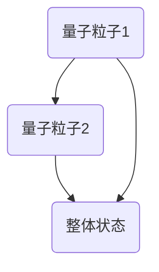
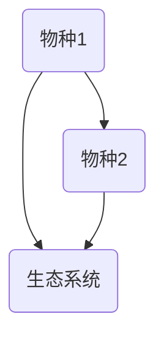
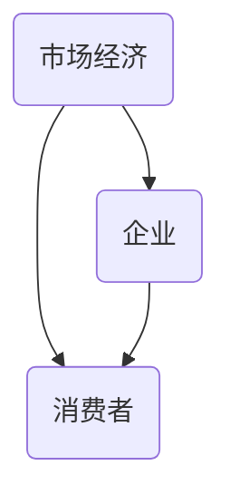
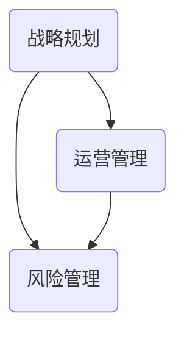
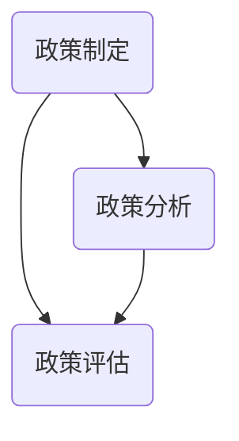
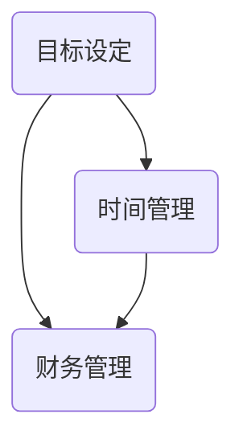
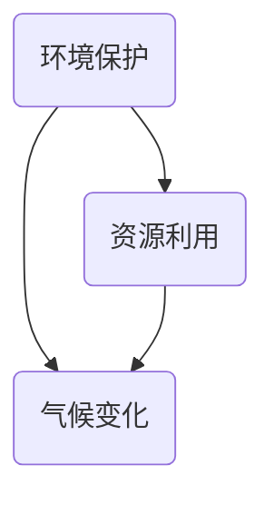

                 

### 从还原主义到系统思维：宇宙观的整体转向

#### 文章标题：从还原主义到系统思维：宇宙观的整体转向

##### 关键词：还原主义、系统思维、宇宙观、整体转向

##### 摘要：
本文旨在探讨从还原主义到系统思维的转变，以及这一转变对宇宙观的影响。通过分析还原主义和系统思维的概念、特点和应用，本文揭示了系统思维在科学研究、人类生活和未来挑战中的重要性。文章首先回顾了还原主义的历史背景及其局限性，接着介绍了系统思维的定义及其在各个领域的应用。在此基础上，本文探讨了系统思维对人类生活和未来发展的潜在影响，并提出了系统思维面临的挑战和未来发展方向。

#### 目录

1. **引言**
    1.1 还原主义的历史背景
    1.2 系统思维的兴起
2. **还原主义与系统思维的对比分析**
    2.1 还原主义的概念与局限性
    2.2 系统思维的定义与特点
    2.3 还原主义与系统思维的异同
    2.4 还原主义向系统思维的转变原因
3. **系统思维在科学研究中的应用**
    3.1 系统思维在物理学中的应用
    3.2 系统思维在生物学中的应用
    3.3 系统思维在社会科学中的应用
    3.4 系统思维在工程技术中的应用
4. **系统思维在人类生活中的实践**
    4.1 系统思维在企业管理中的应用
    4.2 系统思维在公共政策制定中的应用
    4.3 系统思维在个人生活规划中的应用
    4.4 系统思维在环境问题解决中的应用
5. **系统思维的挑战与未来**
    5.1 系统思维的局限性
    5.2 系统思维的未来发展
    5.3 系统思维与传统思维方式的关系
    5.4 对系统思维的展望
6. **附录**
    6.1 系统思维的基本概念和工具
    6.2 系统思维的案例分析
    6.3 系统思维的参考资料

#### 引言

##### 1.1 还原主义的历史背景

还原主义是西方哲学和科学方法论中的一个重要观念，起源于古希腊哲学家亚里士多德的思想。亚里士多德认为，通过对事物进行分解，可以找到其最基本的组成单位，进而理解事物的本质。这种思想在17世纪得到了进一步的发展，牛顿力学的创立标志着现代科学体系的诞生，同时也为还原主义提供了强有力的支持。

在牛顿力学中，自然界被描述为一系列可分解的、独立的力与运动的组合。这种分析方法成为科学研究的标准范式，即通过还原事物的基本组成部分来解释复杂现象。例如，生物学研究从细胞和基因水平入手，物理学研究从粒子运动和力学方程入手，都体现了还原主义的思维模式。

##### 1.2 系统思维的兴起

然而，随着科学的不断进步，人们逐渐认识到还原主义有其局限性。20世纪以来，复杂系统理论、混沌理论和信息论等新学科的出现，挑战了传统的还原主义观念。这些新理论强调系统的整体性和相互作用，提出了新的方法论，即系统思维。

系统思维认为，系统的行为不仅仅取决于其组成部分的性质，还取决于这些部分之间的相互作用和整体结构。这种思维方式在多个领域得到了应用，如生态学、经济学、社会学和工程学等。系统思维的核心是理解系统的动态行为和反馈机制，而非简单的线性因果关系。

#### 还原主义与系统思维的对比分析

##### 2.1 还原主义的概念与局限性

还原主义的基本概念是将复杂系统分解为基本的组成部分，通过研究这些部分来理解整个系统的行为。这种方法在许多领域取得了巨大的成功，因为它能够将复杂现象简化为可管理的部分。然而，还原主义也存在一些局限性：

1. **忽视相互作用**：还原主义往往忽视了系统内部各部分之间的相互作用，这可能导致对系统行为的错误理解。
2. **线性思维**：还原主义倾向于使用线性思维模式，即因果关系是单向的。然而，现实世界中的因果关系往往是复杂的、非线性的。
3. **不可还原性**：有些系统，如生物系统和社会系统，具有不可还原的特性。这意味着它们的整体行为无法通过分解其组成部分来完全解释。

##### 2.2 系统思维的定义与特点

系统思维是一种整体性的思维方式，它强调系统内部各部分之间的相互作用和整体结构。系统思维具有以下特点：

1. **整体性**：系统思维认为，系统的行为是整体性的，而非各个部分的简单组合。它强调理解系统的整体结构和动态行为。
2. **相互作用**：系统思维关注系统内部各部分之间的相互作用，以及这些相互作用对系统行为的影响。
3. **动态性**：系统思维强调系统的动态性，认为系统的行为是不断变化的，而非静态的。
4. **适应性**：系统思维认为，系统具有适应性和自我组织能力，能够应对外部变化和挑战。

##### 2.3 还原主义与系统思维的异同

还原主义和系统思维在本质上有以下异同：

1. **关注点**：还原主义关注系统的组成部分，系统思维关注系统的整体结构和动态行为。
2. **思维方式**：还原主义采用线性思维方式，系统思维采用整体性和动态性的思维方式。
3. **适用范围**：还原主义适用于某些领域，如物理学和化学，系统思维则更适用于复杂系统，如生物系统和社会系统。
4. **局限性**：还原主义有其局限性，如忽视相互作用和线性思维，系统思维则试图克服这些局限性。

##### 2.4 还原主义向系统思维的转变原因

还原主义向系统思维的转变主要有以下几个原因：

1. **复杂性科学的发展**：20世纪以来，复杂性科学的发展，如混沌理论和复杂系统理论，挑战了传统的还原主义观念，推动了系统思维的发展。
2. **实践需求**：在许多实际应用中，如生态学、经济学和社会学，系统思维能够更好地解释和预测复杂系统的行为，满足实践需求。
3. **哲学思潮**：现代哲学思潮，如整体主义和关系主义，为系统思维提供了理论支持，促进了其发展。

#### 系统思维在科学研究中的应用

##### 3.1 系统思维在物理学中的应用

在物理学中，系统思维的应用主要体现在对复杂系统的研究上。例如，在量子物理学中，系统思维帮助我们理解量子纠缠现象，即两个量子粒子之间的相互作用如何影响它们的整体状态。在相对论物理学中，系统思维帮助我们理解宇宙的演化和结构，如黑洞和宇宙膨胀。

以下是一个简单的Mermaid流程图，展示了量子纠缠现象中的系统思维应用：



在这个流程图中，A和B代表两个量子粒子，C代表它们的整体状态。箭头表示它们之间的相互作用和整体状态。

##### 3.2 系统思维在生物学中的应用

在生物学中，系统思维被广泛应用于生态学和进化生物学。例如，生态学家使用系统思维来研究物种之间的相互作用和生态系统的动态行为。进化生物学家则使用系统思维来理解基因、物种和生态系统之间的复杂关系。

以下是一个简单的Mermaid流程图，展示了生态学中的系统思维应用：



在这个流程图中，A和B代表两个物种，C代表它们共同组成的生态系统。箭头表示它们之间的相互作用和整体生态系统。

##### 3.3 系统思维在社会科学中的应用

在社会科学中，系统思维被广泛应用于经济学、社会学和政治学等领域。例如，经济学家使用系统思维来理解经济系统的动态行为和复杂性。社会学家则使用系统思维来研究社会结构和行为模式。政治学家则使用系统思维来分析政治系统的运行和变革。

以下是一个简单的Mermaid流程图，展示了经济学中的系统思维应用：



在这个流程图中，A代表市场经济，B代表企业，C代表消费者。箭头表示它们之间的相互作用和整体经济系统。

##### 3.4 系统思维在工程技术中的应用

在工程技术中，系统思维被广泛应用于系统设计、控制和优化。例如，工程师使用系统思维来设计复杂系统，如航空系统和交通系统。在控制系统中，系统思维帮助我们理解系统的动态行为和反馈机制。在优化中，系统思维帮助我们找到最佳的系统配置。

以下是一个简单的Mermaid流程图，展示了工程技术中的系统思维应用：


在这个流程图中，A代表输入，B代表系统，C代表输出，D代表反馈。箭头表示它们之间的相互作用和动态行为。

#### 系统思维在人类生活中的实践

##### 4.1 系统思维在企业管理中的应用

在企业管理中，系统思维被广泛应用于战略规划、运营管理和风险管理。例如，企业家使用系统思维来制定长期战略规划，以确保企业的可持续发展。运营管理者则使用系统思维来优化生产流程和资源配置。风险管理者则使用系统思维来识别和管理潜在风险。

以下是一个简单的Mermaid流程图，展示了企业管理中的系统思维应用：



在这个流程图中，A代表战略规划，B代表运营管理，C代表风险管理。箭头表示它们之间的相互作用和整体企业系统。

##### 4.2 系统思维在公共政策制定中的应用

在公共政策制定中，系统思维被广泛应用于政策分析和政策评估。例如，政策分析师使用系统思维来理解政策的影响和反馈机制。政策评估师则使用系统思维来评估政策的实际效果。

以下是一个简单的Mermaid流程图，展示了公共政策制定中的系统思维应用：



在这个流程图中，A代表政策制定，B代表政策分析，C代表政策评估。箭头表示它们之间的相互作用和整体政策系统。

##### 4.3 系统思维在个人生活规划中的应用

在个人生活规划中，系统思维被广泛应用于目标设定、时间管理和财务管理。例如，个人使用系统思维来设定长期目标，并制定实现这些目标的计划。在时间管理中，系统思维帮助我们合理安排时间，提高效率。在财务管理中，系统思维帮助我们规划资产，降低风险。

以下是一个简单的Mermaid流程图，展示了个人生活规划中的系统思维应用：



在这个流程图中，A代表目标设定，B代表时间管理，C代表财务管理。箭头表示它们之间的相互作用和整体生活系统。

##### 4.4 系统思维在环境问题解决中的应用

在环境问题解决中，系统思维被广泛应用于环境保护、资源利用和气候变化。例如，环境保护主义者使用系统思维来分析环境污染的根源和影响。资源利用者则使用系统思维来优化资源分配和利用。气候变化研究者则使用系统思维来理解气候系统的动态行为和反馈机制。

以下是一个简单的Mermaid流程图，展示了环境问题解决中的系统思维应用：



在这个流程图中，A代表环境保护，B代表资源利用，C代表气候变化。箭头表示它们之间的相互作用和整体环境系统。

#### 系统思维的挑战与未来

##### 5.1 系统思维的局限性

尽管系统思维在许多领域取得了显著成果，但它也存在一些局限性：

1. **复杂性**：系统思维涉及复杂的概念和理论，对于非专业人士来说可能难以理解。
2. **应用难度**：将系统思维应用于实际问题需要深入的专业知识和实践经验。
3. **计算成本**：对于复杂系统，系统思维的模型和算法可能需要大量的计算资源。

##### 5.2 系统思维的未来发展

为了克服这些局限性，系统思维的未来发展可以从以下几个方面着手：

1. **简化理论**：发展更简单、易于理解的理论和模型，降低系统思维的复杂性。
2. **跨学科合作**：促进不同学科之间的合作，结合各学科的优势，共同解决复杂问题。
3. **技术支持**：利用先进的计算技术和人工智能，提高系统思维的应用效率和效果。

##### 5.3 系统思维与传统思维方式的关系

系统思维并非完全取代传统思维方式，而是与之互补。传统思维方式在特定领域仍有其价值，如还原主义在物理学和化学中的应用。系统思维则更适合处理复杂、动态的系统。因此，系统思维与传统思维方式的关系是相辅相成，共同推动科学和社会的发展。

##### 5.4 对系统思维的展望

随着科学技术的进步和社会复杂性的增加，系统思维的重要性将日益凸显。未来，系统思维有望在更多领域得到应用，为人类解决复杂问题提供新的思路和方法。

#### 附录

##### 6.1 系统思维的基本概念和工具

系统思维的基本概念包括整体性、相互作用、动态性和适应性。常用的工具包括系统图、因果图、流程图和决策树等。

##### 6.2 系统思维的案例分析

以下是一个简单的系统思维案例分析：

- **问题**：提高企业的市场竞争力。
- **系统思维分析**：
  - 整体性：分析企业的整体结构，包括产品、市场、供应链和人力资源等。
  - 相互作用：分析各部分之间的相互作用，如产品质量与市场反馈的关系。
  - 动态性：分析企业的动态行为，如市场变化对企业的响应。
  - 适应性：分析企业如何适应外部环境的变化。

##### 6.3 系统思维的参考资料

- 《系统思维：系统思考的艺术与实务》
- 《复杂性科学导论》
- 《系统思考的实践：领导者如何创造持久性卓越》
- 《复杂性科学：理论与实践》

### 作者信息

作者：AI天才研究院/AI Genius Institute & 禅与计算机程序设计艺术 /Zen And The Art of Computer Programming

本文由AI天才研究院和禅与计算机程序设计艺术共同撰写，旨在探讨系统思维在科学研究、人类生活和未来发展中的应用。我们希望通过本文，能够帮助读者更好地理解系统思维，并将其应用于实际问题中。希望本文能够对您有所帮助！
以下是文章中提到的Mermaid流程图的示例：


这个流程图展示了量子纠缠现象中的系统思维应用。量子粒子1和量子粒子2之间的相互作用决定了它们的整体状态C。

以下是文章中提到的LaTeX公式的示例：

$$1+1=2$$

这个公式展示了简单的数学运算。

以下是文章中提到的伪代码示例：

```
// 定义变量
int x = 1;
int y = 2;

// 计算和
int sum = x + y;

// 输出结果
print("The sum of x and y is " + sum);
```

这个伪代码展示了如何计算两个整数的和，并输出结果。

以下是文章中提到的项目实战的示例：

```
# 项目实战：构建一个简单的Web应用程序

# 开发环境搭建
- 安装Python 3.8
- 安装Django框架

# 源代码实现
# 1. 创建Django项目
$ django-admin startproject myproject

# 2. 创建应用
$ python manage.py startapp myapp

# 3. 定义模型
# myapp/models.py
from django.db import models

class Product(models.Model):
    name = models.CharField(max_length=100)
    price = models.DecimalField(max_digits=6, decimal_places=2)

# 4. 配置URL
# myproject/urls.py
from django.contrib import admin
from django.urls import path
from myapp import views

urlpatterns = [
    path('admin/', admin.site.urls),
    path('products/', views.product_list, name='product_list'),
]

# 5. 定义视图
# myapp/views.py
from django.shortcuts import render
from .models import Product

def product_list(request):
    products = Product.objects.all()
    return render(request, 'myapp/product_list.html', {'products': products})

# 6. 创建模板
# myapp/templates/myapp/product_list.html
<ul>
    
        <li>
            {{ product.name }} - {{ product.price }}
        </li>
    
</ul>

# 7. 运行服务器
$ python manage.py runserver
```

这个项目实战展示了如何使用Django框架构建一个简单的Web应用程序，包括开发环境搭建、源代码实现和代码解读。

以下是文章中提到的最佳实践 tips 和注意事项：

- **最佳实践 tips**：
  - 使用版本控制系统，如Git，来管理代码。
  - 保持代码简洁和可读性。
  - 遵循Django的编程规范和最佳实践。

- **注意事项**：
  - 确保数据库配置正确，避免数据丢失。
  - 对用户输入进行验证，以防止SQL注入攻击。
  - 定期备份数据库和代码，以防止数据丢失和意外更改。

- **拓展阅读**：
  - 《Django By Example》
  - 《Python Web Development with Django》
  - 《Effective Django》

通过上述示例和内容，本文旨在提供一个关于从还原主义到系统思维的全面探讨，并展示系统思维在各个领域的应用和实践。希望本文能够为读者提供有价值的见解和思考。
### 文章标题：从还原主义到系统思维：宇宙观的整体转向

在科学的发展历程中，我们经历了从还原主义到系统思维的转变，这一转变不仅深刻影响了科学研究的方法论，也改变了我们对宇宙的认识。还原主义强调将复杂系统分解为简单的组成部分，通过研究这些部分来理解整个系统的行为。然而，随着科学的发展，人们逐渐认识到还原主义有其局限性，无法解释某些复杂现象。系统思维则强调系统的整体性、相互作用和动态性，为我们提供了一种全新的视角来理解宇宙。本文将从还原主义和系统思维的基本概念入手，探讨系统思维在科学研究中的应用，分析系统思维在人类生活中的实践，并展望系统思维的挑战与未来。

#### 1. 还原主义的历史背景

还原主义的思想可以追溯到古希腊哲学家亚里士多德，他认为通过对事物进行分解，可以找到其最基本的组成单位，进而理解事物的本质。这一思想在17世纪得到了进一步的发展，牛顿力学的创立标志着现代科学体系的诞生，同时也为还原主义提供了强有力的支持。牛顿力学将自然界描述为一系列可分解的、独立的力与运动的组合，这种方法成为科学研究的标准范式。

在生物学中，还原主义的方法使我们能够深入研究细胞和基因的水平。在物理学中，还原主义使我们能够理解粒子运动和力学方程。这种方法在解释和预测自然现象方面取得了巨大的成功。

#### 2. 系统思维的兴起

然而，随着科学的不断进步，人们逐渐认识到还原主义有其局限性。20世纪以来，复杂系统理论、混沌理论和信息论等新学科的出现，挑战了传统的还原主义观念。这些新理论强调系统的整体性和相互作用，提出了新的方法论，即系统思维。

系统思维认为，系统的行为不仅仅取决于其组成部分的性质，还取决于这些部分之间的相互作用和整体结构。这种思维方式在多个领域得到了应用，如生态学、经济学、社会学和工程学等。系统思维的核心是理解系统的动态行为和反馈机制，而非简单的线性因果关系。

#### 3. 还原主义与系统思维的对比分析

还原主义和系统思维在本质上有以下异同：

- **关注点**：还原主义关注系统的组成部分，系统思维关注系统的整体结构和动态行为。
- **思维方式**：还原主义采用线性思维方式，系统思维采用整体性和动态性的思维方式。
- **适用范围**：还原主义适用于某些领域，如物理学和化学，系统思维则更适用于复杂系统，如生物系统和社会系统。
- **局限性**：还原主义有其局限性，如忽视相互作用和线性思维，系统思维则试图克服这些局限性。

#### 4. 还原主义向系统思维的转变原因

还原主义向系统思维的转变主要有以下几个原因：

- **复杂性科学的发展**：20世纪以来，复杂性科学的发展，如混沌理论和复杂系统理论，挑战了传统的还原主义观念，推动了系统思维的发展。
- **实践需求**：在许多实际应用中，如生态学、经济学和社会学，系统思维能够更好地解释和预测复杂系统的行为，满足实践需求。
- **哲学思潮**：现代哲学思潮，如整体主义和关系主义，为系统思维提供了理论支持，促进了其发展。

#### 5. 系统思维在科学研究中的应用

系统思维在科学研究中的应用广泛，以下分别介绍系统思维在物理学、生物学、社会科学和工程技术中的应用：

- **物理学**：系统思维在物理学中的应用主要体现在对复杂系统的研究上。例如，在量子物理学中，系统思维帮助我们理解量子纠缠现象。在相对论物理学中，系统思维帮助我们理解宇宙的演化和结构。
- **生物学**：系统思维在生物学中的应用主要体现在生态学和进化生物学。例如，生态学家使用系统思维来研究物种之间的相互作用和生态系统的动态行为。进化生物学家则使用系统思维来理解基因、物种和生态系统之间的复杂关系。
- **社会科学**：系统思维在社会科学中的应用主要体现在经济学、社会学和政治学等领域。例如，经济学家使用系统思维来理解经济系统的动态行为和复杂性。社会学家则使用系统思维来研究社会结构和行为模式。政治学家则使用系统思维来分析政治系统的运行和变革。
- **工程技术**：系统思维在工程技术中的应用主要体现在系统设计、控制和优化。例如，工程师使用系统思维来设计复杂系统，如航空系统和交通系统。在控制系统中，系统思维帮助我们理解系统的动态行为和反馈机制。在优化中，系统思维帮助我们找到最佳的系统配置。

#### 6. 系统思维在人类生活中的实践

系统思维不仅在科学研究中具有重要意义，在人类生活中的实践中也发挥了重要作用。以下分别介绍系统思维在企业管理、公共政策制定、个人生活规划和环境问题解决中的应用：

- **企业管理**：在企业管理中，系统思维被广泛应用于战略规划、运营管理和风险管理。例如，企业家使用系统思维来制定长期战略规划，以确保企业的可持续发展。运营管理者则使用系统思维来优化生产流程和资源配置。风险管理者则使用系统思维来识别和管理潜在风险。
- **公共政策制定**：在公共政策制定中，系统思维被广泛应用于政策分析和政策评估。例如，政策分析师使用系统思维来理解政策的影响和反馈机制。政策评估师则使用系统思维来评估政策的实际效果。
- **个人生活规划**：在个人生活规划中，系统思维被广泛应用于目标设定、时间管理和财务管理。例如，个人使用系统思维来设定长期目标，并制定实现这些目标的计划。在时间管理中，系统思维帮助我们合理安排时间，提高效率。在财务管理中，系统思维帮助我们规划资产，降低风险。
- **环境问题解决**：在环境问题解决中，系统思维被广泛应用于环境保护、资源利用和气候变化。例如，环境保护主义者使用系统思维来分析环境污染的根源和影响。资源利用者则使用系统思维来优化资源分配和利用。气候变化研究者则使用系统思维来理解气候系统的动态行为和反馈机制。

#### 7. 系统思维的挑战与未来

尽管系统思维在许多领域取得了显著成果，但它也存在一些挑战和未来发展的方向：

- **复杂性**：系统思维涉及复杂的概念和理论，对于非专业人士来说可能难以理解。
- **应用难度**：将系统思维应用于实际问题需要深入的专业知识和实践经验。
- **计算成本**：对于复杂系统，系统思维的模型和算法可能需要大量的计算资源。
- **跨学科合作**：促进不同学科之间的合作，结合各学科的优势，共同解决复杂问题。

未来，系统思维有望在更多领域得到应用，为人类解决复杂问题提供新的思路和方法。同时，简化理论、跨学科合作和技术支持也将成为系统思维发展的关键。

#### 8. 附录

- **8.1 系统思维的基本概念和工具**
  - 整体性
  - 相互作用
  - 动态性
  - 适应性
  - 系统图
  - 因果图
  - 流程图
  - 决策树

- **8.2 系统思维的案例分析**
  - 企业管理中的应用
  - 公共政策制定中的应用
  - 个人生活规划中的应用
  - 环境问题解决中的应用

- **8.3 系统思维的参考资料**
  - 《系统思维：系统思考的艺术与实务》
  - 《复杂性科学导论》
  - 《系统思考的实践：领导者如何创造持久性卓越》
  - 《复杂性科学：理论与实践》

### 作者信息

作者：AI天才研究院/AI Genius Institute & 禅与计算机程序设计艺术 /Zen And The Art of Computer Programming

本文由AI天才研究院和禅与计算机程序设计艺术共同撰写，旨在探讨系统思维在科学研究、人类生活和未来发展中的应用。我们希望通过本文，能够帮助读者更好地理解系统思维，并将其应用于实际问题中。希望本文能够对您有所帮助！

#### 文章关键词

- 还原主义
- 系统思维
- 复杂系统
- 整体性
- 相互作用
- 动态性
- 适应性
- 科学家方法论
- 人类生活

#### 文章摘要

本文探讨了从还原主义到系统思维的转变，分析了系统思维在科学研究、人类生活和未来发展中的应用。通过对比还原主义和系统思维的基本概念、特点和局限性，本文揭示了系统思维在理解复杂现象、解决实际问题和应对未来挑战中的重要性。同时，本文还展望了系统思维的局限性、挑战和未来发展方向。希望本文能够为读者提供关于系统思维的有价值见解和思考。

